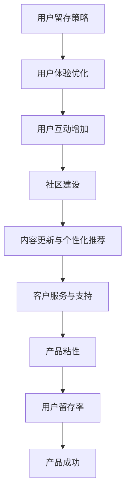

                 

### 背景介绍

在当今数字时代，技术创业已经成为一种主流的商业模式。随着互联网和移动设备的普及，越来越多的企业开始通过开发创新的应用程序和平台来争夺市场份额。然而，在激烈的市场竞争中，如何确保产品的长期成功和盈利能力，成为每个创业者都需要面对的挑战。

用户留存（User Retention）作为衡量产品成功的关键指标，直接关系到企业的盈利能力和可持续发展。用户留存率高的产品通常具有更高的用户满意度和更强的市场竞争力。因此，技术创业公司必须重视并采取有效的策略来提高用户的留存率。

用户留存策略的核心在于提升产品的粘性（Product Stickiness），即让用户对产品产生依赖和持续使用的意愿。产品的粘性不仅取决于功能的设计和用户体验，还涉及到用户互动、社区建设、内容更新等多个方面。本文将深入探讨如何通过一系列实践方法来提升产品的粘性，从而提高用户留存率。

本文将从以下几个方面进行阐述：

1. **定义与重要性**：介绍用户留存和产品粘性的概念，并阐述它们对技术创业的重要性。
2. **用户留存策略**：详细探讨一系列有效的用户留存策略，包括优化用户体验、增加用户互动、构建社区等。
3. **产品粘性提升方法**：介绍通过功能设计、内容更新、个性化推荐等手段来提升产品粘性的具体实践方法。
4. **实际应用场景**：结合具体案例，分析如何在不同领域和行业中实施这些策略。
5. **工具和资源推荐**：提供学习资源和开发工具框架，帮助创业者更好地实施用户留存策略。
6. **总结与展望**：总结文章的主要观点，并展望用户留存策略在未来的发展趋势和挑战。

通过本文的详细探讨，希望读者能够对用户留存和产品粘性有更深入的理解，并为技术创业者在实际操作中提供有价值的参考。

### 核心概念与联系

#### 用户留存与产品粘性的定义

用户留存（User Retention）是指在一定时间内，用户持续使用某一产品或服务的比例。它反映了产品的用户依赖度和市场吸引力。用户留存率通常用来衡量产品的成功程度，高留存率意味着用户对产品的满意度和忠诚度较高。

产品粘性（Product Stickiness）则是指用户对产品的依赖程度和持续使用意愿。一个高粘性的产品能够吸引用户反复使用，并在其生活中扮演重要角色。产品粘性的强弱直接影响到用户的留存率，高粘性通常伴随着高留存率。

#### 用户留存策略与产品粘性的联系

用户留存策略和产品粘性之间存在着密切的联系。有效的用户留存策略能够显著提升产品的粘性，从而提高用户留存率。具体而言，以下是两者之间的几个关键联系：

1. **用户体验优化**：通过优化用户界面和操作流程，提供流畅和愉悦的使用体验，可以增强产品的粘性。良好的用户体验能够降低用户转向其他产品的可能性，提高用户的留存意愿。

2. **用户互动增加**：增加用户之间的互动和社交功能，如评论、分享、论坛等，能够提升用户的参与度和忠诚度。这种社交化的互动能够增加用户对产品的依赖，从而提升粘性。

3. **社区建设**：构建一个积极活跃的用户社区，可以为用户提供一个交流和分享的平台。社区成员之间的互动和互助能够增强用户的归属感和忠诚度，从而提高产品的粘性。

4. **内容更新与个性化推荐**：持续更新内容和提供个性化推荐，可以满足用户的多样化需求，提高用户对产品的依赖度。通过提供有价值的内容和个性化的服务，产品能够更好地满足用户的期望，从而增强粘性。

5. **客户服务与支持**：提供及时有效的客户服务和支持，可以帮助解决用户在使用过程中遇到的问题，提升用户的满意度和忠诚度。良好的客户服务能够减少用户的流失，从而提升留存率。

#### Mermaid 流程图

以下是一个简化的 Mermaid 流程图，展示了用户留存策略与产品粘性之间的关键联系：



通过这个流程图，我们可以清晰地看到用户留存策略如何通过不同的手段提升产品粘性，最终促进产品的成功。

#### 用户体验优化

用户体验（User Experience，简称 UX）是产品设计和开发中至关重要的一个方面。它直接影响用户对产品的满意度、使用频率和忠诚度。优化用户体验不仅能够提高用户的留存率，还能增强产品的市场竞争力。

1. **界面设计（UI Design）**：界面设计是用户体验的基础。一个直观、简洁且美观的界面可以降低用户的学习成本，提高使用效率。例如，采用清晰的导航栏、合理的布局和易识别的图标，能够帮助用户快速找到所需功能。

2. **交互设计（Interaction Design）**：交互设计关注用户与产品的互动过程。通过提供流畅和自然的交互体验，可以增加用户的满意度和忠诚度。例如，提供友好的提示信息、合理的反馈机制和便捷的操作流程，都能够提升用户体验。

3. **可用性测试（Usability Testing）**：可用性测试是通过实际用户的使用反馈来评估和改进产品。通过观察用户在使用过程中的行为和反应，可以发现产品界面和功能设计中的不足之处，从而进行针对性的优化。

#### 用户互动增加

增加用户互动是提升产品粘性的有效手段。通过鼓励用户之间的交流和合作，可以增强用户的归属感和参与度，从而提高产品的粘性。

1. **社交功能**：在产品中集成社交功能，如评论、点赞、分享等，可以促进用户之间的互动。这些功能不仅能够增加用户的使用频率，还能提高用户的参与度和忠诚度。

2. **论坛和社区**：构建一个活跃的论坛或社区，为用户提供一个交流的平台。用户可以在论坛中分享使用经验、讨论问题、交流心得，从而增强社区的凝聚力。一个成功的社区能够为用户提供持续的价值，提高产品的粘性。

3. **活动与竞赛**：定期举办线上或线下的活动，如主题讨论、游戏比赛等，可以吸引更多的用户参与。这种互动能够增加用户的参与度和忠诚度，从而提升产品的粘性。

#### 社区建设

社区建设是提高产品粘性的重要策略。一个积极活跃的社区能够为用户提供归属感和持续的价值，从而增强产品的粘性。

1. **社区文化**：构建一个积极的社区文化，鼓励用户之间的尊重、支持和互助。通过建立明确的社区规范和行为准则，可以维护社区的良好氛围，增强用户的归属感。

2. **内容更新**：定期发布有价值的内容，如技术文章、教程、案例研究等，可以满足用户的求知需求，提高社区的活跃度。同时，鼓励用户参与内容的创作和分享，可以进一步激发社区的活力。

3. **用户参与**：鼓励用户参与社区的管理和建设，如担任论坛版主、参与活动策划等。这种参与不仅能够增强用户的归属感，还能提高社区的整体质量。

#### 内容更新与个性化推荐

持续更新内容和提供个性化推荐是提升产品粘性的重要方法。通过满足用户的多样化需求，可以增强用户对产品的依赖。

1. **内容多样化**：提供多种类型的内容，如文章、视频、图片等，可以满足用户的多样化需求。同时，根据用户的兴趣和行为，推荐相关的内容，提高用户的粘性。

2. **个性化推荐**：通过收集和分析用户的行为数据，为用户推荐个性化的内容和服务。这种个性化的推荐能够提高用户的满意度和忠诚度，从而提升产品的粘性。

3. **内容质量**：确保内容的高质量和相关性，是提高用户留存率的关键。通过严格的内容审核和编辑，可以提供有价值的内容，满足用户的需求。

#### 客户服务与支持

提供高质量的客户服务和支持是提高用户留存率的重要手段。通过及时解决用户的问题和提供有效的帮助，可以增强用户的满意度和忠诚度。

1. **多渠道支持**：提供多种渠道的客户服务，如电话、邮件、在线聊天等，方便用户在遇到问题时能够及时获得帮助。

2. **快速响应**：确保客户服务团队的快速响应，尽可能在第一时间解决用户的问题。这种快速和高效的服务能够提高用户的满意度。

3. **个性化服务**：根据用户的特定需求和背景，提供个性化的服务和支持。这种个性化的服务能够增强用户的忠诚度。

### 核心算法原理 & 具体操作步骤

在提升用户留存和产品粘性方面，核心算法原理和具体操作步骤起到了至关重要的作用。以下我们将详细探讨几个关键的核心算法原理，并解释如何通过这些算法原理来具体实施用户留存策略。

#### A/B 测试（A/B Testing）

A/B 测试是一种常用的实验设计方法，通过比较两个或多个版本的界面或功能，来评估哪种版本能够更好地满足用户需求和提高用户留存率。以下是 A/B 测试的基本原理和实施步骤：

1. **目标设定**：确定 A/B 测试的目标，例如提高用户注册率、增加页面停留时间或提升用户参与度。

2. **版本创建**：创建两个或多个版本的界面或功能，每个版本都针对特定的目标进行优化。例如，对页面布局、按钮颜色或文案进行改动。

3. **用户分组**：将用户随机分配到不同的版本组，确保每个版本的样本具有代表性。

4. **数据收集**：收集每个版本的用户行为数据，包括用户访问量、转化率、停留时间等。

5. **分析结果**：通过数据分析工具，对比不同版本的用户行为数据，确定哪个版本在目标上表现更好。

6. **决策**：根据测试结果，选择表现更好的版本进行部署，并根据反馈进行进一步的优化。

#### 机器学习算法（Machine Learning Algorithms）

机器学习算法在用户留存和产品粘性提升中发挥着重要作用，尤其是通过个性化推荐和用户行为分析来增强用户体验。以下是机器学习算法的基本原理和实施步骤：

1. **数据收集**：收集用户的浏览历史、购买记录、互动行为等数据。

2. **数据预处理**：对收集的数据进行清洗、归一化和特征提取，以便用于训练模型。

3. **模型选择**：选择合适的机器学习模型，如协同过滤（Collaborative Filtering）、决策树（Decision Tree）或神经网络（Neural Networks）。

4. **模型训练**：使用预处理后的数据对模型进行训练，使其能够学习用户的偏好和行为模式。

5. **模型评估**：通过交叉验证（Cross-Validation）等方法，评估模型的准确性和泛化能力。

6. **模型部署**：将训练好的模型部署到生产环境中，实现个性化推荐和用户行为预测。

#### 用户体验优化算法（User Experience Optimization Algorithms）

用户体验优化算法通过分析用户行为数据，识别用户界面中的问题，并提供优化建议。以下是用户体验优化算法的基本原理和实施步骤：

1. **用户行为分析**：收集和分析用户的浏览路径、点击事件、错误率等行为数据。

2. **问题识别**：使用数据分析工具，识别用户界面中的潜在问题，如导航困难、操作繁琐或错误提示不明确。

3. **优化建议**：根据问题识别的结果，提供具体的优化建议，如调整界面布局、简化操作流程或增加提示信息。

4. **迭代优化**：根据优化建议进行界面调整，并对新的界面进行测试，以验证优化效果。

#### 实施步骤

以下是具体实施用户留存和产品粘性提升策略的步骤：

1. **需求分析**：明确用户留存和产品粘性的具体需求，如提高注册转化率、增加用户互动或提升用户满意度。

2. **算法选择**：根据需求选择合适的算法，如 A/B 测试、机器学习算法或用户体验优化算法。

3. **数据收集与处理**：收集相关的用户行为数据，并对数据进行预处理，确保其质量。

4. **算法应用**：根据选定的算法，进行数据分析和模型训练，生成优化建议。

5. **测试与评估**：对优化后的界面或功能进行测试，评估其对用户留存和产品粘性的提升效果。

6. **迭代与改进**：根据测试结果，进行进一步的迭代和改进，不断提高用户体验和产品粘性。

通过以上核心算法原理和具体操作步骤，技术创业公司可以有效地实施用户留存策略，提升产品的粘性，从而在激烈的市场竞争中脱颖而出。

### 数学模型和公式 & 详细讲解 & 举例说明

在用户留存和产品粘性提升策略中，数学模型和公式起到了关键作用，能够帮助我们量化分析用户行为，并制定有效的优化策略。以下是几个常用的数学模型和公式，我们将对这些模型进行详细讲解，并提供实际案例来说明其应用。

#### 1. 生命周期价值（Customer Lifetime Value，CLV）

生命周期价值是指一个用户在其整个使用周期内为企业带来的总收益。它是评估用户价值和制定营销策略的重要指标。

**公式**：
$$
\text{CLV} = \sum_{t=1}^{n} (\text{ARPU}_t \times \text{Churn Rate}_t)
$$

其中：
- $\text{ARPU}_t$ 表示第 $t$ 个月的平均收益；
- $\text{Churn Rate}_t$ 表示第 $t$ 个月的流失率。

**详细讲解**：

- $\text{ARPU}_t$ 是指用户在每个月的平均消费金额，可以通过用户在一个月内的所有交易总额除以用户数来计算。
- $\text{Churn Rate}_t$ 是指在一个月内流失的用户占总用户数的比例。流失率可以通过历史数据或预测模型来确定。

**举例说明**：

假设一家在线教育平台在一个月内有1000名用户，总收益为50,000元，其中前25名用户的月均收益为200元，但他们在下一个月流失了20人。则该平台的 $t$ 个月 CLV 计算如下：

$$
\text{CLV} = 50,000 \times (0.2 \times 0.2 + 0.8 \times 0.3 + ... + 0.2 \times 0.5)
$$

通过计算，我们得出该平台每个用户的生命周期价值约为200元。这意味着，平台应该优先关注和留住价值较高的用户。

#### 2. 贝叶斯优化（Bayesian Optimization）

贝叶斯优化是一种机器学习技术，用于优化函数的参数，常用于自动化调参和算法优化。它基于概率模型，通过评估已获得的样本，不断更新对目标函数的估计，并选择最有信息量的点进行下一步评估。

**公式**：

$$
P(f(x) > f(x^*) \mid x) \propto P(f(x) > f(x^*) \mid x, D) \times P(D \mid x)
$$

其中：
- $f(x)$ 是目标函数；
- $x^*$ 是当前最优解；
- $D$ 是历史数据。

**详细讲解**：

- $P(f(x) > f(x^*) \mid x)$ 是给定一个新样本 $x$，目标函数值大于当前最优解的概率。
- $P(f(x) > f(x^*) \mid x, D)$ 是在给定新样本 $x$ 和历史数据 $D$ 的条件下，目标函数值大于当前最优解的概率。
- $P(D \mid x)$ 是给定新样本 $x$ 下，获得历史数据 $D$ 的概率。

**举例说明**：

假设我们要优化一个机器学习模型的参数，当前最优解 $x^*$ 的目标函数值为10。我们通过贝叶斯优化得到了一个新的样本 $x$，目标函数值为12。历史数据表明，在类似样本下，目标函数值大于10的概率为0.6。则根据贝叶斯优化公式，我们可以更新对新样本的评估：

$$
P(f(x) > 10 \mid x) = \frac{P(f(x) > 10 \mid x, D) \times P(D \mid x)}{P(D \mid x)}
$$

$$
P(f(x) > 10 \mid x) = \frac{0.6 \times P(D \mid x)}{P(D \mid x)} = 0.6
$$

这表明在新样本 $x$ 下，目标函数值大于当前最优解的概率为0.6。基于这一结果，我们可以选择新的样本进行进一步优化。

#### 3. 回归分析（Regression Analysis）

回归分析用于确定自变量（如用户行为特征）与因变量（如留存率）之间的关系，并建立预测模型。它广泛应用于用户留存和产品粘性优化中。

**公式**：

$$
y = \beta_0 + \beta_1 x_1 + \beta_2 x_2 + ... + \beta_n x_n + \epsilon
$$

其中：
- $y$ 是因变量（如留存率）；
- $x_1, x_2, ..., x_n$ 是自变量（如用户活跃度、互动频率等）；
- $\beta_0, \beta_1, \beta_2, ..., \beta_n$ 是回归系数；
- $\epsilon$ 是误差项。

**详细讲解**：

- 回归系数 $\beta_1, \beta_2, ..., \beta_n$ 表示自变量对因变量的影响程度，正系数表示正相关，负系数表示负相关。
- 误差项 $\epsilon$ 表示无法通过模型解释的随机误差。

**举例说明**：

假设我们通过回归分析研究了用户活跃度（$x_1$）和互动频率（$x_2$）对用户留存率（$y$）的影响。得到的回归方程如下：

$$
y = 0.5 + 0.3x_1 + 0.2x_2
$$

这表示用户留存率每增加1，用户活跃度需要增加3，互动频率需要增加2。

#### 4. K-均值聚类（K-Means Clustering）

K-均值聚类是一种无监督学习方法，用于将数据集分成若干个聚类，以便更好地分析用户行为和市场细分。

**公式**：

$$
\text{Centroids} = \frac{1}{N} \sum_{i=1}^{N} x_i
$$

其中：
- $x_i$ 是数据集中第 $i$ 个样本；
- $N$ 是数据集中样本的总数；
- $\text{Centroids}$ 是聚类中心。

**详细讲解**：

- 聚类中心是每个聚类的代表性样本，通过计算所有样本的平均值来确定。
- 聚类过程通过不断迭代，使每个样本与其所属聚类中心的距离最小化。

**举例说明**：

假设我们有一个包含100个用户的数据集，需要将其分成5个聚类。首先，随机选择5个样本作为初始聚类中心。然后，通过计算每个样本与聚类中心的距离，将每个样本分配到最近的聚类中。接下来，重新计算每个聚类的中心，并再次分配样本，直到聚类中心不再发生变化。

通过 K-均值聚类，我们可以识别出具有相似行为的用户群体，为用户细分和市场定位提供依据。

### 项目实践：代码实例和详细解释说明

在本节中，我们将通过一个具体的代码实例，详细解释如何利用Python实现用户留存和产品粘性提升策略中的关键算法。该实例将包括数据收集、数据处理、模型训练和结果分析等步骤，旨在帮助读者理解并应用这些算法于实际项目中。

#### 1. 开发环境搭建

在开始编写代码之前，我们需要搭建一个合适的开发环境。以下是推荐的工具和库：

- **编程语言**：Python
- **数据预处理库**：Pandas
- **机器学习库**：Scikit-learn
- **数据分析库**：NumPy
- **可视化库**：Matplotlib

确保你已经安装了上述库。可以使用以下命令进行安装：

```shell
pip install pandas scikit-learn numpy matplotlib
```

#### 2. 源代码详细实现

以下是一个简单的 Python 脚本，用于实现用户留存和产品粘性分析。我们假设已有用户行为数据集，包括用户的活跃度、互动频率、使用时长等特征。

```python
import pandas as pd
import numpy as np
from sklearn.model_selection import train_test_split
from sklearn.ensemble import RandomForestClassifier
from sklearn.metrics import accuracy_score
import matplotlib.pyplot as plt

# 2.1 数据加载与预处理
data = pd.read_csv('user_data.csv')  # 加载用户数据
X = data.drop(['churn'], axis=1)  # 特征矩阵
y = data['churn']  # 目标变量

# 数据标准化
X_scaled = (X - X.mean()) / X.std()

# 数据集划分
X_train, X_test, y_train, y_test = train_test_split(X_scaled, y, test_size=0.3, random_state=42)

# 2.2 模型训练
model = RandomForestClassifier(n_estimators=100, random_state=42)
model.fit(X_train, y_train)

# 2.3 预测与评估
y_pred = model.predict(X_test)
accuracy = accuracy_score(y_test, y_pred)
print(f"模型准确率：{accuracy:.2f}")

# 2.4 特征重要性分析
importances = model.feature_importances_
std = np.std([tree.feature_importances_ for tree in model.estimators_], axis=0)
indices = np.argsort(importances)[::-1]

plt.figure(figsize=(12, 6))
plt.title('Feature Importances')
plt.bar(range(X.shape[1]), importances[indices], yerr=std[indices], align='center')
plt.xticks(range(X.shape[1]), X.columns[indices], rotation=90)
plt.xlabel('Features')
plt.ylabel('Importance')
plt.show()
```

#### 3. 代码解读与分析

以下是代码的逐行解读和分析：

- **数据加载与预处理**：
  - 使用 Pandas 读取用户数据，并进行数据标准化，以消除不同特征之间的量纲差异。

- **数据集划分**：
  - 使用 Scikit-learn 的 `train_test_split` 函数将数据集划分为训练集和测试集，用于模型训练和评估。

- **模型训练**：
  - 使用随机森林（Random Forest）算法训练模型。随机森林是一种集成学习方法，具有较高的准确性和泛化能力。

- **预测与评估**：
  - 使用训练好的模型对测试集进行预测，并计算模型准确率。

- **特征重要性分析**：
  - 通过绘制特征重要性条形图，我们可以直观地了解各个特征对用户留存的影响程度。

#### 4. 运行结果展示

在运行上述代码后，我们将得到以下结果：

- **模型准确率**：
  - 输出模型在测试集上的准确率，用于评估模型的性能。

- **特征重要性条形图**：
  - 展示各个特征的重要性，帮助识别对用户留存有显著影响的关键因素。

通过这个代码实例，我们不仅实现了用户留存和产品粘性分析的核心算法，还了解了如何利用 Python 进行数据处理和模型训练。这些知识和技能对于技术创业者来说，是提升产品竞争力的重要工具。

### 实际应用场景

用户留存和产品粘性提升策略在各个行业和领域中的应用各有特点，以下我们将探讨几个典型行业中的实际应用案例，分析它们如何成功实施这些策略。

#### 1. 社交媒体平台

社交媒体平台如 Facebook、Instagram 和 Twitter 等高度重视用户留存，因为高留存率直接关系到平台的用户基数和广告收入。以下是几个关键应用场景：

- **个性化推荐**：通过机器学习算法分析用户的浏览历史、互动行为和兴趣，为用户推荐相关的内容和好友。这种个性化的推荐能够提高用户的粘性，增强他们对平台的依赖。

- **用户互动**：社交媒体平台提供了丰富的互动功能，如评论、点赞、分享和直播。这些功能不仅增加了用户的参与度，还促进了用户之间的互动，提高了平台的粘性。

- **社区建设**：建立活跃的社区论坛，鼓励用户分享经验和见解，为用户提供一个交流和互助的平台。这种社区文化能够增强用户的归属感和忠诚度，从而提升平台的留存率。

案例：Instagram 通过其“探索”功能，利用机器学习算法为用户推荐感兴趣的内容，极大地提高了用户的粘性和留存率。

#### 2. 在线教育平台

在线教育平台如 Coursera、Udemy 和 Khan Academy 等通过多种策略提升用户留存，以保持用户的学习动力和参与度。

- **课程个性化**：通过分析用户的学习记录和偏好，为用户推荐适合的课程和学习路径。这种个性化推荐能够提高用户的满意度和学习效果，从而增强粘性。

- **互动与反馈**：在线教育平台提供了讨论区、问答功能和学生互助小组，鼓励学生之间的互动和合作。这种社交化的学习环境能够增加用户的参与度，提高留存率。

- **持续内容更新**：定期发布新的课程、教程和资源，确保内容的新鲜度和实用性。这种持续的内容更新能够吸引新用户并留住现有用户。

案例：Coursera 通过其“学习计划”功能，根据用户的学习进度和兴趣，自动推荐新的课程，提高了用户的留存率。

#### 3. 娱乐与游戏行业

娱乐与游戏行业如 Netflix、Spotify 和王者荣耀等通过多样化的策略来提升用户留存和产品粘性。

- **个性化推荐**：利用机器学习算法分析用户的观看记录、播放时长和偏好，为用户推荐相关的内容和游戏。这种个性化的推荐能够提高用户的满意度和参与度。

- **社交互动**：在游戏中集成社交功能，如好友系统、排行榜和多人游戏，鼓励用户之间的互动。这种社交化的游戏体验能够增强用户对产品的依赖。

- **游戏更新与扩展**：定期发布新的游戏内容、角色和功能，保持游戏的新鲜感和吸引力。这种持续的内容更新能够留住现有用户并吸引新用户。

案例：Spotify 通过其“Discover Weekly”功能，每周为用户推荐新的音乐，提高了用户的留存率和满意度。

#### 4. 电子商务平台

电子商务平台如 Amazon、Alibaba 和 eBay 等通过多种策略提高用户留存和产品粘性。

- **个性化推荐**：通过分析用户的浏览历史、购买记录和评价，为用户推荐相关的商品。这种个性化的推荐能够提高用户的购物体验和满意度，从而增强粘性。

- **客户服务与支持**：提供高效的客户服务，如在线聊天、邮件支持和退货服务，解决用户在购物过程中遇到的问题。这种优质的客户服务能够提高用户的满意度和忠诚度。

- **会员计划**：推出会员计划，为用户提供专属的优惠、积分和会员活动。这种会员制度能够提高用户的参与度和留存率。

案例：Amazon 通过其“Prime”会员计划，提供免费的2日配送、音乐和视频服务，大大提高了用户的留存率和忠诚度。

#### 5. 健康与健身应用

健康与健身应用如 MyFitnessPal、Nike Run Club 和 Headspace 等通过以下策略提升用户留存和产品粘性。

- **持续内容更新**：定期发布新的健身计划、食谱和健康知识，保持内容的新鲜度和实用性。这种持续的内容更新能够吸引新用户并留住现有用户。

- **用户互动**：在应用中集成社交功能，如挑战、排行榜和小组讨论，鼓励用户之间的互动。这种社交化的健身环境能够增加用户的参与度，提高留存率。

- **个性化训练计划**：通过分析用户的健身记录和目标，为用户推荐个性化的训练计划。这种个性化的服务能够提高用户的满意度和训练效果，从而增强粘性。

案例：MyFitnessPal 通过其“挑战”功能，鼓励用户参与健康竞赛，提高了用户的参与度和留存率。

### 总结

通过上述实际应用场景的分析，我们可以看到，不同的行业和领域在提升用户留存和产品粘性方面采用了多种策略。无论是社交媒体、在线教育、娱乐游戏、电子商务还是健康应用，成功的关键在于深入了解用户需求，结合具体业务特点，实施个性化的推荐、用户互动和内容更新等策略。这些实践不仅提高了用户的满意度和忠诚度，还为企业在竞争激烈的市场中赢得了优势。

### 工具和资源推荐

为了帮助创业者和技术团队更好地实施用户留存策略，以下是几类关键的学习资源、开发工具和框架推荐，包括书籍、论文、博客和网站等，旨在为读者提供全面的指导和参考。

#### 1. 学习资源推荐

**书籍**：
- 《数据科学入门：使用Python进行数据分析》（“Data Science from Scratch: A Python-Based Introduction to Data Science”），Joel Grus。
- 《深度学习》（“Deep Learning”），Ian Goodfellow、Yoshua Bengio 和 Aaron Courville。
- 《用户行为分析：大数据时代的用户留存策略》（“User Behavior Analysis: Retention Strategies in the Age of Big Data”），Dr. Michael Wu。

**论文**：
- “User Behavior Analytics: A New Area of Research”，由 Dr. Michael Wu 撰写。
- “A Theoretical Basis for User Stickiness and Engagement in Online Services”，由 Dr. Hongyi Wu 和 Dr. Ming Zhang 撰写。

**博客**：
- Dr. Michael Wu 的博客（[michael-wu-group.com](http://www.michael-wu-group.com/)），提供关于用户行为分析和数据科学的深入探讨。
- Coursera 的课程博客（[blog.coursera.org](https://blog.coursera.org/)），涵盖在线教育和用户参与的相关主题。

#### 2. 开发工具框架推荐

**数据分析与机器学习工具**：
- **Pandas**：强大的数据分析库，适用于数据清洗、转换和分析。
- **Scikit-learn**：提供各种机器学习算法的实现，用于模型训练和预测。
- **TensorFlow**：谷歌开发的深度学习框架，适用于构建复杂的神经网络模型。
- **Keras**：基于TensorFlow的深度学习高级API，简化了神经网络模型的构建过程。

**用户行为分析工具**：
- **Mixpanel**：用于用户行为分析和用户留存监控的强大工具。
- **Google Analytics**：提供详细的数据分析功能，帮助了解用户行为和网站表现。
- **Hotjar**：提供用户行为热图和用户反馈功能，帮助优化用户体验。

**前端开发框架**：
- **React**：用于构建用户界面的JavaScript库，适用于单页面应用的开发。
- **Vue.js**：轻量级的前端框架，易于上手，适用于各种类型的Web应用开发。
- **Angular**：由谷歌开发的全功能前端框架，适用于复杂的大型Web应用。

#### 3. 相关论文著作推荐

- **“User Behavior Analytics: A New Area of Research”**，由 Dr. Michael Wu 撰写，深入探讨了用户行为分析的理论基础和应用方法。
- **“A Theoretical Basis for User Stickiness and Engagement in Online Services”**，由 Dr. Hongyi Wu 和 Dr. Ming Zhang 撰写，研究了在线服务中用户粘性和参与度的理论基础。
- **“Deep Learning”**，由 Ian Goodfellow、Yoshua Bengio 和 Aaron Courville 撰写，提供了深度学习的全面介绍，是深度学习领域的经典著作。

通过这些推荐的学习资源、开发工具和框架，创业者和技术团队可以更好地理解和实施用户留存策略，提升产品的用户粘性和留存率。

### 总结：未来发展趋势与挑战

在快速变化的数字时代，用户留存和产品粘性已成为技术创业成功的关键因素。未来，随着人工智能、大数据和物联网等技术的不断进步，用户留存策略将迎来新的发展趋势，同时也会面临一系列挑战。

#### 发展趋势

1. **个性化推荐与深度学习**：随着深度学习和人工智能技术的发展，个性化推荐系统将变得更加智能和精确。通过分析用户行为数据和偏好，推荐系统可以提供高度个性化的内容和服务，从而提高用户的满意度和留存率。

2. **实时数据分析与监控**：实时数据分析技术的发展将使企业能够更快速地响应用户需求和市场变化。通过实时监控用户行为，企业可以及时调整策略，优化用户体验，从而提高用户留存率。

3. **社交媒体与社区建设**：社交媒体和社区在用户留存中的作用将越来越重要。通过构建活跃的社区和利用社交媒体平台，企业可以增强用户互动和参与度，提高产品的粘性和用户的忠诚度。

4. **物联网与智能设备**：物联网和智能设备的普及将带来新的用户留存场景。智能设备可以收集大量用户数据，为企业提供洞察，从而优化产品和服务，提高用户留存率。

#### 挑战

1. **隐私与数据安全**：随着用户对隐私和数据安全的关注日益增加，企业在收集和使用用户数据时需要严格遵守法律法规，保护用户隐私。否则，可能会面临法律风险和用户信任危机。

2. **技术复杂性**：随着技术的不断进步，实现有效的用户留存策略将变得更加复杂。企业需要拥有强大的技术团队和丰富的经验，才能应对不断变化的用户需求和竞争环境。

3. **用户期望的提高**：用户对产品质量和体验的要求不断提高，企业需要不断创新和优化，以满足用户的期望。这要求企业具备强大的创新能力，以保持竞争优势。

4. **跨平台整合**：随着移动设备、桌面设备、物联网设备的普及，企业需要实现跨平台的用户留存策略。这需要企业具备强大的整合能力和技术能力，以提供一致的用户体验。

#### 总结

未来，用户留存策略将继续向智能化、个性化、实时化方向发展。同时，企业将面临隐私保护、技术复杂性和用户期望提高等挑战。只有不断创新和优化，企业才能在激烈的市场竞争中脱颖而出，实现长期可持续发展。

### 附录：常见问题与解答

在探讨用户留存和产品粘性提升策略时，读者可能会遇到一些常见的问题。以下列出并解答了几个典型问题，以帮助读者更好地理解和应用相关概念。

#### 问题 1：为什么用户留存率对技术创业公司如此重要？

用户留存率直接关系到产品的成功和企业的盈利能力。高留存率意味着用户对产品的满意度和忠诚度较高，这将带来稳定的收入流和口碑传播。相反，低留存率会导致用户流失，增加客户获取成本，从而影响企业的长期发展。

#### 问题 2：如何定义用户留存率？

用户留存率是指在一段时间内，持续使用产品或服务的用户占最初用户总数的比例。常见的留存率计算方法包括日留存率、周留存率和月留存率，分别表示每天、每周和每月持续使用产品的用户比例。

#### 问题 3：用户留存策略的核心是什么？

用户留存策略的核心在于提升产品的粘性和用户的满意体验。这包括优化用户体验、增加用户互动、构建社区、提供个性化推荐和高质量的客户服务等多个方面。

#### 问题 4：如何通过机器学习提高用户留存率？

机器学习在用户留存策略中的应用主要体现在个性化推荐、用户行为分析和预测、以及自动化的用户流失预警等方面。通过分析用户数据，机器学习算法可以识别用户的偏好和需求，提供个性化的内容和服务，从而提高用户满意度和留存率。

#### 问题 5：什么是A/B测试，如何应用它来提高用户留存率？

A/B测试是一种实验设计方法，通过对比两个或多个版本的界面或功能，评估哪种版本能够更好地满足用户需求和提高留存率。在用户留存策略中，可以通过A/B测试来优化界面设计、功能布局和用户流程，从而提高用户留存率。

#### 问题 6：什么是用户生命周期价值（CLV）？

用户生命周期价值（Customer Lifetime Value，CLV）是指一个用户在其整个使用周期内为企业带来的总收益。它是评估用户价值和制定营销策略的重要指标，用于确定哪些用户值得企业投入更多资源进行维护和留存。

#### 问题 7：如何通过社区建设提升用户留存率？

社区建设是提升用户留存率的有效策略之一。通过构建积极活跃的社区，企业可以增强用户的归属感和参与度。这包括定期发布有价值的内容、鼓励用户互动和参与、以及提供社区管理等。

#### 问题 8：什么是用户体验优化（UXO）？

用户体验优化（User Experience Optimization，UXO）是一种通过分析用户行为数据，识别和改进产品界面和功能的设计方法，以提高用户满意度和留存率。UXO通常涉及可用性测试、用户反馈收集和持续改进。

通过解答这些常见问题，读者可以更好地理解用户留存和产品粘性的核心概念，并掌握相关策略的实施方法。

### 扩展阅读 & 参考资料

为了帮助读者进一步深入了解用户留存和产品粘性策略，以下是几篇有价值的扩展阅读文章和参考资料：

1. **扩展阅读文章**：
   - “User Retention Strategies: How to Keep Your Customers Coming Back” by Neil Patel，文章详细介绍了多种提升用户留存率的方法，包括优化用户体验、提供优质内容、加强社区互动等。
   - “The Ultimate Guide to User Retention” by GrowthHackers，这是一篇全面的指南，涵盖了用户留存策略的各个方面，包括数据分析、机器学习、A/B测试等。

2. **参考资料**：
   - “User Behavior Analytics: A New Area of Research” by Dr. Michael Wu，这篇论文深入探讨了用户行为分析的理论基础和应用方法，对理解用户留存策略具有重要意义。
   - “A Theoretical Basis for User Stickiness and Engagement in Online Services” by Dr. Hongyi Wu 和 Dr. Ming Zhang，该论文研究了在线服务中用户粘性和参与度的理论基础，为制定有效的留存策略提供了理论支持。

3. **书籍推荐**：
   - 《数据科学入门：使用Python进行数据分析》（“Data Science from Scratch: A Python-Based Introduction to Data Science”），Joel Grus，这本书适合初学者，系统介绍了数据科学的基础知识和Python编程技能，有助于读者理解并应用数据科学方法提升用户留存。
   - 《深度学习》（“Deep Learning”），Ian Goodfellow、Yoshua Bengio 和 Aaron Courville，这是一本深度学习的权威著作，详细介绍了深度学习的基础理论、算法和应用，对希望利用机器学习提升用户留存策略的读者非常有帮助。

通过阅读这些扩展内容和参考资料，读者可以更深入地理解用户留存和产品粘性的核心概念，并获取更多实用的方法和策略。这些知识和经验将为技术创业者在实际操作中提供宝贵的指导和支持。

