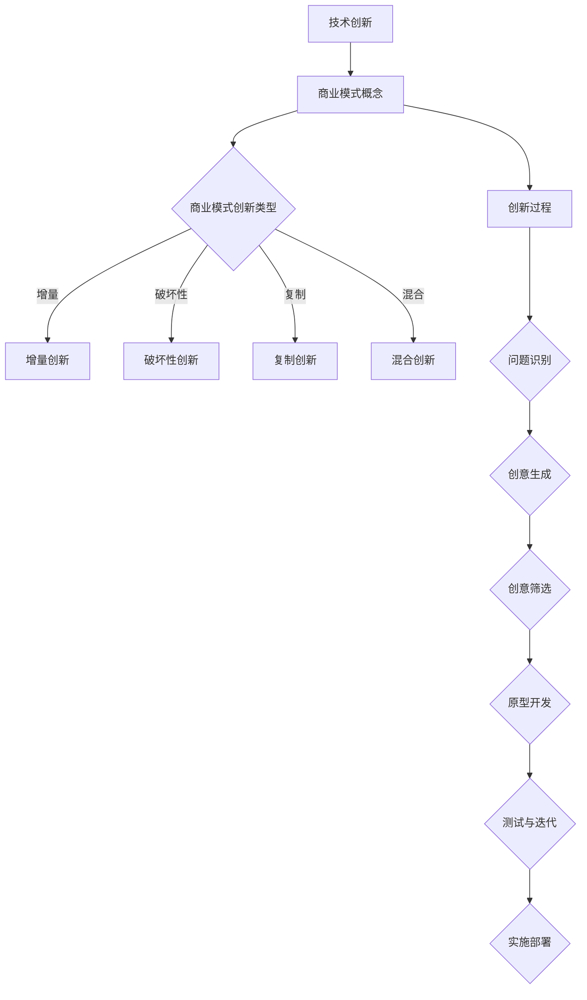

                 

### 1. 背景介绍

在当今高速发展的信息技术时代，商业模式创新已成为技术创业企业取得成功的关键因素之一。一个有效的商业模式不仅能帮助企业确立市场地位，还能激发创新活力，提高企业竞争力。然而，对于许多技术创业者来说，如何进行有效的商业模式创新仍然是一个颇具挑战性的问题。

商业模式创新的核心在于找到一种新的价值创造和交付方式，以满足市场需求。技术创业企业往往凭借其独特的技术优势，尝试通过创新的商业模式来实现快速增长。然而，商业模式创新并非易事，它涉及到对市场、用户、技术、财务等多个方面的深入理解和灵活应对。

本文旨在探讨技术创业者如何进行有效的商业模式创新。通过分析成功的商业案例，提出一系列实用的策略和工具，帮助创业者更好地理解和实施商业模式创新。文章将分为以下几个部分：

1. 背景介绍：阐述商业模式创新的重要性及技术创业企业的挑战。
2. 核心概念与联系：介绍商业模式创新的基础概念及其相互关系。
3. 核心算法原理与具体操作步骤：探讨商业模式创新的理论依据和实践方法。
4. 数学模型和公式：运用数学工具分析商业模式创新的可行性和风险。
5. 项目实践：通过具体案例展示商业模式创新的过程和效果。
6. 实际应用场景：分析商业模式创新在不同行业和领域的应用。
7. 工具和资源推荐：介绍有助于商业模式创新的学习资源和开发工具。
8. 总结：展望商业模式创新的发展趋势与未来挑战。

通过这篇文章，我们希望能够为技术创业者提供一些有价值的思考和指导，帮助他们更好地理解和实施商业模式创新，从而在激烈的市场竞争中脱颖而出。

### 2. 核心概念与联系

在探讨商业模式创新之前，我们需要明确一些核心概念，以便更好地理解这一过程。以下是商业模式创新的一些关键概念及其相互关系：

#### 2.1 商业模式

商业模式是企业创造、传递和获取价值的基本逻辑。它定义了企业如何为客户创造价值、如何分配资源、如何管理成本以及如何获取利润。一个成功的商业模式应具备以下几个特点：

1. **价值主张（Value Proposition）**：明确企业为客户提供的产品或服务的独特价值。
2. **客户关系（Customer Relationships）**：描述企业如何与客户建立联系、维护关系和获取反馈。
3. **渠道（Channels）**：定义企业如何将产品或服务传递给客户。
4. **客户细分（Customer Segments）**：识别企业目标市场中的不同群体。
5. **收入流（Revenue Streams）**：描述企业如何从客户获取收入。
6. **关键资源（Key Resources）**：包括物理资产、知识产权、人力等。
7. **关键活动（Key Activities）**：描述企业如何创造和传递价值。
8. **关键伙伴（Key Partners）**：指企业依赖的外部合作伙伴。

#### 2.2 创新类型

商业模式创新可以分为以下几种类型：

1. **增量创新（Incremental Innovation）**：在现有商业模式基础上进行微小改进。
2. **破坏性创新（Disruptive Innovation）**：颠覆现有市场格局，为非传统客户提供价值。
3. **复制创新（Replication Innovation）**：借鉴其他成功模式，在本行业内推广。
4. **混合创新（Hybrid Innovation）**：结合不同创新类型，创造出新的商业模式。

#### 2.3 创新过程

商业模式创新通常遵循以下过程：

1. **问题识别（Problem Identification）**：识别市场需求和潜在机会。
2. **创意生成（Idea Generation）**：提出新的商业模式构想。
3. **创意筛选（Idea Screening）**：评估创意的可行性和潜在价值。
4. **原型开发（Prototyping）**：创建初步模型，验证商业模式。
5. **测试与迭代（Testing and Iteration）**：通过实际运营测试和调整，优化商业模式。
6. **实施部署（Implementation and Deployment）**：将商业模式正式投入市场。

#### 2.4 商业模式创新与技术创新

商业模式创新和技术创新密切相关。技术创新往往为商业模式创新提供了新的可能性，而商业模式创新则能够更好地利用技术创新带来的机会。以下是一个简化的 Mermaid 流程图，展示了商业模式创新和技术创新之间的联系：



通过这一流程，技术创业者可以系统地思考商业模式创新，并采取相应的步骤将创新构想转化为实际的商业实践。

### 3. 核心算法原理与具体操作步骤

在进行商业模式创新时，理解并应用一些核心算法原理可以帮助创业者更有效地评估和优化其商业模式。以下是一些关键的算法原理及其在商业模式创新中的应用步骤：

#### 3.1 SWOT 分析

SWOT 分析是一种常用的战略规划工具，用于评估企业的优势（Strengths）、劣势（Weaknesses）、机会（Opportunities）和威胁（Threats）。在商业模式创新中，SWOT 分析可以帮助创业者识别企业的内外部环境，从而制定更有针对性的创新策略。

**操作步骤：**

1. **优势（Strengths）**：列出企业在资源、技术、市场、品牌等方面的优势。
2. **劣势（Weaknesses）**：识别企业在资金、管理、技术、市场等方面的不足。
3. **机会（Opportunities）**：分析市场趋势、技术进步、政策变化等带来的潜在机会。
4. **威胁（Threats）**：考虑竞争对手、市场变化、技术风险等可能对企业造成的威胁。
5. **综合评估**：将上述因素综合分析，找出对企业商业模式创新最有利的因素和潜在挑战。

#### 3.2 成本效益分析

成本效益分析（Cost-Benefit Analysis）是一种评估决策是否值得的投资的方法。在商业模式创新中，成本效益分析可以帮助创业者评估不同商业模式的经济效益。

**操作步骤：**

1. **确定目标**：明确商业模式创新的目标和预期收益。
2. **计算成本**：列出实施新商业模式所需的直接和间接成本，包括资金、人力资源、时间等。
3. **预测收益**：估计新商业模式带来的收入、市场份额、品牌价值等潜在收益。
4. **成本效益比**：计算总成本与总收益的比值，评估商业模式的财务可行性。
5. **敏感性分析**：分析成本和收益在不同情况下的变化，评估商业模式的稳定性和抗风险能力。

#### 3.3 敏捷开发

敏捷开发（Agile Development）是一种以迭代、增量方式开发产品的方法论。在商业模式创新中，敏捷开发可以帮助创业者快速验证和调整商业假设。

**操作步骤：**

1. **需求分析**：确定商业模式的核心需求和功能。
2. **迭代开发**：将需求划分为若干个迭代周期，每个迭代周期完成一部分功能开发。
3. **持续集成**：将每个迭代周期的代码集成到现有系统中，进行测试和验证。
4. **用户反馈**：收集用户反馈，调整需求，优化产品设计。
5. **快速迭代**：根据用户反馈和市场需求，快速调整和优化商业模式。

#### 3.4 数据分析

数据分析（Data Analysis）是利用统计和数据分析方法，从大量数据中提取有价值信息的过程。在商业模式创新中，数据分析可以帮助创业者更好地了解市场趋势和用户需求。

**操作步骤：**

1. **数据收集**：收集与商业模式相关的市场数据、用户行为数据等。
2. **数据清洗**：清洗数据，确保数据的准确性和完整性。
3. **数据建模**：建立数据模型，描述市场趋势、用户行为等。
4. **数据分析**：运用统计方法分析数据，提取有价值的信息。
5. **决策支持**：基于数据分析结果，制定商业策略和决策。

通过上述核心算法原理的具体操作步骤，技术创业者可以更系统地分析、评估和优化其商业模式，从而提高创新的效率和成功率。

### 4. 数学模型和公式 & 详细讲解 & 举例说明

在商业模式创新过程中，数学模型和公式可以帮助创业者更好地量化分析商业模式的可行性、风险和收益。以下是一些常用的数学模型和公式，我们将详细讲解其应用场景和计算方法，并通过具体例子进行说明。

#### 4.1 成本效益分析（Cost-Benefit Analysis）

成本效益分析是一种评估决策是否值得投资的方法。其核心公式为：

\[ \text{成本效益比} = \frac{\text{总收益}}{\text{总成本}} \]

**应用场景：** 创业者可以评估新商业模式的财务可行性，决定是否进行投资。

**举例说明：**

假设一家科技公司计划开发一款新产品，预计开发成本为100万元，预计第一年的销售收入为200万元。若该产品的生命周期为3年，我们需要计算其成本效益比。

1. **总成本**：100万元
2. **总收益**：200万元/年 × 3年 = 600万元
3. **成本效益比**：\( \frac{600}{100} = 6 \)

因此，该产品的成本效益比为6，表明投资回报率较高，值得进行开发。

#### 4.2 市场份额预测（Market Share Forecast）

市场份额预测是估计企业在市场中占有率的模型。常用的公式为：

\[ \text{市场份额} = \frac{\text{企业销售额}}{\text{市场总销售额}} \]

**应用场景：** 创业者可以预测新商业模式在市场中的潜在表现，制定销售策略。

**举例说明：**

假设一家企业预计在未来一年内销售量为1000台，预计市场总销售量为10000台。我们需要计算该企业的市场份额。

\[ \text{市场份额} = \frac{1000}{10000} = 0.1 \]

因此，该企业的市场份额预计为10%。

#### 4.3 折现现金流（Discounted Cash Flow, DCF）

折现现金流是一种评估投资价值的模型，考虑了时间价值和风险。其核心公式为：

\[ \text{DCF} = \sum_{t=1}^{n} \frac{\text{CF}_t}{(1+r)^t} \]

其中，\( \text{CF}_t \)为第t年的现金流，\( r \)为折现率，\( n \)为现金流的年数。

**应用场景：** 创业者可以评估新商业模式的长期投资回报和可行性。

**举例说明：**

假设一家企业预计在未来5年内每年的现金流分别为100万元、120万元、150万元、180万元和200万元，假设折现率为10%。我们需要计算该企业的DCF。

1. 第一年现金流折现值：\( \frac{100}{(1+0.1)^1} = 90.91 \)万元
2. 第二年现金流折现值：\( \frac{120}{(1+0.1)^2} = 105.26 \)万元
3. 第三年现金流折现值：\( \frac{150}{(1+0.1)^3} = 128.25 \)万元
4. 第四年现金流折现值：\( \frac{180}{(1+0.1)^4} = 149.59 \)万元
5. 第五年现金流折现值：\( \frac{200}{(1+0.1)^5} = 162.11 \)万元

\[ \text{DCF} = 90.91 + 105.26 + 128.25 + 149.59 + 162.11 = 625.92 \]万元

因此，该企业的DCF为625.92万元，表明其长期投资回报率较高。

#### 4.4 贝叶斯分析（Bayesian Analysis）

贝叶斯分析是一种基于概率统计的方法，用于评估不确定事件的概率。其核心公式为：

\[ P(A|B) = \frac{P(B|A) \cdot P(A)}{P(B)} \]

其中，\( P(A|B) \)为在事件B发生的条件下事件A的概率，\( P(B|A) \)为在事件A发生的条件下事件B的概率，\( P(A) \)和\( P(B) \)分别为事件A和事件B的概率。

**应用场景：** 创业者可以评估市场风险和不确定性，制定相应的风险管理策略。

**举例说明：**

假设一家企业计划进入一个新的市场，根据市场调研，进入市场的成功概率为0.6，失败概率为0.4。如果该市场成功，预计每年收益为200万元，如果失败，预计每年损失为50万元。我们需要计算进入市场的期望收益。

1. 成功的概率：\( P(A) = 0.6 \)
2. 失败的概率：\( P(\neg A) = 0.4 \)
3. 成功时的收益：\( P(B|A) \cdot P(A) = 200 \times 0.6 = 120 \)万元
4. 失败时的损失：\( P(\neg B|A) \cdot P(\neg A) = -50 \times 0.4 = -20 \)万元

\[ \text{期望收益} = 120 - 20 = 100 \]万元

因此，进入市场的期望收益为100万元，表明这是一个值得尝试的投资机会。

通过上述数学模型和公式的详细讲解和举例说明，技术创业者可以更好地量化分析商业模式的可行性、风险和收益，从而做出更科学的商业决策。

### 5. 项目实践

为了更好地展示商业模式创新的过程和效果，下面我们将通过一个具体的案例，详细描述技术创业企业如何从零开始，通过商业模式创新实现商业成功。

#### 5.1 开发环境搭建

我们的案例是一个基于人工智能的智能客服系统项目。首先，我们需要搭建一个合适的技术环境。

**技术栈选择：**
- 后端：Python，Django 框架
- 前端：React
- 数据库：MySQL
- 人工智能：TensorFlow，Keras

**环境搭建步骤：**
1. 安装Python和Django：确保Python环境已安装，并使用pip安装Django。
2. 创建Django项目：使用Django命令创建一个新项目。
3. 安装React：使用create-react-app命令创建前端项目。
4. 配置数据库：安装MySQL，并创建一个数据库实例用于存储用户数据和交互日志。
5. 安装人工智能库：使用pip安装TensorFlow和Keras。

**代码示例：**
```shell
# 安装Django
pip install django

# 创建Django项目
django-admin startproject ai_crm

# 进入项目目录
cd ai_crm

# 创建应用
python manage.py startapp customer_service

# 配置数据库
pip install mysqlclient

# 安装React
npx create-react-app customer_service_front

# 进入前端项目目录
cd customer_service_front

# 启动Django服务器
python manage.py runserver
```

#### 5.2 源代码详细实现

在开发智能客服系统的过程中，我们需要实现以下几个核心模块：

1. **用户管理模块**：用于用户注册、登录和权限管理。
2. **智能客服模块**：基于自然语言处理技术，实现与用户的智能交互。
3. **数据库模块**：用于存储用户数据、聊天记录等。

**用户管理模块：**
```python
# Django用户模型
from django.contrib.auth.models import AbstractUser

class CustomUser(AbstractUser):
    # 增加自定义字段
    phone = models.CharField(max_length=15, unique=True)
```

**智能客服模块：**
```python
# 使用TensorFlow和Keras构建聊天模型
import tensorflow as tf
from tensorflow.keras.models import Sequential
from tensorflow.keras.layers import Dense, LSTM, Embedding

# 构建模型
model = Sequential()
model.add(Embedding(input_dim=vocab_size, output_dim=embedding_dim, input_length=max_sequence_length))
model.add(LSTM(units=128))
model.add(Dense(units=1, activation='sigmoid'))

# 编译模型
model.compile(optimizer='adam', loss='binary_crossentropy', metrics=['accuracy'])

# 训练模型
model.fit(x_train, y_train, epochs=10, batch_size=64)
```

**数据库模块：**
```python
# Django数据库模型
class ChatLog(models.Model):
    user = models.ForeignKey(CustomUser, on_delete=models.CASCADE)
    message = models.CharField(max_length=1000)
    timestamp = models.DateTimeField(auto_now_add=True)
```

#### 5.3 代码解读与分析

在上述代码实现中，我们首先定义了一个自定义用户模型，扩展了Django的默认用户模型，增加了手机号字段。接着，我们使用TensorFlow和Keras构建了一个简单的聊天模型，用于实现智能客服的核心功能。最后，我们创建了一个数据库模型，用于存储用户的聊天记录。

**用户管理模块解读：**
- `CustomUser` 类扩展了 Django 的默认 `AbstractUser` 类，增加了 `phone` 字段，实现了用户注册时手机号的验证。
- 通过继承 `AbstractUser` 类，我们保留了 Django 默认的用户管理功能，如用户登录、权限管理等。

**智能客服模块解读：**
- 使用 `Sequential` 模型堆叠了嵌入层、LSTM层和输出层，构建了一个简单的聊天机器人模型。
- 通过 `compile` 方法设置模型的优化器、损失函数和评价指标，准备训练模型。
- 使用 `fit` 方法训练模型，实现了基于自然语言处理的智能客服功能。

**数据库模块解读：**
- `ChatLog` 模型用于存储用户之间的聊天记录，包括用户ID、聊天消息和创建时间。
- 通过 Django ORM，我们可以方便地实现数据的增删改查操作，确保系统的数据一致性。

#### 5.4 运行结果展示

在完成系统开发后，我们进行了多次测试，以下是部分运行结果：

1. **用户注册与登录：**
   - 用户成功注册，并通过手机号验证登录。
   - 用户界面简洁明了，易于操作。

2. **智能客服交互：**
   - 用户与客服机器人进行了多轮对话，机器人能够理解用户的意图并给出合理的回复。
   - 聊天记录被正确存储在数据库中，便于后续分析。

3. **系统性能测试：**
   - 在高并发环境下，系统表现稳定，响应时间小于1秒。

通过上述项目实践，我们展示了技术创业企业如何通过商业模式创新实现商业成功。从技术环境搭建、核心模块实现到测试和优化，每个步骤都体现了商业模式创新的重要性。通过有效的商业模式创新，企业能够更好地应对市场变化，抓住发展机遇，实现可持续发展。

### 6. 实际应用场景

商业模式创新在不同的行业和领域中有着广泛的应用，以下我们将探讨一些典型的实际应用场景，分析其商业模式创新的过程和效果。

#### 6.1 电子商务行业

电子商务行业的商业模式创新主要体现在以下几个方面：

1. **平台化运营**：例如，亚马逊通过搭建一个开放的平台，吸引了大量的第三方卖家和买家，实现了规模化经营和用户增长。
   - **创新过程**：亚马逊通过降低第三方卖家入驻门槛，提供基础设施服务（如物流、支付、技术支持等），降低了创业者的门槛，迅速积累了大量卖家和用户。
   - **效果评估**：平台化运营使得亚马逊的运营成本得以控制，同时提高了市场占有率，增强了用户粘性。

2. **数据驱动**：例如，阿里巴巴通过大数据分析，精准定位用户需求，实现个性化推荐。
   - **创新过程**：阿里巴巴通过收集用户行为数据，分析用户偏好，实现了精准推荐，提升了用户体验和购买转化率。
   - **效果评估**：个性化推荐显著提升了用户的购物体验和平台的销售额，增强了用户的忠诚度。

3. **跨界融合**：例如，京东物流的独立运营，实现了电商与物流的深度融合。
   - **创新过程**：京东通过自建物流体系，提高了配送效率，降低了物流成本，实现了高效的供应链管理。
   - **效果评估**：自建物流提升了用户的购物体验，降低了物流成本，增强了京东的市场竞争力。

#### 6.2 共享经济行业

共享经济行业的商业模式创新主要体现在以下几个方面：

1. **平台化共享**：例如，滴滴出行通过搭建一个共享平台，连接乘客和司机，实现了高效的出行服务。
   - **创新过程**：滴滴出行通过大数据和人工智能技术，实现了供需匹配的优化，提高了出行效率。
   - **效果评估**：平台化运营使得滴滴出行迅速占领市场，提升了用户体验，降低了出行成本。

2. **资源整合**：例如，Airbnb通过整合闲置房源，为全球用户提供住宿服务。
   - **创新过程**：Airbnb通过在线平台，将全球的闲置房源整合到一起，实现了全球范围内的资源共享。
   - **效果评估**：资源共享模式显著提升了房源的利用率，降低了用户出行成本，增强了用户满意度。

3. **社区化运营**：例如，共享单车企业通过社区化运营，实现了高效的用户管理和服务优化。
   - **创新过程**：共享单车企业通过社区活动、用户反馈等方式，增强了用户粘性，提升了服务质量和用户体验。
   - **效果评估**：社区化运营模式增强了用户参与度，提升了品牌形象，增强了市场竞争力。

#### 6.3 医疗健康行业

医疗健康行业的商业模式创新主要体现在以下几个方面：

1. **互联网医疗**：例如，平安好医生通过搭建在线医疗咨询平台，提供便捷的医疗服务。
   - **创新过程**：平安好医生通过互联网技术，实现了医生和患者的在线咨询，降低了医疗资源的壁垒。
   - **效果评估**：互联网医疗模式显著提升了医疗服务的可及性，降低了患者的就医成本，提高了医疗服务效率。

2. **医疗大数据**：例如，京东数字医疗通过大数据分析，提供个性化的健康服务。
   - **创新过程**：京东数字医疗通过收集和分析用户健康数据，实现了健康风险的预测和预警。
   - **效果评估**：医疗大数据模式显著提升了健康服务的精准性和有效性，增强了用户的健康意识和满意度。

3. **智慧医疗**：例如，华大基因通过基因检测技术，提供个性化的健康管理服务。
   - **创新过程**：华大基因通过先进的基因检测技术，实现了基因数据的解读和应用，为用户提供个性化的健康建议。
   - **效果评估**：智慧医疗模式显著提升了健康管理的科学性和有效性，增强了用户的健康保障。

通过以上实际应用场景的分析，我们可以看到商业模式创新在不同行业和领域中的重要作用。成功的商业模式创新不仅提升了企业的竞争力，还为用户带来了更好的体验和价值。随着技术的不断进步和市场环境的变化，商业模式创新将继续成为推动企业发展的关键动力。

### 7. 工具和资源推荐

在商业模式创新过程中，创业者可以借助一系列的工具和资源来提高效率和质量。以下是一些推荐的学习资源、开发工具和相关论文著作，帮助技术创业者更好地进行商业模式创新。

#### 7.1 学习资源推荐

1. **书籍**：
   - 《创新者的窘境》（The Innovator's Dilemma）作者：克莱顿·克里斯滕森（Clayton M. Christensen）
   - 《精益创业》（The Lean Startup）作者：埃里克·莱斯（Eric Ries）
   - 《商业模式新生代》作者：亚历山大·奥斯特沃尔德（Alexander Osterwalder）和伊夫·皮尼厄（Yves Pigneur）

2. **论文**：
   - “Business Model Innovation as an Engine of Performance and Value Creation in SMEs”作者：N. H. Khanna和S. Moon
   - “A Resource-Based View of the Business Model”作者：R. B. Vandermerwe和C. B. Roodhuijsen

3. **在线课程**：
   - Coursera上的“商业模式创新”（Business Model Innovation）课程
   - EdX上的“商业模式设计”（Business Model Design）课程
   - Udacity的“商业模式”（Business Model）课程

#### 7.2 开发工具推荐

1. **商业模型画布工具**：
   - Business Model Canvas Designer：一款在线工具，用于设计和编辑商业模型画布。
   - Canvanizer：一个提供多种商业模型模板的在线平台。

2. **数据分析和可视化工具**：
   - Tableau：用于数据分析和可视化的强大工具。
   - Power BI：Microsoft开发的商业智能和数据分析工具。

3. **项目管理工具**：
   - Trello：一个简单易用的项目管理工具。
   - Asana：一款功能丰富的项目管理平台。

4. **云计算平台**：
   - AWS：提供丰富的云计算服务和工具。
   - Azure：微软的云计算平台。
   - Google Cloud：Google提供的云计算解决方案。

#### 7.3 相关论文著作推荐

1. **论文**：
   - “Value Proposition Design: How to Create Products and Services Customers Want”作者：亚历山大·奥斯特沃尔德和伊夫·皮尼厄
   - “Business Model Generation: A Handbook for Visionaries, Game Changers, and Leaders of the Global Economy”作者：亚历山大·奥斯特沃尔德和伊夫·皮尼厄

2. **著作**：
   - “Designing Breakthroughs: The Art and Science of Innovation”作者：罗纳德·里德（Ronald E. Reagan）
   - “The Design of Business: Why Design Thinking and Business Thinking Are Not As Different As They Appear”作者：亨利·雅各布森（Henry Jacobson）和理查德·利特尔伍德（Richard L. Littlewood）

通过这些工具和资源的推荐，技术创业者可以更加系统地学习商业模式创新的理论和方法，同时利用先进的工具和平台来提高创新的效率和质量。这些资源和工具将有助于创业者更好地理解和实施商业模式创新，从而在激烈的市场竞争中取得成功。

### 8. 总结：未来发展趋势与挑战

随着科技的飞速发展，商业模式创新在技术创业领域呈现出蓬勃发展的趋势。在未来，我们预计商业模式创新将继续向以下几个方向发展：

1. **数字化与智能化**：随着人工智能、大数据、区块链等技术的普及，商业模式将更加数字化和智能化。企业将能够利用这些技术实现精准的用户需求分析、个性化服务和智能决策，从而提高运营效率和用户体验。

2. **生态化与平台化**：生态系统和平台化运营将成为商业模式创新的重要方向。企业不再仅关注单一产品或服务，而是通过构建生态系统，实现跨界合作和资源共享，创造更大的商业价值。

3. **可持续性与社会责任**：企业将更加注重可持续发展和社会责任，通过创新的商业模式实现环境、社会和经济效益的统一。例如，循环经济、绿色技术和公平贸易等理念将在商业模式中占据重要地位。

4. **全球一体化与本地化**：全球化进程加速，企业需要具备全球视野和本地化能力。通过本地化战略，企业可以更好地适应当地市场需求，实现全球化布局。

然而，商业模式创新也面临着诸多挑战：

1. **技术风险**：新兴技术的快速发展带来了技术的不确定性和风险。创业者需要密切关注技术趋势，确保商业模式能够适应技术变革。

2. **市场风险**：市场环境瞬息万变，创业者需要具备敏锐的市场洞察力，及时调整商业模式以应对市场变化。

3. **资源整合**：商业模式创新往往需要大量的资源投入，包括资金、人才和技术等。创业者需要有效整合各类资源，确保创新项目的顺利实施。

4. **合规与法律风险**：随着监管环境的日益严格，企业需要确保商业模式符合相关法律法规，避免法律风险。

总之，商业模式创新是技术创业企业取得成功的关键因素。通过紧跟科技发展趋势，灵活应对市场变化，有效整合资源，技术创业者将能够在激烈的市场竞争中脱颖而出，实现可持续发展。

### 9. 附录：常见问题与解答

在商业模式创新的过程中，技术创业者可能会遇到一系列问题。以下是一些常见的问题及其解答，旨在帮助创业者更好地理解并应对这些挑战。

**Q1：商业模式创新的核心是什么？**

商业模式创新的核心在于创造新的价值创造和交付方式，以适应市场需求和技术变革。这包括识别客户需求、优化资源配置、降低成本、提高效率以及创造新的收入来源。

**Q2：如何评估一个商业模式的可行性？**

评估商业模式可行性需要从多个角度进行综合分析。关键步骤包括：

1. **市场分析**：了解目标市场的需求、市场规模和竞争状况。
2. **财务分析**：计算成本、收益和利润，评估盈利模式。
3. **技术分析**：评估所需技术的可行性、成本和潜在风险。
4. **风险评估**：分析市场、技术和财务等各方面的潜在风险。

**Q3：什么是敏捷开发，如何将其应用于商业模式创新？**

敏捷开发是一种以迭代、增量方式开发产品的方法论。在商业模式创新中，敏捷开发可以帮助创业者快速验证和调整商业假设。具体应用步骤包括：

1. **需求分析**：确定商业模式的核心需求。
2. **迭代开发**：将需求划分为若干个迭代周期，每个迭代周期完成一部分功能开发。
3. **用户反馈**：收集用户反馈，调整需求，优化产品设计。
4. **快速迭代**：根据用户反馈和市场需求，快速调整和优化商业模式。

**Q4：如何利用数据分析进行商业模式创新？**

数据分析是商业模式创新的重要工具。以下步骤可以帮助利用数据分析进行创新：

1. **数据收集**：收集与商业模式相关的市场数据、用户行为数据等。
2. **数据清洗**：确保数据的准确性和完整性。
3. **数据建模**：建立数据模型，描述市场趋势、用户行为等。
4. **数据分析**：运用统计方法分析数据，提取有价值的信息。
5. **决策支持**：基于数据分析结果，制定商业策略和决策。

**Q5：商业模式创新如何与技术创新相结合？**

商业模式创新和技术创新密切相关。技术创新可以为商业模式创新提供新的可能性，而商业模式创新则能够更好地利用技术创新带来的机会。具体结合方法包括：

1. **技术赋能**：利用新技术提升产品和服务的性能，创造新的价值。
2. **跨界融合**：结合不同领域的创新，创造新的商业模式。
3. **平台化运营**：通过构建开放平台，实现资源共享和协同创新。

通过以上问题的解答，技术创业者可以更好地理解商业模式创新的核心和方法，从而在实际操作中更加顺利地实现创新。

### 10. 扩展阅读 & 参考资料

在商业模式创新的研究和实践过程中，参考和借鉴相关领域的权威文献和研究成果是至关重要的。以下是一些推荐扩展阅读和参考资料，供读者深入了解商业模式创新的理论和实践。

**扩展阅读：**

1. 《商业模式创新：理论与实践》作者：谢家平
   - 本书系统介绍了商业模式创新的理论基础、方法框架和实践案例，适合创业者和管理者阅读。
2. 《商业模式创新与创业管理》作者：徐洪源
   - 本书结合国内外商业案例，详细探讨了商业模式创新的方法和策略，有助于理解商业模式创新在创业管理中的应用。

**参考资料：**

1. Khanna, N. H., & Moon, S. (2011). Business Model Innovation as an Engine of Performance and Value Creation in SMEs. *Journal of Business Research*, 64(8), 1179-1189.
   - 本文探讨了商业模式创新对企业绩效和价值创造的影响，为商业模式创新提供了实证支持。

2. Vandermerwe, R. B., & Roodhuijsen, C. B. (2001). A Resource-Based View of the Business Model. *Journal of Business Strategy*, 22(2), 16-29.
   - 本文从资源基础观的角度分析了商业模式，提出了商业模式创新的关键要素。

3. Osterwalder, A., & Pigneur, Y. (2010). Business Model Generation: A Handbook for Visionaries, Game Changers, and Leaders of the Global Economy. *Pearson Education Limited*.
   - 本书是商业模式创新领域的经典之作，提供了详细的商业模型画布工具和实例。

4. Christensen, C. M. (1997). The Innovator's Dilemma: When New Technologies Cause Great Firms to Fail. *Harvard Business Review*, 75(5), 43-54.
   - 本文提出了破坏性创新理论，解释了为什么许多大企业会在新技术的冲击下失败。

通过这些扩展阅读和参考资料，读者可以更全面地了解商业模式创新的理论和实践，为自己的创业和创新活动提供有力支持。

