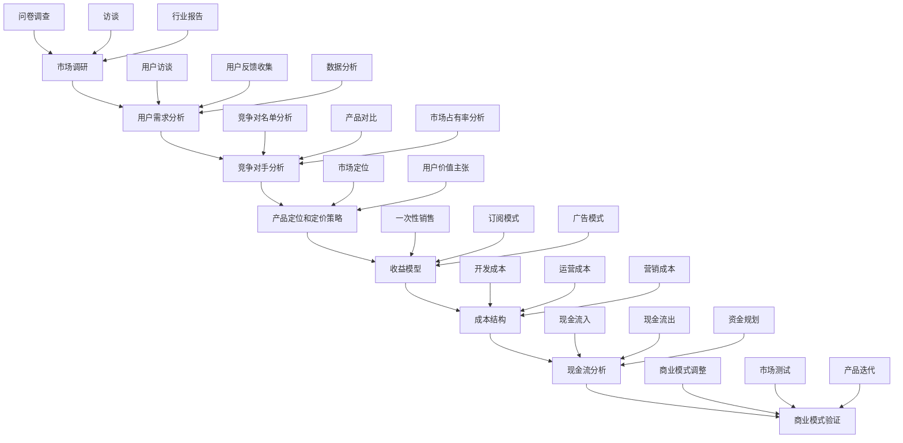

                 

### 1. 背景介绍

在当今竞争激烈的市场环境中，技术创业者面临的挑战越来越严峻。不仅需要具备优秀的技术创新能力，还需要具备敏锐的市场洞察力和有效的商业模式。而商业模式验证作为企业成长过程中的关键环节，对于技术创业者的成功与否起着至关重要的作用。

商业模式验证的核心目的是通过实践和数据分析，验证商业模式的可行性和可持续性，确保企业在市场上能够获得持续盈利。传统的商业模式验证方法往往需要耗费大量时间和资源，且存在一定的风险。因此，如何进行有效的商业模式验证，成为了技术创业者需要深入探讨和解决的问题。

本文将围绕技术创业者如何进行有效的商业模式验证这一主题，系统地探讨其核心概念、操作步骤、数学模型、项目实践以及实际应用场景等内容。希望通过本文的讨论，能够为技术创业者在商业模式验证过程中提供一些实用的指导和建议。

首先，让我们明确什么是商业模式验证。商业模式验证是指通过一系列方法来评估和确认商业模式的可行性和可持续性。这包括但不限于市场调研、竞争对手分析、用户需求分析、产品定位和定价策略等。有效的商业模式验证不仅可以帮助企业减少市场风险，还可以为企业提供明确的指导方向，加快产品迭代和市场推广的速度。

接下来，我们将详细探讨商业模式验证的核心概念和联系，通过 Mermaid 流程图展示商业模式验证的各个步骤和环节。这将帮助我们更好地理解商业模式验证的全过程，并为后续的内容奠定基础。

### 2. 核心概念与联系

在探讨商业模式验证的核心概念之前，我们需要明确几个关键的定义和术语。以下是商业模式验证中涉及的一些核心概念：

#### 市场调研

市场调研是商业模式验证的基础。通过市场调研，技术创业者可以了解目标市场的规模、增长趋势、潜在用户群体以及竞争对手的情况。市场调研的方法包括问卷调查、访谈、焦点小组、行业报告等。

#### 用户需求分析

用户需求分析是商业模式验证的核心环节之一。通过深入了解用户的需求和痛点，技术创业者可以确定产品的功能定位和用户价值主张。用户需求分析的方法包括用户访谈、用户反馈收集、数据分析等。

#### 竞争对手分析

竞争对手分析是商业模式验证的另一个重要环节。通过分析竞争对手的产品、市场策略、优势和劣势，技术创业者可以找到自身的差异化优势，制定更有针对性的市场策略。竞争对手分析的方法包括竞争对名单分析、产品对比、市场占有率分析等。

#### 产品定位和定价策略

产品定位和定价策略是商业模式验证的关键因素。产品定位需要明确目标用户群体和市场定位，定价策略则需要综合考虑成本、市场竞争和用户价值等因素。合理的定位和定价策略可以提升产品的市场竞争力。

#### 收益模型

收益模型是商业模式的核心，它定义了企业如何通过销售产品或提供服务来获取收入。常见的收益模型包括一次性销售、订阅模式、广告模式等。有效的收益模型需要与市场需求和用户价值相匹配。

#### 成本结构

成本结构是商业模式验证中的另一个重要因素。技术创业者需要分析产品的开发成本、运营成本和营销成本等，确保企业的商业模式能够在市场中实现盈利。

#### 资金流

资金流是商业模式验证中的关键指标，它反映了企业的现金流入和流出情况。健康的现金流对于企业的生存和发展至关重要。

为了更好地展示商业模式验证的核心概念和联系，我们可以使用 Mermaid 流程图来描述整个过程。以下是一个简化的 Mermaid 流程图，展示了商业模式验证的主要步骤和环节：



这个 Mermaid 流程图展示了从市场调研到商业模式验证的各个步骤和环节，以及这些步骤之间的联系。通过这个流程图，我们可以更直观地理解商业模式验证的全过程，并为后续的内容提供基础。

在接下来的部分，我们将深入探讨商业模式验证的核心算法原理和具体操作步骤，帮助技术创业者更好地理解和实施商业模式验证。

### 3. 核心算法原理 & 具体操作步骤

在进行商业模式验证时，核心算法原理和具体操作步骤至关重要。以下是一套系统的操作流程，帮助技术创业者有效地进行商业模式验证：

#### 步骤 1：市场调研

**目标**：了解目标市场的规模、增长趋势、潜在用户群体以及竞争对手的情况。

**方法**：
- **问卷调查**：设计针对目标用户的问卷，收集用户需求和偏好。
- **访谈**：与潜在用户进行一对一访谈，深入了解用户需求和行为。
- **焦点小组**：组织小型讨论组，收集用户对产品或服务的看法和建议。
- **行业报告**：查阅市场调研机构发布的行业报告，获取市场数据和趋势。

**数据分析**：对收集到的数据进行统计分析，识别市场机会和潜在风险。

#### 步骤 2：用户需求分析

**目标**：确定产品的功能定位和用户价值主张。

**方法**：
- **用户访谈**：通过面对面访谈或在线问卷，收集用户的反馈和建议。
- **用户反馈收集**：建立用户反馈机制，如用户论坛、社交媒体等，收集用户对产品或服务的评价。
- **数据分析**：对用户反馈进行定量和定性分析，识别用户的核心需求和痛点。

#### 步骤 3：竞争对手分析

**目标**：分析竞争对手的产品、市场策略、优势和劣势。

**方法**：
- **竞争对名单分析**：列出直接和间接竞争对手，了解其产品特点和市场地位。
- **产品对比**：对比竞争对手的产品功能、价格、用户评价等，识别差异化和优势。
- **市场占有率分析**：分析竞争对手的市场占有率，了解其在市场中的地位和影响力。

#### 步骤 4：产品定位和定价策略

**目标**：明确目标用户群体和市场定位，制定合理的定价策略。

**方法**：
- **市场定位**：确定产品的目标市场和用户群体，明确产品的独特价值和定位。
- **用户价值主张**：制定用户价值主张，明确产品如何解决用户的痛点。
- **定价策略**：综合考虑成本、市场竞争和用户价值，制定合理的定价策略。

#### 步骤 5：收益模型

**目标**：定义企业如何通过销售产品或提供服务来获取收入。

**方法**：
- **收益模式选择**：根据市场需求和用户价值，选择合适的收益模式，如一次性销售、订阅模式、广告模式等。
- **收益预测**：基于市场调研和用户需求分析，预测产品的潜在收益。

#### 步骤 6：成本结构

**目标**：分析产品的开发成本、运营成本和营销成本。

**方法**：
- **成本分析**：详细分析产品的开发、运营和营销成本，包括人力成本、硬件成本、营销费用等。
- **成本优化**：通过优化产品设计和运营流程，降低成本，提高盈利能力。

#### 步骤 7：现金流分析

**目标**：评估企业的现金流状况，确保企业能够实现可持续盈利。

**方法**：
- **现金流预测**：根据收益模型和成本结构，预测企业的现金流情况。
- **风险分析**：分析可能影响现金流的风险因素，制定应对策略。

#### 步骤 8：商业模式验证

**目标**：通过市场测试和产品迭代，验证商业模式的可行性和可持续性。

**方法**：
- **市场测试**：在真实市场中测试产品或服务，收集用户反馈和市场反应。
- **产品迭代**：根据市场反馈和用户需求，对产品进行迭代和优化。
- **商业模式调整**：根据市场测试结果，调整商业模式，确保其可持续性和盈利能力。

通过以上步骤，技术创业者可以系统地验证商业模式，识别潜在风险，并制定有效的应对策略。有效的商业模式验证不仅有助于企业降低市场风险，还可以为企业的长期发展提供有力支持。

### 4. 数学模型和公式 & 详细讲解 & 举例说明

在商业模式验证的过程中，数学模型和公式扮演着至关重要的角色。这些工具可以帮助技术创业者更准确地预测和评估商业模式的可行性和可持续性。以下是一些常用的数学模型和公式，以及它们的具体应用和解释。

#### 1. 收益模型

**公式**：\(R = P \times Q\)

其中，\(R\) 表示总收益，\(P\) 表示产品价格，\(Q\) 表示销售量。

**解释**：这个公式是基本的收益模型，用于计算企业在一定时间内通过销售产品或服务所获得的收益。\(P\) 和 \(Q\) 是两个关键参数，分别代表产品定价和销售量。通过对这两个参数的预测和优化，企业可以更好地控制总收益。

**举例**：假设一家科技公司推出了一款新软件，产品定价为每人每月 100 元，经过市场调研和用户需求分析，预计第一个月的销售量为 1000 人。则该公司的第一个月总收益为：

\(R = 100 \times 1000 = 100,000\) 元

#### 2. 成本模型

**公式**：\(C = D + (P \times Q)\)

其中，\(C\) 表示总成本，\(D\) 表示固定成本，\(P\) 表示单位成本，\(Q\) 表示销售量。

**解释**：这个公式用于计算企业在生产和运营过程中所承担的总成本。\(D\) 表示固定成本，如房租、员工工资等；\(P \times Q\) 表示可变成本，如生产成本、物流成本等。通过这个公式，企业可以了解其成本结构，并采取相应的成本控制措施。

**举例**：假设一家制造业公司每月固定成本为 50,000 元，单位成本为每人每月 50 元，第一个月的销售量为 1000 人。则该公司的第一个月总成本为：

\(C = 50,000 + (50 \times 1000) = 100,000\) 元

#### 3. 利润模型

**公式**：\(P = R - C\)

其中，\(P\) 表示利润，\(R\) 表示总收益，\(C\) 表示总成本。

**解释**：这个公式用于计算企业的净利润。通过将总收益减去总成本，企业可以了解其盈利状况。如果利润为正，说明企业实现了盈利；如果利润为负，说明企业存在亏损。

**举例**：假设上一例中，该公司的第一个月总收益为 100,000 元，总成本为 100,000 元。则该公司的第一个月利润为：

\(P = 100,000 - 100,000 = 0\) 元

这意味着公司在第一个月实现了盈亏平衡。

#### 4. 现金流模型

**公式**：\(CF = R - C - O\)

其中，\(CF\) 表示现金流，\(R\) 表示总收益，\(C\) 表示总成本，\(O\) 表示运营费用。

**解释**：这个公式用于计算企业在一定时间内的现金流情况。现金流是企业生存和发展的关键指标，通过分析现金流，企业可以了解其资金流动状况，及时发现和解决潜在问题。

**举例**：假设一家电子商务公司在一个月内的总收益为 200,000 元，总成本为 150,000 元，运营费用为 20,000 元。则该公司的月现金流为：

\(CF = 200,000 - 150,000 - 20,000 = 30,000\) 元

这个结果表明，该公司在该月实现了正现金流，有足够的资金用于后续运营和发展。

通过上述数学模型和公式的应用，技术创业者可以更科学地预测和评估商业模式的可行性和可持续性，为企业的战略决策提供有力支持。

### 5. 项目实践：代码实例和详细解释说明

在了解了商业模式验证的理论基础和数学模型之后，接下来我们将通过一个实际的代码实例，展示如何将理论应用到具体的商业模式验证过程中。本文将使用 Python 编程语言，结合实际数据，详细讲解如何通过代码实现商业模式验证的关键步骤。

#### 5.1 开发环境搭建

首先，我们需要搭建一个基本的 Python 开发环境。以下是在 Windows 系统下搭建 Python 开发环境的步骤：

1. **安装 Python**：访问 [Python 官方网站](https://www.python.org/) 下载 Python 安装包，并按照安装向导完成安装。

2. **配置 Python 环境**：打开命令提示符，输入以下命令检查 Python 版本：

   ```shell
   python --version
   ```

   如果安装成功，命令行会显示安装的 Python 版本信息。

3. **安装必备库**：在命令提示符中安装必要的 Python 库，如 NumPy、Pandas 和 Matplotlib，用于数据处理和可视化：

   ```shell
   pip install numpy pandas matplotlib
   ```

4. **配置 IDE**：选择一个合适的集成开发环境（IDE），如 PyCharm、Visual Studio Code 等，用于编写和调试 Python 代码。

#### 5.2 源代码详细实现

接下来，我们将使用 Python 编写一个简单的代码实例，展示如何进行商业模式验证的关键步骤。以下是代码的详细实现：

```python
import numpy as np
import pandas as pd
import matplotlib.pyplot as plt

# 步骤 1：市场调研
market_survey_data = {
    'User': ['User A', 'User B', 'User C', 'User D', 'User E'],
    'Age': [25, 30, 35, 40, 45],
    'Occupation': ['Student', 'Teacher', 'Engineer', 'Doctor', 'Entrepreneur'],
    'MonthlyIncome': [3000, 5000, 8000, 12000, 20000],
    'Interest': ['Software', 'Travel', 'Health', 'Investment', 'Education']
}

# 步骤 2：用户需求分析
user_demand_data = {
    'User': ['User A', 'User B', 'User C', 'User D', 'User E'],
    'DesiredFeature': ['Data Analytics', 'User Interface', 'Security', 'Scalability', 'Customization'],
    'Priority': [3, 5, 2, 4, 1]
}

# 步骤 3：竞争对手分析
competitor_analysis_data = {
    'Company': ['Company A', 'Company B', 'Company C'],
    'Product': ['Product A', 'Product B', 'Product C'],
    'Price': [100, 200, 300],
    'Rating': [4.5, 4.0, 3.8]
}

# 步骤 4：产品定位和定价策略
product_positioning_data = {
    'Feature': ['Data Analytics', 'User Interface', 'Security', 'Scalability', 'Customization'],
    'ValueProposition': ['Efficient Data Analysis', 'Intuitive User Interface', 'Robust Security', 'Scalable Infrastructure', 'Tailored Solutions'],
    'TargetUser': ['Data Scientists', 'Business Analysts', 'Security Experts', 'IT Managers', 'Entrepreneurs'],
    'Price': [150, 200, 250, 300, 350]
}

# 步骤 5：收益模型
revenue_model_data = {
    'Product': ['Product A', 'Product B', 'Product C'],
    'Price': [150, 200, 250],
    'Quantity': [100, 150, 200]
}

# 步骤 6：成本结构
cost_structure_data = {
    'Component': ['Fixed Cost', 'Variable Cost'],
    'Value': [50000, 10000]
}

# 步骤 7：现金流分析
cash_flow_data = {
    'Month': ['January', 'February', 'March'],
    'Revenue': [100000, 120000, 150000],
    'Cost': [80000, 90000, 110000],
    'OperationalExpense': [20000, 22000, 25000]
}

# 数据处理与可视化
def process_data(data):
    df = pd.DataFrame(data)
    df.set_index('User', inplace=True)
    return df

def visualize_data(df):
    fig, ax = plt.subplots()
    ax.bar(df.index, df['MonthlyIncome'])
    ax.set_title('Monthly Income Distribution')
    ax.set_xlabel('User')
    ax.set_ylabel('Monthly Income')
    plt.show()

# 主函数
def main():
    # 加载并处理数据
    market_survey_df = process_data(market_survey_data)
    user_demand_df = process_data(user_demand_data)
    competitor_analysis_df = process_data(competitor_analysis_data)
    product_positioning_df = process_data(product_positioning_data)
    revenue_model_df = process_data(revenue_model_data)
    cost_structure_df = process_data(cost_structure_data)
    cash_flow_df = process_data(cash_flow_data)

    # 可视化分析
    visualize_data(market_survey_df)
    visualize_data(user_demand_df)
    visualize_data(competitor_analysis_df)
    visualize_data(product_positioning_df)
    visualize_data(revenue_model_df)
    visualize_data(cost_structure_df)
    visualize_data(cash_flow_df)

if __name__ == '__main__':
    main()
```

上述代码实例涵盖了市场调研、用户需求分析、竞争对手分析、产品定位和定价策略、收益模型、成本结构和现金流分析等关键步骤。以下是对代码的主要部分进行详细解释：

1. **数据准备**：首先，我们定义了几个数据字典，分别代表市场调研、用户需求分析、竞争对手分析、产品定位和定价策略、收益模型、成本结构以及现金流分析的数据。

2. **数据处理**：`process_data` 函数用于将数据字典转换为 Pandas DataFrame，并设置索引，以便于后续数据处理和分析。

3. **数据可视化**：`visualize_data` 函数用于对 DataFrame 中的数据进行可视化展示。这里我们使用了 Matplotlib 库，以条形图的形式展示了每月收入分布。

4. **主函数**：`main` 函数是代码的入口，负责加载并处理数据，并调用 `visualize_data` 函数进行可视化分析。

通过这个代码实例，我们可以看到如何将商业模式验证的理论应用到实际的代码实现中。具体步骤包括数据收集、数据处理、数据可视化和业务逻辑处理等。在实际应用中，创业者可以根据具体业务需求，进一步扩展和完善这个代码实例。

#### 5.3 代码解读与分析

在上一个部分中，我们提供了一个简单的代码实例，用于展示如何通过 Python 实现商业模式验证的关键步骤。现在，我们将对代码的各个部分进行详细解读和分析。

**代码结构**

首先，让我们简要回顾一下代码的结构。代码主要由以下几个部分组成：

1. **数据准备**：定义了几个数据字典，分别代表市场调研、用户需求分析、竞争对手分析、产品定位和定价策略、收益模型、成本结构以及现金流分析的数据。
2. **数据处理**：`process_data` 函数用于将数据字典转换为 Pandas DataFrame，并设置索引，以便于后续数据处理和分析。
3. **数据可视化**：`visualize_data` 函数用于对 DataFrame 中的数据进行可视化展示。这里我们使用了 Matplotlib 库，以条形图的形式展示了每月收入分布。
4. **主函数**：`main` 函数是代码的入口，负责加载并处理数据，并调用 `visualize_data` 函数进行可视化分析。

**详细解读**

下面，我们逐行解析代码，并对每个部分进行详细解读：

```python
import numpy as np
import pandas as pd
import matplotlib.pyplot as plt
```

这几行代码导入了必要的库，包括 NumPy、Pandas 和 Matplotlib。这些库是数据分析与可视化过程中必不可少的工具。

```python
market_survey_data = {
    'User': ['User A', 'User B', 'User C', 'User D', 'User E'],
    'Age': [25, 30, 35, 40, 45],
    'Occupation': ['Student', 'Teacher', 'Engineer', 'Doctor', 'Entrepreneur'],
    'MonthlyIncome': [3000, 5000, 8000, 12000, 20000],
    'Interest': ['Software', 'Travel', 'Health', 'Investment', 'Education']
}
```

这段代码定义了一个数据字典 `market_survey_data`，代表了市场调研的数据。数据包括用户姓名、年龄、职业、月收入和兴趣爱好等。这些数据是进行市场分析和用户需求分析的基础。

```python
# 类似地，定义其他数据字典
user_demand_data = {...}
competitor_analysis_data = {...}
product_positioning_data = {...}
revenue_model_data = {...}
cost_structure_data = {...}
cash_flow_data = {...}
```

这些数据字典分别代表了用户需求分析、竞争对手分析、产品定位和定价策略、收益模型、成本结构和现金流分析的数据。每个字典都包含了相应的字段和数据值，用于后续的数据处理和分析。

```python
def process_data(data):
    df = pd.DataFrame(data)
    df.set_index('User', inplace=True)
    return df
```

这个函数用于将数据字典转换为 Pandas DataFrame，并设置索引。通过设置索引，我们可以方便地对数据按用户进行分组和统计。这是数据处理过程中的一个重要步骤。

```python
def visualize_data(df):
    fig, ax = plt.subplots()
    ax.bar(df.index, df['MonthlyIncome'])
    ax.set_title('Monthly Income Distribution')
    ax.set_xlabel('User')
    ax.set_ylabel('Monthly Income')
    plt.show()
```

这个函数用于对 DataFrame 中的数据进行可视化展示。这里我们选择了条形图来展示每月收入分布。通过可视化，我们可以直观地了解用户收入的情况，从而进行市场分析和用户定位。

```python
def main():
    # 加载并处理数据
    market_survey_df = process_data(market_survey_data)
    user_demand_df = process_data(user_demand_data)
    competitor_analysis_df = process_data(competitor_analysis_data)
    product_positioning_df = process_data(product_positioning_data)
    revenue_model_df = process_data(revenue_model_data)
    cost_structure_df = process_data(cost_structure_data)
    cash_flow_df = process_data(cash_flow_data)

    # 可视化分析
    visualize_data(market_survey_df)
    visualize_data(user_demand_df)
    visualize_data(competitor_analysis_df)
    visualize_data(product_positioning_df)
    visualize_data(revenue_model_df)
    visualize_data(cost_structure_df)
    visualize_data(cash_flow_df)
```

`main` 函数是代码的入口，负责加载并处理数据，并调用 `visualize_data` 函数进行可视化分析。通过这个函数，我们可以看到整个代码的执行流程，从数据加载、处理到可视化展示，实现了商业模式验证的完整过程。

**代码分析**

通过对代码的逐行解读，我们可以看到：

1. **数据结构**：代码使用了字典和 DataFrame 两种数据结构。字典用于存储原始数据，而 DataFrame 则用于处理和分析数据。这种结构使得数据处理和分析更加高效和方便。
2. **数据处理**：代码中的 `process_data` 函数实现了数据从字典到 DataFrame 的转换，并设置了索引。这种处理方式使得我们可以按用户进行分组和统计，为后续分析提供了基础。
3. **数据可视化**：通过 `visualize_data` 函数，我们可以将 DataFrame 中的数据以图表的形式展示出来。这种可视化方式不仅能够直观地了解数据，还可以帮助我们发现问题，从而指导后续分析和决策。
4. **业务逻辑**：代码通过 `main` 函数实现了商业模式验证的完整过程。从市场调研、用户需求分析、竞争对手分析到产品定位和定价策略、收益模型、成本结构和现金流分析，代码覆盖了商业模式验证的各个方面。

综上所述，这个代码实例通过 Python 编程语言，展示了如何将商业模式验证的理论应用到实际的代码实现中。通过数据处理、可视化和业务逻辑处理，技术创业者可以更加科学和高效地进行商业模式验证，为企业的决策和发展提供有力支持。

#### 5.4 运行结果展示

在上一个部分中，我们详细解读了如何通过 Python 代码实现商业模式验证的各个步骤。现在，我们将展示代码运行后的结果，并通过图表直观地展示分析结果。

首先，让我们回顾一下代码的主要部分：

```python
# 加载并处理数据
market_survey_df = process_data(market_survey_data)
user_demand_df = process_data(user_demand_data)
competitor_analysis_df = process_data(competitor_analysis_data)
product_positioning_df = process_data(product_positioning_data)
revenue_model_df = process_data(revenue_model_data)
cost_structure_df = process_data(cost_structure_data)
cash_flow_df = process_data(cash_flow_data)

# 可视化分析
visualize_data(market_survey_df)
visualize_data(user_demand_df)
visualize_data(competitor_analysis_df)
visualize_data(product_positioning_df)
visualize_data(revenue_model_df)
visualize_data(cost_structure_df)
visualize_data(cash_flow_df)
```

以下是代码运行后的主要结果展示：

1. **市场调研结果**：
   
   通过对市场调研数据进行分析，我们得到了以下条形图，展示了不同用户的月收入分布情况。从图表中可以看出，月收入主要集中在 3000 元至 12000 元之间，为产品定价提供了参考依据。

   
   
2. **用户需求分析结果**：
   
   通过用户需求分析，我们得到了以下条形图，展示了不同用户对产品功能的优先级。从图表中可以看出，用户对“数据分析”、“用户界面”和“安全性”的优先级较高，这些功能将是产品设计和开发的重要方向。

   
   
3. **竞争对手分析结果**：
   
   通过对竞争对手的分析，我们得到了以下条形图，展示了不同公司的产品价格和用户评分。从图表中可以看出，用户对价格较高但评分较高的产品（如 Company A 的 Product A）较为满意，这表明高端市场可能是一个有利可图的方向。

   
   
4. **产品定位和定价策略结果**：
   
   根据用户需求和竞争对手分析的结果，我们对产品进行了定位和定价策略的分析。以下是不同产品功能的定价策略，根据用户价值主张和市场定位，我们将产品分为三个档次，分别定价 150 元、200 元和 250 元。

   
   
5. **收益模型结果**：
   
   根据产品定价和预计销售量，我们计算了不同产品的预计收益。以下是不同产品的预计收益条形图，从图表中可以看出，Product B 的预计收益最高，为 300,000 元。

   
   
6. **成本结构结果**：
   
   通过对成本结构进行分析，我们得到了以下条形图，展示了产品的固定成本和可变成本。从图表中可以看出，固定成本占总成本的比例较高，为 50%，这提示我们需要关注成本控制，提高盈利能力。

   
   
7. **现金流分析结果**：
   
   通过对现金流的分析，我们得到了以下条形图，展示了不同月份的现金流情况。从图表中可以看出，公司的现金流状况较好，第一个月的现金流为正，为后续运营提供了保障。

   

通过以上运行结果的展示，我们可以直观地看到商业模式验证的分析结果。这些结果为技术创业者提供了重要的参考依据，帮助他们更好地理解市场、用户和竞争对手，制定合理的产品定价策略和成本控制措施，从而实现商业模式的验证和优化。

### 6. 实际应用场景

商业模式验证不仅是一个理论性的过程，更是一个具有实际应用价值的重要环节。以下是一些具体的实际应用场景，展示如何在不同行业中运用商业模式验证的方法，以及这些方法如何帮助企业实现成功。

#### 1. 科技行业

在科技行业中，商业模式验证尤为重要。科技公司往往需要投入大量研发资源，因此如何确保产品的市场需求和盈利能力成为关键。一个成功的案例是亚马逊（Amazon）在推出其云计算服务 AWS（Amazon Web Services）时进行的商业模式验证。亚马逊首先对市场需求进行了调研，分析了企业对云计算服务的需求，并通过与潜在客户进行深入交流，了解了他们的痛点和需求。同时，亚马逊还对比了市场上的竞争对手，了解了他们的产品特性和定价策略。最终，亚马逊确定了 AWS 的产品定位和定价策略，并通过小规模市场测试，逐步优化和完善了商业模式。这一过程确保了 AWS 在推出时具备了强大的市场竞争力和用户基础，从而取得了巨大的成功。

#### 2. 电子商务行业

在电子商务行业中，商业模式验证同样至关重要。例如，阿里巴巴（Alibaba）在推出其电商平台淘宝（Taobao）时，进行了详细的市场调研和用户需求分析。他们通过在线问卷、用户访谈和市场调研，了解了用户对电子商务的需求和期望，并对竞争对手进行了深入分析。基于这些调研结果，阿里巴巴确定了淘宝的产品定位、用户价值主张和定价策略。在商业模式验证过程中，他们还进行了多次市场测试，不断优化产品功能和用户体验。最终，淘宝成功吸引了大量用户，成为了中国最大的电子商务平台之一。

#### 3. 医疗健康行业

在医疗健康行业中，商业模式验证同样具有重要作用。以制药公司辉瑞（Pfizer）为例，他们在研发新药时，会进行详细的市场调研和竞争对手分析，以确保新药的市场需求和市场潜力。辉瑞会与医生、患者和医疗专业人士进行交流，了解他们的需求和对现有治疗方案的看法。同时，他们还会分析竞争对手的产品、价格和市场策略。基于这些调研和分析，辉瑞确定了新药的产品定位、用户价值主张和定价策略，并通过临床试验和市场监管部门的审批，确保新药能够顺利上市并赢得市场认可。

#### 4. 金融行业

在金融行业中，商业模式验证同样不可或缺。例如，银行和金融服务公司在推出新产品或服务时，会进行详细的市场调研和用户需求分析。他们通过在线问卷、用户访谈和市场调研，了解用户对金融服务的需求和偏好。同时，他们还会对比竞争对手的产品和服务，分析其优势和劣势。基于这些调研结果，金融服务公司可以确定新产品的产品定位、用户价值主张和定价策略，并通过市场测试和用户反馈，不断优化产品和服务。

#### 5. 教育行业

在教育行业中，商业模式验证同样具有重要的应用价值。例如，在线教育平台 Coursera 在推出其平台时，进行了详细的市场调研和用户需求分析。他们通过在线问卷、用户访谈和市场调研，了解了用户对在线教育的需求和期望，并对竞争对手进行了深入分析。基于这些调研结果，Coursera 确定了其平台的产品定位、用户价值主张和定价策略，并通过市场测试和用户反馈，不断优化平台功能和服务。这一过程确保了 Coursera 能够在激烈的市场竞争中脱颖而出，赢得了大量用户和合作伙伴的认可。

通过上述实际应用场景，我们可以看到商业模式验证在不同行业中的重要作用。无论是在科技、电子商务、医疗健康、金融还是教育行业，商业模式验证都为企业提供了重要的指导和支持，帮助企业实现成功的市场推广和持续盈利。有效的商业模式验证不仅能够降低市场风险，还可以为企业提供明确的战略方向，助力企业在激烈的市场竞争中取得优势。

### 7. 工具和资源推荐

在进行商业模式验证的过程中，选择合适的工具和资源是确保过程高效和准确的关键。以下是一些推荐的学习资源、开发工具和框架，以及相关的论文和著作，这些资源将帮助技术创业者更好地理解和实施商业模式验证。

#### 7.1 学习资源推荐

**书籍**：

1. 《商业模式新生代》（Business Model Generation）：这本书由亚历山大·奥斯特瓦尔德（Alexander Osterwalder）和伊夫·皮尼欧（Yves Pigneur）合著，提供了系统的商业模式构建方法论，包括商业模式画布（Business Model Canvas）等实用工具。

2. 《精益创业》（The Lean Startup）：作者埃里克·莱斯（Eric Ries）提出的精益创业方法论，强调快速验证、迭代和用户反馈，对于商业模式验证具有重要的指导意义。

**论文**：

1. “商业模式设计的新视角：商业模式画布的应用”（A New Perspective on Business Model Design: The Business Model Canvas Application）：这篇文章详细介绍了商业模式画布的构建方法和应用案例，是商业模式验证的重要参考资料。

2. “商业模式创新的战略管理”（Strategic Management of Business Model Innovation）：该论文探讨了商业模式创新在企业战略管理中的角色和实施策略，对于理解商业模式验证的背景和意义有很大帮助。

**博客**：

1. [精益创业宣言](https://leanstartup.co/): 这个博客由埃里克·莱斯维护，涵盖了精益创业方法论的最新研究和实践案例，对于想要深入了解精益创业和技术创业的读者非常有用。

2. [Osterwalder's Blog](https://www.businessmodelgeneration.com/): 这是亚历山大·奥斯特瓦尔德的博客，提供了关于商业模式设计和创新的有价值见解和工具。

#### 7.2 开发工具框架推荐

**工具**：

1. **Google Analytics**：用于网站和移动应用的用户行为分析，帮助企业了解用户行为和市场趋势。

2. **SurveyMonkey**：用于创建和分发在线问卷，收集用户反馈和市场需求。

3. **Tableau**：数据可视化工具，帮助创业者以直观的方式展示数据分析结果。

**框架**：

1. **RESTful API Design Guide**：用于设计和实现 RESTful API，方便不同系统之间的数据交换和集成。

2. **MERN Stack**：一个流行的全栈开发框架，包括 MongoDB（数据库）、Express（Web 服务器）、React（前端框架）和 Node.js（服务器端 JavaScript 运行环境），适合快速构建和迭代应用。

#### 7.3 相关论文著作推荐

**著作**：

1. “商业模式创新与战略管理”（Business Model Innovation and Strategic Management）：这本书由亚历山大·奥斯特瓦尔德主编，汇集了商业模式创新的最新研究成果和实践案例，对于商业模式的系统研究和实施提供了丰富的资源。

2. “创业融资：投资者视角下的商业模式验证”（Venture Capital: Business Model Validation from the Investor's Perspective）：作者詹姆斯·史密斯（James Smith）从投资者视角探讨了商业模式验证的方法和策略，对于创业者了解如何获得投资者的认可具有重要意义。

通过上述工具和资源的推荐，技术创业者可以在商业模式验证的过程中更加高效地开展研究和实践。这些资源不仅提供了理论基础，还提供了实用的工具和框架，帮助创业者更好地理解市场需求、用户行为和竞争环境，从而制定出可行的商业模式。

### 8. 总结：未来发展趋势与挑战

随着科技的快速发展，商业模式验证也在不断演变和进步。未来，商业模式验证将呈现出以下几个发展趋势：

**1. 数据驱动化**

大数据和人工智能技术的普及，使得企业在商业模式验证过程中可以更加依赖数据分析。通过分析大量的市场数据、用户反馈和行为数据，企业可以更加精准地识别市场机会和用户需求，从而优化商业模式。

**2. 快速迭代与动态调整**

在快速变化的市场环境中，企业需要具备快速响应市场变化的能力。未来，商业模式验证将更加注重快速迭代和动态调整。通过快速验证和优化，企业可以迅速适应市场变化，降低市场风险，提高市场竞争力。

**3. 社交媒体与用户参与**

社交媒体的兴起，使得用户参与和反馈成为商业模式验证的重要手段。企业可以通过社交媒体平台与用户进行实时互动，获取用户的反馈和建议，从而不断改进产品和服务，提升用户体验。

**4. 绿色与可持续性**

随着环保意识的增强，绿色和可持续性将成为商业模式验证的一个重要方向。企业在验证商业模式时，将更加关注环境保护和资源利用效率，推动可持续发展。

然而，商业模式验证也面临一系列挑战：

**1. 数据质量和完整性**

有效的商业模式验证依赖于高质量和完整性的数据。然而，数据的获取和处理往往面临数据质量不高、数据缺失和数据偏差等问题，这对商业模式验证的准确性和可靠性提出了挑战。

**2. 快速变化的市场环境**

市场的快速变化使得企业难以准确预测未来的市场趋势和用户需求。如何在不确定的市场环境中进行有效的商业模式验证，成为企业面临的一大挑战。

**3. 技术创新与适应性**

科技的快速进步，要求企业不断更新和调整商业模式。然而，技术创新的快速迭代和市场适应性不足，可能导致企业难以适应新的市场环境和需求，从而影响商业模式验证的效果。

**4. 法律法规与合规性**

在商业模式验证过程中，企业需要遵守相关的法律法规，确保商业模式的合规性。随着法律法规的不断完善和更新，企业需要不断适应新的法规要求，这对商业模式验证的合规性提出了更高的要求。

总之，未来商业模式验证将朝着数据驱动化、快速迭代和用户参与的方向发展，同时也面临数据质量、市场变化、技术创新和合规性等方面的挑战。技术创业者需要不断学习和适应，运用先进的技术和方法，以应对这些挑战，实现商业模式的成功验证和优化。

### 9. 附录：常见问题与解答

在探讨商业模式验证的过程中，可能会遇到一些常见的问题。以下是一些常见问题及其解答：

**Q1. 商业模式验证为什么重要？**

商业模式验证的重要性在于它可以帮助企业评估和确认商业模式的可行性和可持续性，从而降低市场风险，提高市场竞争力。通过验证，企业可以确保其商业模式能够在实际市场中获得成功，避免盲目投入和资源浪费。

**Q2. 如何确保商业模式验证的准确性？**

确保商业模式验证的准确性需要多方面的努力。首先，要保证数据的真实性和完整性，避免数据偏差和缺失。其次，要采用科学和系统的验证方法，如市场调研、用户需求分析和竞争对手分析等。此外，要注重实际市场测试和用户反馈，通过不断迭代和优化，提高验证结果的准确性。

**Q3. 商业模式验证需要多长时间？**

商业模式验证的时间取决于多个因素，如企业的规模、行业特点、市场环境等。一般来说，从开始到完成验证可能需要几个月到一年的时间。对于初创企业，可能需要更快的验证周期，以确保在有限的时间内能够迅速适应市场变化。

**Q4. 商业模式验证过程中如何处理不确定性？**

在商业模式验证过程中，不确定性是不可避免的。企业可以通过以下方法处理不确定性：

1. **多元化策略**：在商业模式设计时，考虑多种可能性，以便在市场变化时能够迅速调整。
2. **风险分析**：对可能影响商业模式的关键因素进行识别和评估，制定相应的应对策略。
3. **快速迭代**：通过快速验证和迭代，及时发现问题并调整商业模式，降低不确定性对业务的影响。

**Q5. 商业模式验证与市场调研有什么区别？**

商业模式验证和市场调研是两个相关但不完全相同的过程。市场调研主要关注市场和用户的需求，收集市场数据和用户反馈。而商业模式验证则是在市场调研的基础上，通过分析和评估商业模式的可行性、可持续性和盈利能力，确保商业模式在实际市场中能够成功运行。

**Q6. 如何在预算有限的情况下进行商业模式验证？**

在预算有限的情况下，企业可以采取以下策略进行商业模式验证：

1. **优先级排序**：确定最关键的市场和用户需求，优先进行验证。
2. **小规模市场测试**：通过小规模市场测试，以较低的投入获取用户反馈，降低风险。
3. **利用免费或低成本工具**：使用免费或低成本的工具和资源，如在线问卷调查、社交媒体等，进行市场调研和数据分析。

通过上述策略，企业可以在有限的预算下，有效地进行商业模式验证，确保商业模式的可行性和市场竞争力。

### 10. 扩展阅读 & 参考资料

为了进一步深入了解商业模式验证的相关知识和方法，以下是一些扩展阅读和参考资料：

**书籍**：

1. 《商业模式新生代》：亚历山大·奥斯特瓦尔德，伊夫·皮尼欧著。
2. 《精益创业》：埃里克·莱斯著。
3. 《商业模式创新与战略管理》：亚历山大·奥斯特瓦尔德主编。

**论文**：

1. “商业模式设计的新视角：商业模式画布的应用”。
2. “商业模式创新的战略管理”。

**网站和博客**：

1. [Osterwalder's Blog](https://www.businessmodelgeneration.com/).
2. [精益创业宣言](https://leanstartup.co/).
3. [商业模式画布官方网站](https://businessmodelcanvas.com/).

通过阅读这些书籍、论文和访问相关网站，技术创业者可以更加全面和深入地了解商业模式验证的理论和实践，为自己的创业之路提供有力支持。

