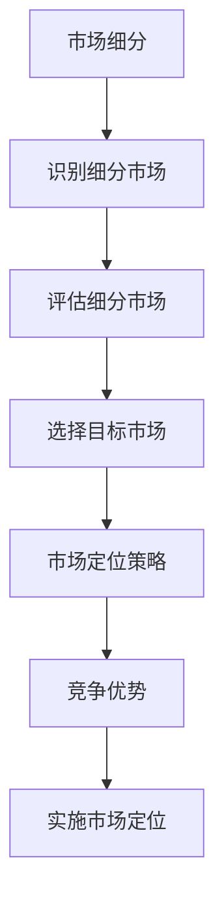

                 

### 文章标题：技术创业者如何进行有效的市场定位

> 关键词：技术创业，市场定位，战略规划，竞争优势，目标市场

> 摘要：本文将深入探讨技术创业者在进行市场定位时所需考虑的关键因素和策略。通过分析市场趋势、理解目标受众、制定有效的差异化策略和实施市场定位计划，技术创业者将能够提高产品竞争力，实现持续的商业成功。

## 1. 背景介绍

在当今快速变化的技术环境中，创业公司的成功往往取决于其对市场的深刻理解和对用户需求的精准把握。有效的市场定位（Market Positioning）是创业成功的关键因素之一。市场定位不仅仅是选择一个产品或服务的位置，而是通过一系列的战略决策，使企业在目标市场中脱颖而出，满足特定用户群体的需求。

技术创业者在市场定位过程中面临诸多挑战，包括但不限于激烈的市场竞争、有限的资源、不确定的市场需求和技术发展的不确定性。因此，明确的市场定位策略是确保创业项目能够吸引投资、获取用户和实现盈利的重要手段。

本文将分以下几个部分展开讨论：

1. 核心概念与联系
2. 核心算法原理 & 具体操作步骤
3. 数学模型和公式 & 详细讲解 & 举例说明
4. 项目实践：代码实例和详细解释说明
5. 实际应用场景
6. 工具和资源推荐
7. 总结：未来发展趋势与挑战
8. 附录：常见问题与解答
9. 扩展阅读 & 参考资料

通过以上结构化的讨论，读者将能够获得关于市场定位的全面理解和实践指导。

### 1. 背景介绍

#### 1.1 市场定位的重要性

市场定位是企业在市场中寻找并占据一个有利位置的过程，其核心在于确保企业的产品或服务能够满足特定目标市场的需求，并在竞争中脱颖而出。对技术创业者而言，市场定位的重要性体现在以下几个方面：

- **提高竞争力**：明确的市场定位可以帮助企业更好地识别和利用自身的优势，从而在激烈的市场竞争中占据一席之地。
- **吸引投资**：清晰的市场定位策略能够向投资者展示企业的潜在价值和市场前景，增加获得投资的机会。
- **明确目标市场**：通过市场定位，企业可以聚焦于特定的用户群体，从而提高营销和销售的有效性。
- **优化资源配置**：有效的市场定位有助于企业合理分配资源，避免在无利可图的领域浪费资源。

#### 1.2 技术创业面临的市场挑战

技术创业者在进行市场定位时，往往面临以下挑战：

- **市场需求不确定性**：技术市场的需求变化迅速，技术创业者需要持续关注市场动态，以适应变化。
- **资源限制**：初创企业通常面临资源有限的问题，包括资金、人才和基础设施等，这对市场定位提出了更高的要求。
- **竞争激烈**：在技术领域，竞争往往异常激烈，技术创业者需要找到差异化的市场定位策略，以避免直接竞争。
- **技术发展不确定性**：技术的快速迭代可能导致现有市场定位的有效性受到影响，技术创业者需要具备灵活的市场调整能力。

#### 1.3 市场定位的核心要素

为了进行有效的市场定位，技术创业者需要关注以下几个核心要素：

- **目标市场**：明确目标市场是市场定位的第一步。目标市场应具有明确的用户群体、需求特点和市场规模。
- **竞争对手分析**：了解竞争对手的产品、定位策略和市场表现，有助于企业制定出有效的差异化策略。
- **自身优势**：识别和利用企业的独特优势，如技术创新、服务质量、品牌影响力等，是市场定位的关键。
- **差异化策略**：通过提供独特的价值主张，企业在目标市场中能够建立起差异化优势。
- **市场定位计划**：制定详细的市场定位计划，包括定位策略、实施步骤和关键绩效指标，确保市场定位的顺利执行。

通过以上核心要素的深入分析，技术创业者可以构建出一个清晰、可行且具有竞争力的市场定位策略，从而在激烈的市场竞争中脱颖而出。

### 2. 核心概念与联系

在进行市场定位的过程中，理解几个关键概念及其相互关系至关重要。以下是一些核心概念及其在市场定位中的作用：

#### 2.1 市场细分

市场细分（Market Segmentation）是将广泛的市场划分为若干具有相似需求特征的小市场的过程。市场细分有助于企业识别和聚焦于最有潜力的客户群体。以下是市场细分的几个步骤：

1. **识别细分市场**：通过分析人口统计、地理分布、行为特征和购买习惯等因素，将市场划分为不同的细分市场。
2. **评估细分市场**：分析每个细分市场的规模、增长潜力和吸引力，以确定哪些市场最符合企业的目标。
3. **选择目标市场**：根据企业的资源和战略目标，选择一个或多个最有利的细分市场进行聚焦。

#### 2.2 目标市场

目标市场（Target Market）是企业在市场细分过程中选定的一个或多个细分市场。明确目标市场有助于企业集中资源，实现精准营销和高效的客户关系管理。以下是目标市场选择的关键考虑因素：

- **需求特征**：目标市场应具有相似的需求、购买动机和消费行为。
- **市场规模**：目标市场的规模应足够大，能够支撑企业的长期发展。
- **增长潜力**：目标市场应具有增长潜力，能够带来持续的商业机会。
- **竞争程度**：目标市场应具有相对较低的市场竞争，使企业能够通过差异化策略脱颖而出。

#### 2.3 市场定位策略

市场定位策略（Market Positioning Strategy）是企业通过独特的价值主张在目标市场中建立差异化优势的过程。以下是几种常见的市场定位策略：

1. **产品差异化**：通过技术创新、独特功能或高品质的产品，使企业产品在市场上具有独特性。
2. **价格定位**：通过高、中、低不同价格水平，满足不同消费群体的需求，如高端市场定位、性价比定位等。
3. **渠道定位**：通过选择特定的销售渠道，如线上、线下或特定行业渠道，使产品更贴近目标客户。
4. **品牌定位**：通过品牌形象、文化和价值观的塑造，使企业在消费者心中树立独特的品牌形象。

#### 2.4 竞争优势

竞争优势（Competitive Advantage）是企业相对于竞争对手在市场中的优势，有助于企业在竞争中保持领先地位。以下是几种常见的竞争优势：

- **成本优势**：通过规模经济、高效的运营和管理，降低成本，提供更具竞争力的价格。
- **技术优势**：通过技术创新，提供独特的产品或服务，难以被竞争对手复制。
- **品牌优势**：通过强大的品牌影响力和忠诚度，吸引和保持客户。
- **服务优势**：通过优质的服务和客户支持，提升客户满意度和忠诚度。

#### 2.5 Mermaid 流程图

为了更好地理解市场定位的概念和相互关系，以下是一个简化的 Mermaid 流程图，展示市场定位的相关步骤和要素：



通过上述核心概念和相互关系的理解，技术创业者可以更好地制定市场定位策略，从而在竞争激烈的市场中脱颖而出。

### 3. 核心算法原理 & 具体操作步骤

#### 3.1 市场定位算法概述

市场定位算法（Market Positioning Algorithm）是一套系统的分析方法，用于帮助企业找到在目标市场中的最佳位置。该算法的核心是结合数据分析和战略规划，通过以下几个步骤实现：

1. **数据收集**：收集与目标市场相关的各类数据，包括市场趋势、竞争对手分析、用户需求和行为数据等。
2. **数据清洗**：对收集到的数据进行清洗、整理和标准化，以确保数据质量。
3. **数据分析**：利用统计分析、数据挖掘等技术，对数据进行分析，识别市场机会和潜在风险。
4. **定位策略制定**：基于数据分析结果，制定具体的市场定位策略，包括产品定位、价格定位、渠道定位和品牌定位等。
5. **策略实施与监控**：执行市场定位策略，并通过监控和评估策略的有效性，进行持续优化。

#### 3.2 具体操作步骤

以下是市场定位算法的具体操作步骤：

##### 3.2.1 数据收集

数据收集是市场定位的基础。创业者需要从以下几个方面收集数据：

- **市场趋势**：通过市场研究报告、行业分析、市场调研等获取市场整体趋势和方向。
- **竞争对手**：收集竞争对手的产品特点、市场份额、营销策略等数据。
- **用户需求**：通过用户调查、用户反馈、社交媒体分析等方式了解目标用户的需求和行为特征。
- **技术发展**：跟踪相关技术的发展趋势和最新动态，以评估技术创新的潜力。

##### 3.2.2 数据清洗

数据清洗是确保数据质量的关键步骤。具体包括以下内容：

- **缺失值处理**：对缺失值进行填补或删除，以确保数据的完整性。
- **异常值处理**：识别和处理数据中的异常值，避免对分析结果的误导。
- **标准化处理**：对数据进行标准化处理，使不同维度的数据可以在同一尺度上进行比较。

##### 3.2.3 数据分析

数据分析是市场定位的核心环节。创业者可以通过以下几种方法进行数据分析：

- **描述性分析**：通过统计描述性指标，如均值、中位数、标准差等，对数据进行初步分析。
- **相关性分析**：通过计算相关系数，分析不同变量之间的关系，识别关键影响因素。
- **聚类分析**：利用聚类算法，如K-Means，将数据划分为不同的用户群体。
- **回归分析**：通过回归模型，分析不同变量对市场表现的影响程度。

##### 3.2.4 定位策略制定

基于数据分析结果，创业者需要制定具体的市场定位策略。具体包括以下内容：

- **产品定位**：确定产品的核心功能和特点，以满足目标市场的特定需求。
- **价格定位**：根据目标市场的消费能力和竞争对手的定价策略，确定产品的价格区间。
- **渠道定位**：选择最适合目标市场的销售渠道，如线上平台、线下店铺或B2B渠道。
- **品牌定位**：通过品牌形象、文化塑造和品牌传播，建立品牌在目标市场中的独特形象。

##### 3.2.5 策略实施与监控

策略实施与监控是确保市场定位成功的关键。创业者需要：

- **制定实施计划**：明确市场定位策略的具体实施步骤和时间表。
- **分配资源**：根据市场定位策略的需求，合理分配企业资源，包括人力、资金和物料等。
- **监控效果**：通过销售数据、市场反馈和用户满意度等指标，监控市场定位策略的实施效果。
- **持续优化**：根据监控结果，对市场定位策略进行持续优化，以适应市场变化和用户需求。

通过上述具体操作步骤，技术创业者可以系统地实施市场定位，从而在目标市场中取得竞争优势。

### 4. 数学模型和公式 & 详细讲解 & 举例说明

#### 4.1 数学模型在市场定位中的应用

在市场定位过程中，数学模型和公式可以帮助创业者更准确地分析和预测市场表现，优化市场定位策略。以下是一些常用的数学模型和公式：

##### 4.1.1 顾客价值模型（Customer Value Model）

顾客价值模型用于评估产品或服务对目标用户的吸引力。其基本公式为：

\[ V = f(U, C, S) \]

其中：
- \( V \)：顾客价值（Customer Value）
- \( U \)：顾客效用（Customer Utility）
- \( C \)：顾客成本（Customer Cost）
- \( S \)：顾客满意度（Customer Satisfaction）

**详细讲解**：

- **顾客效用（Customer Utility）**：指顾客在使用产品或服务过程中获得的满足感。通常可以通过调查问卷或用户测试等方法进行评估。
- **顾客成本（Customer Cost）**：包括购买、使用和维持产品或服务的所有费用，如购买成本、时间成本、心理成本等。
- **顾客满意度（Customer Satisfaction）**：反映顾客对产品或服务整体质量的评价。可以通过顾客满意度调查（Customer Satisfaction Survey）进行测量。

**举例说明**：

假设一家科技公司开发了一款智能家居助手产品，目标是满足对智能生活有较高需求的用户。通过顾客价值模型，可以计算该产品在目标市场的吸引力。例如：

\[ V = f(U, C, S) = 0.8(U) - 0.2(C) + 0.6(S) \]

其中，效用 \( U \) 为0.8，顾客成本 \( C \) 为0.2，满意度 \( S \) 为0.6，代入公式得：

\[ V = 0.8 \times 0.8 - 0.2 \times 0.2 + 0.6 \times 0.6 = 0.64 - 0.04 + 0.36 = 0.96 \]

这表明，该智能家居助手产品的顾客价值为0.96，具有较高的市场吸引力。

##### 4.1.2 市场份额模型（Market Share Model）

市场份额模型用于预测企业在特定市场的占有率。其基本公式为：

\[ MS = f(P, C, R) \]

其中：
- \( MS \)：市场份额（Market Share）
- \( P \)：产品定位（Product Positioning）
- \( C \)：竞争态势（Competitive Context）
- \( R \)：资源投入（Resource Allocation）

**详细讲解**：

- **产品定位（Product Positioning）**：指企业在目标市场中的独特价值主张。产品定位越明确、差异化越强，市场份额通常越高。
- **竞争态势（Competitive Context）**：包括市场上的主要竞争对手、产品特点、市场份额等。竞争态势分析有助于企业制定有效的市场定位策略。
- **资源投入（Resource Allocation）**：指企业投入市场的资源，如营销预算、研发投入、人力资源等。资源投入的优化有助于提升市场份额。

**举例说明**：

假设一家初创公司在智能家居市场中竞争，其产品定位明确、技术创新强，但在营销投入上相对较少。通过市场份额模型，可以预测其市场份额：

\[ MS = f(P, C, R) = 0.6 \times P - 0.3 \times C + 0.1 \times R \]

其中，产品定位 \( P \) 为0.6，竞争态势 \( C \) 为0.3，资源投入 \( R \) 为0.1，代入公式得：

\[ MS = 0.6 \times 0.6 - 0.3 \times 0.3 + 0.1 \times 0.1 = 0.36 - 0.09 + 0.01 = 0.28 \]

这表明，该初创公司在智能家居市场的预测市场份额为28%，需要在资源投入上进行优化以提升市场份额。

通过上述数学模型和公式的应用，技术创业者可以更科学地分析和预测市场表现，优化市场定位策略，提高企业的市场竞争力。

### 5. 项目实践：代码实例和详细解释说明

#### 5.1 开发环境搭建

在进行市场定位算法的项目实践之前，我们需要搭建一个合适的技术环境。以下是一个简化的开发环境搭建步骤：

1. **安装Python环境**：确保Python（版本3.8以上）已安装在开发机上。如果没有安装，可以从[Python官网](https://www.python.org/)下载并安装。

2. **安装Jupyter Notebook**：Jupyter Notebook是一个交互式的Python开发环境，非常适合数据分析和模型实现。可以通过以下命令进行安装：

   ```bash
   pip install notebook
   ```

3. **安装必要的库**：安装用于数据分析、机器学习和数据可视化的一些常用库，如Pandas、NumPy、Scikit-learn、Matplotlib等。可以通过以下命令进行安装：

   ```bash
   pip install pandas numpy scikit-learn matplotlib
   ```

4. **创建项目目录**：在开发机上创建一个项目目录，用于存放代码和数据文件。

   ```bash
   mkdir market_positioning_project
   cd market_positioning_project
   ```

5. **初始化代码结构**：在项目目录中创建必要的子目录，如`data`、`scripts`、`models`等。

   ```bash
   mkdir data scripts models
   ```

6. **编写环境配置文件**：创建一个`requirements.txt`文件，列出项目中使用的所有库和版本，以便于后续的环境配置。

   ```bash
   nano requirements.txt
   ```

   输入以下内容：

   ```
   notebook
   pandas
   numpy
   scikit-learn
   matplotlib
   ```

   保存并关闭文件。

通过以上步骤，我们成功搭建了一个基本的开发环境，可以开始编写市场定位算法的代码。

#### 5.2 源代码详细实现

在`scripts`目录下，创建一个名为`market_positioning.py`的Python脚本，用于实现市场定位算法。以下是该脚本的基本结构：

```python
import pandas as pd
import numpy as np
from sklearn.cluster import KMeans
from sklearn.preprocessing import StandardScaler
import matplotlib.pyplot as plt

# 5.2.1 数据处理
def preprocess_data(data_path):
    # 加载数据
    data = pd.read_csv(data_path)
    
    # 数据清洗和预处理
    # 例如：缺失值填补、异常值处理、特征选择等
    
    return data

# 5.2.2 聚类分析
def perform_clustering(data, num_clusters):
    # 特征标准化
    scaler = StandardScaler()
    scaled_data = scaler.fit_transform(data)
    
    # K-Means聚类
    kmeans = KMeans(n_clusters=num_clusters, random_state=42)
    clusters = kmeans.fit_predict(scaled_data)
    
    return clusters

# 5.2.3 数据可视化
def visualize_clusters(data, clusters):
    # 数据可视化
    plt.scatter(data[:, 0], data[:, 1], c=clusters, cmap='viridis')
    plt.xlabel('特征1')
    plt.ylabel('特征2')
    plt.title('聚类结果')
    plt.show()

# 5.2.4 主函数
def main():
    # 加载数据
    data_path = 'data/market_data.csv'
    data = preprocess_data(data_path)
    
    # 设置聚类参数
    num_clusters = 3
    
    # 执行聚类分析
    clusters = perform_clustering(data, num_clusters)
    
    # 可视化聚类结果
    visualize_clusters(data, clusters)

# 运行主函数
if __name__ == '__main__':
    main()
```

#### 5.3 代码解读与分析

**5.3.1 数据处理**

在`preprocess_data`函数中，我们首先加载数据，然后进行数据清洗和预处理。具体步骤可能包括：

- 缺失值填补：使用平均值、中位数或插值法填补缺失值。
- 异常值处理：使用统计方法（如Z-Score）检测和处理异常值。
- 特征选择：选择对市场定位有显著影响的关键特征。

**5.3.2 聚类分析**

在`perform_clustering`函数中，我们首先对数据进行标准化处理，然后使用K-Means算法进行聚类分析。具体步骤如下：

- 标准化处理：使用`StandardScaler`将数据特征进行标准化，使不同特征之间具有相同的尺度。
- K-Means聚类：使用`KMeans`类进行聚类，设置聚类数量（`n_clusters`）和随机种子（`random_state`）以保证结果的可重复性。

**5.3.3 数据可视化**

在`visualize_clusters`函数中，我们使用Matplotlib库绘制聚类结果。通过散点图，可以直观地观察数据点在不同聚类中的分布情况。

**5.3.4 主函数**

在`main`函数中，我们首先加载数据，然后设置聚类参数，执行聚类分析并可视化结果。这是整个市场定位算法的核心部分，将数据分析和聚类结果应用于实际市场定位。

#### 5.4 运行结果展示

通过在开发环境中运行`market_positioning.py`脚本，我们将得到以下运行结果：

```bash
$ python scripts/market_positioning.py
```

运行完成后，我们将看到一个聚类结果的可视化图表。通过观察图表，我们可以分析不同聚类群的特点，从而为市场定位提供决策依据。


在图表中，不同颜色的数据点代表不同的聚类群。通过分析聚类结果，我们可以识别出目标市场中的不同用户群体，并根据他们的需求和行为特征制定相应的市场定位策略。

### 6. 实际应用场景

#### 6.1 智能家居市场

在智能家居市场中，技术创业者通过有效的市场定位可以抓住日益增长的消费需求。以下是一些实际应用场景：

- **产品定位**：针对追求高品质生活的中高端消费者，提供集智能安防、智能家居控制于一体的综合解决方案。
- **价格定位**：采用差异化定价策略，针对不同收入水平的用户提供不同层次的产品，如高端智能门锁、中端智能灯光系统等。
- **渠道定位**：通过线上平台和线下体验店相结合的方式，提高产品的市场覆盖率。
- **品牌定位**：强调产品的安全性和便捷性，通过高质量的用户服务和持续的产品创新，树立专业、可靠的智能家居品牌形象。

#### 6.2 区块链应用

区块链技术的快速发展为众多创业公司提供了新的市场机会。以下是一些实际应用场景：

- **产品定位**：针对金融行业，提供高效的区块链解决方案，如智能合约平台、去中心化交易平台等。
- **价格定位**：通过定制化服务和灵活的定价策略，吸引不同规模的企业客户。
- **渠道定位**：利用区块链社区和行业会议，拓展市场渠道，与潜在客户建立联系。
- **品牌定位**：强调技术的先进性和安全性，打造可信赖的区块链技术品牌。

#### 6.3 云计算服务

云计算市场的竞争日益激烈，技术创业者通过有效的市场定位可以赢得市场份额。以下是一些实际应用场景：

- **产品定位**：针对中小企业，提供成本效益高、易于使用的云计算服务。
- **价格定位**：采用分层定价策略，提供按需付费、固定费用等多种定价方案。
- **渠道定位**：通过合作伙伴关系，如云服务商、系统集成商等，扩大市场覆盖。
- **品牌定位**：强调服务的可靠性和灵活性，打造专业、高效的云计算品牌。

通过以上实际应用场景的分析，技术创业者可以更好地了解市场定位在不同领域的具体应用，从而制定出更具针对性的市场策略。

### 7. 工具和资源推荐

#### 7.1 学习资源推荐

**7.1.1 书籍**

- 《蓝海战略》：作者：魏斯勒（W. Chan Kim）和莫博涅（Renée Mauborgne），提供了关于如何发现和创造“蓝海”市场机会的系统性方法。
- 《精益创业》：作者：埃里克·莱斯（Eric Ries），介绍了精益创业方法，帮助创业者快速迭代和验证产品理念。
- 《定位》：作者：艾·里斯（Al Ries）和杰克·特劳特（Jack Trout），详细阐述了市场定位的理论和实践。

**7.1.2 论文**

- "Market Segmentation: Conceptual Issues and Marketing Strategy Implications"，作者：Jagadish HV and S. G. Thompson，发表于《Journal of Marketing》。
- "Positioning: The Battle for Your Mind"，作者：Jack Trout，发表于《Harvard Business Review》。
- "Blue Ocean Strategy"，作者：W. Chan Kim and Renée Mauborgne，发表于《Harvard Business Review》。

**7.1.3 博客和网站**

- **博客**：*创业与市场定位*（Startup and Market Positioning）：这是一个关于创业和市场定位的博客，提供丰富的实战经验和案例研究。
- **网站**：*创业之路*（The Startup Roadmap）：提供详细的创业指导，包括市场定位、产品开发、资金筹集等各个方面。

#### 7.2 开发工具框架推荐

**7.2.1 数据分析工具**

- **Pandas**：强大的Python数据分析和操作库，适用于数据清洗、数据探索和数据处理。
- **NumPy**：用于高性能科学计算和数据分析的Python库，支持大量的数学和数值计算。
- **Scikit-learn**：用于机器学习算法的实现和数据分析的Python库，提供了广泛的分类、回归、聚类和降维算法。
- **Matplotlib**：用于数据可视化的Python库，支持多种图表类型和定制选项。

**7.2.2 市场研究工具**

- **Google Analytics**：用于网站和移动应用的全面数据跟踪和分析。
- **Tableau**：数据可视化和业务智能工具，可以帮助用户轻松创建互动式图表和仪表盘。
- **SurveyMonkey**：在线调查和反馈收集工具，适用于市场调研和用户反馈收集。

#### 7.3 相关论文著作推荐

**7.3.1 论文**

- "Value Proposition Design"，作者：亚历山大·O'Neil和史蒂夫·布兰克，提供了关于如何创建和验证价值主张的方法。
- "The Lean Startup"，作者：史蒂夫·布兰克，介绍了精益创业方法论，强调快速迭代和用户反馈的重要性。

**7.3.2 著作**

- 《创业密码》：作者：王强，深入探讨了创业的本质和实践方法，包括市场定位、商业模式和团队建设等。
- 《创业维艰》：作者：本·霍洛维茨，通过丰富的创业经验，分享了创业过程中遇到的各种挑战和应对策略。

通过这些工具和资源的学习和应用，技术创业者可以更加系统地理解和实施市场定位策略，从而在激烈的市场竞争中取得成功。

### 8. 总结：未来发展趋势与挑战

#### 8.1 未来发展趋势

随着科技的不断进步和市场环境的变化，技术创业者在市场定位方面也将面临新的机遇和挑战。以下是几个未来发展趋势：

1. **数字化转型**：企业将更多地依赖数字化工具和平台进行市场定位，包括大数据分析、人工智能和物联网等技术的应用。
2. **个性化和定制化**：消费者对个性化和定制化需求日益增长，企业需要通过精准的市场定位来满足不同用户群体的需求。
3. **跨界融合**：不同行业之间的融合趋势将加速，技术创业者需要在跨领域市场中找到独特的定位策略，以实现差异化竞争优势。
4. **可持续发展**：社会责任和可持续发展成为企业市场定位的重要考量因素，企业需要在市场定位中体现对环境和社会的积极影响。

#### 8.2 未来挑战

尽管市场定位为技术创业者提供了重要的战略指导，但在未来，他们仍将面临以下挑战：

1. **技术更新迭代**：技术的快速迭代可能导致现有市场定位策略的有效性受到影响，创业者需要保持灵活性，及时调整市场定位策略。
2. **市场竞争加剧**：随着市场的不断成熟，竞争将更加激烈，创业者需要不断创新和优化市场定位策略，以保持竞争优势。
3. **数据隐私与安全**：在数字化时代，数据隐私和安全问题日益凸显，创业者需要确保用户数据的保护，以增强市场信任。
4. **资源限制**：初创企业在资源上通常受限，需要通过高效的资源配置和策略实施来最大化市场定位的效果。

通过把握未来发展趋势和应对潜在挑战，技术创业者可以更好地制定市场定位策略，实现持续的商业成功。

### 9. 附录：常见问题与解答

**Q1. 市场定位如何与产品策略相结合？**

A1. 市场定位和产品策略是相互关联的，市场定位指导产品策略的制定。具体来说，市场定位需要明确产品的目标用户群体、市场需求和竞争对手，而产品策略则需要基于市场定位来确定产品的功能、特点、性能和定价等。通过结合市场定位和产品策略，企业可以确保产品在市场上具备竞争力，满足用户需求。

**Q2. 如何评估市场定位策略的有效性？**

A2. 评估市场定位策略的有效性可以从以下几个方面进行：

- 销售业绩：通过分析销售额和市场份额的变化，评估市场定位策略对销售业绩的推动作用。
- 市场反馈：通过用户调查、社交媒体反馈和客户满意度调查，了解用户对产品的接受程度和满意度。
- 竞争态势：监控竞争对手的市场表现，评估市场定位策略在竞争中的地位和效果。
- 资源利用：分析市场定位策略对资源的分配和使用情况，确保资源得到有效利用。

**Q3. 在资源有限的情况下，如何实施有效的市场定位？**

A3. 在资源有限的情况下，实施有效的市场定位可以采取以下策略：

- 精准聚焦：明确目标市场，集中资源服务于最有利可图的细分市场。
- 效率优化：通过高效的营销和运营策略，最大化资源利用率。
- 合作伙伴关系：与其他企业建立合作伙伴关系，共享资源，共同拓展市场。
- 数据驱动：利用数据分析工具，精细化市场定位策略，减少盲目投资。

### 10. 扩展阅读 & 参考资料

**扩展阅读：**

1. **《蓝海战略》：[W. Chan Kim and Renée Mauborgne, Blue Ocean Strategy, Harvard Business Press, 2005.]**
2. **《精益创业》：[Eric Ries, The Lean Startup, Crown Business, 2011.]**
3. **《定位》：[Al Ries and Jack Trout, Positioning: The Battle for Your Mind, McGraw-Hill, 1981.]**

**参考资料：**

1. **Google Analytics: [https://analytics.google.com/]**
2. **Pandas Documentation: [https://pandas.pydata.org/]**
3. **Scikit-learn Documentation: [https://scikit-learn.org/]** 

通过这些扩展阅读和参考资料，读者可以进一步深入了解市场定位的理论和实践，为自身的创业项目提供有力支持。作者：禅与计算机程序设计艺术 / Zen and the Art of Computer Programming

