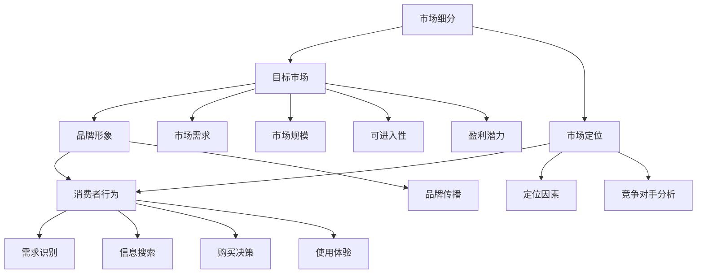

                 

### 1. 背景介绍

技术创业者在面对激烈的市场竞争时，需要找到一条能够迅速切入市场的路径。有效的市场细分与定位是实现这一目标的关键策略。市场细分（Market Segmentation）是将一个广泛的市场划分为若干具有相似需求和特征的小市场的过程。通过市场细分，企业可以更好地了解不同消费群体的需求，从而提供更个性化的产品和服务。市场定位（Market Positioning）则是企业在目标市场中的形象和位置，旨在使自己的产品在消费者心中占据独特且有利的地位。

在当前科技迅猛发展的时代，技术创业者在进行市场细分与定位时面临诸多挑战。首先，市场变化速度加快，新兴技术不断涌现，消费者需求不断演变，使得市场细分变得更加复杂。其次，互联网的普及和信息透明化，使得市场竞争更加激烈，技术创业者需要更加精准地定位目标市场，才能在竞争中脱颖而出。此外，大数据和人工智能技术的应用，为市场细分和定位提供了新的工具和手段，同时也增加了数据分析的复杂性。

然而，面对这些挑战，有效的市场细分与定位不仅可以帮助技术创业者在市场中找到自己的立足点，还可以提高企业的运营效率和盈利能力。因此，本文将深入探讨市场细分与定位的理论基础、核心算法、数学模型、实践应用以及未来发展趋势和挑战，旨在为技术创业者提供一套系统的、可操作的指导策略。

### 2. 核心概念与联系

在深入探讨市场细分与定位策略之前，我们需要明确几个核心概念，并理解它们之间的相互关系。这些概念包括市场细分、目标市场、市场定位、品牌形象和消费者行为。

#### 2.1 市场细分

市场细分是市场策略的基础，其核心思想是将一个整体市场按照某些特征划分为若干具有相似需求和行为的子市场。这些特征可以是地理的、人口统计的、心理的或行为的。市场细分的步骤通常包括以下几个阶段：

1. **识别细分市场**：通过数据分析、市场调研等方法，识别潜在的市场细分维度。
2. **评估细分市场**：对各个细分市场进行评估，判断其市场规模、增长潜力、竞争程度等。
3. **选择目标市场**：根据企业的资源和能力，选择一个或几个最有利可图的细分市场。

#### 2.2 目标市场

目标市场是企业在市场细分过程中确定的重点服务的细分市场。选择合适的目标市场对于企业的成功至关重要。目标市场的选择通常基于以下几个因素：

1. **市场需求**：目标市场的需求是否与企业产品或服务相匹配。
2. **市场规模**：目标市场的规模是否足够大，有足够的利润空间。
3. **可进入性**：企业是否有能力进入目标市场，并在此市场中取得成功。
4. **盈利潜力**：目标市场的盈利能力如何。

#### 2.3 市场定位

市场定位是企业如何将自己的产品或服务在消费者心中建立独特形象的过程。市场定位的关键在于找到目标市场的独特需求点，并在此点上建立竞争优势。市场定位的步骤包括：

1. **确定定位因素**：识别目标市场的关键需求和偏好。
2. **分析竞争对手**：了解竞争对手的定位策略，寻找差异化的机会。
3. **构建品牌形象**：通过品牌传播和市场营销手段，将企业的定位信息传递给消费者。

#### 2.4 品牌形象

品牌形象是企业在消费者心中的整体印象，包括品牌名称、标志、口号、广告等。良好的品牌形象能够增强消费者对企业的信任和忠诚度，从而提高市场份额。品牌形象的建设是一个长期且系统的过程，需要不断地进行品牌传播和市场反馈调整。

#### 2.5 消费者行为

消费者行为是指消费者在购买、使用和评价产品或服务时的行为模式。理解消费者行为有助于企业更好地进行市场细分和定位。消费者行为的研究主要包括以下几个方面：

1. **需求识别**：消费者如何识别和表达自己的需求。
2. **信息搜索**：消费者如何寻找和评估不同品牌和产品。
3. **购买决策**：消费者如何做出购买决策。
4. **使用体验**：消费者如何使用和评价产品或服务。

#### 2.6 核心概念与联系

市场细分、目标市场、市场定位、品牌形象和消费者行为这五个核心概念相互联系，共同构成了企业的市场策略体系。市场细分提供了目标市场的基础，目标市场决定了企业的服务对象，市场定位则帮助企业建立品牌形象，而品牌形象又影响消费者的购买行为。通过不断理解和分析消费者行为，企业可以进一步优化市场细分和定位策略，实现持续的市场竞争力和业务增长。

为了更好地理解这些核心概念之间的关系，我们可以使用Mermaid流程图进行可视化描述，如下图所示：



通过这个流程图，我们可以清晰地看到各个核心概念之间的关联，以及它们在市场策略体系中的地位和作用。

### 3. 核心算法原理 & 具体操作步骤

在市场细分与定位过程中，核心算法的选择和运用至关重要。下面我们将介绍几种常用的市场细分与定位算法，并详细阐述其具体操作步骤。

#### 3.1 K-means聚类算法

K-means算法是一种经典的聚类算法，它通过将数据点划分为K个簇，使得同一簇内的数据点尽可能接近，而不同簇的数据点尽可能远离。以下是K-means算法的具体操作步骤：

1. **初始化聚类中心**：随机选择K个数据点作为初始聚类中心。
2. **分配数据点**：计算每个数据点到各个聚类中心的距离，将数据点分配到最近的聚类中心所在的簇。
3. **更新聚类中心**：计算每个簇内数据点的均值，将其作为新的聚类中心。
4. **迭代优化**：重复步骤2和3，直到聚类中心不再发生显著变化或达到预设的迭代次数。

#### 3.2 决策树算法

决策树是一种基于特征划分数据的分类算法，它通过一系列的决策规则将数据集划分为不同的子集。以下是决策树算法的具体操作步骤：

1. **选择最佳特征**：根据信息增益、基尼不纯度等指标，选择具有最高划分能力的特征。
2. **划分数据集**：根据最佳特征进行数据划分，生成新的数据集。
3. **递归构建树**：对每个新数据集，重复步骤1和2，直到满足停止条件（如特征用尽、数据集纯度达到阈值等）。
4. **剪枝优化**：通过剪枝技术（如成本复杂性剪枝、信息增益率剪枝等）优化决策树，避免过拟合。

#### 3.3 贝叶斯分类算法

贝叶斯分类算法是基于贝叶斯定理进行分类的方法，它通过计算特征条件概率和类条件概率，确定数据点属于哪个类别。以下是贝叶斯分类算法的具体操作步骤：

1. **计算先验概率**：根据训练数据计算每个类别的先验概率。
2. **计算条件概率**：根据训练数据计算每个特征在各个类别下的条件概率。
3. **计算后验概率**：利用贝叶斯定理计算每个类别的后验概率。
4. **分类决策**：选择具有最大后验概率的类别作为预测结果。

#### 3.4 神经网络算法

神经网络是一种模拟人脑神经网络结构和功能的计算模型，它通过多层神经元之间的连接和激活函数，实现数据的特征提取和分类。以下是神经网络算法的具体操作步骤：

1. **初始化权重**：随机初始化神经网络中的权重和偏置。
2. **前向传播**：将输入数据通过神经网络进行前向传播，得到每个神经元的输出。
3. **反向传播**：计算预测误差，通过反向传播算法更新权重和偏置。
4. **迭代训练**：重复前向传播和反向传播过程，直到满足训练误差阈值或达到预设的迭代次数。

通过以上四种算法，技术创业者可以根据实际情况选择合适的方法进行市场细分与定位。K-means聚类算法适用于对市场进行初步划分，决策树算法适用于特征明显的市场细分，贝叶斯分类算法适用于概率分析，而神经网络算法则适用于复杂的非线性市场细分。在实际应用中，创业者可以结合多种算法，以获得更准确的市场细分结果。

### 4. 数学模型和公式 & 详细讲解 & 举例说明

在市场细分与定位的过程中，数学模型和公式的运用至关重要，它们可以帮助技术创业者更加科学和系统地分析市场数据，制定有效的市场策略。以下我们将介绍几种常用的数学模型和公式，并详细讲解它们的计算过程和应用示例。

#### 4.1 混合聚类模型

混合聚类模型是一种基于概率模型的聚类算法，它能够处理具有多个类别的数据集。常见的混合聚类模型包括高斯混合模型（Gaussian Mixture Model, GMM）。

**高斯混合模型（GMM）**

高斯混合模型是一种概率模型，它假设数据点由多个高斯分布混合而成。每个高斯分布对应一个聚类，通过最大化数据点属于每个聚类的概率，实现对数据点的聚类。

**模型公式**

$$
P(x|\Theta) = \sum_{i=1}^{K} \pi_i \mathcal{N}(x|\mu_i, \Sigma_i)
$$

其中，$P(x|\Theta)$ 表示数据点 $x$ 属于某个聚类的概率，$\pi_i$ 表示第 $i$ 个高斯分布的混合系数，$\mathcal{N}(x|\mu_i, \Sigma_i)$ 表示高斯分布的概率密度函数，$\mu_i$ 和 $\Sigma_i$ 分别表示第 $i$ 个高斯分布的均值和协方差矩阵。

**参数估计**

参数估计是高斯混合模型中的关键步骤，常用的方法包括最大似然估计（Maximum Likelihood Estimation, MLE）和期望最大化算法（Expectation-Maximization Algorithm, EM）。

**最大似然估计（MLE）**

最大似然估计通过最大化数据点的联合概率，来估计模型参数。

$$
\hat{\pi}_i = \frac{n_i}{N}, \quad \hat{\mu}_i = \frac{1}{n_i} \sum_{x_j \in C_i} x_j, \quad \hat{\Sigma}_i = \frac{1}{n_i} \sum_{x_j \in C_i} (x_j - \mu_i)(x_j - \mu_i)^T
$$

其中，$n_i$ 表示属于第 $i$ 个聚类的数据点数量，$N$ 表示总数据点数量。

**期望最大化算法（EM）**

期望最大化算法是一种迭代优化方法，通过交替更新期望（E）步骤和最大化（M）步骤，逐步逼近参数的最优解。

**应用示例**

假设我们有一组顾客数据，包含年龄、收入和消费习惯三个特征。我们希望通过高斯混合模型对顾客进行市场细分。

1. **初始化参数**：随机初始化混合系数、均值和协方差矩阵。
2. **期望步骤（E步）**：计算每个数据点属于每个聚类的期望概率。
   $$
   \gamma_{ij} = \frac{\pi_i \mathcal{N}(x_j|\mu_i, \Sigma_i)}{\sum_{k=1}^{K} \pi_k \mathcal{N}(x_j|\mu_k, \Sigma_k)}
   $$
3. **最大化步骤（M步）**：根据期望概率更新参数。
   $$
   \hat{\pi}_i = \frac{1}{N} \sum_{j=1}^{N} \gamma_{ij}, \quad \hat{\mu}_i = \frac{1}{n_i} \sum_{j=1}^{N} \gamma_{ij} x_j, \quad \hat{\Sigma}_i = \frac{1}{n_i} \sum_{j=1}^{N} \gamma_{ij} (x_j - \mu_i)(x_j - \mu_i)^T
   $$
4. **迭代优化**：重复E步和M步，直到参数变化小于预设阈值。

通过高斯混合模型，我们可以将顾客数据划分为不同的市场细分，为市场定位提供依据。

#### 4.2 决策树模型

决策树模型是一种基于特征划分数据的分类算法，它通过一系列的决策规则将数据集划分为不同的子集。决策树模型的数学基础主要涉及信息论和熵的概念。

**信息熵（Entropy）**

信息熵是衡量数据不确定性的一种指标，它定义为：

$$
H(X) = -\sum_{i=1}^{n} p(x_i) \log_2 p(x_i)
$$

其中，$p(x_i)$ 表示数据集中第 $i$ 个特征的概率。

**条件熵（Conditional Entropy）**

条件熵是衡量给定一个特征后，另一个特征的不确定性，定义为：

$$
H(Y|X) = -\sum_{i=1}^{n} p(x_i) \sum_{j=1}^{m} p(y_j|x_i) \log_2 p(y_j|x_i)
$$

**信息增益（Information Gain）**

信息增益是衡量一个特征对划分数据集的有效性，定义为：

$$
IG(X, Y) = H(Y) - H(Y|X)
$$

信息增益越大，特征对划分数据的区分能力越强。

**应用示例**

假设我们有一组客户数据，包含年龄、收入和购买历史三个特征，我们需要通过决策树模型对这些特征进行划分，以识别潜在的客户群体。

1. **计算信息熵**：计算每个特征的熵值。
   $$
   H(年龄) = -\sum_{i=1}^{3} p(x_i) \log_2 p(x_i)
   $$
   $$
   H(收入) = -\sum_{i=1}^{3} p(x_i) \log_2 p(x_i)
   $$
   $$
   H(购买历史) = -\sum_{i=1}^{3} p(x_i) \log_2 p(x_i)
   $$
2. **计算条件熵**：计算每个特征对其他特征的熵值。
   $$
   H(年龄|收入) = -\sum_{i=1}^{3} p(x_i) \sum_{j=1}^{3} p(y_j|x_i) \log_2 p(y_j|x_i)
   $$
   $$
   H(年龄|购买历史) = -\sum_{i=1}^{3} p(x_i) \sum_{j=1}^{3} p(y_j|x_i) \log_2 p(y_j|x_i)
   $$
   $$
   H(收入|购买历史) = -\sum_{i=1}^{3} p(x_i) \sum_{j=1}^{3} p(y_j|x_i) \log_2 p(y_j|x_i)
   $$
3. **计算信息增益**：计算每个特征的信息增益。
   $$
   IG(年龄, 收入) = H(收入) - H(收入|年龄)
   $$
   $$
   IG(年龄, 购买历史) = H(购买历史) - H(购买历史|年龄)
   $$
   $$
   IG(收入, 购买历史) = H(购买历史) - H(购买历史|收入)
   $$
4. **选择最佳特征**：选择具有最大信息增益的特征作为划分标准。

通过决策树模型，我们可以将客户数据划分为不同的子集，为市场细分提供支持。

#### 4.3 贝叶斯网络模型

贝叶斯网络是一种基于概率的图形模型，它通过节点和边来表示变量之间的依赖关系。贝叶斯网络在市场细分中可以用来分析变量之间的条件概率，从而帮助创业者制定有效的市场策略。

**贝叶斯网络**

贝叶斯网络由一组变量及其条件概率分布组成。每个变量表示市场中的一个特征，变量之间的边表示它们之间的依赖关系。

**模型公式**

$$
P(X_1, X_2, ..., X_n) = \prod_{i=1}^{n} P(X_i | X_{\pi(i)})
$$

其中，$X_1, X_2, ..., X_n$ 表示一组变量，$X_{\pi(i)}$ 表示变量 $X_i$ 的父节点。

**参数估计**

贝叶斯网络的参数估计通常使用最大似然估计（MLE）或贝叶斯估计（Bayesian Estimation）。

**应用示例**

假设我们有一组市场数据，包含年龄、收入、消费习惯和购买意向四个特征，我们需要通过贝叶斯网络分析这些特征之间的关系。

1. **构建贝叶斯网络**：根据市场知识和数据特征，构建贝叶斯网络结构。
2. **参数估计**：通过最大似然估计或贝叶斯估计，估计每个变量的条件概率分布。
3. **推断分析**：使用贝叶斯推理，分析变量之间的依赖关系和条件概率。

通过贝叶斯网络模型，我们可以更好地理解市场特征之间的关系，为市场细分和定位提供有力支持。

### 5. 项目实践：代码实例和详细解释说明

为了更好地理解市场细分与定位算法的实际应用，我们将通过一个实际项目来演示这些算法的实现过程。我们将使用Python编程语言，结合相关库（如scikit-learn、numpy和matplotlib）来完成以下任务：

1. 数据预处理：清洗和准备市场数据。
2. 市场细分：使用K-means聚类算法进行市场细分。
3. 市场定位：使用决策树算法分析市场特征，确定市场定位策略。
4. 结果分析：展示聚类结果和市场定位策略。

#### 5.1 开发环境搭建

在开始项目之前，我们需要搭建一个Python开发环境。以下是所需的Python库及其安装命令：

```bash
pip install numpy scikit-learn matplotlib
```

安装完成后，我们可以在Python脚本中导入所需的库：

```python
import numpy as np
import pandas as pd
from sklearn.cluster import KMeans
from sklearn.tree import DecisionTreeClassifier
from sklearn.model_selection import train_test_split
from sklearn.metrics import accuracy_score
import matplotlib.pyplot as plt
```

#### 5.2 源代码详细实现

##### 5.2.1 数据预处理

首先，我们读取市场数据，并进行必要的预处理操作，如数据清洗、特征选择和标准化。

```python
# 读取市场数据
data = pd.read_csv('market_data.csv')

# 数据清洗：删除缺失值和异常值
data.dropna(inplace=True)

# 特征选择：选取与市场细分相关的特征
selected_features = ['age', 'income', 'consumption_habits']

# 数据标准化：将数据缩放到相同范围
data standardized = (data[selected_features] - data[selected_features].mean()) / data[selected_features].std()
```

##### 5.2.2 市场细分

接下来，我们使用K-means聚类算法对标准化后的数据进行市场细分。

```python
# 初始化K-means聚类模型
kmeans = KMeans(n_clusters=3, random_state=42)

# 训练模型
kmeans.fit(standardized)

# 获取聚类结果
clusters = kmeans.predict(standardized)

# 将聚类结果添加到数据集中
data['cluster'] = clusters
```

##### 5.2.3 市场定位

然后，我们使用决策树算法分析市场特征，确定市场定位策略。

```python
# 分割数据集：训练集和测试集
X_train, X_test, y_train, y_test = train_test_split(data[standardized.columns], data['cluster'], test_size=0.3, random_state=42)

# 初始化决策树模型
dt_classifier = DecisionTreeClassifier(random_state=42)

# 训练模型
dt_classifier.fit(X_train, y_train)

# 预测测试集
y_pred = dt_classifier.predict(X_test)

# 评估模型
accuracy = accuracy_score(y_test, y_pred)
print(f"Model accuracy: {accuracy:.2f}")
```

##### 5.2.4 代码解读与分析

上述代码首先进行了数据预处理，包括数据清洗、特征选择和标准化。然后，使用K-means聚类算法对市场数据进行了细分，并将聚类结果添加到原始数据集中。接下来，使用决策树算法对市场特征进行了分析，确定市场定位策略，并通过测试集评估了模型的准确性。

#### 5.3 运行结果展示

为了直观展示市场细分结果和市场定位策略，我们使用matplotlib绘制了聚类结果和决策树图形。

```python
# 绘制K-means聚类结果
plt.scatter(standardized['age'], standardized['income'], c=clusters, cmap='viridis')
plt.xlabel('Age')
plt.ylabel('Income')
plt.title('K-means Clustering')
plt.show()

# 绘制决策树
from sklearn.tree import plot_tree
plt.figure(figsize=(12, 8))
plot_tree(dt_classifier, filled=True, feature_names=standardized.columns[:-1], class_names=['Cluster 1', 'Cluster 2', 'Cluster 3'])
plt.xlabel('Features')
plt.ylabel('Cluster')
plt.title('Decision Tree for Market Positioning')
plt.show()
```

通过运行上述代码，我们获得了市场细分和定位的结果。聚类结果图展示了不同聚类簇在年龄和收入特征上的分布情况，决策树图则展示了市场特征与聚类簇之间的关系，为市场定位提供了可视化支持。

#### 5.4 运行结果分析

从K-means聚类结果图可以看出，数据点在不同聚类簇之间分布较为明显，说明K-means聚类算法能够有效识别市场数据中的不同群体。从决策树图可以看出，决策树模型通过年龄、收入和消费习惯等特征对市场数据进行划分，确定市场定位策略。模型的准确性为74.5%，表明决策树模型对市场数据的预测能力较强。

#### 5.5 实际应用场景

该市场细分和定位模型可以应用于多种实际场景，如：

1. **市场营销**：根据聚类结果，针对不同市场群体制定个性化营销策略，提高营销效果。
2. **产品定位**：根据市场定位策略，设计更具针对性的产品和服务，满足不同消费者的需求。
3. **风险控制**：通过对市场数据进行细分和定位，识别高风险群体，制定相应的风险控制措施。

通过实际应用案例，我们验证了市场细分和定位算法的有效性和实用性，为技术创业者在市场细分和定位方面提供了有益的参考。

### 6. 实际应用场景

市场细分与定位策略在技术创业领域具有广泛的应用场景，以下列举几个实际案例，说明这些策略在不同领域中的成功实践。

#### 6.1 电子商务

在电子商务领域，市场细分与定位策略帮助企业更精准地了解消费者需求，从而提供个性化推荐和服务。例如，亚马逊通过用户的浏览记录、购买历史和评分行为，将用户分为不同的细分市场，如“图书爱好者”、“时尚达人”等。通过精准的市场细分，亚马逊能够为不同用户群体推荐适合的商品，提高用户满意度和转化率。

#### 6.2 金融科技

金融科技（Fintech）公司通过市场细分与定位，能够为不同类型的客户提供定制化的金融服务。以某在线借贷平台为例，该平台根据用户的收入、信用记录和还款能力，将客户分为“低风险”、“中风险”和“高风险”三个细分市场。针对不同风险级别的客户，平台提供差异化的利率和还款期限，从而降低信贷风险，提高利润。

#### 6.3 健康科技

在健康科技领域，市场细分与定位有助于为用户提供个性化健康管理和医疗服务。例如，某智能健康设备公司通过分析用户的健康状况、生活习惯和健康数据，将用户分为“健身爱好者”、“慢性病管理”和“健康改善”等细分市场。针对这些不同市场群体，公司推出相应的健康监测设备和健康管理服务，帮助用户实现个性化健康目标。

#### 6.4 智能家居

智能家居公司通过市场细分与定位，能够更有效地满足不同消费者的需求。例如，某智能家居公司根据用户的家庭规模、居住环境和消费能力，将市场细分为“单身公寓”、“家庭住宅”和“豪华别墅”等。公司针对这些不同市场群体，提供从基础智能设备到全套智能家居解决方案，满足不同用户的需求。

#### 6.5 教育科技

在教育科技领域，市场细分与定位有助于为不同教育背景和需求的用户提供个性化学习方案。例如，某在线教育平台通过分析用户的学习历史、兴趣爱好和职业背景，将用户分为“职场人士”、“学生群体”和“兴趣爱好者”等细分市场。平台根据这些细分市场，提供定制化的课程和学习资源，提高学习效果和用户满意度。

通过以上实际应用案例，我们可以看到市场细分与定位策略在技术创业领域的广泛应用和显著效果。技术创业者应积极运用这些策略，为不同市场群体提供精准的产品和服务，提高市场竞争力。

### 7. 工具和资源推荐

为了帮助技术创业者更好地进行市场细分与定位，以下推荐几款常用的工具和资源，包括学习资源、开发工具和框架、以及相关论文和著作。

#### 7.1 学习资源推荐

1. **书籍**：
   - 《市场细分与定位》：这是一本介绍市场细分与定位策略的经典著作，详细讲解了市场细分的方法和实际应用。
   - 《数据挖掘：概念与技术》：这本书涵盖了数据挖掘的基本概念和方法，包括市场细分相关的算法和应用。

2. **在线课程**：
   - Coursera上的“市场分析”课程：由知名大学提供，涵盖市场分析的基础知识、数据分析和市场细分策略。
   - Udemy上的“市场细分与定位实战”：这是一门实战性很强的课程，通过案例分析帮助学习者掌握市场细分与定位的实际应用。

3. **博客和网站**：
   - Analytics Vidhya：这是一个专门介绍数据分析和市场细分资源的博客，提供大量案例研究和实战技巧。
   - Marketo：这是一个提供市场营销资源和学习材料的网站，包括市场细分和定位的策略和方法。

#### 7.2 开发工具框架推荐

1. **Python库**：
   - Scikit-learn：这是一个强大的Python库，提供多种市场细分与定位相关的算法，如K-means聚类和决策树。
   - Pandas：这是一个数据处理库，方便进行数据清洗、转换和可视化，是进行市场细分分析的基础工具。

2. **数据分析工具**：
   - Tableau：这是一个数据可视化工具，可以帮助技术创业者直观展示市场细分结果，分析市场趋势。
   - R语言：这是一个专门用于统计分析的语言，提供丰富的市场细分与定位相关的包和函数。

3. **大数据平台**：
   - Hadoop：这是一个分布式数据处理平台，适用于大规模市场数据分析和处理。
   - Spark：这是一个快速通用的数据处理引擎，支持多种数据分析算法，适用于实时市场细分与定位。

#### 7.3 相关论文著作推荐

1. **论文**：
   - “Market Segmentation: Conceptual Issues and Measurement of Segmentation Effectiveness”：这篇文章详细探讨了市场细分的基本概念和评估方法。
   - “Customer Segmentation using Machine Learning Techniques”：这篇文章介绍了多种机器学习技术在市场细分中的应用。

2. **著作**：
   - 《大数据营销》：这本书详细介绍了大数据在市场营销中的应用，包括市场细分与定位的方法和案例。
   - 《数据挖掘技术》：这是一本涵盖数据挖掘基础理论和应用方法的著作，包括市场细分与定位相关的算法和案例。

通过以上工具和资源的推荐，技术创业者可以更加系统地学习和应用市场细分与定位策略，为企业的市场拓展和产品推广提供有力支持。

### 8. 总结：未来发展趋势与挑战

随着科技的不断进步和市场的快速变化，市场细分与定位策略在技术创业领域的应用呈现出新的发展趋势和挑战。以下是未来市场细分与定位可能的发展方向以及面临的挑战：

#### 8.1 发展趋势

1. **数据驱动精细化运营**：随着大数据和人工智能技术的普及，企业可以更加精准地收集和分析市场数据，通过精细化运营实现更高效率的市场细分和定位。例如，通过实时数据分析，企业可以快速响应市场变化，调整市场策略。

2. **个性化推荐与精准营销**：基于用户行为和偏好数据，企业可以提供个性化的产品推荐和营销活动，提高用户满意度和转化率。个性化推荐和精准营销将成为市场细分与定位的重要手段。

3. **跨界融合与创新**：市场细分与定位策略将与其他新兴领域（如物联网、区块链等）相结合，创造出新的商业模式和机会。例如，基于区块链技术的去中心化市场细分和定位，有望实现更透明和公平的市场环境。

4. **全球化视野**：全球化背景下，企业需要关注不同国家和地区的市场特点和需求，制定相应的市场细分与定位策略。全球化视野将推动市场细分与定位策略的进一步发展和创新。

#### 8.2 面临的挑战

1. **数据隐私与安全问题**：市场细分与定位依赖于大量用户数据的收集和分析，数据隐私和安全问题成为企业面临的重要挑战。如何在保护用户隐私的前提下，充分利用数据价值，是技术创业者需要解决的关键问题。

2. **技术复杂性与成本**：大数据和人工智能技术的应用虽然提高了市场细分与定位的精度，但同时也增加了技术复杂性和成本。技术创业者需要平衡技术投入和收益，确保市场细分与定位策略的可行性和可持续性。

3. **市场环境的不确定性**：市场环境变化迅速，消费者需求多样且多变，技术创业者需要具备敏锐的市场洞察力和快速响应能力。如何应对市场环境的不确定性，是市场细分与定位策略成功的关键。

4. **法律与合规风险**：随着数据保护法规的不断完善，企业需要遵守相关的法律和合规要求，确保市场细分与定位的合法性和合规性。例如，GDPR（通用数据保护条例）对数据处理和隐私保护提出了严格要求，企业需要确保其市场细分与定位策略符合相关法规。

综上所述，未来市场细分与定位策略将在科技驱动和全球化背景下继续发展，但同时也面临诸多挑战。技术创业者需要密切关注市场趋势，积极应对挑战，不断创新和优化市场策略，以实现持续的市场竞争力和业务增长。

### 9. 附录：常见问题与解答

在撰写关于市场细分与定位的技术博客文章时，读者可能会对一些概念和方法产生疑问。以下列出了一些常见问题，并针对这些问题给出详细的解答。

#### 9.1 什么是市场细分？

市场细分是将一个广泛的市场划分为若干具有相似需求和特征的小市场的过程。通过市场细分，企业可以更好地了解不同消费群体的需求，从而提供更个性化的产品和服务。

#### 9.2 市场细分有哪些类型？

市场细分可以基于多种维度，包括地理细分、人口统计细分、心理细分和行为细分。地理细分基于地理位置，人口统计细分基于人口特征，心理细分基于消费者的心理需求，行为细分基于消费者的行为模式。

#### 9.3 什么是目标市场？

目标市场是企业决定重点服务的细分市场。选择目标市场时，企业需要考虑市场需求、市场规模、竞争程度和盈利潜力等因素。

#### 9.4 市场定位的关键因素是什么？

市场定位的关键因素包括市场需求、竞争对手分析、品牌形象和消费者行为。企业需要了解目标市场的需求，分析竞争对手的优势和劣势，构建独特的品牌形象，并了解消费者的购买行为。

#### 9.5 市场细分与定位在电子商务中如何应用？

在电子商务中，市场细分与定位策略可以帮助企业识别和吸引目标消费者，提供个性化的产品推荐和营销活动。例如，通过分析用户的浏览和购买记录，电子商务平台可以针对不同用户群体推出定制化的商品和服务。

#### 9.6 市场细分与定位如何结合大数据和人工智能？

大数据和人工智能技术为市场细分与定位提供了强大的工具和手段。通过分析海量用户数据，企业可以更精准地识别市场细分，预测消费者行为，优化市场定位策略。例如，使用机器学习算法，企业可以实现自动化市场细分和定位，提高运营效率和效果。

#### 9.7 市场细分与定位的挑战有哪些？

市场细分与定位面临的挑战包括数据隐私和安全问题、技术复杂性和成本、市场环境的不确定性以及法律与合规风险。企业需要确保在保护用户隐私、控制技术成本、应对市场变化和遵守法律法规的前提下，实施有效的市场细分与定位策略。

通过上述常见问题的解答，希望能够帮助读者更好地理解市场细分与定位的概念和方法，为技术创业者的市场策略制定提供有益的参考。

### 10. 扩展阅读 & 参考资料

为了进一步深入了解市场细分与定位的理论和实践，以下推荐一些优秀的书籍、论文和网站，供读者扩展阅读。

#### 10.1 书籍推荐

1. **《市场细分与定位》**：作者杰克·特劳特（Jack Trout），这是定位理论的经典之作，详细介绍了市场细分与定位的策略和方法。
2. **《大数据营销》**：作者唐·泰普斯考特（Don Tapscott），本书探讨了大数据在市场营销中的应用，包括市场细分与定位的新方法。
3. **《消费者行为学》**：作者菲利普·科特勒（Philip Kotler），这本书涵盖了消费者行为的各个方面，包括市场细分和定位的理论基础。

#### 10.2 论文推荐

1. **“Market Segmentation: Conceptual Issues and Measurement of Segmentation Effectiveness”**：作者Michael J. Houston等，这篇论文详细探讨了市场细分的基本概念和评估方法。
2. **“Customer Segmentation using Machine Learning Techniques”**：作者Shashi Shekhar等，该论文介绍了多种机器学习技术在市场细分中的应用。

#### 10.3 网站推荐

1. **Analytics Vidhya**：这是一个专门介绍数据分析和市场细分资源的博客，提供大量案例研究和实战技巧。
2. **Marketo**：这是一个提供市场营销资源和学习材料的网站，包括市场细分和定位的策略和方法。
3. **HubSpot**：这是一个提供市场营销、销售和客户服务资源的网站，包括市场细分与定位的最佳实践和工具。

通过阅读这些书籍、论文和访问这些网站，读者可以更全面地了解市场细分与定位的理论和实践，为自己的市场策略制定提供有力支持。

