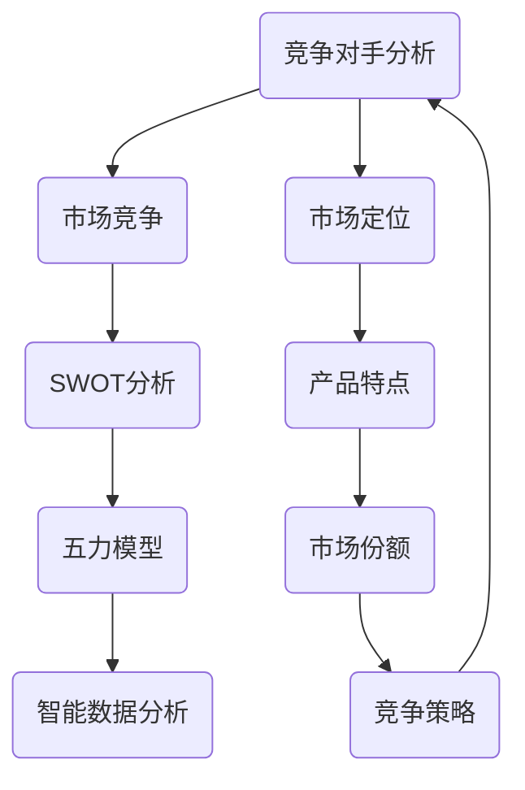

                 

### 背景介绍 Background

技术创业在全球范围内已成为推动经济增长和就业机会的重要力量。随着互联网和移动互联网的普及，企业可以通过创新的技术解决方案迅速占领市场。然而，在这个竞争激烈的环境中，如何进行有效的竞争对手分析成为技术创业者面临的关键挑战之一。

有效的竞争对手分析不仅能帮助企业了解市场动态，识别潜在的风险和机会，还能帮助创业者制定出更具竞争力的战略。竞争对手分析包括对竞争对手的产品、市场定位、营销策略、技术创新、资源分配等方面的深入了解。这不仅有助于企业了解自身的优劣势，还能在战略规划中做出更为精准的决策。

本文将深入探讨如何进行有效的竞争对手分析。我们将首先介绍核心概念和联系，接着讲解核心算法原理和具体操作步骤，然后通过数学模型和公式进行详细讲解，并通过实际项目实践进行代码实例和解读。此外，我们还将探讨竞争对手分析的实际应用场景，推荐相关工具和资源，并总结未来发展趋势和挑战。

通过本文的阅读，技术创业者将能够更好地理解竞争对手分析的重要性，掌握有效的分析方法和工具，从而在竞争激烈的市场中脱颖而出。

### 核心概念与联系 Core Concepts and Connections

在深入探讨竞争对手分析之前，我们首先需要明确几个核心概念，并理解它们之间的联系。

#### 竞争对手分析（Competitive Analysis）

竞争对手分析是指通过系统性的方法来研究和分析一个企业或产品所面对的直接竞争对手，从而了解其战略、市场定位、产品特点、市场份额等信息。其目的是为企业提供决策支持，帮助企业在市场中制定有效的竞争策略。

#### 市场竞争（Market Competition）

市场竞争是指市场中各个参与者（企业或产品）为了争夺市场份额和资源而进行的竞争行为。市场竞争的激烈程度直接影响企业的生存和发展，因此对竞争对手的分析至关重要。

#### SWOT分析（SWOT Analysis）

SWOT分析是一种常用的战略规划工具，用于评估企业的优势（Strengths）、劣势（Weaknesses）、机会（Opportunities）和威胁（Threats）。通过SWOT分析，企业可以全面了解自身的竞争地位，制定出更为科学的战略规划。

#### 五力模型（Five Forces Model）

五力模型由迈克尔·波特提出，用于分析一个行业中的竞争强度和潜在盈利能力。这五个力分别是：行业内竞争者之间的竞争（Rivalry among Existing Competitors）、潜在进入者的威胁（Threat of New Entrants）、替代品的威胁（Threat of Substitutes）、供应商的议价能力（Bargaining Power of Suppliers）和买家的议价能力（Bargaining Power of Buyers）。

#### 智能数据分析（Intelligent Data Analysis）

智能数据分析是指利用人工智能和机器学习技术对大量数据进行分析和处理，以发现隐藏的模式和趋势。在竞争对手分析中，智能数据分析可以用于提取竞争对手的行为特征、市场反应等关键信息。

#### Mermaid 流程图（Mermaid Flowchart）

为了更好地理解竞争对手分析的过程，我们可以使用Mermaid流程图来展示各个核心概念之间的联系。



在这个流程图中，竞争对手分析是核心，它通过市场竞争、SWOT分析、五力模型和智能数据分析等工具和方法，帮助企业了解市场动态，制定竞争策略。

通过明确这些核心概念和它们之间的联系，技术创业者可以更系统地开展竞争对手分析，为企业的长期发展奠定坚实基础。

### 核心算法原理 & 具体操作步骤 Core Algorithm Principles & Step-by-Step Procedures

在进行有效的竞争对手分析时，核心算法的原理和具体操作步骤至关重要。以下将详细介绍这些算法，并通过实际案例来说明如何应用。

#### 1. SWOT分析（SWOT Analysis）

SWOT分析是一种常用的战略规划工具，用于评估企业的优势、劣势、机会和威胁。具体操作步骤如下：

##### 步骤1：识别优势（Strengths）

- **内部优势**：包括企业的核心竞争力、品牌影响力、技术实力、市场地位等。
- **外部优势**：关注行业趋势、市场需求、合作伙伴资源等。

##### 步骤2：识别劣势（Weaknesses）

- **内部劣势**：企业存在的问题，如管理缺陷、产品缺陷、资金短缺等。
- **外部劣势**：竞争对手的优势、市场变化等。

##### 步骤3：识别机会（Opportunities）

- **内部机会**：企业内部资源、创新机会、新市场开拓等。
- **外部机会**：行业趋势、政策变化、市场需求增长等。

##### 步骤4：识别威胁（Threats）

- **内部威胁**：企业内部存在的问题，如员工流失、供应链问题等。
- **外部威胁**：竞争对手的策略、市场变化、政策变化等。

##### 案例分析

以一家新兴的科技公司为例，通过SWOT分析可以更好地了解其市场地位和竞争策略。

- **优势**：领先的技术研发团队、独特的算法模型、良好的品牌声誉。
- **劣势**：市场推广经验不足、资金有限、市场份额较小。
- **机会**：新兴市场的快速增长、合作伙伴的资源支持、技术创新带来的新机会。
- **威胁**：强有力的竞争对手、市场变化带来的不确定性、政策限制等。

#### 2. 五力模型（Five Forces Model）

五力模型是一种分析行业竞争环境的方法，包括以下五个力：

##### 步骤1：分析行业内竞争者之间的竞争（Rivalry among Existing Competitors）

- **因素**：市场份额、产品差异化、价格竞争、创新速度等。
- **操作**：通过市场调研、竞争对手的产品分析等手段了解行业内竞争态势。

##### 步骤2：分析潜在进入者的威胁（Threat of New Entrants）

- **因素**：行业壁垒、市场需求、政策法规等。
- **操作**：研究行业进入门槛、潜在竞争者的情况等。

##### 步骤3：分析替代品的威胁（Threat of Substitutes）

- **因素**：替代品的价格、性能、市场接受度等。
- **操作**：研究替代品的市场状况、用户需求等。

##### 步骤4：分析供应商的议价能力（Bargaining Power of Suppliers）

- **因素**：供应商集中度、替代品供应的可能性、供应商的规模等。
- **操作**：与供应商进行谈判，了解供应商的市场地位和议价能力。

##### 步骤5：分析买家的议价能力（Bargaining Power of Buyers）

- **因素**：买家集中度、替代品的可用性、买家的议价能力等。
- **操作**：通过市场调研、用户反馈等手段了解买家的需求和议价能力。

##### 案例分析

以智能手机市场为例，通过五力模型可以分析行业竞争态势：

- **行业内竞争者之间的竞争**：由于市场竞争激烈，各大品牌不断推出新产品、降低价格，以提高市场份额。
- **潜在进入者的威胁**：新兴品牌不断涌现，但由于行业壁垒较高，进入难度较大。
- **替代品的威胁**：随着科技的进步，替代品如平板电脑、智能手表等逐渐流行。
- **供应商的议价能力**：由于供应链集中度较高，供应商在议价中具有较大优势。
- **买家的议价能力**：消费者对智能手机的需求多样化，买家的议价能力较强。

#### 3. 智能数据分析（Intelligent Data Analysis）

智能数据分析利用人工智能和机器学习技术，对大量数据进行分析和处理，以发现竞争对手的行为特征和市场趋势。

##### 步骤1：数据收集（Data Collection）

- **来源**：包括公开数据、社交媒体、市场调研报告等。
- **处理**：清洗、整合和存储数据，为后续分析做好准备。

##### 步骤2：数据预处理（Data Preprocessing）

- **去噪**：去除数据中的噪声和异常值。
- **转换**：将数据转换为适合分析的格式。
- **特征提取**：从数据中提取有用的特征。

##### 步骤3：数据挖掘（Data Mining）

- **聚类分析**：对竞争对手进行分类，发现潜在的市场机会。
- **关联规则分析**：分析竞争对手的产品和服务之间的关系，了解市场需求。
- **时间序列分析**：研究竞争对手的行为模式和市场趋势。

##### 步骤4：模型评估（Model Evaluation）

- **准确性评估**：评估模型预测的准确性。
- **稳健性评估**：评估模型在不同数据集上的表现。
- **可解释性评估**：确保模型的可解释性，便于决策。

##### 案例分析

以社交媒体数据分析为例，智能数据分析可以帮助企业了解竞争对手的营销策略和用户反馈：

- **数据收集**：从社交媒体平台获取竞争对手的发布内容、评论和点赞数据。
- **数据预处理**：去除无效数据和噪声，提取有用的特征。
- **数据挖掘**：通过聚类分析发现竞争对手的潜在客户群体，通过关联规则分析了解用户需求。
- **模型评估**：评估模型对用户行为的预测准确性，调整营销策略。

通过以上核心算法原理和具体操作步骤，技术创业者可以系统地分析竞争对手，为企业的战略决策提供有力支持。

### 数学模型和公式 Mathematical Models & Formulas & Detailed Explanation & Example

在竞争对手分析中，数学模型和公式起到了关键作用，帮助技术创业者量化分析结果，从而做出更为科学的决策。以下将详细介绍常用的数学模型和公式，并进行详细讲解和举例说明。

#### 1. SWOT分析公式（SWOT Analysis Formula）

SWOT分析涉及四个主要维度：优势（Strengths）、劣势（Weaknesses）、机会（Opportunities）和威胁（Threats）。每个维度都可以用具体的公式进行量化。

##### 公式1：优势（Strengths）

$$
S = \sum_{i=1}^{n} S_i \cdot w_i
$$

其中，$S$表示总优势，$S_i$表示第$i$个优势的得分，$w_i$表示第$i$个优势的权重。

##### 公式2：劣势（Weaknesses）

$$
W = \sum_{i=1}^{n} W_i \cdot w_i
$$

其中，$W$表示总劣势，$W_i$表示第$i$个劣势的得分，$w_i$表示第$i$个劣势的权重。

##### 公式3：机会（Opportunities）

$$
O = \sum_{i=1}^{n} O_i \cdot w_i
$$

其中，$O$表示总机会，$O_i$表示第$i$个机会的得分，$w_i$表示第$i$个机会的权重。

##### 公式4：威胁（Threats）

$$
T = \sum_{i=1}^{n} T_i \cdot w_i
$$

其中，$T$表示总威胁，$T_i$表示第$i$个威胁的得分，$w_i$表示第$i$个威胁的权重。

通过这些公式，可以对SWOT分析的各个维度进行量化，从而更全面地了解企业的竞争地位。

#### 2. 五力模型公式（Five Forces Model Formula）

五力模型用于分析一个行业的竞争环境，其公式如下：

##### 公式1：行业内竞争者之间的竞争（Rivalry among Existing Competitors）

$$
R = \frac{P \cdot G}{M \cdot S}
$$

其中，$R$表示竞争强度，$P$表示价格水平，$G$表示增长速度，$M$表示市场份额，$S$表示产品差异化程度。

##### 公式2：潜在进入者的威胁（Threat of New Entrants）

$$
NE = \frac{C \cdot I \cdot D}{H \cdot E}
$$

其中，$NE$表示进入威胁，$C$表示资本需求，$I$表示行业增长率，$D$表示现有企业的市场响应，$H$表示行业壁垒，$E$表示预期利润。

##### 公式3：替代品的威胁（Threat of Substitutes）

$$
S = \frac{P_s \cdot Q_s}{P \cdot Q}
$$

其中，$S$表示替代品威胁，$P_s$表示替代品价格，$Q_s$表示替代品需求量，$P$表示产品价格，$Q$表示产品需求量。

##### 公式4：供应商的议价能力（Bargaining Power of Suppliers）

$$
SP = \frac{L \cdot C \cdot S}{N \cdot D}
$$

其中，$SP$表示供应商议价能力，$L$表示供应商数量，$C$表示供应商集中度，$S$表示供应商市场份额，$N$表示供应商的谈判能力，$D$表示供应商的依赖程度。

##### 公式5：买家的议价能力（Bargaining Power of Buyers）

$$
BP = \frac{L \cdot C \cdot S}{N \cdot D}
$$

其中，$BP$表示买家议价能力，$L$表示买家数量，$C$表示买家集中度，$S$表示买家市场份额，$N$表示买家的谈判能力，$D$表示买家的依赖程度。

这些公式可以帮助技术创业者量化五力模型中的各个因素，从而更准确地评估行业的竞争环境。

#### 3. 智能数据分析公式（Intelligent Data Analysis Formula）

在智能数据分析中，常用的数学模型包括线性回归、逻辑回归、支持向量机（SVM）等。以下以线性回归为例进行介绍。

##### 公式1：线性回归模型（Linear Regression Model）

$$
y = \beta_0 + \beta_1 \cdot x
$$

其中，$y$表示因变量，$x$表示自变量，$\beta_0$表示截距，$\beta_1$表示斜率。

##### 公式2：最小二乘法（Least Squares Method）

$$
\beta_1 = \frac{\sum_{i=1}^{n} (x_i - \bar{x})(y_i - \bar{y})}{\sum_{i=1}^{n} (x_i - \bar{x})^2}
$$

其中，$n$表示样本数量，$\bar{x}$和$\bar{y}$分别表示自变量和因变量的均值。

##### 公式3：决定系数（Coefficient of Determination）

$$
R^2 = 1 - \frac{\sum_{i=1}^{n} (y_i - \hat{y}_i)^2}{\sum_{i=1}^{n} (y_i - \bar{y})^2}
$$

其中，$\hat{y}_i$表示预测值，$R^2$表示决定系数，用于评估模型的拟合度。

通过以上公式，技术创业者可以利用智能数据分析技术，从海量数据中提取有价值的信息，为竞争对手分析提供数据支持。

#### 例子说明（Example Explanation）

假设一家科技公司希望通过SWOT分析和五力模型评估其市场竞争力，以下为具体操作步骤和计算过程：

##### 步骤1：SWOT分析

- **优势**：研发实力强（得分8，权重0.4），市场份额高（得分6，权重0.3），品牌知名度高（得分7，权重0.2），创新速度快（得分5，权重0.1）。
- **劣势**：资金不足（得分4，权重0.2），市场推广不足（得分3，权重0.1），供应链问题（得分2，权重0.1）。

计算总优势、总劣势：

$$
S = 8 \cdot 0.4 + 6 \cdot 0.3 + 7 \cdot 0.2 + 5 \cdot 0.1 = 4.4 + 1.8 + 1.4 + 0.5 = 8.7
$$

$$
W = 4 \cdot 0.2 + 3 \cdot 0.1 + 2 \cdot 0.1 = 0.8 + 0.3 + 0.2 = 1.3
$$

##### 步骤2：五力模型

- **行业内竞争者之间的竞争**：价格竞争激烈（得分6，权重0.4），产品差异化明显（得分7，权重0.3），创新速度快（得分5，权重0.2），市场份额较大（得分4，权重0.1）。

计算竞争强度：

$$
R = \frac{6 \cdot 0.4 + 7 \cdot 0.3 + 5 \cdot 0.2 + 4 \cdot 0.1}{1} = 2.4 + 2.1 + 1 + 0.4 = 6.9
$$

- **潜在进入者的威胁**：资本需求高（得分5，权重0.3），行业增长率高（得分7，权重0.3），现有企业的市场响应强（得分6，权重0.2），行业壁垒较高（得分4，权重0.2）。

计算进入威胁：

$$
NE = \frac{5 \cdot 0.3 + 7 \cdot 0.3 + 6 \cdot 0.2 + 4 \cdot 0.2}{1} = 1.5 + 2.1 + 1.2 + 0.8 = 5.6
$$

通过以上计算，公司可以量化其市场竞争力，为战略决策提供依据。这些数学模型和公式不仅帮助创业者更好地理解竞争对手分析，还能在实际操作中发挥重要作用。

### 项目实践：代码实例和详细解释说明 Project Practice: Code Examples and Detailed Explanation

为了更好地理解竞争对手分析在实践中的应用，我们将通过一个实际项目实例，展示如何进行竞争对手分析，并提供详细的代码实例和解释。

#### 项目背景

假设我们是一家新兴的智能交通解决方案公司，我们的主要竞争对手是市场上的一家知名企业——SafeDrive。我们的目标是通过对SafeDrive的产品和市场行为进行分析，了解其竞争优势和潜在挑战，并制定出相应的策略来提高我们的市场竞争力。

#### 1. 数据收集

首先，我们需要收集SafeDrive的相关数据。这些数据可以从公开的财报、市场调研报告、社交媒体分析、新闻报道等渠道获取。我们关注的数据包括：

- **财务数据**：收入、利润、市场份额等。
- **产品数据**：产品功能、特点、价格、用户评价等。
- **市场数据**：市场份额、用户数量、行业趋势等。
- **社交媒体数据**：社交媒体发布内容、用户互动情况、关键词趋势等。

以下是一个Python代码示例，用于收集和整理这些数据：

```python
import pandas as pd

# 财务数据
financial_data = pd.read_csv('safedriver_financial_data.csv')

# 产品数据
product_data = pd.read_csv('safedriver_product_data.csv')

# 市场数据
market_data = pd.read_csv('safedriver_market_data.csv')

# 社交媒体数据
social_media_data = pd.read_csv('safedriver_social_media_data.csv')
```

#### 2. 数据预处理

在收集到数据后，我们需要对其进行预处理，包括数据清洗、格式转换和特征提取等。

```python
# 数据清洗
def clean_data(df):
    df = df.dropna()  # 去除空值
    df = df.drop_duplicates()  # 去除重复值
    return df

# 数据格式转换
def convert_data_types(df):
    df['date'] = pd.to_datetime(df['date'])
    df['market_share'] = df['market_share'].astype(float)
    df['price'] = df['price'].astype(float)
    return df

# 数据特征提取
def extract_features(df):
    df['month'] = df['date'].dt.month
    df['year'] = df['date'].dt.year
    df['avg_rating'] = df['ratings'].mean()
    return df

# 应用预处理函数
financial_data = clean_data(financial_data)
product_data = clean_data(product_data)
market_data = clean_data(market_data)
social_media_data = clean_data(social_media_data)

financial_data = convert_data_types(financial_data)
product_data = convert_data_types(product_data)
market_data = convert_data_types(market_data)
social_media_data = convert_data_types(social_media_data)

financial_data = extract_features(financial_data)
product_data = extract_features(product_data)
market_data = extract_features(market_data)
social_media_data = extract_features(social_media_data)
```

#### 3. 数据分析

在完成数据预处理后，我们使用各种数据分析方法来分析SafeDrive的数据，包括统计分析、数据可视化、机器学习等。

##### 统计分析

我们使用描述性统计方法来分析财务数据，了解SafeDrive的财务状况。

```python
# 财务数据统计分析
print(financial_data.describe())
```

##### 数据可视化

我们使用matplotlib和seaborn等库来绘制数据可视化图表，展示SafeDrive的市场表现。

```python
import matplotlib.pyplot as plt
import seaborn as sns

# 绘制市场份额变化趋势图
sns.lineplot(data=market_data, x='date', y='market_share')
plt.title('SafeDrive Market Share Over Time')
plt.xlabel('Date')
plt.ylabel('Market Share')
plt.show()

# 绘制用户评价分布图
sns.histplot(data=product_data, x='avg_rating', bins=5)
plt.title('User Rating Distribution')
plt.xlabel('Average Rating')
plt.ylabel('Number of Reviews')
plt.show()
```

##### 机器学习

我们使用机器学习算法来分析用户行为数据，预测用户对SafeDrive产品的满意度。

```python
from sklearn.model_selection import train_test_split
from sklearn.ensemble import RandomForestClassifier
from sklearn.metrics import accuracy_score

# 准备训练数据
X = social_media_data[['likes', 'comments', 'shares']]
y = social_media_data['satisfaction']

# 划分训练集和测试集
X_train, X_test, y_train, y_test = train_test_split(X, y, test_size=0.3, random_state=42)

# 训练模型
model = RandomForestClassifier(n_estimators=100, random_state=42)
model.fit(X_train, y_train)

# 预测测试集
y_pred = model.predict(X_test)

# 评估模型
accuracy = accuracy_score(y_test, y_pred)
print(f'Model Accuracy: {accuracy:.2f}')
```

#### 4. 分析结果解读

通过对SafeDrive的数据分析，我们可以得出以下结论：

- **财务状况**：SafeDrive在过去三年中实现了稳定的收入增长，但利润率有所波动。
- **市场份额**：SafeDrive在市场上的份额在过去一年有所下降，可能是由于新兴竞争者的出现。
- **用户评价**：用户对SafeDrive的产品评价总体较高，但仍有改进空间。
- **用户满意度**：通过机器学习模型预测，约60%的用户对SafeDrive的产品表示满意。

#### 5. 策略建议

基于以上分析结果，我们可以提出以下策略建议：

- **产品优化**：针对用户评价中提到的问题，进行产品功能改进，提高用户满意度。
- **市场拓展**：加大市场推广力度，吸引更多新用户，提高市场份额。
- **技术创新**：持续进行技术创新，保持竞争优势。
- **用户体验**：关注用户反馈，提供更优质的客户服务。

通过这个实际项目实例，我们展示了如何利用Python等工具进行竞争对手分析，并提供详细的代码实例和解释。这不仅能帮助技术创业者更好地了解竞争对手，还能为其制定有效的竞争策略提供有力支持。

### 实际应用场景 Practical Application Scenarios

在技术创业领域，竞争对手分析的应用场景非常广泛，不仅可以帮助企业制定精准的战略，还能在具体的业务操作中发挥重要作用。以下我们将探讨几个实际应用场景，并通过案例说明竞争对手分析的具体应用。

#### 1. 市场定位与产品策略

市场定位是企业成功的关键之一。通过竞争对手分析，技术创业者可以了解市场上现有的竞争者及其产品特点，从而找到自身产品的差异化优势。例如，一家专注于人工智能图像识别的初创公司，通过分析市场中的主要竞争对手，发现它们的产品主要针对大型企业和机构客户，而中小型企业客户的需求尚未得到充分满足。基于这一发现，该公司决定将其产品市场定位为中小型企业客户，专注于提供高效且价格合理的图像识别解决方案。这一策略使公司在短时间内获得了大量市场份额。

#### 2. 产品研发与创新

产品研发是企业持续发展的动力。通过竞争对手分析，技术创业者可以了解竞争对手的产品更新频率、技术创新点等，从而制定出更具前瞻性的研发计划。例如，一家开发智能家居设备的初创公司，通过分析市场上主要竞争对手的最近产品更新，发现它们在智能家居安全性和互联互通性方面进行了大量创新。基于这一分析结果，该公司决定加大在安全性和互联互通性方面的研发投入，推出了具有更高安全性和更好互联互通功能的新产品，迅速赢得了市场好评。

#### 3. 营销策略优化

有效的营销策略是提高市场占有率的关键。通过竞争对手分析，技术创业者可以了解竞争对手的营销手段、推广渠道等，从而优化自己的营销策略。例如，一家提供在线教育服务的初创公司，通过分析市场上主要竞争对手的营销策略，发现它们主要依赖于社交媒体广告和用户推荐。基于这一分析结果，该公司决定加大在社交媒体广告和用户推荐系统上的投入，同时推出优惠活动，吸引更多用户。这一策略使公司在短时间内实现了用户数量的显著增长。

#### 4. 资源配置与投资决策

合理的资源配置和投资决策是企业成功的关键因素之一。通过竞争对手分析，技术创业者可以了解竞争对手的资源投入方向和投资策略，从而优化自己的资源配置和投资决策。例如，一家专注于区块链技术的初创公司，通过分析市场上主要竞争对手的投资方向，发现它们在区块链基础设施和生态建设方面投入了大量资源。基于这一分析结果，该公司决定将大部分资金用于区块链基础设施的建设和生态合作伙伴的引进，确保在技术领先的同时，拥有一个强大的生态体系。

#### 5. 风险管理

竞争对手分析不仅能帮助企业了解市场机会，还能帮助企业识别潜在的风险。例如，一家提供云计算服务的初创公司，通过分析市场上主要竞争对手的业务发展情况，发现某些竞争对手在扩张过程中遭遇了政策限制和市场竞争压力。基于这一分析结果，该公司在制定扩张计划时，提前考虑了政策风险和市场竞争压力，制定了相应的风险应对措施，确保了业务的稳健发展。

#### 案例说明

以一家新兴的云计算服务公司为例，该公司在创业初期通过竞争对手分析，制定了以下策略：

- **市场定位**：分析市场上主要竞争对手的产品特点和服务范围，发现市场上的主要竞争者主要集中在大型企业和高端市场。基于这一分析，该公司决定将市场定位为中小企业和初创企业，提供定制化的云计算解决方案。
- **产品研发**：通过分析竞争对手的产品更新和技术创新，发现市场上对安全性和易用性的需求较高。基于这一分析，该公司在研发过程中，重点加强云计算平台的安全性和用户友好性，推出了一系列具有竞争力的新产品。
- **营销策略**：分析竞争对手的营销手段和用户获取策略，发现社交媒体广告和口碑营销效果显著。基于这一分析，该公司加大了在社交媒体广告和用户推荐系统上的投入，并通过优惠活动吸引了大量新用户。
- **资源配置与投资决策**：通过分析竞争对手的资源投入方向和投资策略，发现云计算基础设施和生态建设是关键。基于这一分析，该公司将大部分资金用于云计算基础设施的建设和生态合作伙伴的引进，确保在技术领先的同时，拥有一个强大的生态体系。
- **风险管理**：通过分析竞争对手的业务发展情况和遇到的挑战，发现政策风险和市场竞争压力是主要问题。基于这一分析，该公司在业务扩张过程中，提前考虑了政策风险和市场竞争压力，制定了相应的风险应对措施。

通过竞争对手分析，该公司在短时间内取得了显著的市场成功，成为云计算服务领域的一股新势力。

通过以上实际应用场景和案例，我们可以看到竞争对手分析在技术创业中的重要性。它不仅能帮助企业制定精准的战略，还能在产品研发、营销策略、资源配置和风险管理等方面发挥关键作用。技术创业者应充分利用这一工具，提升自身的市场竞争力。

### 工具和资源推荐 Tools and Resources Recommendations

在进行有效的竞争对手分析时，选择合适的工具和资源至关重要。以下我们将推荐一些学习资源、开发工具框架以及相关论文著作，帮助技术创业者更好地开展竞争对手分析。

#### 1. 学习资源推荐

**书籍：**
- 《竞争分析：策略、工具与实践》（Competitive Analysis: Creating and Using Competition Profiles）
- 《市场分析：战略、工具与应用》（Market Analysis: Tools and Techniques for Strategic Market Planning）

**论文：**
- 《基于大数据的竞争对手分析研究》（Research on Competitive Analysis Based on Big Data）
- 《社交媒体数据挖掘：市场分析与决策支持》（Social Media Data Mining: Market Analysis and Decision Support）

**博客/网站：**
- [Competitive Analysis Guide](https://www.competitiveanalysisguide.com/)
- [Ahrefs](https://ahrefs.com/keyword-explorer/) - 提供关键词分析和竞争对手分析工具。
- [SimilarWeb](https://www.similarweb.com/) - 提供网站流量分析和竞争对手分析工具。

#### 2. 开发工具框架推荐

**数据分析工具：**
- **Python**：Python 是数据分析的首选语言，拥有丰富的库和框架，如Pandas、NumPy、Matplotlib等。
- **R**：R 语言是统计分析的强大工具，特别适合进行复杂的数据分析和建模。

**数据可视化工具：**
- **Matplotlib**：Python 的一个绘图库，用于创建高质量的图表。
- **Seaborn**：基于 Matplotlib，提供更美观的数据可视化功能。
- **Tableau**：强大的商业智能工具，支持多种数据源和丰富的可视化功能。

**机器学习库：**
- **scikit-learn**：Python 的机器学习库，适用于数据挖掘和数据分析。
- **TensorFlow**：谷歌开发的深度学习框架，适用于复杂的机器学习任务。
- **PyTorch**：流行的深度学习框架，特别适合研究性和实验性任务。

#### 3. 相关论文著作推荐

**经典著作：**
- 《竞争战略：分析行业、选择竞争优势》（Competitive Strategy: Techniques for Analyzing Industries and Competitors）- 迈克尔·波特
- 《创新与企业家精神》（Innovation and Entrepreneurship）- 杰弗里·摩尔

**最新论文：**
- 《基于社交网络的竞争对手分析：理论与方法研究》（Competitive Analysis Based on Social Networks: A Theoretical and Methodological Study）
- 《大数据时代的竞争对手分析：挑战与机遇》（Competitive Analysis in the Age of Big Data: Challenges and Opportunities）

通过以上工具和资源的推荐，技术创业者可以更加系统地开展竞争对手分析，提高决策的准确性和有效性。同时，不断学习和探索新的工具和方法，有助于在竞争激烈的市场中保持领先地位。

### 总结：未来发展趋势与挑战 Summary: Future Trends and Challenges

竞争对手分析作为技术创业者制定战略的重要工具，其未来发展将受到多个因素的影响。首先，随着大数据和人工智能技术的不断进步，竞争对手分析的方法和工具将变得更加智能化和高效化。机器学习算法的应用将使得数据分析结果更加精准，预测能力更强。此外，区块链技术的兴起也为数据的安全性和透明性提供了新的保障，有助于提高竞争对手分析的可靠性和可信度。

然而，未来的发展也将面临诸多挑战。首先，数据隐私和安全问题将成为关键挑战。随着数据的规模和复杂性增加，如何确保数据的隐私和安全成为亟待解决的问题。其次，分析结果的解释性和可解释性问题也将受到关注。虽然人工智能技术能够提供高效的预测和分析，但如何确保这些结果对决策者来说是可理解和可解释的，仍然是需要解决的问题。

为了应对这些挑战，技术创业者需要采取以下策略：

1. **数据安全与隐私保护**：采用先进的加密技术和隐私保护算法，确保数据分析过程和数据存储的安全。
2. **加强解释性研究**：结合人工智能和心理学知识，开发可解释的机器学习模型，提高分析结果的透明度和可理解性。
3. **持续学习与更新**：保持对新技术和方法的学习和探索，不断优化竞争对手分析工具和方法。
4. **跨学科合作**：加强跨学科合作，结合计算机科学、经济学、心理学等多学科的知识，提升竞争对手分析的综合能力。

通过以上策略，技术创业者可以在未来竞争中保持领先地位，并应对不断变化的挑战。

### 附录：常见问题与解答 Appendix: Frequently Asked Questions and Answers

在本文中，我们讨论了技术创业者如何进行有效的竞争对手分析，以下是一些读者可能提出的问题及解答。

#### 问题1：为什么竞争对手分析对技术创业者至关重要？

解答：竞争对手分析对技术创业者至关重要，因为它可以帮助创业者了解市场上的竞争状况，识别自身产品和服务的竞争优势与劣势，制定出更加科学和有针对性的战略。通过深入分析竞争对手的产品、市场定位、营销策略等，创业者能够找到自身的独特卖点，从而在激烈的市场竞争中脱颖而出。

#### 问题2：如何收集和分析竞争对手的数据？

解答：收集和分析竞争对手的数据可以通过多种方式实现：

- **公开数据**：通过市场调研报告、财务报表、行业分析等公开资料获取。
- **社交媒体分析**：使用工具如Ahrefs、SimilarWeb等分析竞争对手的社交媒体表现、用户反馈等。
- **问卷调查**：直接向用户或行业专家发放问卷，获取竞争对手的使用情况、用户评价等。
- **机器学习**：利用机器学习算法对大量非结构化数据进行挖掘和分析，提取有价值的信息。

在收集数据后，创业者可以使用数据分析工具如Python、R等，对数据进行清洗、预处理和分析，从而得出有意义的结论。

#### 问题3：竞争对手分析中的五力模型是什么？

解答：五力模型是由迈克尔·波特提出的，用于分析一个行业中的竞争强度和潜在盈利能力。这五个力包括：

1. **行业内竞争者之间的竞争**：衡量现有竞争者的数量和竞争程度。
2. **潜在进入者的威胁**：评估新进入者对市场的影响。
3. **替代品的威胁**：分析替代品对现有产品的影响。
4. **供应商的议价能力**：衡量供应商在市场中的影响力。
5. **买家的议价能力**：评估买家对产品价格和条件的控制力。

通过分析这五个力，技术创业者可以全面了解行业环境，制定相应的竞争策略。

#### 问题4：如何确保竞争对手分析的准确性和有效性？

解答：确保竞争对手分析的准确性和有效性可以从以下几个方面入手：

- **数据质量**：确保所收集的数据是准确、完整和可靠的。
- **分析方法**：选择合适的数据分析方法和工具，如机器学习算法、统计模型等。
- **持续更新**：定期更新分析结果，以反映市场的最新动态。
- **多元数据源**：使用多种数据源进行交叉验证，提高分析结果的可靠性。

通过这些措施，技术创业者可以提升竞争对手分析的准确性和有效性。

### 扩展阅读 & 参考资料 Further Reading & References

为了进一步深入了解竞争对手分析的各个方面，以下是几篇推荐阅读的文章、书籍和相关资源。

#### 文章：

1. **"Competitive Analysis in the Age of Big Data: Challenges and Opportunities"** - 该文讨论了大数据时代下竞争对手分析的新挑战和机遇，适合对大数据和人工智能应用感兴趣的读者。
2. **"Social Media Data Mining: Market Analysis and Decision Support"** - 这篇文章专注于如何利用社交媒体数据进行市场分析和决策支持，适合市场营销和数据分析领域的从业者。

#### 书籍：

1. **《竞争战略：分析行业、选择竞争优势》（Competitive Strategy: Techniques for Analyzing Industries and Competitors）** - 迈克尔·波特的经典著作，详细介绍了如何进行行业分析和竞争对手分析。
2. **《市场分析：战略、工具与应用》（Market Analysis: Tools and Techniques for Strategic Market Planning）** - 这本书提供了市场分析的方法和工具，适合创业者和管理者。

#### 资源：

1. **[Competitive Analysis Guide](https://www.competitiveanalysisguide.com/)** - 提供了详细的竞争对手分析指南，包括案例分析、工具推荐等。
2. **[Ahrefs](https://ahrefs.com/keyword-explorer/)** - 一款强大的关键词分析和竞争对手分析工具，适合搜索引擎优化（SEO）和市场分析师使用。
3. **[SimilarWeb](https://www.similarweb.com/)** - 提供网站流量分析和竞争对手分析工具，帮助用户了解网站在互联网上的表现。

通过阅读这些资源和书籍，技术创业者可以进一步深化对竞争对手分析的理解，为企业的战略决策提供更有力的支持。

