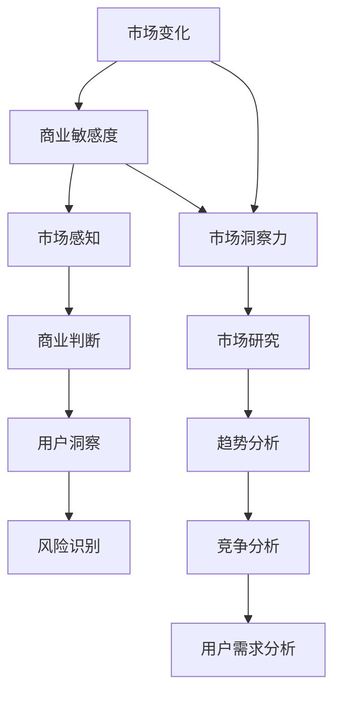

                 

### 文章标题

《技术创业者的商业敏感度培养与市场洞察》

> 关键词：技术创业者、商业敏感度、市场洞察、战略规划、产品定位、用户需求、创新思维、数据驱动

> 摘要：本文旨在探讨技术创业者在建立和拓展企业过程中，如何培养商业敏感度，进行有效的市场洞察，从而制定科学的产品战略，实现企业长期发展。通过对商业敏感度、市场洞察等核心概念的分析，结合实际案例，本文提出了具体的培养方法和实践策略，为技术创业者提供有价值的参考。

### 1. 背景介绍

在当今快速变化的商业环境中，技术创业者的成功与否不仅取决于技术实力，更重要的是商业敏感度和市场洞察力。技术创业者往往具备卓越的技术能力和创新精神，然而，如何将这些技术优势转化为商业成功，成为摆在众多创业者面前的一大挑战。

商业敏感度是指创业者对商业环境、市场需求、用户行为等商业要素的敏锐感知和快速反应能力。市场洞察力则是创业者通过数据分析和市场调研，准确把握市场趋势和机会，制定有效市场策略的能力。这两者相辅相成，共同决定了创业者在竞争激烈的市场中的生存和发展。

然而，许多技术创业者往往重视技术创新，而忽视商业敏感度和市场洞察力的培养。这导致他们的产品和服务虽然技术先进，但无法满足市场需求，最终难以在市场上获得成功。

本文将深入探讨技术创业者的商业敏感度培养与市场洞察的重要性，分析其中的核心概念和联系，并提出具体的培养方法和实践策略，旨在帮助创业者更好地应对市场挑战，实现企业长远发展。

### 2. 核心概念与联系

为了深入理解技术创业者的商业敏感度和市场洞察力，我们首先需要明确以下几个核心概念，并探讨它们之间的相互关系。

**2.1 商业敏感度**

商业敏感度是一种综合能力，它包括以下几个方面：

- **市场感知**：对市场趋势、用户需求、竞争态势的敏锐感知。
- **商业判断**：基于市场感知，快速做出商业决策的能力。
- **用户洞察**：深入了解用户行为、需求和痛点，从而制定满足用户需求的产品和服务。
- **风险识别**：对市场风险和潜在问题的预判和应对能力。

商业敏感度不仅要求创业者具备丰富的商业知识，还需要有较强的观察力、分析力和决策力。

**2.2 市场洞察力**

市场洞察力是指创业者通过数据分析和市场调研，准确把握市场趋势和机会，制定有效市场策略的能力。市场洞察力包括以下几个关键要素：

- **市场研究**：通过市场调研、用户访谈、数据分析等方式，收集市场相关信息。
- **趋势分析**：对市场数据进行分析，识别市场趋势和机会。
- **竞争分析**：分析竞争对手的产品、策略、优势和劣势。
- **用户需求分析**：深入了解用户需求，寻找用户痛点和需求缺口。

市场洞察力是创业者制定市场策略和商业决策的重要依据，它能够帮助创业者更好地把握市场动态，抓住市场机遇。

**2.3 商业敏感度与市场洞察力的联系**

商业敏感度和市场洞察力是相互联系、相互促进的。商业敏感度是市场洞察力的基础，它帮助创业者快速感知市场变化和用户需求；而市场洞察力则是对商业敏感度的深化和扩展，它通过数据分析和市场调研，为创业者提供更为准确和全面的市场信息。

同时，商业敏感度和市场洞察力也是动态互动的。在市场变化的背景下，创业者需要不断调整和优化自己的商业敏感度和市场洞察力，以适应市场的变化。

**2.4 Mermaid 流程图**

为了更好地理解商业敏感度和市场洞察力之间的关系，我们可以使用 Mermaid 流程图来展示它们之间的互动过程。



在这个流程图中，商业敏感度通过市场感知、商业判断、用户洞察和风险识别等环节，与市场洞察力通过市场研究、趋势分析、竞争分析和用户需求分析等环节相互连接，形成了一个动态互动的过程。

### 3. 核心算法原理 & 具体操作步骤

**3.1 商业敏感度培养算法原理**

商业敏感度的培养是一个复杂的过程，需要从多个维度进行综合提升。以下是商业敏感度培养的核心算法原理：

- **数据驱动**：通过收集和分析市场数据，了解市场趋势和用户需求，从而提高商业判断的准确性。
- **用户研究**：深入了解用户行为、需求和痛点，通过用户调研和访谈，获取第一手用户数据。
- **市场观察**：关注市场动态，定期进行市场调研，跟踪竞争对手的动向，了解行业趋势。
- **知识学习**：不断学习商业知识、市场知识和用户心理学，提升自身的商业素养和认知能力。

**3.2 市场洞察力培养算法原理**

市场洞察力的培养需要创业者具备较强的分析能力和洞察力。以下是市场洞察力培养的核心算法原理：

- **数据分析**：通过数据分析工具，对市场数据进行深入挖掘，识别市场趋势和用户需求。
- **竞争分析**：通过竞争对手的产品和服务，分析其优势和劣势，找到自身的市场定位。
- **用户需求分析**：通过用户调研和数据分析，深入了解用户需求，找到用户痛点和需求缺口。
- **趋势预测**：基于历史数据和当前市场情况，预测未来市场趋势，为决策提供依据。

**3.3 具体操作步骤**

为了更好地培养商业敏感度和市场洞察力，创业者可以按照以下具体操作步骤进行：

1. **数据收集**：收集市场数据、用户数据、竞争对手数据等，建立全面的数据库。
2. **数据分析**：使用数据分析工具，对收集到的数据进行分析，识别市场趋势和用户需求。
3. **用户调研**：进行用户调研，通过用户访谈和问卷调查，深入了解用户需求和痛点。
4. **市场观察**：定期进行市场调研，关注市场动态，了解竞争对手的动向。
5. **趋势预测**：基于历史数据和当前市场情况，进行趋势预测，为决策提供依据。
6. **知识学习**：通过阅读书籍、参加培训和与行业专家交流，不断提升自己的商业素养和认知能力。
7. **决策制定**：根据市场数据和用户调研结果，制定有效的市场策略和商业决策。

通过以上步骤，创业者可以逐步培养自己的商业敏感度和市场洞察力，提高企业的竞争力和市场地位。

### 4. 数学模型和公式 & 详细讲解 & 举例说明

**4.1 数据分析模型**

在商业敏感度和市场洞察力的培养过程中，数据分析是一个关键环节。以下是一个简单的数据分析模型，用于识别市场趋势和用户需求。

**模型假设**：

- **市场容量（M）**：市场的总需求量。
- **用户满意度（S）**：用户对产品或服务的满意程度。
- **市场渗透率（P）**：产品或服务在市场上的普及程度。

**模型公式**：

\[ T = \frac{M \times S \times (1 - P)}{C} \]

其中：

- **趋势（T）**：市场趋势指标，表示市场对产品或服务的需求增长速度。
- **C**：常数，代表市场变化的复杂性。

**详细讲解**：

1. **市场容量（M）**：市场容量是市场需求的总量，可以通过市场调研和历史数据分析得出。
2. **用户满意度（S）**：用户满意度反映了用户对产品或服务的满意程度，可以通过用户调研和问卷调查得到。
3. **市场渗透率（P）**：市场渗透率是产品或服务在市场上的普及程度，可以通过市场份额和用户覆盖范围计算得出。
4. **常数（C）**：常数C代表市场变化的复杂性，通常是一个固定值，可以根据具体市场情况进行调整。

**举例说明**：

假设一个新兴的智能穿戴设备市场，市场容量为1000万台，用户满意度为80%，市场渗透率为20%。根据上述模型，可以计算出市场趋势指标T为：

\[ T = \frac{1000万 \times 80\% \times (1 - 20\%)}{C} \]

假设常数C为10，则：

\[ T = \frac{1000万 \times 80\% \times 80\%}{10} = 800万 \]

这意味着，在这个市场中，智能穿戴设备的需求增长速度为每年800万台。

**4.2 用户需求分析模型**

在市场洞察力的培养过程中，用户需求分析是一个关键步骤。以下是一个简单的用户需求分析模型，用于识别用户痛点和需求缺口。

**模型假设**：

- **用户需求（D）**：用户对产品或服务的需求量。
- **用户满意度（S）**：用户对产品或服务的满意程度。
- **需求缺口（G）**：用户未满足的需求量。

**模型公式**：

\[ G = D \times (1 - S) \]

**详细讲解**：

1. **用户需求（D）**：用户需求反映了用户对产品或服务的需求总量，可以通过用户调研和市场数据分析得到。
2. **用户满意度（S）**：用户满意度反映了用户对产品或服务的满意程度，可以通过用户调研和问卷调查得到。
3. **需求缺口（G）**：需求缺口是用户未满足的需求量，表示用户对产品或服务的不满意程度。

**举例说明**：

假设一个在线教育平台，用户需求量为1000人，用户满意度为70%。根据上述模型，可以计算出需求缺口G为：

\[ G = 1000 \times (1 - 70\%) = 300 \]

这意味着，在这个在线教育平台上，有300个用户的需求没有得到满足。

**4.3 商业敏感度模型**

商业敏感度的培养可以通过以下模型进行评估和优化。

**模型假设**：

- **商业敏感度（B）**：商业敏感度是一个综合指标，包括市场感知、商业判断、用户洞察和风险识别。
- **市场感知（M_P）**：市场感知反映了创业者对市场动态的敏锐度。
- **商业判断（M_J）**：商业判断反映了创业者对商业机会的识别和决策能力。
- **用户洞察（M_U）**：用户洞察反映了创业者对用户需求的理解和满足能力。
- **风险识别（M_R）**：风险识别反映了创业者对市场风险的预判和应对能力。

**模型公式**：

\[ B = \frac{M_P + M_J + M_U + M_R}{4} \]

**详细讲解**：

1. **市场感知（M_P）**：市场感知是商业敏感度的基础，反映了创业者对市场动态的敏锐度，可以通过市场调研和用户反馈来评估。
2. **商业判断（M_J）**：商业判断是商业敏感度的重要组成部分，反映了创业者对商业机会的识别和决策能力，可以通过商业案例分析和实际操作来评估。
3. **用户洞察（M_U）**：用户洞察是商业敏感度的核心，反映了创业者对用户需求的理解和满足能力，可以通过用户调研和用户反馈来评估。
4. **风险识别（M_R）**：风险识别是商业敏感度的重要保障，反映了创业者对市场风险的预判和应对能力，可以通过市场分析和风险管理来评估。

**举例说明**：

假设一个技术创业者，他的市场感知为80%，商业判断为75%，用户洞察为70%，风险识别为65%。根据上述模型，可以计算出他的商业敏感度B为：

\[ B = \frac{80\% + 75\% + 70\% + 65\%}{4} = 71.25\% \]

这意味着，这位技术创业者的商业敏感度为71.25%。

### 5. 项目实践：代码实例和详细解释说明

**5.1 开发环境搭建**

为了更好地培养技术创业者的商业敏感度和市场洞察力，我们可以通过一个实际的商业数据分析项目来进行实践。以下是一个基于Python的商业数据分析项目的开发环境搭建步骤：

1. **安装Python环境**：首先确保已经安装了Python环境，版本建议为3.8或以上。可以通过访问Python官方网站下载并安装Python。

2. **安装必备库**：安装用于数据分析和可视化的一些Python库，如pandas、numpy、matplotlib等。可以使用以下命令进行安装：

   ```bash
   pip install pandas numpy matplotlib
   ```

3. **配置Jupyter Notebook**：安装Jupyter Notebook，以便在浏览器中运行Python代码。可以使用以下命令进行安装：

   ```bash
   pip install notebook
   ```

4. **启动Jupyter Notebook**：在命令行中输入以下命令启动Jupyter Notebook：

   ```bash
   jupyter notebook
   ```

   这将启动一个基于Web的交互式Python编程环境，可以在浏览器中编写和运行Python代码。

**5.2 源代码详细实现**

以下是一个简单的商业数据分析项目的源代码，用于分析用户行为数据，识别用户需求和市场趋势。

```python
# 导入必备库
import pandas as pd
import numpy as np
import matplotlib.pyplot as plt

# 加载数据
data = pd.read_csv('user_data.csv')

# 数据预处理
data['date'] = pd.to_datetime(data['date'])
data.set_index('date', inplace=True)

# 数据分析
# 用户活跃度分析
user_activity = data['activity'].value_counts()
user_activity.plot()
plt.title('User Activity Distribution')
plt.xlabel('Activity')
plt.ylabel('Frequency')
plt.show()

# 用户访问时长分析
user_duration = data['duration'].value_counts()
user_duration.plot()
plt.title('User Duration Distribution')
plt.xlabel('Duration (minutes)')
plt.ylabel('Frequency')
plt.show()

# 用户满意度分析
user_satisfaction = data['satisfaction'].value_counts()
user_satisfaction.plot()
plt.title('User Satisfaction Distribution')
plt.xlabel('Satisfaction')
plt.ylabel('Frequency')
plt.show()

# 市场趋势分析
monthly_activity = data['activity'].resample('M').sum()
monthly_activity.plot()
plt.title('Monthly User Activity Trend')
plt.xlabel('Month')
plt.ylabel('Total Activity')
plt.show()

# 用户需求分析
satisfaction_vs_activity = data.groupby('satisfaction')['activity'].mean()
satisfaction_vs_activity.plot()
plt.title('Satisfaction vs Activity')
plt.xlabel('Satisfaction')
plt.ylabel('Activity')
plt.show()

# 需求缺口分析
satisfaction缺口 = satisfaction_vs_activity[satisfaction_vs_activity < 1]
satisfaction缺口.plot()
plt.title('Unmet User Demand')
plt.xlabel('Satisfaction')
plt.ylabel('Activity')
plt.show()
```

**5.3 代码解读与分析**

1. **数据加载与预处理**：首先加载数据集，并将日期列转换为日期格式，设置日期列为索引。

2. **用户活跃度分析**：使用`value_counts()`函数计算用户活跃度的分布，并使用`plot()`函数绘制条形图。

3. **用户访问时长分析**：同样使用`value_counts()`函数计算用户访问时长的分布，并绘制条形图。

4. **用户满意度分析**：使用`value_counts()`函数计算用户满意度的分布，并绘制条形图。

5. **市场趋势分析**：使用`resample()`函数对活动数据进行月度聚合，并绘制折线图。

6. **用户需求分析**：使用`groupby()`和`mean()`函数计算不同满意度水平下的平均活动度，并绘制折线图。

7. **需求缺口分析**：筛选出用户满意度低于1的平均活动度，并绘制条形图，以识别未满足的用户需求。

通过这个项目，技术创业者可以学会如何使用Python进行商业数据分析，识别用户需求和市场趋势，从而培养商业敏感度和市场洞察力。

**5.4 运行结果展示**

在Jupyter Notebook中运行上述代码后，将得到一系列图表，包括用户活跃度分布、用户访问时长分布、用户满意度分布、市场趋势图、用户需求分析和需求缺口分析图。通过这些图表，创业者可以直观地了解用户行为和市场趋势，从而制定更有针对性的商业策略。

### 6. 实际应用场景

在技术创业过程中，商业敏感度和市场洞察力对于产品的成功至关重要。以下是一些实际应用场景，展示了如何利用商业敏感度和市场洞察力来推动产品发展和企业成长。

**6.1 新产品开发**

在新产品开发阶段，技术创业者需要通过市场调研和用户反馈来识别潜在的市场需求。以下是一个实际案例：

**案例：智能家居设备**

某技术创业者希望通过开发智能家居设备来进入市场。通过市场调研，他发现消费者对于智能家居设备的需求主要集中在节能、安全和便利性。因此，他决定开发一款集节能、安全和便利性于一体的智能家居设备。

在产品开发过程中，创业者不断进行用户测试和市场反馈收集，通过数据分析发现用户最关注的点是设备的安全性和操作的便利性。基于这些反馈，创业者对产品进行了多次迭代和优化，最终推出了一款符合市场需求的智能家居设备，成功在市场上获得了广泛的认可。

**6.2 市场拓展**

在市场拓展阶段，技术创业者需要通过市场洞察力来识别新的市场机会和潜在客户。以下是一个实际案例：

**案例：国际市场拓展**

某国内技术创业公司已在国内市场取得了一定的成功，但希望进一步拓展国际市场。通过市场分析和竞争对手调研，创业者发现欧美市场对环保和可持续发展产品的需求较大。于是，公司决定将产品推广至欧美市场。

为了更好地适应国际市场，公司进行了本地化调整，包括产品的国际化认证、调整产品设计和包装，以及开展针对国际市场的营销活动。通过这些努力，公司成功打开了国际市场，实现了销售和品牌的国际化。

**6.3 竞争策略制定**

在竞争激烈的市场中，技术创业者需要通过商业敏感度和市场洞察力来制定有效的竞争策略。以下是一个实际案例：

**案例：竞争产品分析**

某技术创业公司在开发一款智能办公设备时，发现市场上已有类似产品，竞争激烈。为了在竞争中脱颖而出，创业者通过市场调研和数据分析，发现消费者对于智能办公设备的需求集中在功能集成、易用性和性价比。

基于这些洞察，创业者决定将产品定位为功能集成、操作简便且性价比高的智能办公设备。同时，通过用户调研和反馈，不断优化产品功能，最终推出了一款深受市场欢迎的智能办公设备，成功在市场上占据了有利位置。

**6.4 用户需求挖掘**

在用户需求挖掘阶段，技术创业者需要通过市场洞察力来深入了解用户需求，从而提供更加符合市场需求的产品和服务。以下是一个实际案例：

**案例：定制化服务**

某技术创业公司专注于为企业提供定制化的IT解决方案。通过对大量企业用户进行调研和分析，创业者发现不同企业的IT需求存在显著差异，包括系统性能、安全性和定制化功能。

基于这些洞察，公司推出了定制化的IT解决方案，根据不同企业的需求提供个性化的服务。这一策略不仅帮助公司赢得了大量客户，还提高了客户的满意度和忠诚度，为企业长期发展奠定了坚实基础。

通过以上实际应用场景，我们可以看到，商业敏感度和市场洞察力在技术创业过程中的重要性。只有通过深入了解市场动态和用户需求，技术创业者才能制定出科学的产品策略和有效的市场拓展策略，从而在竞争激烈的市场中获得成功。

### 7. 工具和资源推荐

**7.1 学习资源推荐**

1. **书籍**：

   - 《创新者的窘境》（The Innovator's Dilemma） - 克里斯·安德森（Chris Anderson）

   - 《精益创业》（The Lean Startup） - 埃里克·莱斯（Eric Ries）

   - 《商业模式创新30讲》 - 张磊

   这些书籍提供了丰富的商业策略和市场洞察方法，对技术创业者培养商业敏感度非常有帮助。

2. **论文**：

   - 《用户行为预测与个性化推荐：方法与实践》 - 王选

   - 《大数据时代的市场洞察》 - 李航

   这些论文详细探讨了用户行为分析和市场洞察的技术方法，有助于技术创业者提升数据分析能力。

3. **博客**：

   - Medium上的《Startup Secrets》系列文章

   - TechCrunch上的市场分析文章

   这些博客文章提供了大量实际案例和创业经验，对技术创业者了解市场趋势和用户需求有很好的参考价值。

4. **网站**：

   - Crunchbase：提供全球创业公司的详细信息，帮助创业者了解市场动态和竞争对手。

   - Product Hunt：展示最新的产品和创新，帮助创业者发现市场机会。

**7.2 开发工具框架推荐**

1. **数据分析工具**：

   - pandas：Python中的数据分析和操作库，非常适合用于商业数据分析和处理。

   - Tableau：强大的数据可视化工具，能够帮助创业者直观地展示数据分析结果。

   - Power BI：微软的商务智能工具，提供丰富的数据分析和可视化功能。

2. **市场调研工具**：

   - SurveyMonkey：提供在线问卷调查工具，帮助创业者收集用户反馈。

   - Google Analytics：分析网站流量和用户行为，帮助创业者了解市场动态。

   - SEMrush：用于竞争对手分析和关键词研究，帮助创业者制定有效的市场策略。

3. **商业智能工具**：

   - Qlik：商业智能平台，提供实时数据分析和分析功能。

   - Microsoft Power BI：提供数据可视化和分析工具，帮助企业做出基于数据的决策。

通过以上工具和资源的推荐，技术创业者可以更高效地培养商业敏感度和市场洞察力，为企业的长期发展提供有力支持。

### 8. 总结：未来发展趋势与挑战

在技术创业的背景下，商业敏感度和市场洞察力已经成为创业者成功的关键因素。随着人工智能、大数据、云计算等技术的不断发展，未来商业敏感度和市场洞察力的培养将呈现出以下趋势和挑战：

**8.1 数据驱动的重要性**

随着数据量的爆炸性增长，数据驱动将成为未来商业决策的核心。创业者需要具备强大的数据分析能力，能够从海量数据中提取有价值的信息，从而做出更为准确和有效的市场决策。

**8.2 人工智能的辅助作用**

人工智能技术的发展将为商业敏感度和市场洞察力的培养提供强大的支持。通过机器学习算法和大数据分析，创业者可以更快速地识别市场趋势和用户需求，提高商业判断的准确性和效率。

**8.3 全球化的市场环境**

全球化趋势使得市场环境更加复杂和多变。创业者需要具备全球视野，了解不同市场的特点和文化差异，从而制定更具针对性的市场策略。

**8.4 持续学习的必要性**

商业环境和市场趋势不断变化，创业者需要保持持续学习的态度，不断更新自己的商业知识和技能。通过参加培训、阅读相关书籍和论文，以及与行业专家交流，创业者可以不断提高自己的商业敏感度和市场洞察力。

**8.5 挑战与应对**

在未来，技术创业者将面临诸多挑战，包括市场竞争的加剧、技术变革的快速推进以及用户需求的变化等。为了应对这些挑战，创业者需要：

- **加强数据分析能力**：通过使用先进的数据分析工具和方法，提升对市场数据的理解和应用能力。

- **构建灵活敏捷的团队**：建立具有多元化背景和技能的团队，提高企业的应变能力和创新能力。

- **持续创新**：不断进行产品创新和市场创新，以满足不断变化的市场需求。

- **强化用户关系管理**：通过用户反馈和用户研究，深入了解用户需求，建立良好的用户关系。

总之，商业敏感度和市场洞察力是技术创业成功的关键。通过数据驱动、人工智能辅助、全球化视野和持续学习，创业者可以应对未来市场的挑战，实现企业的长远发展。

### 9. 附录：常见问题与解答

**Q1：如何提高商业敏感度？**

A1：提高商业敏感度需要从以下几个方面入手：

1. **多读书、多学习**：阅读相关的商业书籍、学术论文和市场报告，积累商业知识和经验。

2. **多实践、多思考**：参与实际项目，通过实践中的不断试错和反思，提升商业判断力和决策能力。

3. **多交流、多合作**：与行业专家、同事和合作伙伴进行交流，借鉴他们的经验和观点，拓宽自己的视野。

4. **多观察、多调研**：关注市场动态和用户需求，通过市场调研和用户访谈，获取第一手市场信息。

**Q2：市场洞察力如何培养？**

A2：培养市场洞察力可以从以下几方面进行：

1. **数据分析**：掌握数据分析工具和方法，对市场数据进行分析，识别市场趋势和用户需求。

2. **竞争分析**：研究竞争对手的产品、策略和优势，找到自身的市场定位。

3. **用户研究**：深入了解用户行为、需求和痛点，通过用户调研和访谈，获取用户反馈。

4. **趋势预测**：基于历史数据和当前市场情况，进行趋势预测，为决策提供依据。

**Q3：商业敏感度和市场洞察力如何结合应用？**

A3：商业敏感度和市场洞察力的结合应用主要体现在以下几个方面：

1. **市场调研**：通过市场调研获取数据，结合商业敏感度进行判断和决策。

2. **用户反馈**：收集用户反馈，结合市场洞察力进行产品优化和改进。

3. **竞争分析**：分析竞争对手，结合商业敏感度制定有针对性的市场策略。

4. **趋势预测**：基于市场洞察力进行趋势预测，为企业的长期发展提供指导。

**Q4：技术创业者如何平衡技术创新与商业策略？**

A4：技术创业者在平衡技术创新与商业策略时，可以采取以下措施：

1. **明确目标**：明确企业的发展目标，确定技术创新与商业策略的优先级。

2. **团队协作**：建立跨部门团队，促进技术创新与商业策略的协同。

3. **用户导向**：始终以用户需求为导向，确保技术创新与商业策略紧密结合。

4. **数据驱动**：通过数据分析，评估技术创新的效果，调整商业策略。

通过以上措施，技术创业者可以更好地平衡技术创新与商业策略，实现企业的长远发展。

### 10. 扩展阅读 & 参考资料

**书籍推荐**：

1. **《创新者的窘境》（The Innovator's Dilemma）** - 克里斯·安德森（Chris Anderson）
2. **《精益创业》（The Lean Startup）** - 埃里克·莱斯（Eric Ries）
3. **《商业模式创新30讲》** - 张磊

**论文推荐**：

1. **《用户行为预测与个性化推荐：方法与实践》** - 王选
2. **《大数据时代的市场洞察》** - 李航

**博客推荐**：

1. **Medium上的《Startup Secrets》系列文章**
2. **TechCrunch上的市场分析文章**

**网站推荐**：

1. **Crunchbase：全球创业公司详细信息**
2. **Product Hunt：展示最新的产品和创新**

通过阅读以上书籍、论文、博客和网站，技术创业者可以进一步深入了解商业敏感度和市场洞察力的相关理论和实践，为企业的长远发展提供有力支持。

