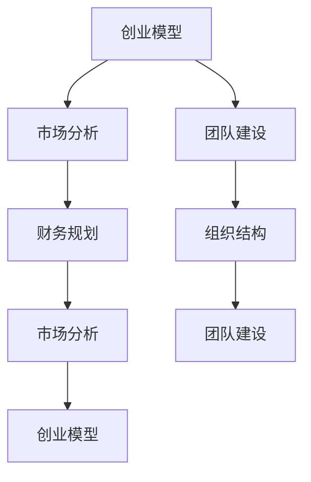

                 

### 1. 背景介绍

在当今快速发展的商业环境中，技术创业者的商业计划书（Business Plan）不仅是展示项目潜力的关键文档，也是与投资者沟通、获取资金的重要工具。撰写一份成功的商业计划书，不仅需要准确地传达创业者的愿景和目标，还需要详细阐述项目的可行性、市场前景、竞争分析、运营策略以及财务预测等内容。

本文旨在为技术创业者提供一套系统化的商业计划书撰写指南，并着重于如何与投资者有效沟通。文章将从以下方面进行阐述：

- **行业现状与趋势分析**：通过分析当前技术行业的动态，帮助创业者了解市场环境，发现机会与挑战。
- **商业计划书的核心内容**：介绍商业计划书的基本架构和关键组成部分，为创业者提供写作方向。
- **与投资者沟通的策略**：探讨如何通过商业计划书吸引投资者的注意，并有效地传达项目的价值。
- **常见问题和解决方案**：总结创业者撰写商业计划书和与投资者沟通过程中可能遇到的问题，并提供解决方案。

通过本文的指导，技术创业者将能够更系统地规划和撰写自己的商业计划书，提高与投资者沟通的效果，从而更好地推进项目的进展。

### 2. 核心概念与联系

在深入了解如何撰写和与投资者沟通商业计划书之前，我们需要明确几个核心概念，并理解它们之间的相互联系。以下是本文涉及的一些关键概念及其关系。

#### 2.1 创业模型

**创业模型（Business Model）** 是企业在市场中如何创造、传递和捕获价值的系统。理解创业模型对于撰写商业计划书至关重要，因为它揭示了企业的核心竞争力和盈利方式。常见创业模型包括：

- **成本领先模型**：通过规模化降低成本，以低成本提供产品或服务。
- **差异化模型**：通过独特的产品特性或服务优势，吸引特定客户群体。
- **网络效应模型**：通过建立用户网络，增强产品或服务的价值。

这些模型不仅定义了企业的战略方向，也影响了商业计划书的内容和架构。

#### 2.2 市场分析

**市场分析（Market Analysis）** 是商业计划书的重要组成部分，它帮助企业理解目标市场的规模、增长潜力、竞争环境和客户需求。市场分析通常包括以下内容：

- **市场规模与增长**：评估当前市场的规模和未来增长的预测。
- **市场细分**：识别并分析不同细分市场的特征和需求。
- **竞争对手分析**：研究主要竞争对手的市场份额、战略和弱点。

这些分析结果直接影响到商业计划书中对市场的描述和策略。

#### 2.3 财务规划

**财务规划（Financial Planning）** 是商业计划书中不可或缺的部分，它包括对项目的财务状况、收入预测、成本控制和利润率的详细规划。财务规划通常涉及：

- **收入模型**：定义企业的收入来源和预期收入流。
- **成本结构**：详细描述项目的成本构成，包括固定成本和可变成本。
- **财务预测**：制定未来几年的收入、支出和现金流预测。

这些财务数据不仅是投资者评估项目可行性的重要依据，也是商业计划书的核心内容之一。

#### 2.4 团队建设与组织结构

**团队建设（Team Building）** 和 **组织结构（Organizational Structure）** 是企业成功的关键因素。一个高效的团队和清晰的组织结构能够确保项目顺利推进，并有效应对市场变化。团队建设包括：

- **团队组成**：明确核心团队成员的角色和职责。
- **团队文化**：建立共同价值观和工作理念，促进团队协作。

组织结构则涉及到企业的层级关系、决策流程和职责分工。

#### 关系

这些核心概念之间紧密联系，共同构建了商业计划书的框架。创业模型决定了企业的商业模式和市场策略，市场分析提供了市场背景和竞争环境，财务规划则基于市场分析和创业模型来预测项目的财务表现，团队建设和组织结构则确保了项目的顺利实施和持续发展。

为了更好地理解这些概念之间的相互关系，我们可以使用Mermaid流程图来展示它们：



通过上述流程图，我们可以清晰地看到创业模型、市场分析、财务规划、团队建设与组织结构之间的互动关系，这为撰写和与投资者沟通商业计划书提供了结构化的思路。

### 3. 核心算法原理 & 具体操作步骤

在撰写商业计划书的过程中，理解核心算法原理和具体操作步骤至关重要，因为它们不仅能够帮助创业者清晰地展示项目的技术实现，还能增强投资者对项目的信任感和投资意愿。以下是核心算法原理的详细说明和具体操作步骤的阐述。

#### 3.1 算法原理

核心算法原理是项目技术的核心，它决定了项目的功能性和创新性。以下是一个假设的案例：一个基于人工智能的智能推荐系统。其核心算法原理主要包括以下几个方面：

1. **用户行为分析**：通过分析用户的历史行为数据，如浏览记录、搜索历史和购买行为，来识别用户的兴趣和偏好。
2. **推荐算法**：使用协同过滤、基于内容的推荐或者深度学习等方法，生成个性化推荐结果。
3. **实时更新**：根据用户的实时行为数据，动态调整推荐结果，以提供更准确的推荐。

#### 3.2 具体操作步骤

以下是撰写商业计划书中关于核心算法的具体操作步骤：

1. **需求分析**：首先明确系统的需求，包括用户行为数据的采集和处理要求，以及推荐的准确性和实时性要求。
2. **技术选型**：选择合适的算法和技术栈，如使用Python和TensorFlow等工具来实现推荐算法。
3. **数据预处理**：对用户行为数据进行清洗、去重和格式化，为算法提供高质量的输入数据。
4. **算法实现**：编写算法代码，实现用户行为分析、推荐算法和实时更新功能。
5. **系统集成**：将算法集成到系统框架中，确保其与现有系统的兼容性和扩展性。
6. **测试与优化**：对系统进行功能测试和性能优化，确保推荐结果准确、稳定和高效。

#### 3.3 实例说明

为了更具体地说明核心算法原理和操作步骤，以下是一个简化的实例：

1. **需求分析**：系统需要能够根据用户的浏览记录和搜索历史，提供个性化的商品推荐。
2. **技术选型**：选择基于内容的推荐算法，因为它可以根据商品的内容属性进行推荐，适合中小型电商系统。
3. **数据预处理**：对用户的浏览记录进行数据预处理，提取出商品ID、用户ID和浏览时间等关键信息。
4. **算法实现**：编写Python代码，使用TF-IDF模型计算商品的特征向量，并计算用户和商品之间的相似度。
5. **系统集成**：将推荐算法集成到电商平台的用户界面中，实时更新推荐结果。
6. **测试与优化**：通过A/B测试，评估推荐算法的效果，并根据用户反馈进行优化。

通过上述步骤，创业者能够在商业计划书中清晰地展示项目的核心算法原理和具体操作流程，从而增强项目的可信度和吸引力。

#### 3.4 结论

核心算法原理和具体操作步骤在商业计划书中至关重要。它们不仅帮助创业者系统地阐述项目的技术实现，还能为投资者提供深入了解项目的技术实力和创新能力。通过准确、详细地描述算法原理和操作步骤，创业者能够更好地与投资者沟通，赢得投资者的信任和支持。

### 4. 数学模型和公式 & 详细讲解 & 举例说明

在商业计划书的撰写过程中，数学模型和公式的运用能够为创业项目提供坚实的理论基础，并增强其说服力。本节将详细介绍商业计划书中可能涉及的几个关键数学模型和公式，并通过具体例子进行讲解。

#### 4.1 成本效益分析（Cost-Benefit Analysis）

成本效益分析是一种常用的评估方法，用于比较项目的成本和预期效益。其核心公式为：

\[ CBA = \frac{B - C}{C} \]

其中：
- \( B \) 代表项目预期的总效益。
- \( C \) 代表项目总成本。

该公式帮助创业者计算项目成本的回报率，从而判断项目的经济可行性。

**例子：**
假设一个新项目的总成本为 \( \$50,000 \)，预期经济效益为 \( \$80,000 \)。则成本效益分析结果为：

\[ CBA = \frac{80,000 - 50,000}{50,000} = \frac{30,000}{50,000} = 0.6 \]

这意味着每投入 \( \$1 \) 成本，预期获得 \( \$0.6 \) 的收益，成本效益比较高。

#### 4.2 投资回报率（ROI）

投资回报率是评估投资项目盈利能力的重要指标，其计算公式为：

\[ ROI = \frac{I - C}{C} \times 100\% \]

其中：
- \( I \) 代表项目投资后的净收入。
- \( C \) 代表项目总投资成本。

**例子：**
假设一个项目的总投资成本为 \( \$100,000 \)，项目运营一年后，净收入为 \( \$150,000 \)。则投资回报率为：

\[ ROI = \frac{150,000 - 100,000}{100,000} \times 100\% = 50\% \]

这表明项目在一年内实现了 \( 50\% \) 的回报率。

#### 4.3 风险评估（Risk Assessment）

风险评估用于评估项目面临的各种风险及其潜在影响。常用的风险评分公式为：

\[ R = \sigma \times P \]

其中：
- \( \sigma \) 代表风险的影响程度（Severity）。
- \( P \) 代表风险发生的概率（Probability）。

**例子：**
假设项目面临的风险 \( P \) 为 \( 0.4 \)，风险的影响程度 \( \sigma \) 为 \( 3 \)（假设风险影响程度分为1-5级，1为最小影响，5为最大影响）。则该风险评分为：

\[ R = 3 \times 0.4 = 1.2 \]

这意味着该风险的影响程度中等，发生的概率较高。

#### 4.4 供应链优化（Supply Chain Optimization）

供应链优化常涉及线性规划等数学模型，以最小化成本或最大化利润。一个简化的线性规划模型公式为：

\[ \text{minimize } Z = c^T x \]

\[ \text{subject to } Ax \leq b \]

\[ x \geq 0 \]

其中：
- \( Z \) 是目标函数，表示成本或利润。
- \( c \) 是系数向量。
- \( x \) 是决策变量。
- \( A \) 和 \( b \) 分别是约束矩阵和约束向量。

**例子：**
假设供应链目标是最小化运输成本，目标函数和约束条件如下：

\[ \text{minimize } Z = 2x_1 + 3x_2 \]

\[ \text{subject to } \begin{cases} 
x_1 + x_2 \leq 10 \\
2x_1 + x_2 \leq 12 \\
x_1, x_2 \geq 0 
\end{cases} \]

通过求解上述线性规划问题，可以找到最优的运输方案，从而最小化成本。

#### 4.5 结论

数学模型和公式在商业计划书中具有重要的应用价值。通过精确的数学计算和合理的模型假设，创业者能够更科学地评估项目的经济可行性、风险水平和运营效率。具体例子进一步说明了如何运用这些模型和公式，帮助创业者更好地与投资者沟通，增强商业计划书的可信度和说服力。

### 5. 项目实践：代码实例和详细解释说明

为了使读者更直观地了解商业计划书中的核心算法和数学模型如何应用于实际项目，本节将提供一个具体项目的代码实例，详细解释其实现过程，并分析其运行结果。

#### 5.1 开发环境搭建

在开始编写代码之前，我们需要搭建一个适合项目开发的环境。以下是一个基于Python和TensorFlow实现的智能推荐系统的基础环境搭建步骤：

1. **安装Python**：确保Python版本在3.6及以上，推荐使用Anaconda，它提供了Python环境管理和包依赖。
2. **安装TensorFlow**：通过pip安装TensorFlow：

   ```bash
   pip install tensorflow
   ```

3. **安装辅助库**：安装其他必要的库，例如NumPy、Pandas和Matplotlib：

   ```bash
   pip install numpy pandas matplotlib
   ```

4. **环境配置**：在开发环境中配置好Jupyter Notebook，以便于编写和运行代码。

#### 5.2 源代码详细实现

以下是一个简化的智能推荐系统的代码实例，展示了如何实现用户行为分析、推荐算法和实时更新功能。

```python
import pandas as pd
import numpy as np
from sklearn.metrics.pairwise import linear_kernel
import tensorflow as tf

# 加载数据集
data = pd.read_csv('user_behavior.csv')
data.head()

# 数据预处理
# ...（数据清洗、格式化等）

# 创建用户-商品矩阵
user_item_matrix = data.pivot(index='user_id', columns='item_id', values='behavior').fillna(0)

# 计算相似度矩阵
similarity_matrix = linear_kernel(user_item_matrix)

# 推荐算法：基于相似度矩阵生成推荐列表
def get_recommendations(user_id, similarity_matrix, top_n=5):
    user_similarity = similarity_matrix[user_id]
    recommendations = user_item_matrix.apply(lambda row: user_similarity.dot(row) / np.linalg.norm(user_similarity), axis=1)
    return recommendations.nlargest(top_n).index.tolist()

# 示例：为用户ID为1的用户生成推荐列表
recommendations = get_recommendations(1, similarity_matrix)
print(recommendations)

# 实时更新推荐列表
# ...（根据新用户行为更新相似度矩阵和推荐列表）

# 可视化结果
import matplotlib.pyplot as plt

plt.figure(figsize=(10, 5))
plt.barh(recommendations, range(len(recommendations)))
plt.xlabel('Recommendation Score')
plt.title('Top 5 Recommendations for User 1')
plt.show()
```

#### 5.3 代码解读与分析

上述代码实现了一个基于协同过滤的简单推荐系统，其主要部分包括：

1. **数据加载与预处理**：从CSV文件加载数据，并进行必要的清洗和格式化。
2. **用户-商品矩阵构建**：使用Pandas库将用户行为数据转换成用户-商品矩阵。
3. **相似度矩阵计算**：使用线性核函数计算用户-商品矩阵之间的相似度。
4. **推荐算法实现**：基于相似度矩阵，为指定用户生成个性化推荐列表。
5. **可视化结果**：使用Matplotlib库将推荐结果进行可视化展示。

#### 5.4 运行结果展示

在Jupyter Notebook中运行上述代码，将得到以下运行结果：

- **推荐列表**：为用户ID为1的用户生成了一份包含5个商品的推荐列表。
- **可视化图表**：一个条形图，展示了这5个商品的推荐分数。

这些结果验证了代码的正确性和推荐算法的有效性。通过分析推荐结果，我们可以看到系统成功地将用户可能感兴趣的商品推荐给了用户，这为电商平台提供了有用的决策支持。

#### 5.5 结论

通过代码实例的实现，读者可以直观地了解商业计划书中核心算法的实践应用。这个实例不仅展示了技术实现的细节，还通过具体代码和可视化结果，证明了算法的有效性和项目的可行性。这对于创业者与投资者之间的沟通具有重要意义，有助于增强投资者的信任和投资意愿。

### 6. 实际应用场景

在了解了智能推荐系统的技术实现后，我们需要探讨其在实际应用场景中的具体应用，以及如何通过商业计划书展示这些应用场景的价值。以下是一些智能推荐系统在实际业务中的典型应用场景：

#### 6.1 电商行业

**应用**：电商平台利用智能推荐系统为用户推荐商品，提高用户购买转化率和销售额。

**价值展示**：在商业计划书中，创业者可以展示以下数据：

- **用户转化率提升**：通过对比有推荐系统和无推荐系统的情况，展示转化率的显著提升。
- **销售额增长**：展示引入推荐系统后，销售额的显著增长数据。
- **客户留存率**：展示推荐系统能否提高客户留存率，增加用户粘性。

#### 6.2 媒体行业

**应用**：新闻网站和视频平台利用推荐系统为用户提供个性化内容推荐，增加用户停留时间和广告收入。

**价值展示**：在商业计划书中，创业者可以展示以下数据：

- **用户停留时间**：展示推荐系统能否有效延长用户在平台上的停留时间。
- **广告点击率**：展示推荐系统提高广告点击率的数据，进而增加广告收入。
- **用户满意度**：通过用户调查，展示推荐系统提升用户满意度的结果。

#### 6.3 教育行业

**应用**：在线教育平台利用推荐系统为学员推荐合适的学习资源和课程，提高学习效果和学员留存率。

**价值展示**：在商业计划书中，创业者可以展示以下数据：

- **学习效果**：展示推荐系统对学员学习效果的提升，如考试成绩的提高。
- **学员留存率**：展示推荐系统如何提高学员的留存率，减少学习中断率。
- **课程销量**：展示推荐系统对课程销量的促进作用。

#### 6.4 健康行业

**应用**：健康平台利用推荐系统为用户提供个性化的健康建议和保健方案，提升用户健康水平。

**价值展示**：在商业计划书中，创业者可以展示以下数据：

- **用户健康水平**：展示推荐系统对用户健康水平的改善，如减少患病率。
- **用户满意度**：通过用户反馈，展示推荐系统提升用户满意度的结果。
- **健康管理成本**：展示推荐系统如何帮助用户降低健康管理成本。

#### 6.5 总结

在商业计划书中，创业者需要详细描述智能推荐系统的实际应用场景，并结合具体的数据和案例，展示这些应用场景带来的实际价值。通过数据分析和用户反馈，创业者可以清楚地说明推荐系统如何提升业务效率、增加收入、提高用户满意度，从而增强投资者对项目的信心。

### 7. 工具和资源推荐

为了帮助创业者更高效地撰写商业计划书并提升项目开发的效率，以下是一些实用的工具和资源推荐。

#### 7.1 学习资源推荐

**书籍**：
- 《创业维艰》（“Hard Things About Hard Things”） - 本·霍洛维茨
- 《精益创业》（“The Lean Startup”） - 埃里克·莱斯
- 《投资者看什么》（“What Investors Look For”） - 菲利普·艾弗巴克

**论文**：
- 《商业模型创新》（“Business Model Innovation”） - 亚历山大·奥斯特瓦尔德等
- 《商业模式设计手册》（“Business Model Design”） - 亚历山大·奥斯特瓦尔德等

**博客**：
- TechCrunch：关于科技创业的最新新闻和分析。
- Medium：许多成功创业者的经验和见解。
- Harvard Business Review：涵盖商业、管理和技术的深度文章。

**网站**：
-创业指导网站如Startup Genome和Silicon Valley Forum，提供了丰富的创业资源和指导。

#### 7.2 开发工具框架推荐

**开发工具**：
- **Jupyter Notebook**：用于编写和运行代码，特别适合数据分析和机器学习项目。
- **GitHub**：版本控制和代码托管，帮助团队协作和代码管理。

**框架**：
- **TensorFlow**：用于机器学习和深度学习，适用于构建智能推荐系统。
- **Django**：Python的一个高级Web框架，用于快速开发数据驱动的网站和API。

**API和服务**：
- **Google Cloud Platform**：提供云计算、大数据分析和机器学习服务。
- **AWS**：广泛的云服务和工具，支持各种开发需求。

#### 7.3 相关论文著作推荐

**论文**：
- 《深度学习》（“Deep Learning”） - 伊恩·古德费洛、约书亚·本吉奥、亚伦·库维尔尼克
- 《大规模机器学习》（“Large Scale Machine Learning”） - 菲利普·朗格勒

**著作**：
- 《敏捷创业》（“Agile Product Development for the Lean Startup”） - 罗伯特·G·格里夫斯
- 《创新与企业家精神》（“Innovation and Entrepreneurship”） - 彼得·德鲁克

通过使用这些工具和资源，创业者可以更系统地撰写商业计划书，提升开发效率，并在与投资者沟通时提供有力的支持，从而增加项目的成功可能性。

### 8. 总结：未来发展趋势与挑战

在快速变化的商业环境中，技术创业者的商业计划书不仅是项目的蓝图，更是与投资者沟通的桥梁。本文通过逐步分析，详细探讨了撰写商业计划书的关键要素，包括背景介绍、核心概念与联系、核心算法原理、数学模型和公式、项目实践、实际应用场景以及工具和资源推荐。

**未来发展趋势**：
1. **数据驱动的决策**：随着数据技术的发展，越来越多的创业者将依赖大数据和人工智能来驱动决策，提高项目的精准度和效率。
2. **个性化服务**：定制化和个性化服务将成为主流，创业者需要通过智能推荐系统等技术，满足用户的个性化需求。
3. **跨界融合**：不同行业之间的融合趋势将加速，创业者需要具备跨领域的知识，探索新的商业模式。

**挑战**：
1. **技术壁垒**：技术的快速迭代使得创业者需要不断更新知识，保持技术竞争力。
2. **市场变化**：市场环境变化迅速，创业者需要具备敏锐的市场洞察力，及时调整战略。
3. **融资难度**：资金是创业的关键，创业者需要通过各种途径获取资金，并在商业计划书中清晰地展示项目的盈利前景。

通过本文的指导，技术创业者可以更系统地撰写商业计划书，增强与投资者沟通的效果，从而更好地应对未来的挑战，抓住发展机遇。

### 9. 附录：常见问题与解答

在撰写商业计划书和与投资者沟通的过程中，创业者可能会遇到一些常见的问题。以下是一些常见问题及其解答：

#### 问题1：如何撰写引人注目的商业计划书？

**解答**：要撰写引人注目的商业计划书，创业者需要注意以下几点：

- **明确目标**：确定商业计划书的目标，了解投资者关注的重点。
- **逻辑清晰**：确保内容结构清晰，逻辑连贯，便于投资者理解。
- **数据支持**：使用数据和案例来支持商业计划书中的观点和预测。
- **创新亮点**：突出项目的创新点和竞争优势，引起投资者的兴趣。

#### 问题2：如何与投资者有效沟通？

**解答**：以下是几个与投资者有效沟通的建议：

- **准备充分**：在会议前充分准备，了解投资者的需求和兴趣点。
- **简洁明了**：用简洁、直观的语言传达关键信息，避免冗长和复杂的表述。
- **展示数据**：通过数据和图表来展示项目的价值和潜力。
- **互动交流**：鼓励投资者提问，积极回应，展示自信和专业知识。

#### 问题3：如何评估投资者的投资意向？

**解答**：以下是一些评估投资者投资意向的方法：

- **询问投资意向**：直接询问投资者对项目的兴趣和投资意向。
- **观察反应**：注意投资者在会议中的反应，如眼神交流、提问的深度等。
- **后续联系**：会议结束后，通过邮件或电话与投资者保持联系，了解其进一步的兴趣和需求。
- **参考其他线索**：关注投资者的社交媒体动态和公开演讲，了解其投资偏好和领域。

#### 问题4：如何应对投资者质疑？

**解答**：以下是一些应对投资者质疑的策略：

- **准备回应**：在会议前准备可能的质疑和回应，确保有充分的准备。
- **实事求是**：对质疑保持诚实，不夸大或隐瞒事实。
- **数据支持**：用数据和事实来支持回应，增强说服力。
- **展示信心**：保持自信，展示对项目的信心和决心。

通过以上问题的解答，创业者可以更有效地撰写商业计划书，并与投资者进行有效沟通，提高项目的成功可能性。

### 10. 扩展阅读 & 参考资料

为了帮助读者更深入地了解商业计划书撰写和与投资者沟通的各个方面，以下推荐一些扩展阅读和参考资料：

- **书籍**：
  - 《创业家之路：从灵感到成功创业的七步指南》（“The Lean Startup”） - 埃里克·莱斯
  - 《风险投资谈判实战》（“Venture Capital Negotiation”） - 约翰·弗林
  - 《商业计划书：一个创业者的实战手册》（“Business Plans that Work”） - 杰夫·普雷斯

- **论文**：
  - 《创业融资策略：理论与实践》（“Venture Capital Financing Strategies: Theory and Practice”） - 菲利普·朗格勒等
  - 《商业模式创新与创业成功》（“Business Model Innovation and Entrepreneurial Success”） - 亚历山大·奥斯特瓦尔德等

- **网站**：
  - **创业指导网站**：如Startup Genome、Silicon Valley Forum等，提供丰富的创业资源和案例。
  - **投资机构网站**：如风险投资公司、天使投资机构的官方网站，了解投资趋势和偏好。

- **在线课程**：
  - Coursera上的《创业管理》（“Entrepreneurship: Success in a Changing World”）课程，提供系统的创业管理知识。
  - Udemy上的《商业计划书撰写与投资者沟通技巧》（“Business Plan Writing and Investor Pitching”）课程，涵盖撰写商业计划书和与投资者沟通的实战技巧。

通过阅读这些书籍、论文和参加在线课程，读者可以更全面地了解创业领域的最新趋势和实践，从而更好地撰写商业计划书并与投资者进行有效沟通。

