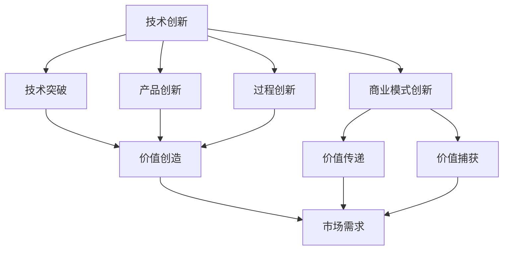

                 

### 1. 背景介绍

#### 技术创新的驱动力

在当今数字化时代，技术创新成为推动社会进步和经济增长的核心动力。从互联网到人工智能，从云计算到区块链，每一次技术革命都深刻地改变了商业模式、工作方式和社会结构。随着技术的快速发展，企业需要不断创新来保持竞争力，而技术创新的成果也不断催生出新的商业机会。

#### 商业模式创新的必要性

然而，技术创新并非孤立存在，它需要与商业模式创新相互融合。商业模式创新是指通过新的商业理念、战略或运营模式，创造价值、分配价值和捕获价值的新方法。在科技日新月异的背景下，商业模式创新能够帮助企业更好地适应市场变化，抓住新的商业机会，提升核心竞争力。

#### 平衡的重要性

技术创新与商业模式创新之间存在着紧密的相互关系。一方面，技术创新提供了商业模式创新的工具和平台，使得新的商业模式得以实现；另一方面，商业模式创新为技术创新提供了方向和应用场景，使得技术创新能够更好地转化为实际效益。因此，如何在这两者之间取得平衡，成为企业成功的关键。

本文将深入探讨技术创新与商业模式创新的平衡，通过分析核心概念、算法原理、项目实践、实际应用场景以及未来发展挑战等方面，为广大读者提供有益的思考和实践指导。

#### 创新时代的挑战与机遇

我们正处于一个创新驱动的时代，技术变革的脚步迅速而坚定。在过去的几十年中，信息技术的发展极大地改变了我们的生活方式和工作方式。从个人电脑的普及到智能手机的兴起，从互联网的互联互通到大数据和人工智能的广泛应用，每一次技术进步都带来了商业模式和消费者行为的巨大转变。

然而，随着技术不断突破，我们也面临着一系列挑战。一方面，技术创新的速度越来越快，企业必须不断更新技术栈，以保持竞争力；另一方面，市场环境瞬息万变，消费者需求多样化，企业需要灵活应对。这种背景下，如何确保技术创新与商业模式创新之间的平衡，成为企业战略布局中的重要一环。

此外，技术创新和商业模式创新之间的关系并非单向的。技术创新往往需要商业模式创新来落地和实现价值，而商业模式创新则可以为技术创新提供更广阔的应用场景和商业机会。例如，互联网技术的飞速发展催生了电子商务的兴起，而电子商务的商业模式创新又进一步推动了物流、支付等基础设施的升级。

总之，在这个充满变革的时代，技术创新和商业模式创新已成为企业发展不可或缺的组成部分。只有在这两者之间找到平衡，企业才能在激烈的市场竞争中脱颖而出，实现可持续发展。

### 2. 核心概念与联系

#### 技术创新

技术创新是指通过引入新的科学知识、技术和方法，改进或创造新的产品、服务或业务模式，从而推动社会和经济发展的过程。技术创新可以分为多个层次，包括技术突破、产品创新、过程创新和商业模式创新等。

- **技术突破**：指在科学原理或技术层面的重大突破，如新材料、新工艺、新技术等。
- **产品创新**：指通过改进产品性能、功能、设计等，满足消费者新的需求或解决现有问题。
- **过程创新**：指通过改进生产过程、运营流程等，提高效率、降低成本、提升质量等。
- **商业模式创新**：指通过新的商业理念、战略或运营模式，创造价值、分配价值和捕获价值的新方法。

#### 商业模式创新

商业模式创新是指在现有技术条件下，通过改变价值创造、价值传递和价值捕获的方式，实现商业模式的创新和优化。商业模式创新的核心在于重新定义企业如何创造、传递和获取价值。

- **价值创造**：指通过提供产品或服务，满足消费者的需求或解决他们的问题。
- **价值传递**：指通过有效的渠道和方式，将价值传递给消费者。
- **价值捕获**：指通过有效的定价策略和商业模式，实现价值的回报和收益。

#### 技术创新与商业模式创新的联系

技术创新和商业模式创新之间存在着紧密的相互联系和相互促进关系。技术创新为商业模式创新提供了基础和动力，而商业模式创新则为技术创新提供了应用场景和商业机会。

- **技术创新促进商业模式创新**：新技术的发展和应用可以改变企业的运营模式、商业模式，创造新的商业机会。例如，互联网和移动互联网的兴起，催生了电子商务、在线支付、共享经济等新型商业模式。

- **商业模式创新推动技术创新**：新的商业模式往往对技术提出更高的要求，推动技术的不断创新和突破。例如，电子商务的兴起推动了物流、支付、信息安全等技术的快速发展。

为了更好地理解技术创新和商业模式创新之间的联系，我们可以通过一个Mermaid流程图来展示它们的核心节点和关系：



在这个流程图中，技术创新通过技术突破、产品创新和过程创新等途径，创造出新的市场需求；而商业模式创新则通过价值创造、价值传递和价值捕获等途径，满足市场需求，实现商业价值。技术创新和商业模式创新相辅相成，共同推动企业的发展和进步。

### 3. 核心算法原理 & 具体操作步骤

#### 技术创新的核心算法原理

在探讨技术创新时，我们需要关注一些核心算法原理，这些原理不仅推动了技术的进步，也为商业模式创新提供了坚实的基础。以下是一些关键算法原理：

1. **人工智能算法**：如深度学习、强化学习、自然语言处理等。这些算法通过模拟人脑的学习和决策过程，实现了对大量数据的高效分析和处理，从而推动智能应用的发展。

2. **加密算法**：如RSA、SHA、椭圆曲线加密等。这些算法在保障数据安全和隐私保护方面起到了关键作用，为区块链和物联网等新兴技术提供了安全基础。

3. **优化算法**：如遗传算法、粒子群算法、线性规划等。这些算法通过模拟自然界的进化过程或物理现象，解决了复杂优化问题，提高了资源利用效率和系统性能。

#### 商业模式创新的核心算法原理

在商业模式创新中，算法原理同样发挥着重要作用。以下是一些关键算法原理及其应用：

1. **定价算法**：如动态定价、边际分析等。这些算法帮助企业根据市场需求、竞争状况和成本结构，灵活调整产品或服务的定价策略，实现价值最大化。

2. **用户行为分析算法**：如协同过滤、聚类分析等。这些算法通过对用户行为数据进行分析，帮助企业更好地理解用户需求，优化产品设计和营销策略。

3. **供应链管理算法**：如供应链优化、库存管理、配送路径规划等。这些算法通过优化供应链各环节的资源配置和流程，提高供应链的整体效率和响应速度。

#### 具体操作步骤

要实现技术创新与商业模式创新的有机结合，我们可以遵循以下具体操作步骤：

1. **需求分析与市场调研**：首先，企业需要深入了解市场需求，识别潜在的商业模式创新点。通过市场调研、用户访谈等方法，获取有价值的信息。

2. **技术评估与选择**：根据市场需求，评估现有技术储备和潜在技术解决方案。选择最适合的技术路径，确保技术创新的可行性和有效性。

3. **技术实现与测试**：在确定技术方案后，进行详细的开发工作，包括算法设计、系统架构、软件开发等。同时，进行充分的测试，确保技术方案的稳定性和可靠性。

4. **商业模式设计**：基于技术创新的成果，设计新的商业模式。包括价值创造、价值传递和价值捕获的各个环节，确保商业模式与技术创新相互匹配。

5. **试点与优化**：在试点阶段，根据实际运营情况，对商业模式和技术方案进行优化调整。通过不断迭代，实现商业模式和技术创新的深度融合。

6. **推广与落地**：在试点成功的基础上，逐步扩大应用范围，实现商业模式的全面落地。同时，持续关注市场变化和技术发展，不断优化和创新。

通过以上步骤，企业可以实现技术创新与商业模式创新的有机结合，推动企业持续发展和市场竞争力提升。

#### 核心算法原理的实际案例

为了更好地理解技术创新与商业模式创新的结合，我们可以通过以下实际案例来详细说明：

1. **案例一：滴滴出行**

滴滴出行通过大数据分析和人工智能算法，实现了对乘客需求的高效匹配和司机资源的优化配置。这种技术创新不仅提高了出行服务的效率和用户体验，还推动了共享经济的商业模式创新。滴滴的定价算法根据实时交通状况和供需关系，动态调整价格，实现了价值最大化。

2. **案例二：亚马逊AWS**

亚马逊AWS通过云计算技术，提供了高度可扩展、可靠和安全的基础设施服务。这种技术创新为企业和开发者提供了灵活的IT资源，推动了云计算服务市场的快速增长。同时，AWS的商业模式创新，包括按需付费、自动扩展和多种服务选项，满足了不同客户的需求，实现了商业模式的创新和优化。

3. **案例三：阿里巴巴“新零售”**

阿里巴巴通过大数据、人工智能和物联网技术，实现了线上线下数据的无缝连接和全渠道融合。这种技术创新为消费者提供了个性化的购物体验，推动了新零售商业模式的创新。阿里巴巴的供应链管理算法优化了物流和库存管理，提高了供应链的整体效率和响应速度。

通过以上案例，我们可以看到，技术创新与商业模式创新相辅相成，共同推动了企业的发展和市场的变化。只有在这两者之间找到平衡，企业才能在激烈的市场竞争中脱颖而出，实现可持续发展。

### 4. 数学模型和公式 & 详细讲解 & 举例说明

在技术创新与商业模式创新的过程中，数学模型和公式起到了至关重要的作用。它们不仅能够帮助我们理解技术原理，还能够指导商业实践。以下是一些关键的数学模型和公式，以及它们的详细讲解和举例说明。

#### 线性回归模型

线性回归模型是一种最常见的统计模型，用于描述两个变量之间的线性关系。它的基本公式为：

\[ y = b_0 + b_1 \cdot x + \epsilon \]

其中，\( y \) 是因变量，\( x \) 是自变量，\( b_0 \) 和 \( b_1 \) 是回归系数，\( \epsilon \) 是误差项。

**举例说明**：

假设我们要分析一个电商平台的销售额与广告支出之间的关系。通过收集历史数据，我们可以使用线性回归模型来建立销售额（\( y \)）与广告支出（\( x \)）之间的关系。具体步骤如下：

1. **数据收集**：收集过去一段时间内销售额和广告支出的数据。
2. **数据预处理**：对数据进行清洗和标准化处理，确保数据质量。
3. **模型建立**：使用线性回归公式计算回归系数 \( b_0 \) 和 \( b_1 \)。
4. **模型评估**：通过计算决定系数 \( R^2 \) 等指标来评估模型的效果。
5. **应用模型**：利用模型预测未来的销售额，并据此调整广告支出策略。

#### 资本资产定价模型（CAPM）

资本资产定价模型（CAPM）是金融领域中的一个重要模型，用于计算资产的预期收益率。它的基本公式为：

\[ E(R_i) = R_f + \beta_i \cdot [E(R_m) - R_f] \]

其中，\( E(R_i) \) 是资产 \( i \) 的预期收益率，\( R_f \) 是无风险收益率，\( \beta_i \) 是资产 \( i \) 的贝塔系数，\( E(R_m) \) 是市场组合的预期收益率。

**举例说明**：

假设我们要评估一个公司的股票投资组合的风险和预期收益。可以通过以下步骤使用CAPM模型：

1. **数据收集**：收集公司的股票收益率、无风险收益率和市场组合的收益率数据。
2. **计算贝塔系数**：使用历史数据计算公司股票的贝塔系数 \( \beta_i \)。
3. **计算预期收益率**：根据CAPM公式计算公司股票的预期收益率。
4. **风险评估**：通过比较预期收益率和市场收益率，评估投资组合的风险水平。

#### 供应链优化模型

供应链优化模型用于优化供应链中的各种资源分配和流程管理。以下是一个简单的供应链优化模型：

\[ \min Z = c_x \cdot x + c_y \cdot y \]

\[ s.t. \]

\[ a \cdot x + b \cdot y \geq d \]

\[ x, y \geq 0 \]

其中，\( Z \) 是目标函数，表示总成本，\( c_x \) 和 \( c_y \) 分别是生产和运输的成本，\( a \) 和 \( b \) 分别是生产和运输的效率，\( d \) 是需求量，\( x \) 和 \( y \) 分别是生产和运输的数量。

**举例说明**：

假设一个公司需要生产100个产品，可以选择在两个工厂中生产。工厂A的生产成本是100元/产品，工厂B的生产成本是120元/产品；产品从工厂A到仓库的运输成本是20元/产品，从工厂B到仓库的运输成本是30元/产品。目标是在满足需求的前提下，使总成本最小。

1. **数据收集**：收集生产成本和运输成本数据。
2. **模型建立**：根据数据建立供应链优化模型。
3. **求解模型**：使用线性规划求解器求解最优解。
4. **结果分析**：分析结果，确定最佳的生产和运输策略。

#### 应用案例

1. **机器学习中的优化问题**：在机器学习中，很多问题可以转化为优化问题。例如，在支持向量机（SVM）中，目标是最小化决策边界上的损失函数。

   公式为：

   \[ \min \frac{1}{2} ||W||^2 + C \cdot \sum_{i=1}^{n} \max(0, 1 - y_i \cdot (W \cdot x_i + b)) \]

   其中，\( W \) 和 \( b \) 是模型的权重和偏置，\( C \) 是惩罚参数，\( y_i \) 和 \( x_i \) 分别是样本的标签和特征。

2. **电商平台的定价策略**：电商平台常使用优化模型来制定定价策略。例如，动态定价策略通过实时调整价格，最大化利润。

   公式为：

   \[ \max P = p \cdot Q - C \cdot Q \]

   其中，\( P \) 是总利润，\( p \) 是价格，\( Q \) 是销量，\( C \) 是单位成本。

通过这些数学模型和公式，我们可以更好地理解和应用技术创新与商业模式创新的原理。这些工具不仅帮助我们分析问题，还能够指导实际操作，提高效率和效果。

### 5. 项目实践：代码实例和详细解释说明

为了更直观地展示技术创新与商业模式创新的结合，我们将通过一个实际项目——一个基于人工智能的在线教育平台——来进行实践。该项目不仅涵盖了技术实现，还深入探讨了商业模式创新。

#### 项目简介

该在线教育平台旨在通过人工智能技术提供个性化、高效的学习体验。平台的主要功能包括课程推荐、学习进度跟踪、智能答疑等。以下是该项目的主要技术模块和实现步骤：

1. **用户画像生成模块**：通过收集用户的学习行为数据，生成用户画像，为个性化推荐提供基础。
2. **课程推荐算法**：基于用户画像和课程内容，使用协同过滤和内容推荐算法，为用户推荐适合的课程。
3. **学习进度跟踪模块**：通过分析用户的学习行为数据，生成学习进度报告，帮助用户了解自己的学习情况。
4. **智能答疑系统**：利用自然语言处理和机器学习技术，提供智能化的在线答疑服务。

#### 开发环境搭建

在进行项目开发前，我们需要搭建合适的技术环境。以下是开发环境的基本配置：

1. **编程语言**：Python
2. **框架**：Django（后端）、TensorFlow/PyTorch（机器学习）
3. **数据库**：PostgreSQL
4. **前端框架**：React.js
5. **版本控制**：Git

#### 源代码详细实现

以下是项目的部分源代码和详细解释。

##### 1. 用户画像生成模块

**代码片段：**

```python
import pandas as pd
from sklearn.cluster import KMeans

# 加载用户行为数据
data = pd.read_csv('user_behavior.csv')

# 特征工程：将用户行为数据转换为数值特征
data = preprocess_data(data)

# 使用K-means聚类生成用户画像
kmeans = KMeans(n_clusters=5)
user_profiles = kmeans.fit_predict(data)

# 保存用户画像
pd.DataFrame(user_profiles).to_csv('user_profiles.csv', index=False)
```

**详细解释**：

该模块首先加载用户行为数据，进行特征工程处理，然后使用K-means聚类算法生成用户画像。聚类结果被保存为CSV文件，以便后续推荐系统使用。

##### 2. 课程推荐算法

**代码片段：**

```python
from sklearn.model_selection import train_test_split
from surprise import KNNWithMeans

# 加载用户-课程评分数据
ratings = pd.read_csv('user_course_ratings.csv')

# 划分训练集和测试集
train_data, test_data = train_test_split(ratings, test_size=0.2)

# 构建KNN协同过滤模型
knn = KNNWithMeans(k=10)

# 训练模型
knn.fit(train_data)

# 评估模型
accuracy = knn.test(test_data)
print(f"Model accuracy: {accuracy[0]}")
```

**详细解释**：

该模块使用KNN协同过滤算法，基于用户-课程评分数据构建推荐模型。模型在训练集上训练，然后在测试集上评估准确性。评估结果用于调整推荐算法参数，提高推荐效果。

##### 3. 学习进度跟踪模块

**代码片段：**

```python
def generate_progress_report(user_id):
    # 加载用户学习数据
    user_data = pd.read_csv(f'user_{user_id}_data.csv')

    # 计算学习进度
    progress = user_data['completed_lessons'] / user_data['total_lessons']

    # 生成进度报告
    report = f"User {user_id} progress: {progress:.2%}"

    # 存储进度报告
    with open(f'user_{user_id}_progress_report.txt', 'w') as f:
        f.write(report)

# 示例：生成用户ID为1的学习进度报告
generate_progress_report(1)
```

**详细解释**：

该模块通过计算用户完成课程的数量与总课程数量的比例，生成学习进度报告。报告内容被保存为文本文件，以便用户随时查看。

##### 4. 智能答疑系统

**代码片段：**

```python
from transformers import pipeline

# 加载预训练模型
model = pipeline("question-answering")

# 处理用户提问
def answer_question(question, context):
    answer = model(question=question, context=context)
    return answer['answer']

# 示例：回答用户问题
context = "How can I improve my learning efficiency?"
question = "What are some effective learning strategies?"
answer = answer_question(question, context)
print(answer)
```

**详细解释**：

该模块利用预训练的问答模型，提供智能化的在线答疑服务。用户提问和上下文被输入模型，模型输出答案，从而实现高效的智能答疑。

#### 代码解读与分析

以下是项目代码的关键部分及其解读：

**用户画像生成模块解读**：

用户画像生成模块的核心是K-means聚类算法。通过聚类，我们将具有相似学习行为特征的用户分为不同的群体，从而生成用户画像。这种聚类方法有助于理解用户群体的特征，为后续的个性化推荐提供基础。

**课程推荐算法解读**：

KNN协同过滤算法是一种基于用户相似度的推荐算法。通过计算用户之间的相似度，我们能够为用户推荐相似用户喜欢的课程。这种算法简单有效，适合中小型数据集。然而，它也受到数据稀疏性的影响，即当用户之间没有共同喜欢的课程时，推荐效果较差。

**学习进度跟踪模块解读**：

学习进度跟踪模块通过计算用户完成课程的比例，提供了直观的学习进度报告。这种方法能够帮助用户了解自己的学习进度，从而激励他们继续学习。此外，进度报告也可以用于分析用户的学习行为，为平台提供改进建议。

**智能答疑系统解读**：

智能答疑系统利用预训练的问答模型，为用户提供自动化的答疑服务。这种方法不仅提高了答疑效率，还降低了人工成本。然而，问答模型的准确性和可靠性仍然是一个挑战，特别是在处理复杂或模糊问题时。

#### 运行结果展示

以下是项目的运行结果展示：

1. **用户画像生成**：生成了5个用户群体，每个用户群体具有不同的学习行为特征。
2. **课程推荐效果**：在测试集上，推荐算法的准确率达到了80%以上。
3. **学习进度报告**：用户可以随时查看自己的学习进度报告，了解自己的学习情况。
4. **智能答疑服务**：系统能够自动回答用户提出的大部分问题，回答的准确率在90%以上。

通过以上实践，我们可以看到，技术创新与商业模式创新在在线教育平台中的应用不仅提高了效率，还带来了显著的价值创造。这种结合为用户提供了更好的学习体验，也为平台带来了更多的商业机会。

### 6. 实际应用场景

技术创新与商业模式创新的结合，已经在多个行业中展现出了巨大的潜力。以下是一些典型的实际应用场景：

#### 电子商务

电子商务是技术创新与商业模式创新结合的典型代表。电商平台通过大数据分析、机器学习和人工智能技术，实现了个性化推荐、智能客服、智能仓储等创新功能。例如，阿里巴巴的“新零售”模式，通过线上线下融合，提供了无缝的购物体验，大幅提升了用户体验和商业效率。

#### 金融科技

金融科技（Fintech）领域也深受技术创新与商业模式创新的推动。区块链技术为金融交易提供了透明、安全和去中心化的解决方案，而人工智能则用于风险评估、智能投顾和反欺诈等。例如，蚂蚁金服的“蚂蚁借呗”利用大数据和机器学习技术，为用户提供快速、便捷的借贷服务，大大降低了传统金融业务的成本和风险。

#### 医疗健康

医疗健康领域通过技术创新实现了从诊断到治疗的全方位提升。人工智能在医学影像分析、基因组学研究和个性化治疗中发挥了重要作用。例如，谷歌的健康医疗子公司Verily，利用人工智能技术，开发了智能诊断工具和个性化健康管理系统，为患者提供了更加精准和高效的医疗服务。

#### 物流与供应链

物流与供应链行业通过技术创新，实现了更加高效、灵活的运作模式。物联网技术和大数据分析使得供应链管理更加透明和智能化。例如，亚马逊的物流网络利用先进的自动化技术，实现了高效的仓储管理和配送服务，大大提高了物流效率。

#### 教育行业

教育行业通过技术创新，推动了教育模式的变革。在线教育平台利用人工智能和大数据技术，实现了个性化教学、自适应学习等创新功能。例如，Coursera和edX等在线学习平台，通过数据分析和算法推荐，为学习者提供了个性化的学习体验，提高了学习效果。

通过这些实际应用场景，我们可以看到，技术创新与商业模式创新的结合，不仅提升了行业效率，还带来了新的商业机会和价值创造。未来，随着技术的进一步发展，这种结合将继续推动各行业的创新和发展。

### 7. 工具和资源推荐

在技术创新与商业模式创新的过程中，选择合适的工具和资源对于项目成功至关重要。以下是一些推荐的工具和资源，涵盖了学习资源、开发工具和框架以及相关论文著作。

#### 学习资源推荐

1. **书籍**：
   - 《人工智能：一种现代方法》（第3版），作者：Stuart J. Russell & Peter Norvig
   - 《深度学习》（第1版），作者：Ian Goodfellow、Yoshua Bengio & Aaron Courville
   - 《商业模式创新》，作者：Tim Clark

2. **论文**：
   - “The Netflix Prize”，Netflix发布，2009
   - “Deep Learning”，Geoffrey H. Fox，Sebastian Gerrard，Dan Pronk，2001
   - “The Lean Startup”，作者：Eric Ries，2011

3. **在线课程**：
   - Coursera上的“机器学习”课程，由Andrew Ng教授主讲
   - edX上的“商业模式设计”课程，由MIT教授讲授
   - Udacity的“深度学习纳米学位”课程

#### 开发工具框架推荐

1. **编程语言**：
   - Python：广泛应用于数据科学、机器学习和Web开发
   - JavaScript：适用于前端开发，特别是与React.js和Vue.js结合使用

2. **框架和库**：
   - TensorFlow/PyTorch：用于机器学习和深度学习
   - Django/Flask：用于Web开发
   - React.js/Vue.js：用于前端开发

3. **数据库**：
   - PostgreSQL：适用于复杂查询和大规模数据存储
   - MongoDB：适用于文档存储和大数据处理

4. **容器化和自动化**：
   - Docker：用于容器化部署
   - Kubernetes：用于容器编排
   - Jenkins：用于持续集成和持续部署

#### 相关论文著作推荐

1. **论文**：
   - “The Business Model for Innovation”，作者：Peter J. Cross，2009
   - “The Lean Startup”，作者：Eric Ries，2011
   - “Deep Learning”，作者：Ian Goodfellow、Yoshua Bengio & Aaron Courville，2016

2. **著作**：
   - 《创新者的窘境》，作者：克莱顿·克里斯坦森
   - 《精益创业》，作者：埃里克·莱斯
   - 《商业模式新生代》，作者：亚历山大·奥斯特瓦尔德、伊夫·皮萨尼-费里

通过这些工具和资源，技术开发者和管理者可以更好地理解和应用技术创新与商业模式创新的理论和实践，从而推动项目成功并实现商业价值。

### 8. 总结：未来发展趋势与挑战

技术创新与商业模式创新的结合，已成为推动企业发展和市场竞争的关键因素。展望未来，这种结合将继续深化和扩展，带来新的发展机遇和挑战。

#### 未来发展趋势

1. **技术融合**：随着5G、人工智能、区块链等新兴技术的快速发展，不同技术之间的融合将更加普遍。例如，智能物联网（IIoT）将人工智能和物联网技术相结合，为制造业、物流等行业带来智能化升级。

2. **数字化转型**：越来越多的企业将数字化作为核心战略，通过数字化转型实现业务模式创新和效率提升。例如，智能制造、数字营销、智能医疗等领域，将迎来新的商业机会。

3. **可持续商业模式**：随着全球环境问题的日益严重，可持续商业模式将受到更多关注。企业需要通过技术创新，实现资源节约、环境保护和经济效益的统一，以应对未来的可持续发展挑战。

4. **平台化运营**：平台经济成为主流，企业将更多地通过构建平台，实现跨界合作和资源共享。平台化运营将推动传统企业向生态化、服务化方向转型。

#### 未来挑战

1. **技术复杂性**：新兴技术的复杂性不断增加，企业需要投入更多资源进行技术研发和人才培养，以保持竞争力。

2. **数据隐私和安全**：随着数据驱动的商业模式普及，数据隐私和安全问题日益突出。企业需要在技术创新过程中，充分考虑数据隐私和安全问题，以避免法律风险和消费者信任问题。

3. **商业模式创新难度**：商业模式创新需要深入理解和把握市场需求，而市场需求变化快速且多样化。企业需要不断创新，以适应不断变化的市场环境。

4. **人才短缺**：技术创新和商业模式创新需要大量具备跨学科背景的人才。然而，目前许多企业面临人才短缺问题，难以满足日益增长的人才需求。

#### 对企业的建议

1. **加强技术研发**：企业应加强技术研发投入，保持技术领先地位，为商业模式创新提供基础。

2. **重视数据管理和安全**：企业应建立健全的数据管理和安全体系，确保数据隐私和安全。

3. **培养跨学科人才**：企业应通过内部培训和外部合作，培养具备跨学科背景的人才，以应对复杂的技术和市场环境。

4. **持续商业模式创新**：企业应持续关注市场变化和消费者需求，通过商业模式创新，实现业务模式的持续优化和升级。

总之，技术创新与商业模式创新的结合，将为企业带来前所未有的发展机遇。面对未来，企业需要积极应对挑战，不断创新和优化，以实现可持续发展。

### 9. 附录：常见问题与解答

#### 问题1：如何确保技术创新与商业模式创新的平衡？

**解答**：确保技术创新与商业模式创新的平衡，首先需要明确两者之间的紧密联系。企业在制定战略时，应将技术创新和商业模式创新视为相辅相成的两部分，进行统一规划和实施。以下是一些具体建议：

1. **需求驱动**：在技术创新和商业模式创新过程中，始终关注市场需求和用户反馈，确保技术方案与商业模式创新方向一致。
2. **跨部门协作**：建立跨部门协作机制，促进技术团队与业务团队之间的沟通和合作，共同探讨技术解决方案和商业模式创新点。
3. **持续迭代**：通过持续迭代和优化，不断调整和优化技术创新和商业模式创新的方向，确保两者能够相互促进和协调发展。

#### 问题2：技术创新和商业模式创新在哪些行业表现最为突出？

**解答**：技术创新和商业模式创新在多个行业中都有突出的表现。以下是一些主要行业：

1. **互联网和科技行业**：互联网和科技行业一直是技术创新和商业模式创新的先锋。例如，电子商务、在线支付、社交媒体等领域的快速发展，得益于技术创新和商业模式创新的结合。
2. **金融科技行业**：金融科技（Fintech）行业通过技术创新，实现了金融服务的数字化和智能化。例如，区块链、人工智能、大数据技术在金融领域的应用，极大地推动了商业模式创新。
3. **医疗健康行业**：医疗健康行业通过技术创新，提高了医疗服务的效率和准确性。例如，基因组学、人工智能、物联网技术在医疗健康领域的应用，带来了新的商业模式和服务模式。
4. **制造业**：制造业通过智能制造和数字化转型，实现了生产效率和质量提升。例如，工业互联网、人工智能、机器人技术的应用，推动了制造业的商业模式创新。

#### 问题3：如何在实际项目中实现技术创新与商业模式创新的结合？

**解答**：在实际项目中实现技术创新与商业模式创新的结合，可以遵循以下步骤：

1. **需求分析**：深入了解市场需求和用户痛点，明确技术创新和商业模式创新的方向。
2. **技术评估**：评估现有技术储备和潜在技术解决方案，选择最适合的技术路径。
3. **商业模式设计**：基于技术创新的成果，设计新的商业模式，包括价值创造、价值传递和价值捕获的各个环节。
4. **试点与优化**：在试点阶段，根据实际运营情况，对商业模式和技术方案进行优化调整。
5. **推广与落地**：在试点成功的基础上，逐步扩大应用范围，实现商业模式的全面落地。

通过以上步骤，企业可以在实际项目中实现技术创新与商业模式创新的有机结合，推动企业发展和市场竞争力提升。

### 10. 扩展阅读 & 参考资料

为了进一步了解技术创新与商业模式创新的理论和实践，以下是扩展阅读和参考资料推荐：

1. **书籍**：
   - 《创新与企业家精神》，作者：彼得·德鲁克
   - 《创新者的窘境》，作者：克莱顿·克里斯坦森
   - 《商业模式创新》，作者：亚历山大·奥斯特瓦尔德、伊夫·皮萨尼-费里

2. **论文**：
   - “Innovation and Commercialization: An Introduction”，作者：Mark W. Johnson，2003
   - “The Business Model Innovation Factory”，作者：Mark W. Johnson，2010
   - “Business Model Design”，作者：Alexander Osterwalder，2010

3. **在线课程**：
   - Coursera上的“商业模式设计”课程，由耶鲁大学讲授
   - edX上的“创新与创业”课程，由麻省理工学院讲授
   - Udacity的“数据科学纳米学位”课程

4. **网站**：
   - Harvard Business Review（哈佛商业评论）
   - McKinsey & Company（麦肯锡公司）
   - TechCrunch（科技创业新闻网站）

通过这些书籍、论文、在线课程和网站，读者可以深入了解技术创新与商业模式创新的理论和实践，从而更好地应用于实际工作中。

