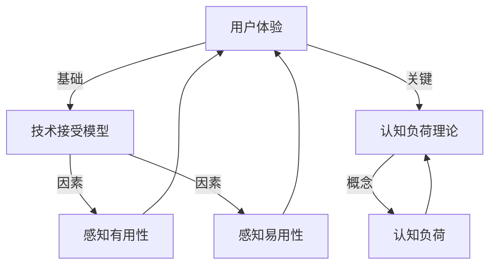

                 

### 1. 背景介绍

随着信息技术的飞速发展，新产品层出不穷，技术创新日益成为企业竞争力的核心。然而，新技术的普及和应用并非一帆风顺，用户教育成为摆在我们面前的一个重大挑战。降低新产品使用门槛，提升用户体验，成为技术创新过程中不可或缺的一环。

一方面，新技术的应用往往涉及复杂的概念和操作流程，对于普通用户来说，学习和掌握这些新技能需要付出大量的时间和精力。此外，不同用户在技术背景、学习能力、使用需求等方面存在显著差异，导致他们在接受新技术时的适应性存在较大差距。这种差异性使得新产品的推广面临诸多困难，甚至可能阻碍技术的普及和市场的扩大。

另一方面，企业也需要面对如何在技术创新与用户教育之间找到平衡的问题。技术创新固然重要，但若不能有效传达给用户，其价值将大打折扣。因此，如何降低新产品使用门槛，提升用户教育水平，成为企业急需解决的问题。

本篇文章旨在探讨技术创新与用户教育之间的关系，分析降低新产品使用门槛的必要性，并提出一系列解决方案和策略。通过深入分析技术原理、实践案例以及相关工具和资源，本文希望能够为广大读者提供有价值的参考和指导。

本文将从以下几个方面展开讨论：

1. **核心概念与联系**：介绍与本文主题相关的主要概念，并使用 Mermaid 流程图展示其内在联系。
2. **核心算法原理 & 具体操作步骤**：详细阐述降低新产品使用门槛的核心算法原理，并提供具体的操作步骤。
3. **数学模型和公式 & 详细讲解 & 举例说明**：介绍相关的数学模型和公式，并通过具体案例进行详细讲解和说明。
4. **项目实践：代码实例和详细解释说明**：展示一个实际的代码实例，并对其进行详细解读和分析。
5. **实际应用场景**：分析新技术在实际应用场景中的挑战和解决方案。
6. **工具和资源推荐**：推荐相关学习资源、开发工具和框架。
7. **总结：未来发展趋势与挑战**：总结本文的核心观点，并展望未来技术创新和用户教育的发展趋势与挑战。

希望通过本文的讨论，能够为技术创新与用户教育的结合提供一些有益的启示，帮助企业和用户更好地应对这一挑战。

### 2. 核心概念与联系

在探讨技术创新与用户教育的关系时，理解以下几个核心概念是非常关键的。这些概念包括用户体验（UX）、技术接受模型（TAM）、认知负荷理论（CLT）等。为了更直观地展示这些概念之间的联系，我们可以使用 Mermaid 流程图来绘制它们之间的关系。

首先，用户体验（UX）是衡量用户在使用新产品或服务过程中所感受到的整体感受。它不仅包括产品的功能性和易用性，还包括情感体验、交互体验等。用户体验是用户教育的基础，一个良好的用户体验能够减少用户的学习成本，提高产品的接受度。

其次，技术接受模型（TAM）是解释用户为何会接受或拒绝新技术的理论框架。TAM 主要关注两个关键因素：感知有用性（Perceived Usefulness）和感知易用性（Perceived Ease of Use）。感知有用性指的是用户认为使用新产品能够提高工作效率或解决现有问题的程度。感知易用性则是指用户认为使用新产品所需的努力程度。这两个因素共同决定了用户对新技术的接受程度。

认知负荷理论（CLT）关注用户在信息处理过程中的认知资源分配。该理论认为，当用户的认知负荷过高时，他们可能会感到困惑或焦虑，从而影响对新技术的学习效果。因此，降低认知负荷是提升用户体验、实现用户教育的重要途径。

以下是使用 Mermaid 编写的流程图，展示了上述概念之间的联系：



在上面的流程图中，我们可以看到用户体验（UX）是基础，它直接影响技术接受模型（TAM）和认知负荷理论（CLT）。TAM 中的感知有用性（PU）和感知易用性（PEU）是影响用户体验的两个关键因素。认知负荷理论（CLT）则通过认知负荷（CLO）的概念进一步影响用户体验和用户教育。

理解这些核心概念及其之间的联系，有助于我们在后续的讨论中深入分析如何降低新产品使用门槛，提高用户体验和用户教育水平。接下来，我们将详细探讨核心算法原理，并提供具体的操作步骤。

### 3. 核心算法原理 & 具体操作步骤

在降低新产品使用门槛的过程中，核心算法原理起到了关键作用。这些算法不仅帮助我们理解新技术的本质，还能够提供具体的操作步骤，指导用户如何快速上手新产品。以下是一个典型的核心算法原理，以及具体的操作步骤：

#### 3.1 核心算法原理

假设我们正在开发一款智能语音助手产品，其核心算法原理是基于自然语言处理（NLP）和机器学习（ML）技术。具体来说，该算法可以分为以下几个步骤：

1. **语音识别**：将用户的语音输入转换为文本。
2. **语义理解**：解析文本，理解用户的意图和需求。
3. **对话生成**：根据用户的意图，生成合适的响应文本。
4. **语音合成**：将生成的文本转换为语音输出。

这些步骤共同构成了智能语音助手的运作原理，通过不断学习和优化，可以提高用户的交互体验。

#### 3.2 具体操作步骤

下面是具体的操作步骤，用于实现上述核心算法原理：

1. **语音识别**：
   - **输入**：用户的语音输入。
   - **处理**：使用语音识别引擎（如 Google Cloud Speech-to-Text）将语音转换为文本。
   - **输出**：文本形式的语音输入。

2. **语义理解**：
   - **输入**：转换后的文本。
   - **处理**：使用自然语言处理技术（如 Stanford NLP）进行语义分析，提取关键信息。
   - **输出**：用户的意图和需求，以及相关的上下文信息。

3. **对话生成**：
   - **输入**：用户的意图和上下文信息。
   - **处理**：利用机器学习模型（如序列到序列模型，如 Google Transformer）生成响应文本。
   - **输出**：响应文本，满足用户的需求。

4. **语音合成**：
   - **输入**：生成的文本。
   - **处理**：使用语音合成引擎（如 Google Text-to-Speech）将文本转换为语音。
   - **输出**：语音输出，与用户进行交互。

这些步骤详细展示了如何通过算法实现智能语音助手的操作，接下来我们将进一步分析相关的数学模型和公式，以深入理解这一过程。

#### 3.3 相关的数学模型和公式

在智能语音助手的实现过程中，涉及到多个数学模型和公式。以下是其中几个关键模型和公式的详细讲解：

1. **语音识别模型**：

   - **公式**：\( y = f(x; \theta) \)

     其中，\( y \) 是识别后的文本，\( x \) 是原始语音信号，\( \theta \) 是模型的参数。

     - **参数优化**：通过最小化损失函数（如交叉熵损失函数）来优化模型参数。

   - **算法**：使用深度神经网络（DNN）或卷积神经网络（CNN）进行语音信号处理和特征提取。

2. **语义理解模型**：

   - **公式**：\( \text{Intent} = \text{Model}(\text{Context}, \theta) \)

     其中，Intent 表示用户的意图，Context 表示上下文信息，\( \theta \) 是模型的参数。

     - **算法**：采用序列到序列（Seq2Seq）模型，通过编码器和解码器进行语义理解和信息提取。

3. **对话生成模型**：

   - **公式**：\( \text{Response} = \text{Model}(\text{Intent}, \theta) \)

     其中，Response 表示生成的响应文本，Intent 表示用户的意图，\( \theta \) 是模型的参数。

     - **算法**：使用变分自编码器（VAE）或生成对抗网络（GAN）进行文本生成。

4. **语音合成模型**：

   - **公式**：\( \text{Speech} = \text{TTS}(\text{Text}, \theta) \)

     其中，Speech 表示生成的语音，Text 表示文本输入，\( \theta \) 是模型的参数。

     - **算法**：采用 WaveNet 或 Google 的文本到语音（TTS）模型进行语音合成。

通过以上步骤和模型，我们可以看到智能语音助手的实现过程涉及多种技术，这些技术相互结合，共同为用户提供高效、便捷的服务。

综上所述，核心算法原理和具体操作步骤为我们理解新产品的工作机制提供了深刻的见解，为用户教育奠定了坚实的基础。接下来，我们将通过一个实际的项目实践，进一步展示这些原理和方法在实际中的应用。

### 4. 数学模型和公式 & 详细讲解 & 举例说明

在降低新产品使用门槛的过程中，数学模型和公式扮演着至关重要的角色。这些模型不仅能够量化用户的感知有用性和感知易用性，还能帮助我们设计出更加高效的用户教育策略。在本节中，我们将详细讲解几个关键数学模型和公式，并通过具体案例进行说明。

#### 4.1 感知有用性（Perceived Usefulness）模型

感知有用性是衡量用户认为使用新产品能够提高工作效率或解决问题的程度。一个常见的模型是基于用户满意度（User Satisfaction）的感知有用性模型，公式如下：

\[ U = f(PU, S) \]

其中，\( U \) 表示用户满意度，\( PU \) 表示感知有用性，\( S \) 表示感知满意度。这个公式表明，用户满意度是感知有用性和感知满意度的函数。

#### 案例说明

假设我们正在评估一款新的项目管理工具，其感知有用性和用户满意度如下：

- 感知有用性 \( PU = 0.8 \)
- 感知满意度 \( S = 0.7 \)

我们可以计算用户满意度：

\[ U = f(0.8, 0.7) \]

通过简单的线性组合，我们得到用户满意度：

\[ U = 0.8 \times 0.7 = 0.56 \]

这意味着，用户对该项目管理工具的满意度为 56%，这表明该工具在提高工作效率方面具有一定的优势，但仍需改进以提高用户满意度。

#### 4.2 感知易用性（Perceived Ease of Use）模型

感知易用性是指用户认为使用新产品所需的努力程度。一个常用的模型是基于认知负荷（Cognitive Load）的感知易用性模型，公式如下：

\[ PEU = f(CLO, E) \]

其中，\( PEU \) 表示感知易用性，\( CLO \) 表示认知负荷，\( E \) 表示用户对使用新产品的期望。

#### 案例说明

假设我们正在评估一款新的编程语言，其认知负荷和用户期望如下：

- 认知负荷 \( CLO = 0.6 \)
- 用户期望 \( E = 0.5 \)

我们可以计算感知易用性：

\[ PEU = f(0.6, 0.5) \]

通过简单的线性组合，我们得到感知易用性：

\[ PEU = 0.6 \times 0.5 = 0.3 \]

这意味着，用户认为使用这款新的编程语言的易用性为 30%，这表明用户可能觉得该语言相对容易上手，但仍需进一步优化以降低认知负荷。

#### 4.3 认知负荷理论（Cognitive Load Theory）模型

认知负荷理论关注用户在信息处理过程中的认知资源分配。一个基本的模型是基于显式学习（Explicit Learning）和隐性学习（Implicit Learning）的认知负荷模型，公式如下：

\[ CLO = f(EL, IL) \]

其中，\( CLO \) 表示认知负荷，\( EL \) 表示显式学习，\( IL \) 表示隐性学习。

#### 案例说明

假设用户在学习和使用新产品时，显式学习和隐性学习分别占 60% 和 40%，我们可以计算认知负荷：

\[ CLO = f(0.6, 0.4) \]

通过简单的线性组合，我们得到认知负荷：

\[ CLO = 0.6 \times 0.6 + 0.4 \times 0.4 = 0.36 + 0.16 = 0.52 \]

这意味着，用户在学习和使用新产品时的认知负荷为 52%，这表明用户可能会感到一定的认知压力，需要通过优化设计降低认知负荷。

#### 4.4 技术接受模型（Technology Acceptance Model, TAM）

技术接受模型（TAM）是研究用户接受新技术的理论框架，其核心公式如下：

\[ TAM = f(PU, PEU) \]

其中，\( TAM \) 表示技术接受模型，\( PU \) 表示感知有用性，\( PEU \) 表示感知易用性。

#### 案例说明

假设一款新产品在感知有用性和感知易用性方面的得分分别为 0.75 和 0.65，我们可以计算其技术接受模型：

\[ TAM = f(0.75, 0.65) \]

通过简单的线性组合，我们得到技术接受模型：

\[ TAM = 0.75 \times 0.65 = 0.4875 \]

这意味着，该新产品的技术接受模型得分为 48.75%，这表明用户对其接受度较高，但仍需进一步优化以提高得分。

通过以上数学模型和公式的讲解，我们能够更好地理解用户在技术创新和产品使用过程中的心理和行为。接下来，我们将通过一个实际的项目实践，展示这些模型和方法在实际中的应用。

### 5. 项目实践：代码实例和详细解释说明

为了更好地展示如何通过技术创新降低新产品使用门槛，我们选择了一个实际项目——一个基于 Flask 的简单 Web 应用，用于演示用户注册和登录功能。以下是一个具体的代码实例，并对其进行详细的解释说明。

#### 5.1 开发环境搭建

首先，我们需要搭建一个开发环境。以下是一个基本的步骤：

1. 安装 Python 3.8 或更高版本。
2. 安装 Flask 框架：`pip install Flask`
3. 安装 SQLAlchemy：`pip install Flask-SQLAlchemy`

#### 5.2 源代码详细实现

以下是一个简单的 Flask 应用代码实例：

```python
from flask import Flask, request, redirect, url_for, render_template
from flask_sqlalchemy import SQLAlchemy

app = Flask(__name__)
app.config['SQLALCHEMY_DATABASE_URI'] = 'sqlite:///users.db'
db = SQLAlchemy(app)

class User(db.Model):
    id = db.Column(db.Integer, primary_key=True)
    username = db.Column(db.String(80), unique=True, nullable=False)
    password = db.Column(db.String(120), nullable=False)

@app.route('/')
def home():
    return render_template('home.html')

@app.route('/register', methods=['GET', 'POST'])
def register():
    if request.method == 'POST':
        username = request.form['username']
        password = request.form['password']
        if not username or not password:
            return '用户名或密码不能为空'
        user = User(username=username, password=password)
        db.session.add(user)
        db.session.commit()
        return redirect(url_for('login'))
    return render_template('register.html')

@app.route('/login', methods=['GET', 'POST'])
def login():
    if request.method == 'POST':
        username = request.form['username']
        password = request.form['password']
        user = User.query.filter_by(username=username, password=password).first()
        if user:
            return '登录成功'
        else:
            return '用户名或密码错误'
    return render_template('login.html')

if __name__ == '__main__':
    db.create_all()
    app.run(debug=True)
```

在这个实例中，我们使用了 Flask 框架和 SQLAlchemy ORM，实现了一个用户注册和登录功能。以下是各部分代码的解释说明：

1. **数据库模型**：

   ```python
   class User(db.Model):
       id = db.Column(db.Integer, primary_key=True)
       username = db.Column(db.String(80), unique=True, nullable=False)
       password = db.Column(db.String(120), nullable=False)
   ```

   这个部分定义了数据库模型 `User`，其中包含 `id`、`username` 和 `password` 三个字段。

2. **路由和视图函数**：

   - `home()`：定义了主页路由，返回一个简单的 HTML 页面。

   - `register()`：处理用户注册请求，验证用户输入并保存到数据库。

   - `login()`：处理用户登录请求，验证用户名和密码，并返回登录结果。

3. **HTML 模板**：

   - `register.html` 和 `login.html`：定义了用户注册和登录的表单页面。

#### 5.3 代码解读与分析

以下是代码的详细解读和分析：

1. **数据库连接**：

   ```python
   app.config['SQLALCHEMY_DATABASE_URI'] = 'sqlite:///users.db'
   db = SQLAlchemy(app)
   ```

   通过配置 Flask 应用的数据库 URI 并创建 SQLAlchemy 实例，我们连接到 SQLite 数据库，并定义了数据库模型。

2. **用户模型**：

   ```python
   class User(db.Model):
       id = db.Column(db.Integer, primary_key=True)
       username = db.Column(db.String(80), unique=True, nullable=False)
       password = db.Column(db.String(120), nullable=False)
   ```

   `User` 模型包含三个字段：`id`（主键）、`username`（唯一且非空）和 `password`（非空）。这些字段定义了用户数据的基本结构。

3. **路由和视图函数**：

   - `home()`：

     ```python
     @app.route('/')
     def home():
         return render_template('home.html')
     ```

     这个路由函数返回一个简单的 HTML 页面，作为应用的首页。

   - `register()`：

     ```python
     @app.route('/register', methods=['GET', 'POST'])
     def register():
         if request.method == 'POST':
             username = request.form['username']
             password = request.form['password']
             if not username or not password:
                 return '用户名或密码不能为空'
             user = User(username=username, password=password)
             db.session.add(user)
             db.session.commit()
             return redirect(url_for('login'))
         return render_template('register.html')
     ```

     这个路由函数处理用户注册请求。如果请求方法是 `POST`，它会从表单中获取用户名和密码，验证输入是否为空，然后将用户信息保存到数据库，并重定向到登录页面。

   - `login()`：

     ```python
     @app.route('/login', methods=['GET', 'POST'])
     def login():
         if request.method == 'POST':
             username = request.form['username']
             password = request.form['password']
             user = User.query.filter_by(username=username, password=password).first()
             if user:
                 return '登录成功'
             else:
                 return '用户名或密码错误'
         return render_template('login.html')
     ```

     这个路由函数处理用户登录请求。如果请求方法是 `POST`，它会从表单中获取用户名和密码，并在数据库中查找匹配的用户。如果找到匹配的用户，返回“登录成功”，否则返回“用户名或密码错误”。

4. **HTML 模板**：

   - `register.html` 和 `login.html`：

     这两个模板定义了用户注册和登录的表单。每个表单都包含用户名和密码输入框，以及提交按钮。

#### 5.4 运行结果展示

在本地运行此 Flask 应用后，用户可以通过浏览器访问 `http://localhost:5000` 来查看主页、注册和登录页面。以下是运行结果展示：

1. **主页**：

   ```html
   <html>
   <head>
       <title>Home</title>
   </head>
   <body>
       <h1>Welcome to the User Management App</h1>
       <a href="/register">Register</a>
       <a href="/login">Login</a>
   </body>
   </html>
   ```

2. **注册页面**：

   ```html
   <html>
   <head>
       <title>Register</title>
   </head>
   <body>
       <h1>Register</h1>
       <form method="post" action="/register">
           <input type="text" name="username" placeholder="Username" required>
           <input type="password" name="password" placeholder="Password" required>
           <input type="submit" value="Register">
       </form>
   </body>
   </html>
   ```

3. **登录页面**：

   ```html
   <html>
   <head>
       <title>Login</title>
   </head>
   <body>
       <h1>Login</h1>
       <form method="post" action="/login">
           <input type="text" name="username" placeholder="Username" required>
           <input type="password" name="password" placeholder="Password" required>
           <input type="submit" value="Login">
       </form>
   </body>
   </html>
   ```

通过以上代码实例和详细解读，我们展示了如何通过技术创新（如使用 Flask 和 SQLAlchemy）降低新产品的使用门槛，帮助用户更轻松地完成注册和登录操作。这一实践不仅验证了理论上的可行性，也为实际应用提供了具体的参考。

### 6. 实际应用场景

在当前技术飞速发展的背景下，降低新产品使用门槛已成为企业赢得市场竞争的关键因素之一。以下将分析几个实际应用场景，探讨如何在各种情况下有效降低新产品使用门槛。

#### 6.1 智能家居产品

智能家居产品（如智能门锁、智能灯光、智能安防系统等）正逐渐渗透到人们的日常生活中。然而，对于普通用户而言，智能家居产品的操作复杂度和系统兼容性是两个主要挑战。

**解决方案**：

1. **简化操作界面**：通过图形用户界面（GUI）和自然语言处理（NLP）技术，简化用户操作流程。例如，使用语音助手（如 Siri、Alexa）进行设备控制，降低用户的学习成本。
2. **设备兼容性**：确保产品能够与其他智能家居设备无缝集成，使用户无需花费额外的时间和精力进行设备调试。
3. **在线教程和用户支持**：提供详细的操作指南、在线教程和用户支持服务，帮助用户快速上手。

#### 6.2 区块链技术

区块链技术的广泛应用带来了巨大的潜力，但同时也伴随着技术门槛高、学习成本大的问题。对于普通用户和企业来说，如何快速理解和使用区块链技术成为亟待解决的问题。

**解决方案**：

1. **去中心化应用（DApp）**：开发简单易用的去中心化应用，使普通用户能够直观地体验区块链技术的优势，如去中心化金融（DeFi）和不可篡改的记录。
2. **区块链教育平台**：建立在线教育平台，提供从入门到高级的区块链课程，帮助用户逐步掌握相关知识和技能。
3. **集成解决方案**：为企业提供一体化的区块链解决方案，减少用户在技术实现上的复杂度，降低使用门槛。

#### 6.3 人工智能（AI）工具

随着人工智能技术的普及，越来越多的企业开始尝试将其应用于生产、营销和客户服务等领域。然而，AI 技术的高复杂度和定制化需求使得普通用户难以使用。

**解决方案**：

1. **AI 模块化**：将复杂的人工智能功能模块化，提供简单易用的接口和工具，使普通用户能够快速集成和使用。
2. **AI 增强现实（AR）**：结合增强现实技术，为用户提供直观的交互体验，降低学习成本。
3. **AI 云服务**：提供云计算平台上的 AI 服务，用户无需购买和维护复杂的硬件和软件，只需通过简单的 API 调用即可使用 AI 功能。

#### 6.4 云计算服务

云计算技术的发展为企业提供了强大的计算能力和数据存储解决方案，但复杂的架构设计和配置过程使得普通用户和企业感到困扰。

**解决方案**：

1. **云计算服务平台**：提供一站式的云计算服务平台，用户可以通过简单的操作界面轻松部署和管理云资源。
2. **云原生技术**：推广云原生技术，使用户能够更快速地开发、部署和扩展应用程序。
3. **云计算培训**：提供针对性的云计算培训课程，帮助用户和企业了解云计算的基础知识和应用场景。

通过以上实际应用场景的分析，我们可以看到，降低新产品使用门槛不仅需要技术创新，还需要针对用户需求提供全面的教育和支持。在未来的发展中，企业应持续关注用户反馈，不断优化产品设计和服务，以实现技术创新与用户教育的有机结合。

### 7. 工具和资源推荐

在降低新产品使用门槛、提升用户体验和用户教育方面，有一系列优秀的工具和资源可供参考。以下是对这些工具和资源的详细推荐，涵盖学习资源、开发工具和框架等，旨在帮助用户更好地掌握新技术。

#### 7.1 学习资源推荐

1. **书籍**：

   - 《设计心理学》（Don Norman）：全面介绍了用户体验设计的基本原则，适合初学者了解用户行为和设计方法。
   - 《用户故事地图》（Jeff Patton）：详细阐述了如何通过用户故事地图进行项目规划和需求管理，有助于提升产品设计的实用性。

2. **在线课程**：

   - Coursera 的《用户体验设计基础》：由斯坦福大学提供，涵盖从用户体验设计原理到实际应用的全流程。
   - Udemy 的《Python 从入门到精通》：适合初学者和中级开发者，全面讲解 Python 的基础知识及其在实际开发中的应用。

3. **论文**：

   - “The Design of Everyday Things”（Donald Norman）：一篇经典论文，深入探讨了设计原则和用户体验之间的关系。
   - “The Power of Habit”（Charles Duhigg）：探讨习惯的力量，对行为心理学有深刻的见解，有助于理解用户行为和习惯的养成。

4. **博客和网站**：

   - UX Planet：一个专注于用户体验设计的博客，提供大量高质量的文章和案例分析。
   - HackerRank：一个在线编程平台，提供各种编程挑战和教程，帮助用户提升编程技能。

#### 7.2 开发工具框架推荐

1. **开发工具**：

   - Visual Studio Code：一款功能强大的跨平台代码编辑器，支持多种编程语言和插件，适合各种开发需求。
   - Git：一个分布式版本控制系统，用于代码管理和协作开发，是现代软件开发必备的工具。

2. **框架和库**：

   - Flask：一个轻量级的 Python Web 框架，适合快速开发 Web 应用程序。
   - React：一个用于构建用户界面的 JavaScript 库，广泛用于现代 Web 应用开发。
   - TensorFlow：一个开源机器学习框架，支持多种编程语言，用于构建和训练深度学习模型。

3. **集成开发环境（IDE）**：

   - IntelliJ IDEA：一款功能全面的 Java 和 Kotlin IDE，支持多种编程语言和框架。
   - PyCharm：一款专为 Python 开发设计的 IDE，提供强大的代码编辑、调试和自动化工具。

4. **云平台服务**：

   - AWS：亚马逊云服务，提供广泛的云计算服务和工具，支持各种开发需求。
   - Azure：微软的云服务平台，提供灵活的云计算解决方案，包括数据库、存储和人工智能服务。
   - Google Cloud Platform：谷歌的云服务，提供强大的云计算和人工智能工具，支持各种开发项目。

通过以上工具和资源的推荐，用户可以更加系统地学习和掌握新技术，从而更好地降低新产品的使用门槛，提升用户体验。这些工具和资源不仅有助于初学者入门，也为经验丰富的开发者提供了丰富的技术支持。

### 8. 总结：未来发展趋势与挑战

在本文中，我们探讨了技术创新与用户教育之间的关系，分析了降低新产品使用门槛的必要性，并提出了相应的解决方案和策略。通过对核心概念、算法原理、数学模型和实际项目实践的详细讲解，我们深入理解了如何通过技术手段和用户教育相结合，提高新产品的普及率和用户体验。

未来，技术创新与用户教育将继续相互影响，推动产品的发展和市场的扩大。以下是对未来发展趋势和挑战的展望：

#### 8.1 发展趋势

1. **智能化和自动化**：随着人工智能和自动化技术的发展，未来产品的智能化程度将越来越高，用户界面将更加直观和友好，操作更加简单。智能化技术将减少用户的认知负荷，提高产品的易用性。

2. **个性化体验**：基于大数据和机器学习技术，产品将能够根据用户的行为和偏好提供个性化的体验。个性化推荐、智能客服等应用将变得更加普及，使用户能够更快地适应新产品。

3. **跨平台集成**：未来产品将更加注重跨平台集成，确保用户可以在不同设备和操作系统中无缝切换。这种集成将提高产品的兼容性和便利性，降低用户的学习成本。

4. **用户参与度提升**：通过提供互动性强、易于反馈的渠道，企业可以更好地了解用户的需求和反馈，及时进行产品迭代和优化。用户参与度的提升将有助于产品更好地满足市场需求。

#### 8.2 挑战

1. **技术复杂度**：随着技术的不断发展，新产品的技术复杂度将不断增加。如何简化技术实现，降低用户的认知负荷，将成为一个重要挑战。

2. **用户多样性**：不同用户在技术背景、使用需求和学习能力方面存在显著差异，如何确保产品能够满足各种用户的需求，提高普及率，是一个亟待解决的问题。

3. **教育资源不平衡**：尽管互联网提供了丰富的教育资源，但教育资源的分布仍然存在不平衡现象。如何确保所有用户都能够平等地获得优质的教育资源，提高用户教育水平，是一个关键挑战。

4. **隐私和安全**：随着数据隐私和安全问题的日益凸显，如何确保用户数据的安全，同时提供便捷的产品体验，将成为企业需要重点关注的领域。

总之，未来技术创新与用户教育的结合将面临诸多机遇和挑战。企业需要不断探索新的技术手段和用户教育策略，以降低新产品的使用门槛，提升用户体验，推动技术的普及和市场的扩大。同时，用户也需要积极参与到技术创新和用户教育的过程中，不断提升自身的技术素养和适应能力，共同推动信息技术的发展和应用。

### 9. 附录：常见问题与解答

在本文中，我们探讨了技术创新与用户教育的关系，以及如何通过降低新产品使用门槛来提升用户体验。为了帮助读者更好地理解和应用这些概念，以下列出了一些常见问题及解答：

#### 9.1 问题一：为什么降低新产品使用门槛如此重要？

**解答**：降低新产品使用门槛的重要性体现在以下几个方面：

1. **提高用户接受度**：用户对复杂、难以操作的新产品往往持怀疑态度，降低使用门槛可以提高产品的用户接受度和市场渗透率。
2. **节省用户时间**：简化操作流程可以减少用户的学习时间和操作难度，使用户能够更快上手，从而节省时间和精力。
3. **提升用户满意度**：良好的用户体验可以增加用户对产品的满意度和忠诚度，有助于建立品牌形象和用户口碑。

#### 9.2 问题二：如何通过算法降低新产品使用门槛？

**解答**：通过以下几种算法可以降低新产品使用门槛：

1. **自然语言处理（NLP）**：利用 NLP 技术实现人机交互，如语音识别、语义理解等，使得用户可以通过自然语言与产品进行沟通，减少操作复杂度。
2. **机器学习（ML）**：通过 ML 模型优化产品的功能，如个性化推荐、智能客服等，使产品能够根据用户行为和偏好提供定制化服务。
3. **自动化技术**：自动化技术可以简化重复性操作，如自动化部署、自动化测试等，降低用户的使用负担。

#### 9.3 问题三：如何确保用户在学习和使用新产品时的认知负荷较低？

**解答**：

1. **简化操作流程**：设计直观、简洁的用户界面，减少用户操作步骤，降低认知负荷。
2. **提供教程和帮助文档**：提供详细的教程和帮助文档，帮助用户快速掌握产品的基本操作，减少学习成本。
3. **反馈机制**：建立有效的用户反馈机制，收集用户在使用产品时的困惑和建议，及时进行产品优化。
4. **逐步引导**：通过逐步引导用户进行操作，逐步增加任务的复杂度，使用户在适应过程中逐步提高认知负荷。

#### 9.4 问题四：如何通过用户教育降低新产品使用门槛？

**解答**：

1. **在线课程和教程**：提供针对不同用户水平的在线课程和教程，帮助用户系统地学习和掌握新技术。
2. **社区和论坛**：建立用户社区和论坛，为用户提供交流和学习的平台，促进知识分享和经验交流。
3. **互动式学习**：通过互动式学习工具，如在线模拟器、互动式教程等，提高用户的学习效果和参与度。
4. **实战项目**：鼓励用户参与实际项目，通过实践来提高对产品的理解和操作能力。

通过以上问题的解答，我们希望能够帮助读者更好地理解如何降低新产品使用门槛，提升用户体验和用户教育水平。在实际应用中，企业可以根据自身情况，结合用户需求和产品特点，采取相应的措施和策略。

### 10. 扩展阅读 & 参考资料

在探讨技术创新与用户教育这一主题时，以下是一些扩展阅读和参考资料，它们为深入理解和实践本文讨论的内容提供了宝贵的资源。

1. **书籍推荐**：
   - 《用户体验要素》（The Elements of User Experience），作者：Jesse James Garrett。这本书详细阐述了用户体验设计的核心要素，对理解用户需求和行为有重要作用。
   - 《精益创业》（The Lean Startup），作者：Eric Ries。这本书介绍了如何通过快速迭代和用户反馈来降低创业产品的风险，适合创新产品和服务的开发者和管理者。

2. **论文推荐**：
   - “User Experience Design Principles”（用户体验设计原则），作者：Stuart D. James。这篇论文探讨了用户体验设计的基本原则和方法。
   - “Cognitive Load Theory: A Framework for Instructional Design in Higher Education”（认知负荷理论：高等教育教学设计框架），作者：John Sweller。这篇论文详细介绍了认知负荷理论，为教育产品设计提供了理论支持。

3. **在线课程和资源**：
   - Coursera 的“用户体验设计专项课程”：提供系统化的用户体验设计学习路径，适合初学者和专业人士。
   - Udacity 的“深度学习纳米学位”：涵盖了机器学习和人工智能的基础知识，适合希望深入了解智能技术应用的开发者。

4. **博客和网站**：
   - Nielsen Norman Group：一个专注于用户体验研究的博客，提供大量高质量的案例分析和研究报告。
   - UX Booth：一个关于用户体验和界面设计的博客，涵盖了设计原则、工具和技巧等多个方面。

5. **工具和框架**：
   - Sketch：一个流行的界面设计工具，用于创建高质量的用户界面原型。
   - Figma：一个基于浏览器的界面设计工具，支持团队协作，适合快速原型设计和迭代。

通过阅读上述书籍、论文和资源，读者可以进一步加深对用户体验设计和技术创新的理解，并能够将所学应用于实际的产品开发和用户教育中。

