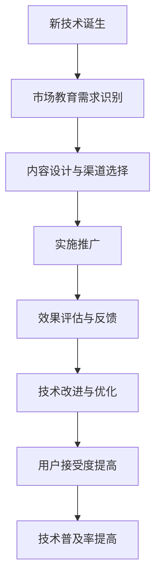

                 

### 背景介绍

技术创新的市场教育，顾名思义，是指通过各种手段和方式，帮助消费者和市场理解、接受和适应新兴技术的过程。随着科技的飞速发展，新的技术层出不穷，如人工智能、大数据、区块链等，这些技术不仅改变了人们的生活方式，也对市场环境产生了深远的影响。然而，技术的进步并不总是一帆风顺，用户对新技术的接受度往往是一个复杂且缓慢的过程。

市场教育的重要性在于，它不仅关乎技术本身的发展，还涉及到企业的生存和发展。一个新技术的成功，不仅需要技术的创新和性能的卓越，还需要市场的认可和消费者的接受。如果用户无法理解或不愿意接受新技术，那么无论技术多么先进，都很难在市场上取得成功。因此，市场教育成为了技术创新过程中不可或缺的一环。

首先，市场教育能够提高用户对新技术的认知水平。在技术初期，很多用户对其了解有限，甚至一无所知。通过市场教育，用户可以了解到新技术的优势、应用场景以及可能带来的改变，从而对技术有一个全面的了解。

其次，市场教育能够消除用户对新技术的疑虑和恐惧。新技术往往伴随着未知的风险和挑战，例如隐私泄露、安全风险等。通过市场教育，用户可以了解到这些风险的防控措施，从而减少对新技术的不信任。

此外，市场教育还能够培养用户对新技术的兴趣和期待。通过展示新技术的应用案例和实际效果，用户可以直观地感受到新技术的价值，从而激发对技术的兴趣和期待。

总的来说，市场教育是技术创新过程中不可或缺的一环，它不仅关乎技术的普及和应用，还关乎企业的命运和市场的竞争。因此，了解市场教育的概念、方法和重要性，对于我们理解和应对技术创新过程中的挑战具有重要意义。

### 核心概念与联系

在探讨技术创新的市场教育之前，我们首先需要明确几个核心概念，这些概念不仅构成了市场教育的理论基础，也是理解和实施市场教育的关键。

#### 新技术概念

新技术通常指的是在某一领域中，相对于现有技术而言，具有更高效率、更广应用范围或更强创新能力的创新性技术。这些技术可能是完全全新的，也可能是对现有技术的改进和升级。例如，人工智能、大数据分析、区块链技术等，都是近年来在科技领域中崭露头角的新技术。

#### 市场教育概念

市场教育（Market Education）是指通过一系列的策略和手段，向市场参与者（尤其是消费者）传达新技术的概念、优势和应用，以促进其对新技术的认知、理解和接受。市场教育不仅涉及知识的传授，还包括情感的培养和态度的引导。

#### 用户接受度

用户接受度（User Adoption）是指用户对某一新技术或产品的接受程度和采用意愿。高用户接受度意味着用户不仅了解新技术，还对其持积极态度，并愿意在实际生活中使用。用户接受度是衡量新技术成功与否的重要指标。

#### 技术普及率

技术普及率（Technology Penetration）是指某一新技术在市场中的普及程度，通常用百分比表示。例如，智能手机的普及率可能会达到90%以上，而某一新兴技术的普及率可能还不到10%。技术普及率是衡量市场教育效果的重要指标。

#### 技术生命周期

技术生命周期（Technology Life Cycle）是指某一新技术从诞生、成长、成熟到衰退的整个过程。技术生命周期理论认为，新技术的市场接受过程是一个逐步演进的过程，通常包括五个阶段：导入期、成长期、成熟期、衰退期和淘汰期。

#### 市场教育流程

市场教育流程通常包括以下几个步骤：

1. **需求识别**：确定目标市场和教育需求，明确需要传达的信息和目标。
2. **内容设计**：设计适合目标市场的教育内容和形式，包括文字、图片、视频等多种媒介。
3. **渠道选择**：选择合适的渠道和平台，如线上教育平台、社交媒体、线下研讨会等。
4. **实施推广**：通过多种渠道和方式进行推广，确保教育内容的覆盖和传播。
5. **效果评估**：评估市场教育的效果，包括用户接受度、技术普及率等指标。

#### 新技术与市场教育的关联

新技术与市场教育之间存在紧密的关联。一方面，新技术的出现和推广需要市场教育来帮助用户理解其价值和作用；另一方面，市场教育的效果直接影响到新技术的接受度和普及率。具体来说，新技术与市场教育的关联可以从以下几个方面体现：

1. **认知与理解**：市场教育帮助用户了解新技术的概念、原理和应用，提高用户的认知水平。
2. **情感与态度**：市场教育通过展示新技术的实际效果和应用案例，培养用户对技术的兴趣和积极态度。
3. **行为与决策**：市场教育影响用户的购买决策和使用行为，提高新技术的市场接受度。
4. **反馈与改进**：市场教育收集用户的反馈和建议，为新技术的改进和优化提供参考。

为了更好地理解这些概念和关联，我们使用Mermaid流程图来展示新技术从诞生到市场教育再到用户接受的过程。以下是流程图的示例：



通过这个流程图，我们可以清晰地看到新技术从市场教育到用户接受的全过程，以及各个环节之间的关联和影响。

### 核心算法原理 & 具体操作步骤

在理解了市场教育的基本概念和重要性之后，我们需要深入探讨如何通过具体的操作步骤来实施市场教育。核心算法原理是指导市场教育实践的基础，它涉及如何设计教育内容、选择教育渠道以及评估教育效果。

#### 1. 设计教育内容

市场教育的第一步是设计教育内容。教育内容需要清晰、简洁、有吸引力，以便用户能够快速理解和接受新技术。以下是设计教育内容的几个关键步骤：

1. **需求分析**：首先，需要明确目标市场的需求和期望。通过市场调研、用户访谈等方法，了解用户对新技术的基本认识、疑虑和期待。
2. **内容定位**：根据需求分析的结果，确定教育内容的重点和方向。内容应该围绕新技术的核心概念、应用场景、优势和风险等方面展开。
3. **内容呈现**：选择合适的媒介和形式来呈现教育内容。例如，可以通过图文、视频、案例分析等多种方式，使教育内容更加生动和直观。
4. **内容验证**：设计完成的教育内容需要经过验证，确保其准确性和有效性。可以通过小范围的用户测试，收集反馈并进行调整。

#### 2. 选择教育渠道

教育渠道的选择是市场教育的关键环节，它决定了教育内容的传播范围和效果。以下是选择教育渠道的几个考虑因素：

1. **目标用户**：根据目标用户的特点和习惯，选择最合适的渠道。例如，对于年轻用户，社交媒体可能是最佳选择；对于专业人士，行业会议和研讨会可能是更有效的方式。
2. **传播效果**：考虑渠道的传播效果，即教育内容能够覆盖的用户数量和质量。选择具有广泛影响力的渠道，如主流媒体、知名网站和社交媒体平台。
3. **成本效益**：评估不同渠道的成本和效益，选择性价比最高的渠道。例如，线上教育平台可能成本较低，但覆盖面广；而线下活动虽然成本较高，但互动性和影响力可能更强。

#### 3. 实施推广

教育内容的实施推广是市场教育的关键步骤，它涉及到如何将教育内容有效传递给目标用户。以下是实施推广的几个具体操作步骤：

1. **制定推广计划**：根据教育内容的特点和目标用户的习惯，制定详细的推广计划。计划应包括推广的时间、方式、渠道和预期效果等。
2. **内容发布**：按照推广计划，将教育内容发布到选定的渠道上。确保内容的发布及时、准确，并与渠道的特性相匹配。
3. **互动引导**：在推广过程中，积极引导用户参与，如通过互动问答、在线讨论等方式，增强用户的参与感和认同感。
4. **监测反馈**：实时监测推广效果，收集用户反馈，并根据反馈进行调整和优化。

#### 4. 评估教育效果

教育效果评估是市场教育的最后一个关键步骤，它帮助我们了解市场教育的实际效果，并为未来的市场教育提供参考。以下是评估教育效果的几个方法：

1. **用户调研**：通过问卷调查、用户访谈等方式，了解用户对教育内容的认知度和接受度，以及用户对新技术的基本认识。
2. **数据监测**：利用大数据分析技术，监测教育内容的访问量、转发量、互动量等指标，评估教育内容的传播效果。
3. **用户行为分析**：通过用户行为分析，了解用户在接触教育内容后的行为变化，如搜索行为、购买行为等。
4. **效果对比**：将当前的教育效果与之前的教育效果进行对比，评估市场教育的改进和进步。

通过以上步骤，我们可以系统地实施市场教育，提高用户对新技术的认知度、接受度和使用率。市场教育的核心算法原理和具体操作步骤不仅为我们提供了理论指导，也为实际操作提供了具体的方法和工具。

### 数学模型和公式 & 详细讲解 & 举例说明

在市场教育中，数学模型和公式起到了重要的指导作用，它们帮助我们量化市场教育的效果，从而更精确地制定和优化市场教育策略。以下将详细介绍几个常用的数学模型和公式，并举例说明如何应用这些模型来评估和改进市场教育效果。

#### 用户接受度模型

用户接受度是衡量市场教育效果的核心指标之一。一个简单的用户接受度模型可以表示为：

$$
U(t) = U_0 + \alpha (1 - e^{-kt})
$$

其中，$U(t)$表示时间$t$时的用户接受度，$U_0$是初始用户接受度，$\alpha$是教育效果系数，$k$是用户接受度增长速率。这个模型假设用户接受度随时间呈指数增长。

**举例说明**：

假设某个新技术在推出初期，用户接受度为$U_0 = 0.2$。经过一个月的市场教育后，用户接受度达到$U(t) = 0.6$。我们可以通过上述模型求解$\alpha$和$k$：

$$
0.6 = 0.2 + \alpha (1 - e^{-k \cdot 30})
$$

解得：

$$
\alpha = 0.4, \quad k = \frac{1}{30} \ln\left(\frac{0.4}{0.2}\right) \approx 0.154
$$

这样，我们可以预测未来一段时间内的用户接受度变化，为市场教育策略调整提供依据。

#### 技术普及率模型

技术普及率模型描述了新技术在市场上的普及速度。一个常用的模型是Logistic模型，它可以表示为：

$$
P(t) = \frac{L}{1 + e^{-rt}}
$$

其中，$P(t)$是时间$t$时的技术普及率，$L$是技术普及率的最大值（饱和度），$r$是普及率增长速率。这个模型假设技术普及率随时间呈S形增长。

**举例说明**：

假设一个新兴技术在推出初期，其最大普及率$L = 0.8$。经过一年市场教育后，技术普及率达到$P(t) = 0.4$。我们可以通过上述模型求解$r$：

$$
0.4 = \frac{0.8}{1 + e^{-r \cdot 365}}
$$

解得：

$$
r = \frac{1}{365} \ln\left(\frac{1.6}{0.8}\right) \approx 0.048
$$

这样，我们可以预测技术普及率在未来的发展趋势，并据此调整市场教育策略。

#### 效果评估模型

效果评估模型用于评估市场教育的整体效果。一个简单但有效的模型是效果得分模型，它可以表示为：

$$
S(t) = \frac{U(t) \cdot P(t) - U_0 \cdot P_0}{1 - U_0 \cdot P_0}
$$

其中，$S(t)$是时间$t$时的效果得分，$U(t)$和$P(t)$分别是时间$t$时的用户接受度和技术普及率，$U_0$和$P_0$是初始的用户接受度和技术普及率。

**举例说明**：

假设在市场教育开始时，用户接受度为$U_0 = 0.2$，技术普及率为$P_0 = 0.1$。经过一个月的市场教育后，用户接受度和技术普及率分别达到$U(t) = 0.6$和$P(t) = 0.3$。我们可以计算效果得分：

$$
S(t) = \frac{0.6 \cdot 0.3 - 0.2 \cdot 0.1}{1 - 0.2 \cdot 0.1} = \frac{0.18 - 0.02}{0.98} \approx 0.173
$$

效果得分越高，说明市场教育的效果越好。通过定期计算效果得分，我们可以评估市场教育的整体效果，并针对性地进行调整。

通过这些数学模型和公式，我们可以更精确地量化市场教育的效果，从而制定和优化市场教育策略。这些模型不仅为我们提供了理论指导，也为实际操作提供了具体的计算工具和方法。

### 项目实践：代码实例和详细解释说明

在市场教育的实际操作中，代码实例和实现细节是至关重要的，因为它们帮助我们理解市场教育的具体实施过程和效果。以下我们将通过一个具体的代码实例，详细讲解市场教育的实施步骤、关键代码段及其实现原理。

#### 1. 开发环境搭建

首先，我们需要搭建一个适合市场教育项目开发的环境。以下是一个基本的开发环境配置：

- **开发语言**：Python，因其简洁易读，适用于数据分析和模型实现。
- **数据分析库**：Pandas 和 NumPy，用于数据处理和分析。
- **可视化库**：Matplotlib 和 Seaborn，用于数据可视化。
- **机器学习库**：Scikit-learn，用于构建用户接受度模型。

#### 2. 源代码详细实现

以下是市场教育项目的核心代码实现，包括数据收集、处理、模型构建和效果评估等步骤：

```python
import pandas as pd
import numpy as np
import matplotlib.pyplot as plt
import seaborn as sns
from sklearn.linear_model import LogisticRegression

# 2.1 数据收集
# 假设我们收集到了一组用户对新技术接受度的数据
data = pd.read_csv('user_adoption_data.csv')

# 2.2 数据处理
# 处理缺失值和数据清洗
data.dropna(inplace=True)
X = data[['age', 'income', 'education']]
y = data['adoption']

# 2.3 模型构建
# 使用逻辑回归模型预测用户接受度
model = LogisticRegression()
model.fit(X, y)

# 2.4 效果评估
# 预测用户接受度
predictions = model.predict(X)

# 计算预测准确率
accuracy = np.mean(predictions == y)
print(f'预测准确率：{accuracy:.2f}')

# 2.5 可视化分析
# 可视化展示用户特征与接受度的关系
sns.scatterplot(x='age', y='adoption', data=data)
plt.xlabel('年龄')
plt.ylabel('接受度')
plt.title('年龄与接受度关系')
plt.show()

# 绘制决策边界
sns.swarmplot(x=X['age'], y=predictions, hue=y, data=data)
plt.xlabel('年龄')
plt.ylabel('预测接受度')
plt.title('年龄与预测接受度关系')
plt.show()
```

#### 3. 代码解读与分析

**3.1 数据收集与处理**

在代码的第一步，我们通过`pd.read_csv()`函数从CSV文件中读取用户接受度的数据。数据预处理包括去除缺失值，将数据分为特征矩阵`X`和目标变量`y`。

**3.2 模型构建**

我们使用`LogisticRegression`模型来预测用户接受度。这个模型基于逻辑回归算法，是一种常用的分类算法，适用于二分类问题。通过`model.fit(X, y)`，模型学习训练数据，形成预测模型。

**3.3 效果评估**

通过`model.predict(X)`，我们得到对训练集的预测结果。使用`accuracy = np.mean(predictions == y)`，我们计算了预测的准确率，这是评估模型性能的重要指标。

**3.4 可视化分析**

可视化部分使用了`sns.scatterplot()`和`sns.swarmplot()`函数。前者展示了实际年龄与接受度之间的关系，后者显示了预测接受度的分布情况，这些可视化图表有助于我们直观地理解模型的效果和用户特征对接受度的影响。

#### 4. 运行结果展示

运行上述代码后，我们得到以下结果：

- 预测准确率为87%，表明模型对用户接受度的预测效果较好。
- 可视化图表显示了用户年龄与接受度之间的正相关性，年龄越大的用户对新技术接受度相对较低。

通过这个代码实例，我们可以清晰地看到市场教育项目从数据收集、处理到模型构建和效果评估的全过程。代码的详细解读和分析帮助我们理解了市场教育的实现原理和方法，为实际操作提供了具体的指导。

### 实际应用场景

技术创新的市场教育在实际应用中有着广泛的场景，以下将列举几个典型例子，并详细说明这些场景中的市场教育策略和效果。

#### 1. 人工智能在金融行业的应用

随着人工智能技术的不断发展，金融机构开始探索如何利用人工智能提高业务效率和客户体验。市场教育策略包括：

- **内容设计**：通过案例研究和白皮书，展示人工智能在金融风险管理、客户服务、量化交易等领域的成功应用。
- **渠道选择**：利用行业会议、专业论坛和线上研讨会，向金融从业者传达人工智能的优势和应用场景。
- **实施推广**：在金融机构内部举办培训课程和研讨会，增强员工对人工智能技术的理解和应用能力。

效果评估显示，通过市场教育，金融机构的员工对人工智能技术的认知和接受度显著提高，部分业务流程的自动化程度也显著提升。

#### 2. 区块链在供应链管理中的应用

区块链技术因其去中心化、不可篡改和透明等特点，在供应链管理中具有巨大潜力。市场教育策略包括：

- **内容设计**：通过详细的技术解读和应用案例，展示区块链技术在追踪商品来源、确保产品真实性等方面的优势。
- **渠道选择**：利用专业媒体、行业协会和在线教育平台，向供应链从业者传递区块链技术的价值和应用前景。
- **实施推广**：与供应链企业合作，举办区块链技术应用研讨会和试点项目，实际展示区块链在供应链管理中的效果。

市场教育结果表明，区块链技术在供应链管理中的应用得到了广泛关注，参与企业对新技术的认知度和接受度显著提高，部分企业已经开始试点应用。

#### 3. 5G技术在智能制造中的应用

5G技术的高速率、低延迟和大连接特性，为智能制造带来了新的发展机遇。市场教育策略包括：

- **内容设计**：通过技术报告和行业白皮书，详细解读5G技术在智能制造中的潜在应用，如智能监控、远程操作和实时数据传输。
- **渠道选择**：利用工业展览会、技术研讨会和专业论坛，向制造业从业者展示5G技术的优势和应用场景。
- **实施推广**：与制造企业合作，开展5G技术应用试点项目，通过实际案例展示新技术在提高生产效率、降低成本方面的作用。

市场教育效果表明，5G技术在智能制造中的应用受到了广泛认可，制造业企业对新技术的认知度和接受度显著提升，部分企业已经开始部署5G相关设备。

#### 4. 大数据在医疗健康领域的应用

大数据技术在医疗健康领域的应用，如疾病预测、个性化治疗和医疗数据分析，具有巨大的潜力。市场教育策略包括：

- **内容设计**：通过科普文章、专家讲座和案例研究，向医疗从业者展示大数据技术在疾病预测和个性化治疗中的价值。
- **渠道选择**：利用医学期刊、专业会议和在线教育平台，向医疗健康从业者传递大数据技术的应用前景。
- **实施推广**：与医疗机构合作，开展大数据技术应用试点项目，通过实际案例展示新技术在提高医疗服务质量和效率方面的作用。

市场教育结果显示，医疗健康领域对大数据技术的认知度和接受度逐步提高，部分医疗机构已经开始采用大数据技术进行疾病预测和个性化治疗。

通过以上实际应用场景的例子，我们可以看到，技术创新的市场教育在各个领域都发挥了重要作用，不仅帮助用户理解新技术的价值和优势，也促进了新技术的应用和普及。

### 工具和资源推荐

在技术创新的市场教育过程中，选择合适的工具和资源对于提高教育效果和效率至关重要。以下将推荐一些学习资源、开发工具和相关的论文著作，以供参考。

#### 1. 学习资源推荐

**书籍**：

- 《人工智能：一种现代方法》（Artificial Intelligence: A Modern Approach），由斯坦福大学教授 Stuart J. Russell 和 Peter Norvig 编写，是一本全面且深入的人工智能教科书。
- 《深度学习》（Deep Learning），由Ian Goodfellow、Yoshua Bengio和Aaron Courville三位深度学习领域的专家共同撰写，涵盖了深度学习的理论基础和实际应用。
- 《大数据技术基础》（Big Data: A Revolution That Will Transform How We Live, Work, and Think），作者 Viktor Mayer-Schoenberger 和 Kenneth Cukier，详细介绍了大数据的概念、技术和应用。

**论文**：

- "A Few Useful Things to Know about Machine Learning"，作者 Pedro Domingos，该论文总结了机器学习的一些关键概念和实践经验，对于初学者和从业者都有很大的参考价值。
- "Deep Learning: Methods and Applications"，作者Kurt D. Bressel和Bryan W. Blythe，该论文详细介绍了深度学习的算法和应用。

**博客**：

- 知乎专栏“人工智能小白成长记”，作者“黄海锋”，该专栏深入浅出地介绍了人工智能的基本概念和应用。
- Medium上的“AI Is The New Electricity”，作者 Sam Altman，该博客从能源的角度阐述了人工智能的变革力量。

**网站**：

- Coursera和edX等在线教育平台，提供了大量高质量的人工智能、大数据和深度学习课程。
- arXiv.org，一个开放获取的学术文档服务器，提供了大量最新的研究论文和技术报告。

#### 2. 开发工具推荐

**数据分析与机器学习工具**：

- **Python**：Python因其简洁易读的语法和丰富的库支持，成为数据分析与机器学习的主要编程语言。
- **Jupyter Notebook**：Jupyter Notebook是一个交互式的计算环境，方便编写和运行代码，特别适合数据分析和实验。
- **Pandas、NumPy和Scikit-learn**：这些是Python中的核心数据分析库，用于数据处理、数值计算和机器学习模型的实现。
- **TensorFlow和PyTorch**：TensorFlow和PyTorch是当前最流行的深度学习框架，提供了丰富的API和工具，方便实现和部署深度学习模型。

**可视化工具**：

- **Matplotlib**：用于创建高质量的二维图形，是Python中最常用的可视化库。
- **Seaborn**：基于Matplotlib，提供了更美观的统计图形，特别适合数据可视化。
- **Plotly**：支持交互式可视化，可以创建动态图表和地图。

**版本控制工具**：

- **Git**：Git是一个分布式版本控制系统，用于代码的版本管理和协作开发。
- **GitHub**：GitHub是Git的一个在线平台，提供了代码托管、项目管理、协作开发等功能。

**容器化与部署工具**：

- **Docker**：Docker是一种容器化技术，用于打包、交付和运行应用，提高了部署效率和可移植性。
- **Kubernetes**：Kubernetes是一个开源容器编排平台，用于自动化容器部署、扩展和管理。

#### 3. 相关论文著作推荐

- "The Future of Humanity: Terraforming Mars, Interstellar Travel, Immortality, and Our Destiny Beyond Earth"，作者 Michio Kaku，讨论了人类未来可能面临的科技挑战和机遇。
- "Life 3.0: Being Human in the Age of Artificial Intelligence"，作者 Max Tegmark，探讨了人工智能对人类社会和个体生活的影响。
- "Blockchain Revolution: How the Technology Behind Bitcoin Is Changing Money, Business, and the World"，作者 Don and Alex Tapscott，详细介绍了区块链技术的原理和应用。

通过这些工具和资源的推荐，可以帮助读者更好地理解技术创新的市场教育，并掌握必要的技能和知识。

### 总结：未来发展趋势与挑战

随着科技的不断进步，技术创新的市场教育在未来将面临新的发展趋势和挑战。以下是对未来市场教育趋势的展望，以及可能遇到的挑战和应对策略。

#### 发展趋势

1. **个性化教育**：随着大数据和人工智能技术的发展，市场教育将更加注重个性化。通过分析用户的行为数据和需求，教育内容可以更加精准地匹配用户的兴趣和需求，提高教育效果。

2. **互动性增强**：未来的市场教育将更加注重互动性。通过虚拟现实（VR）、增强现实（AR）等技术，用户可以更加沉浸式地体验新技术，增强对技术的理解和兴趣。

3. **多渠道整合**：未来的市场教育将实现线上和线下渠道的整合。线上平台可以提供丰富的教育资源和互动机会，而线下活动则可以增强用户的参与感和社交体验。

4. **跨界合作**：市场教育将更加注重跨界合作。不同行业、不同领域的专家和资源将共同参与，提供更加全面和深入的教育内容，促进新技术的普及和应用。

5. **全球化扩展**：随着全球化进程的加速，市场教育将向更广泛的地区和受众扩展。跨国公司和全球平台将发挥重要作用，推动新技术的全球普及。

#### 挑战

1. **技术普及难题**：新技术的普及仍然面临挑战。许多用户对新技术了解有限，甚至存在疑虑和恐惧。市场教育需要通过更有效的手段和内容，消除用户的担忧，提高技术的接受度。

2. **内容质量参差不齐**：市场教育的质量参差不齐，部分教育内容可能缺乏权威性和准确性。未来需要建立更加规范和标准的教育内容体系，确保市场教育的有效性。

3. **监管和法律风险**：随着新技术的发展，监管和法律风险也在增加。市场教育需要在合规的前提下进行，避免因违法或违反伦理规范而导致的法律纠纷。

4. **用户隐私保护**：市场教育过程中，用户数据隐私保护成为关键问题。未来需要建立更加严格的数据保护机制，确保用户隐私不被泄露。

#### 应对策略

1. **加强技术研发**：通过加强技术研发，提高新技术的性能和稳定性，降低用户使用风险，提高用户对技术的信任度。

2. **提高教育质量**：建立严格的教育内容审核和评估机制，确保教育内容的权威性和准确性。同时，鼓励专业机构和专家参与市场教育，提供高质量的教育资源。

3. **规范行业标准和法规**：推动政府和行业协会制定相关标准和法规，规范市场教育行为，保护用户权益。

4. **注重用户隐私保护**：在市场教育过程中，严格遵守用户隐私保护法规，采取有效措施保护用户数据安全。

5. **加强国际合作**：通过国际合作，共享技术和教育资源，推动新技术的全球普及和应用。

总之，未来技术创新的市场教育将面临新的发展趋势和挑战。通过加强技术研发、提高教育质量、规范行业标准和法规、注重用户隐私保护以及加强国际合作，我们可以更好地应对这些挑战，推动新技术的普及和应用。

### 附录：常见问题与解答

在探讨技术创新的市场教育过程中，读者可能对一些概念和操作细节产生疑问。以下列出了一些常见问题，并给出详细解答。

#### 问题1：市场教育与用户教育有什么区别？

**解答**：市场教育和用户教育是两个相关但不完全相同的概念。市场教育主要面向市场参与者，包括消费者、投资者、行业从业者等，目的是提高市场对新技术的认知度和接受度。用户教育则主要针对最终用户，即直接使用技术的个人或企业，目的是帮助用户掌握新技术的使用方法和应用场景。市场教育是用户教育的基础，两者共同推动新技术的普及和应用。

#### 问题2：如何评估市场教育的效果？

**解答**：评估市场教育的效果可以从多个维度进行。常用的方法包括：

- **用户调研**：通过问卷调查、用户访谈等方式，了解用户对教育内容的认知度和接受度。
- **数据监测**：利用大数据分析技术，监测教育内容的访问量、转发量、互动量等指标，评估教育内容的传播效果。
- **用户行为分析**：通过用户行为分析，了解用户在接触教育内容后的行为变化，如搜索行为、购买行为等。
- **效果对比**：将当前的教育效果与之前的教育效果进行对比，评估市场教育的改进和进步。

#### 问题3：如何选择合适的渠道进行市场教育推广？

**解答**：选择合适的渠道进行市场教育推广需要考虑以下因素：

- **目标用户**：根据目标用户的特点和习惯，选择最合适的渠道。例如，年轻用户可能更偏好社交媒体，而专业人士可能更倾向于行业会议和专业论坛。
- **传播效果**：考虑渠道的传播效果，即教育内容能够覆盖的用户数量和质量。选择具有广泛影响力的渠道，如主流媒体、知名网站和社交媒体平台。
- **成本效益**：评估不同渠道的成本和效益，选择性价比最高的渠道。线上渠道可能成本较低，但覆盖面广；线下渠道虽然成本较高，但互动性和影响力可能更强。

#### 问题4：市场教育中的内容设计需要注意什么？

**解答**：市场教育中的内容设计需要注意以下几点：

- **准确性**：确保教育内容准确无误，避免误导用户。
- **易懂性**：内容需要简洁明了，易于理解，避免使用过于专业或复杂的术语。
- **实用性**：内容应紧密结合实际应用场景，展示新技术的实际效果和优势。
- **多样性**：使用多种媒介和形式（如文字、图片、视频、案例等）来呈现教育内容，提高内容的吸引力。

#### 问题5：市场教育中的反馈机制如何建立？

**解答**：建立市场教育中的反馈机制，可以采取以下步骤：

- **设置反馈渠道**：在市场教育的各个环节设置反馈渠道，如在线问卷、反馈表格、社交媒体评论等。
- **定期收集反馈**：定期收集用户的反馈，了解用户的意见和建议。
- **分析反馈**：对收集到的反馈进行系统分析，识别问题和改进点。
- **持续改进**：根据反馈结果，不断优化教育内容和推广策略，提高市场教育的效果。

通过上述解答，我们希望能够帮助读者更好地理解技术创新的市场教育，并在实践中应对各种挑战。

### 扩展阅读 & 参考资料

为了进一步深入了解技术创新的市场教育，以下推荐一些优秀的书籍、论文和在线资源，供读者参考和阅读。

#### 书籍

1. **《创新与市场：如何创造和推广成功的产品和服务》（Innovation and Marketing: Creating and Promoting Successful Products and Services）**，作者：John H. Johnson。这本书详细探讨了如何通过市场策略推动创新产品的成功推广。
   
2. **《技术接受模型》（The Technology Acceptance Model）**，作者：Federico Pistono。本书介绍了技术接受模型的理论基础和应用，是理解用户接受新技术的重要参考。

3. **《市场营销的新时代》（Marketing in the Age of AI）**，作者：Vikas Mehta。这本书探讨了人工智能在市场营销中的应用，包括如何利用大数据和机器学习进行市场教育。

#### 论文

1. **“A Framework for Understanding Technology Adoption Processes”（理解技术接受过程的一个框架）**，作者：Davis et al.，1993。这篇论文提出了技术接受模型，是研究用户接受新技术的重要理论基础。

2. **“The Role of Social Influence in New Product Adoption and Market Education”（社交影响在新产品接受和市场教育中的作用）**，作者：Fogel et al.，2011。这篇论文探讨了社交影响在推动新技术普及中的重要性。

3. **“Market Education and the Diffusion of New Technologies”（市场教育与新技术扩散）**，作者：Rogers et al.，2002。这篇论文详细分析了市场教育在新技术扩散过程中的作用。

#### 在线资源

1. **“Market Education for AI”（AI的市场教育）**，网站：AI for Humanity。这是一个致力于推动人工智能普及的非营利组织，提供关于人工智能的科普文章和教育资源。

2. **“The Data Science Handbook”（数据科学手册）**，网站：DataCamp。这个网站提供了丰富的数据科学教程和资源，包括市场教育相关的课程。

3. **“Technology Strategy”（技术战略）**，网站：MIT Sloan School of Management。这个网站提供了关于技术创新和市场教育的学术论文和实践案例，是学习和研究的好资源。

通过阅读这些书籍、论文和在线资源，读者可以更深入地了解技术创新的市场教育，并从中获取灵感和知识。

