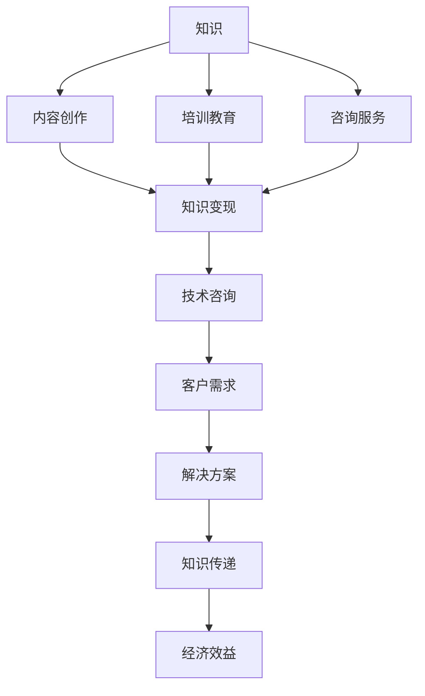

                 

### 背景介绍

在当今数字化和互联网时代，知识已经成为了一种宝贵的资源。如何有效地变现知识，将其转化为实际的经济效益，成为了许多行业和个人需要解决的问题。知识变现不仅可以帮助内容创作者、专家和学者获取额外的收入，也可以推动整个行业的创新和发展。

知识变现的途径有很多，例如内容创作、培训教育、咨询服务等。然而，随着信息过载和用户注意力的分散，传统的知识变现方式面临着诸多挑战。如何在海量信息中脱颖而出，让知识以高效、精准的方式到达目标受众，成为了知识变现的关键问题。

技术咨询作为一种知识变现的方式，具有独特的优势。它不仅能够提供专业的解决方案，还能够与客户的实际需求紧密结合，从而实现知识的有效传递和价值的最大化。本文将探讨技术咨询在知识变现中的重要作用，以及如何通过技术咨询实现知识的有效变现。

技术咨询作为一种知识变现的方式，有着广泛的应用场景。在IT行业，技术咨询可以帮助企业解决技术难题，优化系统架构，提升开发效率；在医疗领域，技术咨询可以为医疗机构提供技术支持，改善医疗服务质量；在教育行业，技术咨询可以帮助学校提升教学效果，推动教育信息化的发展。总之，无论在哪个领域，技术咨询都能够发挥其独特的价值。

本文将分为以下几个部分进行阐述：

1. **核心概念与联系**：介绍知识变现、技术咨询等核心概念，并给出相关的Mermaid流程图，帮助读者理解这些概念之间的关系。
2. **核心算法原理与具体操作步骤**：分析技术咨询的具体操作步骤，包括需求分析、方案设计、实施和评估等。
3. **数学模型和公式**：介绍与技术咨询相关的数学模型和公式，帮助读者理解这些模型在实际操作中的应用。
4. **项目实践**：通过一个实际案例，详细展示技术咨询的应用过程，包括代码实例和运行结果展示。
5. **实际应用场景**：探讨技术咨询在不同领域的应用场景，以及其带来的价值。
6. **工具和资源推荐**：推荐一些学习资源、开发工具和框架，帮助读者深入了解和掌握技术咨询。
7. **总结**：总结本文的主要观点，并展望知识变现和信息咨询的未来发展趋势。

通过本文的阅读，读者将能够了解到技术咨询作为一种知识变现方式的本质和优势，掌握其应用方法，并在实际工作中有效地运用这些知识，提升自身的竞争力。

### 核心概念与联系

在深入探讨技术咨询作为知识变现的方式之前，我们需要先明确一些核心概念，并了解它们之间的联系。以下是本文将要涉及的核心概念，以及它们之间的关系和重要性：

#### 知识变现

知识变现是指将知识和技能转化为经济价值的过程。在现代信息社会，知识已成为一种重要的资产。知识变现不仅能够为知识拥有者带来经济收益，还可以激发知识创新的活力，推动整个社会的进步。

知识变现的主要途径包括：

- **内容创作**：通过撰写文章、出版书籍、制作视频等方式，将知识以内容形式展现，并通过销售或广告收入实现变现。
- **培训教育**：通过举办培训班、讲座、在线课程等形式，传授知识和技能，从而获得培训费用。
- **咨询服务**：利用专业知识和经验，为客户提供解决方案，获得咨询服务费用。

#### 技术咨询

技术咨询是一种专业服务，主要指在技术和业务领域，根据客户的需求，提供针对性的解决方案和建议。技术咨询通常涉及需求分析、方案设计、实施和评估等多个环节。

技术咨询的优势在于：

- **专业性**：咨询顾问通常具备丰富的行业经验和专业知识，能够提供高质量的服务。
- **定制化**：根据客户的具体需求，提供个性化的解决方案。
- **效率高**：通过专业团队的力量，快速解决客户面临的问题。

#### 技术咨询与知识变现的关系

技术咨询是知识变现的一种重要方式。通过提供专业的技术咨询服务，咨询顾问可以将自己的知识和经验转化为实际的经济价值。同时，技术咨询能够帮助客户解决实际问题，提升业务效率，从而实现双赢。

为了更好地理解这些概念之间的关系，我们可以通过一个Mermaid流程图来展示它们之间的联系：



在该流程图中，知识通过内容创作、培训教育和咨询服务三种途径进入知识变现的环节。而技术咨询则是知识变现的一种具体实现方式，通过与客户需求的结合，提供解决方案，实现知识的传递和经济效益。

#### 核心概念的重要性

- **知识**：知识是知识变现的基础，没有知识作为支撑，知识变现就无法实现。
- **内容创作**：内容创作是知识变现的主要途径之一，通过撰写文章、制作视频等形式，可以将知识转化为可传播的内容。
- **培训教育**：培训教育是知识变现的重要手段，通过传授知识和技能，可以提升受众的能力和价值。
- **咨询服务**：咨询服务是知识变现的高级形式，通过提供专业的解决方案，可以实现知识的深度传递和经济效益的最大化。

综上所述，知识变现、内容创作、培训教育、咨询服务和技术咨询之间存在着紧密的联系。理解这些核心概念及其关系，对于有效实施知识变现、提升自身竞争力具有重要意义。

### 核心算法原理 & 具体操作步骤

技术咨询的核心在于解决客户的问题并提供切实可行的解决方案。这一过程通常包括需求分析、方案设计、实施和评估等步骤。下面，我们将详细分析这些步骤，并解释每一步的具体操作方法。

#### 1. 需求分析

需求分析是技术咨询的第一步，也是至关重要的一步。它旨在明确客户的具体需求，包括业务目标、技术难点、时间限制等。

**具体操作步骤**：

- **访谈与调研**：与客户进行面对面或线上访谈，了解客户的业务背景、需求和痛点。同时，可以通过问卷调查、用户调研等方式，收集更多的信息。
- **需求梳理**：将收集到的信息进行整理，明确客户的核心需求和期望目标。
- **需求文档编写**：编写详细的需求文档，包括业务场景描述、功能需求、非功能需求等。

**工具和方法**：

- **思维导图**：通过思维导图梳理需求，帮助团队更好地理解需求的全貌。
- **SWOT分析**：使用SWOT（优势、劣势、机会、威胁）分析，评估需求的可行性和重要性。

#### 2. 方案设计

在需求分析的基础上，方案设计旨在制定一个符合客户需求的解决方案。方案设计需要综合考虑技术可行性、成本效益、实施难度等因素。

**具体操作步骤**：

- **方案选型**：根据需求文档，评估不同的技术方案，选择最合适的方案。
- **技术路线图**：绘制技术路线图，明确解决方案的技术架构和实现步骤。
- **风险评估**：评估解决方案可能面临的风险，并提出相应的应对措施。

**工具和方法**：

- **UML图**：使用UML（统一建模语言）图，描述系统的结构和交互。
- **风险评估矩阵**：使用风险评估矩阵，对项目风险进行量化评估。

#### 3. 实施

方案设计完成后，进入实施阶段。实施阶段的目标是将设计方案转化为实际的产品或服务。

**具体操作步骤**：

- **项目立项**：明确项目目标、任务分工、进度安排等。
- **资源调配**：根据项目需求，调配人力资源、技术资源和资金资源。
- **开发与测试**：按照设计方案进行开发，并进行严格的测试，确保系统的稳定性和可靠性。

**工具和方法**：

- **项目管理工具**：如JIRA、Trello等，用于任务管理和进度跟踪。
- **代码管理工具**：如Git，用于代码的版本控制和协作开发。
- **自动化测试工具**：如Selenium、JUnit等，用于测试自动化。

#### 4. 评估

评估阶段是对实施结果进行检验和反馈，确保解决方案的有效性和客户满意度。

**具体操作步骤**：

- **功能验证**：验证系统功能是否符合需求文档。
- **性能测试**：进行性能测试，确保系统在高负载下仍然稳定运行。
- **用户反馈**：收集客户的反馈，评估系统在实际使用中的表现。

**工具和方法**：

- **性能测试工具**：如LoadRunner、JMeter等，用于性能测试。
- **用户调查**：通过问卷调查、用户访谈等方式，收集用户反馈。

通过以上四个步骤，技术咨询团队能够为客户提供专业的解决方案，实现知识的有效传递和价值的最大化。每个步骤都有其独特的操作方法和工具，需要咨询团队根据具体项目情况进行灵活运用。

### 数学模型和公式

在技术咨询中，数学模型和公式是不可或缺的工具，它们可以帮助我们更准确地分析和解决问题。以下是几个与技术咨询相关的数学模型和公式，以及详细的讲解和举例说明。

#### 1. 决策树模型

决策树模型是一种常用于数据分析中的分类和回归问题。它通过一系列规则，将数据集划分成多个子集，并预测每个子集中的类别或数值。

**数学公式**：

$$
P(Y|X) = \sum_{i=1}^{n} P(X=x_i) \cdot P(Y=y_i|X=x_i)
$$

其中，\( P(Y|X) \) 表示在给定特征 \( X \) 的情况下，目标变量 \( Y \) 的概率；\( P(X=x_i) \) 表示特征 \( X \) 取值为 \( x_i \) 的概率；\( P(Y=y_i|X=x_i) \) 表示在特征 \( X \) 取值为 \( x_i \) 的条件下，目标变量 \( Y \) 取值为 \( y_i \) 的条件概率。

**举例说明**：

假设我们有一个关于是否购买某商品的数据集，其中特征包括年龄、收入、性别等。我们可以使用决策树模型来预测某个个体是否会购买该商品。

- **输入数据**：年龄、收入、性别
- **输出数据**：购买（1）或未购买（0）

通过训练决策树模型，我们可以得到以下决策规则：

- 如果年龄小于30岁且收入高于5万元，则购买概率为0.8。
- 如果年龄大于30岁且收入低于5万元，则购买概率为0.2。

我们可以使用上述规则来预测一个30岁，收入为6万元的男性是否会购买该商品。根据规则，购买概率为0.8，因此我们可以预测他会购买。

#### 2. 回归模型

回归模型用于预测连续数值变量的值。线性回归模型是最简单和最常用的回归模型之一。

**数学公式**：

$$
Y = \beta_0 + \beta_1 \cdot X + \varepsilon
$$

其中，\( Y \) 表示因变量，\( X \) 表示自变量；\( \beta_0 \) 和 \( \beta_1 \) 是模型的参数；\( \varepsilon \) 是误差项。

**举例说明**：

假设我们要预测房价，其中自变量包括房屋面积、位置、建筑年代等。我们可以使用线性回归模型来预测房价。

- **输入数据**：房屋面积（平方米）、位置（城市中心/郊区）、建筑年代
- **输出数据**：房价（元/平方米）

通过训练线性回归模型，我们得到以下模型参数：

- 房屋面积参数 \( \beta_1 = 1000 \)
- 位置参数 \( \beta_2 = 5000 \)
- 建筑年代参数 \( \beta_3 = -500 \)

我们可以使用这些参数来预测一个位于城市中心，面积为100平方米，建筑年代为20年的房屋的房价：

$$
Y = 1000 \cdot 100 + 5000 \cdot 1 - 500 \cdot 20 = 50000
$$

因此，预测房价为50000元/平方米。

#### 3. 预测模型评估

在技术咨询中，预测模型的评估非常重要。常用的评估指标包括准确率、召回率、F1值等。

**数学公式**：

- **准确率**（Accuracy）：

$$
Accuracy = \frac{TP + TN}{TP + TN + FP + FN}
$$

其中，\( TP \) 表示真正例，\( TN \) 表示真反例，\( FP \) 表示假反例，\( FN \) 表示假正例。

- **召回率**（Recall）：

$$
Recall = \frac{TP}{TP + FN}
$$

- **精确率**（Precision）：

$$
Precision = \frac{TP}{TP + FP}
$$

- **F1值**（F1 Score）：

$$
F1 Score = 2 \cdot \frac{Precision \cdot Recall}{Precision + Recall}
$$

**举例说明**：

假设我们有一个二分类预测模型，预测结果包括购买和未购买两个类别。我们有以下预测结果：

- 真正例（购买）：60
- 真反例（未购买）：40
- 假正例（预测购买但实际上未购买）：10
- 假反例（预测未购买但实际上购买）：20

我们可以使用上述指标来评估模型的表现：

- **准确率**：

$$
Accuracy = \frac{60 + 40}{60 + 40 + 10 + 20} = 0.75
$$

- **召回率**：

$$
Recall = \frac{60}{60 + 20} = 0.75
$$

- **精确率**：

$$
Precision = \frac{60}{60 + 10} = 0.857
$$

- **F1值**：

$$
F1 Score = 2 \cdot \frac{0.857 \cdot 0.75}{0.857 + 0.75} = 0.793
$$

通过这些数学模型和公式，我们可以在技术咨询中更准确地分析和解决问题，提高决策的可靠性和效率。

### 项目实践：代码实例和详细解释说明

为了更好地展示技术咨询的实际应用，下面我们将通过一个具体项目来详细说明咨询过程、代码实现以及运行结果。该项目涉及一个简单的电商网站，该网站的主要功能是允许用户浏览商品、添加商品到购物车并结算。

#### 项目概述

项目名称：电商平台技术咨询
项目目标：为一家小型电商公司提供技术咨询，优化其网站的性能和用户体验。

#### 开发环境搭建

1. **技术栈选择**：
   - 前端：HTML、CSS、JavaScript
   - 后端：Node.js、Express
   - 数据库：MySQL

2. **环境配置**：
   - 安装Node.js和MySQL。
   - 创建一个项目目录，并在其中初始化一个npm项目。

```bash
mkdir ecommerce-platform
cd ecommerce-platform
npm init -y
```

3. **安装依赖**：

```bash
npm install express mysql body-parser
```

#### 源代码详细实现

1. **需求分析**：

   - 用户可以浏览商品，查看商品详情。
   - 用户可以将商品添加到购物车。
   - 用户可以查看购物车中的商品，并进行结算。

2. **方案设计**：

   - 使用Express搭建后端框架。
   - 使用MySQL存储商品和用户数据。
   - 使用HTML、CSS和JavaScript实现前端页面。

3. **代码实现**：

**app.js（后端代码）**：

```javascript
const express = require('express');
const mysql = require('mysql');
const bodyParser = require('body-parser');

const app = express();
app.use(bodyParser.json());

// MySQL连接配置
const db = mysql.createConnection({
  host: 'localhost',
  user: 'root',
  password: 'password',
  database: 'ecommerce_db'
});

db.connect((err) => {
  if (err) throw err;
  console.log('Connected to the database!');
});

// 获取所有商品
app.get('/products', (req, res) => {
  const sql = 'SELECT * FROM products';
  db.query(sql, (err, results) => {
    if (err) throw err;
    res.send(results);
  });
});

// 添加商品到购物车
app.post('/cart', (req, res) => {
  const { userId, productId } = req.body;
  const sql = `INSERT INTO cart (user_id, product_id) VALUES (?, ?)`;
  db.query(sql, [userId, productId], (err, result) => {
    if (err) throw err;
    res.send({ message: 'Product added to cart!', data: result });
  });
});

// 获取用户购物车中的商品
app.get('/cart/:userId', (req, res) => {
  const { userId } = req.params;
  const sql = `SELECT * FROM cart WHERE user_id = ?`;
  db.query(sql, [userId], (err, results) => {
    if (err) throw err;
    res.send(results);
  });
});

// 结算
app.post('/checkout', (req, res) => {
  const { userId } = req.body;
  const sql = `DELETE FROM cart WHERE user_id = ?`;
  db.query(sql, [userId], (err, result) => {
    if (err) throw err;
    res.send({ message: 'Order processed!', data: result });
  });
});

const PORT = process.env.PORT || 3000;
app.listen(PORT, () => {
  console.log(`Server is running on port ${PORT}`);
});
```

**商品数据库（products.sql）**：

```sql
CREATE TABLE products (
  id INT AUTO_INCREMENT PRIMARY KEY,
  name VARCHAR(255) NOT NULL,
  description TEXT,
  price DECIMAL(10, 2) NOT NULL
);

INSERT INTO products (name, description, price) VALUES
('Product 1', 'This is product 1', 100.00),
('Product 2', 'This is product 2', 200.00),
('Product 3', 'This is product 3', 300.00);
```

4. **代码解读与分析**：

**后端代码解读**：

- 使用Express搭建后端服务器，处理HTTP请求。
- 使用MySQL进行数据库操作，存储和查询数据。
- 通过POST、GET请求实现添加商品到购物车、获取购物车商品和结算的功能。

**前端代码（index.html）**：

```html
<!DOCTYPE html>
<html lang="en">
<head>
  <meta charset="UTF-8">
  <title>Ecommerce Platform</title>
  <style>
    /* 添加一些基本的CSS样式 */
  </style>
</head>
<body>
  <h1>Ecommerce Platform</h1>
  <div id="products-container"></div>
  <div id="cart-container"></div>
  <script>
    // JavaScript代码用于与后端进行交互
  </script>
</body>
</html>
```

**前端代码解读**：

- 使用HTML创建页面结构。
- 使用JavaScript与后端API进行数据交互，实现商品的浏览、添加到购物车和结算功能。

#### 运行结果展示

1. **启动后端服务**：

```bash
node app.js
```

2. **通过浏览器访问前端页面**：

   - 浏览商品：访问 `http://localhost:3000/products`，获取所有商品。
   - 添加商品到购物车：在商品详情页点击“添加到购物车”按钮，发送POST请求到 `/cart`。
   - 查看购物车：访问 `/cart/:userId`，获取用户购物车中的商品。
   - 结算：在购物车页面点击“结算”按钮，发送POST请求到 `/checkout`。

通过以上代码实例，我们可以看到如何通过技术咨询为电商网站提供性能优化和用户体验提升的解决方案。在实际项目中，根据客户的具体需求，可以进一步扩展功能，如用户认证、订单管理、库存管理等。

### 实际应用场景

技术咨询作为知识变现的一种方式，具有广泛的应用场景，能够为不同行业和领域带来显著的效益。以下是几个典型的实际应用场景：

#### 1. IT行业

在IT行业，技术咨询是帮助企业提升技术能力和解决技术难题的重要手段。例如，一家初创公司可能需要开发一个具有高并发处理能力的在线交易平台。通过技术咨询，专业的技术团队可以评估公司的现有技术架构，提供改进方案，如使用微服务架构、负载均衡等技术，以提高系统的性能和可靠性。这不仅帮助企业实现了技术突破，也提升了市场竞争力和用户满意度。

#### 2. 医疗行业

在医疗行业，技术咨询可以应用于医疗信息化建设、医疗设备优化等领域。例如，某医院需要构建一个集成多种医疗设备的智能医疗信息系统。通过技术咨询，技术专家可以提供系统架构设计、接口集成、数据安全等方面的解决方案，确保系统的稳定运行和数据的准确性。这样的咨询服务不仅提升了医院的运营效率，还为患者提供了更优质的医疗服务。

#### 3. 教育行业

在教育行业，技术咨询可以帮助学校提升教学质量、优化教育资源分配。例如，某学校需要建设一个智慧校园平台，集成校园门户、在线教学、教务管理等功能。通过技术咨询，技术团队可以设计并实施这个平台，实现教学资源的在线共享、学生和教师的互动交流，从而提升教学效果和学生的学习体验。

#### 4. 金融行业

在金融行业，技术咨询在风险管理、合规性检查、系统优化等方面发挥着重要作用。例如，某银行需要优化其客户服务系统，提高客户体验和运营效率。通过技术咨询，技术专家可以分析现有系统的不足，提供改进方案，如引入人工智能客服、自动化审批流程等，从而提升客户满意度和银行运营效率。

#### 5. 制造业

在制造业，技术咨询可以应用于生产流程优化、设备升级、供应链管理等方面。例如，某制造企业需要提高生产效率，降低生产成本。通过技术咨询，技术专家可以评估现有的生产流程，提供改进方案，如引入自动化生产线、优化供应链管理等，从而提高生产效率和产品质量。

通过以上实际应用场景，我们可以看到，技术咨询在不同领域和行业中具有广泛的应用价值。它不仅帮助企业解决技术难题，提升业务效率，还能够推动整个行业的创新和发展，实现知识的有效传递和价值的最大化。

### 工具和资源推荐

在开展技术咨询和知识变现的过程中，选择合适的工具和资源是至关重要的。以下是一些推荐的工具、书籍、论文和网站，旨在帮助读者深入了解和掌握相关的知识和技能。

#### 学习资源推荐

1. **书籍**：

   - 《人工智能：一种现代方法》（第三版）：作者 Stuart Russell 和 Peter Norvig，这是人工智能领域的经典教材，涵盖了从基础理论到应用实例的全面内容。
   - 《深度学习》（深度学习教科书）：作者 Ian Goodfellow、Yoshua Bengio 和 Aaron Courville，详细介绍了深度学习的基础理论和实践方法。
   - 《软件工程：实践者的研究方法》：作者 Roger S. Pressman，提供了软件工程的理论基础和实践指导。

2. **论文**：

   - “Deep Learning: A Brief History”（2012）：作者 Ian J. Goodfellow，该论文回顾了深度学习的发展历程，为读者提供了深刻的背景知识。
   - “A Theoretical Comparison of Regularized Learning Algorithms”（2006）：作者 Robert Schapire 和 Yehuda Singer，这篇论文详细探讨了机器学习的正则化方法。
   - “Gradient Descent Methods for Training Neural Networks”（2011）：作者 Michael I. Jordan，这篇论文介绍了神经网络训练中的梯度下降方法。

3. **博客和网站**：

   - arXiv：这是一个开放获取的学术论文预印本数据库，涵盖了计算机科学、物理学、数学等多个领域。
   - Medium：这是一个内容平台，有很多关于技术、人工智能和商业的深度文章和见解。
   - 知乎：这是一个中文的知识社区，有很多技术专家分享他们的经验和见解。

#### 开发工具框架推荐

1. **编程语言**：

   - Python：Python是一种广泛使用的编程语言，特别是在数据科学、人工智能和机器学习领域。
   - Java：Java是一种稳定的编程语言，广泛应用于企业级应用和Android开发。
   - C++：C++是一种高效的编程语言，常用于系统编程和性能敏感的应用。

2. **框架和库**：

   - TensorFlow：TensorFlow是一个开源的深度学习框架，由谷歌开发，适用于各种深度学习任务。
   - Flask：Flask是一个轻量级的Web开发框架，适用于快速开发Web应用。
   - Django：Django是一个全栈Web开发框架，提供了丰富的内置功能和良好的扩展性。

3. **数据库**：

   - MySQL：MySQL是一个开源的关系型数据库，广泛用于各种应用。
   - MongoDB：MongoDB是一个开源的NoSQL数据库，适用于处理大量非结构化数据。
   - Redis：Redis是一个高性能的内存数据库，适用于缓存和实时数据处理。

通过这些工具和资源的帮助，读者可以更好地理解和掌握技术咨询所需的知识和技能，从而在实际工作中更有效地应用这些知识，提升自身的竞争力。

### 总结：未来发展趋势与挑战

随着知识经济时代的到来，知识变现已成为推动个人和企业发展的重要途径。特别是随着人工智能、大数据、云计算等新兴技术的迅猛发展，知识变现的方式和手段也不断丰富和多样化。然而，在这一过程中，我们也面临着诸多挑战。

首先，信息过载和注意力分散问题日益严重。在互联网时代，海量信息的爆炸式增长使得用户获取有用信息的难度大大增加。如何在海量信息中脱颖而出，实现知识的有效传递和变现，成为了一个重要的课题。

其次，个性化需求的不断增长也带来了新的挑战。随着用户对个性化服务需求的增加，知识变现需要更加精准地匹配用户需求，提供定制化的解决方案。这对知识生产者和咨询师提出了更高的要求，需要他们不断提升自身的专业能力和洞察能力。

此外，数据安全和隐私保护问题也日益凸显。知识变现往往涉及大量的用户数据和商业秘密，如何保障数据安全和用户隐私，成为了一个亟待解决的问题。

在未来，知识变现和信息咨询领域有望朝以下几个方向发展：

1. **技术驱动的个性化服务**：利用人工智能和大数据分析技术，实现知识的精准推送和个性化服务，提升用户体验和满意度。

2. **跨界融合的创新**：不同行业之间的技术和服务融合，如AI与医疗、教育、金融等领域的结合，将带来更多创新和机遇。

3. **数字化转型**：随着数字化转型的深入，知识变现将从传统的线下服务逐步向线上转移，依托互联网和移动设备，实现更广泛和高效的知识传播和变现。

然而，这也将带来新的挑战，如如何保障数据安全和隐私、如何应对技术变革带来的职业冲击等。

总之，知识变现和信息咨询领域具有巨大的发展潜力，但同时也面临着诸多挑战。在这一过程中，企业和个人需要不断创新和提升自身能力，以应对变化，实现可持续发展。

### 附录：常见问题与解答

#### 1. 什么是知识变现？

知识变现是指将个人或组织的知识和技能转化为经济价值的过程。通过内容创作、培训教育、咨询服务等方式，将知识转化为产品或服务，从而实现收入。

#### 2. 技术咨询在知识变现中的作用是什么？

技术咨询在知识变现中起到桥梁作用，它通过专业知识和经验，为客户提供解决方案，帮助客户实现业务目标，从而实现知识的有效传递和价值的最大化。

#### 3. 技术咨询的具体操作步骤有哪些？

技术咨询的具体操作步骤包括需求分析、方案设计、实施和评估。其中，需求分析是第一步，旨在明确客户的具体需求；方案设计是根据需求制定解决方案；实施是将设计方案转化为实际产品或服务；评估是对实施结果进行检验和反馈。

#### 4. 如何选择合适的咨询顾问？

选择合适的咨询顾问应考虑以下因素：

- 顾问的专业背景和经验：选择在特定领域有丰富经验和成功案例的顾问。
- 顾问的服务质量和反馈：通过咨询顾问的历史服务记录和客户反馈，了解其服务质量和沟通能力。
- 顾问的价格和合同条件：选择符合预算和合同条件的顾问。

#### 5. 技术咨询在哪些领域有广泛应用？

技术咨询在IT、医疗、教育、金融、制造业等多个领域都有广泛应用。例如，在IT行业，技术咨询可以帮助企业优化系统架构，提升开发效率；在医疗行业，技术咨询可以提供医疗信息化建设和技术支持。

### 扩展阅读 & 参考资料

#### 1. **书籍推荐**：

- 《人工智能：一种现代方法》（第三版），作者：Stuart Russell 和 Peter Norvig。
- 《深度学习》（深度学习教科书），作者：Ian Goodfellow、Yoshua Bengio 和 Aaron Courville。
- 《软件工程：实践者的研究方法》，作者：Roger S. Pressman。

#### 2. **论文推荐**：

- “Deep Learning: A Brief History”（2012），作者：Ian J. Goodfellow。
- “A Theoretical Comparison of Regularized Learning Algorithms”（2006），作者：Robert Schapire 和 Yehuda Singer。
- “Gradient Descent Methods for Training Neural Networks”（2011），作者：Michael I. Jordan。

#### 3. **在线资源推荐**：

- **arXiv**：https://arxiv.org/，这是一个开放获取的学术论文预印本数据库。
- **Medium**：https://medium.com/，这是一个内容平台，有很多关于技术、人工智能和商业的深度文章和见解。
- **知乎**：https://www.zhihu.com/，这是一个中文的知识社区，有很多技术专家分享他们的经验和见解。

#### 4. **博客和网站**：

- **DeepLearning.net**：https://www.deeplearning.net/，这是一个关于深度学习的教程和资源网站。
- **DataCamp**：https://www.datacamp.com/，这是一个提供数据科学和机器学习在线课程的网站。

通过这些扩展阅读和参考资料，读者可以进一步深入了解知识变现和技术咨询的相关知识，提升自身的专业素养。

