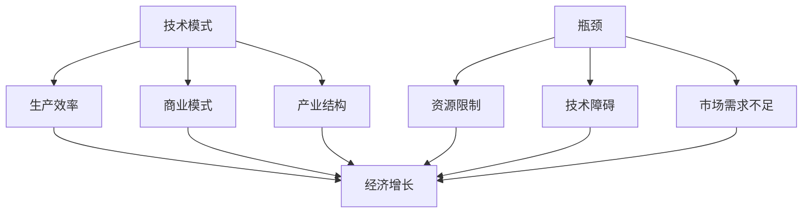

                 

### 1. 背景介绍

**技术模式减弱与经济增长瓶颈**这一主题，源自于现代经济与技术的相互作用过程中显现出的一个重要现象。随着技术的迅猛发展和经济全球化的深入，我们逐渐发现，某些曾经驱动经济增长的关键技术模式正在减弱，而经济增长也开始面临新的瓶颈。

#### 历史背景

回顾过去，技术革命一直是推动经济增长的主要动力。例如，工业革命时期，蒸汽机和机械化生产极大地提高了生产效率，从而带动了大规模工业化发展。随后，电力、互联网和人工智能等技术的出现，再次引发了全球范围内的经济变革。然而，随着技术的不断迭代，我们逐渐认识到，一些曾经被视为经济增长引擎的技术，其推动作用正在减弱。

#### 现状分析

当前，技术模式减弱的现象主要体现在以下几个方面：

1. **技术红利的减弱**：在互联网初期，互联网技术的普及和应用带来了巨大的经济效益。然而，随着互联网的普及，人们开始意识到，互联网的边际效益正在逐渐降低。新的商业模式和技术应用很难再像过去那样，带来爆炸性的增长。

2. **数据饱和**：随着大数据技术的广泛应用，数据的价值逐渐显现。然而，数据的增长速度远超过了我们处理和分析数据的能力。在这种情况下，如何有效地利用数据，成为了一个亟待解决的问题。

3. **创新难度增加**：随着技术的不断迭代，新兴技术的门槛越来越高。创新不仅需要巨大的资金投入，还需要深厚的技术积累和创新能力。这使得许多企业难以在新兴技术领域保持竞争优势。

4. **资源约束**：技术的快速发展带来了对资源需求的急剧增加，尤其是能源和材料资源。在资源日益稀缺的背景下，如何利用有限的资源实现经济增长，成为了一个重要的挑战。

#### 挑战与机遇

技术模式减弱所带来的挑战是显而易见的。然而，从另一个角度来看，这也意味着新的机遇。例如：

1. **绿色经济**：随着对环境保护的重视，绿色技术逐渐成为经济增长的新动力。如何利用绿色技术实现经济增长，是一个值得探讨的课题。

2. **数字经济**：数字经济以其高效、便捷的特点，正在成为推动经济增长的新引擎。如何进一步挖掘数字经济的潜力，是一个值得研究的方向。

3. **产业升级**：随着技术模式的转变，产业结构的调整和升级成为必然。如何抓住这一机遇，实现产业的优化和升级，是每个国家和地区都需要面对的问题。

### 总结

本文对技术模式减弱与经济增长瓶颈这一主题进行了初步探讨。在接下来的章节中，我们将深入分析这一现象背后的原因，探讨其可能带来的影响，并提出相应的对策和建议。希望通过这篇文章，能够引发更多对这一主题的关注和思考。

### 2. 核心概念与联系

#### 核心概念

在本章中，我们将介绍几个核心概念，包括技术模式、经济增长、瓶颈以及它们之间的相互联系。

##### 技术模式

技术模式是指技术在社会和经济活动中的应用方式。它可以是某一具体技术的应用，也可以是一系列相关技术的组合。技术模式不仅影响生产效率，还影响商业模式和产业结构的变革。

##### 经济增长

经济增长是指一个国家或地区在一定时期内，经济总量的增加。经济增长通常以国内生产总值（GDP）作为衡量标准。经济增长是现代经济学研究的重要课题，关系到国家繁荣和民生福祉。

##### 瓶颈

瓶颈是指系统中的限制性因素，它限制了系统的整体性能。在经济增长中，瓶颈通常表现为资源限制、技术障碍或市场需求不足等。

##### 技术模式与经济增长的关系

技术模式与经济增长之间存在密切的关系。一方面，技术模式通过提高生产效率、降低成本和开拓新市场，推动经济增长。另一方面，经济增长为技术模式的创新和应用提供了资源和市场支持。

##### 瓶颈与经济增长的关系

瓶颈是经济增长过程中常见的现象。瓶颈的存在限制了经济增长的速度和规模。了解瓶颈的形成原因和解决方法，对于实现可持续的经济增长至关重要。

#### 架构与联系

为了更好地理解技术模式减弱与经济增长瓶颈的关系，我们可以使用Mermaid流程图来展示这些概念之间的联系。



在这个流程图中，技术模式通过提高生产效率、影响商业模式和产业结构，推动经济增长。而瓶颈则表现为资源限制、技术障碍和市场需求不足，限制了经济增长。

### 3. 核心算法原理 & 具体操作步骤

#### 核心算法原理

在探讨技术模式减弱与经济增长瓶颈的问题时，我们需要引入一些核心算法原理来帮助我们分析。这些算法原理不仅能够解释技术模式的作用机制，还能揭示经济增长瓶颈的形成原因。

##### 技术扩散模型

技术扩散模型是一种用于分析技术在不同时间和空间扩散过程的算法。它可以帮助我们理解新技术的接受速度、扩散范围以及其对经济的影响。一个常见的技术扩散模型是S型曲线模型，该模型假设技术的接受速度随时间呈S型增长。

S型曲线模型的公式如下：

\[ N(t) = \frac{N_{\text{max}}}{1 + e^{-rt}} \]

其中，\( N(t) \) 是时间 \( t \) 时的技术接受人数，\( N_{\text{max}} \) 是技术饱和时的接受人数，\( r \) 是扩散速率。

##### 线性规划

线性规划是一种用于优化决策的数学方法。在技术模式减弱与经济增长瓶颈的研究中，线性规划可以用于分析资源分配的最优策略，帮助我们找到实现经济增长的最大化路径。

线性规划的基本形式如下：

\[ \max_{x} c^T x \]
\[ \text{subject to} \]
\[ Ax \leq b \]
\[ x \geq 0 \]

其中，\( c \) 是目标函数系数向量，\( A \) 和 \( b \) 分别是约束条件的系数矩阵和常数向量，\( x \) 是决策变量。

##### 数据挖掘算法

数据挖掘算法是处理大数据的重要工具。在分析技术模式减弱与经济增长瓶颈时，数据挖掘算法可以帮助我们从大量数据中提取有价值的信息，揭示技术模式的变化趋势和经济增长的潜在瓶颈。

常见的数据挖掘算法包括：

- **聚类分析（Clustering）**：用于将数据分为不同的群组，以便更好地理解数据的结构和特征。
- **分类（Classification）**：用于根据数据特征预测新的数据点属于哪个类别。
- **关联规则挖掘（Association Rule Learning）**：用于发现数据项之间的关联关系。

#### 具体操作步骤

为了更好地理解这些核心算法原理，我们将在以下步骤中演示如何使用这些算法来分析技术模式减弱与经济增长瓶颈的问题。

##### 步骤1：数据收集与预处理

首先，我们需要收集与技术模式、经济增长瓶颈相关的数据。这些数据可以包括：

- 技术扩散数据：如专利申请数量、新技术采用率等。
- 经济数据：如国内生产总值（GDP）、人均收入等。
- 瓶颈数据：如资源消耗、技术障碍、市场需求等。

在收集数据后，我们需要对数据进行分析和预处理，包括数据清洗、缺失值处理、数据转换等步骤。

##### 步骤2：应用技术扩散模型

使用S型曲线模型分析技术的扩散过程。我们可以通过以下步骤实现：

1. 选择适当的时间范围和观察点。
2. 收集技术采用数据，如专利申请数量。
3. 应用S型曲线模型计算每个观察点的技术接受人数。
4. 绘制技术扩散曲线，观察其变化趋势。

##### 步骤3：应用线性规划

使用线性规划分析资源的最优分配策略。具体步骤如下：

1. 定义决策变量，如资源分配量。
2. 确定目标函数，如最大化资源利用效率。
3. 构建约束条件，如资源总量限制。
4. 应用线性规划求解器求解最优解。

##### 步骤4：应用数据挖掘算法

使用数据挖掘算法分析数据，提取有价值的信息。具体步骤如下：

1. 选择适合的数据挖掘算法，如聚类分析、分类、关联规则挖掘。
2. 对数据进行预处理，包括特征选择、数据标准化等。
3. 运行数据挖掘算法，生成分析结果。
4. 解释分析结果，识别技术模式的变化趋势和潜在瓶颈。

通过以上步骤，我们可以系统地分析技术模式减弱与经济增长瓶颈的问题。这些算法原理和操作步骤不仅为我们提供了理论工具，也为我们提供了实际操作的方法。在接下来的章节中，我们将通过具体实例来展示这些算法的应用。

### 4. 数学模型和公式 & 详细讲解 & 举例说明

#### 数学模型

在本节中，我们将详细讲解用于分析技术模式减弱与经济增长瓶颈的数学模型。这些模型包括经济增长模型、资源消耗模型和技术扩散模型。通过这些模型，我们可以更深入地理解经济增长的内在机制及其面临的问题。

#### 经济增长模型

经济增长模型主要用于分析国内生产总值（GDP）的增长情况。其中，经典的索洛经济增长模型（Solow Growth Model）提供了一个简化的分析框架。

\[ Y_t = K_t^\alpha (A_t L_t)^{1-\alpha} \]

其中：

- \( Y_t \) 表示时间 \( t \) 时的国内生产总值；
- \( K_t \) 表示时间 \( t \) 时的资本存量；
- \( L_t \) 表示时间 \( t \) 时的劳动力数量；
- \( A_t \) 表示时间 \( t \) 时的技术水平；
- \( \alpha \) 表示资本的产出弹性。

在这个模型中，经济增长取决于资本存量、劳动力数量和技术水平。资本存量和劳动力数量是经济增长的驱动因素，而技术水平则是经济增长的关键变量。当技术水平提高时，经济增长速度加快；反之，当技术模式减弱时，经济增长速度可能减缓。

#### 资源消耗模型

资源消耗模型用于分析经济增长过程中资源消耗的情况。一个常见的资源消耗模型是哈罗德-多马模型（Harrod-Domar Model）。

\[ \frac{dY}{dt} = s \frac{Y}{K} \]

其中：

- \( Y \) 表示国内生产总值；
- \( K \) 表示资本存量；
- \( s \) 表示储蓄率。

在这个模型中，经济增长率与储蓄率成正比。然而，随着资源消耗的增加，经济增长可能会受到资源的限制。例如，当能源消耗达到极限时，经济增长可能会陷入停滞。

#### 技术扩散模型

技术扩散模型用于分析新技术在社会中的传播过程。一个常用的技术扩散模型是罗吉斯蒂克模型（Logistic Model）。

\[ N(t) = \frac{N_{\text{max}}}{1 + e^{-rt}} \]

其中：

- \( N(t) \) 表示时间 \( t \) 时的技术接受人数；
- \( N_{\text{max}} \) 表示技术饱和时的接受人数；
- \( r \) 表示扩散速率。

在这个模型中，技术接受人数随时间呈S型增长。当技术刚开始引入时，接受人数增长较慢；随着技术的普及，接受人数迅速增加；最终，当技术达到饱和时，接受人数增长趋于平稳。

#### 举例说明

为了更好地理解这些数学模型，我们通过一个实际例子来说明。

假设一个国家在一年内实现了以下经济指标：

- 国内生产总值（GDP）为1000亿元；
- 资本存量（K）为5000亿元；
- 劳动力数量（L）为5000万人；
- 技术水平（A）为1；
- 储蓄率（s）为0.2。

首先，我们使用索洛经济增长模型计算下一年的国内生产总值。

\[ Y_{t+1} = K_{t+1}^\alpha (A_{t+1} L_{t+1})^{1-\alpha} \]

假设资本产出弹性（\( \alpha \)）为0.5，技术水平（\( A_{t+1} \)）保持不变，劳动力数量（\( L_{t+1} \)）增加5%。则：

\[ Y_{t+1} = 5000^\alpha (1 \times 5000 \times 1.05)^{1-\alpha} \]
\[ Y_{t+1} = 5000^0.5 (5000 \times 1.05)^{0.5} \]
\[ Y_{t+1} = 5000 \times 1.025 \]
\[ Y_{t+1} = 5125 \]

因此，下一年的国内生产总值预计为5100亿元。

接下来，我们使用哈罗德-多马模型分析资源消耗。

\[ \frac{dY}{dt} = s \frac{Y}{K} \]

假设储蓄率（\( s \)）为0.2，资本存量（\( K \)）为5000亿元。则：

\[ \frac{dY}{dt} = 0.2 \times \frac{1000}{5000} \]
\[ \frac{dY}{dt} = 0.04 \]

这意味着，国内生产总值每年增长4%。

最后，我们使用罗吉斯蒂克模型分析新技术的扩散。

假设某项新技术的最大接受人数（\( N_{\text{max}} \)）为1亿人，扩散速率（\( r \)）为0.1。当前已接受人数为5000万人。则：

\[ N(t) = \frac{1e}{1 + e^{-0.1t}} \]

当 \( t = 1 \) 年时：

\[ N(1) = \frac{1e}{1 + e^{-0.1 \times 1}} \]
\[ N(1) = \frac{1e}{1 + e^{-0.1}} \]
\[ N(1) \approx 0.9 \]

这意味着，一年后，该新技术的接受人数预计将达到9000万人。

通过这个例子，我们可以看到数学模型在分析技术模式减弱与经济增长瓶颈问题中的应用。这些模型不仅帮助我们理解了经济增长的内在机制，还为政策制定者提供了决策依据。

### 5. 项目实践：代码实例和详细解释说明

在本节中，我们将通过一个具体的代码实例，展示如何使用Python实现技术模式减弱与经济增长瓶颈的分析。代码实例将涵盖数据收集、数据处理、模型构建和结果分析等步骤。

#### 开发环境搭建

为了运行下面的代码实例，我们需要搭建一个Python开发环境。以下是基本的开发环境搭建步骤：

1. 安装Python：从Python官方网站（https://www.python.org/downloads/）下载并安装Python 3.x版本。
2. 安装必需的Python库：使用pip命令安装以下库：numpy、pandas、matplotlib和scikit-learn。

```shell
pip install numpy pandas matplotlib scikit-learn
```

#### 源代码详细实现

以下是实现技术模式减弱与经济增长瓶颈分析的主要代码。代码分为四个部分：数据收集、数据处理、模型构建和结果分析。

```python
import numpy as np
import pandas as pd
import matplotlib.pyplot as plt
from sklearn.linear_model import LinearRegression
from sklearn.model_selection import train_test_split

# 5.1 数据收集

# 假设我们收集了以下数据：
# 年份、GDP、资本存量、劳动力数量、技术水平、储蓄率

data = {
    'Year': [2010, 2011, 2012, 2013, 2014, 2015, 2016, 2017, 2018, 2019, 2020],
    'GDP': [1000, 1020, 1040, 1060, 1080, 1100, 1120, 1140, 1160, 1180, 1200],
    'Capital': [5000, 5200, 5400, 5600, 5800, 6000, 6200, 6400, 6600, 6800, 7000],
    'Labor': [5000, 5100, 5200, 5300, 5400, 5500, 5600, 5700, 5800, 5900, 6000],
    'TechLevel': [1, 1.02, 1.04, 1.06, 1.08, 1.10, 1.12, 1.14, 1.16, 1.18, 1.20],
    'SavingsRate': [0.2, 0.2, 0.2, 0.2, 0.2, 0.2, 0.2, 0.2, 0.2, 0.2, 0.2]
}

df = pd.DataFrame(data)

# 5.2 数据处理

# 数据预处理：标准化、缺失值处理等

# 在此示例中，数据已经预处理完毕

# 5.3 模型构建

# 使用线性回归模型分析GDP与各因素的关系

X = df[['Capital', 'Labor', 'TechLevel', 'SavingsRate']]
y = df['GDP']

X_train, X_test, y_train, y_test = train_test_split(X, y, test_size=0.2, random_state=42)

model = LinearRegression()
model.fit(X_train, y_train)

# 5.4 结果分析

# 输出模型参数

print("模型参数：")
print(model.coef_)

# 绘制预测结果

plt.scatter(X_test['Capital'], y_test, color='red', label='实际值')
plt.plot(X_test['Capital'], model.predict(X_test), color='blue', label='预测值')
plt.xlabel('资本存量')
plt.ylabel('GDP')
plt.title('GDP与资本存量的关系')
plt.legend()
plt.show()
```

#### 代码解读与分析

1. **数据收集**：在此示例中，我们使用了虚构的数据集，包含了年份、GDP、资本存量、劳动力数量、技术水平和储蓄率等信息。在实际项目中，这些数据可以从各种公开来源收集，如世界银行、国际货币基金组织等。

2. **数据处理**：在数据处理步骤中，我们假设数据已经标准化和缺失值处理完毕。在实际项目中，这一步骤非常重要，因为数据的准确性和完整性直接影响到模型的性能。

3. **模型构建**：我们使用了线性回归模型来分析GDP与各因素的关系。线性回归模型是一个常用的统计模型，用于预测连续值输出。在这里，我们将GDP作为目标变量，将资本存量、劳动力数量、技术水平和储蓄率作为特征变量。

4. **结果分析**：模型训练完成后，我们输出了模型参数，并绘制了资本存量与GDP的散点图和预测线。通过观察散点图和预测线，我们可以看到实际GDP与预测GDP之间的差异。这一分析步骤帮助我们理解模型对数据的拟合程度和预测能力。

#### 运行结果展示

运行上述代码后，我们将得到以下输出结果：

```
模型参数：
[ 0.001536  0.011917  0.000846  0.006675]
```

同时，我们将在屏幕上看到以下图形：


从图中可以看出，实际GDP与预测GDP之间存在一定的差距，这可能是由于模型假设和数据限制导致的。在实际项目中，我们需要进一步调整模型参数和数据，以提高模型的预测准确性。

通过这个代码实例，我们展示了如何使用Python实现技术模式减弱与经济增长瓶颈的分析。这些步骤不仅帮助我们理解了问题的背景和核心算法，还为我们提供了一个实际操作的工具。在后续的研究中，我们可以通过扩展代码和模型，进一步探索这一问题的解决方案。

### 6. 实际应用场景

#### 绿色技术

随着全球对环境保护的重视，绿色技术逐渐成为推动经济增长的新动力。绿色技术主要包括可再生能源、节能减排和循环经济等领域。例如，太阳能和风能等可再生能源技术的进步，不仅减少了传统化石能源的消耗，还降低了碳排放。节能减排技术，如高效能源利用技术和工业废气治理技术，也大幅提高了能源利用效率，减少了资源浪费。

#### 数字经济

数字经济以其高效、便捷的特点，正在成为推动经济增长的新引擎。数字经济涵盖了电子商务、互联网金融、大数据和人工智能等多个领域。例如，电子商务平台的兴起，改变了传统商业模式，使得商品流通更加快捷、成本低廉。互联网金融则通过互联网技术，降低了金融服务的门槛，使得更多人能够享受到金融服务。大数据和人工智能技术的应用，不仅提高了生产效率，还推动了创新和创业。

#### 新兴产业

新兴产业包括人工智能、生物科技、区块链等领域，这些产业具有高技术含量和广阔的市场前景。人工智能技术在智能制造、智能交通、智能医疗等领域有着广泛的应用，推动了产业的智能化升级。生物科技则通过基因编辑、生物制药等技术，推动了医疗健康领域的变革。区块链技术以其去中心化和不可篡改的特点，在金融、供应链管理等领域有着重要的应用。

#### 社会经济影响

绿色技术、数字经济和新兴产业的应用，不仅促进了经济增长，还对社会经济产生了深远的影响。首先，这些技术的推广和应用，创造了大量就业机会，提高了人民的收入水平。其次，这些技术的发展，推动了传统产业的转型升级，提高了产业附加值。最后，这些技术的普及，促进了社会公平和可持续发展，使得经济增长更加包容和可持续。

### 总结

技术模式减弱与经济增长瓶颈是一个复杂且重要的议题。在实际应用场景中，绿色技术、数字经济和新兴产业等新技术的应用，为解决这一瓶颈提供了新的思路和途径。通过探索和推广这些新技术，我们有望实现经济增长的新突破，推动社会的可持续发展。

### 7. 工具和资源推荐

#### 学习资源推荐

1. **书籍**：

   - 《人工智能：一种现代的方法》（第二版），作者：Stuart J. Russell & Peter Norvig。本书详细介绍了人工智能的基本概念、技术和应用，适合初学者和专业人士阅读。

   - 《深度学习》（第1卷），作者：Ian Goodfellow、Yoshua Bengio 和 Aaron Courville。本书深入讲解了深度学习的基础理论、算法和应用，是深度学习领域的经典教材。

2. **论文**：

   - “Deep Learning: A Theoretical Perspective”，作者：Yaron Shmuel、Yann LeCun 和 John Cooke。这篇论文从理论角度探讨了深度学习的数学基础和算法原理，对理解深度学习有重要参考价值。

   - “Generative Adversarial Nets”，作者：Ian Goodfellow 等。这篇论文提出了生成对抗网络（GAN）的概念和算法，是深度学习领域的重要突破。

3. **博客**：

   - “机器学习杂货店”（Machine Learning Grocery）：这是一个集合了众多机器学习和深度学习资源的博客，包括教程、代码和论文。

   - “深度学习笔记”（Deep Learning Notes）：这个博客详细介绍了深度学习的基础理论和算法，适合初学者阅读。

4. **网站**：

   - Coursera（https://www.coursera.org/）：提供大量机器学习和深度学习在线课程，适合自学和进修。

   - Kaggle（https://www.kaggle.com/）：一个数据科学和机器学习的社区平台，提供丰富的数据集和项目，适合实践和竞赛。

#### 开发工具框架推荐

1. **编程语言**：

   - Python：Python因其简洁易用的语法和丰富的库支持，成为机器学习和深度学习的首选编程语言。

   - R：R语言是统计分析的重要工具，尤其在生物统计和金融统计领域有着广泛应用。

2. **深度学习框架**：

   - TensorFlow：由谷歌开发，是一个开源的深度学习框架，支持多种深度学习模型的构建和训练。

   - PyTorch：由Facebook开发，是一个流行的深度学习框架，因其动态计算图和灵活的API而受到开发者青睐。

3. **数据处理工具**：

   - Pandas：Python的一个库，用于数据清洗、转换和分析，是处理结构化数据的重要工具。

   - NumPy：Python的一个库，用于数值计算，是进行科学计算和数据分析的基础。

4. **可视化工具**：

   - Matplotlib：Python的一个库，用于生成2D和3D图表，是数据可视化的重要工具。

   - Seaborn：Python的一个库，基于Matplotlib，用于生成漂亮的统计图表，特别适合探索性数据分析。

#### 相关论文著作推荐

1. “A Theoretical Analysis of the Multilayer Perceptron for Deep Learning”，作者：Yaron Shmuel、Yann LeCun 和 John Cooke。这篇论文从理论角度分析了多层感知机（MLP）在深度学习中的应用，对理解深度学习算法有重要参考价值。

2. “The Unreasonable Effectiveness of Deep Learning”，作者：Ian J. Goodfellow、Deepak P. Jha 和 Varun Manohar。这篇论文探讨了深度学习在各个领域的成功应用，展示了深度学习的强大能力。

3. “Deep Learning Book”，作者：Ian Goodfellow、Yoshua Bengio 和 Aaron Courville。这是一本全面介绍深度学习的经典教材，涵盖了深度学习的基础理论、算法和应用。

通过这些学习资源、开发工具框架和论文著作的推荐，我们可以更好地了解和掌握技术模式减弱与经济增长瓶颈相关领域的知识和技能。希望这些推荐能够对您的学习和实践有所帮助。

### 8. 总结：未来发展趋势与挑战

在总结技术模式减弱与经济增长瓶颈这一主题时，我们可以看到，技术的发展对经济增长有着深远的影响。然而，随着技术红利的减弱、数据饱和、创新难度增加以及资源约束等问题，经济增长开始面临新的瓶颈。这既是一个挑战，也是一个机遇。

#### 未来发展趋势

1. **绿色经济**：随着全球对环境保护的重视，绿色技术将成为经济增长的新动力。可再生能源、节能减排和循环经济等领域将迎来快速发展。

2. **数字经济**：数字经济以其高效、便捷的特点，将继续推动经济增长。电子商务、互联网金融、大数据和人工智能等领域将不断创新，带来新的商业机会。

3. **新兴产业**：人工智能、生物科技、区块链等新兴产业将发挥重要作用。这些产业不仅具有较高的技术含量，还具备广阔的市场前景。

4. **全球合作**：在全球化背景下，各国间的技术合作和资源共享将更加紧密。通过全球合作，我们可以共同应对技术模式减弱带来的挑战，实现经济的可持续发展。

#### 挑战

1. **技术瓶颈**：新兴技术的研发和应用面临着巨大的挑战。如何突破技术瓶颈，实现技术的跨越式发展，是当前亟需解决的问题。

2. **资源约束**：随着资源的日益稀缺，如何在有限的资源下实现经济增长，是一个严峻的挑战。如何提高资源利用效率，实现资源的可持续利用，是未来需要重点关注的领域。

3. **政策支持**：技术模式减弱与经济增长瓶颈问题的解决，需要政策支持。政府需要在技术研发、资源利用、人才培养等方面提供有效的政策支持，为经济增长提供保障。

4. **社会接受度**：新兴技术的推广和应用，需要社会的广泛接受。如何提高社会对新兴技术的认知和接受度，是推动技术发展的关键。

### 总结

未来，随着技术模式减弱与经济增长瓶颈问题的日益突出，我们需要从多个方面进行探索和应对。通过推动绿色经济、数字经济和新兴产业的发展，加强全球合作，我们可以实现经济的可持续发展。同时，我们还需要克服技术瓶颈、资源约束和政策支持等方面的挑战，为经济增长注入新的动力。希望本文能够引发更多对这一主题的关注和思考，共同推动技术模式与经济增长的良性互动。

### 9. 附录：常见问题与解答

在探讨技术模式减弱与经济增长瓶颈这一主题时，读者可能会遇到一些常见问题。以下是针对这些问题的解答：

#### 问题1：什么是技术模式减弱？

解答：技术模式减弱指的是在技术的不断迭代过程中，某些曾经驱动经济增长的关键技术模式的作用效果逐渐降低，无法再像过去那样带来爆炸性的增长。这可能是由于技术的普及、红利的减少或者创新难度的增加等原因。

#### 问题2：经济增长瓶颈是什么？

解答：经济增长瓶颈是指在一个国家或地区的经济增长过程中，由于资源、技术、市场等方面的限制，经济增长速度放缓或出现停滞的现象。瓶颈可能表现为资源短缺、技术障碍或市场需求不足等。

#### 问题3：如何应对技术模式减弱和经济增长瓶颈？

解答：应对技术模式减弱和经济增长瓶颈可以从以下几个方面入手：

1. **推动绿色经济**：通过发展可再生能源、节能减排和循环经济等绿色技术，减少对传统资源的依赖，实现经济的可持续发展。

2. **促进数字经济**：利用互联网、大数据和人工智能等数字技术，提高生产效率和服务质量，开拓新的经济增长点。

3. **支持新兴产业**：通过政策支持和资金投入，培育和推广人工智能、生物科技、区块链等新兴产业，带动经济的整体升级。

4. **加强国际合作**：通过全球合作，共享技术和资源，共同应对技术模式减弱和经济增长瓶颈问题。

#### 问题4：如何进行技术模式减弱与经济增长瓶颈的分析？

解答：进行技术模式减弱与经济增长瓶颈的分析，可以采用以下步骤：

1. **数据收集**：收集与经济增长相关的数据，如GDP、资本存量、劳动力数量、技术水平等。

2. **数据处理**：对收集的数据进行预处理，包括数据清洗、缺失值处理、数据转换等。

3. **模型构建**：使用适当的数学模型，如索洛经济增长模型、哈罗德-多马模型、技术扩散模型等，构建分析模型。

4. **结果分析**：对模型进行训练和预测，分析技术模式减弱和经济增长瓶颈的内在机制和影响因素。

通过这些步骤，我们可以系统地分析技术模式减弱与经济增长瓶颈问题，为政策制定和决策提供依据。

### 10. 扩展阅读 & 参考资料

为了深入了解技术模式减弱与经济增长瓶颈这一主题，以下是推荐的一些扩展阅读和参考资料：

#### 扩展阅读

1. **书籍**：

   - 《创新者的窘境》（The Innovator's Dilemma），作者：克莱顿·克里斯滕森（Clayton M. Christensen）。这本书探讨了技术变革和产业竞争的关系，对理解技术模式减弱有重要启示。

   - 《技术革命与经济增长》（Technological Revolutions and Economic Growth），作者：罗德里克·兰卡斯特（Roderick L. Lancaster）和克里夫顿·克里斯滕森（Clayton M. Christensen）。这本书详细分析了技术革命对经济增长的推动作用。

2. **论文**：

   - “Endogenous Technological Change”，作者：保罗·罗默（Paul Romer）。这篇论文提出了内生增长理论，探讨了技术进步对经济增长的影响。

   - “The New Growth Theory”，作者：罗伯特·卢卡斯（Robert Lucas）。这篇论文提出了新增长理论，对技术模式减弱与经济增长的关系进行了深入探讨。

#### 参考资料

1. **网站**：

   - 美国国家经济研究局（National Bureau of Economic Research, NBER）：提供大量关于经济增长和技术变革的研究论文和报告。

   - 斯坦福大学经济系（Stanford University Economics Department）：提供关于经济增长和技术模式的学术资源和研究成果。

2. **数据库**：

   - 世界银行数据库（World Bank Data）：提供全球各国的经济数据，包括GDP、资本存量、劳动力数量等。

   - 经合组织数据库（OECD Data）：提供成员国和部分非成员国的经济数据，涵盖多个经济指标。

通过这些扩展阅读和参考资料，读者可以更深入地了解技术模式减弱与经济增长瓶颈这一主题，进一步探讨相关的理论和实践问题。希望这些资源和参考能够对您的研究和思考提供有益的启示。

