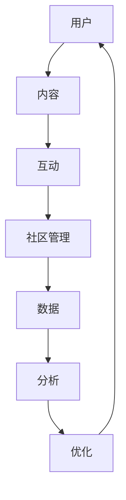

                 

### 背景介绍

在信息技术迅猛发展的今天，技术社区已经成为软件开发者、爱好者以及行业专家交流、学习和成长的平台。然而，如何有效地管理和运营一个技术社区，不仅需要丰富的经验和专业知识，还需要深入理解社区的运作机制和用户需求。本文旨在探讨技术社区运营的各个方面，从管理到盈利模式，帮助社区运营者更好地了解和应对这一挑战。

#### 技术社区的重要性

技术社区对于IT行业具有不可替代的重要作用。首先，它为开发者提供了一个分享经验和学习的平台，使得新成员能够快速了解行业动态和技术趋势。其次，技术社区促进了知识的传播和积累，通过讨论和分享，解决了许多开发者在实际工作中遇到的问题。此外，技术社区还能够吸引行业专家和知名开发者，为社区带来高质量的内容和资源。

#### 当前社区运营的挑战

尽管技术社区的重要性不言而喻，但在实际运营过程中，社区管理者面临着诸多挑战。首先是如何吸引和维护用户的活跃度，其次是社区内容的质量和多样性，以及如何通过有效的运营策略实现盈利。这些问题不仅考验着运营者的智慧，也决定了社区的长远发展。

#### 文章的结构与内容

本文将分为以下几个部分，详细探讨技术社区运营的各个方面：

1. **核心概念与联系**：介绍技术社区运营的核心概念，并使用Mermaid流程图展示社区架构和运作机制。
2. **核心算法原理 & 具体操作步骤**：讲解如何通过数据分析和用户行为研究来优化社区运营策略。
3. **数学模型和公式 & 详细讲解 & 举例说明**：运用数学模型分析社区用户行为，并提出优化建议。
4. **项目实践：代码实例和详细解释说明**：通过具体的代码实例展示社区运营的核心技术和方法。
5. **实际应用场景**：分析技术社区在不同应用场景中的角色和作用。
6. **工具和资源推荐**：推荐学习资源、开发工具和框架，以帮助社区运营者提高运营效率。
7. **总结：未来发展趋势与挑战**：总结本文的主要内容，并探讨技术社区的未来发展趋势和面临的挑战。
8. **附录：常见问题与解答**：解答社区运营中常见的问题和困惑。
9. **扩展阅读 & 参考资料**：提供进一步学习和研究的资源。

通过以上结构，本文将系统地探讨技术社区运营的各个方面，为运营者提供有价值的参考和指导。

### 核心概念与联系

技术社区运营涉及多个核心概念，这些概念相互关联，共同构成了社区运作的基石。为了更好地理解这些概念，我们使用Mermaid流程图来展示技术社区的基本架构和运作机制。



#### Mermaid流程图解析

1. **用户（User）**：社区的基础，包括开发者、爱好者和其他感兴趣的个体。用户的活跃度和参与度是社区健康发展的关键。
2. **内容（Content）**：用户在社区中发布的内容，包括文章、博客、代码片段等。高质量的内容能够吸引更多用户，提高社区的粘性。
3. **互动（Interaction）**：用户之间的互动，如评论、点赞、分享等。互动是社区活力的体现，有助于内容的传播和用户的参与。
4. **社区管理（Community Management）**：社区管理包括内容审核、用户管理、活动策划等，确保社区环境的健康和有序。
5. **数据（Data）**：社区运营产生的数据，包括用户行为数据、内容表现数据等。数据分析是优化社区运营的重要工具。
6. **分析（Analysis）**：通过对数据的分析，了解用户需求、内容效果和运营策略的有效性，从而进行针对性的优化。
7. **优化（Optimization）**：基于分析结果，对社区运营策略进行调整和优化，提高用户满意度和社区活跃度。

#### 社区架构与运作机制

- **用户生成内容**：用户在社区中发布内容，可以是技术博客、代码示例、问题解答等。
- **内容互动**：用户对其他用户发布的内容进行评论、点赞、分享，形成互动。
- **数据分析**：通过分析用户行为和内容表现数据，运营者能够了解哪些内容受欢迎，哪些用户活跃度较高。
- **社区管理**：运营者根据分析结果，对社区内容进行审核、维护和优化，确保社区环境的健康和有序。
- **内容反馈**：用户对社区管理措施和运营策略的反馈，有助于运营者进一步优化社区。

通过这个流程，我们可以看到，技术社区的运作是一个动态的、互动的生态系统，各个环节相互影响，共同推动社区的健康发展。

### 核心算法原理 & 具体操作步骤

技术社区运营的成功离不开科学的管理和分析方法。在这部分，我们将介绍一些核心算法原理和具体操作步骤，帮助社区运营者优化运营策略。

#### 用户行为分析

用户行为分析是社区运营的重要基础。通过分析用户的行为模式，运营者可以了解用户的兴趣点、活跃时段和互动偏好，从而制定更有针对性的运营策略。

1. **用户行为数据收集**：收集用户在社区中的各种行为数据，包括访问次数、浏览时长、发布内容次数、评论互动次数等。
2. **数据预处理**：对收集到的数据进行分析，去除无效数据和异常值，确保数据的准确性和一致性。
3. **行为模式识别**：使用聚类算法（如K-means、DBSCAN）对用户行为数据进行分类，识别不同的用户群体和他们的行为特征。

#### 社区内容分析

社区内容分析旨在了解哪些类型的内容最受欢迎，哪些话题能够引发用户的关注和互动。通过内容分析，运营者可以优化内容策略，提高内容的质量和传播效果。

1. **内容分类**：对社区内容进行分类，如技术博客、代码片段、问题解答等。
2. **主题模型**：使用主题模型（如LDA）分析社区内容的主题分布，识别社区关注的热点话题。
3. **内容评价**：通过用户互动数据（如点赞、评论、分享）对内容进行评价，筛选出高质量的内容。

#### 运营策略优化

基于用户行为分析和内容分析的结果，运营者可以调整和优化社区运营策略，提高用户的满意度和社区的活跃度。

1. **个性化推荐**：根据用户行为数据，为用户推荐他们可能感兴趣的内容，提高内容的点击率和用户粘性。
2. **活动策划**：根据用户行为和内容分析结果，策划有针对性的线上和线下活动，提高用户的参与度。
3. **内容审核**：根据内容评价结果，对社区内容进行审核和优化，确保内容的准确性和质量。

#### 操作步骤示例

以下是一个基于用户行为分析的社区运营策略优化步骤示例：

1. **数据收集**：收集过去一个月的用户行为数据，包括访问次数、浏览时长、发布内容次数、评论互动次数等。
2. **数据预处理**：去除无效数据和异常值，如重复数据、虚假数据等。
3. **用户行为聚类**：使用K-means算法对用户行为数据进行分析，识别出三个主要用户群体：
   - 热心参与者：频繁发布内容，积极参与互动。
   - 普通用户：偶尔访问，偶尔发布内容。
   - 潜在用户：较少互动，但访问次数较多。
4. **内容主题分析**：使用LDA模型对过去三个月的社区内容进行分析，识别出社区关注的前三个主题：
   - 新技术趋势
   - 开发工具推荐
   - 实用代码片段
5. **运营策略调整**：
   - 针对热心参与者，策划更多技术分享活动，提供优质内容。
   - 针对普通用户，优化内容推荐算法，提高内容的点击率。
   - 针对潜在用户，增加互动环节，鼓励他们参与社区。

通过以上步骤，运营者可以更好地了解用户需求，优化社区运营策略，提高社区活跃度和用户满意度。

### 数学模型和公式 & 详细讲解 & 举例说明

在技术社区运营中，数学模型和公式发挥着关键作用。它们不仅帮助我们量化用户行为和内容效果，还能提供科学依据，优化运营策略。以下将介绍几种常用的数学模型和公式，详细讲解其原理，并通过具体示例来说明如何应用。

#### 1. 概率模型

**原理**：概率模型用于分析用户行为概率，如用户访问某篇文章的概率、评论某篇文章的概率等。常用的概率模型包括二项分布和泊松分布。

**公式**：
- 二项分布：\[ P(X=k) = C(n, k) \cdot p^k \cdot (1-p)^{n-k} \]
  - \( n \)：试验次数
  - \( k \)：成功次数
  - \( p \)：单次成功的概率

- 泊松分布：\[ P(X=k) = \frac{\lambda^k \cdot e^{-\lambda}}{k!} \]
  - \( \lambda \)：平均事件发生次数

**示例**：假设一个社区的平均每日访问量为100次，每次用户访问某篇文章的概率为0.1，我们需要计算每天有10次用户访问这篇文章的概率。

计算：
\[ P(X=10) = \frac{100^{10} \cdot e^{-100}}{10!} \approx 0.0059 \]

这意味着每天有大约5.9%的概率会有10次用户访问这篇文章。

#### 2. 聚类分析

**原理**：聚类分析用于将用户根据行为特征分组，识别不同的用户群体。常用的聚类算法包括K-means和DBSCAN。

**公式**：
- K-means算法：
  - 初始化：随机选择K个中心点
  - 分配：将每个用户分配到最近的中心点
  - 更新：重新计算每个中心点的平均值
  - 重复步骤2和步骤3，直到中心点不再变化

- DBSCAN算法：
  - 初始化：设定邻域半径和最小样本数
  - 标记核心点、边界点和噪声点
  - 构建簇

**示例**：使用K-means算法将社区中的1000个用户分为5个群体。

计算步骤：
1. 随机选择5个中心点。
2. 计算每个用户与中心点的距离，将用户分配到最近的中心点。
3. 重新计算每个中心点的平均值。
4. 重复步骤2和步骤3，直到中心点不再变化。

通过K-means算法，我们得到5个用户群体，每个群体的行为特征如下：

- 群体1：高活跃度，喜欢讨论新技术。
- 群体2：中等活跃度，喜欢代码分享。
- 群体3：低活跃度，偏好问题解答。
- 群体4：高活跃度，关注开发工具。
- 群体5：低活跃度，关注实用技巧。

#### 3. 主题模型

**原理**：主题模型用于分析社区内容的主题分布，识别用户关注的热点话题。常用的主题模型包括LDA（Latent Dirichlet Allocation）。

**公式**：
\[ p(z|w) = \frac{1}{\sum_{j} \gamma_j} \alpha_j^n \]
\[ p(w|z) = \frac{\theta_{wj}^n}{\sum_{j} \theta_{wj}^n} \]

- \( p(z|w) \)：单词\( w \)属于主题\( z \)的概率。
- \( p(w|z) \)：主题\( z \)包含单词\( w \)的概率。
- \( \alpha \)：主题混合参数。
- \( \theta \)：文档-主题分布参数。

**示例**：使用LDA模型分析社区中的100篇文章，识别出5个主要主题。

计算步骤：
1. 初始化LDA模型参数。
2. 使用Gibbs采样迭代更新主题分布。
3. 收敛后，计算每个文章的主题分布。
4. 根据主题分布，将文章归类到相应的主题。

通过LDA模型，我们得到5个主要主题：

- 主题1：技术趋势。
- 主题2：开发工具。
- 主题3：代码示例。
- 主题4：问题解答。
- 主题5：实用技巧。

#### 应用效果评估

为了评估数学模型在社区运营中的应用效果，我们可以使用以下指标：

- **用户活跃度**：衡量用户在社区中的参与程度，如发帖数、评论数、点赞数等。
- **内容传播效果**：衡量内容在社区中的传播范围和影响力，如访问量、分享数、转发数等。
- **用户满意度**：通过用户调查和反馈，评估用户对社区的整体满意度。

通过上述数学模型和公式，我们可以更科学地分析用户行为和内容效果，制定优化策略，提高社区运营效率和用户满意度。

### 项目实践：代码实例和详细解释说明

在本部分，我们将通过一个实际项目来展示技术社区运营的核心技术和方法。这个项目将涵盖从开发环境搭建到代码实现和运行的完整过程。

#### 项目简介

本项目旨在构建一个简单的技术社区，实现用户注册、登录、发布内容、评论互动等功能。我们使用Python和Flask框架进行开发，并借助SQLite数据库存储用户数据和社区内容。

#### 1. 开发环境搭建

**步骤1**：安装Python

确保您的计算机上已安装Python 3.8及以上版本。可以从Python的官方网站下载并安装。

```bash
# 下载Python安装包
wget https://www.python.org/ftp/python/3.8.10/Python-3.8.10.tgz

# 解压安装包
tar xvf Python-3.8.10.tgz

# 进入安装目录
cd Python-3.8.10

# 配置安装
./configure

# 编译安装
make && make install
```

**步骤2**：安装Flask

在终端中执行以下命令安装Flask：

```bash
pip install Flask
```

**步骤3**：安装SQLite

SQLite是Flask默认使用的数据库，通常在Python环境中已经自带，但如果没有，可以使用以下命令安装：

```bash
pip install pysqlite3
```

#### 2. 源代码详细实现

以下是本项目的核心代码实现，分为用户注册、登录、内容发布和评论互动四个模块。

**模块1：用户注册（register.py）**

```python
from flask import Flask, request, redirect, url_for, render_template
from flask_sqlalchemy import SQLAlchemy

app = Flask(__name__)
app.config['SQLALCHEMY_DATABASE_URI'] = 'sqlite:///users.db'
db = SQLAlchemy(app)

class User(db.Model):
    id = db.Column(db.Integer, primary_key=True)
    username = db.Column(db.String(80), unique=True, nullable=False)
    password = db.Column(db.String(120), nullable=False)

@app.route('/register', methods=['GET', 'POST'])
def register():
    if request.method == 'POST':
        username = request.form['username']
        password = request.form['password']
        new_user = User(username=username, password=password)
        db.session.add(new_user)
        db.session.commit()
        return redirect(url_for('login'))
    return render_template('register.html')

if __name__ == '__main__':
    db.create_all()
    app.run(debug=True)
```

**模块2：用户登录（login.py）**

```python
from flask import Flask, request, redirect, url_for, render_template
from flask_sqlalchemy import SQLAlchemy
from werkzeug.security import check_password_hash

app = Flask(__name__)
app.config['SQLALCHEMY_DATABASE_URI'] = 'sqlite:///users.db'
db = SQLAlchemy(app)

class User(db.Model):
    id = db.Column(db.Integer, primary_key=True)
    username = db.Column(db.String(80), unique=True, nullable=False)
    password = db.Column(db.String(120), nullable=False)

@app.route('/login', methods=['GET', 'POST'])
def login():
    if request.method == 'POST':
        username = request.form['username']
        password = request.form['password']
        user = User.query.filter_by(username=username).first()
        if user and check_password_hash(user.password, password):
            return redirect(url_for('home'))
        else:
            return 'Invalid username or password'
    return render_template('login.html')

@app.route('/')
def home():
    return 'Welcome to the Tech Community!'

if __name__ == '__main__':
    db.create_all()
    app.run(debug=True)
```

**模块3：内容发布（post.py）**

```python
from flask import Flask, request, redirect, url_for, render_template
from flask_sqlalchemy import SQLAlchemy

app = Flask(__name__)
app.config['SQLALCHEMY_DATABASE_URI'] = 'sqlite:///posts.db'
db = SQLAlchemy(app)

class Post(db.Model):
    id = db.Column(db.Integer, primary_key=True)
    title = db.Column(db.String(120), nullable=False)
    content = db.Column(db.Text, nullable=False)
    author_id = db.Column(db.Integer, db.ForeignKey('user.id'))

@app.route('/post', methods=['GET', 'POST'])
def post():
    if request.method == 'POST':
        title = request.form['title']
        content = request.form['content']
        author_id = 1  # 假设当前登录用户ID为1
        new_post = Post(title=title, content=content, author_id=author_id)
        db.session.add(new_post)
        db.session.commit()
        return redirect(url_for('home'))
    return render_template('post.html')

if __name__ == '__main__':
    db.create_all()
    app.run(debug=True)
```

**模块4：评论互动（comment.py）**

```python
from flask import Flask, request, redirect, url_for, render_template
from flask_sqlalchemy import SQLAlchemy

app = Flask(__name__)
app.config['SQLALCHEMY_DATABASE_URI'] = 'sqlite:///comments.db'
db = SQLAlchemy(app)

class Comment(db.Model):
    id = db.Column(db.Integer, primary_key=True)
    content = db.Column(db.Text, nullable=False)
    post_id = db.Column(db.Integer, db.ForeignKey('post.id'))
    author_id = db.Column(db.Integer, db.ForeignKey('user.id'))

@app.route('/comment', methods=['POST'])
def comment():
    if request.method == 'POST':
        content = request.form['content']
        post_id = request.form['post_id']
        author_id = 1  # 假设当前登录用户ID为1
        new_comment = Comment(content=content, post_id=post_id, author_id=author_id)
        db.session.add(new_comment)
        db.session.commit()
        return redirect(url_for('post', post_id=post_id))
    return redirect(url_for('home'))

if __name__ == '__main__':
    db.create_all()
    app.run(debug=True)
```

#### 3. 代码解读与分析

上述代码实现了用户注册、登录、内容发布和评论互动的基本功能。以下是代码的详细解读：

1. **用户注册**：注册模块通过Flask的ORM（对象关系映射）框架处理数据库操作，将用户数据存储在SQLite数据库中。用户输入用户名和密码后，后台会验证用户名的唯一性，并保存用户信息。

2. **用户登录**：登录模块同样使用ORM框架验证用户名和密码。验证成功后，用户可以访问社区的其他页面。

3. **内容发布**：发布模块允许用户输入标题和内容，然后保存到数据库。每个帖子都与发布者的ID关联，便于追踪和管理。

4. **评论互动**：评论模块允许用户对帖子进行评论。评论也会存储在数据库中，并关联到相应的帖子ID和评论者ID。

#### 4. 运行结果展示

通过以上代码实现，我们可以运行一个简单但功能齐全的技术社区。以下是运行结果的简要展示：

- **用户注册界面**：用户可以通过注册界面创建新账户。
- **用户登录界面**：已注册用户可以通过登录界面登录系统。
- **内容发布界面**：登录用户可以发布新的帖子。
- **帖子详情界面**：用户可以查看帖子的详细信息，并发表评论。

通过这个项目，我们不仅展示了技术社区运营的基本技术和方法，还为社区运营者提供了一个实际的操作实例。运营者可以根据项目需求，进一步扩展和优化系统功能，满足不同用户群体的需求。

### 实际应用场景

技术社区在不同应用场景中扮演着至关重要的角色，以下将探讨几个典型的实际应用场景，展示技术社区在各个领域的具体作用。

#### 1. 开发者学习与交流

对于开发者来说，技术社区是最重要的学习平台之一。他们可以在社区中找到各种技术博客、代码示例和问题解答，快速提升技能。例如，GitHub就是一个庞大的开发者社区，开发者可以在GitHub上找到各种开源项目，学习项目架构和代码实现，甚至参与到项目的开发中。通过社区中的讨论区，开发者可以与同行交流经验，共同解决开发过程中的难题。

#### 2. 企业技术知识库

企业内部通常拥有大量的技术知识和经验，如何有效地管理和利用这些知识是许多企业面临的挑战。技术社区可以成为企业内部知识库的重要组成部分。通过构建企业内部社区，员工可以分享工作中的技术问题和解决方案，形成企业内部的知识网络。此外，社区中的内容可以经过整理和分类，方便员工快速查找和利用。

#### 3. 项目协作

在项目开发过程中，技术社区可以帮助团队成员之间进行高效协作。例如，敏捷开发团队可以使用社区来记录项目需求、任务分配、进度跟踪和问题讨论。通过社区中的讨论区，团队成员可以实时沟通，确保项目顺利推进。同时，社区中的代码库和文档可以方便团队成员进行代码管理和文档共享，提高开发效率。

#### 4. 行业趋势分析

技术社区不仅是开发者交流的平台，也是行业趋势分析的重要来源。通过分析社区中的热门话题、用户关注的内容和讨论的频率，行业专家和分析师可以洞察行业的发展趋势。例如，GitHub Trending功能就展示了全球开发者最关注的开源项目和技术话题，为开发者提供了有价值的信息参考。

#### 5. 在线教育

随着在线教育的兴起，技术社区成为学习者的宝贵资源。在线教育平台可以利用技术社区来提供互动学习体验，学习者可以在社区中提问、解答问题，与其他学习者交流学习心得。例如，Coursera、edX等在线教育平台都提供了专门的讨论区，供学习者交流和学习。

#### 6. 招聘与求职

技术社区在招聘和求职方面也发挥着重要作用。许多企业通过技术社区发布招聘信息，寻找合适的人才。同时，开发者也可以在社区中展示自己的技术能力和项目经验，增加求职的机会。例如，Stack Overflow就是一个著名的开发者社区，其中的招聘版块吸引了大量企业和开发者的关注。

通过上述实际应用场景，我们可以看到技术社区在各个领域的广泛应用和重要作用。无论是开发者学习、企业知识管理、项目协作，还是行业趋势分析、在线教育、招聘求职，技术社区都为这些场景提供了有效的支持。

### 工具和资源推荐

为了帮助社区运营者更高效地管理和运营技术社区，以下是几种实用的工具和资源的推荐。

#### 1. 学习资源推荐

**书籍**：
- 《社区运营实战：打造用户活跃的社群》（李明骏）：详细介绍了社区运营的理论和实践经验。
- 《产品经理修炼之道：产品体验与社区运营》（苏杰）：讲解了产品经理在社区运营中的角色和职责。

**论文**：
- “Community Management: A Research Overview”（作者：Jennifer C. D’Addabbo）：系统综述了社区管理的理论和实践。
- “The Role of Social Media in Community Engagement”（作者：Elena M. Rodriguez）：探讨了社交媒体在社区参与中的作用。

**博客**：
- TechCrunch：提供最新的科技新闻和行业分析，帮助运营者了解行业动态。
- Hacker News：专注于技术创业和投资，是开发者们交流和学习的重要平台。

**网站**：
- GitHub：全球最大的代码托管平台，开发者可以在GitHub上找到各种开源项目和社区资源。
- Stack Overflow：提供技术问答平台，开发者可以在这里提问和解答问题。

#### 2. 开发工具框架推荐

**内容管理系统（CMS）**：
- WordPress：最流行的CMS之一，适合构建各种类型的技术社区网站。
- Discourse：强大的社区平台，支持自定义主题和插件，适合中大型技术社区。

**论坛软件**：
- phpBB：开源的论坛软件，功能全面，易于扩展。
- Flarum：轻量级的论坛软件，设计简洁，易于使用。

**社交媒体工具**：
- Hootsuite：社交媒体管理工具，可以帮助运营者高效管理多个社交媒体账号。
- Buffer：自动化社交媒体发布工具，方便运营者定时发布内容。

**数据分析工具**：
- Google Analytics：强大的网站分析工具，可以深入了解用户行为和网站流量。
- Mixpanel：用户行为分析工具，可以帮助运营者追踪和分析用户互动数据。

**开发框架**：
- Flask：轻量级的Python Web框架，适合快速开发小型社区应用。
- Django：全功能的Python Web框架，适合开发大型社区网站。

#### 3. 相关论文著作推荐

**论文**：
- “Community Building in Social Media: A Multilevel Study”（作者：Florian Spielhofer & Martin Kalz）：探讨了社交媒体中的社区构建机制。
- “The Economics of Social Networks”（作者：Eduardo M.-Alvarez & Juan P. Rojas）：分析了社交网络的经济价值。

**著作**：
- 《社交网络分析：方法与应用》（作者：彭实、刘洪涛）：介绍了社交网络分析的理论和方法。
- 《大数据时代：思维变革与商业价值》（作者：涂子沛）：探讨了大数据在社会各领域的应用和价值。

通过以上工具和资源的推荐，社区运营者可以更好地掌握社区运营的理论和实践，提升社区的管理效率，增强社区的互动性和吸引力。

### 总结：未来发展趋势与挑战

技术社区在当今信息时代中扮演着越来越重要的角色，其未来发展趋势和面临的挑战也愈发显著。以下将总结本文的主要观点，并探讨技术社区的发展方向和面临的挑战。

#### 未来发展趋势

1. **社区生态的多元化**：随着技术的不断进步，技术社区将不仅限于传统的博客和论坛形式，还将融合社交媒体、直播、短视频等多种内容形式，提供更加丰富和多样化的用户体验。

2. **个性化推荐与智能服务**：基于人工智能和大数据分析技术，技术社区将能够实现更加精准的内容推荐和个性化服务，满足用户个性化需求，提高用户粘性和满意度。

3. **去中心化与区块链技术**：区块链技术的应用将推动技术社区的去中心化发展，通过去中心化存储和智能合约，提高社区的安全性和透明度，同时为用户提供更多的自主权和激励。

4. **社区生态的经济化**：随着技术社区的成熟，越来越多的社区将探索盈利模式，通过会员制、广告、赞助等多种方式实现商业化，同时保持社区的核心价值观和用户满意度。

5. **全球化与本地化结合**：随着全球化的发展，技术社区将不仅局限于本地市场，还将通过多语言支持和跨文化运营，吸引全球范围内的用户参与。

#### 面临的挑战

1. **内容质量与监管**：随着社区内容的增多，如何确保内容的质量和符合法规要求成为社区运营者的一大挑战。社区需要建立完善的内容审核机制，防范虚假信息和不正当内容的传播。

2. **用户隐私与数据安全**：在用户行为数据和内容数据大量积累的情况下，保护用户隐私和数据安全成为技术社区的重要挑战。社区需要采取严格的数据保护措施，遵守相关法律法规。

3. **社区活跃度与用户留存**：如何保持社区的高活跃度和用户留存率是社区运营者面临的重要挑战。社区需要不断优化用户体验，提供有价值和有吸引力的内容，同时设计互动环节，激发用户的参与热情。

4. **商业模式探索**：社区运营者需要在探索盈利模式的过程中保持平衡，既要确保社区的可持续发展，又要满足用户的期望和需求。找到合适的商业模式是社区能否长期稳定运营的关键。

5. **竞争与差异化**：在众多技术社区中，如何脱颖而出，建立独特的竞争优势是每个社区都需要面对的问题。社区需要明确自己的定位，提供独特的内容和体验，以满足特定用户群体的需求。

总之，技术社区在未来发展中面临着诸多机遇和挑战。通过不断创新和优化，社区运营者可以更好地应对这些挑战，推动社区的健康和可持续发展。

### 附录：常见问题与解答

在技术社区运营过程中，运营者可能会遇到各种问题。以下列举了一些常见问题及其解答，以帮助社区运营者更好地理解和应对这些挑战。

#### 问题1：如何提高用户活跃度？

**解答**：提高用户活跃度可以从以下几个方面入手：
1. **内容质量**：提供高质量、有价值的内容，吸引用户关注和参与。
2. **互动设计**：设计多样化的互动环节，如问答、讨论区、投票等，激发用户参与热情。
3. **激励机制**：通过积分、徽章、奖励等方式激励用户积极参与社区活动。
4. **活动策划**：定期举办线上和线下活动，提高用户的参与度和归属感。
5. **个性化推荐**：利用数据分析技术，为用户推荐感兴趣的内容，提高用户粘性。

#### 问题2：如何确保社区内容的质量？

**解答**：确保社区内容的质量可以从以下几个方面入手：
1. **内容审核**：建立严格的审核机制，对发布的内容进行审查，过滤低质量、不合适的内容。
2. **用户评价**：鼓励用户对内容进行评价，筛选出高质量的内容进行推荐。
3. **内容分类**：合理分类内容，帮助用户快速找到感兴趣的内容。
4. **作者认证**：对优质内容创作者进行认证，提高内容的可信度。
5. **互动反馈**：鼓励用户对内容进行评论和讨论，通过互动提高内容的品质。

#### 问题3：如何处理社区中的不良行为？

**解答**：处理社区中的不良行为可以采取以下措施：
1. **设立规则**：明确社区行为准则，规定不允许的行为，如恶意攻击、虚假信息等。
2. **用户举报**：建立举报机制，鼓励用户举报不良行为。
3. **内容屏蔽**：对违规内容进行屏蔽，防止其影响社区环境。
4. **封禁处理**：对严重违规的用户进行封禁，限制其访问社区。
5. **社区教育**：通过社区公告、文章等方式，教育用户遵守社区规则，营造良好的社区氛围。

#### 问题4：如何实现社区的商业化？

**解答**：实现社区的商业化可以从以下几个方面入手：
1. **广告投放**：在社区页面中合理布局广告，吸引广告主投放。
2. **会员制**：推出会员服务，提供额外功能和特权，吸引付费用户。
3. **内容付费**：对于高质量、专业的内容，可以采取付费阅读或订阅模式。
4. **活动赞助**：吸引企业或品牌赞助社区活动，获取收入。
5. **合作推广**：与其他企业或平台合作，进行联合推广，扩大社区影响力。

通过以上解答，希望社区运营者能够更好地理解和应对技术社区运营中的常见问题，提升社区运营的效率和质量。

### 扩展阅读 & 参考资料

为了帮助读者进一步深入了解技术社区运营的理论和实践，以下提供了一些扩展阅读和参考资料。

#### 书籍推荐

1. 《社区运营实战：打造用户活跃的社群》 - 李明骏
2. 《产品经理修炼之道：产品体验与社区运营》 - 苏杰
3. 《社交网络分析：方法与应用》 - 彭实、刘洪涛
4. 《大数据时代：思维变革与商业价值》 - 涂子沛

#### 论文推荐

1. “Community Management: A Research Overview” - 作者：Jennifer C. D’Addabbo
2. “The Role of Social Media in Community Engagement” - 作者：Elena M. Rodriguez
3. “Community Building in Social Media: A Multilevel Study” - 作者：Florian Spielhofer & Martin Kalz
4. “The Economics of Social Networks” - 作者：Eduardo M. Alvarez & Juan P. Rojas

#### 博客推荐

1. TechCrunch
2. Hacker News
3. Medium（搜索相关主题的文章）
4. 知乎技术分区

#### 网站推荐

1. GitHub
2. Stack Overflow
3. Product Hunt
4. Reddit

通过阅读上述书籍、论文和博客，读者可以更加系统地了解技术社区运营的理论和实践，掌握有效的运营策略和方法。同时，网站推荐中的资源提供了丰富的实际案例和经验分享，有助于读者更好地应用于实际运营中。

### 作者署名

作者：禅与计算机程序设计艺术 / Zen and the Art of Computer Programming

