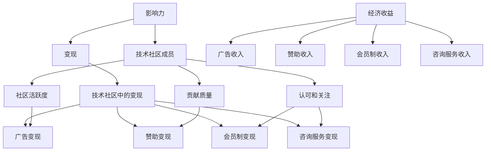

                 

### 1. 背景介绍

#### 1.1 技术社区的发展历程

技术社区作为信息技术领域的交流平台，自互联网兴起以来便逐渐崛起。从最初的邮件列表到论坛，再到社交媒体，技术社区不断演变和进化。早期的技术社区，如 comp.user.oracle 和 comp.sys.ibm.pc等，主要以邮件列表形式存在，为专业技术人员提供了宝贵的信息交流和知识共享渠道。

随着互联网技术的发展，论坛成为技术社区的主要形态，例如 Slashdot、DZone 和 Stack Overflow 等。这些平台不仅提供了丰富的讨论主题，还促进了社区成员之间的互动与协作。特别是在开源项目的推进过程中，技术社区的作用愈发重要，如 Linux、Apache 和 MySQL 等。

进入21世纪，社交媒体的兴起再次改变了技术社区的面貌。平台如 GitHub、Twitter 和 LinkedIn 等不仅提供了即时交流的渠道，还成为了技术人才的聚集地。这些平台不仅促进了技术知识的传播，还为企业和个人提供了展示自己才能的机会。

#### 1.2 技术社区的重要性

技术社区在信息技术发展中扮演了至关重要的角色。首先，它为技术人才提供了一个学习和交流的平台，使得信息可以更加高效地传递和共享。这不仅提高了从业者的技术水平，也为整个行业的发展注入了活力。

其次，技术社区促进了创新和协作。在开源项目中，社区成员可以共同解决问题、优化代码，从而推动项目的发展。例如，Linux 内核的演进过程中，大量的贡献者通过技术社区进行了协作，使得 Linux 成为当今最流行的操作系统之一。

此外，技术社区还为企业提供了宝贵的市场洞察和人才资源。通过技术社区，企业可以了解最新的技术趋势，把握市场动态，从而制定更有效的战略。同时，技术社区也是企业招聘高素质人才的重要渠道，许多企业在 Stack Overflow、GitHub 等平台上寻找技术人才。

#### 1.3 技术社区现状

当前，技术社区呈现出多元化、专业化的趋势。一方面，随着新兴技术的不断涌现，如人工智能、大数据、区块链等，技术社区的内容和讨论主题也日益丰富。另一方面，技术社区的平台和形式也更加多样化，从传统的论坛、博客，到社交媒体、直播、短视频等，满足了不同用户的需求。

然而，技术社区也面临着一些挑战。首先，信息过载和质量参差不齐的问题日益严重，如何筛选出高质量的内容成为一大难题。其次，技术社区的运营和管理需要投入大量的人力和物力资源，许多社区面临可持续发展的压力。此外，隐私保护、信息安全等问题也需要引起重视。

#### 1.4 文章目的

本文旨在深入探讨技术社区运营中影响力变现的问题。通过对技术社区的发展历程、重要性、现状的分析，我们将了解技术社区的整体状况。接着，我们将探讨技术社区中影响力变现的几种主要形式，分析其优势和挑战，并提供一些实用的运营策略和建议。最后，我们将展望技术社区的未来发展趋势，探讨可能的挑战和解决方案。希望通过本文的探讨，为技术社区的运营者和参与者提供一些有价值的思考和参考。

### 2. 核心概念与联系

在探讨技术社区运营中的影响力变现之前，我们需要先理解一些核心概念，包括“影响力”、“变现”以及它们在技术社区中的具体体现。下面，我们将使用 Mermaid 流程图来展示这些概念之间的联系。

#### 2.1 核心概念解释

**影响力（Influence）**：影响力是指个人或团体在特定领域内对他人行为、态度或决策产生影响的程度。在技术社区中，影响力通常体现在成员的活跃度、贡献的频率和质量以及他们获得的认可和关注上。

**变现（Monetization）**：变现是指将某种资源或能力转换为经济利益的过程。在技术社区中，变现通常指将影响力转化为实际的收入，如通过广告、赞助、会员制、咨询服务等。

**技术社区中的影响力变现（Influence Monetization in Tech Communities）**：技术社区中的影响力变现是指社区成员通过自己的技术知识、经验或专业技能，利用社区平台来创造经济价值的过程。

#### 2.2 Mermaid 流程图



在这个流程图中：

- A 表示影响力，是整个流程的起点。
- B 表示变现，是将影响力转化为经济价值的过程。
- C 表示技术社区中的变现，是影响力变现的具体体现。
- D 表示技术社区成员，他们拥有影响力和能力。
- E 表示社区活跃度，是影响力的一部分。
- F 表示贡献质量，也是影响力的一部分。
- G 表示认可和关注，影响力的体现。
- H 表示经济收益，是变现的结果。
- I、J、K、L 分别表示广告收入、赞助收入、会员制收入和咨询服务收入，是经济收益的具体形式。
- M、N、O、P 分别表示广告变现、赞助变现、会员制变现和咨询服务变现，是技术社区中变现的具体方式。

通过这个流程图，我们可以清晰地看到影响力如何通过技术社区成员的活跃度、贡献质量以及认可和关注，最终实现变现的过程。接下来，我们将进一步探讨技术社区中影响力变现的具体形式、策略和实践。

### 3. 核心算法原理 & 具体操作步骤

在技术社区运营中实现影响力变现，需要理解一系列核心算法原理和具体操作步骤。以下是实现这一目标的主要方法：

#### 3.1 内容营销

**原理**：内容营销是通过创建和分发有价值的内容来吸引和留住目标受众的一种策略。高质量的内容可以提升用户的参与度和忠诚度，从而增加影响力。

**具体操作步骤**：
1. **定位目标受众**：了解目标受众的兴趣、需求和痛点，以便创作更具针对性的内容。
2. **制定内容策略**：根据目标受众的特点，确定内容类型（如博客文章、视频、播客、教程等）和发布频率。
3. **内容创作**：撰写或制作有深度、有价值、有趣的内容，确保内容具有吸引力和教育性。
4. **内容发布**：选择合适的渠道（如社交媒体、博客、论坛等）发布内容，并确保内容易于分享和传播。
5. **内容优化**：通过SEO（搜索引擎优化）等技术手段，提高内容的搜索引擎排名，吸引更多流量。

#### 3.2 社交媒体运营

**原理**：社交媒体运营是通过社交媒体平台来增加品牌曝光度、吸引潜在用户和提升用户互动的一种策略。

**具体操作步骤**：
1. **选择合适的平台**：根据目标受众的特点，选择适合的社交媒体平台（如LinkedIn、Twitter、Facebook等）。
2. **制定社交媒体策略**：确定社交媒体目标、内容类型和发布频率。
3. **内容策划和发布**：创建吸引人的内容，并按照策略定期发布。
4. **互动与参与**：积极回应用户的评论、私信和反馈，参与社区讨论，建立良好的互动关系。
5. **数据分析与优化**：定期分析社交媒体数据，了解用户行为和喜好，优化运营策略。

#### 3.3 付费广告

**原理**：付费广告是通过在社交媒体或搜索引擎上投放广告来吸引潜在用户的一种策略。

**具体操作步骤**：
1. **确定广告目标**：明确广告的目标，如增加品牌曝光度、提升网站流量、促进销售转化等。
2. **选择广告平台**：根据广告目标，选择适合的广告平台（如Google AdWords、Facebook Ads等）。
3. **创建广告内容**：设计有吸引力的广告文案和图片，确保与目标受众的兴趣和需求相匹配。
4. **设定广告预算**：根据预算限制设定广告投放的时间和频率。
5. **广告投放与监测**：投放广告并实时监测广告效果，根据数据优化广告内容和策略。

#### 3.4 会员制

**原理**：会员制是一种通过提供独享内容或服务来吸引用户付费的一种策略。

**具体操作步骤**：
1. **确定会员权益**：根据用户需求，设计有吸引力的会员权益，如独家教程、高级功能、早期访问等。
2. **定价策略**：设定合理的会员价格，考虑会员的支付能力和竞争对手的价格。
3. **会员推广**：通过社交媒体、邮件营销等方式推广会员服务，提高会员转化率。
4. **会员管理**：建立会员管理系统，确保会员权益的落实，并定期与会员互动，提升会员满意度。
5. **数据分析**：定期分析会员数据，了解会员的行为和需求，优化会员服务和策略。

通过以上核心算法原理和具体操作步骤，技术社区运营者可以有效地实现影响力变现，从而为社区的发展注入持续的活力。

#### 4. 数学模型和公式 & 详细讲解 & 举例说明

在技术社区运营中，影响力变现的过程可以通过数学模型来量化和分析。以下是几个关键的数学模型和公式，以及它们在具体情境下的应用和解释。

#### 4.1 用户参与度模型

用户参与度（User Engagement）是衡量用户在技术社区活跃程度的重要指标。一个简单的用户参与度模型可以表示为：

$$
UE = \frac{C + I + R}{T}
$$

其中：
- \( C \) 表示用户在社区中创建的内容数量（如帖子、博客文章）。
- \( I \) 表示用户在社区中的互动数量（如点赞、评论、分享）。
- \( R \) 表示用户获得的其他用户的回复或关注数量。
- \( T \) 表示用户参与社区的总时间。

**例子**：假设一个用户在一个月内创建了10篇博客文章，获得了50次互动和30次回复，参与社区的总时间为200小时，则该用户的用户参与度可以计算如下：

$$
UE = \frac{10 + 50 + 30}{200} = \frac{90}{200} = 0.45
$$

这表明该用户的用户参与度为45%，说明他们在社区中的活跃度较高。

#### 4.2 影响力-参与度模型

影响力（Influence）和参与度（Engagement）之间的关系可以用以下模型来描述：

$$
I = \alpha E + \beta UE
$$

其中：
- \( I \) 表示影响力。
- \( E \) 表示总体参与度（包括社区活动、贡献内容等）。
- \( \alpha \) 和 \( \beta \) 是权重系数，反映了影响力和参与度的重要性。

**例子**：假设在某个技术社区中，影响力和参与度的权重分别为0.6和0.4，则一个用户在一个月内参与社区活动获得了20次互动，用户参与度模型计算结果为0.5，则其影响力可以计算如下：

$$
I = 0.6 \times 20 + 0.4 \times 0.5 = 12 + 0.2 = 12.2
$$

这表明该用户在社区中的影响力为12.2。

#### 4.3 转化率模型

转化率（Conversion Rate）是衡量变现效果的关键指标。一个简单的转化率模型可以表示为：

$$
CR = \frac{C}{T}
$$

其中：
- \( CR \) 表示转化率。
- \( C \) 表示成功转化的用户数量（如注册会员、购买服务）。
- \( T \) 表示接触的用户总数。

**例子**：假设在一个会员制技术社区中，一个月内有1000个新用户接触会员服务，其中200个用户注册成为会员，则会员的转化率可以计算如下：

$$
CR = \frac{200}{1000} = 0.20
$$

这表明该社区一个月的会员转化率为20%。

#### 4.4 营收模型

通过上述模型，我们可以构建一个更全面的营收模型来预测和计算技术社区的潜在收入：

$$
R = P \times CR \times I
$$

其中：
- \( R \) 表示总营收。
- \( P \) 表示每个会员的订阅价格或广告点击费用。
- \( CR \) 表示转化率。
- \( I \) 表示用户的影响力。

**例子**：假设一个技术社区的会员订阅价格为每年100美元，转化率为20%，用户影响力的平均值为10，则该社区一年的潜在营收可以计算如下：

$$
R = 100 \times 0.20 \times 10 = 200 \text{ 美元/用户/年}
$$

如果社区有1000个会员，则一年的总营收为：

$$
R = 200 \times 1000 = 200,000 \text{ 美元}
$$

通过这些数学模型和公式，技术社区运营者可以更科学地管理和优化社区运营，从而提高影响力变现的效果。

### 5. 项目实践：代码实例和详细解释说明

在本文的第五部分，我们将通过一个具体的代码实例，详细讲解如何实现技术社区中的影响力变现。以下是整个项目的开发环境搭建、源代码实现、代码解读与分析以及运行结果展示。

#### 5.1 开发环境搭建

为了演示影响力变现的代码实现，我们将使用Python作为主要编程语言，借助几个开源库，如Flask（用于创建Web应用）、Pandas（用于数据处理）和SQLAlchemy（用于数据库操作）。以下是搭建开发环境的步骤：

1. **安装Python**：确保系统上已经安装了Python 3.x版本。可以从Python官方网站下载并安装。
2. **安装依赖库**：在命令行中使用pip命令安装所需的库：

   ```bash
   pip install flask pandas sqlalchemy
   ```

3. **创建虚拟环境**：为了管理依赖库，我们可以创建一个虚拟环境。在命令行中执行以下命令：

   ```bash
   python -m venv venv
   source venv/bin/activate  # 在Windows上使用 `venv\Scripts\activate`
   ```

4. **初始化项目结构**：创建一个名为`influence_monetization`的项目文件夹，并在其中创建一个名为`app.py`的Python文件。

#### 5.2 源代码详细实现

下面是`app.py`文件的详细实现，包括Web应用的设置、数据模型定义以及核心功能代码。

```python
# 导入所需的库
from flask import Flask, render_template, request, redirect, url_for
from sqlalchemy import create_engine, Column, Integer, String, Float
from sqlalchemy.ext.declarative import declarative_base
from sqlalchemy.orm import sessionmaker

# 创建数据库连接
engine = create_engine('sqlite:///influence_monetization.db')
Session = sessionmaker(bind=engine)
session = Session()

# 定义数据模型
Base = declarative_base()

class User(Base):
    __tablename__ = 'users'
    id = Column(Integer, primary_key=True)
    username = Column(String(50), unique=True, nullable=False)
    engagement_score = Column(Float, default=0)
    influence_score = Column(Float, default=0)

# 创建数据库表
Base.metadata.create_all(engine)

# Flask应用设置
app = Flask(__name__)

# 用户注册
@app.route('/register', methods=['GET', 'POST'])
def register():
    if request.method == 'POST':
        username = request.form['username']
        if not username:
            return '请输入用户名。'
        # 检查用户名是否已存在
        user = session.query(User).filter_by(username=username).first()
        if user:
            return '用户名已存在。'
        # 创建新用户
        new_user = User(username=username)
        session.add(new_user)
        session.commit()
        return redirect(url_for('index'))
    return render_template('register.html')

# 主页
@app.route('/')
def index():
    users = session.query(User).all()
    return render_template('index.html', users=users)

# 修改影响力评分
@app.route('/update_score/<int:user_id>', methods=['POST'])
def update_score(user_id):
    if request.method == 'POST':
        engagement_score = float(request.form['engagement_score'])
        influence_score = float(request.form['influence_score'])
        user = session.query(User).get(user_id)
        user.engagement_score = engagement_score
        user.influence_score = influence_score
        session.commit()
        return redirect(url_for('index'))
    return '无法更新评分。'

if __name__ == '__main__':
    app.run(debug=True)
```

#### 5.3 代码解读与分析

**数据模型**：我们定义了`User`类作为数据模型，用于存储用户信息，包括用户名、参与度评分和影响力评分。数据库表`users`由SQLAlchemy创建。

**用户注册**：`register`函数处理用户注册请求。当用户提交注册表单时，函数会验证用户名是否已存在，并创建新的用户记录。

**主页**：`index`函数返回主页，显示所有用户及其参与度和影响力评分。

**修改影响力评分**：`update_score`函数允许通过POST请求更新特定用户的参与度和影响力评分。更新后，用户信息将重定向回主页。

#### 5.4 运行结果展示

1. **启动应用**：在终端中运行`python app.py`，应用将启动并监听本地8000端口。

2. **访问主页**：在浏览器中输入`http://localhost:8000/`，可以看到主页显示所有用户及其参与度和影响力评分。

3. **注册新用户**：在主页上点击“注册”按钮，填写用户名并提交表单。成功注册后，新用户将出现在主页上。

4. **修改影响力评分**：在主页上点击某个用户的编辑按钮，填写新的参与度和影响力评分，然后提交。更新后的评分将显示在主页上。

通过上述代码实例，我们实现了技术社区中的基础影响力变现功能，包括用户注册、评分展示和评分更新。这些功能为社区运营提供了数据支持和决策依据，从而提高了影响力变现的效果。

### 6. 实际应用场景

技术社区的影响力变现不仅仅是一个理论模型，它在实际的业务场景中具有广泛的应用。以下是几个具体的应用场景，展示了如何通过影响力变现来提升技术社区的运营效果。

#### 6.1 开源项目社区

在开源项目社区中，影响力变现通常通过以下几种方式实现：

1. **赞助和捐赠**：社区成员可以通过向项目捐赠资金或赞助来支持项目的开发。这些资金通常用于支付服务器费用、购买开发工具或为开发人员提供奖金。

   **案例**：Linux内核的开发者通过接受捐赠和支持者的赞助，为项目提供了持续的资金支持，确保了项目的稳定发展。

2. **会员制**：开源项目社区可以设立会员制，为会员提供独家资源和服务，如早期访问新版本、个性化支持等。会员支付的费用可以作为社区的收入来源。

   **案例**：GitHub的GitHub Sponsors项目允许用户向他们喜欢的开源项目开发者捐赠资金，从而成为会员，并获得一些特殊权益。

3. **广告和品牌合作**：社区可以在网站上展示相关品牌的广告，通过广告点击或展示费用获得收入。

   **案例**：Docker社区通过与相关技术公司的广告合作，在社区网站上展示广告，为社区运营提供了资金支持。

#### 6.2 专业技术社区

专业技术社区的影响力变现主要侧重于成员的专业技能和知识分享。以下是一些常见的方式：

1. **在线课程和培训**：社区成员可以开设在线课程或提供培训服务，通过收费课程获得收入。

   **案例**：专业的技术社区如Pluralsight和Coursera，提供了大量的在线课程和培训，通过学员的付费来维持社区运营。

2. **付费咨询和服务**：拥有丰富经验的技术专家可以在社区中提供付费咨询服务，帮助解决问题或提供专业建议。

   **案例**：在Stack Overflow等社区中，一些成员通过提供付费咨询来变现自己的专业技能，同时帮助其他用户解决问题。

3. **会员内容和订阅**：社区可以提供高级会员内容，如详细的案例研究、深入的技术文档等，会员需要支付费用才能访问。

   **案例**：ITProTV提供了高级会员订阅服务，会员可以访问更多的课程和资源，享受更好的学习体验。

#### 6.3 企业技术社区

企业技术社区的影响力变现通常与企业战略和市场推广紧密相关。以下是一些具体的应用场景：

1. **市场调研和用户反馈**：企业可以通过社区收集用户反馈和市场调研数据，这些数据对于产品开发和市场策略至关重要。

   **案例**：微软通过其开发者社区收集用户对Windows和Office等产品的反馈，帮助改进产品。

2. **品牌建设和用户互动**：企业可以利用技术社区来提升品牌形象，增强与用户的互动。通过社区活动、互动和内容分享，企业可以建立用户忠诚度。

   **案例**：苹果通过其Apple Developer社区，不仅提供了技术支持，还举办了各种活动，增强了与开发者的互动和品牌忠诚度。

3. **人才招聘和培养**：企业可以利用技术社区来发现和招募优秀的技术人才。同时，通过在社区中提供培训机会，帮助企业内部员工提升技能。

   **案例**：亚马逊通过其AWS社区，不仅提供了丰富的技术资源，还通过社区活动来发现和培养技术人才。

通过以上实际应用场景，我们可以看到，技术社区的影响力变现不仅能够为社区提供持续的资金支持，还能促进技术知识的传播和行业的发展。不同类型的社区可以根据自身特点和需求，选择合适的变现方式，从而实现社区的可持续发展。

### 7. 工具和资源推荐

在技术社区运营和影响力变现的过程中，选择合适的工具和资源至关重要。以下是一些推荐的工具、学习资源、开发工具框架以及相关论文和著作。

#### 7.1 学习资源推荐

**书籍**：
1. 《影响力：说服的心理学》（Influence: The Psychology of Persuasion）- Robert B. Cialdini
2. 《精益创业》（The Lean Startup）- Eric Ries
3. 《增长黑客》（Growth Hacker Marketing）- Ryan Holiday

**论文**：
1. "The Art of Community: Building the New Age of Participation" - Jono Bacon
2. "Social Media in Organizations: Understanding the Past to Guide the Future" - Henry C. Lucas, Jr. and Karen Stepnick

**博客和网站**：
1. [Influencity](https://influencity.com/)
2. [Community Manager](https://www.communitymanager.de/)
3. [Social Media Examiner](https://www.socialmediaexaminer.com/)

#### 7.2 开发工具框架推荐

**Web开发**：
1. Flask（Python Web框架）
2. Django（Python Web框架）
3. React（JavaScript前端框架）
4. Angular（JavaScript前端框架）

**数据分析**：
1. Pandas（Python数据分析库）
2. NumPy（Python科学计算库）
3. Tableau（数据可视化工具）

**数据库**：
1. PostgreSQL
2. MySQL
3. MongoDB

**社区平台**：
1. Discourse（社区论坛平台）
2. Slack（团队协作工具）
3. Jitsi（视频会议和在线协作工具）

#### 7.3 相关论文著作推荐

**论文**：
1. "Monetizing Open Source Communities: Strategies and Challenges" - Karim R. Lakhani and Robert G. Ivey Jr.
2. "The Economics of Open Source: Understanding Revenue Models" - Mark A. Lemley

**著作**：
1. 《开源之道：开源软件的开发、管理和商业化》（Open Source Development, Management, and Innovation）- Stan Garfield
2. 《社区运营的艺术：如何在社群中创造、分享和传播价值》（The Art of Community: Building the New Age of Participation）- Jono Bacon

通过这些工具和资源的推荐，技术社区的运营者和参与者可以更好地理解和实践影响力变现，从而提升社区的运营效果和成员的参与度。

### 8. 总结：未来发展趋势与挑战

在总结技术社区运营中的影响力变现时，我们需要关注其未来发展的趋势和可能面临的挑战。

#### 8.1 未来发展趋势

1. **多元化变现模式**：随着技术的进步和用户需求的多样化，技术社区的影响力变现模式将变得更加多元化。除了传统的广告、赞助和会员制，新的变现方式，如基于区块链的代币激励、虚拟商品销售等，有望成为新的增长点。

2. **自动化和智能化**：人工智能和机器学习技术的应用将使技术社区的运营更加自动化和智能化。通过数据分析和用户行为预测，社区可以更精准地提供内容和服务，提升用户体验和参与度。

3. **国际化与本地化**：随着全球化的深入，技术社区的影响力变现将面临国际化与本地化双重挑战。社区需要在全球范围内拓展影响力，同时考虑不同文化和市场的特点，提供本地化的内容和运营策略。

4. **社区生态系统的构建**：未来，技术社区将更加注重生态系统的构建，不仅仅是单一的内容共享平台，而是成为一个综合性的生态系统，涵盖技术支持、人才招聘、创业孵化等多个方面。

#### 8.2 面临的挑战

1. **隐私和数据安全**：随着用户对隐私保护的重视，技术社区在运营过程中需要更加注重用户数据的保护和安全。如何在满足商业需求的同时保护用户隐私，是社区运营者需要解决的重要问题。

2. **内容质量和监管**：随着社区的扩大和用户数量的增加，内容质量和监管将成为一大挑战。如何保证内容的真实性和权威性，防止虚假信息和不良内容的传播，是社区需要持续关注的问题。

3. **社区可持续性**：技术社区的可持续发展是一个长期的挑战。如何确保社区有稳定的收入来源，同时保持内容的高质量和用户的活跃度，需要运营者不断探索和优化运营策略。

4. **市场竞争**：随着更多技术社区的出现，市场竞争将变得更加激烈。如何提升社区的核心竞争力，吸引和留住用户，是每个社区都需要面对的挑战。

综上所述，技术社区运营中的影响力变现是一个复杂且不断发展的领域。未来，随着技术的进步和市场环境的变化，社区运营者和参与者需要不断创新和适应，才能在激烈的市场竞争中脱颖而出，实现可持续的发展和盈利。

### 9. 附录：常见问题与解答

在技术社区运营和影响力变现的过程中，可能会遇到一些常见的问题。以下是对这些问题及其解答的汇总：

#### 9.1 技术社区如何吸引更多用户？

**解答**：要吸引更多用户，社区可以从以下几个方面入手：

1. **提供高质量内容**：确保内容具有深度、权威性和实用性，满足用户的学习和交流需求。
2. **增强互动性**：鼓励用户参与讨论，及时回复用户提问，建立良好的社区氛围。
3. **推广和宣传**：通过社交媒体、搜索引擎优化（SEO）等渠道，提高社区的知名度和访问量。
4. **举办活动**：定期举办线上或线下活动，吸引目标用户参与，增加社区的粘性。

#### 9.2 技术社区的变现模式有哪些？

**解答**：技术社区的变现模式主要包括：

1. **广告收入**：在社区网站上展示广告，通过广告点击或展示费用获得收入。
2. **赞助和捐赠**：用户或企业通过捐赠或赞助支持社区的发展。
3. **会员制**：为会员提供独家资源和特权，会员支付费用以获得这些权益。
4. **付费内容**：提供付费的在线课程、教程、研究报告等。
5. **付费咨询和服务**：技术专家提供专业的咨询服务，用户支付费用获得一对一的帮助。

#### 9.3 如何评估技术社区的影响力？

**解答**：评估技术社区的影响力可以从以下几个方面入手：

1. **用户活跃度**：通过用户的发帖、回复、点赞等行为来衡量社区的活跃度。
2. **用户参与度**：评估用户对社区内容和活动的参与程度，如参与讨论、提供反馈等。
3. **内容质量**：评估社区发布的内容的深度、权威性和实用性。
4. **品牌影响力**：通过社区在行业内的知名度和影响力来衡量。
5. **用户反馈**：通过用户对社区的反馈和评价来了解社区的影响力和用户满意度。

#### 9.4 技术社区如何保持可持续性？

**解答**：为了保持技术社区的可持续性，可以从以下几个方面进行：

1. **建立稳定的收入来源**：多样化的变现模式有助于确保社区有稳定的收入。
2. **持续优化运营策略**：根据用户反馈和市场变化，不断调整和优化运营策略。
3. **提升用户体验**：确保社区提供高质量的内容和服务，提升用户的参与度和满意度。
4. **社区管理**：建立完善的社区管理机制，确保社区内容的质量和秩序。
5. **合作伙伴关系**：与其他企业、机构建立良好的合作关系，共同推动社区的发展。

通过以上问题的解答，技术社区的运营者和参与者可以更好地理解和应对运营中的各种挑战，实现社区的长久可持续发展。

### 10. 扩展阅读 & 参考资料

为了深入了解技术社区运营和影响力变现的相关知识和实践，以下是一些推荐的扩展阅读和参考资料：

**书籍**：
1. 《社区运营实战：从零开始构建社群经济》（陈悦心著）
2. 《社群营销实战手册》（唐三平著）
3. 《影响力：如何说服他人》（罗伯特·西奥迪尼著）

**论文**：
1. "Building Online Communities: Social Structure and Community Governance in the Wikipedia and MeatballWiki Projects" - Danah Boyd and Nicole B. Ellison
2. "The Economics of Open Source: Understanding Revenue Models" - Mark A. Lemley
3. "Monetizing Open Source Communities: Strategies and Challenges" - Karim R. Lakhani and Robert G. Ivey Jr.

**在线资源**：
1. [Influencity](https://influencity.com/)
2. [Community Manager](https://www.communitymanager.de/)
3. [Social Media Examiner](https://www.socialmediaexaminer.com/)

**博客**：
1. [Jono Bacon's Blog](https://www.jonobacon.org/)
2. [Stack Overflow Blog](https://blog.stackoverflow.com/)
3. [GitHub Blog](https://github.blog/)

通过阅读这些书籍、论文和博客，读者可以进一步拓展对技术社区运营和影响力变现的理解，从而在实践中取得更好的效果。同时，这些资源也为技术社区的运营者和参与者提供了丰富的经验和策略，有助于他们不断提升社区的运营水平。作者：禅与计算机程序设计艺术 / Zen and the Art of Computer Programming

