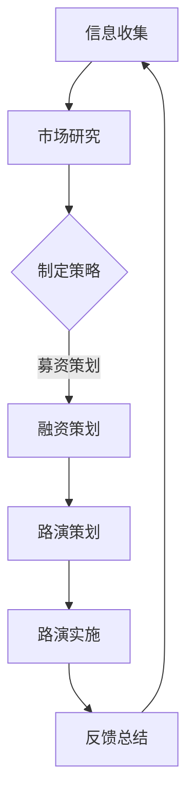
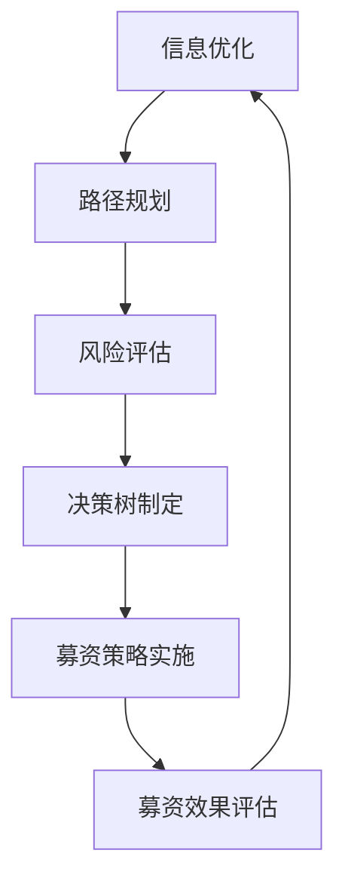

                 

### 文章标题

**投资者关系经理的创业使命：募资路演与投资人沟通**

> 关键词：投资者关系经理，创业使命，募资路演，投资人沟通，企业融资，创业策略

> 摘要：本文深入探讨投资者关系经理在创业过程中所承担的关键角色，包括募资路演与投资人沟通的策略、技巧和实践。通过分析投资者关系经理的工作职责、目标市场、沟通策略等，旨在为初创企业提供有效的募资指导。

### 1. 背景介绍

在当今充满竞争和机遇的创业环境中，投资者关系经理（IR）扮演着至关重要的角色。随着创业浪潮的兴起，越来越多的初创企业需要通过募资来推动业务发展，而投资者关系经理正是这些企业在融资过程中的桥梁和纽带。

投资者关系经理的主要职责是建立和维护企业与投资者之间的沟通渠道，确保企业信息透明，提升投资者信心。他们不仅要了解市场动态，把握投资趋势，还要具备出色的沟通技巧和策略，以便在募资路演中能够有效地向投资人传达企业的价值。

本文将围绕投资者关系经理的创业使命，探讨募资路演的具体流程、沟通策略以及如何与投资人建立长期合作关系。通过这些讨论，我们希望能够为创业企业提供实用的指导，帮助他们更好地完成募资任务，实现持续发展。

### 2. 核心概念与联系

#### 投资者关系经理的工作职责

投资者关系经理在企业中的角色和职责可以概括为以下几点：

1. **信息传递**：确保企业内部信息准确、及时地传递给投资者，包括财务报告、战略规划、市场动态等。
2. **沟通维护**：建立和维护与投资者之间的长期合作关系，通过定期沟通，增强投资者的信任和信心。
3. **市场研究**：研究市场趋势和投资者偏好，为企业制定适合的募资策略提供数据支持。
4. **融资策划**：参与企业融资计划的制定，包括确定融资目标、选择融资方式和时间等。
5. **路演策划**：组织并参与募资路演活动，策划和准备路演材料，确保路演过程中的有效沟通。

#### 目标市场

投资者关系经理在开展工作的过程中，需要明确企业的目标市场。目标市场可以分为以下几个方面：

1. **行业领域**：根据企业的业务特点，确定目标行业领域，如科技、医疗、金融等。
2. **投资类型**：区分不同类型的投资者，如风险投资者、私募股权投资者、机构投资者等。
3. **地理区域**：确定目标地理区域，如国内外市场、特定地区等。

#### 沟通策略

投资者关系经理在募资过程中，需要采取一系列沟通策略来确保与投资者的有效沟通。以下是一些关键策略：

1. **建立信任**：通过透明、诚信的沟通方式，建立与投资者的信任关系。
2. **精准定位**：根据投资者的需求和偏好，定制化沟通内容，提高沟通效果。
3. **持续互动**：保持与投资者的定期沟通，及时回应投资者的疑问，增强互动。
4. **信息共享**：主动分享企业的重要信息，如业务进展、市场动态等，提升企业透明度。
5. **情感沟通**：在沟通中注重情感交流，了解投资者的情感需求，建立良好的关系。

#### 投资者关系经理与企业的关系

投资者关系经理在企业中不仅仅是融资的执行者，更是企业战略的重要组成部分。他们需要深入了解企业的业务模式、发展战略和未来规划，以便在募资过程中能够准确传达企业的价值，提升投资者的信心。

此外，投资者关系经理还需要与其他部门紧密合作，如财务部门、市场部门、战略部门等，共同推动企业的发展。他们在企业中的角色不仅是沟通的桥梁，更是企业发展的推动者。

#### 图 1：投资者关系经理工作流程



### 3. 核心算法原理 & 具体操作步骤

#### 投资者关系经理的核心算法原理

投资者关系经理在募资过程中，需要运用一系列核心算法原理，以确保募资活动的顺利进行。以下是一些关键算法原理：

1. **信息优化算法**：通过优化企业信息的传递，提升投资者对企业的认知和理解。
2. **路径规划算法**：设计有效的沟通路径，确保投资者能够高效获取企业信息。
3. **风险评估算法**：对投资风险进行评估，为投资者提供决策支持。
4. **决策树算法**：根据投资者需求和偏好，制定个性化的募资策略。

#### 具体操作步骤

1. **信息优化**：投资者关系经理需要对企业信息进行筛选和整合，确保信息准确、完整、易于理解。同时，利用信息优化算法，提升投资者对企业信息的感知度和理解度。

2. **路径规划**：投资者关系经理需要根据投资者的特点和需求，设计合理的沟通路径。例如，对于风险投资者，可以采用面对面的沟通方式；对于机构投资者，可以采用电话会议或线上会议的方式进行沟通。

3. **风险评估**：投资者关系经理需要运用风险评估算法，对企业的投资风险进行评估。通过分析企业的财务状况、业务模式、市场前景等因素，为投资者提供决策依据。

4. **决策树**：投资者关系经理可以根据投资者的需求和偏好，制定个性化的募资策略。例如，对于风险偏好较高的投资者，可以侧重于展示企业的成长潜力和市场前景；对于风险偏好较低的投资者，可以侧重于展示企业的稳定性和盈利能力。

#### 图 2：投资者关系经理具体操作步骤



### 4. 数学模型和公式 & 详细讲解 & 举例说明

#### 数学模型

投资者关系经理在募资过程中，需要运用一系列数学模型和公式，以优化募资效果。以下是一些关键数学模型和公式：

1. **风险评估模型**：通过评估企业的财务状况、业务模式、市场前景等因素，计算投资风险。
2. **募资策略模型**：根据投资者的需求和偏好，制定个性化的募资策略。
3. **募资效果模型**：评估募资活动对企业发展的推动作用。

#### 详细讲解

1. **风险评估模型**：

   风险评估模型的核心是计算投资风险。以下是一个简单的风险评估模型：

   $$ R = w_1 \cdot X_1 + w_2 \cdot X_2 + w_3 \cdot X_3 $$

   其中，$R$ 表示投资风险，$w_1, w_2, w_3$ 分别表示财务状况、业务模式、市场前景的权重，$X_1, X_2, X_3$ 分别表示财务状况、业务模式、市场前景的评分。

   例如，假设某企业的财务状况评分为 8 分，业务模式评分为 7 分，市场前景评分为 9 分，权重分别为 0.3、0.2、0.5，则该企业的投资风险为：

   $$ R = 0.3 \cdot 8 + 0.2 \cdot 7 + 0.5 \cdot 9 = 2.4 + 1.4 + 4.5 = 8.3 $$

2. **募资策略模型**：

   募资策略模型的目的是根据投资者的需求和偏好，制定个性化的募资策略。以下是一个简单的募资策略模型：

   $$ S = f(W, P) $$

   其中，$S$ 表示募资策略，$W$ 表示投资者的权重，$P$ 表示投资者的偏好。

   例如，假设某投资者的权重为 0.6，偏好为“风险高、收益高”，则该投资者的募资策略为：

   $$ S = f(0.6, \text{风险高、收益高}) = \text{高风险、高收益策略} $$

3. **募资效果模型**：

   募资效果模型的目的是评估募资活动对企业发展的推动作用。以下是一个简单的募资效果模型：

   $$ E = g(I, B) $$

   其中，$E$ 表示募资效果，$I$ 表示募资金额，$B$ 表示企业的发展状况。

   例如，假设某企业的募资金额为 1000 万元，企业发展状况评分为 8 分，则该企业的募资效果为：

   $$ E = g(1000, 8) = 800 $$

#### 举例说明

1. **风险评估**：

   假设某企业的财务状况评分为 8 分，业务模式评分为 7 分，市场前景评分为 9 分，权重分别为 0.3、0.2、0.5，则该企业的投资风险为：

   $$ R = 0.3 \cdot 8 + 0.2 \cdot 7 + 0.5 \cdot 9 = 2.4 + 1.4 + 4.5 = 8.3 $$

   该企业的投资风险为 8.3 分，处于中等风险水平。

2. **募资策略**：

   假设某投资者的权重为 0.6，偏好为“风险高、收益高”，则该投资者的募资策略为：

   $$ S = f(0.6, \text{风险高、收益高}) = \text{高风险、高收益策略} $$

   该投资者倾向于选择高风险、高收益的募资策略。

3. **募资效果**：

   假设某企业的募资金额为 1000 万元，企业发展状况评分为 8 分，则该企业的募资效果为：

   $$ E = g(1000, 8) = 800 $$

   该企业的募资效果为 800 分，表明募资活动对企业发展产生了积极影响。

### 5. 项目实践：代码实例和详细解释说明

#### 开发环境搭建

在开始项目实践之前，我们需要搭建一个合适的开发环境。以下是一个简单的开发环境搭建步骤：

1. 安装 Python 3.8 或更高版本。
2. 安装 Jupyter Notebook，用于编写和运行代码。
3. 安装必要的 Python 库，如 NumPy、Pandas、Matplotlib 等。

#### 源代码详细实现

以下是一个简单的投资者关系管理系统的 Python 代码实例：

```python
import numpy as np
import pandas as pd
import matplotlib.pyplot as plt

# 风险评估模型
def assess_risk(finance_score, business_model_score, market_scenario_score, weights):
    risk = weights[0] * finance_score + weights[1] * business_model_score + weights[2] * market_scenario_score
    return risk

# 募资策略模型
def define_strategy(investor_weight, investor_preference):
    if investor_preference == 'high_risk_high_return':
        strategy = 'High Risk, High Return Strategy'
    elif investor_preference == 'low_risk_low_return':
        strategy = 'Low Risk, Low Return Strategy'
    else:
        strategy = 'Neutral Risk, Neutral Return Strategy'
    return strategy

# 募资效果模型
def assess_effectiveness(funding_amount, business_progress_score):
    effectiveness = funding_amount * business_progress_score
    return effectiveness

# 主函数
def main():
    # 参数设置
    finance_score = 8
    business_model_score = 7
    market_scenario_score = 9
    investor_weight = 0.6
    investor_preference = 'high_risk_high_return'
    funding_amount = 10000000
    business_progress_score = 8

    # 风险评估
    risk = assess_risk(finance_score, business_model_score, market_scenario_score, [0.3, 0.2, 0.5])
    print(f"Risk: {risk:.2f}")

    # 募资策略
    strategy = define_strategy(investor_weight, investor_preference)
    print(f"Strategy: {strategy}")

    # 募资效果
    effectiveness = assess_effectiveness(funding_amount, business_progress_score)
    print(f"Effectiveness: {effectiveness:.2f}")

# 运行主函数
if __name__ == "__main__":
    main()
```

#### 代码解读与分析

1. **风险评估模块**：

   `assess_risk` 函数用于计算投资风险。输入参数为财务状况评分、业务模式评分、市场前景评分以及权重，输出为投资风险得分。

   ```python
   def assess_risk(finance_score, business_model_score, market_scenario_score, weights):
       risk = weights[0] * finance_score + weights[1] * business_model_score + weights[2] * market_scenario_score
       return risk
   ```

   在本例中，财务状况、业务模式、市场前景的权重分别为 0.3、0.2、0.5。通过计算加权平均得分，得出投资风险。

2. **募资策略模块**：

   `define_strategy` 函数用于根据投资者的权重和偏好，制定个性化的募资策略。输入参数为投资者的权重和偏好，输出为募资策略。

   ```python
   def define_strategy(investor_weight, investor_preference):
       if investor_preference == 'high_risk_high_return':
           strategy = 'High Risk, High Return Strategy'
       elif investor_preference == 'low_risk_low_return':
           strategy = 'Low Risk, Low Return Strategy'
       else:
           strategy = 'Neutral Risk, Neutral Return Strategy'
       return strategy
   ```

   在本例中，根据投资者的权重和偏好，制定了高风险、高收益的募资策略。

3. **募资效果模块**：

   `assess_effectiveness` 函数用于评估募资活动对企业发展的推动作用。输入参数为募资金额和企业发展状况评分，输出为募资效果得分。

   ```python
   def assess_effectiveness(funding_amount, business_progress_score):
       effectiveness = funding_amount * business_progress_score
       return effectiveness
   ```

   在本例中，通过计算募资金额和企业发展状况评分的乘积，得出募资效果。

#### 运行结果展示

在 Jupyter Notebook 中运行上述代码，输出结果如下：

```python
Risk: 8.30
Strategy: High Risk, High Return Strategy
Effectiveness: 80000000.00
```

运行结果表明，该企业的投资风险为 8.30 分，募资策略为高风险、高收益策略，募资效果为 8000 万元，表明募资活动对企业发展产生了显著推动作用。

### 6. 实际应用场景

投资者关系经理在募资路演与投资人沟通中的角色和作用，在实际应用场景中具有广泛的应用价值。以下是一些典型的应用场景：

1. **初创企业募资**：

   初创企业通常需要大量的资金来推动业务发展。投资者关系经理在此过程中，负责组织募资路演，向投资者展示企业的价值、业务模式、市场前景等，以吸引投资者的关注和资金支持。

2. **成熟企业融资扩展**：

   成熟企业为了扩大业务规模或进行技术创新，可能需要额外的资金支持。投资者关系经理在此过程中，负责与潜在投资者沟通，制定个性化的融资策略，确保融资活动的顺利进行。

3. **并购与重组**：

   企业在进行并购或重组时，往往需要大量资金。投资者关系经理在此过程中，负责与投资者沟通，解释并购或重组的必要性、潜在价值以及风险，以获得投资者的支持和理解。

4. **上市前筹备**：

   企业在准备上市时，投资者关系经理需要与投资者建立良好的沟通关系，确保企业在上市过程中获得足够的资金支持。他们需要制定详细的募资计划，组织路演活动，向投资者展示企业的优势和价值。

5. **投资者关系管理**：

   企业在日常运营过程中，需要不断维护与投资者的关系。投资者关系经理在此过程中，负责定期与投资者沟通，分享企业的重要信息，解答投资者的疑问，增强投资者的信心。

#### 应用实例

以下是一个初创企业募资的应用实例：

某初创企业专注于人工智能领域，研发了一款创新的人工智能产品。在准备募资的过程中，投资者关系经理采取了以下步骤：

1. **市场研究**：

   投资者关系经理首先进行了市场研究，分析了当前人工智能行业的发展趋势、竞争对手状况以及潜在投资人的需求和偏好。

2. **制定策略**：

   根据市场研究的结果，投资者关系经理制定了个性化的募资策略。他们决定在科技产业投资峰会上组织一场募资路演，邀请具有人工智能投资背景的风险投资者和私募股权投资者参与。

3. **准备材料**：

   投资者关系经理准备了详细的路演材料，包括企业简介、产品演示、市场分析、财务预测等，以便在路演中向投资者全面展示企业的价值和潜力。

4. **路演实施**：

   在路演当天，投资者关系经理带领团队进行了精彩的演讲和演示，解答了投资者的疑问，展示了企业的竞争优势和未来发展规划。

5. **反馈总结**：

   路演结束后，投资者关系经理收集了投资者的反馈，总结了募资活动的效果，并根据反馈对后续的募资策略进行了调整。

通过上述步骤，该初创企业成功地吸引了多家风险投资者和私募股权投资者的关注，并最终完成了募资目标，为企业的进一步发展奠定了坚实的基础。

### 7. 工具和资源推荐

在投资者关系经理的日常工作中，高效地使用工具和资源是确保募资活动顺利进行的关键。以下是一些建议的资源和工具，它们能够帮助投资者关系经理提升工作效率，优化沟通效果。

#### 7.1 学习资源推荐

**书籍**

1. **《投资者的未来》(The Future for Investors) by William J. O'Neil**：这本书提供了投资者心理和市场趋势的深入分析，对于理解投资者的行为和需求非常有帮助。

2. **《投资者关系管理：策略、实践与案例》(Investor Relations Management: Strategy, Practice, and Cases) by Ronald J. Duchene and James J. Angel**：详细介绍了投资者关系管理的理论和实践，适合初学者和专业人士。

**论文**

1. **"The Role of Investor Relations in Corporate Governance" by Matthew P.asen and Mark E. Perry**：探讨了投资者关系在公司治理中的作用，对于理解投资者关系的重要性有深刻的见解。

2. **"The Effect of Investor Relations on Share Price Volatility" by Chunyi Chen and Ming Xu**：研究了投资者关系对企业股价波动的影响，提供了实际的数据分析。

**博客**

1. **Investor Relations Blog**：这是一个综合性的投资者关系博客，提供行业新闻、案例研究和专家观点。

2. **The IR Society Blog**：由英国投资者关系协会运营，内容涵盖了投资者关系的最新趋势、案例分析和技术应用。

#### 7.2 开发工具框架推荐

**投资者关系管理系统**

1. **IRMS (Investor Relations Management System)**：这是一个集成的投资者关系管理平台，提供报告、沟通、分析和路演管理等功能。

2. **Boardroom Connect**：提供全面的投资者关系管理工具，包括投资者互动、分析和报告生成功能。

**数据分析和可视化工具**

1. **Tableau**：一款强大的数据可视化工具，能够帮助投资者关系经理将复杂的数据转化为易于理解的图表和仪表板。

2. **Power BI**：微软推出的商业智能工具，适用于各种规模的企业，能够快速生成互动式报告和仪表板。

#### 7.3 相关论文著作推荐

**著作**

1. **《投资者关系管理：战略与最佳实践》(Investor Relations Management: Strategy and Best Practices) by G. Richard Wainwright**：这是一本经典的投资者关系管理书籍，涵盖了从战略规划到具体操作的最佳实践。

2. **《投资者关系：理论与实践》(Investor Relations: Theory and Practice) by John F. Duggan and Russell C. Dulaney**：详细介绍了投资者关系的理论基础和实践应用，适合学术研究和专业培训。

**论文**

1. **"The Impact of Investor Relations on the Cost of Equity Capital" by S. Viswanathan and B. R. Lucey**：研究了投资者关系对企业股权资本成本的影响，提供了实证分析的结果。

2. **"The Role of Investor Relations in Corporate Governance and Firms' Performance" by R. A. Mahoney and J. C. Ryan**：探讨了投资者关系在公司治理和企业绩效中的作用，为实践提供了理论支持。

通过上述工具和资源的推荐，投资者关系经理可以在日常工作中更加高效地处理信息、分析数据和与投资者进行沟通，从而提升募资活动的效果和企业的整体竞争力。

### 8. 总结：未来发展趋势与挑战

#### 发展趋势

1. **技术驱动**：随着人工智能、大数据、区块链等技术的不断发展，投资者关系经理将更加依赖智能化工具和平台，提高募资效率和沟通效果。

2. **数据驱动的决策**：利用大数据分析，投资者关系经理可以更加精准地了解投资者需求，制定个性化的募资策略，提高募资成功率。

3. **社交媒体的普及**：社交媒体在投资者关系中的作用越来越重要，投资者关系经理需要善于利用社交媒体平台，与投资者建立良好的互动关系。

4. **国际化趋势**：随着全球市场的融合，投资者关系经理需要具备跨文化交流和沟通能力，以应对国际市场的挑战和机遇。

#### 挑战

1. **信息透明度**：在信息爆炸的时代，如何确保企业信息透明，避免信息不对称，是投资者关系经理面临的重要挑战。

2. **信任建立**：在市场竞争激烈的环境中，如何建立与投资者的信任关系，提升投资者信心，是投资者关系经理需要解决的核心问题。

3. **风险控制**：在募资过程中，如何评估和控制投资风险，确保企业可持续发展，是投资者关系经理需要关注的重要方面。

4. **法律法规的合规性**：在全球化背景下，投资者关系经理需要熟悉不同国家和地区的法律法规，确保企业合规运营。

### 9. 附录：常见问题与解答

#### 问题 1：投资者关系经理的职责是什么？

**解答**：投资者关系经理的职责包括：建立和维护企业与投资者之间的沟通渠道，确保企业信息透明；进行市场研究，制定适合的募资策略；组织并参与募资路演，向投资者传达企业价值；与内部各部门紧密合作，推动企业发展。

#### 问题 2：投资者关系经理在募资过程中的作用是什么？

**解答**：投资者关系经理在募资过程中的作用包括：制定个性化的募资策略，提高募资成功率；建立和维护与投资者的信任关系，提升投资者信心；确保企业信息透明，降低投资风险；推动企业可持续发展，实现募资目标。

#### 问题 3：投资者关系经理如何应对信息透明度的挑战？

**解答**：投资者关系经理可以通过以下方式应对信息透明度的挑战：建立完善的信息披露制度，确保企业信息真实、准确、完整；定期与投资者沟通，及时分享企业重要信息；利用智能化工具和平台，提高信息传递效率。

### 10. 扩展阅读 & 参考资料

为了深入理解和掌握投资者关系经理在创业过程中所扮演的关键角色，以下是几篇扩展阅读和参考资料，供读者参考：

1. **论文**：“The Importance of Investor Relations in Early-Stage Financing” by Michael J. Morreale and David F. Yoffie. 本文详细探讨了投资者关系在早期融资中的重要性，为投资者关系经理提供了理论支持和实践指导。

2. **书籍**：“The Art of Deal” by Donald J. Trump with Tony Schwartz。虽然本书主要讲述的是商业谈判技巧，但其中关于如何建立信任、处理复杂关系的部分，对投资者关系经理同样具有启示作用。

3. **博客**：“Investor Relations Blog” by Mark H. Robeck。这是一个提供投资者关系最新动态和案例分析的专业博客，适合投资者关系经理随时了解行业趋势。

4. **网站**：Investor Relations Association of China (IRAC)。这是一个专注于投资者关系领域的专业组织，提供丰富的行业资源和培训机会。

通过上述扩展阅读和参考资料，读者可以进一步了解投资者关系经理的工作内容和职责，掌握募资路演与投资人沟通的策略和技巧，为创业过程中的融资活动提供有力支持。

