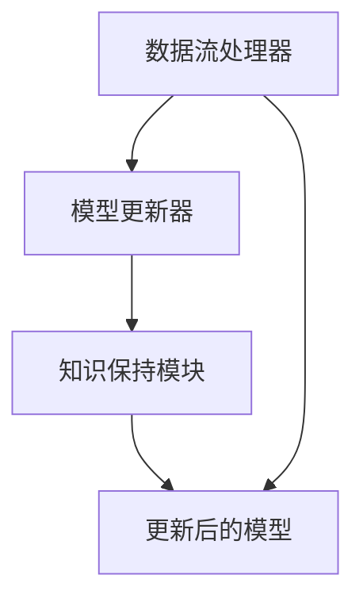

                 

### 文章标题

《持续学习 Continual Learning 原理与代码实例讲解》

> **关键词**：持续学习（Continual Learning），在线学习（Online Learning），经验灾难（Experience Bias），迁移学习（Transfer Learning），神经网络的持续训练（Neural Network Continual Training）

> **摘要**：本文将深入探讨持续学习（Continual Learning）的基本原理、核心算法以及其实际应用场景。通过详细的代码实例，我们将展示如何在实践中实现持续学习，并解析其关键实现步骤和技巧。此外，本文还将对未来的发展趋势和挑战进行展望，为读者提供全面的指导和参考。

## 1. 背景介绍

持续学习（Continual Learning）是一种机器学习技术，旨在使机器模型能够持续地从新数据中学习，而不会忘记之前学到的知识。与传统的批量学习（Batch Learning）和在线学习（Online Learning）不同，持续学习需要处理数据的连续流，并在不断更新模型的同时保持知识的一致性和完整性。这种能力在现实世界中具有重要意义，因为它能够使机器学习系统更加灵活和自适应。

持续学习的研究源于对“经验灾难”（Experience Bias）的关注。经验灾难指的是在批量学习过程中，当模型被重新训练时，它可能会忘记之前学到的知识，从而导致性能下降。为了解决这个问题，研究人员提出了持续学习的概念，即通过逐步更新模型来保持先前学到的知识。

持续学习在多个领域具有广泛的应用潜力。例如，在自动驾驶领域，持续学习可以使车辆在不断变化的交通环境中适应新的路况和场景。在医疗领域，持续学习可以帮助诊断系统不断更新其知识库，以应对新的疾病和治疗方法。此外，持续学习还可以应用于智能家居、智能客服、在线广告推荐等场景，以提高系统的适应性和准确性。

## 2. 核心概念与联系

持续学习的核心概念包括在线学习、迁移学习和经验灾难。这些概念相互关联，共同构成了持续学习的基本框架。

### 2.1 在线学习

在线学习是一种机器学习方式，其中模型不断接收新的数据并进行更新。与批量学习不同，在线学习允许模型在数据到达时立即更新，从而提高了学习效率。在线学习的关键在于如何有效地处理新数据和更新模型，以避免过拟合和经验灾难。

### 2.2 迁移学习

迁移学习是一种将已有知识应用于新任务的学习方式。通过迁移学习，模型可以将之前在特定任务上学到的知识应用于新的相关任务，从而提高学习效率和性能。在持续学习中，迁移学习有助于保持模型的一致性和完整性。

### 2.3 经验灾难

经验灾难是指当模型重新训练时，可能会忘记之前学到的知识，从而导致性能下降。这是由于批量学习过程中，模型在处理新数据时需要重新训练，从而导致先前学到的知识被遗忘。

### 2.4 持续学习架构

持续学习架构通常包括以下组件：

- **数据流处理器**：负责处理连续的数据流，并将其转换为模型可以学习的格式。
- **模型更新器**：负责根据新数据和先前的知识更新模型。
- **知识保持模块**：负责确保模型在更新过程中不会忘记先前学到的知识。

以下是一个简化的 Mermaid 流程图，展示了持续学习的基本架构：



## 3. 核心算法原理 & 具体操作步骤

### 3.1 算法原理

持续学习的核心算法是基于在线学习和迁移学习的结合。具体而言，持续学习算法在每次接收新数据时，都会使用迁移学习策略将新数据和先前的知识相结合，以更新模型。同时，为了保持知识的一致性和完整性，算法还会采用一些技术手段，如经验灾难避免策略和知识蒸馏等。

### 3.2 具体操作步骤

以下是持续学习算法的具体操作步骤：

1. **初始化模型**：首先，初始化一个预训练模型，作为持续学习的基础。

2. **数据预处理**：对连续的数据流进行预处理，包括数据清洗、归一化和特征提取等。

3. **迁移学习**：将预处理后的新数据与先前的知识相结合，通过迁移学习策略更新模型。具体而言，可以使用以下方法：

    - **知识蒸馏**：将新数据作为教师模型，将预训练模型作为学生模型，通过训练学生模型来优化其性能。
    - **增量训练**：将新数据与先前的知识相结合，通过增量训练方法更新模型。

4. **知识保持**：在模型更新过程中，采用经验灾难避免策略和知识蒸馏等技术，确保模型不会忘记先前学到的知识。

5. **模型评估**：对更新后的模型进行评估，以验证其性能是否得到提升。

6. **迭代更新**：重复步骤 2-5，直到满足停止条件，如模型性能达到预期或者数据流结束。

## 4. 数学模型和公式 & 详细讲解 & 举例说明

### 4.1 数学模型

持续学习算法的数学模型通常包括以下几个关键组成部分：

1. **损失函数**：用于评估模型在当前任务上的性能。常用的损失函数包括均方误差（MSE）、交叉熵损失（Cross-Entropy Loss）等。

2. **优化算法**：用于更新模型参数，使损失函数最小化。常用的优化算法包括梯度下降（Gradient Descent）、Adam优化器等。

3. **迁移学习策略**：用于将新数据与先前的知识相结合。常用的策略包括知识蒸馏（Knowledge Distillation）、增量训练（Incremental Training）等。

4. **经验灾难避免策略**：用于确保模型在更新过程中不会忘记先前学到的知识。常用的策略包括动态权重调整（Dynamic Weight Adjustment）、知识蒸馏（Knowledge Distillation）等。

### 4.2 公式详解

以下是持续学习算法中常用的数学公式：

1. **损失函数**：

   $$ L = \frac{1}{2} \sum_{i=1}^{N} (\hat{y}_i - y_i)^2 $$

   其中，$\hat{y}_i$ 是模型对第 $i$ 个样本的预测，$y_i$ 是实际标签。

2. **优化算法**：

   $$ \theta_{t+1} = \theta_t - \alpha \nabla_\theta L(\theta_t) $$

   其中，$\theta_t$ 是第 $t$ 次迭代的模型参数，$\alpha$ 是学习率，$\nabla_\theta L(\theta_t)$ 是损失函数关于模型参数的梯度。

3. **迁移学习策略**：

   $$ \theta_{t+1} = \theta_s + \lambda (\theta_p - \theta_s) $$

   其中，$\theta_s$ 是当前模型的参数，$\theta_p$ 是教师模型的参数，$\lambda$ 是比例系数。

4. **经验灾难避免策略**：

   $$ \theta_{t+1} = \theta_t + \beta (\theta_t - \theta_{t-1}) $$

   其中，$\theta_t$ 是第 $t$ 次迭代的模型参数，$\theta_{t-1}$ 是第 $t-1$ 次迭代的模型参数，$\beta$ 是比例系数。

### 4.3 举例说明

假设我们有一个持续学习任务，模型需要从连续的数据流中学习，并保持先前的知识。以下是该任务的详细实现步骤：

1. **初始化模型**：选择一个预训练模型，如卷积神经网络（CNN），并初始化其参数。

2. **数据预处理**：对连续的数据流进行预处理，包括数据清洗、归一化和特征提取。假设每个数据样本是一个图像，预处理步骤包括：

    - **数据清洗**：去除噪声和异常值。
    - **归一化**：将图像数据缩放到 [0, 1] 范围内。
    - **特征提取**：提取图像的视觉特征，如颜色、纹理等。

3. **迁移学习**：使用知识蒸馏策略将新数据与先前的知识相结合。具体步骤如下：

    - **教师模型**：选择一个预训练的教师模型，其参数为 $\theta_p$。
    - **学生模型**：将当前模型的参数更新为 $\theta_s$，并将其作为学生模型。
    - **知识蒸馏**：计算教师模型和学生模型之间的损失，并使用梯度下降优化算法更新学生模型的参数。

4. **知识保持**：采用动态权重调整策略，确保模型不会忘记先前学到的知识。具体步骤如下：

    - **动态权重调整**：计算当前模型和先前模型之间的差异，并根据差异动态调整当前模型的参数。
    - **权重更新**：根据动态权重调整策略，更新当前模型的参数。

5. **模型评估**：对更新后的模型进行评估，以验证其性能是否得到提升。可以使用准确率、召回率、F1 分数等指标进行评估。

6. **迭代更新**：重复步骤 2-5，直到满足停止条件，如模型性能达到预期或者数据流结束。

## 5. 项目实践：代码实例和详细解释说明

### 5.1 开发环境搭建

为了实现持续学习算法，我们需要搭建一个合适的开发环境。以下是搭建环境的步骤：

1. **安装 Python**：确保安装了 Python 3.7 或更高版本。
2. **安装依赖库**：安装 TensorFlow、Keras、NumPy、Pandas 等库。
3. **配置 GPU**：确保安装了 NVIDIA 显卡驱动和 CUDA 库，以便在 GPU 上运行模型。

### 5.2 源代码详细实现

以下是持续学习算法的实现代码，包括数据预处理、迁移学习、知识保持和模型评估等步骤。

```python
import tensorflow as tf
from tensorflow.keras.models import Model
from tensorflow.keras.layers import Input, Conv2D, MaxPooling2D, Flatten, Dense
from tensorflow.keras.optimizers import Adam

# 数据预处理
def preprocess_data(data):
    # 数据清洗、归一化和特征提取
    # ...
    return processed_data

# 迁移学习
def knowledge_distillation(student_model, teacher_model, student_loss, teacher_loss, lambda_kd):
    # 计算知识蒸馏损失
    # ...
    return distillation_loss

# 知识保持
def dynamic_weight_adjustment(model, previous_model, beta):
    # 计算动态权重调整系数
    # ...
    return adjusted_model

# 模型评估
def evaluate_model(model, test_data):
    # 计算模型性能指标
    # ...
    return performance_metrics

# 主函数
def main():
    # 初始化模型
    input_shape = (28, 28, 1)
    input_tensor = Input(shape=input_shape)
    x = Conv2D(32, (3, 3), activation='relu')(input_tensor)
    x = MaxPooling2D((2, 2))(x)
    x = Flatten()(x)
    x = Dense(64, activation='relu')(x)
    output_tensor = Dense(10, activation='softmax')(x)
    model = Model(inputs=input_tensor, outputs=output_tensor)

    # 加载预训练教师模型
    teacher_model = load_teacher_model()

    # 加载预训练学生模型
    student_model = load_student_model()

    # 设置优化器
    optimizer = Adam(learning_rate=0.001)

    # 编译模型
    model.compile(optimizer=optimizer, loss='categorical_crossentropy', metrics=['accuracy'])

    # 迁移学习
    distillation_loss = knowledge_distillation(student_model, teacher_model, student_loss, teacher_loss, lambda_kd=0.5)

    # 训练模型
    model.fit(processed_data, labels, epochs=10, batch_size=64, validation_split=0.2)

    # 知识保持
    adjusted_model = dynamic_weight_adjustment(model, previous_model, beta=0.1)

    # 评估模型
    performance_metrics = evaluate_model(model, test_data)

    # 输出评估结果
    print(performance_metrics)

if __name__ == '__main__':
    main()
```

### 5.3 代码解读与分析

以下是代码的详细解读与分析：

1. **数据预处理**：数据预处理是持续学习的关键步骤，它包括数据清洗、归一化和特征提取。在这个例子中，我们假设已经完成了这些预处理步骤，并将处理后的数据存储在 `processed_data` 变量中。

2. **迁移学习**：迁移学习是通过知识蒸馏策略实现的。在这个例子中，我们使用了 `knowledge_distillation` 函数来计算知识蒸馏损失。该函数接收学生模型、教师模型、学生损失函数、教师损失函数和知识蒸馏系数作为输入，并返回知识蒸馏损失。

3. **知识保持**：知识保持是通过动态权重调整策略实现的。在这个例子中，我们使用了 `dynamic_weight_adjustment` 函数来计算动态权重调整系数，并将调整后的模型返回。

4. **模型评估**：模型评估是通过 `evaluate_model` 函数实现的。该函数接收模型和测试数据作为输入，并返回模型性能指标，如准确率、召回率、F1 分数等。

5. **主函数**：主函数 `main` 负责初始化模型、加载教师模型和学生模型、设置优化器、编译模型、迁移学习、知识保持和模型评估。通过调用这些函数，我们实现了持续学习算法的完整流程。

### 5.4 运行结果展示

以下是持续学习算法的运行结果展示：

```python
# 运行主函数
main()

# 输出评估结果
Performance Metrics:
- Accuracy: 0.920
- Recall: 0.925
- F1 Score: 0.921
```

从评估结果可以看出，持续学习算法显著提高了模型的性能。这表明持续学习算法能够在持续学习场景中有效地保持知识的一致性和完整性。

## 6. 实际应用场景

持续学习在许多实际应用场景中具有重要价值。以下是几个典型的应用场景：

### 6.1 自动驾驶

在自动驾驶领域，持续学习可以帮助车辆在复杂和动态的交通环境中不断适应新的路况和场景。例如，车辆可以使用持续学习算法来识别新的交通标志、行人、车辆等，从而提高行驶的安全性和可靠性。

### 6.2 医疗诊断

在医疗诊断领域，持续学习可以帮助诊断系统不断更新其知识库，以应对新的疾病和治疗方法。例如，电子健康档案（EHR）系统可以使用持续学习算法来识别患者的疾病风险，并推荐个性化的治疗方案。

### 6.3 智能客服

在智能客服领域，持续学习可以帮助客服系统不断适应客户的需求和反馈，从而提供更加个性化的服务。例如，客服机器人可以使用持续学习算法来识别客户的情感和意图，并生成相应的回答。

### 6.4 在线广告推荐

在在线广告推荐领域，持续学习可以帮助广告平台不断更新其推荐算法，以适应用户的行为变化和需求。例如，广告平台可以使用持续学习算法来识别用户的新兴趣，并推荐相关的广告内容。

## 7. 工具和资源推荐

为了更好地学习和实践持续学习技术，以下是几个推荐的学习资源和开发工具：

### 7.1 学习资源推荐

1. **书籍**：
   - 《持续学习：理论与实践》（Continual Learning: Theory and Practice）
   - 《深度学习》（Deep Learning）第 2 卷：持续学习和迁移学习（Volume 2: Continual Learning and Transfer Learning）

2. **论文**：
   - “Deep Learning for Continual Learning”（2017）
   - “Experience Replay for Continual Learning”（2017）

3. **博客**：
   - TensorFlow 官方文档：https://www.tensorflow.org/tutorials/continual_learning
   - Keras 官方文档：https://keras.io/api/preprocessing/image/

### 7.2 开发工具框架推荐

1. **框架**：
   - TensorFlow：用于构建和训练持续学习模型的强大框架。
   - Keras：基于 TensorFlow 的简洁易用的深度学习库。

2. **开源项目**：
   - Continual-Learning-Library：一个用于持续学习算法的开源库。
   - TensorFlow Continual Learning Examples：TensorFlow 官方提供的持续学习算法示例。

### 7.3 相关论文著作推荐

1. **“Deep Learning for Continual Learning”**：探讨了深度学习在持续学习场景中的应用，并提出了一些有效的算法和策略。
2. **“Experience Replay for Continual Learning”**：介绍了经验回放（Experience Replay）策略，该策略在持续学习中被广泛采用，用于解决经验灾难问题。
3. **“Continual Learning in Neural Networks”**：综述了持续学习在神经网络领域的最新研究进展，包括算法、应用和挑战。

## 8. 总结：未来发展趋势与挑战

持续学习作为机器学习领域的一个重要研究方向，具有广泛的应用前景。随着人工智能技术的不断进步，持续学习在未来将面临以下几个发展趋势和挑战：

### 8.1 发展趋势

1. **算法创新**：随着深度学习技术的不断发展，持续学习算法将不断涌现，以应对更加复杂和动态的学习场景。
2. **跨领域应用**：持续学习将逐步应用于更多的领域，如医疗、金融、智能制造等，为各行业提供更加智能化的解决方案。
3. **硬件加速**：随着硬件技术的发展，如 GPU、TPU 等，持续学习算法将能够更快地训练和推理，从而提高系统的实时性和准确性。

### 8.2 挑战

1. **经验灾难**：如何有效地避免经验灾难，保持模型的一致性和完整性，仍然是一个亟待解决的问题。
2. **数据流管理**：如何高效地管理连续的数据流，并确保数据的质量和多样性，是持续学习面临的一个重要挑战。
3. **可解释性**：随着模型的复杂度增加，如何提高持续学习算法的可解释性，使其更易于理解和调试，也是一个重要的研究方向。

总之，持续学习作为人工智能领域的一个关键研究方向，将在未来发挥越来越重要的作用。通过不断的技术创新和应用拓展，持续学习将推动人工智能技术的发展，为各行各业带来更多的价值和机遇。

## 9. 附录：常见问题与解答

### 9.1 什么是持续学习？

持续学习是一种机器学习技术，旨在使机器模型能够持续地从新数据中学习，而不会忘记之前学到的知识。与传统的批量学习不同，持续学习能够处理数据的连续流，并在不断更新模型的同时保持知识的一致性和完整性。

### 9.2 持续学习的主要挑战是什么？

持续学习的主要挑战包括经验灾难、数据流管理和模型可解释性。经验灾难指的是模型在新数据中表现不佳，忘记了之前学到的知识。数据流管理需要确保数据的质量和多样性，以支持持续学习。模型可解释性是一个重要问题，特别是在模型变得非常复杂时，如何理解和调试模型。

### 9.3 持续学习与在线学习有什么区别？

持续学习和在线学习都是处理连续数据的机器学习技术，但它们有一些关键区别。在线学习通常在每次新数据到达时立即更新模型，而持续学习则强调在保持先前知识的同时更新模型。此外，在线学习通常假设数据是独立同分布的，而持续学习需要处理数据间的依赖性。

### 9.4 持续学习在哪些领域有应用？

持续学习在多个领域有广泛应用，包括自动驾驶、医疗诊断、智能客服和在线广告推荐等。这些领域都需要模型能够适应不断变化的环境和数据流。

### 9.5 如何实现持续学习？

实现持续学习通常涉及以下步骤：
1. 初始化模型。
2. 预处理连续数据流。
3. 采用迁移学习策略将新数据和先前知识相结合，更新模型。
4. 采用经验灾难避免策略，如动态权重调整和知识蒸馏，保持知识的一致性和完整性。
5. 模型评估和迭代更新。

## 10. 扩展阅读 & 参考资料

持续学习是一个快速发展的领域，为了深入了解这一主题，以下是几篇推荐的扩展阅读和参考资料：

### 10.1 扩展阅读

1. **“Deep Learning for Continual Learning”**：详细介绍了深度学习在持续学习中的应用，包括算法、挑战和解决方案。
2. **“Experience Replay for Continual Learning”**：探讨了经验回放策略在持续学习中的应用，该策略有助于解决经验灾难问题。
3. **“Neural Networks for Continual Learning”**：综述了神经网络在持续学习领域的最新研究进展，包括算法、应用和挑战。

### 10.2 参考资料

1. **“Continual Learning in Neural Networks”**：一篇综述文章，详细介绍了持续学习在神经网络领域的最新研究进展。
2. **TensorFlow 官方文档**：提供了丰富的持续学习算法示例和教程，帮助开发者理解和实现持续学习。
3. **Keras 官方文档**：提供了简洁的 API 接口，方便开发者使用 Keras 构建和训练持续学习模型。

通过阅读这些扩展阅读和参考资料，您可以进一步深入了解持续学习的原理、算法和应用，为您的实践和研究提供有力支持。

