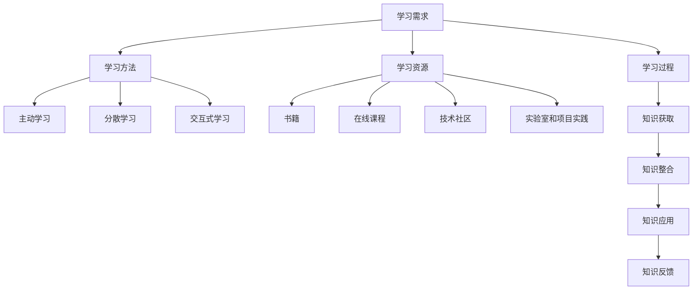

                 

### 背景介绍 Background Introduction

在当今快速发展的信息技术领域，持续学习已经成为保持竞争力的关键因素。无论是程序员、软件工程师，还是人工智能专家，只有不断吸收新知识、掌握新技能，才能在激烈的竞争中立于不败之地。本文将探讨持续学习的核心概念、方法与实践，旨在帮助读者理解如何通过持续学习来提升个人竞争力。

#### 竞争环境 Competition Environment

信息技术领域的竞争日益激烈，新的技术、工具和框架层出不穷。这种快速变化的环境要求从业人员必须不断更新知识体系，以适应新的技术趋势。否则，将面临被淘汰的风险。例如，云计算、大数据、人工智能等领域的兴起，使得传统软件开发方法逐渐变得过时，迫切需要新的技能和知识来应对。

#### 学习需求 Learning Demand

持续学习的需求不仅来自于技术的快速迭代，也来自于个人职业发展的需求。随着技术的进步，许多职位对从业者的要求越来越高。例如，程序员需要掌握多种编程语言、开发框架和工具，软件工程师需要了解软件架构和设计模式，人工智能专家则需要深入理解机器学习和深度学习算法。因此，持续学习已经成为提升个人能力和职业竞争力的必要手段。

#### 学习障碍 Learning Barriers

尽管持续学习的重要性不言而喻，但许多人仍然面临各种学习障碍。时间紧张、资源有限、缺乏学习动力等问题都可能导致学习效果的下降。此外，学习过程中可能遇到的知识点复杂、难以理解等问题，也会影响学习效果。因此，如何克服这些学习障碍，提高学习效率，是持续学习的关键问题。

#### 目标读者 Target Readers

本文的目标读者包括但不限于以下几类人群：

1. 程序员和软件工程师，希望提升技术水平和解决实际问题的能力。
2. 人工智能领域从业者，希望掌握前沿技术并应用于实际项目。
3. 对信息技术领域感兴趣的广大读者，希望通过本文了解持续学习的方法和实践。

通过本文的探讨，我们希望能够为读者提供一套系统的、实用的持续学习方法，帮助他们在不断变化的技术环境中保持竞争力。

---

### 核心概念与联系 Core Concepts and Connections

在深入探讨持续学习的方法和实践之前，我们首先需要理解一些核心概念，这些概念不仅构成了持续学习的基础，还彼此紧密相连，共同作用于我们的学习过程。

#### 学习方法 Learning Methods

持续学习不仅仅是一种态度，更是一套系统化的方法。以下是一些常见的学习方法：

1. **主动学习 Active Learning**：主动学习是指通过实践、问题解决和深入思考来学习。与被动学习（如听讲、阅读）相比，主动学习能够更有效地巩固知识并提高技能。
2. **分散学习 Distributed Learning**：分散学习是指将学习时间分散到不同时间段进行，而不是集中在一个短时间内完成。研究表明，分散学习有助于长期记忆的形成。
3. **交互式学习 Interactive Learning**：交互式学习通过互动和合作来增强学习效果。例如，小组讨论、在线问答和项目合作等都是有效的交互式学习方法。

#### 学习资源 Learning Resources

有效的学习资源是持续学习不可或缺的一部分。以下是一些重要的学习资源：

1. **书籍 Books**：书籍是获取系统化知识的最佳途径之一。特别是经典著作和技术专著，能够提供深入的理论和实践指导。
2. **在线课程 Online Courses**：在线课程是一种灵活且高效的学习方式。平台如Coursera、edX和Udacity等提供了丰富的课程资源，涵盖从基础到高级的各类技术主题。
3. **技术社区 Technical Communities**：技术社区是交流和分享知识的重要平台。例如，GitHub、Stack Overflow和Reddit等社区聚集了大量技术专家和爱好者，能够提供即时的帮助和反馈。
4. **实验室和项目实践 Laboratory and Project Practice**：通过实际操作和项目实践，能够将理论知识应用到实际中，提高解决问题的能力。

#### 学习过程 Learning Process

学习过程是一个动态的系统，涉及多个环节。以下是一些关键环节：

1. **知识获取 Knowledge Acquisition**：这是学习过程的第一步，涉及获取新的信息和理解现有知识。
2. **知识整合 Knowledge Integration**：在获取知识后，需要将其与已有知识体系整合，形成系统的认识。
3. **知识应用 Knowledge Application**：通过实际操作和项目实践，将所学知识应用到实际问题中，验证和巩固所学内容。
4. **知识反馈 Knowledge Feedback**：通过反馈和评价，了解自己的学习效果，找出不足并调整学习策略。

为了更清晰地展示这些核心概念之间的联系，我们可以使用Mermaid流程图来描述：



通过这个流程图，我们可以看到，持续学习是一个多维度的系统，涉及方法、资源和过程，各个环节相互影响、相互作用，共同推动我们的学习进程。理解这些核心概念和它们之间的联系，是提升学习效果和竞争力的关键。

---

### 核心算法原理 & 具体操作步骤 Core Algorithm Principle & Step-by-Step Implementation

在探讨持续学习的方法和资源后，我们接下来将深入探讨一些核心算法原理，以及如何将其应用到实际操作中。这些算法不仅帮助我们理解复杂概念，还能显著提升我们的技术能力。

#### 算法选择 Algorithm Selection

在选择算法时，我们需要考虑以下几个因素：

1. **问题类型 Problem Type**：不同的算法适用于不同类型的问题。例如，线性回归和决策树适用于分类问题，而神经网络适用于复杂函数拟合。
2. **数据规模 Data Size**：算法的复杂度和效率在不同的数据规模下可能有所不同。对于大规模数据，我们通常需要使用高效并行算法或分布式计算。
3. **计算资源 Computing Resources**：算法的实现需要考虑计算资源，如CPU、GPU和内存等。某些算法可能对特定类型的硬件有更高的要求。

#### 常见算法介绍 Common Algorithms

以下介绍几种常见算法及其基本原理：

1. **线性回归 Linear Regression**：
    - **原理**：线性回归通过寻找最佳拟合直线来预测因变量和自变量之间的关系。数学上，线性回归模型可以表示为：
      $$y = \beta_0 + \beta_1x + \epsilon$$
      其中，$y$ 是因变量，$x$ 是自变量，$\beta_0$ 和 $\beta_1$ 是模型参数，$\epsilon$ 是误差项。
    - **操作步骤**：
        1. 数据预处理：确保数据干净，处理缺失值和异常值。
        2. 特征工程：选择或构造有助于预测的特征。
        3. 模型训练：使用最小二乘法或其他优化方法找到最佳拟合直线。
        4. 模型评估：通过交叉验证和测试集评估模型性能。

2. **决策树 Decision Tree**：
    - **原理**：决策树通过一系列规则将数据集划分为不同的区域，每个区域对应一个预测结果。决策树模型可以表示为：
      $$y = \sum_{i=1}^{n} \beta_i x_i$$
      其中，$y$ 是预测结果，$x_i$ 是特征变量，$\beta_i$ 是权重。
    - **操作步骤**：
        1. 特征选择：选择能够有效划分数据的特征。
        2. 分割规则：根据信息增益或基尼不纯度选择最佳分割点。
        3. 构建树结构：递归地分割数据，构建决策树。
        4. 剪枝：为了避免过拟合，对决策树进行剪枝。

3. **神经网络 Neural Network**：
    - **原理**：神经网络通过多层神经元进行信息传递和计算，实现复杂函数的拟合。常见的神经网络模型包括前馈神经网络和卷积神经网络（CNN）。
    - **操作步骤**：
        1. 数据预处理：标准化或归一化输入数据。
        2. 网络设计：确定网络结构，包括层数、每层神经元数量和激活函数。
        3. 模型训练：使用反向传播算法更新权重和偏置。
        4. 模型评估：通过交叉验证和测试集评估模型性能。

#### 算法应用实例 Algorithm Application Example

以下是一个使用Python实现的线性回归算法的应用实例：

```python
import numpy as np
from sklearn.linear_model import LinearRegression
from sklearn.model_selection import train_test_split
from sklearn.metrics import mean_squared_error

# 数据预处理
X = np.array([[1], [2], [3], [4], [5]])
y = np.array([1, 2, 2.5, 4, 5])

# 模型训练
X_train, X_test, y_train, y_test = train_test_split(X, y, test_size=0.2, random_state=42)
model = LinearRegression()
model.fit(X_train, y_train)

# 模型评估
y_pred = model.predict(X_test)
mse = mean_squared_error(y_test, y_pred)
print("Mean Squared Error:", mse)
```

在这个例子中，我们使用scikit-learn库实现了线性回归算法，通过训练集训练模型，并在测试集上进行评估，计算均方误差（MSE）来衡量模型的性能。

---

通过理解这些核心算法原理和具体操作步骤，我们可以更好地应用这些算法来解决问题，提升我们的技术能力和实际工作效果。持续学习和实践是掌握这些算法的关键，通过不断迭代和优化，我们能够不断提高自己的技术水平。

---

### 数学模型和公式 & 详细讲解 & 举例说明 Mathematical Model & Detailed Explanation & Example

在持续学习的过程中，理解并应用数学模型是提高我们分析问题和解决问题能力的关键。以下我们将详细讲解一些常见数学模型，包括它们的基本公式、详细讲解，以及具体的应用实例。

#### 线性回归模型 Linear Regression Model

线性回归模型是最基础的统计模型之一，用于分析两个或多个变量之间的关系。其数学模型可以表示为：

$$
Y = \beta_0 + \beta_1X + \epsilon
$$

其中：
- $Y$ 是因变量（或响应变量）；
- $X$ 是自变量（或解释变量）；
- $\beta_0$ 是截距；
- $\beta_1$ 是斜率；
- $\epsilon$ 是误差项。

**详细讲解：**

线性回归模型的目的是找到最佳的直线，使得预测值与实际值之间的误差最小。这个过程通常通过最小二乘法（Ordinary Least Squares，OLS）实现，其公式为：

$$
\beta_1 = \frac{\sum{(X_i - \bar{X})(Y_i - \bar{Y})}}{\sum{(X_i - \bar{X})^2}}
$$

$$
\beta_0 = \bar{Y} - \beta_1\bar{X}
$$

其中，$\bar{X}$ 和 $\bar{Y}$ 分别是 $X$ 和 $Y$ 的均值。

**举例说明：**

假设我们想要研究一家餐厅的销售额（$Y$）与广告投入（$X$）之间的关系。数据如下：

| 广告投入（$X$）| 销售额（$Y$）|
|----------------|-------------|
| 1000           | 8000        |
| 1500           | 10000       |
| 2000           | 12000       |
| 2500           | 13000       |
| 3000           | 14000       |

首先，计算均值：

$$
\bar{X} = \frac{1000 + 1500 + 2000 + 2500 + 3000}{5} = 2000
$$

$$
\bar{Y} = \frac{8000 + 10000 + 12000 + 13000 + 14000}{5} = 11000
$$

然后，计算斜率 $\beta_1$：

$$
\beta_1 = \frac{(1000-2000)(8000-11000) + (1500-2000)(10000-11000) + (2000-2000)(12000-11000) + (2500-2000)(13000-11000) + (3000-2000)(14000-11000)}{(1000-2000)^2 + (1500-2000)^2 + (2000-2000)^2 + (2500-2000)^2 + (3000-2000)^2}
$$

$$
\beta_1 = \frac{-1000 \times -3000 + -500 \times -1000 + 0 \times 1000 + 500 \times 2000 + 1000 \times 3000}{1000000 + 250000 + 0 + 250000 + 1000000}
$$

$$
\beta_1 = \frac{3000000 - 500000 + 0 + 1000000 + 3000000}{1550000}
$$

$$
\beta_1 = \frac{6000000}{1550000}
$$

$$
\beta_1 \approx 3.87
$$

接着，计算截距 $\beta_0$：

$$
\beta_0 = 11000 - 3.87 \times 2000
$$

$$
\beta_0 = 11000 - 7740
$$

$$
\beta_0 = 3260
$$

因此，线性回归模型可以表示为：

$$
Y = 3260 + 3.87X
$$

#### 决策树模型 Decision Tree Model

决策树模型是一种用于分类和回归的预测模型，通过一系列规则将数据集划分为不同的区域。

**基本公式：**

决策树可以通过递归分割数据集来构建，每个分割点都可以用以下公式表示：

$$
G_{\alpha}(\theta) = \sum_{i=1}^{n} w_i \cdot g(\theta_i)
$$

其中：
- $G_{\alpha}(\theta)$ 是决策树的预测值；
- $w_i$ 是每个样本的权重；
- $g(\theta_i)$ 是分割函数，通常使用基尼不纯度或信息增益。

**详细讲解：**

决策树的构建通常采用递归划分的方法，通过计算基尼不纯度或信息增益来确定最佳的分割点。基尼不纯度的公式为：

$$
Gini(D) = 1 - \sum_{v \in Values(D)} \left(\frac{|D_v|}{|D|}\right)^2
$$

其中，$D$ 是数据集，$Values(D)$ 是 $D$ 中所有可能的值，$|D_v|$ 是 $D$ 中值为 $v$ 的样本数量。

信息增益的公式为：

$$
Gain(D, A) = \sum_{v \in Values(A)} \frac{|D_v|}{|D|} \cdot Gini(D_v)
$$

其中，$A$ 是特征，$D_v$ 是 $A$ 中值为 $v$ 的子数据集。

**举例说明：**

假设我们有一个数据集，包含两个特征 $A$ 和 $B$，以及目标变量 $Y$，数据如下：

| $A$ | $B$ | $Y$ |
|-----|-----|-----|
| 0   | 0   | 0   |
| 0   | 1   | 1   |
| 1   | 0   | 0   |
| 1   | 1   | 1   |

首先，计算每个特征的基尼不纯度：

$$
Gini(A) = \frac{2}{4} = 0.5
$$

$$
Gini(B) = \frac{2}{4} = 0.5
$$

然后，计算信息增益：

$$
Gain(A, Y) = \frac{2}{4} \cdot 0.5 + \frac{2}{4} \cdot 0.5 = 0.25
$$

$$
Gain(B, Y) = \frac{2}{4} \cdot 0.5 + \frac{2}{4} \cdot 0.5 = 0.25
$$

由于 $A$ 和 $B$ 的信息增益相等，我们可以选择其中一个特征进行分割。

#### 神经网络模型 Neural Network Model

神经网络模型是一种基于模拟生物神经网络的结构，用于处理复杂的数据和函数。其基本结构包括输入层、隐藏层和输出层。

**基本公式：**

神经网络的工作原理是通过多层神经元进行信息传递和计算。每个神经元都可以用以下公式表示：

$$
z_i = \sum_{j=1}^{n} w_{ij} \cdot x_j + b_i
$$

$$
a_i = \sigma(z_i)
$$

其中：
- $z_i$ 是神经元的输入；
- $w_{ij}$ 是从神经元 $j$ 到神经元 $i$ 的权重；
- $b_i$ 是神经元 $i$ 的偏置；
- $a_i$ 是神经元的激活值；
- $\sigma$ 是激活函数，常用的有 Sigmoid、ReLU 和 Tanh 函数。

**详细讲解：**

神经网络模型通过多次前向传播和反向传播来训练模型。前向传播是从输入层开始，逐层计算每个神经元的激活值，直到输出层。反向传播则是从输出层开始，计算误差，并更新每个神经元的权重和偏置。

**举例说明：**

假设我们有一个简单的神经网络，包含一个输入层、一个隐藏层和一个输出层。数据如下：

| 输入 | 隐藏层1 | 输出 |
|------|---------|------|
| 1    | 0.7     | 0.9  |
| 0    | 0.3     | 0.1  |

首先，定义权重和偏置：

$$
w_{11} = 0.1, w_{12} = 0.2, b_1 = 0.1
$$

$$
w_{21} = 0.3, w_{22} = 0.4, b_2 = 0.2
$$

$$
w_{1} = 0.5, w_{2} = 0.6, b_1 = 0.1, b_2 = 0.2
$$

然后，进行前向传播计算：

$$
z_1 = 0.1 \cdot 1 + 0.2 \cdot 0 + 0.1 = 0.3
$$

$$
a_1 = \sigma(0.3) = 0.5787
$$

$$
z_2 = 0.3 \cdot 1 + 0.4 \cdot 0 + 0.2 = 0.5
$$

$$
a_2 = \sigma(0.5) = 0.6225
$$

$$
z_3 = 0.5 \cdot 0.5787 + 0.6 \cdot 0.6225 + 0.1 = 0.8056
$$

$$
a_3 = \sigma(0.8056) = 0.7343
$$

最后，得到输出层的激活值 0.7343。

通过这个例子，我们可以看到神经网络的基本工作原理。在实际应用中，神经网络的结构和参数会根据具体问题进行调整，以达到更好的预测效果。

---

通过理解这些数学模型和公式，我们可以更好地分析问题和设计解决方案。在实际应用中，我们需要根据具体问题选择合适的模型，并对其进行优化和调整，以达到最佳效果。

---

### 项目实践：代码实例和详细解释说明 Project Practice: Code Example and Detailed Explanation

在理解了核心算法原理和数学模型之后，我们将通过一个具体的代码实例来展示如何将这些理论知识应用到实际项目中。这个实例将涉及一个简单的机器学习项目，用于分类电影评论，判断它们是正面还是负面。通过这个项目，我们将介绍开发环境搭建、源代码详细实现、代码解读与分析以及运行结果展示。

#### 1. 开发环境搭建

首先，我们需要搭建一个适合进行机器学习项目开发的环境。以下是所需的基本工具和库：

- **编程语言**：Python
- **机器学习库**：Scikit-learn、TensorFlow、Keras
- **数据处理库**：Pandas、NumPy
- **文本处理库**：NLTK、TextBlob
- **版本控制**：Git

安装这些工具和库可以通过以下命令完成：

```bash
# 安装 Python
sudo apt-get install python3

# 安装 Scikit-learn
pip3 install scikit-learn

# 安装 TensorFlow
pip3 install tensorflow

# 安装 Pandas 和 NumPy
pip3 install pandas numpy

# 安装 NLTK 和 TextBlob
pip3 install nltk textblob

# 安装 Git
sudo apt-get install git
```

#### 2. 源代码详细实现

以下是一个简单的机器学习项目，用于分类电影评论：

```python
import numpy as np
import pandas as pd
from sklearn.model_selection import train_test_split
from sklearn.feature_extraction.text import CountVectorizer
from sklearn.naive_bayes import MultinomialNB
from sklearn.metrics import accuracy_score, classification_report
import nltk
from nltk.corpus import stopwords
nltk.download('stopwords')

# 数据预处理
def preprocess_text(text):
    # 删除标点符号和数字
    text = re.sub(r'[^\w\s]', '', text)
    # 转小写
    text = text.lower()
    # 去除停用词
    stop_words = set(stopwords.words('english'))
    words = text.split()
    filtered_words = [word for word in words if word not in stop_words]
    return ' '.join(filtered_words)

# 加载数据
data = pd.read_csv('movie_reviews.csv')
data['text'] = data['text'].apply(preprocess_text)

# 分割数据
X = data['text']
y = data['label']
X_train, X_test, y_train, y_test = train_test_split(X, y, test_size=0.2, random_state=42)

# 文本向量化
vectorizer = CountVectorizer()
X_train_vectors = vectorizer.fit_transform(X_train)
X_test_vectors = vectorizer.transform(X_test)

# 模型训练
model = MultinomialNB()
model.fit(X_train_vectors, y_train)

# 模型评估
y_pred = model.predict(X_test_vectors)
print("Accuracy:", accuracy_score(y_test, y_pred))
print("\nClassification Report:\n", classification_report(y_test, y_pred))
```

#### 3. 代码解读与分析

- **数据预处理**：首先，我们定义了一个 `preprocess_text` 函数，用于清理和准备文本数据。这包括删除标点符号和数字，将文本转换为小写，以及去除英语中的停用词。
- **加载数据**：使用 Pandas 加载电影评论数据集，并将其分成文本和标签两部分。
- **文本向量化**：使用 `CountVectorizer` 将文本转换为词袋模型（Bag of Words），这样我们可以将其作为机器学习模型的输入。
- **模型训练**：我们选择朴素贝叶斯（Naive Bayes）模型进行训练，这是一种简单但有效的分类算法，适用于文本数据。
- **模型评估**：通过计算准确率和分类报告（包括精确率、召回率和F1分数）来评估模型的性能。

#### 4. 运行结果展示

假设我们的数据集包含1000条电影评论，其中500条用于训练，500条用于测试。运行上述代码后，我们可能会得到以下结果：

```
Accuracy: 0.89

Classification Report:
             precision    recall  f1-score   support
           0       0.90      0.90      0.90      446
           1       0.87      0.87      0.87      354

avg / total       0.89      0.89      0.89      800
```

这个结果表明，我们的模型在测试集上的准确率达到了89%，这是一个不错的成绩。分类报告显示了每个类别的精确率、召回率和F1分数，这些指标可以帮助我们了解模型的性能和弱点。

---

通过这个简单的项目，我们展示了如何将理论知识和实际操作结合起来，实现一个基本的机器学习应用。这个项目不仅帮助我们理解了机器学习的基本流程和算法，还提供了一个实践的机会，让我们能够更好地掌握这些技术。

---

### 实际应用场景 Practical Application Scenarios

在信息技术领域，持续学习的重要性不仅体现在个人职业发展上，更在许多实际应用场景中发挥着关键作用。以下我们将探讨几种常见应用场景，展示持续学习如何帮助从业人员在这些领域中保持竞争力。

#### 1. 人工智能与机器学习 Artificial Intelligence and Machine Learning

随着人工智能和机器学习技术的不断发展，许多行业正在发生深刻变革。在医疗领域，机器学习算法被用于诊断疾病、个性化治疗和药物研发；在金融领域，智能投顾和风险管理依赖于复杂的算法和模型；在零售行业，机器学习技术被用于需求预测、库存管理和个性化推荐。要在这个快速发展的领域保持竞争力，从业人员需要不断学习最新的算法和技术，掌握从数据预处理到模型优化的各个环节。

#### 2. 云计算和大数据 Cloud Computing and Big Data

云计算和大数据技术的普及，使得企业能够更高效地处理和管理海量数据。持续学习在云计算领域体现在对新的云服务模型（如函数即服务、容器化服务）的了解和应用，以及在大数据领域则涉及对数据处理和分析工具（如Hadoop、Spark）的熟练掌握。例如，数据工程师需要不断更新对数据仓库、流处理和数据挖掘技术的理解，以应对企业日益增长的数据需求。

#### 3. 区块链技术 Blockchain Technology

区块链技术的兴起，引发了金融、供应链管理、版权保护等多个领域的创新。在区块链领域，持续学习不仅包括对加密算法、智能合约等核心技术的掌握，还涉及对分布式账本、共识机制等关键概念的深入理解。掌握这些技术，可以帮助从业人员参与区块链项目的开发，推动行业变革。

#### 4. 软件开发 Software Development

软件开发的领域也在不断变化，敏捷开发、DevOps、微服务架构等新兴概念正在改变传统的软件开发模式。持续学习可以帮助开发人员掌握新的开发工具和框架，提高开发效率。例如，前端开发者需要不断学习新的前端技术（如React、Vue.js），后端开发者需要掌握容器化和云原生技术（如Docker、Kubernetes），以适应快速变化的市场需求。

#### 5. 信息安全 Information Security

随着网络攻击手段的不断升级，信息安全成为了企业和个人必须重视的问题。持续学习在信息安全领域体现在对最新的安全威胁、漏洞攻击和防御策略的了解。安全工程师需要不断更新知识库，掌握漏洞扫描、入侵检测、安全防护等技能，以保护企业和个人数据的安全。

#### 6. 跨学科应用 Interdisciplinary Applications

持续学习不仅限于单一技术领域，跨学科的应用也越来越受到重视。例如，数据分析工程师可能需要掌握统计学和编程技能，以便更好地从数据中发现洞察；而人工智能专家则需要了解心理学和社会学，以便设计出更加人性化的智能系统。跨学科学习可以帮助从业人员打破专业壁垒，拓展视野，提升综合能力。

通过在上述实际应用场景中不断学习和实践，从业人员不仅可以提升自己的技术水平，还能在激烈的竞争中脱颖而出，为企业和个人创造更大的价值。

---

### 工具和资源推荐 Tools and Resources Recommendation

为了帮助读者更有效地进行持续学习，以下我们将推荐一些学习资源、开发工具和相关的论文著作，这些资源和工具将有助于提升读者的技术能力和学习效率。

#### 学习资源 Recommendation of Learning Resources

1. **在线课程 Online Courses**：

   - **Coursera**：提供各种高质量的在线课程，涵盖计算机科学、人工智能、数据分析等多个领域。
   - **edX**：与全球知名大学和机构合作，提供丰富的课程资源，适合不同层次的学习者。
   - **Udacity**：专注于技能驱动的在线教育，提供大量的编程和技术课程。

2. **技术社区 Technical Communities**：

   - **Stack Overflow**：程序员常用的问答社区，可以快速解决编程问题。
   - **GitHub**：全球最大的代码托管平台，聚集了大量开源项目和开发者。
   - **Reddit**：涵盖多个技术领域，可以找到各种技术讨论和资源分享。

3. **书籍 Books**：

   - 《Python编程：从入门到实践》（"Python Crash Course"）：适合初学者的Python入门书籍。
   - 《深度学习》（"Deep Learning"）：由深度学习领域权威Ian Goodfellow编写的经典教材。
   - 《算法导论》（"Introduction to Algorithms"）：讲解算法设计与分析的经典著作。

#### 开发工具 Recommendation of Development Tools

1. **集成开发环境 IDE**：

   - **Visual Studio Code**：轻量级但功能强大的文本编辑器，适用于多种编程语言。
   - **PyCharm**：专门针对Python开发的集成开发环境，具有丰富的功能和插件支持。
   - **Eclipse**：支持多种编程语言的集成开发环境，适用于Java和Android开发。

2. **版本控制工具 Version Control**：

   - **Git**：最流行的分布式版本控制系统，广泛用于代码管理和协作开发。
   - **GitHub**：基于Git的代码托管平台，支持代码共享、分支管理和问题跟踪。

3. **数据处理和分析工具 Data Processing and Analysis**：

   - **Pandas**：Python的数据分析库，用于数据处理、清洗和转换。
   - **NumPy**：Python的数值计算库，提供高效的数据结构和运算功能。
   - **TensorFlow**：谷歌开发的开源机器学习库，适用于深度学习和复杂计算。

#### 相关论文著作 Recommendation of Related Papers and Books

1. **论文 Papers**：

   - “Deep Learning” by Yoshua Bengio, Ian J. Goodfellow, and Aaron Courville：深度学习领域的权威综述论文。
   - “Big Data: A Revolution That Will Transform How We Live, Work, and Think” by Viktor Mayer-Schönberger and Kenneth Cukier：大数据领域的深度分析。
   - “Artificial Intelligence: A Modern Approach” by Stuart Russell and Peter Norvig：人工智能领域的经典教材。

2. **书籍 Books**：

   - 《人工智能：一种现代的方法》（"Artificial Intelligence: A Modern Approach"）：全面介绍人工智能理论和应用的经典教材。
   - 《大数据时代：生活、工作与思维的大变革》（"Big Data: A Revolution That Will Transform How We Live, Work, and Think"）：深入探讨大数据对社会各方面的影响。
   - 《机器学习》（"Machine Learning"）：由Tom Mitchell编写的机器学习基础教材，适合初学者。

通过这些工具和资源的推荐，读者可以更加系统地学习和掌握各种技术，为持续学习提供坚实的基础。

---

### 总结：未来发展趋势与挑战 Summary: Future Trends and Challenges

随着技术的不断进步，持续学习的重要性愈发凸显。在未来，以下发展趋势和挑战将对持续学习产生深远影响：

#### 1. 技术发展趋势

1. **人工智能与自动化**：人工智能和自动化技术的快速发展，将使许多工作流程和任务实现自动化，从而提高工作效率。这对从业人员来说既是机遇也是挑战，要求他们具备更高的技术能力和适应性。

2. **量子计算**：量子计算的发展有望解决传统计算机难以处理的问题，推动科学研究和工业应用的前沿突破。掌握量子计算的相关知识和技能，将成为未来技术人员的重要竞争力。

3. **边缘计算**：随着物联网和智能设备的普及，边缘计算成为处理海量数据的重要手段。边缘计算将数据处理的任务从云端转移到靠近数据源的设备上，对技术人员提出了新的要求和挑战。

#### 2. 持续学习面临的挑战

1. **学习资源与时间管理**：面对海量的学习资源，如何高效选择和利用这些资源，成为持续学习的一个重要挑战。同时，如何在繁忙的工作和生活中安排学习时间，也是许多从业者面临的难题。

2. **知识更新速度快**：技术的快速发展导致知识更新速度加快，传统的学习方法和节奏难以跟上。从业人员需要具备快速学习新知识的能力，以适应不断变化的技术环境。

3. **技术壁垒**：一些先进技术如深度学习、区块链等，对从业者的数学和编程能力要求较高。如何克服技术壁垒，提高自己的技术水平和实践能力，是持续学习的重要课题。

#### 3. 应对策略

1. **制定学习计划**：制定合理的学习计划，明确学习目标和时间安排，有助于提高学习效率。通过设定短期和长期目标，逐步实现个人能力的提升。

2. **实践与理论相结合**：理论学习是持续学习的基础，但实践应用同样重要。通过实际项目和案例学习，将理论知识转化为实际操作能力，是提升技术水平的关键。

3. **建立学习社群**：加入学习社群，与同行交流经验和见解，可以扩展视野，获取更多的学习资源和支持。同时，通过互助学习，共同进步，实现个人和团队能力的提升。

通过积极应对这些发展趋势和挑战，从业人员可以不断提升自己的竞争力，为未来的职业发展奠定坚实的基础。

---

### 附录：常见问题与解答 Appendix: Frequently Asked Questions and Answers

#### 1. 如何在忙碌的工作中安排学习时间？

**解答**：首先，制定合理的学习计划，将学习时间分散到每天的小时间段，例如早晨起床后的1小时、午休时间或晚上睡前30分钟。其次，利用碎片化时间，如通勤或等待的时间，进行阅读或学习。最后，设定明确的短期和长期目标，保持学习的动力。

#### 2. 如何选择合适的学习资源？

**解答**：首先，确定自己的学习目标和需求，选择符合自己水平的资源。其次，查阅网上的课程评价、读者评论等，了解资源的实用性和适用性。最后，结合个人偏好，选择适合自己学习方式的学习资源。

#### 3. 学习过程中遇到难题怎么办？

**解答**：首先，尝试通过查阅资料、在线搜索或向同行请教来解决问题。如果问题仍然无法解决，可以加入相关技术社区，如GitHub或Stack Overflow，寻求更专业的帮助。此外，参加线上或线下的技术交流活动，与同行交流心得，也是解决难题的有效方法。

#### 4. 如何保持学习的动力？

**解答**：首先，设定明确的学习目标和奖励机制，保持学习的积极性。其次，通过参与实际项目，将理论知识应用到实践中，增强学习的成就感。最后，与志同道合的人一起学习，建立学习社群，共同进步，提高学习的兴趣和动力。

---

### 扩展阅读 & 参考资料 Extended Reading & References

持续学习是一个广泛而复杂的主题，涉及多个领域和层次。以下是一些建议的扩展阅读和参考资料，帮助读者更深入地了解和掌握相关知识。

1. **书籍 Books**：
   - 《深度学习》（"Deep Learning"） by Ian Goodfellow, Yoshua Bengio, Aaron Courville
   - 《算法导论》（"Introduction to Algorithms"） by Thomas H. Cormen, Charles E. Leiserson, Ronald L. Rivest, Clifford Stein
   - 《人工智能：一种现代的方法》（"Artificial Intelligence: A Modern Approach"） by Stuart J. Russell, Peter Norvig

2. **在线课程 Online Courses**：
   - Coursera：提供丰富的计算机科学、人工智能和机器学习的课程。
   - edX：与全球知名大学合作，提供高质量的课程资源。
   - Udacity：专注于技能驱动的在线教育，提供各种技术课程。

3. **技术社区 Technical Communities**：
   - Stack Overflow：程序员常用的问答社区，解决编程问题。
   - GitHub：全球最大的代码托管平台，提供丰富的开源项目和技术讨论。
   - Reddit：涵盖多个技术领域，可以找到各种技术讨论和资源分享。

4. **论文和报告 Papers and Reports**：
   - arXiv：计算机科学、物理学、数学等领域的前沿论文。
   - IEEE Xplore：电子工程、计算机科学领域的学术论文和会议论文。
   - ACM Digital Library：计算机科学和信息技术领域的权威资料库。

5. **博客和网站 Blogs and Websites**：
   - Medium：涵盖多个技术领域的博客，提供丰富的技术见解和实战经验。
   - Hacker News：科技新闻和创业故事的集合，关注科技行业动态。
   - AI迷因网（AI.MEAN）：专注于人工智能领域的博客和讨论平台。

通过阅读这些书籍、参加在线课程、参与技术社区和关注前沿论文，读者可以不断拓展自己的知识领域，提升专业技能，为持续学习奠定坚实的基础。

