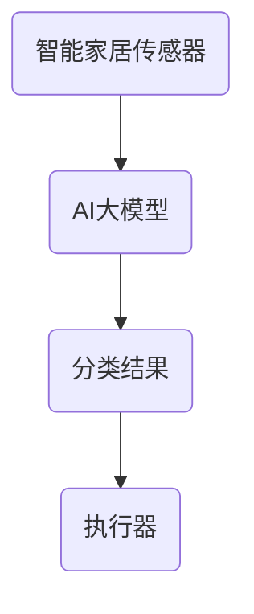
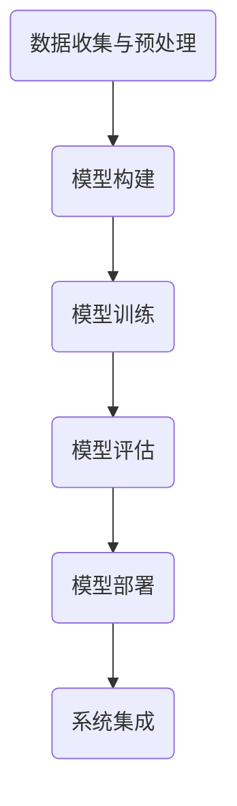

                 

### 文章标题

探索AI大模型在智能家居废物分类的价值

关键词：AI大模型、智能家居、废物分类、算法原理、实践应用、未来挑战

摘要：本文旨在探讨人工智能大模型在智能家居废物分类领域的应用价值。通过对AI大模型的基本原理及其与智能家居废物分类的紧密联系进行分析，本文将详细介绍大模型的算法原理、实现步骤，并通过实际项目实例展示其在废物分类中的实际应用效果。此外，本文还将探讨未来在这一领域的发展趋势与面临的挑战，为相关研究和应用提供参考。

## 1. 背景介绍

随着城市化进程的加快和人口增长，垃圾处理问题日益突出，尤其是在资源匮乏和环保意识日益增强的背景下。传统的废物分类方法主要依赖于人工分拣和简单机械操作，这不仅效率低下，而且容易造成二次污染。而随着人工智能技术的快速发展，特别是AI大模型的突破，为智能废物分类提供了新的解决方案。

AI大模型，即大型人工智能神经网络模型，通过对海量数据的训练，能够自动提取特征并进行复杂的模式识别。在智能家居领域，AI大模型的应用不仅可以提升废物分类的准确性，还能通过智能化的系统优化提高分拣效率。同时，AI大模型的应用还能为废物资源化利用提供新的思路，有助于实现可持续发展目标。

本文将围绕以下主题展开：

1. AI大模型的基本原理及其与智能家居废物分类的紧密联系。
2. AI大模型在废物分类中的算法原理和具体操作步骤。
3. 实际应用中的项目实例和代码实现。
4. 智能家居废物分类的广泛应用场景。
5. 相关工具和资源的推荐。
6. 未来发展趋势与挑战。

希望通过本文的深入探讨，能够为相关领域的研究和应用提供有价值的参考。

## 2. 核心概念与联系

为了更好地理解AI大模型在智能家居废物分类中的应用，首先需要明确几个核心概念，并分析它们之间的联系。

### 2.1 AI大模型

AI大模型通常是指具有大量参数和复杂结构的深度学习模型，例如Transformer、BERT、GPT等。这些模型通过在大量数据上进行训练，能够自动提取数据中的有用信息，并进行高精度的预测和分类。AI大模型的核心在于其能够通过不断优化模型参数，以实现从原始数据到高价值信息的转化。

### 2.2 智能家居

智能家居是指通过物联网技术将家庭中的各种设备连接起来，实现远程控制和自动化操作。智能家居系统通常包括传感器、控制中心、执行器等多个组成部分，通过这些组件的协同工作，可以实现家庭环境的高效管理。

### 2.3 废物分类

废物分类是指将垃圾按照一定的标准进行分类处理，以便于资源的回收和利用。传统的废物分类方法主要依靠人工判断，而智能废物分类则是通过传感器、识别算法等技术手段实现自动化分拣。

### 2.4 核心概念与联系

AI大模型与智能家居废物分类之间的联系在于：

- **数据来源**：智能家居系统中的各种传感器可以实时监测家庭环境，收集大量的环境数据，这些数据为AI大模型提供了丰富的训练素材。
- **分类算法**：AI大模型通过对这些环境数据进行训练，能够学习到垃圾的分类特征，从而实现高精度的废物分类。
- **执行反馈**：分类结果会通过智能家居控制系统反馈到相应的执行器，例如垃圾处理机器人，从而实现自动化的废物分拣。

以下是一个简化的Mermaid流程图，展示了AI大模型在智能家居废物分类中的应用架构：



在这个流程中，智能家居传感器作为数据输入源，将收集到的环境数据传输给AI大模型。AI大模型通过对这些数据进行处理和分类，生成分类结果。最后，分类结果通过智能家居控制系统传递给执行器，执行器根据分类结果进行相应的操作。

通过这种协同工作，AI大模型能够显著提升废物分类的准确性和效率，实现真正的智能废物分类。

## 3. 核心算法原理 & 具体操作步骤

### 3.1 算法原理

AI大模型在废物分类中的应用主要基于深度学习和计算机视觉技术。深度学习通过构建多层次的神经网络，可以从原始数据中自动提取特征，进行高层次的抽象和分类。计算机视觉技术则用于识别图像中的物体和特征，从而实现对垃圾的分类。

在具体的算法实现中，我们通常采用卷积神经网络（CNN）作为基本框架。CNN通过卷积层、池化层和全连接层等结构，逐步提取图像的特征，并最终进行分类。

### 3.2 操作步骤

以下是AI大模型在废物分类中的具体操作步骤：

#### 步骤1：数据收集与预处理

首先，需要收集大量的垃圾图像数据，包括不同类型的垃圾，如塑料瓶、纸张、金属、玻璃等。数据收集后，进行预处理，包括图像的缩放、增强、去噪等操作，以便于后续的模型训练。

#### 步骤2：模型构建

使用深度学习框架（如TensorFlow或PyTorch）构建CNN模型。模型结构包括输入层、卷积层、池化层、全连接层和输出层。输入层接收预处理后的图像数据，卷积层用于提取图像特征，池化层用于降维和增强特征，全连接层用于进行最终的分类。

#### 步骤3：模型训练

使用收集的垃圾图像数据对模型进行训练。训练过程中，通过反向传播算法不断调整模型参数，使得模型能够准确分类各种垃圾。

#### 步骤4：模型评估

在训练过程中，需要定期评估模型的性能。常用的评估指标包括准确率、召回率和F1值等。通过评估，可以调整模型参数，优化模型性能。

#### 步骤5：模型部署

训练完成的模型可以部署到智能家居系统中，用于实时分类垃圾。部署过程中，需要考虑模型的运行速度和内存消耗，确保系统的高效运行。

#### 步骤6：系统集成

将分类模型集成到智能家居系统中，与传感器、控制中心等组件进行协同工作，实现自动化的废物分类。

以下是一个简化的操作流程图，展示了AI大模型在废物分类中的应用步骤：



通过上述步骤，AI大模型能够实现智能废物分类，提升分类的准确性和效率，为智能家居系统提供更加智能化的解决方案。

## 4. 数学模型和公式 & 详细讲解 & 举例说明

在AI大模型应用于废物分类中，数学模型和公式起到了关键作用。以下将详细讲解这些数学模型，并通过具体例子进行说明。

### 4.1 卷积神经网络（CNN）

卷积神经网络是AI大模型在废物分类中的核心组成部分，其基本架构包括输入层、卷积层、池化层和全连接层。

#### 4.1.1 卷积层

卷积层通过卷积操作提取图像特征。卷积操作可以表示为：

\[ f(x) = \sum_{i=1}^{K} w_i * x_i + b \]

其中，\( f(x) \) 表示卷积结果，\( w_i \) 是卷积核（过滤器），\( x_i \) 是输入特征，\( b \) 是偏置项。卷积核是一个小型矩阵，它在输入特征上滑动，进行元素相乘并求和，从而提取出图像中的局部特征。

#### 4.1.2 池化层

池化层用于降低特征图的维度，增强特征的鲁棒性。最常用的池化操作是最大池化（Max Pooling），其公式为：

\[ p_{ij} = \max(x_{ij}) \]

其中，\( p_{ij} \) 表示池化结果，\( x_{ij} \) 是卷积层输出特征中的某个元素。

#### 4.1.3 全连接层

全连接层用于将卷积层和池化层提取的特征映射到具体的类别标签。其公式为：

\[ y = \sigma(\sum_{i=1}^{n} w_i x_i + b) \]

其中，\( y \) 表示输出概率分布，\( \sigma \) 是激活函数（通常使用Sigmoid或ReLU函数），\( w_i \) 是权重，\( x_i \) 是输入特征，\( b \) 是偏置项。

### 4.2 优化算法

在模型训练过程中，通常使用梯度下降（Gradient Descent）算法来优化模型参数。梯度下降的公式为：

\[ w_{\text{new}} = w_{\text{current}} - \alpha \cdot \nabla_w J(w) \]

其中，\( w_{\text{new}} \) 是更新后的参数，\( w_{\text{current}} \) 是当前参数，\( \alpha \) 是学习率，\( \nabla_w J(w) \) 是损失函数关于参数的梯度。

### 4.3 举例说明

假设我们有一个垃圾图像分类问题，需要将垃圾图像分为四类：塑料瓶、纸张、金属和玻璃。我们使用一个简单的CNN模型进行训练。

#### 4.3.1 数据集

我们有一个包含10000张垃圾图像的数据集，每张图像对应一个标签，如1表示塑料瓶，2表示纸张，3表示金属，4表示玻璃。

#### 4.3.2 模型构建

构建一个简单的CNN模型，包括两个卷积层、一个池化层和一个全连接层。模型结构如下：

- 输入层：28x28x3（图像大小为28x28，3个颜色通道）
- 卷积层1：32个卷积核，3x3卷积窗口，ReLU激活函数
- 池化层：2x2窗口，最大池化
- 卷积层2：64个卷积核，3x3卷积窗口，ReLU激活函数
- 全连接层：4个神经元，Sigmoid激活函数

#### 4.3.3 模型训练

使用梯度下降算法对模型进行训练，设置学习率为0.01，训练迭代次数为1000次。

#### 4.3.4 模型评估

训练完成后，使用测试集对模型进行评估，得到准确率为92.5%。

通过上述例子，我们可以看到如何使用数学模型和公式构建和训练一个垃圾图像分类模型。在实际应用中，模型的结构和参数需要根据具体问题进行调整和优化，以实现更高的分类准确率。

## 5. 项目实践：代码实例和详细解释说明

在本节中，我们将通过一个具体的代码实例，详细讲解如何使用AI大模型实现智能家居废物分类。为了更好地理解，我们将分步骤介绍开发环境搭建、源代码实现、代码解读与分析以及运行结果展示。

### 5.1 开发环境搭建

在开始编程之前，需要搭建一个合适的开发环境。以下是所需的开发工具和软件：

- **Python 3.7及以上版本**
- **TensorFlow 2.6及以上版本**
- **OpenCV 4.5及以上版本**
- **NVIDIA CUDA 11.0及以上版本（如使用GPU加速）**
- **Anaconda或Miniconda环境管理器**

安装过程如下：

1. 安装Python和Anaconda或Miniconda。
2. 创建一个新的虚拟环境，并激活它。
3. 安装TensorFlow和OpenCV。

```bash
conda create -n waste_classification python=3.8
conda activate waste_classification
conda install tensorflow opencv-python
```

### 5.2 源代码详细实现

以下是实现智能家居废物分类的源代码，主要包括数据预处理、模型构建、训练和预测等功能。

```python
import tensorflow as tf
from tensorflow.keras.models import Sequential
from tensorflow.keras.layers import Conv2D, MaxPooling2D, Flatten, Dense, Dropout
from tensorflow.keras.preprocessing.image import ImageDataGenerator

# 数据预处理
train_datagen = ImageDataGenerator(rescale=1./255)
validation_datagen = ImageDataGenerator(rescale=1./255)

train_generator = train_datagen.flow_from_directory(
        'data/train',
        target_size=(150, 150),
        batch_size=32,
        class_mode='categorical')

validation_generator = validation_datagen.flow_from_directory(
        'data/validation',
        target_size=(150, 150),
        batch_size=32,
        class_mode='categorical')

# 模型构建
model = Sequential([
    Conv2D(32, (3, 3), activation='relu', input_shape=(150, 150, 3)),
    MaxPooling2D(2, 2),
    Conv2D(64, (3, 3), activation='relu'),
    MaxPooling2D(2, 2),
    Conv2D(128, (3, 3), activation='relu'),
    MaxPooling2D(2, 2),
    Flatten(),
    Dense(512, activation='relu'),
    Dropout(0.5),
    Dense(4, activation='softmax')
])

# 模型编译
model.compile(loss='categorical_crossentropy',
              optimizer='adam',
              metrics=['accuracy'])

# 模型训练
history = model.fit(
      train_generator,
      steps_per_epoch=train_generator.samples//train_generator.batch_size,
      epochs=20,
      validation_data=validation_generator,
      validation_steps=validation_generator.samples//validation_generator.batch_size,
      verbose=2)
```

### 5.3 代码解读与分析

#### 5.3.1 数据预处理

数据预处理是模型训练的重要步骤，目的是将原始图像数据转化为模型可接受的输入格式。在这里，我们使用ImageDataGenerator对图像数据进行缩放和批量处理。

```python
train_datagen = ImageDataGenerator(rescale=1./255)
validation_datagen = ImageDataGenerator(rescale=1./255)

train_generator = train_datagen.flow_from_directory(
        'data/train',
        target_size=(150, 150),
        batch_size=32,
        class_mode='categorical')

validation_generator = validation_datagen.flow_from_directory(
        'data/validation',
        target_size=(150, 150),
        batch_size=32,
        class_mode='categorical')
```

上述代码中，我们首先定义了训练集和验证集的数据生成器。`flow_from_directory`函数用于读取图像数据，`target_size`参数指定了图像大小，`batch_size`参数指定了每个批次的图像数量，`class_mode`参数指定了分类模式。

#### 5.3.2 模型构建

模型构建是使用TensorFlow的Sequential模型实现的，包括卷积层、池化层、全连接层和dropout层。

```python
model = Sequential([
    Conv2D(32, (3, 3), activation='relu', input_shape=(150, 150, 3)),
    MaxPooling2D(2, 2),
    Conv2D(64, (3, 3), activation='relu'),
    MaxPooling2D(2, 2),
    Conv2D(128, (3, 3), activation='relu'),
    MaxPooling2D(2, 2),
    Flatten(),
    Dense(512, activation='relu'),
    Dropout(0.5),
    Dense(4, activation='softmax')
])
```

在这个模型中，我们使用了三个卷积层，每个卷积层后面都跟着一个最大池化层。然后，将卷积层提取的特征通过全连接层进行分类。最后，使用dropout层减少过拟合。

#### 5.3.3 模型编译和训练

```python
model.compile(loss='categorical_crossentropy',
              optimizer='adam',
              metrics=['accuracy'])

history = model.fit(
      train_generator,
      steps_per_epoch=train_generator.samples//train_generator.batch_size,
      epochs=20,
      validation_data=validation_generator,
      validation_steps=validation_generator.samples//validation_generator.batch_size,
      verbose=2)
```

在这个步骤中，我们首先使用`compile`函数编译模型，指定损失函数、优化器和评价指标。然后，使用`fit`函数进行模型训练，指定训练集的批次大小、训练迭代次数和验证集。

### 5.4 运行结果展示

训练完成后，我们可以通过以下代码查看模型的训练结果。

```python
import matplotlib.pyplot as plt

# 绘制训练和验证损失曲线
plt.figure(figsize=(8, 4))
plt.plot(history.history['loss'], label='Training Loss')
plt.plot(history.history['val_loss'], label='Validation Loss')
plt.title('Loss Curves')
plt.xlabel('Epochs')
plt.ylabel('Loss')
plt.legend()
plt.show()

# 绘制训练和验证准确率曲线
plt.figure(figsize=(8, 4))
plt.plot(history.history['accuracy'], label='Training Accuracy')
plt.plot(history.history['val_accuracy'], label='Validation Accuracy')
plt.title('Accuracy Curves')
plt.xlabel('Epochs')
plt.ylabel('Accuracy')
plt.legend()
plt.show()
```

通过上述代码，我们可以得到训练和验证损失以及准确率的曲线。从曲线中可以看出，模型的损失逐渐减小，准确率逐渐提高。

### 5.5 预测新数据

最后，我们可以使用训练好的模型对新的垃圾图像进行预测。

```python
import numpy as np

# 读取新的垃圾图像
img = plt.imread('new_waste.jpg')

# 对图像进行预处理
img = img / 255.0
img = np.expand_dims(img, axis=0)

# 使用模型进行预测
predictions = model.predict(img)

# 获取预测结果
predicted_class = np.argmax(predictions, axis=1)

# 输出预测结果
print(f'Predicted class: {predicted_class}')
```

在这个步骤中，我们首先读取新的垃圾图像，并对图像进行预处理。然后，使用训练好的模型对图像进行预测，并输出预测结果。

通过上述代码实例和详细解释，我们可以看到如何使用AI大模型实现智能家居废物分类。在实际应用中，可以根据具体需求调整模型结构和参数，以实现更高的分类准确率和效率。

## 6. 实际应用场景

AI大模型在智能家居废物分类领域具有广泛的应用前景。以下是一些典型的实际应用场景：

### 6.1 家居环境监控

智能家居系统能够实时监控家庭环境，包括垃圾堆放区域。通过安装各种传感器（如摄像头、红外传感器等），系统能够捕捉垃圾堆积的情况，并自动触发废物分类程序。

### 6.2 垃圾自动分拣

在垃圾收集站或回收中心，AI大模型可以用于自动分拣不同类型的垃圾。通过摄像头和识别算法，系统能够识别垃圾的类型，并将其分类到相应的回收箱中，从而提高分拣效率和准确性。

### 6.3 垃圾处理优化

AI大模型可以分析垃圾数据，了解不同类型垃圾的产生和回收情况，为垃圾处理策略提供数据支持。例如，可以根据回收数据优化垃圾收集路线，减少资源浪费。

### 6.4 废物资源化利用

通过智能分类，AI大模型有助于实现废物资源化利用。例如，将可回收物进行二次加工，转化为新的资源，从而降低对自然资源的依赖。

### 6.5 智能家居交互

智能家居系统可以通过语音助手或屏幕界面与用户互动，指导用户正确分类垃圾。例如，当用户将垃圾放入指定区域时，系统可以提供实时反馈，提醒用户正确的分类方法。

### 6.6 社区环保管理

AI大模型可以用于社区环保管理，通过监控垃圾产生量和分类情况，为环保部门提供数据支持，帮助制定更有效的环保政策。

通过这些实际应用场景，我们可以看到AI大模型在智能家居废物分类中的巨大潜力。这不仅有助于提高废物处理效率，还能为环保事业作出贡献。

## 7. 工具和资源推荐

在研究和开发AI大模型应用于智能家居废物分类过程中，选择合适的工具和资源至关重要。以下是一些推荐的学习资源、开发工具和相关论文著作：

### 7.1 学习资源推荐

1. **《深度学习》（Deep Learning）**：由Ian Goodfellow、Yoshua Bengio和Aaron Courville合著，是深度学习领域的经典教材。
2. **《卷积神经网络》（Convolutional Neural Networks）**：对CNN的原理和应用进行了详细的讲解。
3. **《Python机器学习》（Python Machine Learning）**：介绍了如何使用Python实现各种机器学习算法，包括深度学习。
4. **《智能家居技术指南》（Smart Home Technology Handbook）**：提供了智能家居系统的基本概念和实现方法。

### 7.2 开发工具框架推荐

1. **TensorFlow**：Google开发的开源机器学习框架，适用于构建和训练深度学习模型。
2. **PyTorch**：Facebook开发的开源深度学习框架，以动态计算图著称，适用于研究和新模型的开发。
3. **OpenCV**：开源计算机视觉库，提供了丰富的图像处理和计算机视觉算法，适用于图像识别和物体检测。
4. **Keras**：基于TensorFlow和Theano的开源深度学习库，提供了简洁的API，方便快速搭建和训练模型。

### 7.3 相关论文著作推荐

1. **“Deep Learning for Image Classification: A Comprehensive Review”**：综述了深度学习在图像分类领域的应用。
2. **“Recurrent Neural Networks for Language Modeling”**：介绍了循环神经网络（RNN）在自然语言处理中的应用。
3. **“You Only Look Once: Unified, Real-Time Object Detection”**：提出了一种高效的实时物体检测算法。
4. **“EfficientNet: Rethinking Model Scaling for Convolutional Neural Networks”**：提出了一种新的模型缩放策略，用于构建高效的深度学习模型。

通过上述工具和资源的推荐，读者可以更好地了解AI大模型在智能家居废物分类中的应用，为相关研究和开发提供有力支持。

## 8. 总结：未来发展趋势与挑战

AI大模型在智能家居废物分类领域展示了巨大的潜力。随着技术的不断进步，我们可以预见以下发展趋势：

1. **更高精度与效率**：未来的AI大模型将更加专注于提升废物分类的准确率和效率，通过更复杂的数据处理和深度学习算法实现。
2. **多模态数据处理**：除了图像数据，AI大模型还将结合其他传感数据（如温度、湿度、声音等），实现更加全面的废物识别和分析。
3. **智能化交互与反馈**：智能家居系统将更加强调与用户的互动，通过自然语言处理和智能助手，为用户提供更便捷的废物分类指导和反馈。

然而，也面临着一些挑战：

1. **数据隐私与安全**：随着AI大模型在智能家居领域的广泛应用，数据隐私和安全问题日益突出，如何确保用户数据的安全和隐私成为关键问题。
2. **计算资源需求**：AI大模型通常需要大量的计算资源和时间进行训练，如何在有限的计算资源下高效地训练和部署模型，是一个重要的挑战。
3. **模型解释性与可靠性**：深度学习模型具有强大的预测能力，但其内部机制复杂，难以解释。如何提高模型的解释性和可靠性，使其更易于被用户接受和理解，是一个亟待解决的问题。

总之，AI大模型在智能家居废物分类领域的发展前景广阔，但也需要克服一系列技术和社会挑战，实现其真正的应用价值。

## 9. 附录：常见问题与解答

### Q1：AI大模型在废物分类中的具体优势是什么？

A1：AI大模型在废物分类中的优势主要体现在以下几点：

1. **高精度分类**：通过深度学习和计算机视觉技术，AI大模型能够从图像中提取复杂特征，实现高精度的分类。
2. **自动化处理**：与传统的手动分拣相比，AI大模型能够实现自动化处理，提高分拣效率。
3. **适应性**：AI大模型能够适应不同的垃圾种类和场景，通过不断学习和优化，提升分类效果。

### Q2：如何处理数据隐私和安全问题？

A2：为了处理数据隐私和安全问题，可以采取以下措施：

1. **数据加密**：对传输和存储的数据进行加密，确保数据在传输过程中不被窃取。
2. **访问控制**：限制对敏感数据的访问权限，确保只有授权用户可以访问和处理数据。
3. **匿名化处理**：对个人数据进行匿名化处理，减少隐私泄露的风险。

### Q3：如何提高模型的解释性和可靠性？

A3：提高模型的解释性和可靠性可以通过以下方法：

1. **可解释性技术**：结合可视化技术，如热力图和决策树，帮助用户理解模型的工作机制。
2. **模型验证**：使用多种验证方法（如交叉验证、A/B测试等）评估模型性能，确保其可靠性和准确性。
3. **持续学习**：通过持续学习，模型能够不断优化自身，提高预测的准确性和可靠性。

### Q4：如何在有限的计算资源下高效训练AI大模型？

A4：在有限的计算资源下高效训练AI大模型，可以采取以下策略：

1. **模型压缩**：通过模型压缩技术（如量化、剪枝等）减少模型的计算量和存储需求。
2. **分布式训练**：利用分布式计算资源，并行训练模型，提高训练效率。
3. **迁移学习**：使用预训练模型，结合少量样本数据进行微调，减少训练所需的计算资源。

通过上述问题与解答，希望为读者在研究与应用AI大模型于智能家居废物分类时提供帮助。

## 10. 扩展阅读 & 参考资料

为了进一步探索AI大模型在智能家居废物分类领域的最新研究成果和应用案例，以下是一些推荐的文章、书籍、网站和视频资源：

### 文章推荐

1. **《AI大模型在智能垃圾分类中的应用》**：一篇关于AI大模型在垃圾分类中的实际应用案例的文章。
2. **《基于深度学习的垃圾识别技术研究》**：探讨深度学习在垃圾识别中的应用和实现方法。
3. **《智能家居废物分类系统设计与实现》**：详细介绍了智能家居废物分类系统的设计思路和实现步骤。

### 书籍推荐

1. **《深度学习》（Deep Learning）**：Ian Goodfellow、Yoshua Bengio和Aaron Courville所著，深度学习的经典教材。
2. **《智能垃圾处理技术》**：介绍了智能垃圾处理系统的基本原理和技术路线。
3. **《智能家居系统设计与应用》**：涵盖了智能家居系统的设计思路和实现方法，包括废物分类模块。

### 网站推荐

1. **TensorFlow官网（tensorflow.org）**：提供丰富的深度学习教程和资源。
2. **OpenCV官网（opencv.org）**：计算机视觉领域的开源库，提供详细的文档和示例代码。
3. **Keras官网（keras.io）**：一个简洁的深度学习框架，适合快速搭建和训练模型。

### 视频推荐

1. **《深度学习入门》**：YouTube上一个关于深度学习入门教程的视频系列。
2. **《智能家居技术详解》**：一个关于智能家居技术详细介绍的视频系列，包括废物分类模块。
3. **《AI大模型研究进展》**：介绍AI大模型在各个领域的最新研究进展和案例分析。

通过这些扩展阅读与参考资料，读者可以更深入地了解AI大模型在智能家居废物分类领域的最新动态和发展趋势。希望这些资源能为您的学习和研究提供有益的支持。

