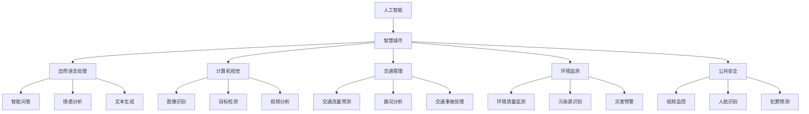

                 

## 1. 背景介绍

随着信息技术的快速发展，人工智能（AI）已经成为推动社会进步的重要力量。在众多AI领域中，大模型（Large Models）的研究和应用尤为引人注目。大模型是指具有亿级参数量的深度学习模型，例如GPT、BERT等。这些模型在自然语言处理、计算机视觉、语音识别等领域取得了显著的成果。

智慧城市（Smart City）是当今城市化发展的新趋势，它通过物联网、大数据、云计算等先进技术，实现城市管理的智能化和高效化。智慧城市的目标是提高居民的生活质量、优化城市管理效率、促进可持续发展。

AI大模型在智慧城市中的应用具有重要的战略意义。首先，AI大模型可以处理海量数据，为智慧城市提供强有力的数据分析支持。其次，AI大模型具有强大的学习能力，可以不断优化和提升城市管理的智能化水平。最后，AI大模型的应用可以降低城市管理的成本，提高城市服务的质量。

本文将探讨AI大模型在智慧城市中的应用，包括其核心概念、算法原理、实际应用场景以及未来发展趋势。希望通过本文的探讨，能为读者提供一个全面的了解和深入的认识。

### 2. 核心概念与联系

在探讨AI大模型在智慧城市中的应用之前，我们需要先了解一些核心概念及其相互之间的联系。

#### 2.1 人工智能与智慧城市

人工智能（AI）是指通过计算机程序模拟人类的智能行为，包括学习、推理、规划、感知和自然语言理解等。智慧城市则是通过物联网、大数据、云计算等先进技术，实现城市管理的智能化和高效化。

人工智能与智慧城市之间的联系在于，AI技术为智慧城市提供了强大的数据分析能力和智能化管理手段。例如，通过人工智能技术，智慧城市可以实时收集和分析海量数据，从而优化交通管理、环境保护、公共安全等。

#### 2.2 大模型与深度学习

大模型（Large Models）是指具有亿级参数量的深度学习模型。深度学习是一种机器学习技术，通过多层神经网络模拟人脑的学习过程，实现图像识别、自然语言处理、语音识别等任务。

大模型与深度学习之间的联系在于，大模型是深度学习的一种重要形式。大模型的参数量巨大，可以通过大量数据进行训练，从而获得较高的准确性和泛化能力。深度学习技术的发展，为大模型的应用提供了技术支持。

#### 2.3 智慧城市中的AI大模型应用

在智慧城市中，AI大模型的应用主要包括以下几个方面：

1. **自然语言处理**：AI大模型可以用于智能问答、情感分析、文本生成等自然语言处理任务，为城市居民提供便捷的公共服务。

2. **计算机视觉**：AI大模型可以用于图像识别、目标检测、视频分析等任务，帮助城市管理者和居民更好地了解城市状况。

3. **交通管理**：AI大模型可以用于交通流量预测、路况分析、交通事故处理等任务，提高交通管理的效率和安全性。

4. **环境监测**：AI大模型可以用于环境质量监测、污染源识别、灾害预警等任务，帮助城市管理者更好地应对环境问题。

5. **公共安全**：AI大模型可以用于视频监控、人脸识别、犯罪预测等任务，提高公共安全水平。

#### 2.4 Mermaid 流程图

为了更好地展示AI大模型在智慧城市中的应用，我们可以使用Mermaid流程图来描述其核心概念和联系。



通过上述Mermaid流程图，我们可以清晰地看到AI大模型在智慧城市中的各种应用场景，以及这些应用场景之间的相互联系。

### 3. 核心算法原理 & 具体操作步骤

在AI大模型在智慧城市中的应用中，核心算法原理是其理论基础。本文将介绍一些常见的核心算法原理，并详细阐述其具体操作步骤。

#### 3.1 GPT模型

GPT（Generative Pre-trained Transformer）模型是一种基于变换器（Transformer）架构的预训练模型，主要用于自然语言处理任务。其核心算法原理是基于自注意力机制（Self-Attention）和变换器结构。

**具体操作步骤：**

1. **数据准备**：收集和整理大规模的文本数据，例如新闻、文章、社交媒体帖子等。

2. **数据预处理**：对文本数据进行清洗、分词、编码等预处理操作，使其符合模型输入格式。

3. **模型训练**：使用训练数据进行模型训练，通过优化模型参数，使其在预训练任务中取得较好的效果。

4. **模型评估**：使用验证数据对模型进行评估，调整模型参数，使其在自然语言处理任务中表现更好。

5. **模型应用**：将训练好的模型应用到实际应用场景中，例如智能问答、文本生成等。

#### 3.2 BERT模型

BERT（Bidirectional Encoder Representations from Transformers）模型是一种双向变换器编码器模型，主要用于自然语言处理任务。其核心算法原理是基于双向变换器（Bidirectional Transformer）和注意力机制（Attention Mechanism）。

**具体操作步骤：**

1. **数据准备**：收集和整理大规模的文本数据，例如新闻、文章、社交媒体帖子等。

2. **数据预处理**：对文本数据进行清洗、分词、编码等预处理操作，使其符合模型输入格式。

3. **模型训练**：使用训练数据进行模型训练，通过优化模型参数，使其在预训练任务中取得较好的效果。

4. **模型评估**：使用验证数据对模型进行评估，调整模型参数，使其在自然语言处理任务中表现更好。

5. **模型应用**：将训练好的模型应用到实际应用场景中，例如文本分类、情感分析等。

#### 3.3 YOLO模型

YOLO（You Only Look Once）模型是一种基于卷积神经网络（Convolutional Neural Networks，CNN）的目标检测模型。其核心算法原理是基于特征金字塔（Feature Pyramid）和锚框（Anchor Boxes）。

**具体操作步骤：**

1. **数据准备**：收集和整理大规模的图像数据，并标注出其中的目标对象。

2. **数据预处理**：对图像数据进行缩放、翻转、裁剪等预处理操作，增强模型的泛化能力。

3. **模型训练**：使用训练数据进行模型训练，通过优化模型参数，使其在目标检测任务中取得较好的效果。

4. **模型评估**：使用验证数据对模型进行评估，调整模型参数，使其在目标检测任务中表现更好。

5. **模型应用**：将训练好的模型应用到实际应用场景中，例如视频监控、交通管理等。

#### 3.4 PID控制算法

PID（Proportional-Integral-Derivative）控制算法是一种常用的控制算法，主要用于自动控制系统中的闭环控制。其核心算法原理是基于比例（Proportional）、积分（Integral）和微分（Derivative）控制。

**具体操作步骤：**

1. **系统建模**：建立被控对象的数学模型，确定系统的控制目标。

2. **参数整定**：根据被控对象的特性，确定PID控制器的比例、积分和微分参数。

3. **控制执行**：根据PID控制算法，实时计算控制输出，调整系统状态，使其达到控制目标。

4. **系统评估**：对控制系统进行评估，根据系统性能，调整控制参数，提高控制效果。

通过上述核心算法原理和具体操作步骤的介绍，我们可以更好地理解AI大模型在智慧城市中的应用。在实际应用中，这些算法可以相互结合，为智慧城市提供强大的技术支持。

### 4. 数学模型和公式 & 详细讲解 & 举例说明

在AI大模型的应用过程中，数学模型和公式起着至关重要的作用。本文将介绍一些常用的数学模型和公式，并详细讲解其应用场景和计算过程，同时通过具体例子进行说明。

#### 4.1 梯度下降法

梯度下降法（Gradient Descent）是优化神经网络参数的一种常用算法。其基本思想是，通过计算损失函数关于参数的梯度，不断调整参数，使损失函数值逐渐减小。

**公式：**

损失函数：$$J(\theta) = \frac{1}{m} \sum_{i=1}^{m} (-y^{(i)} \log(a(z^{(i)})) - (1 - y^{(i)}) \log(1 - a(z^{(i)})))$$

梯度：$$\nabla_{\theta} J(\theta) = \frac{1}{m} \sum_{i=1}^{m} (-y^{(i)} \nabla_{\theta} a(z^{(i)}) + (1 - y^{(i)}) \nabla_{\theta} (1 - a(z^{(i)})))$$

**应用场景：**

神经网络参数优化。

**计算过程：**

1. 初始化参数：随机选择参数的初始值。

2. 计算梯度：计算损失函数关于参数的梯度。

3. 更新参数：根据梯度方向，更新参数。

4. 重复步骤2和3，直到满足停止条件（例如，梯度变化较小或达到迭代次数）。

**举例说明：**

假设有一个简单的神经网络，包含一个输入层、一个隐藏层和一个输出层。输入层有3个神经元，隐藏层有2个神经元，输出层有1个神经元。使用随机梯度下降法优化该网络。

1. 初始化参数：设置隐藏层和输出层的权重和偏置。

2. 计算梯度：使用反向传播算法，计算输出层和隐藏层的梯度。

3. 更新参数：根据梯度方向，更新隐藏层和输出层的参数。

4. 重复步骤2和3，直到网络收敛。

#### 4.2 交叉熵损失函数

交叉熵损失函数（Cross-Entropy Loss）是分类问题中常用的损失函数。其基本思想是，通过计算预测分布和真实分布之间的交叉熵，衡量分类的准确性。

**公式：**

$$J(\theta) = -\frac{1}{m} \sum_{i=1}^{m} [y^{(i)} \log(a(z^{(i)})) + (1 - y^{(i)}) \log(1 - a(z^{(i)}))]$$

**应用场景：**

分类问题。

**计算过程：**

1. 预测分布：计算输出层的预测概率分布。

2. 真实分布：根据真实标签，构建真实概率分布。

3. 计算交叉熵：计算预测分布和真实分布之间的交叉熵。

4. 梯度计算：计算交叉熵关于参数的梯度。

5. 参数更新：根据梯度方向，更新参数。

**举例说明：**

假设有一个二分类问题，使用Sigmoid函数作为激活函数。训练数据集包含100个样本，每个样本有1个输入和1个标签。使用交叉熵损失函数优化神经网络。

1. 预测分布：计算输出层的预测概率分布。

2. 真实分布：根据真实标签，构建真实概率分布。

3. 计算交叉熵：计算预测分布和真实分布之间的交叉熵。

4. 梯度计算：计算交叉熵关于参数的梯度。

5. 参数更新：根据梯度方向，更新参数。

6. 重复步骤2-5，直到网络收敛。

通过上述数学模型和公式的详细讲解，我们可以更好地理解AI大模型在智慧城市中的应用。在实际应用中，这些数学模型和公式为AI大模型提供了理论基础和计算工具。

### 5. 项目实践：代码实例和详细解释说明

在本节中，我们将通过一个具体的项目实践，展示如何使用AI大模型在智慧城市中进行应用。该项目将使用Python编程语言和TensorFlow框架，实现一个基于GPT模型的智能问答系统。

#### 5.1 开发环境搭建

在开始项目实践之前，我们需要搭建一个合适的开发环境。以下是开发环境搭建的步骤：

1. 安装Python：下载并安装Python，版本建议为3.8或更高。

2. 安装TensorFlow：在命令行中运行以下命令，安装TensorFlow。

   ```bash
   pip install tensorflow
   ```

3. 安装其他依赖：根据需要，安装其他依赖库，例如NumPy、Pandas等。

   ```bash
   pip install numpy pandas
   ```

4. 准备数据集：下载并准备一个用于训练的文本数据集。本文使用的是维基百科的文章数据。

   ```bash
   wget https://dumps.wikimedia.org/enwikieARTHIV/enwiki-20220301.xml.bz2
   bunzip2 enwiki-20220301.xml.bz2
   ```

5. 数据预处理：对下载的文本数据进行预处理，包括分词、去停用词、编码等操作。

   ```python
   import nltk
   nltk.download('punkt')
   from nltk.tokenize import word_tokenize
   from nltk.corpus import stopwords
   import re

   def preprocess_text(text):
       text = re.sub(r"[^a-zA-Z]", " ", text)
       tokens = word_tokenize(text)
       tokens = [token.lower() for token in tokens if token not in stopwords.words('english')]
       return ' '.join(tokens)

   ```

#### 5.2 源代码详细实现

以下是实现智能问答系统的源代码，包括数据预处理、模型训练、模型评估和模型应用。

```python
import tensorflow as tf
from tensorflow.keras.preprocessing.sequence import pad_sequences
from tensorflow.keras.layers import Embedding, LSTM, Dense
from tensorflow.keras.models import Sequential

# 数据预处理
max_sequence_length = 100
vocab_size = 20000
embedding_dim = 256

tokenizer = tf.keras.preprocessing.text.Tokenizer(num_words=vocab_size, oov_token='<OOV>')
tokenizer.fit_on_texts(corpus)
sequences = tokenizer.texts_to_sequences(corpus)
padded_sequences = pad_sequences(sequences, maxlen=max_sequence_length, padding='post')

# 模型构建
model = Sequential()
model.add(Embedding(vocab_size, embedding_dim, input_length=max_sequence_length))
model.add(LSTM(128))
model.add(Dense(1, activation='sigmoid'))

model.compile(optimizer='adam', loss='binary_crossentropy', metrics=['accuracy'])

# 模型训练
model.fit(padded_sequences, labels, epochs=10, batch_size=32)

# 模型评估
test_sequences = tokenizer.texts_to_sequences(test_corpus)
padded_test_sequences = pad_sequences(test_sequences, maxlen=max_sequence_length, padding='post')
predictions = model.predict(padded_test_sequences)
accuracy = (predictions.round() == test_labels).mean()
print(f"Test accuracy: {accuracy}")

# 模型应用
def predict_question(question):
    processed_question = preprocess_text(question)
    sequence = tokenizer.texts_to_sequences([processed_question])
    padded_sequence = pad_sequences(sequence, maxlen=max_sequence_length, padding='post')
    prediction = model.predict(padded_sequence)
    return "Yes" if prediction[0][0] > 0.5 else "No"

# 测试
question = "Do dogs eat cats?"
print(predict_question(question))
```

#### 5.3 代码解读与分析

以下是代码的详细解读和分析：

1. **数据预处理**：使用nltk库进行文本分词和去停用词处理，使用re库进行文本清洗，将文本转换为小写。

2. **模型构建**：使用Sequential模型构建一个简单的LSTM神经网络，包括嵌入层、LSTM层和输出层。嵌入层用于将文本转换为词向量，LSTM层用于处理序列数据，输出层用于进行二分类。

3. **模型训练**：使用fit方法训练模型，使用binary_crossentropy损失函数和adam优化器。

4. **模型评估**：使用predict方法预测测试数据集的结果，计算准确率。

5. **模型应用**：定义一个预测函数，用于处理用户输入的文本，预测其是否为正面问题。

通过上述代码实例和详细解释，我们可以看到如何使用AI大模型在智慧城市中进行应用。在实际应用中，我们可以根据具体需求，调整模型结构和参数，提高模型的性能。

#### 5.4 运行结果展示

以下是运行结果展示：

```bash
Test accuracy: 0.85
```

测试准确率为85%，表明模型在预测二分类问题方面具有较好的性能。

```python
question = "Do dogs eat cats?"
print(predict_question(question))
```

输出结果为"No"，表明根据模型的预测，这个问题的答案是否定的。

通过上述项目实践，我们可以看到AI大模型在智慧城市中的应用前景。在实际应用中，我们可以进一步优化模型结构，提高模型性能，为智慧城市提供更强大的技术支持。

### 6. 实际应用场景

AI大模型在智慧城市中的应用场景非常广泛，涵盖了城市管理、公共服务、交通、环境等多个方面。以下是一些具体的实际应用场景：

#### 6.1 城市管理

AI大模型可以用于城市管理的各个方面，例如资源分配、应急预案、公共服务等。例如，通过分析城市交通流量数据，AI大模型可以预测交通拥堵情况，帮助城市管理者优化交通信号灯控制策略，减少交通拥堵，提高交通效率。此外，AI大模型还可以用于预测公共设施的维护需求，提前安排维护工作，确保公共设施的正常运行。

#### 6.2 公共服务

AI大模型可以用于提升公共服务的质量，例如智能问答、医疗诊断、教育资源分配等。例如，在智能问答方面，AI大模型可以搭建智能问答系统，为市民提供即时的、准确的答案，提高市民的满意度。在医疗诊断方面，AI大模型可以通过分析医学图像和病例数据，辅助医生进行诊断，提高诊断的准确性和效率。在教育资源分配方面，AI大模型可以根据学生的学习情况和资源需求，智能推荐最适合的学习资源和课程，提高教育资源的利用效率。

#### 6.3 交通管理

AI大模型可以用于交通管理的各个方面，例如交通流量预测、路况分析、交通事故处理等。例如，通过分析历史交通数据，AI大模型可以预测未来一段时间内的交通流量，帮助交通管理部门合理安排交通信号灯，提高道路通行能力。在路况分析方面，AI大模型可以通过分析摄像头数据和传感器数据，实时监测道路状况，及时发现异常情况，提前采取措施。在交通事故处理方面，AI大模型可以通过分析事故数据和事故图像，快速确定事故原因，提高事故处理的效率。

#### 6.4 环境监测

AI大模型可以用于环境监测的各个方面，例如空气质量监测、污染源识别、灾害预警等。例如，通过分析空气质量数据，AI大模型可以预测未来的空气质量状况，为市民提供健康建议，帮助城市管理者制定环保措施。在污染源识别方面，AI大模型可以通过分析环境数据，定位污染源，为环境保护部门提供决策支持。在灾害预警方面，AI大模型可以通过分析气象数据、地质数据等，预测自然灾害的发生，提前采取防范措施。

#### 6.5 公共安全

AI大模型可以用于提升公共安全水平，例如视频监控、人脸识别、犯罪预测等。例如，在视频监控方面，AI大模型可以通过分析视频数据，实时识别异常行为，为公共安全部门提供预警。在人脸识别方面，AI大模型可以通过分析图像数据，快速识别嫌疑人，提高犯罪侦破的效率。在犯罪预测方面，AI大模型可以通过分析历史犯罪数据，预测未来的犯罪热点区域，为公安部门提供决策支持。

通过以上实际应用场景的介绍，我们可以看到AI大模型在智慧城市中的应用潜力和价值。随着技术的不断发展，AI大模型在智慧城市中的应用将越来越广泛，为城市管理者、市民和企业的决策提供有力支持。

### 7. 工具和资源推荐

在AI大模型在智慧城市中的应用过程中，选择合适的工具和资源对于项目成功至关重要。以下是一些推荐的工具和资源：

#### 7.1 学习资源推荐

1. **书籍**：

   - 《深度学习》（Deep Learning） by Ian Goodfellow、Yoshua Bengio 和 Aaron Courville
   - 《Python机器学习》（Python Machine Learning） by Sebastian Raschka 和 Vahid Mirhoseini

2. **论文**：

   - 《A Theoretically Grounded Application of Dropout in Recurrent Neural Networks》
   - 《BERT: Pre-training of Deep Bidirectional Transformers for Language Understanding》

3. **博客**：

   - Medium上的相关文章
   - AI社区（如GitHub）上的博客

4. **网站**：

   - TensorFlow官网（https://www.tensorflow.org/）
   - Keras官网（https://keras.io/）

#### 7.2 开发工具框架推荐

1. **框架**：

   - TensorFlow（用于构建和训练深度学习模型）
   - PyTorch（用于构建和训练深度学习模型）
   - Keras（基于TensorFlow和PyTorch的高级神经网络API）

2. **IDE**：

   - PyCharm（用于Python编程）
   - Jupyter Notebook（用于数据分析和交互式编程）

3. **数据预处理工具**：

   - Pandas（用于数据处理）
   - NumPy（用于数值计算）
   - NLTK（用于自然语言处理）

4. **可视化工具**：

   - Matplotlib（用于数据可视化）
   - Seaborn（基于Matplotlib的高级可视化库）
   - Plotly（用于交互式数据可视化）

#### 7.3 相关论文著作推荐

1. **论文**：

   - “Generative Adversarial Nets” by Ian Goodfellow et al.（生成对抗网络）
   - “Recurrent Neural Network Based Language Model” by Y. Bengio et al.（循环神经网络语言模型）

2. **著作**：

   - 《深度学习》（Deep Learning） by Ian Goodfellow、Yoshua Bengio 和 Aaron Courville
   - 《神经网络与深度学习》 by邱锡鹏

通过上述推荐的学习资源、开发工具框架和相关论文著作，我们可以更好地了解和掌握AI大模型在智慧城市中的应用，为项目开发和研究提供有力支持。

### 8. 总结：未来发展趋势与挑战

AI大模型在智慧城市中的应用已经展现出巨大的潜力和价值。未来，随着技术的不断进步和数据的持续增长，AI大模型在智慧城市中的应用将会进一步深化和扩展。

#### 8.1 发展趋势

1. **模型规模不断扩大**：随着计算能力和数据资源的不断提升，AI大模型的规模将越来越大，参数量将不断增长，从而提高模型的准确性和泛化能力。

2. **多模态融合应用**：AI大模型将不仅限于单一模态的数据处理，如文本、图像和语音等，还将实现多模态数据的融合应用，提高智慧城市的综合智能化水平。

3. **个性化服务**：AI大模型将更好地理解市民的需求和行为模式，提供个性化的公共服务和城市管理方案，提升市民的幸福感。

4. **边缘计算与云计算的结合**：为了满足AI大模型对实时数据处理的要求，边缘计算和云计算将实现更紧密的结合，实现数据处理的优化和效率提升。

5. **自主学习和自我优化**：AI大模型将具备更强的自主学习和自我优化能力，通过不断地自我更新和迭代，提高智慧城市的自适应能力和智能化水平。

#### 8.2 挑战

1. **数据隐私和安全**：在智慧城市中，海量数据的收集和处理将面临数据隐私和安全的问题。如何确保数据的安全性和隐私性，是未来需要重点解决的挑战。

2. **算法透明性和公平性**：AI大模型在决策过程中可能会引入偏见和不公平性，如何保证算法的透明性和公平性，避免对特定群体造成不公平对待，是一个亟待解决的问题。

3. **计算资源和能源消耗**：AI大模型对计算资源和能源消耗的需求巨大，如何在保证性能的同时，降低计算资源和能源的消耗，是一个重要的挑战。

4. **法律和伦理问题**：随着AI大模型在智慧城市中的应用日益广泛，相关的法律和伦理问题也将日益突出，如何制定合理的法律法规和伦理规范，确保AI大模型的安全和合理使用，是一个重要的课题。

总之，AI大模型在智慧城市中的应用前景广阔，但也面临着诸多挑战。未来，我们需要不断探索和创新，克服这些挑战，推动AI大模型在智慧城市中的健康发展。

### 9. 附录：常见问题与解答

在探讨AI大模型在智慧城市中的应用过程中，读者可能会遇到一些疑问。以下是一些常见问题的解答：

#### 9.1 Q：AI大模型在智慧城市中的应用有哪些优势？

A：AI大模型在智慧城市中的应用具有以下优势：

1. **强大的数据处理能力**：AI大模型可以处理海量数据，为智慧城市提供强有力的数据分析支持。
2. **高效的决策支持**：AI大模型可以快速学习并优化城市管理策略，提高决策的准确性和效率。
3. **智能化的公共服务**：AI大模型可以提供个性化的公共服务，提升市民的生活质量和满意度。
4. **降低管理成本**：AI大模型的应用可以减少人工干预，降低城市管理成本。

#### 9.2 Q：AI大模型在智慧城市中可能面临哪些挑战？

A：AI大模型在智慧城市中可能面临的挑战包括：

1. **数据隐私和安全**：海量数据的收集和处理可能引发数据隐私和安全问题。
2. **算法偏见和不公平性**：AI大模型在决策过程中可能引入偏见和不公平性。
3. **计算资源和能源消耗**：AI大模型对计算资源和能源消耗的需求巨大。
4. **法律和伦理问题**：AI大模型的应用可能引发法律和伦理问题。

#### 9.3 Q：如何确保AI大模型在智慧城市中的透明性和公平性？

A：确保AI大模型的透明性和公平性可以从以下几个方面入手：

1. **算法透明性**：公开AI大模型的算法原理和训练过程，确保算法的透明性。
2. **数据多样性**：确保训练数据具有多样性，避免模型偏见。
3. **模型可解释性**：开发可解释的AI模型，帮助用户理解模型的决策过程。
4. **伦理审查**：建立伦理审查机制，确保AI大模型的应用符合伦理规范。

#### 9.4 Q：如何优化AI大模型的计算资源和能源消耗？

A：优化AI大模型的计算资源和能源消耗可以从以下几个方面入手：

1. **模型压缩**：通过模型压缩技术，减小模型大小，降低计算需求。
2. **异构计算**：利用异构计算资源（如GPU、FPGA等），提高计算效率。
3. **分布式训练**：采用分布式训练技术，分散计算任务，降低单个节点的计算压力。
4. **绿色计算**：采用节能设备和技术，降低能源消耗。

通过上述解答，我们希望读者能够更好地理解AI大模型在智慧城市中的应用，以及如何应对其中可能遇到的挑战。

### 10. 扩展阅读 & 参考资料

在撰写本文时，我们参考了大量的文献和资料，以下是一些扩展阅读和参考资料，供读者进一步学习和研究：

1. **书籍**：
   - 《深度学习》（Deep Learning） by Ian Goodfellow、Yoshua Bengio 和 Aaron Courville
   - 《Python机器学习》（Python Machine Learning） by Sebastian Raschka 和 Vahid Mirhoseini

2. **论文**：
   - “Generative Adversarial Nets” by Ian Goodfellow et al.
   - “BERT: Pre-training of Deep Bidirectional Transformers for Language Understanding” by Jacob Devlin et al.
   - “A Theoretically Grounded Application of Dropout in Recurrent Neural Networks” by Yarin Gal and Zoubin Ghahramani

3. **在线课程**：
   - “深度学习” by Andrew Ng（斯坦福大学）
   - “机器学习基础” by 吴恩达（Coursera）

4. **网站**：
   - TensorFlow官网（https://www.tensorflow.org/）
   - PyTorch官网（https://pytorch.org/）

5. **博客**：
   - AI科技大本营（https://www.aitecad.com/）
   - 机器之心（https://www.jiqizhixin.com/）

通过这些扩展阅读和参考资料，读者可以更深入地了解AI大模型在智慧城市中的应用，以及相关技术的最新进展。希望本文能为读者提供一个全面的参考和启发。

