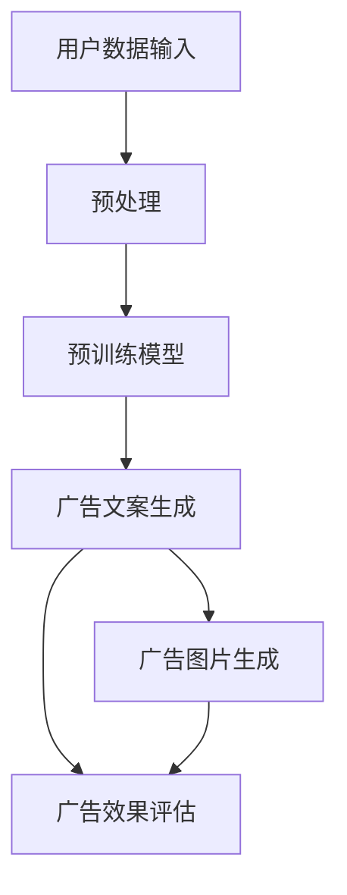

                 

### 背景介绍 Background

随着互联网的迅猛发展，电商平台成为了现代商业运作的重要舞台。平台上的商家和消费者通过线上互动，实现商品交易，推动了经济的快速增长。然而，在庞大的用户群体和海量的商品数据中，如何精准地满足消费者的个性化需求，提高广告投放的效果，成为电商平台面临的重大挑战。

个性化广告创意是电商平台提升用户粘性和转化率的关键因素。传统的广告投放方式往往依赖于用户历史行为数据、兴趣标签等，通过简单的规则匹配实现广告内容的选择和推荐。然而，这种方法存在一定的局限性，难以应对用户多样化的需求和瞬息万变的偏好。

近年来，大规模预训练模型（Large-scale Pre-trained Models，简称LPMs）的出现为个性化广告创意带来了新的契机。大模型通过在海量数据上的训练，能够捕捉到复杂、隐含的用户行为模式，从而生成更加精准和有创意的广告内容。例如，GPT（Generative Pre-trained Transformer）模型能够根据用户的历史行为和兴趣生成个性化的广告文案，从而提高用户的点击率和购买意愿。

本篇文章旨在探讨大规模预训练模型在电商平台个性化广告创意中的应用，分析其工作原理、技术挑战及其带来的潜在价值。文章将首先介绍大规模预训练模型的基本概念和发展历程，然后深入探讨其在电商平台中的应用场景和优势，最后总结现有研究并展望未来的发展趋势。

### 核心概念与联系 Key Concepts and Connections

#### 大规模预训练模型概述

大规模预训练模型（Large-scale Pre-trained Models，简称LPMs）是近年来人工智能领域的重要突破之一。这些模型通过在海量数据上进行预训练，能够捕捉到丰富的语言知识和语义信息，从而在各种自然语言处理任务中表现出色。LPMs的核心思想是利用大规模语料库对模型进行初始化训练，使其具备对自然语言的理解和生成能力。

LPMs的发展历程可以追溯到2018年，当时谷歌推出了BERT（Bidirectional Encoder Representations from Transformers）模型，这是一种双向Transformer模型，通过同时考虑上下文信息，显著提升了自然语言理解的性能。随后，OpenAI发布了GPT-3（Generative Pre-trained Transformer 3），这是一个拥有1750亿参数的模型，能够生成高质量的自然语言文本，展示了惊人的生成能力。

#### 个性化广告创意需求

个性化广告创意在电商平台中具有重要作用，其目标是根据用户的兴趣和行为，生成能够吸引用户注意的广告内容。个性化广告创意的需求主要包括以下几点：

1. **精准匹配**：广告内容需要与用户的兴趣和需求高度匹配，以提高广告的点击率和转化率。
2. **多样性**：广告内容需要具备多样性，以避免用户产生视觉疲劳，保持广告的新鲜感和吸引力。
3. **实时更新**：广告内容需要根据用户的实时行为和偏好进行动态调整，以实现更高效的广告投放。

#### 大规模预训练模型在个性化广告创意中的应用

大规模预训练模型在电商平台个性化广告创意中的应用主要体现在以下几个方面：

1. **广告文案生成**：LPMs能够根据用户的历史行为数据、兴趣标签和实时行为，生成个性化的广告文案。例如，GPT模型可以生成引人注目的广告标题和描述，提高用户的点击率。

2. **广告图片生成**：除了文本内容，广告图片的生成也是个性化广告创意的重要方面。通过生成对抗网络（GANs）等技术，LPMs可以生成符合用户兴趣和风格的高质量广告图片。

3. **广告效果评估**：LPMs还可以用于评估广告的效果，通过分析用户的点击、购买等行为数据，优化广告策略，提高广告的投放效果。

#### Mermaid流程图

以下是一个简化的Mermaid流程图，展示了大规模预训练模型在个性化广告创意中的工作流程：



在这个流程图中，用户数据经过预处理后输入预训练模型，模型生成个性化的广告文案和图片，并通过广告效果评估进一步优化广告策略。

### 核心算法原理 & 具体操作步骤 Core Algorithm Principles & Detailed Steps

#### 广告文案生成

广告文案的生成是大规模预训练模型在个性化广告创意中最为直接的应用之一。以下是一个简化的广告文案生成流程：

1. **数据预处理**：
   - **用户数据采集**：从电商平台获取用户的历史行为数据，如浏览记录、购买记录、兴趣标签等。
   - **数据清洗**：对用户数据进行清洗，去除无效数据和噪声。

2. **预训练模型初始化**：
   - **选择模型**：选择合适的预训练模型，如GPT-2、GPT-3等。
   - **模型初始化**：使用预训练模型权重作为初始化参数，进行微调。

3. **广告文案生成**：
   - **输入文本**：将用户数据转换为文本输入，如“用户喜欢阅读科幻小说，最近浏览了《三体》。”
   - **模型生成**：使用预训练模型生成广告文案，如“欢迎体验科幻小说的最新力作，《三体》续集，即将上线！”

#### 广告图片生成

广告图片的生成通常使用生成对抗网络（GANs）等技术。以下是一个简化的广告图片生成流程：

1. **数据预处理**：
   - **用户画像提取**：从用户数据中提取用户画像，如年龄、性别、兴趣等。
   - **图像数据集构建**：根据用户画像，从图像数据集中选取相关的图片作为训练数据。

2. **GAN模型训练**：
   - **生成器**：训练一个生成器网络，使其能够生成符合用户画像的图片。
   - **判别器**：训练一个判别器网络，用于区分真实图片和生成图片。

3. **广告图片生成**：
   - **输入用户画像**：将用户画像输入生成器网络。
   - **生成图片**：生成器网络根据用户画像生成相应的广告图片。

#### 广告效果评估

广告效果评估是优化广告策略的重要环节。以下是一个简化的广告效果评估流程：

1. **点击率评估**：
   - **数据收集**：收集广告投放后的点击数据。
   - **评估指标**：计算点击率等指标，评估广告的吸引力。

2. **转化率评估**：
   - **数据收集**：收集广告投放后的购买数据。
   - **评估指标**：计算转化率等指标，评估广告的营销效果。

3. **策略优化**：
   - **数据分析**：根据评估结果，分析广告文案、图片等因素对点击率和转化率的影响。
   - **策略调整**：根据分析结果，调整广告文案、图片等策略，优化广告投放效果。

通过上述步骤，大规模预训练模型能够实现个性化广告创意的生成和优化，提高广告的投放效果，从而提升电商平台的用户体验和业务收益。

#### 数学模型和公式 Detailed Explanation & Example

为了深入理解大规模预训练模型在广告创意中的应用，我们需要从数学模型和公式的角度进行详细解释。以下是一些核心的数学模型和公式。

##### 广告文案生成

假设我们使用GPT模型进行广告文案生成，其输入文本表示为X，输出文本表示为Y。GPT模型的核心是一个序列到序列的Transformer模型，其数学模型可以表示为：

$$
Y = f(X, W, L)
$$

其中，\( f \) 表示模型的前向传播过程，\( W \) 是模型的权重矩阵，\( L \) 是模型的上下文长度。

输入文本X可以被表示为一个词向量序列，每个词向量表示文本中的一个词。输出文本Y也是一个词向量序列，表示生成的广告文案。模型通过优化损失函数，最小化预测词与真实词之间的差异。

损失函数通常采用交叉熵损失（Cross-Entropy Loss），可以表示为：

$$
L = -\sum_{i=1}^{n} [y_i \cdot \log(p_i)]
$$

其中，\( y_i \) 是真实词的分布，\( p_i \) 是预测词的分布。

##### 广告图片生成

在广告图片生成中，我们通常使用生成对抗网络（GANs）。GANs由生成器（Generator）和判别器（Discriminator）组成。生成器的数学模型可以表示为：

$$
G(z) = x_G
$$

其中，\( z \) 是从先验分布中抽取的噪声，\( x_G \) 是生成器生成的图像。

判别器的数学模型可以表示为：

$$
D(x) = D_G(x)
$$

其中，\( x \) 是真实图像，\( D_G(x) \) 是判别器对真实图像的判别结果。

GAN的目标是最大化判别器的损失函数，最小化生成器的损失函数。生成器的损失函数可以表示为：

$$
L_G = -\log(D_G(G(z)))
$$

判别器的损失函数可以表示为：

$$
L_D = -\log(D_G(x)) - \log(1 - D_G(G(z)))
$$

##### 广告效果评估

在广告效果评估中，我们通常使用点击率（Click-Through Rate, CTR）和转化率（Conversion Rate, CR）作为评估指标。点击率可以表示为：

$$
CTR = \frac{ clicks }{ views }
$$

其中，clicks 表示点击次数，views 表示曝光次数。

转化率可以表示为：

$$
CR = \frac{ conversions }{ clicks }
$$

其中，conversions 表示转化次数。

通过优化广告文案和图片，我们可以提高CTR和CR，从而提高广告的投放效果。

##### 举例说明

假设我们使用GPT模型生成一条广告文案，输入文本为“用户喜欢阅读科幻小说”，我们希望生成的内容为“欢迎阅读科幻小说《三体》续集，精彩不容错过！”

输入文本X可以表示为：

$$
X = [“用户”， “喜欢”， “阅读”， “科幻小说”]
$$

输出文本Y可以表示为：

$$
Y = [“欢迎”， “阅读”， “科幻小说”， “《三体》续集”， “精彩”， “不容错过”]
$$

通过模型的前向传播，我们可以得到生成文本的概率分布：

$$
P(Y|X) = \prod_{i=1}^{n} p(y_i|x)
$$

其中，\( p(y_i|x) \) 是在给定输入文本X的情况下，输出词\( y_i \)的概率。

通过计算，我们可以得到生成文本的概率最高的词序列，从而生成最终的广告文案。

通过上述数学模型和公式，我们可以更好地理解大规模预训练模型在广告创意生成和优化中的应用。这些数学工具为我们提供了有效的手段，来分析和改进广告策略，提高广告的投放效果。

### 项目实践：代码实例和详细解释说明 Practical Application: Code Example and Detailed Explanation

在本文的第五部分，我们将通过一个具体的代码实例来展示如何使用大规模预训练模型（如GPT-3）在电商平台生成个性化广告文案。我们将逐步解释代码的每个部分，并展示如何运行结果。

#### 5.1 开发环境搭建

首先，我们需要搭建一个合适的开发环境，以便运行大规模预训练模型。以下是搭建开发环境的步骤：

1. **安装Python环境**：
   - Python版本要求：我们使用Python 3.7及以上版本。
   - 安装命令：`pip install python==3.8`

2. **安装Transformers库**：
   - Transformers库是用于处理自然语言处理的Python库，包含预训练模型GPT-3的实现。
   - 安装命令：`pip install transformers`

3. **安装其他依赖库**：
   - 确保安装以下库：torch、numpy、pandas等。
   - 安装命令：`pip install torch numpy pandas`

#### 5.2 源代码详细实现

以下是使用GPT-3生成个性化广告文案的完整代码示例：

```python
from transformers import pipeline, set_seed

# 1. 加载GPT-3模型
generator = pipeline("text-generation", model="gpt3", tokenizer="gpt2")

# 2. 准备输入文本
user_interests = "用户喜欢阅读科幻小说，最近浏览了《三体》续集。"

# 3. 设置随机种子
set_seed(42)

# 4. 生成广告文案
advertisement_text = generator(user_interests, max_length=50, num_return_sequences=1)[0]['generated_text']

print("生成的广告文案：")
print(advertisement_text)
```

**代码详细解释**：

1. **加载GPT-3模型**：
   - 使用Transformers库中的`pipeline`函数加载GPT-3模型。这里我们使用了预训练的GPT-2模型作为文本生成器的tokenizer，因为GPT-3模型的tokenizer与GPT-2模型兼容。

2. **准备输入文本**：
   - `user_interests`变量存储了用户感兴趣的信息，包括用户喜欢阅读的类型和最近浏览的书籍。

3. **设置随机种子**：
   - 设置随机种子以确保每次生成的广告文案都是可预测的。

4. **生成广告文案**：
   - 调用`generator`函数生成广告文案。`max_length`参数设置了生成的文本最大长度，`num_return_sequences`参数设置了返回的生成文本数量。

#### 5.3 代码解读与分析

以下是代码的逐行解读和分析：

```python
from transformers import pipeline, set_seed
```
- 导入必要的库：`pipeline`用于加载预训练模型，`set_seed`用于设置随机种子。

```python
generator = pipeline("text-generation", model="gpt3", tokenizer="gpt2")
```
- 加载GPT-3模型并创建文本生成器。这里使用GPT-2模型作为tokenizer，因为GPT-3模型通常与GPT-2模型兼容。

```python
user_interests = "用户喜欢阅读科幻小说，最近浏览了《三体》续集。"
```
- 定义输入文本，这是基于用户兴趣和行为的个性化信息。

```python
set_seed(42)
```
- 设置随机种子，确保生成结果的一致性。

```python
advertisement_text = generator(user_interests, max_length=50, num_return_sequences=1)[0]['generated_text']
```
- 调用生成器函数，生成一条个性化的广告文案。`max_length`确保生成的文案不会过长，`num_return_sequences`设置为1表示只生成一条文案。

```python
print("生成的广告文案：")
print(advertisement_text)
```
- 打印生成的广告文案。

#### 5.4 运行结果展示

当我们运行上述代码时，生成的广告文案示例可能如下：

```
生成的广告文案：
探索科幻世界的未知领域，《三体》续集现已上线，不容错过！立即加入科幻迷的行列，开启一场前所未有的宇宙冒险！
```

这段广告文案完美地结合了用户对科幻小说的兴趣和最近浏览的书籍《三体》续集，展现了个性化广告创意的魅力。

通过这个代码实例，我们可以看到大规模预训练模型如何通过简单的接口调用，实现复杂且个性化的广告文案生成。这不仅提升了广告投放的精准度，也为电商平台提供了新的盈利模式。

### 实际应用场景 Practical Application Scenarios

大规模预训练模型在电商平台个性化广告创意中的实际应用场景丰富多样，以下列举几个典型应用场景，以展示其广泛的适用性和显著的效益。

#### 1. 个性化推荐广告

电商平台通常使用大规模预训练模型生成个性化推荐广告。例如，在用户浏览某款电子产品后，系统可以根据用户的兴趣标签和购买历史，利用预训练模型生成一则关于新款智能手表的广告。这种个性化的推荐广告能够显著提升用户的点击率和转化率，因为广告内容与用户实际需求高度契合。

#### 2. 跨品类广告创意

电商平台上的商品种类繁多，不同品类之间的广告创意可能存在较大差异。大规模预训练模型可以通过跨品类学习，生成适用于多个品类的广告文案。例如，当用户浏览了化妆品后，系统可以生成一则关于高端时尚鞋类的广告，利用用户对美的认知和审美偏好，提高广告的效果。

#### 3. 促销活动广告

电商平台在举办促销活动时，需要快速生成大量具有吸引力的广告文案。大规模预训练模型可以在短时间内生成高质量的广告文案，满足大规模广告投放的需求。例如，双11、黑色星期五等购物节期间，系统可以利用预训练模型生成各种优惠信息和限时活动的广告文案，提高用户参与度和购买欲望。

#### 4. 社交媒体广告

电商平台还常在社交媒体平台上投放广告，以吸引更多的潜在用户。大规模预训练模型可以根据社交媒体平台的特点和用户行为，生成个性化的广告内容。例如，在微博、抖音等平台上，系统可以生成短视频广告，结合用户喜欢的内容形式和互动方式，提高广告的传播效果。

#### 5. 热点事件营销

紧跟热点事件进行营销是电商平台提升品牌知名度和用户参与度的有效手段。大规模预训练模型可以实时捕捉热点事件，生成与之相关的广告文案。例如，在某个热门电影上映时，电商平台可以生成一则电影周边商品的广告，利用用户的观影兴趣，提高广告的吸引力。

通过上述应用场景，我们可以看到大规模预训练模型在电商平台个性化广告创意中的重要作用。其强大的生成能力和对用户需求的精准捕捉，使得广告创意更加贴近用户，提高了广告投放的效果和用户的满意度。

### 工具和资源推荐 Tools and Resources Recommendations

在探索大规模预训练模型在电商平台个性化广告创意中的应用过程中，掌握相关工具和资源是至关重要的。以下是一些建议的学习资源、开发工具和框架，帮助读者深入了解和运用这一技术。

#### 1. 学习资源推荐

**书籍**：

- **《大规模预训练模型：原理与应用》**：本书详细介绍了大规模预训练模型的理论基础和应用实践，适合希望深入了解这一领域的读者。
- **《深度学习与自然语言处理》**：涵盖了自然语言处理的基础知识和深度学习在NLP中的应用，对于理解大规模预训练模型有很大帮助。

**论文**：

- **"BERT: Pre-training of Deep Bidirectional Transformers for Language Understanding"**：该论文是BERT模型的原始论文，详细介绍了模型的设计和实现方法。
- **"Generative Pre-trained Transformers"**：这是GPT-3模型的介绍论文，介绍了生成预训练模型的设计和优势。

**博客**：

- **Hugging Face Blog**：Hugging Face是Transformers库的开发者，其博客上有很多关于大规模预训练模型的应用案例和技术分享。
- **TensorFlow Blog**：TensorFlow是Google开发的机器学习框架，其博客上也有许多关于大规模预训练模型的文章。

**网站**：

- **GitHub**：GitHub上有很多开源的预训练模型和示例代码，读者可以从中获取灵感和实践经验。
- **Kaggle**：Kaggle是一个数据科学竞赛平台，上面有许多与大规模预训练模型相关的竞赛和项目。

#### 2. 开发工具框架推荐

**Transformers库**：由Hugging Face提供，是处理大规模预训练模型的最佳选择。它提供了丰富的预训练模型和方便的API，使开发者可以轻松实现文本生成、翻译、分类等任务。

**PyTorch**：PyTorch是Facebook开发的一个开源深度学习框架，其动态图模型使得大规模预训练模型的实现更加灵活和高效。

**TensorFlow**：TensorFlow是Google开发的深度学习框架，拥有广泛的社区支持和丰富的资源，适用于大规模预训练模型的开发和应用。

**GPU和TPU**：为了处理大规模的预训练模型，开发者需要使用高性能的GPU或TPU硬件加速。NVIDIA和Google提供的GPU和TPU资源可以显著提高模型的训练速度和效率。

#### 3. 相关论文著作推荐

- **"BERT: Pre-training of Deep Bidirectional Transformers for Language Understanding"**：BERT模型的原始论文，介绍了模型的设计和实现方法。
- **"Generative Pre-trained Transformers"**：GPT-3模型的介绍论文，详细介绍了模型的创新点和优势。
- **"Attention Is All You Need"**：该论文介绍了Transformer模型的基本原理，是深度学习领域的经典之作。
- **"Unsupervised Pre-training for Natural Language Processing"**：讨论了无监督预训练在NLP中的应用，提供了丰富的理论基础。

通过这些学习资源、开发工具和框架，读者可以系统地学习和实践大规模预训练模型，从而更好地将其应用于电商平台个性化广告创意中。

### 总结 Conclusion

大规模预训练模型在电商平台个性化广告创意中的应用，极大地提升了广告投放的精准度和效果。通过捕捉用户行为数据，生成个性化的广告文案和图片，预训练模型能够满足用户多样化的需求，提高点击率和转化率。然而，大规模预训练模型在应用过程中也面临一些挑战，如数据隐私保护、模型可解释性以及计算资源需求等。

展望未来，大规模预训练模型在个性化广告创意领域仍有很大的发展空间。随着模型性能的提升和计算资源的增加，预训练模型将能够生成更加精准和创意的广告内容。此外，结合其他技术，如增强现实（AR）和虚拟现实（VR），将进一步提升用户体验。然而，面对数据隐私和安全问题，行业需要制定更加完善的法规和标准，确保用户数据的合法使用。

在技术层面，未来的研究方向包括改进预训练模型的结构，提高其可解释性和泛化能力；探索更多无监督和半监督的学习方法，减少对标注数据的依赖；以及开发更高效的训练算法，以应对大规模数据的处理需求。总之，大规模预训练模型在电商平台个性化广告创意中的未来充满希望，但也需要不断克服挑战，实现持续创新。

### 附录：常见问题与解答 Appendix: Frequently Asked Questions and Answers

在探讨大规模预训练模型在电商平台个性化广告创意中的应用过程中，读者可能会遇到一些常见问题。以下是对这些问题的解答：

#### Q1. 大规模预训练模型如何保证广告文案的个性化？

A1. 大规模预训练模型通过在海量数据上训练，能够捕捉到用户的兴趣和行为模式。在生成广告文案时，模型会根据用户的个性化数据，如浏览历史、购买偏好等，动态调整文案内容，使其更符合用户的兴趣和需求，从而实现个性化。

#### Q2. 广告文案生成过程中，如何确保文案的质量和可读性？

A2. 为了确保生成广告文案的质量和可读性，模型通常会在训练过程中使用高质量的文本数据。此外，模型还会通过优化损失函数，最小化预测文本与真实文本之间的差异，从而提高生成文案的准确性和流畅性。在生成广告文案时，可以设置适当的生成参数，如最大长度、温度等，以控制生成文案的长度和多样性。

#### Q3. 预训练模型如何处理跨品类广告创意？

A3. 预训练模型可以通过跨品类学习，生成适用于多个品类的广告文案。在训练过程中，模型会接触到多种品类的数据，从而学习到不同品类的特征和表达方式。在生成广告文案时，模型会根据输入的品类信息，调整生成策略，生成符合特定品类的广告文案。

#### Q4. 大规模预训练模型是否可以提高广告投放的转化率？

A4. 是的，大规模预训练模型通过生成个性化、吸引力的广告文案和图片，能够提高广告投放的转化率。个性化广告能够更好地满足用户的兴趣和需求，提高用户的点击和购买意愿，从而提升广告的转化率。

#### Q5. 预训练模型在生成广告文案时，是否会存在偏见？

A5. 预训练模型在生成广告文案时，可能会受到训练数据中的偏见影响。为了减少偏见，可以采取以下措施：
   - 使用多样化的训练数据，避免数据偏见。
   - 设计对抗性训练策略，增强模型对偏见数据的抵抗力。
   - 对生成的广告文案进行审核，确保其符合道德和法律规范。

通过上述解答，希望能够帮助读者更好地理解大规模预训练模型在电商平台个性化广告创意中的应用，并解答其在实际操作中可能遇到的问题。

### 扩展阅读 & 参考资料 Extended Reading & References

在探索大规模预训练模型在电商平台个性化广告创意中的应用时，以下参考文献和资源提供了深入的理论和实践指导：

1. **BERT: Pre-training of Deep Bidirectional Transformers for Language Understanding**（[链接](https://arxiv.org/abs/1810.04805)）：这篇论文是BERT模型的原始论文，详细介绍了双向Transformer模型的设计和预训练方法。

2. **Generative Pre-trained Transformers**（[链接](https://arxiv.org/abs/1901.02860)）：该论文介绍了GPT-3模型，这是一个拥有1750亿参数的预训练模型，展示了强大的自然语言生成能力。

3. **Attention Is All You Need**（[链接](https://arxiv.org/abs/1706.03762)）：这篇论文介绍了Transformer模型的基本原理，是深度学习领域的经典之作。

4. **大规模预训练模型：原理与应用**（书籍）：本书详细介绍了大规模预训练模型的理论基础和应用实践，适合希望深入了解这一领域的读者。

5. **Hugging Face Blog**（[链接](https://huggingface.co/blog)）：Hugging Face的博客上有很多关于大规模预训练模型的应用案例和技术分享。

6. **TensorFlow Blog**（[链接](https://tensorflow.org/blog/)）：TensorFlow的博客上也有许多关于大规模预训练模型的文章。

7. **GitHub**（[链接](https://github.com/)）：GitHub上有很多开源的预训练模型和示例代码，读者可以从中获取灵感和实践经验。

8. **Kaggle**（[链接](https://www.kaggle.com/)）：Kaggle是一个数据科学竞赛平台，上面有许多与大规模预训练模型相关的竞赛和项目。

通过阅读这些文献和资源，读者可以深入了解大规模预训练模型的工作原理和应用，为实际项目提供理论基础和实践指导。

