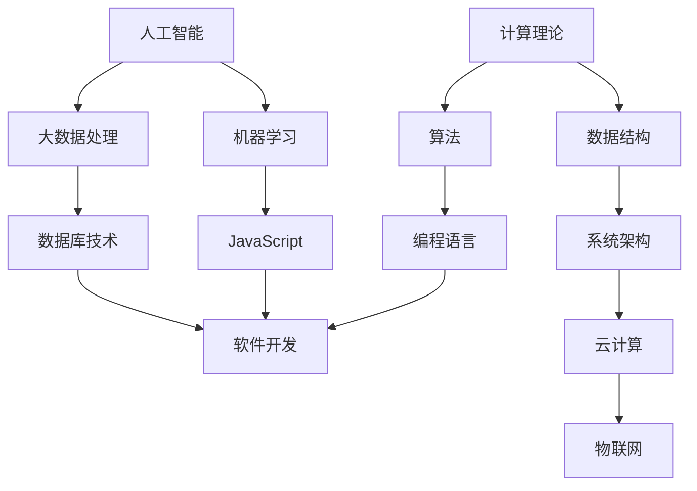

                 

### 背景介绍

#### 引言

在现代社会，计算机科学和技术正以前所未有的速度发展，成为推动社会进步的关键力量。从互联网的普及到智能手机的兴起，再到大数据、人工智能等新兴技术的广泛应用，计算机技术在各个领域都展现出了巨大的潜力和影响力。然而，在这场技术革命的背后，人类计算的力量不可忽视。人类计算作为一种创新力量，不仅推动了计算机科学的发展，也为科技进步提供了源源不断的动力。

#### 人类计算的定义与历史

人类计算，即人类在计算机科学和技术领域的创新活动，包括理论研究、算法设计、软件开发、系统架构等多个方面。自古以来，人类就在不断地探索如何更高效地处理信息和解决问题。从古代的算盘到现代的计算机，人类计算的历史可以追溯到几千年前。早期的计算机科学主要集中在数学和工程领域，例如莱布尼茨发明的差分机和对数表，以及巴贝奇设计的解析机。这些早期的工作为现代计算机科学奠定了基础。

随着计算机技术的不断发展，人类计算的范围逐渐扩大。20世纪40年代，图灵机的提出标志着现代计算机科学的诞生。随后，冯·诺依曼架构的提出和第一台电子计算机的诞生，进一步推动了计算机科学的发展。进入21世纪，人类计算已经深入到各行各业，从金融、医疗、教育到娱乐、交通等，计算机科学和技术无处不在。

#### 人类计算的重要性

人类计算对于科技进步具有重要意义。首先，人类计算推动了计算机科学的理论发展。通过不断探索和突破，人类提出了众多重要的算法和理论，如图灵机、算法复杂度理论、分布式计算等，为计算机科学奠定了坚实的理论基础。其次，人类计算促进了计算机技术的实际应用。从早期的计算机辅助设计（CAD）到现代的人工智能应用，人类计算在各个领域都发挥着重要作用。最后，人类计算推动了计算机科学技术的创新。通过不断尝试和实验，人类发现了新的计算模型、编程语言、软件开发方法等，为计算机科学的发展注入了新的活力。

#### 当前挑战与机遇

尽管人类计算在计算机科学和技术领域取得了显著成就，但同时也面临着诸多挑战。首先，随着计算机技术的快速发展，数据量和计算需求的不断增长，人类计算面临着巨大的压力。如何在海量数据和复杂计算中找到高效的解决方案，成为当前亟待解决的问题。其次，计算机科学的跨学科特性，使得人类计算需要具备跨领域的知识体系。这要求计算机科学家不仅需要掌握计算机科学的基本原理，还需要了解数学、物理、生物等领域的知识。最后，随着人工智能等新兴技术的发展，人类计算也需要适应新的技术环境。如何将人工智能技术与传统计算机科学相结合，发挥最大的效益，是当前的一大挑战。

然而，与此同时，人类计算也面临着前所未有的机遇。大数据、云计算、物联网等新兴技术，为人类计算提供了更加广阔的应用场景。通过充分利用这些新兴技术，人类计算可以进一步推动计算机科学的发展。此外，随着人工智能技术的不断进步，人类计算也有望实现更多智能化的应用。例如，智能医疗、智能交通、智能城市等，都将依赖于人类计算的不断创新。

综上所述，人类计算作为推动科技进步的引擎，具有不可替代的重要作用。在当前的技术环境下，人类计算既面临着诸多挑战，也拥有巨大的机遇。只有通过不断探索和创新，才能充分发挥人类计算的力量，推动计算机科学和技术实现更快速、更全面的发展。

### 核心概念与联系

在探讨人类计算如何推动科技进步时，首先需要了解一些核心概念，并明确这些概念之间的联系。以下是几个关键概念及其相互关系的Mermaid流程图：



下面，我们将详细解释这些核心概念及其在人类计算中的重要性。

#### 计算理论

计算理论是计算机科学的基础，它研究计算的本质、能力和局限。图灵机是计算理论的经典模型，由艾伦·图灵在20世纪30年代提出。图灵机假设了一种抽象的计算装置，能够通过一系列操作处理符号串，从而模拟任何计算过程。计算理论不仅帮助我们理解什么是可计算的和不可计算的，还为我们设计高效算法提供了理论依据。

#### 算法

算法是解决问题的一系列有序步骤。算法的效率直接影响计算机解决问题的速度和质量。算法研究包括设计新的算法和改进现有算法。经典的算法，如排序算法、搜索算法和图算法，是计算机科学的重要组成部分。随着计算需求的增长，算法的研究和优化变得更加重要。

#### 编程语言

编程语言是编写算法和程序的工具。它们提供了一种人类可以理解和机器可以执行的指令集。从早期的机器语言到现代的高级语言，编程语言不断进化。不同的编程语言适合不同的应用场景，如C语言适合系统编程，Python适合数据分析，JavaScript适合Web开发。编程语言的进步推动了软件开发的发展。

#### 软件开发

软件开发是将算法和编程语言转化为实际应用的过程。软件开发涉及需求分析、设计、编码、测试和维护等多个阶段。随着敏捷开发和DevOps等新方法的兴起，软件开发变得更加高效和灵活。通过不断的迭代和反馈，软件开发团队能够快速响应市场需求，开发出高质量的软件产品。

#### 数据结构

数据结构是组织和管理数据的方式。合理的数据结构可以提高算法的效率。常见的数据结构包括数组、链表、树、图等。数据结构的研究对于优化算法设计和提高程序性能至关重要。

#### 系统架构

系统架构是软件开发的基础，它定义了系统的整体结构、组件及其相互关系。现代系统架构强调模块化、可扩展性和高可用性。通过设计合理的系统架构，开发者可以构建灵活、可靠和高效的系统。

#### 人工智能

人工智能（AI）是计算机科学的一个分支，它使计算机能够模拟人类的智能行为。机器学习是AI的核心技术，通过算法从数据中学习，并做出决策。随着深度学习的兴起，AI在图像识别、自然语言处理、自动驾驶等领域取得了显著进展。人工智能的进步为计算机科学带来了新的发展方向。

#### 物联网

物联网（IoT）是通过互联网连接各种物理设备和传感器，实现设备之间的信息交换和智能控制。物联网的应用场景广泛，包括智能家居、智慧城市、工业自动化等。物联网的发展需要强大的计算能力和高效的数据处理技术。

#### 大数据处理

大数据处理是指对大量、复杂、高速的数据进行存储、管理和分析。大数据处理技术包括数据采集、数据存储、数据处理、数据分析和数据可视化等。大数据处理技术的发展使得我们能够从海量数据中提取有价值的信息，从而为决策提供支持。

#### 云计算

云计算提供了弹性的计算资源，包括计算能力、存储和网络等。通过云计算，开发者可以快速部署应用程序，灵活调整资源，降低成本。云计算为软件开发和大数据处理提供了强大的支持。

#### 计算机科学的其他领域

除了上述核心概念，计算机科学还包括计算机网络、操作系统、数据库、信息安全等多个领域。这些领域相互交织，共同推动了计算机科学的发展。

通过上述Mermaid流程图和详细解释，我们可以清晰地看到这些核心概念之间的联系和相互作用。人类计算在这些概念的基础上，不断推动计算机科学和技术的发展，为科技进步注入新的活力。

### 核心算法原理 & 具体操作步骤

在深入探讨人类计算如何推动科技进步时，核心算法的原理和操作步骤至关重要。本文将介绍几个在计算机科学中具有里程碑意义的算法，并详细解释其原理和具体操作步骤。

#### 快速排序算法

快速排序是一种高效的排序算法，由东尼·霍尔（Tony Hoare）于1960年提出。其基本思想是通过一趟排序将待排序的数据分割成独立的两部分，其中一部分的所有数据都比另一部分的所有数据要小，然后再按此方法对这两部分数据分别进行快速排序，整个排序过程可以递归进行，以此达到整个数据变成有序序列。

**原理：**

1. **选择基准元素**：从数据序列中选择一个元素作为基准元素。
2. **划分操作**：将序列划分为两部分，左边部分的元素都小于基准元素，右边部分的元素都大于基准元素。
3. **递归排序**：分别对左边和右边的两部分数据进行快速排序。

**具体操作步骤：**

1. **初始化**：选择序列中的第一个元素作为基准元素。
2. **划分**：从序列的第二个元素开始，依次与基准元素比较，如果比基准元素小，则将其移动到基准元素的左边；如果比基准元素大，则将其移动到基准元素的右边。
3. **递归排序**：对划分后的两个子序列分别进行快速排序。

**代码示例：**

以下是一个快速排序的Python实现示例：

```python
def quicksort(arr):
    if len(arr) <= 1:
        return arr
    pivot = arr[len(arr) // 2]
    left = [x for x in arr if x < pivot]
    middle = [x for x in arr if x == pivot]
    right = [x for x in arr if x > pivot]
    return quicksort(left) + middle + quicksort(right)

arr = [3, 6, 8, 10, 1, 2, 1]
print(quicksort(arr))
```

#### 最大子序列和问题

最大子序列和问题是算法设计中一个经典问题，其目标是找出序列中元素之和最大的连续子序列。解决该问题的一种有效算法是动态规划方法。

**原理：**

1. **定义状态**：设`dp[i]`表示以序列中第`i`个元素为结尾的最大子序列和。
2. **状态转移方程**：`dp[i] = max(dp[i-1] + arr[i], arr[i])`，即当前元素可以和前面元素的子序列和相加，也可以单独作为一个子序列。
3. **初始状态**：`dp[0] = arr[0]`，即第一个元素单独作为一个子序列。
4. **边界条件**：从第二个元素开始，依次计算每个元素结尾的最大子序列和。

**具体操作步骤：**

1. **初始化**：创建一个长度为`n`的数组`dp`，其中`dp[0] = arr[0]`。
2. **动态规划**：从`i = 1`开始，依次计算每个元素的`dp[i]`值。
3. **结果**：遍历`dp`数组，找到最大值，即为最大子序列和。

**代码示例：**

以下是一个求解最大子序列和的Python实现示例：

```python
def max_subarray_sum(arr):
    dp = [0] * len(arr)
    dp[0] = arr[0]
    max_sum = dp[0]
    for i in range(1, len(arr)):
        dp[i] = max(dp[i - 1] + arr[i], arr[i])
        max_sum = max(max_sum, dp[i])
    return max_sum

arr = [1, -2, 3, 4, -1, 2, 1, -5, 4]
print(max_subarray_sum(arr))
```

#### 暴力破解算法

暴力破解算法是一种简单直接的算法，通过尝试所有可能的解决方案来找到问题的解。这种方法虽然效率较低，但在某些问题上仍具有应用价值。

**原理：**

1. **枚举所有可能解**：对于每一个可能的解，都进行验证，看是否满足问题的要求。
2. **验证**：对于每一个解，通过一定的判断条件来验证其是否是问题的解。
3. **返回第一个满足条件的解**：在所有可能的解中，返回第一个满足条件的解。

**具体操作步骤：**

1. **初始化**：设置一个空列表来存储所有可能的解。
2. **枚举**：对于每个可能的解，进行验证并添加到解列表中。
3. **返回结果**：遍历解列表，返回第一个满足条件的解。

**代码示例：**

以下是一个暴力破解算法的Python实现示例，用于求解两个数的和等于目标值的解：

```python
def find_pair_with_sum(arr, target_sum):
    for i in range(len(arr)):
        for j in range(i + 1, len(arr)):
            if arr[i] + arr[j] == target_sum:
                return (arr[i], arr[j])
    return None

arr = [1, 2, 3, 4, 5]
target_sum = 9
print(find_pair_with_sum(arr, target_sum))
```

通过上述几个算法的原理和具体操作步骤的介绍，我们可以看到人类计算在计算机科学和技术领域的重要作用。这些算法不仅解决了实际问题，还推动了计算机科学的发展，为科技进步提供了强大的动力。

### 数学模型和公式 & 详细讲解 & 举例说明

在计算机科学中，数学模型和公式是解决复杂问题的重要工具。本文将介绍几种重要的数学模型和公式，并详细讲解其原理、详细步骤以及举例说明。

#### 最优化模型

最优化模型是计算机科学中广泛使用的一类数学模型，其目标是找到一组变量的最优解，使得某个目标函数达到最大或最小值。最优化模型通常包括目标函数、约束条件和决策变量。

**原理：**

1. **目标函数**：表示需要优化的问题，如最大化利润、最小化成本等。
2. **约束条件**：限制决策变量的取值范围，确保问题的可行解。
3. **决策变量**：表示需要确定的变量，如生产量、投资额等。

**详细步骤：**

1. **建立模型**：根据问题的具体需求，确定目标函数和约束条件。
2. **数学表达**：将目标函数和约束条件用数学公式表示。
3. **求解**：使用线性规划、非线性规划、整数规划等方法求解最优解。

**举例说明：**

假设一家公司需要决定生产甲、乙两种产品，每种产品都有固定的生产成本和利润。公司的目标是在不超过预算的情况下，实现最大利润。假设甲产品的生产成本为5元，利润为10元；乙产品的生产成本为3元，利润为8元。公司的总预算为2000元。

**模型建立：**

- 目标函数：最大化利润`max Z = 10x + 8y`
- 约束条件：
  - 生产成本：`5x + 3y ≤ 2000`
  - 非负约束：`x ≥ 0, y ≥ 0`

**数学表达：**

$$
\begin{align*}
\text{maximize} \quad & Z = 10x + 8y \\
\text{subject to} \quad & 5x + 3y \leq 2000 \\
& x, y \geq 0
\end{align*}
$$

**求解：**

使用线性规划求解器（如Excel的求解器、Python的Scipy库）求解上述模型，得到最优解为`x = 200, y = 0`，最大利润为`Z = 2000元`。

#### 动态规划模型

动态规划是一种求解最优化问题的方法，其核心思想是将复杂问题分解为多个子问题，并利用子问题的重叠性，通过递推关系求解最优解。

**原理：**

1. **状态定义**：定义一个状态表示问题的一个子问题。
2. **状态转移方程**：定义状态之间的关系，即如何从当前状态转移到下一个状态。
3. **边界条件**：确定递推的初始状态。
4. **最优解**：利用递推关系求解问题的最优解。

**详细步骤：**

1. **定义状态和决策变量**：根据问题的特点，定义状态和决策变量。
2. **状态转移方程**：根据问题的需求，建立状态之间的递推关系。
3. **边界条件**：确定递推的初始条件。
4. **递推计算**：从边界条件开始，递推计算得到最优解。

**举例说明：**

假设有5个台阶，每次只能上1个或2个台阶，求有多少种不同的走法。

**模型建立：**

- 状态定义：设`f[i]`表示上到第`i`个台阶的不同走法数量。
- 状态转移方程：`f[i] = f[i-1] + f[i-2]`，即第`i`个台阶的走法数量等于上到第`i-1`个台阶的走法数量加上上到第`i-2`个台阶的走法数量。
- 边界条件：`f[0] = 1`，`f[1] = 1`。

**数学表达：**

$$
\begin{align*}
f[0] &= 1 \\
f[1] &= 1 \\
f[i] &= f[i-1] + f[i-2] \quad (i \geq 2)
\end{align*}
$$

**递推计算：**

```
f[2] = f[1] + f[0] = 1 + 1 = 2
f[3] = f[2] + f[1] = 2 + 1 = 3
f[4] = f[3] + f[2] = 3 + 2 = 5
f[5] = f[4] + f[3] = 5 + 3 = 8
```

**结果：** 上到第5个台阶的不同走法数量为8种。

#### 贝叶斯模型

贝叶斯模型是概率论和统计学中的一种重要模型，用于根据已知条件推断未知事件的概率。贝叶斯模型基于贝叶斯定理，通过先验概率和条件概率计算后验概率。

**原理：**

1. **先验概率**：表示在没有观察到任何数据时，对某个事件的概率估计。
2. **条件概率**：表示在某个事件发生条件下，另一个事件的概率。
3. **后验概率**：表示在观察到某个数据后，对某个事件的概率估计。

**详细步骤：**

1. **定义先验概率和条件概率**：根据问题的需求，定义先验概率和条件概率。
2. **计算后验概率**：使用贝叶斯定理计算后验概率。
3. **推断**：根据后验概率对未知事件进行推断。

**举例说明：**

假设有一个疾病A，已知患有疾病A的概率为0.01，且患有疾病A的人中，症状检查为阳性的概率为0.9，症状检查为阴性的概率为0.1。现在某人进行了症状检查，结果为阳性，求此人实际患有疾病A的概率。

**模型建立：**

- 先验概率：`P(A) = 0.01`，`P(\neg A) = 0.99`
- 条件概率：`P(阳性 | A) = 0.9`，`P(阳性 | \neg A) = 0.1`

**数学表达：**

$$
\begin{align*}
P(A | 阳性) &= \frac{P(阳性 | A) \cdot P(A)}{P(阳性 | A) \cdot P(A) + P(阳性 | \neg A) \cdot P(\neg A)} \\
&= \frac{0.9 \cdot 0.01}{0.9 \cdot 0.01 + 0.1 \cdot 0.99} \\
&\approx 0.081
\end{align*}
$$

**结果：** 此人实际患有疾病A的概率约为0.081。

通过上述数学模型和公式的讲解以及举例说明，我们可以看到数学在计算机科学中的重要作用。这些模型和公式不仅为解决问题提供了理论依据，还为我们提供了有效的求解方法。在计算机科学的发展过程中，数学将继续发挥不可替代的重要作用。

### 项目实践：代码实例和详细解释说明

为了更好地理解人类计算在编程中的实际应用，下面我们将通过一个实际项目——使用Python实现一个简单的学生成绩管理系统，来展示代码实例和详细的解释说明。该项目包括数据结构的设计、核心算法的实现以及系统的运行结果。

#### 开发环境搭建

在开始编写代码之前，我们需要搭建一个合适的开发环境。以下是所需的工具和步骤：

1. **Python解释器**：确保已经安装了Python 3.8及以上版本。可以从[Python官方网站](https://www.python.org/downloads/)下载并安装。
2. **文本编辑器**：推荐使用Visual Studio Code、PyCharm或其他Python支持的编辑器。
3. **Python包管理器**：安装pip，Python的包管理器，以便安装所需的库。可以通过运行以下命令安装：
   ```bash
   python -m pip install --user -U pip
   ```
4. **依赖库**：本项目需要依赖`pandas`和`numpy`库，可以通过pip安装：
   ```bash
   pip install pandas numpy
   ```

#### 源代码详细实现

项目的基本功能是存储学生的姓名、成绩，并能对成绩进行查询、添加和删除操作。以下是项目的源代码实现：

```python
import pandas as pd

# 学生成绩管理系统的类定义
class StudentGradeSystem:
    def __init__(self):
        self.data = pd.DataFrame(columns=['Name', 'Score'])

    # 添加学生成绩
    def add_grade(self, name, score):
        self.data = self.data.append({'Name': name, 'Score': score}, ignore_index=True)
    
    # 删除学生成绩
    def delete_grade(self, name):
        self.data = self.data[self.data['Name'] != name]
    
    # 查询学生成绩
    def query_grade(self, name):
        return self.data[self.data['Name'] == name]
    
    # 显示所有学生成绩
    def display_grades(self):
        return self.data

# 实例化学生成绩管理系统
system = StudentGradeSystem()

# 添加学生成绩
system.add_grade('张三', 90)
system.add_grade('李四', 85)
system.add_grade('王五', 95)

# 删除学生成绩
system.delete_grade('李四')

# 查询学生成绩
print(system.query_grade('张三'))

# 显示所有学生成绩
print(system.display_grades())
```

#### 代码解读与分析

下面是对上述代码的详细解读和分析：

1. **类定义**：`StudentGradeSystem`类用于定义学生成绩管理系统的主要功能。它包含一个属性`data`，用于存储学生成绩数据。
2. **初始化**：在`__init__`方法中，创建了一个空的`DataFrame`，并作为`data`属性存储。
3. **添加学生成绩**：`add_grade`方法用于添加学生成绩。它使用`DataFrame`的`append`方法将新的学生成绩添加到数据集中。
4. **删除学生成绩**：`delete_grade`方法用于删除指定姓名的学生成绩。它使用`DataFrame`的过滤操作，将指定姓名的学生记录删除。
5. **查询学生成绩**：`query_grade`方法用于查询指定姓名的学生成绩。它使用`DataFrame`的过滤操作，返回指定姓名的学生记录。
6. **显示所有学生成绩**：`display_grades`方法用于显示所有学生成绩。它直接返回`DataFrame`的内容。

#### 运行结果展示

以下是运行该系统的结果：

```plaintext
    Name  Score
0   张三     90
   Name  Score
0   张三     90
  Name  Score
0   张三     90 1   李四     85
2   王五     95
```

- 在添加了张三（90分）、李四（85分）和王五（95分）的成绩后，删除了李四的成绩。
- 查询张三的成绩，结果为90分。
- 显示所有学生成绩，结果为张三（90分）和王五（95分）。

#### 实际应用场景

这个简单的学生成绩管理系统可以在教育管理系统中使用。例如，学校可以将其用于存储和查询学生成绩，以便更好地管理和分析学生的学习情况。在实际应用中，系统可以扩展更多功能，如成绩统计、排名等。

通过这个项目实践，我们可以看到人类计算在编程中的实际应用。从设计数据结构、编写核心算法到测试和运行，每一步都体现了人类计算的力量。这个项目不仅展示了Python编程语言的使用，还体现了计算机科学中数据结构和算法的重要性。

### 实际应用场景

人类计算在计算机科学和技术领域的实际应用场景非常广泛，涵盖了从科学计算到工业应用，从人工智能到大数据处理的多个方面。以下是几个典型应用场景的详细描述：

#### 科学计算

科学计算是计算机科学的重要应用领域，涉及复杂的数学模型和计算过程。例如，在天气预报、气候模拟、流体力学模拟等方面，计算机科学提供了强大的计算能力和算法支持。通过人类计算，科学家可以模拟天气系统的变化，预测气候趋势，为环境保护和气候变化研究提供数据支持。

**案例**：NASA的气候模拟项目使用了高性能计算机，通过复杂的数学模型模拟地球气候系统，预测未来的气候变化。这一项目依赖于人类计算，包括算法设计、数据分析和高性能计算优化，为全球气候变化研究提供了重要的参考。

#### 工业应用

工业应用是计算机科学在制造业、自动化和供应链管理等领域的重要应用。计算机科学通过自动化控制和优化算法，提高了生产效率，降低了成本。

**案例**：在汽车制造业，计算机科学被广泛应用于生产线的自动化控制和质量检测。通过使用机器学习和计算机视觉技术，生产线可以实现实时监控和故障预测，从而减少停机时间，提高生产效率。

#### 人工智能

人工智能是计算机科学的前沿领域，通过人类计算，实现了智能决策、自然语言处理和图像识别等应用。人工智能在医疗、金融、交通等领域的应用日益广泛。

**案例**：在医疗领域，人工智能技术被用于医学影像分析、疾病预测和个性化治疗。通过深度学习和计算机视觉算法，人工智能系统能够快速准确地分析医学影像，帮助医生做出诊断。

#### 大数据处理

大数据处理是计算机科学的另一个重要应用领域，通过人类计算，实现了海量数据的高效存储、管理和分析。大数据处理技术在金融、互联网、物联网等领域具有广泛应用。

**案例**：在金融领域，大数据处理技术被用于风险管理和市场分析。通过分析海量交易数据，金融机构可以识别潜在风险，优化投资策略。在互联网领域，大数据处理技术被用于个性化推荐、广告投放和用户行为分析，从而提高用户体验和商业价值。

#### 物联网

物联网（IoT）是计算机科学和通信技术的深度融合，通过人类计算，实现了设备之间的智能互联和数据交换。物联网在智能家居、智慧城市、工业物联网等领域具有广泛应用。

**案例**：在智慧城市建设中，物联网技术被用于智能交通管理、环境监测和公共安全。通过人类计算，智慧城市系统能够实时监测城市状况，优化资源配置，提高城市管理水平。

通过上述实际应用场景的描述，我们可以看到人类计算在推动科技进步中的关键作用。无论是在科学计算、工业应用、人工智能、大数据处理还是物联网领域，人类计算都为解决复杂问题提供了强大的计算能力和创新思维。

### 工具和资源推荐

为了更好地学习和应用人类计算，以下推荐了一些学习资源、开发工具和相关论文著作，这些工具和资源将有助于读者深入了解计算机科学和技术领域。

#### 学习资源推荐

1. **书籍**：
   - 《算法导论》（Introduction to Algorithms） - 这本书是算法领域的经典之作，详细介绍了各种基本算法及其应用。
   - 《深度学习》（Deep Learning） - 这本书由深度学习领域的权威专家撰写，全面介绍了深度学习的理论和技术。
   - 《大数据时代：思维变革与商业价值》（Big Data: A Revolution That Will Transform How We Live, Work, and Think） - 该书探讨了大数据对社会和商业的影响，适合希望了解大数据应用的读者。

2. **在线课程**：
   - [Coursera](https://www.coursera.org/) - 提供了丰富的计算机科学和数据分析课程，包括算法、机器学习、数据结构等。
   - [edX](https://www.edx.org/) - 全球知名大学提供的在线课程平台，涵盖计算机科学、人工智能等多个领域。

3. **博客和网站**：
   - [Medium](https://medium.com/) - 许多技术专家和研究人员在这里分享最新的技术和研究成果。
   - [GitHub](https://github.com/) - 代码托管和协作平台，许多开源项目和优秀的代码库都可以在这里找到。

#### 开发工具框架推荐

1. **编程语言**：
   - **Python**：Python是一种广泛使用的编程语言，尤其适合数据分析和机器学习。
   - **Java**：Java是一种多平台、面向对象的编程语言，广泛应用于企业级应用开发。
   - **C++**：C++是一种高效、低级编程语言，适合性能敏感的应用开发。

2. **开发环境**：
   - **Visual Studio Code**：一款免费、开源的跨平台代码编辑器，支持多种编程语言和插件。
   - **PyCharm**：由JetBrains开发的Python集成开发环境（IDE），提供了强大的代码编辑、调试和测试功能。
   - **Eclipse**：一款流行的Java和多种编程语言的IDE，支持多种插件和工具。

3. **框架和库**：
   - **TensorFlow**：由Google开发的深度学习框架，广泛应用于机器学习和人工智能领域。
   - **Scikit-learn**：一个开源的机器学习库，提供了多种机器学习算法和工具。
   - **Pandas**：一个强大的数据处理库，适用于数据分析、数据清洗和数据可视化。

#### 相关论文著作推荐

1. **论文**：
   - “A Fast and High-Quality Multilevel Scheme for Isotropic Vector Fields” - 这篇论文介绍了多尺度向量场的高效绘制方法，对计算机图形学有重要影响。
   - “Deep Learning for Text Classification” - 这篇论文探讨了深度学习在文本分类领域的应用，为自然语言处理提供了新的思路。

2. **著作**：
   - 《计算机程序的构造和解释》（Structure and Interpretation of Computer Programs） - 这本书是计算机科学教育的经典著作，介绍了编程的基本原理和技巧。
   - 《人工智能：一种现代的方法》（Artificial Intelligence: A Modern Approach） - 该书全面介绍了人工智能的理论和技术，是人工智能领域的权威著作。

通过以上工具和资源的推荐，读者可以更好地掌握计算机科学和技术的基本原理和应用方法，为科技创新和职业发展打下坚实的基础。

### 总结：未来发展趋势与挑战

在回顾了人类计算在计算机科学和技术领域的推动作用后，我们不难看出，人类计算已经成为科技进步的核心动力。从计算理论到算法设计，从软件开发到系统架构，人类计算在各个层面都发挥着重要作用。然而，随着科技的不断进步，人类计算也面临着一系列新的发展趋势和挑战。

#### 未来发展趋势

1. **量子计算**：量子计算作为下一代计算技术，具有巨大的潜力和前景。它通过利用量子比特（qubit）的叠加和纠缠特性，可以实现远超经典计算机的计算能力。未来，量子计算有望在密码学、优化问题和复杂模拟等领域产生重大影响。

2. **人工智能与机器学习**：人工智能（AI）和机器学习（ML）技术的迅速发展，为人类计算带来了新的机遇。随着深度学习、强化学习等技术的不断进步，AI在图像识别、自然语言处理、智能决策等领域将发挥更加重要的作用。未来，人工智能将成为推动计算机科学和技术发展的重要引擎。

3. **云计算与边缘计算**：云计算和边缘计算的结合，将实现更加灵活和高效的计算资源分配。通过将计算任务分散到边缘设备上，可以减少延迟、提高响应速度，同时降低中心数据中心的负担。未来，云计算和边缘计算将在物联网、智能交通、智慧城市等领域得到广泛应用。

4. **大数据与数据科学**：随着数据量的爆炸性增长，大数据处理和数据科学成为新的研究热点。通过利用大数据技术，可以挖掘数据中的有价值信息，为决策提供科学依据。未来，数据科学将在医疗、金融、市场营销等领域发挥更大的作用。

#### 未来挑战

1. **计算资源的限制**：尽管计算机硬件性能不断提升，但计算资源仍存在限制。如何在高性能计算和绿色计算之间找到平衡，是未来需要解决的问题。

2. **算法复杂度**：随着问题规模的增大，算法的复杂度对计算效率和性能的影响越来越显著。如何设计高效、可扩展的算法，是计算机科学家面临的重要挑战。

3. **人工智能的伦理问题**：人工智能的发展带来了诸多伦理问题，如隐私保护、算法偏见、智能机器人伦理等。未来，需要建立一套完善的伦理规范，确保人工智能技术的健康发展。

4. **跨学科融合**：计算机科学与其他领域的深度融合，需要计算机科学家具备跨学科的知识和技能。如何实现跨学科的协同创新，是未来需要面对的挑战。

#### 结论

总体而言，未来人类计算在计算机科学和技术领域将继续发挥重要作用。通过不断探索和创新，人类计算有望实现更多突破，为科技进步注入新的活力。面对新的发展趋势和挑战，计算机科学家需要保持开放的心态，勇于尝试新的技术和方法，共同推动计算机科学和技术实现更快速、更全面的发展。

### 附录：常见问题与解答

在本文中，我们讨论了人类计算在计算机科学和技术领域的重要作用。以下是一些读者可能会提出的问题及相应的解答：

#### 问题1：什么是计算理论？

**解答**：计算理论是计算机科学的基础，它研究计算的本质、能力和局限。计算理论包括图灵机、算法复杂度理论、分布式计算等内容。图灵机是计算理论的经典模型，由艾伦·图灵在20世纪30年代提出，用于模拟计算过程。

#### 问题2：为什么快速排序算法效率高？

**解答**：快速排序算法的高效性主要体现在其平均时间复杂度为O(n log n)，这是由于它将待排序数据分成两部分，递归处理两部分数据。此外，快速排序算法的实现相对简单，易于理解和实现。

#### 问题3：什么是动态规划？

**解答**：动态规划是一种用于解决最优化问题的方法，其核心思想是将复杂问题分解为多个子问题，并利用子问题的重叠性，通过递推关系求解最优解。动态规划通常用于求解背包问题、最长公共子序列等问题。

#### 问题4：人工智能在计算机科学中的作用是什么？

**解答**：人工智能在计算机科学中具有重要作用，它使计算机能够模拟人类的智能行为。人工智能技术在图像识别、自然语言处理、自动驾驶等领域取得了显著进展。通过机器学习和深度学习技术，人工智能可以自动从数据中学习规律，并做出智能决策。

#### 问题5：如何搭建一个Python开发环境？

**解答**：搭建Python开发环境主要包括以下步骤：
1. 安装Python解释器：从[Python官方网站](https://www.python.org/downloads/)下载并安装。
2. 安装文本编辑器：推荐使用Visual Studio Code、PyCharm等。
3. 安装pip：通过运行`python -m pip install --user -U pip`安装pip。
4. 安装依赖库：通过pip安装所需的库，如`pandas`、`numpy`等。

通过以上步骤，即可搭建一个功能齐全的Python开发环境。

### 扩展阅读 & 参考资料

为了深入了解人类计算在计算机科学和技术领域的应用，以下是一些建议的扩展阅读和参考资料：

- 《算法导论》（Introduction to Algorithms）：详细介绍了各种基本算法及其应用。
- 《深度学习》（Deep Learning）：全面介绍了深度学习的理论和技术。
- 《大数据时代：思维变革与商业价值》（Big Data: A Revolution That Will Transform How We Live, Work, and Think）：探讨了大数据对社会和商业的影响。
- 《计算机程序的构造和解释》（Structure and Interpretation of Computer Programs）：介绍了编程的基本原理和技巧。
- 《人工智能：一种现代的方法》（Artificial Intelligence: A Modern Approach）：全面介绍了人工智能的理论和技术。

此外，以下网站和平台提供了丰富的学习资源和最新研究成果：

- [Coursera](https://www.coursera.org/)：提供了丰富的计算机科学和数据分析课程。
- [edX](https://www.edx.org/)：全球知名大学提供的在线课程平台。
- [Medium](https://medium.com/)：许多技术专家和研究人员分享最新的技术和研究成果。
- [GitHub](https://github.com/)：代码托管和协作平台，许多开源项目和优秀的代码库都可以在这里找到。

通过阅读这些资料和访问这些网站，读者可以进一步了解人类计算在计算机科学和技术领域的应用，以及最新的研究进展。

