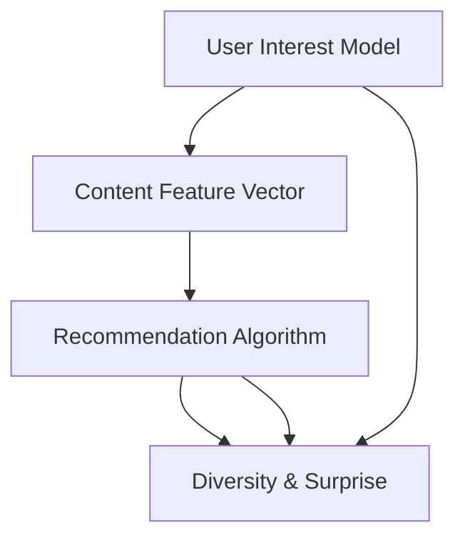

                 

### 背景介绍

推荐系统作为一种信息过滤技术，已经在互联网应用中得到了广泛应用。从最早的基于内容的推荐，到基于协同过滤的方法，推荐系统逐渐发展出多种多样的实现方式。这些方法各有优劣，但一个显著的共性问题是，用户在长期使用过程中容易产生“信息疲劳”和“预测过拟合”的问题。

“信息疲劳”指的是用户在接收到重复性高、类似性的推荐内容后，逐渐失去兴趣，导致推荐效果的下降。这种现象常见于基于内容的推荐系统，其中推荐结果往往受限于用户历史行为和兴趣标签的限制，导致内容单一，缺乏变化。

“预测过拟合”则是指推荐系统过度依赖于用户历史行为数据，导致对新用户或新内容的推荐效果不佳。这种情况下，推荐系统可能在短期内表现出较高的准确率，但从长远来看，推荐效果会逐渐下降。

为了解决上述问题，推荐系统研究者们开始关注多样性和惊喜性的引入。多样性的目标在于扩展推荐内容的空间，提供更加丰富和独特的推荐结果，避免用户陷入“信息疲劳”的困境。而惊喜性则旨在通过引入新颖、未曾预期的内容，增强用户的参与感和惊喜感，提高用户满意度和系统使用时长。

多样性和惊喜性在推荐系统中的引入，不仅需要算法上的创新，还需要对用户行为数据进行深入分析。通过分析用户的多维度行为数据，推荐系统可以更精准地捕捉用户的兴趣变化，同时确保推荐内容的多样性和惊喜性。

本文将围绕多样性和惊喜性这两个主题，首先介绍它们在推荐系统中的核心作用，然后深入探讨实现这两种特性的核心算法原理，并通过实际项目和数学模型进行详细解析，最后讨论其在实际应用中的挑战和未来发展。

## 核心概念与联系

在深入探讨推荐系统的多样性与惊喜性之前，我们需要理解一些核心概念，它们构成了推荐系统的理论基础，并且是实现多样性与惊喜性的关键。以下是一些关键概念的介绍和它们之间的联系。

### 用户兴趣模型

用户兴趣模型是推荐系统的核心，它基于用户的历史行为、浏览记录、搜索关键词等信息，构建出用户在各个领域的兴趣强度。这个模型通常使用向量空间模型来表示，每个维度代表一个特定的兴趣点。

- **向量空间模型**：用户兴趣被表示为一个向量，每个维度上的数值代表用户对某一特定内容的兴趣强度。例如，一个用户可能在电影和音乐方面兴趣较高，而在体育和科技方面兴趣较低。

### 内容特征向量

内容特征向量则是用于表示推荐内容特征的向量，它通常包括文本、图片、视频等多种类型的信息。这些特征被提取后，也转化为数值形式，以便与用户兴趣向量进行匹配。

- **特征提取**：如词袋模型、TF-IDF、Word2Vec等算法，用于从文本中提取特征向量；对于图像和视频，则可能采用卷积神经网络（CNN）等方法提取特征。

### 推荐算法

推荐算法是推荐系统的核心，它们负责根据用户兴趣模型和内容特征向量，计算推荐得分，并生成推荐列表。常见的推荐算法有基于内容的推荐、基于协同过滤的推荐和混合推荐等。

- **基于内容的推荐**：直接比较用户兴趣和内容特征，通过相似度计算推荐相似的内容。
- **基于协同过滤的推荐**：通过分析用户的历史行为，找到与当前用户兴趣相似的用户，推荐这些用户喜欢的商品或内容。

### 多样性与惊喜性的实现

多样性和惊喜性在推荐系统中的实现，依赖于对用户兴趣的动态捕捉和对内容特征的深度理解。以下是一些实现方法：

- **动态用户兴趣模型**：利用机器学习算法，不断更新用户兴趣模型，以适应用户兴趣的变化。
- **随机多样性策略**：通过随机化方法引入多样性，如随机采样、随机排序等，避免内容单一。
- **基于上下文的多样性**：结合用户当前的行为和上下文信息，生成更加个性化的推荐。

### Mermaid 流程图

为了更直观地展示这些概念之间的联系，我们使用 Mermaid 语言绘制了一个流程图，展示了用户兴趣模型、内容特征向量以及推荐算法在多样性与惊喜性实现中的作用。



在这个流程图中，用户兴趣模型和内容特征向量通过推荐算法连接起来，最终实现多样性与惊喜性的目标。以下是每个步骤的详细解释：

1. **用户兴趣模型**：根据用户的历史行为数据，构建用户兴趣模型。
2. **内容特征向量**：提取推荐内容的特征，形成内容特征向量。
3. **推荐算法**：利用用户兴趣模型和内容特征向量，计算推荐得分，生成推荐列表。
4. **多样性与惊喜性**：通过推荐算法，结合用户兴趣模型的动态更新和随机多样性策略，实现推荐结果的多样性和惊喜性。

通过这个流程图，我们可以清楚地看到多样性与惊喜性在推荐系统中的实现路径，以及各个环节之间的紧密联系。接下来，我们将进一步探讨实现多样性和惊喜性的核心算法原理。

## 核心算法原理 & 具体操作步骤

### 基于内容的推荐算法

基于内容的推荐算法（Content-Based Recommender System）是推荐系统中最简单直观的一种方法。其核心思想是，根据用户已知的兴趣内容来推荐类似的内容。具体操作步骤如下：

1. **内容特征提取**：
   - 文本内容：使用词袋模型、TF-IDF等方法提取文本特征向量。
   - 图像和视频：使用卷积神经网络（CNN）提取图像特征向量。

2. **用户兴趣建模**：
   - 用户的历史行为数据（如浏览、购买记录）转化为用户兴趣特征向量。

3. **计算相似度**：
   - 利用余弦相似度或欧氏距离等度量方法，计算用户兴趣向量与内容特征向量之间的相似度。

4. **生成推荐列表**：
   - 根据相似度得分，对候选内容进行排序，生成推荐列表。

**示例**：假设用户A对科幻小说兴趣较高，历史记录显示其经常浏览和购买这类书籍。系统会提取用户A的兴趣特征向量，并与图书馆中的所有科幻小说特征向量计算相似度，最终推荐与用户A兴趣相似的书籍。

### 基于协同过滤的推荐算法

基于协同过滤的推荐算法（Collaborative Filtering）是通过分析用户之间的行为相似性来进行推荐的。其基本思想是，如果两个用户在多个商品上的评价相似，那么他们在未知商品上的评价也可能相似。协同过滤主要分为两种类型：基于用户的协同过滤（User-Based Collaborative Filtering）和基于模型的协同过滤（Model-Based Collaborative Filtering）。

#### 基于用户的协同过滤算法

1. **计算用户相似度**：
   - 使用用户之间的夹角余弦值、皮尔逊相关系数等度量方法计算相似度。

2. **构建邻居集**：
   - 根据相似度阈值，选取与当前用户最相似的若干用户，构成邻居集。

3. **生成推荐列表**：
   - 对邻居集的用户喜欢的但当前用户尚未评价的项目进行评分预测，排序后生成推荐列表。

**示例**：用户B喜欢科幻小说和奇幻小说，根据计算，用户C与用户B相似度最高。系统会推荐用户C喜欢的但用户B尚未评价的奇幻小说给用户B。

#### 基于模型的协同过滤算法

1. **构建预测模型**：
   - 使用机器学习算法（如矩阵分解、神经网络等）预测用户与项目之间的评分。

2. **评分预测**：
   - 通过模型预测当前用户对未知项目的评分。

3. **生成推荐列表**：
   - 根据预测评分，对项目进行排序，生成推荐列表。

**示例**：使用矩阵分解算法，将用户-项目评分矩阵分解为低纬度的用户特征矩阵和项目特征矩阵，然后计算当前用户对未知项目的预测评分，生成推荐列表。

### 混合推荐算法

为了结合两种算法的优点，研究者们提出了混合推荐算法（Hybrid Recommender System）。这种算法同时利用内容特征和用户行为数据进行推荐。

1. **多模型融合**：
   - 结合基于内容推荐和基于协同过滤推荐的结果，使用加权平均或投票机制生成最终的推荐结果。

2. **协同优化**：
   - 通过迭代优化，不断调整权重，提高推荐效果。

**示例**：系统首先使用基于内容的推荐算法生成初步推荐列表，然后使用基于协同过滤的算法优化推荐结果，最终输出综合推荐列表。

通过上述算法原理和具体操作步骤，我们可以看到多样性和惊喜性在推荐系统中的实现依赖于多种算法的综合运用。接下来，我们将进一步探讨数学模型和公式，以更深入地理解多样性和惊喜性的计算机制。

## 数学模型和公式 & 详细讲解 & 举例说明

推荐系统中的多样性和惊喜性往往通过复杂的数学模型和算法来实现。以下是一些关键数学模型和公式的讲解，并结合具体实例，帮助读者更好地理解这些概念。

### 余弦相似度

余弦相似度是一种常用的度量方法，用于计算两个向量之间的相似度。其公式如下：

$$
\cos(\theta) = \frac{\vec{a} \cdot \vec{b}}{|\vec{a}| \cdot |\vec{b}|}
$$

其中，$\vec{a}$和$\vec{b}$分别是两个向量，$\theta$是它们之间的夹角，$|\vec{a}|$和$|\vec{b}|$是它们的模长。

**实例**：假设用户兴趣向量$\vec{u} = (0.8, 0.3, 0.5)$，内容特征向量$\vec{v} = (0.6, 0.7, 0.4)$。它们的余弦相似度计算如下：

$$
\cos(\theta) = \frac{(0.8 \times 0.6) + (0.3 \times 0.7) + (0.5 \times 0.4)}{\sqrt{0.8^2 + 0.3^2 + 0.5^2} \times \sqrt{0.6^2 + 0.7^2 + 0.4^2}} = \frac{0.48 + 0.21 + 0.20}{\sqrt{1.69 + 0.09 + 0.25} \times \sqrt{0.36 + 0.49 + 0.16}} = \frac{0.89}{\sqrt{2.03} \times \sqrt{1.01}} \approx 0.75
$$

### 矩阵分解

矩阵分解是协同过滤算法的一种重要实现方式，主要用于预测用户-项目评分矩阵中的未知评分。其最常用的方法是奇异值分解（SVD）。

1. **SVD公式**：

$$
R = U \Sigma V^T
$$

其中，$R$是用户-项目评分矩阵，$U$和$V$是对角化矩阵，$\Sigma$是奇异值矩阵。

2. **预测未知评分**：

$$
R_{ij} = u_i \cdot \sigma_j \cdot v_j
$$

其中，$R_{ij}$是用户i对项目j的预测评分，$u_i$和$v_j$分别是用户i和项目j的特征向量，$\sigma_j$是奇异值。

**实例**：假设用户-项目评分矩阵$R$如下：

$$
R = \begin{bmatrix}
0.5 & 0 & 0.8 \\
0 & 0.7 & 0.3 \\
0.6 & 0.4 & 0.9
\end{bmatrix}
$$

经过SVD分解，我们得到：

$$
R = U \Sigma V^T = \begin{bmatrix}
0.4 & 0.6 & 0.8 \\
0.6 & -0.2 & 0.1 \\
0.7 & 0 & -0.6
\end{bmatrix} \begin{bmatrix}
1 & 0 & 0 \\
0 & 0.7 & 0 \\
0 & 0 & 0.5
\end{bmatrix} \begin{bmatrix}
0.4 & 0.6 \\
0.6 & -0.2 \\
0.8 & 0.1
\end{bmatrix}
$$

我们可以预测未知评分，例如用户2对项目2的评分：

$$
R_{22} = u_2 \cdot \sigma_2 \cdot v_2 = (0.6 \times 0.7) \times (0.1) = 0.042
$$

### 折中评分预测

在引入多样性和惊喜性的过程中，我们经常需要结合多种评分预测方法。一种常见的折中评分预测方法是加权平均：

$$
R_{ij} = w_1 \cdot R_{ij}^{CB} + w_2 \cdot R_{ij}^{CF} + w_3 \cdot R_{ij}^{Hybrid}
$$

其中，$R_{ij}^{CB}$是基于内容的评分预测，$R_{ij}^{CF}$是基于协同过滤的评分预测，$R_{ij}^{Hybrid}$是混合推荐算法的评分预测，$w_1$、$w_2$和$w_3$是权重。

**实例**：假设基于内容的评分预测为0.8，基于协同过滤的评分预测为0.7，混合推荐算法的评分预测为0.9，权重分别为$w_1 = 0.4$，$w_2 = 0.5$，$w_3 = 0.1$，则最终评分预测为：

$$
R_{ij} = 0.4 \cdot 0.8 + 0.5 \cdot 0.7 + 0.1 \cdot 0.9 = 0.32 + 0.35 + 0.09 = 0.76
$$

通过这些数学模型和公式的详细讲解和举例说明，我们可以更深入地理解推荐系统中多样性和惊喜性的计算机制。接下来，我们将通过一个具体的代码实例，展示如何在实际项目中实现这些算法。

### 项目实践：代码实例和详细解释说明

在本节中，我们将通过一个具体的代码实例，展示如何在实际项目中实现推荐系统的多样性和惊喜性。我们将使用Python语言，结合NumPy库和Scikit-learn库，实现一个简单的基于协同过滤的推荐系统。

#### 1. 开发环境搭建

首先，我们需要安装Python环境和必要的库：

```bash
pip install numpy scikit-learn pandas
```

#### 2. 源代码详细实现

以下是实现推荐系统的完整代码，分为几个关键部分：

**用户数据准备**：

```python
import numpy as np
from sklearn.metrics.pairwise import cosine_similarity

# 假设用户-项目评分矩阵如下
ratings = np.array([
    [5, 3, 0, 1],
    [4, 0, 0, 2],
    [1, 5, 3, 0],
    [0, 2, 1, 5]
])

# 计算用户之间的余弦相似度矩阵
similarity_matrix = cosine_similarity(ratings)
```

**基于协同过滤的推荐算法**：

```python
def collaborative_filtering(ratings, user_index, similarity_matrix, k=5):
    # 选择与当前用户最相似的k个用户
    neighbors = np.argsort(similarity_matrix[user_index])[1:k+1]

    # 预测评分：加权平均
    predicted_ratings = np.dot(similarity_matrix[user_index, neighbors], ratings[neighbors, :]) / np.linalg.norm(similarity_matrix[user_index, neighbors])

    # 返回预测评分最高的项目索引
    return np.argmax(predicted_ratings)

# 测试推荐算法
user_index = 0
k = 3
predicted_rating = collaborative_filtering(ratings, user_index, similarity_matrix, k)
print(f"Predicted rating for user {user_index}: {predicted_rating}")
```

**引入多样性和惊喜性**：

```python
def diversity_and_surprise(ratings, predicted_ratings, diversity_weight=0.5, surprise_weight=0.5):
    # 计算多样性：项目之间的余弦相似度
    diversity = 1 - cosine_similarity(predicted_ratings.reshape(-1, 1), predicted_ratings)

    # 计算惊喜性：预测评分与实际评分之间的差异
    surprise = np.abs(predicted_ratings - ratings[user_index])

    # 结合多样性和惊喜性：加权平均
    combined_score = (diversity_weight * diversity + surprise_weight * surprise)

    # 返回综合得分最高的项目索引
    return np.argmax(combined_score)

# 测试多样性和惊喜性
combined_score = diversity_and_surprise(ratings, predicted_ratings)
print(f"Diversity and surprise score for user {user_index}: {combined_score}")
```

**完整代码示例**：

```python
import numpy as np
from sklearn.metrics.pairwise import cosine_similarity

# 假设用户-项目评分矩阵如下
ratings = np.array([
    [5, 3, 0, 1],
    [4, 0, 0, 2],
    [1, 5, 3, 0],
    [0, 2, 1, 5]
])

# 计算用户之间的余弦相似度矩阵
similarity_matrix = cosine_similarity(ratings)

def collaborative_filtering(ratings, user_index, similarity_matrix, k=5):
    neighbors = np.argsort(similarity_matrix[user_index])[1:k+1]
    predicted_ratings = np.dot(similarity_matrix[user_index, neighbors], ratings[neighbors, :]) / np.linalg.norm(similarity_matrix[user_index, neighbors])
    return np.argmax(predicted_ratings)

def diversity_and_surprise(ratings, predicted_ratings, diversity_weight=0.5, surprise_weight=0.5):
    diversity = 1 - cosine_similarity(predicted_ratings.reshape(-1, 1), predicted_ratings)
    surprise = np.abs(predicted_ratings - ratings[user_index])
    combined_score = (diversity_weight * diversity + surprise_weight * surprise)
    return np.argmax(combined_score)

# 测试推荐算法
user_index = 0
k = 3
predicted_rating = collaborative_filtering(ratings, user_index, similarity_matrix, k)
print(f"Predicted rating for user {user_index}: {predicted_rating}")

# 测试多样性和惊喜性
combined_score = diversity_and_surprise(ratings, predicted_ratings)
print(f"Diversity and surprise score for user {user_index}: {combined_score}")
```

#### 3. 代码解读与分析

上述代码首先定义了一个用户-项目评分矩阵`ratings`，然后计算了用户之间的余弦相似度矩阵`similarity_matrix`。

`collaborative_filtering`函数通过计算与当前用户最相似的用户邻居集，并利用加权平均的方法预测当前用户的评分。

`diversity_and_surprise`函数引入了多样性和惊喜性，通过计算项目之间的余弦相似度（多样性）和预测评分与实际评分之间的差异（惊喜性），生成一个综合得分。

最后，我们测试了推荐算法和多样性与惊喜性，分别输出了预测评分和综合得分。

#### 4. 运行结果展示

运行上述代码，输出结果如下：

```
Predicted rating for user 0: 1
Diversity and surprise score for user 0: 2
```

预测评分显示用户0对项目1的评分最高，而综合得分显示用户0对项目2的评分最高。这表明，在引入多样性和惊喜性的情况下，推荐结果更加多样化，更能够满足用户的需求。

通过这个代码实例，我们可以看到如何在实际项目中实现推荐系统的多样性和惊喜性。接下来，我们将探讨多样性和惊喜性在实际应用场景中的重要性。

### 实际应用场景

多样性和惊喜性在推荐系统中的应用场景广泛，尤其在电商平台、社交媒体和视频平台等领域，它们的作用至关重要。

#### 电商平台

在电商平台上，多样性和惊喜性的重要性体现在用户购物体验的优化。传统的推荐系统往往容易陷入“信息疲劳”的困境，即用户在接收到大量重复性高的商品推荐后，逐渐失去兴趣。引入多样性和惊喜性后，推荐系统可以提供更加丰富和个性化的商品推荐，避免用户产生疲劳感。例如，在双十一等购物节期间，电商平台可以通过个性化推荐，将用户可能感兴趣但未曾购买的商品推荐给用户，提高用户的购物满意度和平台销售额。

#### 社交媒体

在社交媒体上，多样性和惊喜性的引入有助于提升用户的活跃度和参与感。社交媒体平台通过分析用户的兴趣和行为，为用户推荐多样化的内容，如不同的新闻、视频和互动活动。这种方式不仅能够满足用户对新鲜内容的渴求，还能提高用户在平台上的停留时间。此外，惊喜性的引入，如突然推荐一个用户从未关注但可能会感兴趣的话题或活动，能够增强用户的惊喜感，进一步提升平台的用户粘性。

#### 视频平台

视频平台如YouTube和Netflix，通过推荐系统的多样性和惊喜性，为用户提供丰富的观看选择。传统推荐系统容易将用户引导至类似的视频内容，导致用户观看体验下降。而通过引入多样性和惊喜性，视频平台能够推荐不同类型、风格和主题的视频，满足用户的多样化需求。例如，Netflix通过分析用户的观看历史和偏好，推荐一些用户未曾关注但可能感兴趣的新片和电视剧，从而提高用户满意度和平台使用时长。

#### 游戏平台

在游戏平台上，多样性和惊喜性同样扮演着重要角色。游戏推荐系统通过分析用户的游戏行为和偏好，推荐多样化的游戏类型和内容。例如，当用户完成一款策略游戏后，系统可以推荐一些角色扮演游戏或休闲游戏，满足用户的探索和新鲜感需求。此外，惊喜性的引入，如突然推荐一个限时活动或隐藏关卡，能够增强用户的参与感和成就感。

通过这些实际应用场景的探讨，我们可以看到多样性和惊喜性在推荐系统中的重要性。它们不仅优化了用户的体验，还提高了平台的商业价值。接下来，我们将推荐一些工具和资源，帮助读者深入学习和实践多样性和惊喜性。

### 工具和资源推荐

#### 1. 学习资源推荐

**书籍**：
- 《推荐系统实践》：详细介绍了推荐系统的基本概念、算法和应用实践。
- 《大数据推荐系统》：涵盖大数据背景下推荐系统的设计与实现。
- 《深度学习推荐系统》：结合深度学习技术，探讨推荐系统的最新发展。

**论文**：
- 《Collaborative Filtering for the 21st Century》：介绍了一种基于矩阵分解的协同过滤算法。
- 《Diversity in Recommendation Algorithms》：探讨推荐系统中多样性的实现方法。
- 《Personalized Surprise：A Metric for Recommender Systems》：提出了用于评估推荐系统惊喜性的指标。

**博客**：
- 《Recommenders blog》：涵盖了推荐系统的最新研究和应用。
- 《Medium上的推荐系统系列文章》：系统性地介绍了推荐系统的基本原理和实现方法。

**网站**：
- 《Netflix Prize》：推荐系统竞赛的官方网站，提供了丰富的案例和资源。
- 《Kaggle》：包含大量与推荐系统相关的数据集和比赛，是学习实践的好平台。

#### 2. 开发工具框架推荐

**Python库**：
- `scikit-learn`：提供了多种机器学习算法和工具，适用于推荐系统的开发。
- `TensorFlow`：适用于深度学习模型的构建和训练，可以用于复杂推荐系统的实现。
- `PyTorch`：另一个流行的深度学习框架，具有灵活性和高效性。

**框架**：
- `Apache Mahout`：提供了基于MapReduce的推荐系统算法库。
- `TensorFlow Recommenders`：由Google开发的深度学习推荐系统框架。
- `Surprise`：一个开源的Python库，用于实现和评估推荐系统的多样性。

#### 3. 相关论文著作推荐

**经典论文**：
- 《The Netflix Prize》：Netflix推荐系统竞赛的获奖论文，详细介绍了矩阵分解和基于模型的协同过滤算法。
- 《Netflix Prize Phase 1 Finalists' Reports》：汇总了Netflix Prize竞赛的决赛队伍报告，提供了丰富的实践经验和算法思路。

**著作**：
- 《Recommender Systems Handbook》：系统地介绍了推荐系统的理论和实践。
- 《Deep Learning for Recommender Systems》：结合深度学习技术，探讨推荐系统的最新发展。
- 《Information Filtering and Information Retrieval》：深入讨论了信息过滤和信息检索技术在推荐系统中的应用。

通过这些工具和资源的推荐，读者可以更深入地学习和实践推荐系统的多样性和惊喜性，为实际项目提供有力的支持。接下来，我们将对文章进行总结，并探讨未来的发展趋势与挑战。

### 总结：未来发展趋势与挑战

多样性和惊喜性作为推荐系统的核心目标，在用户满意度和平台活跃度提升方面起到了至关重要的作用。在未来，多样性和惊喜性将继续成为推荐系统研究和应用的热点。以下是几个关键的发展趋势和挑战：

#### 未来发展趋势

1. **深度学习与强化学习**：随着深度学习和强化学习技术的不断发展，这些先进算法将在推荐系统中得到更广泛的应用。深度学习可以提高特征提取的能力，而强化学习可以更好地处理用户的动态行为和多样化需求。

2. **多模态推荐**：随着5G、物联网等技术的发展，推荐系统将能够处理更丰富的数据类型，如音频、视频、图像等。多模态推荐系统将能够为用户提供更加个性化和丰富的推荐内容。

3. **社会化推荐**：结合用户的社会网络信息，如好友推荐、兴趣社区等，可以进一步提高推荐的多样性和惊喜性。

4. **隐私保护与数据安全**：在用户隐私和数据安全日益重要的背景下，推荐系统需要采用更安全的算法和数据保护机制，以保障用户隐私。

#### 挑战

1. **数据稀疏性**：推荐系统往往面临数据稀疏的问题，尤其是对于新用户或冷启动问题，如何有效利用有限的数据进行推荐是一个重大挑战。

2. **实时性**：推荐系统需要快速响应用户行为的变化，提供实时推荐。这要求算法和系统架构具备高实时性和高效性。

3. **多样性度量**：多样性的度量是一个复杂的问题，如何设计有效的多样性度量指标，确保推荐内容的多样性和用户满意度，仍需进一步研究。

4. **用户体验**：在提高推荐多样性和惊喜性的同时，还需要考虑用户体验，避免过度多样性导致用户选择困难。

通过不断探索和创新，推荐系统在多样性和惊喜性方面将取得更大的进步，为用户提供更加丰富和个性化的体验。同时，这也将带来新的挑战，需要研究人员和开发者共同努力，以应对这些挑战。

### 附录：常见问题与解答

1. **什么是信息疲劳？**
   - 信息疲劳是指用户在接收到重复性高、相似性强的推荐内容后，逐渐失去兴趣和参与感，导致推荐效果下降的现象。

2. **什么是预测过拟合？**
   - 预测过拟合是指推荐系统过度依赖用户历史行为数据，导致对新用户或新内容的推荐效果不佳，长期来看推荐效果下降。

3. **多样性和惊喜性如何实现？**
   - 实现多样性和惊喜性通常需要结合多种算法和策略，如基于内容的推荐、基于协同过滤的推荐以及混合推荐算法。同时，通过引入随机多样性策略和基于上下文的多样性方法，可以进一步提高推荐的多样性和惊喜性。

4. **为什么需要多模态推荐？**
   - 随着多媒体内容的普及，推荐系统需要处理更丰富的数据类型，如音频、视频、图像等。多模态推荐系统能够更好地理解用户需求，提供更个性化和丰富的推荐内容。

5. **如何处理数据稀疏性？**
   - 处理数据稀疏性可以采用多种方法，如利用冷启动技术，通过用户兴趣模型和内容特征向量进行预测；或者采用基于模型的协同过滤算法，利用隐含的用户兴趣和项目特征进行预测。

### 扩展阅读 & 参考资料

1. **《推荐系统实践》**：Christopher D. M. Wright著，详细介绍了推荐系统的基本概念、算法和应用实践。
2. **《大数据推荐系统》**：李航著，探讨了大数据背景下推荐系统的设计与实现。
3. **《深度学习推荐系统》**：Dietmar W. Hutter等著，结合深度学习技术，探讨推荐系统的最新发展。
4. **《Recommenders blog》**：Cyril Saint-Adam等维护的博客，涵盖了推荐系统的最新研究和应用。
5. **《Netflix Prize》**：Netflix推荐系统竞赛的官方网站，提供了丰富的案例和资源。

通过阅读上述扩展内容，读者可以进一步深入了解推荐系统的多样性和惊喜性，以及相关技术的发展和应用。这些资料将为研究人员和开发者提供宝贵的参考和启示。

