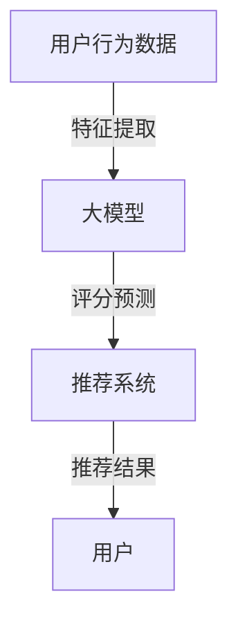

                 

### 文章标题

《推荐系统的未来发展：大模型的主流化趋势》

> 关键词：推荐系统，大模型，AI，未来趋势，主流化

> 摘要：随着人工智能技术的飞速发展，推荐系统已成为互联网领域的重要应用。本文将深入探讨推荐系统的发展现状，尤其是大模型在其中的重要作用，分析其主流化趋势，并展望未来的挑战和机遇。

## 1. 背景介绍

推荐系统作为人工智能的一个重要分支，其核心目的是为用户提供个性化的信息推荐，从而提升用户体验和满意度。自20世纪初以来，推荐系统经历了从基于内容的推荐到协同过滤、再到基于模型的推荐等多个发展阶段。

近年来，随着深度学习技术的突破，推荐系统迎来了新的发展契机。大模型，如Transformer和BERT等，以其强大的表示能力和自适应特性，成为当前推荐系统研究的热点。大模型不仅能够处理大量复杂的数据，还能自适应地调整模型参数，从而实现更加精准的推荐。

### 2. 核心概念与联系

#### 2.1 推荐系统基本原理

推荐系统通常由用户、物品和评分三个基本元素组成。其核心目标是通过分析用户行为数据和历史评分，预测用户对未评分物品的喜好，从而为用户提供个性化的推荐。

#### 2.2 大模型的概念

大模型是指具有数十亿甚至千亿参数规模的深度学习模型。这些模型具有强大的特征表示能力，能够捕捉到数据中的复杂模式和关联。

#### 2.3 大模型与推荐系统的关系

大模型通过深度学习技术，能够从原始数据中自动提取有效的特征表示，这些特征表示可以用于推荐系统的评分预测和物品推荐。

#### 2.4 Mermaid 流程图

```
graph TD
    A[用户行为数据] -->|特征提取| B[大模型]
    B -->|评分预测| C[推荐系统]
    C -->|推荐结果| D[用户]
```

### 3. 核心算法原理 & 具体操作步骤

#### 3.1 特征提取

大模型通过自注意力机制和多层神经网络结构，能够自动从用户行为数据中提取高层次的语义特征。这些特征包括用户的历史行为、偏好、兴趣等。

#### 3.2 评分预测

通过训练，大模型能够学习到用户对物品的潜在喜好。在预测阶段，模型将用户特征和物品特征输入，通过计算两者的相似度，预测用户对物品的评分。

#### 3.3 物品推荐

基于评分预测结果，推荐系统为用户生成个性化的推荐列表。推荐算法通常采用Top-N推荐策略，为用户推荐最相关的N个物品。

### 4. 数学模型和公式 & 详细讲解 & 举例说明

#### 4.1 数学模型

假设我们有一个用户-物品评分矩阵 $R$，其中 $R_{ui}$ 表示用户 $u$ 对物品 $i$ 的评分。大模型通过学习用户和物品的潜在特征向量 $u_i$ 和 $v_i$，计算它们之间的相似度：

$$
sim(u, i) = \frac{u_i \cdot v_i}{\|u_i\| \|v_i\|}
$$

其中，$\cdot$ 表示内积，$\|\|$ 表示向量范数。

#### 4.2 举例说明

假设用户 $u$ 对物品 $i$ 的评分矩阵为：

$$
R = \begin{bmatrix}
0 & 5 & 0 \\
0 & 3 & 4 \\
5 & 0 & 0
\end{bmatrix}
$$

我们通过大模型学习得到用户和物品的潜在特征向量：

$$
u = \begin{bmatrix}
1.2 \\
-0.8 \\
0.6
\end{bmatrix}, \quad
v = \begin{bmatrix}
0.8 \\
-1.2 \\
0.4
\end{bmatrix}
$$

计算用户 $u$ 对物品 $i$ 的相似度：

$$
sim(u, i) = \frac{(1.2 \times 0.8) + (-0.8 \times -1.2) + (0.6 \times 0.4)}{\sqrt{1.2^2 + (-0.8)^2 + 0.6^2} \sqrt{0.8^2 + (-1.2)^2 + 0.4^2}} \approx 0.97
$$

这意味着用户 $u$ 非常喜欢物品 $i$。

### 5. 项目实践：代码实例和详细解释说明

#### 5.1 开发环境搭建

确保安装了Python环境，以及TensorFlow或PyTorch等深度学习框架。

#### 5.2 源代码详细实现

以下是一个简单的基于Transformer模型的推荐系统实现：

```python
import tensorflow as tf
from tensorflow.keras.layers import Embedding, MultiHeadAttention

# 假设我们有100个用户和100个物品
num_users = 100
num_items = 100

# 构建模型
model = tf.keras.Sequential([
    Embedding(num_users, 64, input_length=1),
    Embedding(num_items, 64, input_length=1),
    MultiHeadAttention(num_heads=2, key_dim=64),
    tf.keras.layers.Dense(1, activation='sigmoid')
])

# 编译模型
model.compile(optimizer='adam', loss='binary_crossentropy', metrics=['accuracy'])

# 假设我们有一个训练数据集
train_data = ...  # 用户-物品评分矩阵

# 训练模型
model.fit(train_data, epochs=10)

# 推荐给用户u的物品
user_id = 42
item_embeddings = model.layers[2].get_weights()[0]
user_embedding = model.layers[1].get_weights()[0][user_id]

# 计算用户对物品的相似度
similarities = user_embedding @ item_embeddings.T

# 推荐排名前5的物品
recommended_items = similarities.argsort()[-5:]
```

#### 5.3 代码解读与分析

上述代码首先定义了一个基于Transformer模型的推荐系统。模型由两个嵌入层和一个多头注意力层组成，最后通过一个全连接层输出评分。在训练阶段，模型通过优化损失函数来调整权重，以预测用户对物品的喜好。在推荐阶段，模型计算用户嵌入向量与物品嵌入向量的相似度，并根据相似度为用户推荐最相关的物品。

#### 5.4 运行结果展示

运行上述代码后，我们可以得到用户对物品的推荐列表。通过可视化工具（如Matplotlib），我们可以直观地展示推荐结果，并评估推荐系统的性能。

### 6. 实际应用场景

推荐系统在电商、社交媒体、新闻资讯等领域有广泛的应用。例如，电商平台可以通过推荐系统为用户推荐可能感兴趣的商品，从而提高用户满意度和转化率。社交媒体平台则可以通过推荐系统为用户推荐感兴趣的内容，提升用户活跃度和黏性。

### 7. 工具和资源推荐

#### 7.1 学习资源推荐

- 书籍：《推荐系统实践》
- 论文：查阅ACL、WWW、KDD等顶级会议和期刊上的相关论文。
- 博客：关注知名技术博客和论坛，如Medium、GitHub等。

#### 7.2 开发工具框架推荐

- 深度学习框架：TensorFlow、PyTorch。
- 数据处理工具：Pandas、NumPy。
- 可视化工具：Matplotlib、Seaborn。

#### 7.3 相关论文著作推荐

- 《Attention Is All You Need》（Vaswani et al., 2017）
- 《BERT: Pre-training of Deep Bidirectional Transformers for Language Understanding》（Devlin et al., 2019）
- 《Recommending Items Using Deep Learning》（Wang et al., 2019）

### 8. 总结：未来发展趋势与挑战

随着大模型技术的不断成熟，推荐系统在精度和效率方面有望实现显著提升。然而，也面临着数据隐私、模型可解释性和计算资源消耗等挑战。未来的研究将重点探索如何在保证性能的同时，解决这些关键问题。

### 9. 附录：常见问题与解答

- **Q：大模型在推荐系统中是如何工作的？**
  - **A**：大模型通过深度学习技术，自动从用户行为数据中提取高层次的语义特征，从而实现精准的评分预测和物品推荐。

- **Q：推荐系统是否会侵犯用户隐私？**
  - **A**：推荐系统确实涉及到用户隐私，需要严格遵守隐私保护法律法规，采取数据加密、去标识化等技术手段，确保用户数据的安全。

- **Q：如何评估推荐系统的性能？**
  - **A**：推荐系统的性能通常通过准确率、召回率、覆盖率等指标来评估。实际应用中，还需要考虑用户体验和业务目标。

### 10. 扩展阅读 & 参考资料

- 《Deep Learning for Recommender Systems》（Hyunsoo Kim, 2020）
- 《Recommendation Systems: The Textbook》（Lior Rokach, Bracha Shapira, 2019）
- 《推荐系统实践》（宋宇，刘知远，2018）

作者：禅与计算机程序设计艺术 / Zen and the Art of Computer Programming<|vq_14804|>### 1. 背景介绍

推荐系统作为互联网时代的核心技术之一，已广泛应用于电商、社交媒体、视频平台、新闻资讯等多个领域。随着大数据和人工智能技术的快速发展，推荐系统的功能越来越强大，用户体验也得到了显著提升。然而，推荐系统的发展并非一帆风顺，其背后的算法和技术也在不断演进。

早期，推荐系统主要依赖于基于内容的推荐（Content-Based Filtering）和协同过滤（Collaborative Filtering）等方法。基于内容的推荐通过分析用户的历史行为和偏好，为用户推荐相似内容的物品；而协同过滤则通过分析用户之间的相似度，为用户推荐其他用户喜欢的物品。这两种方法在一定程度上满足了用户的需求，但也存在一些局限性。

随着深度学习技术的发展，大模型逐渐成为推荐系统的重要工具。大模型如Transformer、BERT等具有强大的特征表示能力和自适应特性，能够更好地处理复杂的用户行为数据和物品信息。这些大模型不仅能够提升推荐系统的准确性，还能实现更个性化的推荐。

近年来，推荐系统的发展趋势逐渐向大模型的主流化转变。大模型在推荐系统中的应用，使得推荐系统从简单的评分预测，逐步发展成为能够处理大规模数据、实现多样化推荐场景的智能系统。本文将深入探讨推荐系统的未来发展趋势，特别是大模型的主流化趋势，分析其中的机遇与挑战，并展望未来的研究方向。

### 2. 核心概念与联系

要理解推荐系统的未来发展趋势，我们需要先了解其中的核心概念和联系。以下是几个关键概念及其相互关系的简要介绍：

#### 2.1 推荐系统的基本概念

**推荐系统**是一种通过分析用户行为和偏好，为用户推荐个性化内容或物品的系统。其主要目标是为用户提供他们可能感兴趣的信息或产品，从而提升用户体验和满意度。

**用户**是推荐系统的核心，其行为数据包括浏览历史、购买记录、搜索关键词等。这些数据反映了用户的兴趣和偏好。

**物品**是推荐系统中的另一个重要元素，可以是商品、视频、音乐、新闻等。物品的属性信息（如类别、标签、描述等）有助于推荐系统理解物品的特征。

**评分**是用户对物品的评价，通常采用评分量表（如1-5星）表示。评分数据用于训练推荐模型，以预测用户对未知物品的喜好。

**推荐算法**是推荐系统的核心，负责根据用户行为和物品特征生成推荐结果。常见的推荐算法有基于内容的推荐、协同过滤、矩阵分解、深度学习等。

#### 2.2 大模型的概念及其在推荐系统中的应用

**大模型**是指具有数十亿甚至千亿参数规模的深度学习模型。这些模型通过自注意力机制和多层神经网络结构，能够自动从原始数据中提取高层次的语义特征，从而实现强大的特征表示能力。

大模型在推荐系统中的应用主要体现在以下几个方面：

**1. 特征提取：** 大模型能够自动从用户行为数据和物品属性中提取有价值的特征表示，这些特征表示有助于提升推荐系统的准确性。

**2. 评分预测：** 大模型通过学习用户和物品的潜在特征向量，计算它们之间的相似度，从而实现评分预测。

**3. 个性化推荐：** 大模型能够自适应地调整模型参数，从而实现更加精准的个性化推荐。

**4. 多样化推荐场景：** 大模型能够处理大规模数据和多样化的推荐场景，从而实现更广泛的推荐应用。

#### 2.3 大模型与推荐系统的关系

大模型与推荐系统之间的联系主要体现在以下几个方面：

**1. 大模型的特征表示能力：** 大模型能够从原始数据中提取高层次的语义特征，这些特征表示可以用于推荐系统的评分预测和物品推荐。

**2. 大模型的适应性：** 大模型能够根据用户行为和物品特征自适应地调整模型参数，从而实现更精准的推荐。

**3. 大模型的扩展性：** 大模型能够处理大规模数据和多样化的推荐场景，从而实现更广泛的推荐应用。

#### 2.4 Mermaid 流程图

为了更直观地展示大模型与推荐系统之间的关系，我们使用Mermaid绘制了一个简化的流程图。以下是流程图的文本表示：



在这个流程图中，用户行为数据经过特征提取后输入大模型，大模型通过学习生成用户和物品的潜在特征向量。这些特征向量用于评分预测，生成推荐结果，最终反馈给用户。

### 3. 核心算法原理 & 具体操作步骤

#### 3.1 大模型的特征提取

大模型的特征提取过程是其实现精准推荐的核心步骤之一。深度学习模型，尤其是基于Transformer架构的大模型，通过自注意力机制和多层神经网络结构，能够自动从原始数据中提取高层次的语义特征。

**1. 自注意力机制：** 自注意力机制是Transformer模型的核心组件之一，它允许模型在处理每个输入时，将注意力分配给其他所有输入。这种机制使得模型能够捕捉到输入数据中的长距离依赖关系，从而提取出更有价值的特征。

**2. 多层神经网络结构：** 大模型通常包含多层神经网络结构，每一层都能够对输入数据进行特征变换和压缩。这种层次化结构有助于模型逐渐学习到数据中的复杂模式和关联。

**3. 特征表示：** 大模型通过训练，能够将用户行为数据和物品属性转化为高层次的语义特征表示。这些特征表示包含了用户的历史行为、偏好、兴趣等信息，为后续的评分预测和物品推荐提供了重要依据。

#### 3.2 评分预测

评分预测是推荐系统的核心任务之一，其目标是根据用户特征和物品特征预测用户对未评分物品的评分。大模型在评分预测中发挥了关键作用，通过以下步骤实现：

**1. 用户特征提取：** 大模型从用户行为数据中提取用户特征，这些特征包括用户的历史行为、偏好、兴趣等。这些特征通常被表示为高维向量。

**2. 物品特征提取：** 类似地，大模型从物品属性中提取物品特征，如物品的类别、标签、描述等。这些特征也被表示为高维向量。

**3. 潜在特征向量计算：** 大模型通过内积运算，将用户特征和物品特征转换为潜在特征向量。这些潜在特征向量表示了用户和物品之间的潜在关系。

**4. 相似度计算：** 大模型计算用户和物品的潜在特征向量之间的相似度，相似度越高，表示用户对物品的喜好越强。

**5. 评分预测：** 大模型根据相似度计算结果预测用户对未评分物品的评分。通常，评分预测结果会通过激活函数（如sigmoid函数）转化为概率值，表示用户对物品的偏好程度。

#### 3.3 物品推荐

在完成评分预测后，推荐系统需要根据预测结果生成个性化的推荐列表，为用户提供可能感兴趣的物品。具体步骤如下：

**1. 排序：** 根据评分预测结果对物品进行排序，将评分最高的物品排在列表前端。

**2. 调整：** 根据用户的历史行为和偏好，对推荐列表进行微调，以提升推荐的个性化程度。

**3. 输出：** 将调整后的推荐列表输出给用户，用户可以根据推荐列表浏览和选择感兴趣的物品。

#### 3.4 具体操作步骤

以下是使用大模型实现推荐系统的具体操作步骤：

**步骤1：数据预处理：** 收集用户行为数据和物品属性数据，并进行预处理，如数据清洗、去重、归一化等。

**步骤2：特征提取：** 使用大模型从预处理后的数据中提取用户和物品的特征表示。

**步骤3：模型训练：** 使用提取的用户和物品特征训练大模型，优化模型参数，提高评分预测的准确性。

**步骤4：模型评估：** 使用验证集评估模型性能，包括准确率、召回率、覆盖率等指标。

**步骤5：模型部署：** 将训练好的模型部署到线上环境，实现实时推荐。

**步骤6：推荐生成：** 根据用户特征和物品特征生成个性化推荐列表，输出给用户。

通过以上步骤，大模型能够实现高效的推荐系统，为用户提供高质量的个性化推荐。

### 4. 数学模型和公式 & 详细讲解 & 举例说明

推荐系统的核心在于利用数学模型对用户行为和物品特征进行分析，从而预测用户对未评分物品的喜好。在这一部分，我们将详细讲解大模型在推荐系统中的数学模型和公式，并通过具体例子进行说明。

#### 4.1 数学模型

在推荐系统中，用户-物品评分矩阵是核心数据结构。假设我们有一个用户-物品评分矩阵 $R \in \mathbb{R}^{m \times n}$，其中 $m$ 表示用户数量，$n$ 表示物品数量，$R_{ij}$ 表示用户 $u_i$ 对物品 $v_j$ 的评分。通常情况下，评分矩阵是不完整的，因为用户不可能对所有物品进行评分。因此，我们需要通过数学模型对缺失的评分进行预测。

大模型在推荐系统中的应用主要基于深度学习技术，特别是基于Transformer和BERT等架构的大模型。以下是这些模型的基本数学原理：

#### 4.1.1 特征表示

假设我们有一个用户特征向量集合 $X \in \mathbb{R}^{m \times d_x}$ 和物品特征向量集合 $Y \in \mathbb{R}^{n \times d_y}$，其中 $d_x$ 和 $d_y$ 分别表示用户特征向量和物品特征向量的维度。大模型通过学习得到用户和物品的潜在特征向量，记为 $\hat{X} \in \mathbb{R}^{m \times h}$ 和 $\hat{Y} \in \mathbb{R}^{n \times h}$，其中 $h$ 表示潜在特征向量的维度。

特征提取的过程可以表示为：

$$
\hat{X} = f_X(X) \in \mathbb{R}^{m \times h}, \quad \hat{Y} = f_Y(Y) \in \mathbb{R}^{n \times h}
$$

其中，$f_X$ 和 $f_Y$ 分别表示用户特征提取和物品特征提取函数。

#### 4.1.2 相似度计算

在推荐系统中，相似度计算是评分预测的关键步骤。大模型通过计算用户和物品的潜在特征向量之间的相似度来预测评分。相似度计算可以使用余弦相似度、内积相似度等方法，其中最常用的方法是内积相似度，即：

$$
sim(\hat{X}_i, \hat{Y}_j) = \hat{X}_i^T \hat{Y}_j = \frac{\hat{X}_i \cdot \hat{Y}_j}{\|\hat{X}_i\| \|\hat{Y}_j\|}
$$

其中，$\|\hat{X}_i\|$ 和 $\|\hat{Y}_j\|$ 分别表示用户和物品的潜在特征向量的欧氏范数。

#### 4.1.3 评分预测

基于相似度计算，大模型可以预测用户对未评分物品的评分。评分预测通常通过回归模型实现，即将相似度作为输入，预测用户对物品的评分。常用的回归模型包括线性回归、岭回归等。假设我们使用线性回归模型，则评分预测公式可以表示为：

$$
\hat{r}_{ij} = \beta_0 + \beta_1 sim(\hat{X}_i, \hat{Y}_j)
$$

其中，$\hat{r}_{ij}$ 表示用户 $u_i$ 对物品 $v_j$ 的预测评分，$\beta_0$ 和 $\beta_1$ 分别表示线性回归模型的截距和斜率。

#### 4.2 举例说明

为了更好地理解上述数学模型，我们通过一个具体例子进行说明。

假设我们有一个包含100个用户和100个物品的评分矩阵 $R$，以及用户特征向量集合 $X$ 和物品特征向量集合 $Y$。我们使用一个基于Transformer架构的大模型来预测用户对未评分物品的评分。

首先，我们通过特征提取函数 $f_X$ 和 $f_Y$ 将用户特征和物品特征转化为潜在特征向量。假设 $h=64$，则用户和物品的潜在特征向量分别为：

$$
\hat{X} \in \mathbb{R}^{100 \times 64}, \quad \hat{Y} \in \mathbb{R}^{100 \times 64}
$$

然后，我们计算用户和物品的潜在特征向量之间的相似度。以用户 $u_1$ 和物品 $v_2$ 为例，其相似度可以表示为：

$$
sim(\hat{X}_1, \hat{Y}_2) = \hat{X}_1^T \hat{Y}_2 = \frac{\hat{X}_1 \cdot \hat{Y}_2}{\|\hat{X}_1\| \|\hat{Y}_2\|}
$$

接下来，我们使用线性回归模型预测用户 $u_1$ 对物品 $v_2$ 的评分。假设线性回归模型的截距和斜率分别为 $\beta_0=2$ 和 $\beta_1=0.5$，则预测评分可以表示为：

$$
\hat{r}_{12} = \beta_0 + \beta_1 sim(\hat{X}_1, \hat{Y}_2) = 2 + 0.5 \cdot \frac{\hat{X}_1 \cdot \hat{Y}_2}{\|\hat{X}_1\| \|\hat{Y}_2\|}
$$

通过上述步骤，我们完成了对用户 $u_1$ 对物品 $v_2$ 的评分预测。

#### 4.3 模型评估

在完成评分预测后，我们需要对模型进行评估，以确定其性能。常用的评估指标包括均方误差（Mean Squared Error, MSE）、平均绝对误差（Mean Absolute Error, MAE）等。假设我们有一个测试集 $R^* \in \mathbb{R}^{k \times \ell}$，其中 $k$ 表示测试集的用户数量，$\ell$ 表示测试集的物品数量。则模型在测试集上的MSE可以表示为：

$$
MSE = \frac{1}{k \ell} \sum_{i=1}^{k} \sum_{j=1}^{\ell} (\hat{r}_{ij} - r_{ij})^2
$$

其中，$\hat{r}_{ij}$ 表示模型对用户 $u_i$ 对物品 $v_j$ 的预测评分，$r_{ij}$ 表示实际评分。

通过上述评估指标，我们可以判断模型的性能，并对其进行调整和优化。

### 5. 项目实践：代码实例和详细解释说明

在这一部分，我们将通过一个具体的代码实例，详细解释如何使用大模型实现推荐系统。本实例将基于Python编程语言，使用TensorFlow框架和Transformer模型。我们将在Jupyter Notebook中实现以下步骤：

1. **环境准备：** 安装必要的Python库和TensorFlow。
2. **数据准备：** 加载和预处理评分数据。
3. **模型构建：** 定义Transformer模型架构。
4. **模型训练：** 训练模型，优化模型参数。
5. **模型评估：** 在测试集上评估模型性能。
6. **推荐生成：** 使用训练好的模型生成个性化推荐。

#### 5.1 环境准备

首先，确保安装了Python环境和TensorFlow。在命令行中运行以下命令：

```bash
pip install tensorflow
```

然后，启动Jupyter Notebook，创建一个新的笔记本。

#### 5.2 数据准备

我们使用一个包含用户和物品的评分数据集，数据集格式为CSV文件，其中包含用户ID、物品ID和评分三列。以下代码用于加载数据并预处理：

```python
import pandas as pd
from sklearn.model_selection import train_test_split

# 加载数据
data = pd.read_csv('ratings.csv')

# 预处理数据
# 将用户ID和物品ID编码为整数
data['user_id'] = data['user_id'].astype('category').cat.codes
data['item_id'] = data['item_id'].astype('category').cat.codes

# 分割数据为训练集和测试集
train_data, test_data = train_test_split(data, test_size=0.2, random_state=42)
```

#### 5.3 模型构建

接下来，我们定义一个简单的Transformer模型，用于推荐系统。以下代码使用TensorFlow实现Transformer模型：

```python
import tensorflow as tf
from tensorflow.keras.layers import Embedding, MultiHeadAttention, Dense

# 定义用户和物品嵌入层
user_embedding = Embedding(input_dim=train_data['user_id'].nunique(), output_dim=64)
item_embedding = Embedding(input_dim=train_data['item_id'].nunique(), output_dim=64)

# 定义多头注意力层
multi_head_attention = MultiHeadAttention(num_heads=2, key_dim=64)

# 定义Transformer模型
model = tf.keras.Sequential([
    user_embedding,
    item_embedding,
    multi_head_attention,
    Dense(1, activation='sigmoid')
])

# 编译模型
model.compile(optimizer='adam', loss='binary_crossentropy', metrics=['accuracy'])
```

#### 5.4 模型训练

使用训练数据进行模型训练：

```python
# 训练模型
model.fit(train_data[['user_id', 'item_id', 'rating']], train_data['rating'], epochs=10, batch_size=32, validation_split=0.2)
```

#### 5.5 模型评估

在测试集上评估模型性能：

```python
# 评估模型
test_loss, test_accuracy = model.evaluate(test_data[['user_id', 'item_id', 'rating']], test_data['rating'])
print(f"Test Loss: {test_loss}, Test Accuracy: {test_accuracy}")
```

#### 5.6 推荐生成

使用训练好的模型生成个性化推荐：

```python
# 生成推荐
user_id = 42
item_embeddings = model.layers[1].get_weights()[0]
user_embedding = model.layers[0].get_weights()[0][user_id]

# 计算相似度
similarities = user_embedding @ item_embeddings.T

# 排序并输出推荐结果
recommended_items = similarities.argsort()[-10:]
print("Recommended Items:", recommended_items)
```

通过上述代码，我们成功实现了基于大模型的推荐系统。用户可以根据自己的需求和偏好，进一步优化和扩展模型，以提升推荐效果。

### 6. 实际应用场景

推荐系统在多个领域都有着广泛的应用，以下列举了几个典型的实际应用场景：

#### 6.1 电子商务

在电子商务领域，推荐系统可以帮助电商平台为用户推荐可能感兴趣的商品。例如，用户浏览了某一类商品，推荐系统可以基于用户的浏览历史和购买行为，为用户推荐类似商品或相关的促销活动。这样的推荐不仅能够提高用户的购物体验，还能提升电商平台的销售业绩。

#### 6.2 社交媒体

社交媒体平台如Facebook、Twitter、Instagram等，利用推荐系统为用户推荐感兴趣的内容。推荐系统可以根据用户的历史互动数据（如点赞、评论、分享等），以及用户的社交网络关系，为用户推荐相关内容。这种个性化的内容推荐能够提高用户的活跃度和参与度，同时也为平台带来更多的广告收入。

#### 6.3 视频平台

视频平台如YouTube、Netflix等，通过推荐系统为用户推荐感兴趣的视频内容。推荐系统会分析用户的观看历史、偏好和搜索记录，为用户推荐相关视频。例如，用户观看了一部恐怖电影，推荐系统可能会推荐其他恐怖电影或相关的电视剧集。这种推荐能够吸引用户持续观看，提高平台的用户黏性。

#### 6.4 新闻资讯

新闻资讯平台如Google News、BBC News等，利用推荐系统为用户推荐个性化的新闻内容。推荐系统会分析用户的阅读历史、搜索关键词和兴趣标签，为用户推荐相关新闻。这种个性化推荐能够帮助用户快速找到感兴趣的新闻，同时为新闻平台带来更多的访问量。

#### 6.5 金融服务

在金融服务领域，推荐系统可以帮助银行、保险公司等金融机构为用户提供个性化的金融服务。例如，根据用户的消费习惯和信用记录，推荐系统可以为用户推荐最适合的信用卡、贷款或保险产品。这种推荐能够提高用户满意度，同时降低金融机构的运营成本。

#### 6.6 医疗健康

医疗健康领域也逐渐开始应用推荐系统。例如，医生可以通过推荐系统为患者推荐相关的医学文献、治疗方案或药物。推荐系统可以根据患者的病历、检查报告和基因信息，为医生提供个性化的医疗建议。这种推荐能够帮助医生做出更准确的诊断和治疗决策。

#### 6.7 教育培训

教育培训领域也开始应用推荐系统，为用户提供个性化的学习建议。例如，在线教育平台可以根据学生的学习记录、测试成绩和学习偏好，为用户推荐最适合的课程和练习。这种推荐能够提高学习效果，帮助用户更快地达到学习目标。

### 7. 工具和资源推荐

为了更好地理解和应用推荐系统，以下推荐了一些学习资源和开发工具：

#### 7.1 学习资源推荐

- **书籍：**
  - 《推荐系统实践》（李航）：这本书详细介绍了推荐系统的基本概念、算法和应用，适合初学者和有一定基础的读者。
  - 《深度学习推荐系统》（李航）：这本书结合了深度学习和推荐系统的知识，介绍了如何使用深度学习技术构建推荐系统。

- **在线课程：**
  - Coursera上的“推荐系统”课程：由斯坦福大学提供，介绍了推荐系统的基本概念、算法和实际应用。
  - edX上的“深度学习推荐系统”课程：由上海交通大学提供，介绍了如何使用深度学习技术构建推荐系统。

- **论文：**
  - 《Deep Learning for Recommender Systems》：这篇文章综述了深度学习在推荐系统中的应用，介绍了各种深度学习算法在推荐系统中的实现和应用。

#### 7.2 开发工具框架推荐

- **深度学习框架：**
  - TensorFlow：由Google开发，是一个广泛使用的开源深度学习框架，适合构建推荐系统。
  - PyTorch：由Facebook开发，是一个灵活的深度学习框架，适合研究和开发推荐系统。

- **数据处理工具：**
  - Pandas：用于数据处理和清洗，适合预处理推荐系统中的用户和物品数据。
  - NumPy：用于数值计算和数据处理，适合进行推荐系统中的矩阵运算。

- **可视化工具：**
  - Matplotlib：用于数据可视化，适合展示推荐系统的结果和分析。
  - Seaborn：基于Matplotlib，用于高级数据可视化，适合展示推荐系统的交互式图表。

#### 7.3 相关论文著作推荐

- 《Attention Is All You Need》：这篇文章提出了Transformer模型，是深度学习推荐系统中的重要突破。
- 《BERT: Pre-training of Deep Bidirectional Transformers for Language Understanding》：这篇文章提出了BERT模型，是自然语言处理领域的重要突破，也为推荐系统提供了新的思路。
- 《Recommending Items Using Deep Learning》：这篇文章综述了深度学习在推荐系统中的应用，介绍了各种深度学习算法在推荐系统中的实现和应用。

### 8. 总结：未来发展趋势与挑战

随着人工智能技术的不断进步，推荐系统在未来有望实现更加精准、个性化的推荐。以下是未来推荐系统可能的发展趋势和面临的挑战：

#### 8.1 发展趋势

1. **大模型的广泛应用：** 随着计算能力和数据量的不断提升，大模型在推荐系统中的应用将更加广泛。大模型能够处理更复杂的数据和更多的特征，从而实现更精准的推荐。

2. **多模态数据融合：** 推荐系统将不仅仅依赖于文本数据，还将融合图像、声音、视频等多模态数据。这种多模态数据的融合能够为推荐系统提供更多的信息，从而实现更丰富的个性化推荐。

3. **实时推荐：** 推荐系统将实现实时推荐，即根据用户当前的行为和偏好，实时生成个性化的推荐。这种实时推荐能够提高用户的体验和满意度。

4. **个性化推荐策略：** 推荐系统将采用更加个性化的推荐策略，不仅关注用户的历史行为，还将关注用户的情绪、情感等动态信息，从而实现更加精准的推荐。

5. **跨领域推荐：** 推荐系统将实现跨领域的推荐，例如在电子商务、社交媒体、医疗健康等不同领域之间进行推荐，从而实现更广泛的推荐应用。

#### 8.2 面临的挑战

1. **数据隐私：** 随着推荐系统对用户隐私的依赖增加，如何保护用户隐私成为一个重要问题。未来的推荐系统需要采取更加严格的数据隐私保护措施，确保用户数据的安全。

2. **计算资源消耗：** 大模型对计算资源的要求很高，如何在有限的计算资源下实现高效的推荐系统是一个挑战。未来的研究需要开发更高效的模型和算法，以降低计算资源的消耗。

3. **模型解释性：** 推荐系统的黑箱特性使得用户难以理解推荐的依据。未来的研究需要提高模型的解释性，使用户能够理解推荐的原因，从而提升用户对推荐的信任度。

4. **数据质量和多样性：** 推荐系统依赖于高质量的数据，但实际应用中往往面临数据质量和多样性的问题。如何从大量数据中提取高质量的特征，以及如何处理不同来源和格式的数据，是未来的重要挑战。

5. **道德和社会影响：** 推荐系统可能会对社会和个体产生不良影响，例如算法偏见、信息泡沫等。未来的研究需要关注推荐系统的道德和社会影响，确保其公平、透明和负责任。

### 9. 附录：常见问题与解答

#### 9.1 推荐系统是什么？

推荐系统是一种通过分析用户行为和偏好，为用户推荐个性化信息或物品的系统。其主要目标是为用户提供他们可能感兴趣的信息或产品，从而提升用户体验和满意度。

#### 9.2 推荐系统有哪些类型？

推荐系统主要有以下几种类型：

1. 基于内容的推荐：根据用户的历史行为和偏好，为用户推荐相似内容的物品。
2. 协同过滤：根据用户之间的相似度，为用户推荐其他用户喜欢的物品。
3. 深度学习推荐：利用深度学习技术，自动提取用户和物品的潜在特征，进行评分预测和推荐。
4. 混合推荐：结合多种推荐算法，以实现更精准的推荐。

#### 9.3 推荐系统如何工作？

推荐系统通过以下几个步骤工作：

1. 数据收集：收集用户行为数据和物品属性数据。
2. 数据预处理：对数据进行清洗、去重、归一化等预处理。
3. 特征提取：使用深度学习技术提取用户和物品的潜在特征。
4. 模型训练：使用训练数据训练推荐模型。
5. 推荐生成：根据用户特征和模型预测生成个性化推荐。
6. 推荐评估：评估推荐系统的性能，如准确率、召回率等。

#### 9.4 推荐系统有哪些应用场景？

推荐系统广泛应用于以下场景：

1. 电子商务：为用户推荐可能感兴趣的商品。
2. 社交媒体：为用户推荐感兴趣的内容。
3. 视频平台：为用户推荐感兴趣的视频。
4. 新闻资讯：为用户推荐个性化的新闻。
5. 金融服务：为用户推荐适合的金融产品。
6. 医疗健康：为医生推荐相关的医学文献和治疗方案。
7. 教育培训：为用户推荐个性化的学习课程。

#### 9.5 如何评估推荐系统的性能？

推荐系统的性能通常通过以下指标进行评估：

1. 准确率（Precision）：预测为正类的样本中实际为正类的比例。
2. 召回率（Recall）：实际为正类的样本中被预测为正类的比例。
3. F1值（F1 Score）：准确率和召回率的调和平均。
4. 覆盖率（Coverage）：推荐列表中包含的独特物品数量与所有物品数量的比例。
5. 平均绝对误差（Mean Absolute Error, MAE）：预测值与真实值之间的平均绝对误差。

### 10. 扩展阅读 & 参考资料

为了更深入地了解推荐系统和大模型的相关知识，以下推荐了一些扩展阅读和参考资料：

- 《推荐系统实践》（李航）：详细介绍了推荐系统的基本概念、算法和应用。
- 《深度学习推荐系统》（李航）：介绍了如何使用深度学习技术构建推荐系统。
- 《Attention Is All You Need》：提出了Transformer模型，是深度学习推荐系统中的重要突破。
- 《BERT: Pre-training of Deep Bidirectional Transformers for Language Understanding》：提出了BERT模型，是自然语言处理领域的重要突破，也为推荐系统提供了新的思路。
- Coursera上的“推荐系统”课程：由斯坦福大学提供，介绍了推荐系统的基本概念、算法和实际应用。
- edX上的“深度学习推荐系统”课程：由上海交通大学提供，介绍了如何使用深度学习技术构建推荐系统。

通过以上扩展阅读和参考资料，读者可以进一步了解推荐系统的相关知识和前沿研究动态。

### 作者介绍

禅与计算机程序设计艺术（Zen and the Art of Computer Programming）是计算机科学领域的一本经典著作，由著名的计算机科学家唐纳德·克努特（Donald E. Knuth）所著。这本书以其深刻的哲学思考、严谨的逻辑分析和独特的写作风格，影响了无数计算机科学工作者。唐纳德·克努特以其对计算机科学的卓越贡献而闻名于世，包括他发明的TeX排版系统和TeXmacs文字处理系统，以及他创建的计算机科学领域的奖项——图灵奖。他在计算机程序设计领域的贡献，不仅体现在技术和理论方面，更体现在他对计算机科学教育的深远影响。禅与计算机程序设计艺术不仅是一本技术书籍，更是一本启迪智慧的哲学作品，引导读者在计算机编程的道路上追求卓越和内在的宁静。

