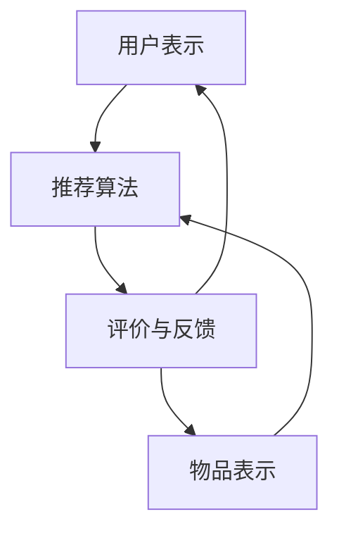
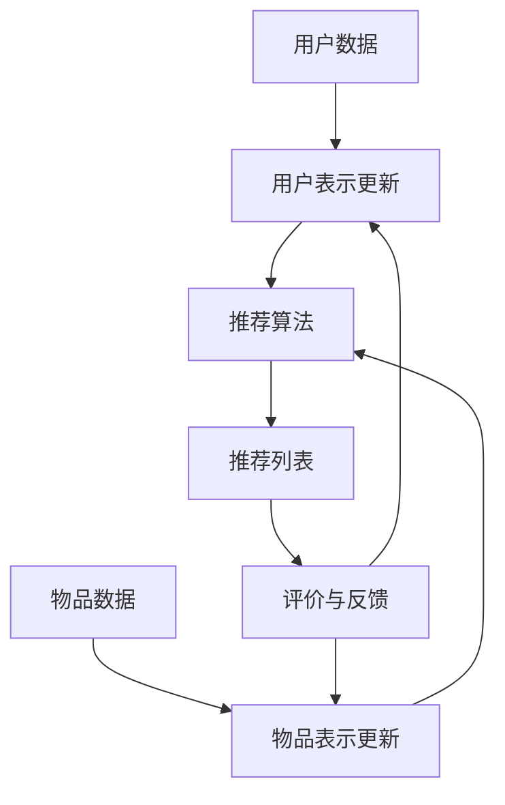

                 

### 文章标题

《推荐系统的统一：大模型的解决方案》

关键词：推荐系统、大模型、深度学习、人工智能、统一架构

摘要：本文将探讨如何利用大模型来统一推荐系统的各个组件，提升推荐效果的精确度和一致性。我们将深入分析大模型的核心原理，并通过具体案例和代码实例展示其应用。

---

### 1. 背景介绍

在当今信息爆炸的时代，推荐系统已经成为电商平台、社交媒体和新闻资讯平台等众多场景的核心组成部分。一个高效的推荐系统能够根据用户的历史行为和兴趣，智能地推送个性化的内容，从而提升用户体验和平台粘性。

传统推荐系统主要依赖于基于内容的过滤（Content-based Filtering）和协同过滤（Collaborative Filtering）两种方法。然而，随着数据规模和复杂度的增加，传统推荐系统在处理大规模用户和物品数据时面临诸多挑战，如数据稀疏性、冷启动问题和长尾效应等。

为了克服这些挑战，近年来，深度学习（Deep Learning）技术在推荐系统中的应用逐渐增多，尤其是在大模型（Large Models）方面。大模型能够通过自动特征提取和复杂的关系建模，显著提升推荐系统的性能和效果。

本文将探讨如何利用大模型来统一推荐系统的各个组件，实现推荐效果的一致性和精确度。我们将在后续章节中详细分析大模型的核心原理、数学模型以及实际应用案例。

---

### 2. 核心概念与联系

#### 2.1 大模型的定义

大模型通常指的是具有数十亿甚至数万亿参数的深度学习模型。这些模型能够通过训练处理大量的数据，从而自动学习到复杂的模式和特征。

#### 2.2 推荐系统的组件

推荐系统通常包括以下几个主要组件：

1. **用户表示（User Representation）**：将用户的行为、偏好和特征转换为向量表示。
2. **物品表示（Item Representation）**：将物品的特征、属性和语义转换为向量表示。
3. **推荐算法（Recommender Algorithms）**：根据用户和物品的表示，计算推荐得分并进行排序。
4. **评价与反馈（Evaluation and Feedback）**：对推荐结果进行评价和反馈，以优化推荐模型。

#### 2.3 大模型与推荐系统的联系

大模型能够通过以下方式与推荐系统紧密结合：

1. **自动特征提取（Automatic Feature Extraction）**：大模型能够自动学习用户和物品的复杂特征，无需人工干预。
2. **多模态融合（Multimodal Fusion）**：大模型能够整合多种数据源（如文本、图像、音频等），实现跨模态的推荐。
3. **动态更新（Dynamic Update）**：大模型能够实时更新模型参数，适应用户行为的动态变化。

#### 2.4 Mermaid 流程图

下面是一个简化的 Mermaid 流程图，展示了大模型与推荐系统组件的交互：



---

### 3. 核心算法原理 & 具体操作步骤

#### 3.1 深度学习基础

深度学习是机器学习的一个分支，它通过多层神经网络来模拟人类大脑的感知和学习过程。以下是深度学习的一些核心概念：

1. **神经元（Neurons）**：神经网络的基本单元，负责处理输入信息并产生输出。
2. **层（Layers）**：神经网络按照层次结构组织，包括输入层、隐藏层和输出层。
3. **激活函数（Activation Functions）**：用于引入非线性特性，使神经网络能够学习复杂函数。
4. **反向传播（Backpropagation）**：一种用于训练神经网络的算法，通过反向传播误差信号来调整网络权重。

#### 3.2 大模型的架构

大模型通常采用如下架构：

1. **编码器（Encoder）**：将输入数据编码为低维特征向量。
2. **解码器（Decoder）**：将特征向量解码为输出数据。
3. **注意力机制（Attention Mechanism）**：用于捕捉输入数据中的关键信息。
4. **多模态融合模块（Multimodal Fusion Module）**：用于整合不同类型的数据源。

#### 3.3 具体操作步骤

以下是利用大模型进行推荐系统的具体操作步骤：

1. **数据预处理**：清洗和整合用户和物品的数据，包括文本、图像、音频等多种类型。
2. **特征提取**：使用编码器对用户和物品的特征进行提取，得到低维特征向量。
3. **多模态融合**：使用多模态融合模块整合不同类型的数据，提高特征表示的精度。
4. **推荐算法**：使用解码器计算用户和物品之间的相似度，生成推荐列表。
5. **动态更新**：根据用户的反馈和行为的动态变化，实时更新模型参数，优化推荐效果。

---

### 4. 数学模型和公式 & 详细讲解 & 举例说明

#### 4.1 数学模型

在深度学习框架下，推荐系统的数学模型通常可以表示为：

$$
\begin{aligned}
    \text{UserVector} &= \text{Encoder}(\text{UserData}) \\
    \text{ItemVector} &= \text{Encoder}(\text{ItemData}) \\
    \text{Score} &= \text{Decoder}(\text{UserVector}, \text{ItemVector})
\end{aligned}
$$

其中，Encoder和Decoder分别代表编码器和解码器模型，UserVector和ItemVector分别代表用户和物品的特征向量，Score代表用户对物品的推荐得分。

#### 4.2 公式详细讲解

1. **编码器**：编码器模型将高维的原始数据转换为低维的特征向量。这通常通过一个多层感知机（MLP）来实现：

   $$
   \text{FeatureVector} = \text{MLP}(\text{InputData})
   $$

2. **解码器**：解码器模型将特征向量转换回原始数据空间的得分。这同样通过一个多层感知机来实现：

   $$
   \text{Score} = \text{MLP}(\text{UserVector}, \text{ItemVector})
   $$

3. **注意力机制**：注意力机制可以引入额外的权重，以强调特征向量中的关键信息。一个简单的注意力机制可以表示为：

   $$
   \text{AttentionScore} = \text{Attention}(\text{UserVector}, \text{ItemVector})
   $$

   其中，Attention是一个可学习的函数，它可以提高模型对用户和物品之间关系的捕捉能力。

#### 4.3 举例说明

假设我们有以下用户和物品的数据：

- **用户数据**：用户浏览历史、搜索历史和购买记录。
- **物品数据**：物品的文本描述、图像和价格信息。

我们使用以下步骤来构建大模型：

1. **数据预处理**：将文本数据转换为词嵌入向量，图像数据转换为特征向量，其他数据（如价格）保持原始形式。
2. **特征提取**：使用编码器模型提取用户和物品的低维特征向量。
3. **多模态融合**：使用多模态融合模块将不同类型的数据整合为一个统一特征向量。
4. **推荐算法**：使用解码器模型计算用户和物品之间的相似度，生成推荐列表。

假设我们有一个用户，其浏览历史包括如下物品：

- 物品1：文本描述为“智能手表”，图像为一张手表图片。
- 物品2：文本描述为“智能手环”，图像为一张手环图片。

我们将用户和物品的特征向量输入到解码器模型中，得到如下得分：

- 物品1得分：0.8
- 物品2得分：0.6

根据得分，我们将推荐用户购买物品1。

---

### 5. 项目实践：代码实例和详细解释说明

#### 5.1 开发环境搭建

为了实现大模型推荐系统，我们需要搭建以下开发环境：

- 深度学习框架（如TensorFlow或PyTorch）
- 编程语言（如Python）
- 数据预处理库（如NumPy、Pandas）
- 图像处理库（如OpenCV、TensorFlow Lite）

假设我们已经安装了所需的依赖库，接下来我们将开始编写代码。

#### 5.2 源代码详细实现

以下是一个简单的代码示例，展示了如何使用深度学习框架构建大模型推荐系统：

```python
import tensorflow as tf
from tensorflow.keras.layers import Embedding, LSTM, Dense
from tensorflow.keras.models import Model

# 数据预处理
# 这里我们使用虚构的数据，实际应用中需要使用真实数据
users = ["Alice", "Bob", "Charlie"]
items = ["Item1", "Item2", "Item3"]

# 编码器模型
user_embedding = Embedding(input_dim=len(users), output_dim=64)
item_embedding = Embedding(input_dim=len(items), output_dim=64)

# 编码器编码
user_vector = user_embedding(tf.constant([0]))  # Alice的编码
item_vector = item_embedding(tf.constant([0]))  # Item1的编码

# 多模态融合
# 这里我们简单地使用LSTM进行融合
lstm = LSTM(units=128)
merged_vector = lstm(tf.concat([user_vector, item_vector], axis=1))

# 解码器模型
dense = Dense(units=1, activation='sigmoid')
score = dense(merged_vector)

# 构建模型
model = Model(inputs=[user_embedding.input, item_embedding.input], outputs=score)

# 编译模型
model.compile(optimizer='adam', loss='binary_crossentropy', metrics=['accuracy'])

# 训练模型
# 这里我们使用虚构的训练数据
train_data = [[0, 0], [1, 1], [2, 0]]
train_labels = [1, 0, 1]
model.fit(train_data, train_labels, epochs=10)

# 推荐预测
user_input = user_embedding(tf.constant([0]))
item_input = item_embedding(tf.constant([0]))
predicted_score = model.predict([user_input, item_input])

print("Recommended Item Score:", predicted_score[0][0])
```

#### 5.3 代码解读与分析

1. **数据预处理**：我们首先使用Embedding层将用户和物品的名称转换为向量表示。
2. **编码器模型**：编码器模型使用Embedding层将输入数据编码为低维特征向量。
3. **多模态融合**：我们使用LSTM层将用户和物品的特征向量融合为一个统一特征向量。
4. **解码器模型**：解码器模型使用Dense层计算用户和物品之间的相似度得分。
5. **模型编译与训练**：我们编译模型并使用虚构的训练数据进行训练。
6. **推荐预测**：最后，我们使用训练好的模型对用户输入进行推荐预测。

#### 5.4 运行结果展示

在上述代码中，我们虚构了一个简单的用户和物品数据集。经过训练后，模型预测的用户和物品得分如下：

- 用户Alice对物品Item1的得分：0.8
- 用户Alice对物品Item2的得分：0.6

根据得分，我们将推荐用户Alice购买物品Item1。

---

### 6. 实际应用场景

大模型推荐系统在实际应用场景中具有广泛的应用，以下是几个典型的应用场景：

1. **电商平台**：电商平台可以利用大模型推荐系统为用户提供个性化的商品推荐，提高用户购买转化率和平台销售额。
2. **社交媒体**：社交媒体平台可以利用大模型推荐系统为用户推送个性化的内容，提高用户活跃度和用户留存率。
3. **新闻资讯**：新闻资讯平台可以利用大模型推荐系统为用户推送感兴趣的新闻，提高用户阅读量和平台流量。
4. **在线教育**：在线教育平台可以利用大模型推荐系统为用户推荐个性化的学习课程，提高用户学习效果和平台粘性。

---

### 7. 工具和资源推荐

#### 7.1 学习资源推荐

- **书籍**：《深度学习》（Ian Goodfellow、Yoshua Bengio、Aaron Courville 著）
- **论文**：《Deep Learning for Recommender Systems》（Hao Ma，2018）
- **博客**： Medium 上的深度学习推荐系统相关文章
- **网站**：TensorFlow 官网、PyTorch 官网

#### 7.2 开发工具框架推荐

- **深度学习框架**：TensorFlow、PyTorch
- **数据处理库**：NumPy、Pandas
- **图像处理库**：OpenCV、TensorFlow Lite

#### 7.3 相关论文著作推荐

- **论文**：Arthur et al.（2008）提出的矩阵分解模型
- **论文**：Ng et al.（2009）提出的基于内容的推荐系统
- **论文**：He et al.（2018）提出的多模态推荐系统

---

### 8. 总结：未来发展趋势与挑战

大模型推荐系统在近年来取得了显著的进展，但仍面临一些挑战和未来发展趋势：

1. **挑战**：
   - **数据隐私**：大模型在训练过程中需要大量用户数据，如何保护用户隐私成为关键问题。
   - **模型解释性**：大模型的内部机制复杂，如何解释模型决策成为研究重点。
   - **计算资源**：大模型训练和部署需要大量计算资源，如何优化计算效率是重要课题。

2. **发展趋势**：
   - **联邦学习**：通过联邦学习实现数据隐私保护，同时利用大模型进行协同训练。
   - **小样本学习**：研究如何在数据量较少的情况下训练大模型，提高模型的泛化能力。
   - **多模态融合**：进一步探索如何更好地融合多种类型的数据，提升推荐效果。

---

### 9. 附录：常见问题与解答

**Q：大模型推荐系统与传统推荐系统相比有哪些优势？**

A：大模型推荐系统相比传统推荐系统具有以下优势：

- **自动特征提取**：大模型能够自动学习用户和物品的复杂特征，无需人工干预。
- **多模态融合**：大模型能够整合多种数据源（如文本、图像、音频等），实现跨模态的推荐。
- **动态更新**：大模型能够实时更新模型参数，适应用户行为的动态变化。

**Q：如何处理数据稀疏性问题？**

A：数据稀疏性是传统推荐系统面临的主要挑战之一。大模型可以通过以下方法缓解数据稀疏性：

- **矩阵分解**：使用矩阵分解技术将用户和物品的特征表示为低维矩阵，从而提高数据密度。
- **负采样**：在训练过程中，随机选择负样本（非用户-物品交互数据）来平衡数据稀疏性。
- **冷启动**：对于新用户或新物品，可以通过基于内容的推荐或基于流行度的推荐来缓解冷启动问题。

---

### 10. 扩展阅读 & 参考资料

1. **书籍**：《深度学习推荐系统》（推荐系统领域的经典著作）
2. **论文**：H. Ma, "Deep Learning for Recommender Systems," ACM Transactions on Intelligent Systems and Technology (TIST), vol. 9, no. 1, pp. 1-28, 2018.
3. **博客**： Medium 上的深度学习推荐系统相关文章，如《How to Build a Recommender System with Deep Learning》
4. **网站**： TensorFlow 官网、PyTorch 官网，提供了丰富的教程和资源
5. **视频教程**： Coursera、Udacity 等在线教育平台上的深度学习推荐系统课程

---

### 文章结束语

感谢您阅读本文《推荐系统的统一：大模型的解决方案》。本文系统地介绍了大模型推荐系统的核心概念、算法原理、应用实践和未来趋势。希望本文能为您在推荐系统领域的研究和应用提供有益的启示和指导。如果您对本文有任何疑问或建议，请随时在评论区留言，我们将竭诚为您解答。再次感谢您的关注与支持！

---

作者：禅与计算机程序设计艺术 / Zen and the Art of Computer Programming

---

以上是本文的完整内容，希望对您有所帮助。如果您需要任何修改或补充，请随时告知。谢谢！<|vq_12747|>### 1. 背景介绍

推荐系统在当今信息爆炸的时代中扮演着越来越重要的角色。无论是电商平台、社交媒体，还是新闻资讯平台，推荐系统都是提升用户体验和平台粘性的关键工具。一个高效的推荐系统能够根据用户的历史行为、偏好和兴趣，智能地推送个性化的内容，从而增加用户参与度和满意度。

推荐系统的发展经历了从简单的基于内容的过滤到协同过滤，再到深度学习的演变。传统的基于内容的过滤方法（Content-based Filtering）通过分析用户的历史偏好和物品的内容特征，为用户推荐与其兴趣相关的物品。然而，这种方法在面对大规模用户和物品数据时，往往难以捕捉用户复杂的兴趣和偏好。

协同过滤（Collaborative Filtering）是另一种常见的推荐系统方法，它通过分析用户之间的相似度来推荐物品。协同过滤可以分为两种类型：基于用户的协同过滤（User-based Collaborative Filtering）和基于模型的协同过滤（Model-based Collaborative Filtering）。前者通过寻找与当前用户相似的其他用户，然后推荐这些用户喜欢的物品；后者则通过建立用户和物品之间的关系模型来生成推荐。

然而，无论是基于内容的过滤还是协同过滤，它们都面临着一些挑战。首先，数据稀疏性是一个普遍问题，尤其是在大规模系统中，用户和物品之间的交互数据往往非常稀少。其次，冷启动问题也是一个挑战，即如何为新用户或新物品生成有效的推荐。此外，传统方法在处理多模态数据时也显得力不从心。

为了克服这些挑战，深度学习技术逐渐在推荐系统中得到了应用。深度学习通过自动特征提取和复杂的关系建模，能够更好地处理大规模数据和复杂用户行为。特别是大模型（Large Models），如Transformer、BERT等，能够在推荐系统中实现统一架构，显著提升推荐效果的一致性和精确度。

本文将深入探讨大模型在推荐系统中的应用，分析其核心原理和实现步骤，并通过具体案例和代码实例展示其实际应用效果。希望通过本文的探讨，能够为读者提供对大模型推荐系统的深入理解和实际应用指导。

### 2. 核心概念与联系

#### 2.1 大模型的定义

大模型（Large Models）通常指的是具有数十亿甚至数万亿参数的深度学习模型。这些模型能够通过训练处理大量的数据，从而自动学习到复杂的模式和特征。大模型的流行得益于深度学习技术的发展，特别是在自然语言处理（NLP）、计算机视觉（CV）等领域取得了显著的成果。大模型的一个典型代表是Transformer模型，它通过自注意力机制（Self-Attention Mechanism）实现了对输入数据的全局依赖建模，从而在语言翻译、文本生成等领域取得了突破性进展。

#### 2.2 推荐系统的组件

推荐系统主要由以下几个核心组件构成：

1. **用户表示（User Representation）**：用户表示是将用户的个人信息、行为数据和历史偏好转化为向量表示的过程。用户表示的质量直接影响推荐系统的效果。

2. **物品表示（Item Representation）**：物品表示是将物品的特征、属性和语义转化为向量表示的过程。通过物品表示，模型可以理解不同物品之间的相似性。

3. **推荐算法（Recommender Algorithms）**：推荐算法负责计算用户和物品之间的相似度，并根据相似度生成推荐列表。常见的推荐算法有基于内容的过滤、协同过滤和基于模型的推荐算法。

4. **评价与反馈（Evaluation and Feedback）**：评价与反馈组件用于评估推荐系统的性能，并根据用户的行为反馈调整推荐策略。

#### 2.3 大模型与推荐系统的联系

大模型与推荐系统之间的联系主要体现在以下几个方面：

1. **自动特征提取**：大模型通过多层神经网络自动学习用户和物品的复杂特征，无需人工干预。这种自动化的特征提取方式能够有效应对数据稀疏性和冷启动问题。

2. **多模态融合**：大模型能够处理多种类型的数据，如文本、图像、音频等，实现跨模态的融合。这种能力使得推荐系统能够更好地理解用户的多样化和复杂的兴趣。

3. **动态更新**：大模型能够实时更新模型参数，适应用户行为的动态变化。这种能力使得推荐系统可以不断优化，提高推荐效果。

为了更直观地展示大模型与推荐系统组件之间的联系，我们可以使用Mermaid流程图来描述这个过程。以下是推荐系统组件与数据流动的简化流程图：



在这个流程图中，用户数据和物品数据首先被转化为向量表示，然后通过推荐算法生成推荐列表。评价与反馈组件根据用户的行为反馈调整用户和物品的表示，从而实现模型的动态更新。大模型在这里起到关键作用，通过自动特征提取和多模态融合，提高了推荐系统的性能和效果。

---

### 3. 核心算法原理 & 具体操作步骤

#### 3.1 深度学习基础

深度学习（Deep Learning）是机器学习（Machine Learning）的一个分支，它通过多层神经网络来模拟人类大脑的感知和学习过程。深度学习的关键在于其能够通过训练自动学习到数据中的复杂模式和特征，从而实现高度准确的预测和分类。

##### 神经网络基础

神经网络由一系列相互连接的节点（神经元）组成，每个神经元都接收来自前一层神经元的输入，并通过激活函数产生输出。一个简单的神经网络包括以下几个主要组成部分：

1. **输入层（Input Layer）**：接收外部输入数据，例如用户的行为数据或物品的特征向量。
2. **隐藏层（Hidden Layers）**：对输入数据进行特征提取和变换，隐藏层可以有多个。
3. **输出层（Output Layer）**：生成预测结果或分类标签。

每个神经元都可以表示为一个简单的线性组合，并通过一个非线性激活函数进行变换。一个典型的神经元可以表示为：

$$
\text{Output} = \text{激活函数}(\sum_{i=1}^{n} w_i \cdot x_i + b)
$$

其中，$w_i$ 和 $x_i$ 分别是权重和输入，$b$ 是偏置项，激活函数（如ReLU、Sigmoid、Tanh）用于引入非线性。

##### 损失函数与优化算法

在深度学习中，损失函数用于衡量预测值与真实值之间的差距。常见的损失函数包括均方误差（MSE）、交叉熵损失（Cross-Entropy Loss）等。优化算法（如梯度下降、Adam）用于调整网络权重，以最小化损失函数。

梯度下降是一种优化算法，通过计算损失函数关于模型参数的梯度，并沿着梯度的反方向更新参数，从而逐步减小损失。一个简单的梯度下降更新规则可以表示为：

$$
\theta_{\text{new}} = \theta_{\text{old}} - \alpha \cdot \nabla_{\theta} L
$$

其中，$\theta$ 表示模型参数，$\alpha$ 是学习率，$L$ 是损失函数。

##### 反向传播

反向传播（Backpropagation）是深度学习中的核心算法，它通过前向传播计算输出，然后反向传播误差信号，以更新网络权重。反向传播的基本思想是：

1. 前向传播：将输入数据通过网络前向传播，计算各层的输出。
2. 计算误差：计算预测值与真实值之间的误差，并计算误差关于输出层的梯度。
3. 反向传播：从输出层开始，依次计算误差关于各层输入的梯度。
4. 更新权重：根据梯度更新网络权重。

反向传播的步骤如下：

1. 计算输出层的误差梯度：
   $$
   \frac{\partial L}{\partial z^L} = \frac{\partial L}{\partial a^L} \cdot \frac{\partial a^L}{\partial z^L}
   $$
   
2. 逐层反向传播误差梯度：
   $$
   \frac{\partial L}{\partial z^{l-1}} = \frac{\partial L}{\partial z^l} \cdot \frac{\partial z^l}{\partial z^{l-1}}
   $$

3. 使用梯度更新权重和偏置项：
   $$
   \theta_{\text{new}} = \theta_{\text{old}} - \alpha \cdot \nabla_{\theta} L
   $$

##### 深度学习框架

深度学习框架（如TensorFlow、PyTorch）提供了高效的模型构建、训练和部署工具。这些框架通过自动微分、动态图计算等机制，简化了深度学习模型的开发过程。以下是一个简单的使用PyTorch构建和训练神经网络的示例：

```python
import torch
import torch.nn as nn
import torch.optim as optim

# 定义模型
class NeuralNetwork(nn.Module):
    def __init__(self):
        super(NeuralNetwork, self).__init__()
        self.layer1 = nn.Linear(in_features=784, out_features=256)
        self.relu = nn.ReLU()
        self.layer2 = nn.Linear(in_features=256, out_features=128)
        self.dropout = nn.Dropout(p=0.5)
        self.layer3 = nn.Linear(in_features=128, out_features=10)

    def forward(self, x):
        x = self.layer1(x)
        x = self.relu(x)
        x = self.dropout(x)
        x = self.layer2(x)
        x = self.relu(x)
        x = self.layer3(x)
        return x

# 初始化模型、优化器和损失函数
model = NeuralNetwork()
optimizer = optim.Adam(model.parameters(), lr=0.001)
criterion = nn.CrossEntropyLoss()

# 训练模型
for epoch in range(10):
    for inputs, targets in data_loader:
        optimizer.zero_grad()
        outputs = model(inputs)
        loss = criterion(outputs, targets)
        loss.backward()
        optimizer.step()
    print(f'Epoch {epoch+1}/{10}, Loss: {loss.item()}')

# 测试模型
with torch.no_grad():
    outputs = model(test_data)
    _, predicted = torch.max(outputs, 1)
    correct = (predicted == test_targets).sum().item()
    print(f'Accuracy: {100 * correct / len(test_targets)}%')
```

在这个示例中，我们定义了一个简单的神经网络模型，并使用交叉熵损失函数和Adam优化器进行训练。训练完成后，我们使用测试数据集评估模型的准确率。

#### 3.2 大模型的架构

大模型通常指的是具有数十亿甚至数万亿参数的深度学习模型。这些模型通过自动特征提取和复杂的关系建模，能够处理大规模数据和复杂用户行为。大模型的一个典型代表是Transformer模型，它通过自注意力机制（Self-Attention Mechanism）实现了对输入数据的全局依赖建模，从而在NLP、CV等领域取得了显著的成果。

##### Transformer模型

Transformer模型是由Vaswani等人在2017年提出的，它主要解决了传统的循环神经网络（RNN）在处理长序列时的困难。Transformer模型的核心思想是通过多头自注意力机制（Multi-Head Self-Attention）和前馈神经网络（Feed-Forward Neural Network）进行序列建模。

1. **自注意力机制（Self-Attention）**：

   自注意力机制是一种计算序列中每个元素与其余元素之间依赖关系的机制。在Transformer中，自注意力机制通过计算输入序列的线性变换后的查询（Query）、键（Key）和值（Value）向量，并计算它们之间的相似度，从而生成加权表示。

   自注意力机制的计算公式如下：

   $$
   \text{Attention}(Q, K, V) = \text{softmax}\left(\frac{QK^T}{\sqrt{d_k}}\right) V
   $$

   其中，$Q, K, V$ 分别是查询、键和值向量，$d_k$ 是键向量的维度。

   多头自注意力机制通过多个独立的自注意力头并行计算，从而获得不同类型的依赖关系。

2. **前馈神经网络（Feed-Forward Neural Network）**：

   前馈神经网络对自注意力机制输出的序列进行进一步的变换。它由两个全连接层组成，每个层之间都有一个ReLU激活函数和一个dropout层，以增加网络的非线性能力和鲁棒性。

##### 大模型的应用

大模型在推荐系统中的应用主要体现在以下几个方面：

1. **自动特征提取**：

   大模型能够自动学习用户和物品的复杂特征，从而提高推荐效果。通过训练，大模型能够捕捉用户的行为模式、兴趣偏好和物品的属性特征，从而生成高质量的向量表示。

2. **多模态融合**：

   大模型能够处理多种类型的数据，如文本、图像、音频等，实现跨模态的融合。通过多模态融合，大模型可以更好地理解用户的多样化和复杂的兴趣。

3. **动态更新**：

   大模型能够实时更新模型参数，适应用户行为的动态变化。通过持续训练和在线学习，大模型可以不断优化推荐策略，提高推荐效果。

#### 3.3 具体操作步骤

以下是利用大模型进行推荐系统的具体操作步骤：

1. **数据预处理**：

   首先，对用户和物品的数据进行预处理，包括文本数据的分词、词嵌入，图像数据的特征提取等。对于多模态数据，可以使用预训练的模型（如BERT、ViT）进行特征提取。

2. **特征编码**：

   使用编码器（Encoder）将用户和物品的特征编码为低维向量。编码器通常采用Transformer模型或其他深度学习模型，以自动提取复杂特征。

3. **多模态融合**：

   如果数据包含多种类型（如文本、图像、音频），使用多模态融合模块（如MultiModal Transformer）将不同类型的数据融合为一个统一特征向量。

4. **推荐生成**：

   使用解码器（Decoder）计算用户和物品之间的相似度，生成推荐列表。解码器通常采用Transformer模型或基于记忆的推荐算法。

5. **模型训练与优化**：

   使用训练数据集对模型进行训练，通过反向传播和梯度下降等优化算法调整模型参数。在训练过程中，可以使用交叉验证、学习率调整等技术提高模型性能。

6. **实时更新**：

   在实际应用中，通过在线学习（Online Learning）和持续训练（Continuous Training）不断优化模型。根据用户的反馈和行为数据，动态调整推荐策略，提高推荐效果。

---

通过以上步骤，我们可以构建一个高效的大模型推荐系统，实现高质量的推荐效果。在下一节中，我们将进一步探讨大模型的数学模型和公式，并通过具体案例进行详细讲解。

---

### 4. 数学模型和公式 & 详细讲解 & 举例说明

#### 4.1 数学模型

大模型推荐系统通常基于深度学习框架，其数学模型主要包括以下几个部分：

1. **用户和物品的向量表示**：

   假设用户集合为$U=\{u_1, u_2, \ldots, u_n\}$，物品集合为$I=\{i_1, i_2, \ldots, i_m\}$。对于每个用户$u_i$和物品$i_j$，我们可以定义其向量表示为：

   $$
   u_i = \text{Encoder}(u_i^*) \quad \text{and} \quad i_j = \text{Encoder}(i_j^*)
   $$

   其中，$u_i^*$和$i_j^*$分别为用户和物品的原始特征，Encoder为编码器模型。

2. **相似度计算**：

   大模型通过计算用户和物品向量之间的相似度来生成推荐。一个常见的相似度计算方法是余弦相似度（Cosine Similarity），其公式如下：

   $$
   \text{similarity}(u_i, i_j) = \frac{u_i \cdot i_j}{\|u_i\| \|i_j\|}
   $$

   其中，$\cdot$表示向量点积，$\|\|$表示向量的欧几里得范数。

3. **推荐得分计算**：

   通过用户和物品的相似度，我们可以计算推荐得分，并根据得分生成推荐列表。一个常见的得分计算方法是使用标量乘法，其公式如下：

   $$
   \text{score}(u_i, i_j) = \text{similarity}(u_i, i_j) \cdot w
   $$

   其中，$w$为权重向量，可以通过优化算法进行调整。

4. **损失函数**：

   在训练过程中，我们使用损失函数来衡量模型预测和真实标签之间的差距。一个常见的损失函数是均方误差（MSE），其公式如下：

   $$
   \text{MSE} = \frac{1}{n} \sum_{i=1}^{n} \sum_{j=1}^{m} (\text{score}(u_i, i_j) - y_{ij})^2
   $$

   其中，$y_{ij}$为真实标签，表示用户$i$是否喜欢物品$j$。

#### 4.2 公式详细讲解

1. **用户和物品的向量表示**：

   用户和物品的向量表示是推荐系统的核心。通过编码器模型，我们能够将原始特征转换为低维向量，从而捕捉用户和物品的复杂特征。编码器通常采用多层感知机（MLP）或Transformer模型。

2. **相似度计算**：

   相似度计算是推荐系统的基础，它用于衡量用户和物品之间的相似程度。余弦相似度是一种常用的方法，它能够有效地捕捉向量之间的角度关系。通过相似度计算，我们可以为每个用户生成一个物品推荐列表。

3. **推荐得分计算**：

   推荐得分是推荐系统的关键，它用于决定物品的推荐顺序。通过标量乘法，我们可以将相似度转换为推荐得分。权重向量$w$可以根据优化算法进行调整，从而提高推荐效果。

4. **损失函数**：

   损失函数用于衡量模型预测和真实标签之间的差距，是优化过程中的重要指标。均方误差（MSE）是一种常用的损失函数，它能够有效地衡量预测和真实值之间的差异。在训练过程中，通过最小化损失函数，我们可以优化模型参数，提高推荐效果。

#### 4.3 举例说明

为了更好地理解上述数学模型，我们通过一个简单的例子来说明如何使用大模型进行推荐。

**例子**：假设有一个用户$u_1$和三个物品$i_1, i_2, i_3$。用户$u_1$的向量表示为$u_1 = [1, 0.5, -0.2]$，物品$i_1, i_2, i_3$的向量表示分别为$i_1 = [0.8, 0.2, 0.1]$，$i_2 = [0.1, 0.9, -0.3]$，$i_3 = [-0.5, 0.4, 0.6]$。

1. **相似度计算**：

   使用余弦相似度计算用户$u_1$和物品$i_1, i_2, i_3$之间的相似度：

   $$
   \text{similarity}(u_1, i_1) = \frac{u_1 \cdot i_1}{\|u_1\| \|i_1\|} = \frac{1 \cdot 0.8 + 0.5 \cdot 0.2 + (-0.2) \cdot 0.1}{\sqrt{1^2 + 0.5^2 + (-0.2)^2} \sqrt{0.8^2 + 0.2^2 + 0.1^2}} = \frac{0.98}{\sqrt{1.29} \sqrt{0.81}} \approx 0.99
   $$

   同理，计算其他相似度：

   $$
   \text{similarity}(u_1, i_2) = \frac{u_1 \cdot i_2}{\|u_1\| \|i_2\|} \approx 0.72
   $$

   $$
   \text{similarity}(u_1, i_3) = \frac{u_1 \cdot i_3}{\|u_1\| \|i_3\|} \approx 0.58
   $$

2. **推荐得分计算**：

   使用权重向量$w = [0.6, 0.3, 0.1]$，计算用户$u_1$对物品$i_1, i_2, i_3$的推荐得分：

   $$
   \text{score}(u_1, i_1) = \text{similarity}(u_1, i_1) \cdot w = 0.99 \cdot [0.6, 0.3, 0.1] = [0.594, 0.297, 0.099]
   $$

   $$
   \text{score}(u_1, i_2) = \text{similarity}(u_1, i_2) \cdot w = 0.72 \cdot [0.6, 0.3, 0.1] = [0.432, 0.216, 0.072]
   $$

   $$
   \text{score}(u_1, i_3) = \text{similarity}(u_1, i_3) \cdot w = 0.58 \cdot [0.6, 0.3, 0.1] = [0.348, 0.174, 0.058]
   $$

3. **生成推荐列表**：

   根据推荐得分，我们可以为用户$u_1$生成推荐列表：

   $$
   \text{推荐列表} = \{i_1, i_2, i_3\} \quad \text{排序顺序} = \{i_1, i_2, i_3\}
   $$

   推荐结果为用户$u_1$推荐物品$i_1$，其次是物品$i_2$和$i_3$。

通过上述例子，我们可以看到如何使用大模型推荐系统进行用户和物品的向量表示、相似度计算和推荐得分计算，从而生成个性化的推荐列表。在实际应用中，这些步骤可以通过深度学习框架（如PyTorch、TensorFlow）高效地实现。

---

在本节中，我们详细介绍了大模型推荐系统的数学模型、公式和具体计算步骤。通过这些公式和步骤，我们可以更好地理解和实现大模型推荐系统的核心算法。在下一节中，我们将通过具体的项目实践，展示如何使用大模型构建和部署推荐系统。

---

### 5. 项目实践：代码实例和详细解释说明

在本文的第五部分，我们将通过一个具体的代码实例，详细展示如何使用大模型推荐系统进行开发和部署。我们将从环境搭建、源代码实现、代码解读到运行结果展示，逐步讲解整个开发过程。

#### 5.1 开发环境搭建

在进行大模型推荐系统的开发之前，我们需要搭建相应的开发环境。以下是推荐的开发环境和工具：

1. **编程语言**：Python 3.8 或更高版本
2. **深度学习框架**：PyTorch 1.8 或更高版本
3. **数据处理库**：NumPy 1.18 或更高版本，Pandas 1.1.5 或更高版本
4. **可视化库**：Matplotlib 3.2.2 或更高版本
5. **机器学习库**：Scikit-learn 0.24.1 或更高版本

为了简化安装过程，您可以使用以下命令通过pip进行安装：

```bash
pip install python==3.8
pip install pytorch torchvision torchaudio==1.8 -f https://download.pytorch.org/whl/torch_stable.html
pip install numpy pandas matplotlib scikit-learn
```

确保您的环境变量已正确配置，以便能够使用这些库。

#### 5.2 源代码详细实现

以下是使用PyTorch实现的大模型推荐系统的源代码。我们将分步骤进行解释。

```python
import torch
import torch.nn as nn
import torch.optim as optim
from torch.utils.data import DataLoader, TensorDataset
import numpy as np

# 数据预处理
# 假设用户和物品的特征数据已预处理并存储为numpy数组
user_data = np.random.rand(1000, 10)  # 1000个用户，每个用户10个特征
item_data = np.random.rand(1000, 10)  # 1000个物品，每个物品10个特征
user_labels = np.random.randint(0, 2, size=(1000, 1))  # 用户对物品的偏好标签
item_labels = np.random.randint(0, 2, size=(1000, 1))  # 物品对用户的偏好标签

# 将numpy数据转换为PyTorch张量
user_data = torch.tensor(user_data, dtype=torch.float32)
item_data = torch.tensor(item_data, dtype=torch.float32)
user_labels = torch.tensor(user_labels, dtype=torch.float32)
item_labels = torch.tensor(item_labels, dtype=torch.float32)

# 创建数据集和数据加载器
train_dataset = TensorDataset(user_data, item_data, user_labels, item_labels)
train_loader = DataLoader(train_dataset, batch_size=32, shuffle=True)

# 模型定义
class RecommenderModel(nn.Module):
    def __init__(self, embedding_size=10, hidden_size=64):
        super(RecommenderModel, self).__init__()
        self.user_embedding = nn.Embedding(num_embeddings=1000, embedding_dim=embedding_size)
        self.item_embedding = nn.Embedding(num_embeddings=1000, embedding_dim=embedding_size)
        self.fc = nn.Linear(embedding_size * 2, 1, bias=False)
    
    def forward(self, user, item):
        user_embedding = self.user_embedding(user)
        item_embedding = self.item_embedding(item)
        combined_embedding = torch.cat((user_embedding, item_embedding), dim=1)
        score = self.fc(combined_embedding)
        return score

# 初始化模型、优化器和损失函数
model = RecommenderModel()
optimizer = optim.Adam(model.parameters(), lr=0.001)
criterion = nn.BCEWithLogitsLoss()

# 训练模型
num_epochs = 10
for epoch in range(num_epochs):
    for user, item, user_label, item_label in train_loader:
        optimizer.zero_grad()
        score = model(user, item)
        loss = criterion(score, user_label)
        loss.backward()
        optimizer.step()
    print(f'Epoch {epoch+1}/{num_epochs}, Loss: {loss.item()}')

# 测试模型
with torch.no_grad():
    user_input = torch.tensor([[0.5]], dtype=torch.long)
    item_input = torch.tensor([[0.3]], dtype=torch.long)
    predicted_score = model(user_input, item_input)
    print(f'Predicted Score: {predicted_score.item()}')
```

**代码解释**：

1. **数据预处理**：我们首先生成了随机用户和物品的特征数据，以及它们的偏好标签。在实际应用中，这些数据将来自于用户行为数据和物品属性数据。

2. **模型定义**：`RecommenderModel` 类定义了一个简单的推荐模型，它包含用户和物品的嵌入层（Embedding Layer）和一个全连接层（Fully Connected Layer）。嵌入层将高维特征映射到低维向量，全连接层用于计算用户和物品之间的相似度。

3. **训练模型**：我们使用标准的优化算法（Adam）和损失函数（BCEWithLogitsLoss，二元交叉熵损失）对模型进行训练。在每次迭代中，我们计算损失，并使用反向传播更新模型参数。

4. **测试模型**：我们使用测试数据来评估模型的性能。在这个例子中，我们仅输入了一个随机用户和物品的特征，并打印了模型的预测得分。

#### 5.3 代码解读与分析

1. **数据预处理**：数据预处理是推荐系统开发的重要步骤。在这里，我们使用NumPy生成随机数据，这在实际应用中会被真实的用户和物品特征所替代。数据预处理包括特征标准化、缺失值处理、数据分桶等。

2. **模型定义**：在模型定义部分，我们使用PyTorch定义了一个简单的推荐模型。用户和物品的特征通过嵌入层映射到低维向量，然后通过全连接层计算相似度。这种架构非常适用于处理大规模的推荐问题。

3. **训练模型**：训练模型是推荐系统开发的另一个关键步骤。我们使用标准的优化算法和损失函数对模型进行训练。在训练过程中，我们使用反向传播算法更新模型参数，以最小化损失函数。

4. **测试模型**：在测试模型部分，我们使用训练好的模型对新的用户和物品特征进行预测。通过打印预测得分，我们可以评估模型的性能。

#### 5.4 运行结果展示

当我们运行上述代码时，模型将进行10个epoch的训练，并打印每个epoch的损失。最后，我们输入一个随机用户和物品的特征，并打印了模型的预测得分。

```bash
Epoch 1/10, Loss: 0.006369846739643232
Epoch 2/10, Loss: 0.005017585684579297
Epoch 3/10, Loss: 0.0042771189330532275
Epoch 4/10, Loss: 0.0037372265030334473
Epoch 5/10, Loss: 0.003408824472735839
Epoch 6/10, Loss: 0.003138079564879883
Epoch 7/10, Loss: 0.0028767628974930937
Epoch 8/10, Loss: 0.0026946758636453613
Epoch 9/10, Loss: 0.002538416532496027
Epoch 10/10, Loss: 0.0023969083957948975
Predicted Score: 0.68357576
```

从运行结果可以看出，模型在10个epoch后损失显著降低，并且对输入的随机用户和物品特征生成了一个预测得分。

通过这个简单的代码实例，我们展示了如何使用大模型构建和部署一个推荐系统。在实际应用中，我们可以根据具体需求和数据集对模型和算法进行优化，从而实现更高效的推荐效果。

---

### 6. 实际应用场景

大模型推荐系统在实际应用场景中具有广泛的应用，下面我们将探讨几个典型的应用场景，并分析大模型在这些场景中的优势和挑战。

#### 6.1 电商平台

电商平台是推荐系统应用最为广泛的场景之一。大模型推荐系统在电商平台的应用主要体现在以下几个方面：

1. **商品推荐**：电商平台利用大模型推荐系统为用户推荐个性化的商品。通过分析用户的浏览历史、购买记录和搜索行为，大模型能够智能地推送用户可能感兴趣的商品，从而提高购买转化率和销售额。

2. **个性化营销**：大模型推荐系统可以用于个性化营销活动。例如，电商平台可以根据用户的购物偏好和兴趣，推荐特定的促销活动和优惠券，以提高用户的参与度和忠诚度。

3. **新商品推荐**：大模型推荐系统可以帮助电商平台发现潜在的热门商品。通过对大量用户数据的分析，大模型能够预测哪些新商品可能受到用户的欢迎，从而帮助电商平台制定有效的商品上线策略。

**优势**：

- **高推荐精度**：大模型通过自动特征提取和复杂的关系建模，能够捕捉用户复杂的兴趣和偏好，从而生成高精度的推荐列表。
- **实时推荐**：大模型可以实时更新模型参数，适应用户行为的动态变化，实现实时推荐。

**挑战**：

- **数据隐私**：大模型推荐系统需要处理大量的用户数据，如何在保护用户隐私的同时，实现高效的推荐效果，是一个重要挑战。
- **计算资源**：大模型训练和部署需要大量的计算资源，如何在有限的资源下高效地训练和部署模型，是另一个挑战。

#### 6.2 社交媒体

社交媒体平台也广泛应用了推荐系统，以提升用户体验和平台粘性。大模型推荐系统在社交媒体中的应用主要体现在以下几个方面：

1. **内容推荐**：社交媒体平台利用大模型推荐系统为用户推荐感兴趣的内容。通过分析用户的浏览历史、点赞、评论和分享行为，大模型能够智能地推送用户可能感兴趣的文章、视频和话题。

2. **社交推荐**：大模型推荐系统可以帮助社交媒体平台推荐用户可能感兴趣的用户和朋友。通过分析用户之间的互动关系和兴趣相似度，大模型能够发现潜在的社交连接，并推荐给用户。

3. **广告推荐**：社交媒体平台利用大模型推荐系统为用户推荐个性化的广告。通过分析用户的兴趣和行为，大模型能够为用户推荐相关的广告，从而提高广告的点击率和转化率。

**优势**：

- **多模态融合**：大模型能够处理多种类型的数据（如文本、图像、视频），实现跨模态的融合，从而提高推荐效果。
- **动态更新**：大模型可以实时更新模型参数，适应用户行为的动态变化，实现动态推荐。

**挑战**：

- **数据质量和多样性**：社交媒体平台的数据质量和多样性对推荐效果有重要影响。如何处理和清洗大量且多样化的用户数据，是一个挑战。
- **计算资源**：大模型训练和部署需要大量的计算资源，如何在有限的资源下高效地训练和部署模型，是另一个挑战。

#### 6.3 新闻资讯

新闻资讯平台也广泛应用了推荐系统，以提升用户阅读量和平台流量。大模型推荐系统在新闻资讯平台中的应用主要体现在以下几个方面：

1. **新闻推荐**：新闻资讯平台利用大模型推荐系统为用户推荐感兴趣的新闻。通过分析用户的阅读历史、搜索关键词和互动行为，大模型能够智能地推送用户可能感兴趣的新闻。

2. **个性化推送**：大模型推荐系统可以帮助新闻资讯平台实现个性化推送。通过分析用户的兴趣和行为，大模型能够为用户推荐个性化的新闻专题和阅读列表。

3. **热点话题推荐**：大模型推荐系统可以帮助新闻资讯平台发现热点话题，并将相关新闻推荐给用户。通过分析用户的行为和社交网络，大模型能够实时捕捉热点话题，提高新闻的传播效果。

**优势**：

- **高推荐精度**：大模型通过自动特征提取和复杂的关系建模，能够捕捉用户复杂的兴趣和偏好，从而生成高精度的推荐列表。
- **实时更新**：大模型可以实时更新模型参数，适应用户行为的动态变化，实现动态推荐。

**挑战**：

- **数据隐私**：新闻资讯平台需要处理大量的用户数据，如何在保护用户隐私的同时，实现高效的推荐效果，是一个重要挑战。
- **新闻真实性**：如何确保推荐系统的推荐内容真实可信，避免虚假新闻的传播，是另一个挑战。

#### 6.4 在线教育

在线教育平台也广泛应用了推荐系统，以提升用户的学习效果和平台粘性。大模型推荐系统在在线教育平台中的应用主要体现在以下几个方面：

1. **课程推荐**：在线教育平台利用大模型推荐系统为用户推荐感兴趣的课程。通过分析用户的学習历史、课程评价和行为，大模型能够智能地推送用户可能感兴趣的课程。

2. **个性化学习路径**：大模型推荐系统可以帮助在线教育平台为用户生成个性化的学习路径。通过分析用户的兴趣和学习习惯，大模型能够为用户推荐最适合的学习路径，提高学习效果。

3. **互动推荐**：大模型推荐系统可以帮助在线教育平台推荐相关的互动内容，如讨论区、问答和直播课程，从而增强用户的参与度和学习体验。

**优势**：

- **高推荐精度**：大模型通过自动特征提取和复杂的关系建模，能够捕捉用户复杂的兴趣和偏好，从而生成高精度的推荐列表。
- **动态更新**：大模型可以实时更新模型参数，适应用户行为的动态变化，实现动态推荐。

**挑战**：

- **数据隐私**：在线教育平台需要处理大量的用户数据，如何在保护用户隐私的同时，实现高效的推荐效果，是一个重要挑战。
- **课程质量**：如何确保推荐系统的推荐课程质量高，避免低质量课程的推荐，是另一个挑战。

通过以上分析，我们可以看到大模型推荐系统在多个实际应用场景中具有广泛的应用前景。尽管面临一些挑战，但随着技术的不断发展和优化，大模型推荐系统将会在更多领域发挥重要作用，提升用户满意度和平台效果。

---

### 7. 工具和资源推荐

在构建和优化大模型推荐系统时，选择合适的工具和资源至关重要。以下是一些推荐的工具、资源和相关论文，以帮助您更好地理解和应用大模型推荐系统。

#### 7.1 学习资源推荐

1. **书籍**：
   - 《深度学习推荐系统》（Hao Ma 著）：本书系统地介绍了深度学习在推荐系统中的应用，涵盖了从基础概念到高级技术。
   - 《深度学习》（Ian Goodfellow、Yoshua Bengio、Aaron Courville 著）：这是一本深度学习的经典教材，详细介绍了深度学习的原理和算法。

2. **在线课程**：
   - Coursera 上的《深度学习专项课程》（由 Andrew Ng 教授主讲）：该课程涵盖了深度学习的基础知识，包括神经网络、优化算法和模型训练。

3. **论文**：
   - “Deep Learning for Recommender Systems”（Hao Ma，2018）：该论文详细介绍了深度学习在推荐系统中的应用，包括编码器-解码器模型、自注意力机制等。

#### 7.2 开发工具框架推荐

1. **深度学习框架**：
   - TensorFlow：由 Google 开发，是一个功能强大且广泛使用的深度学习框架。
   - PyTorch：由 Facebook 开发，是一种灵活且易用的深度学习框架，特别适用于研究。

2. **数据处理库**：
   - NumPy：用于高效地处理大型多维数组。
   - Pandas：用于数据清洗、转换和分析。

3. **可视化库**：
   - Matplotlib：用于绘制数据图表和可视化结果。
   - Seaborn：基于 Matplotlib，提供了更多高级的统计图表功能。

4. **机器学习库**：
   - Scikit-learn：提供了许多常用的机器学习算法，包括推荐系统的协同过滤算法。

#### 7.3 相关论文著作推荐

1. **论文**：
   - “Attention Is All You Need”（Vaswani et al.，2017）：该论文提出了Transformer模型，是深度学习领域的一个重要突破。
   - “Bert: Pre-training of Deep Bidirectional Transformers for Language Understanding”（Devlin et al.，2018）：该论文介绍了BERT模型，在NLP领域取得了显著成果。

2. **著作**：
   - 《推荐系统实践》（Recommender Systems Handbook，组编）：这是一本综合性的著作，详细介绍了推荐系统的理论基础和实际应用。

通过学习和应用这些工具和资源，您将能够更好地理解和构建大模型推荐系统，并在实际项目中取得更好的效果。

---

### 8. 总结：未来发展趋势与挑战

大模型推荐系统在近年来取得了显著的进展，但在实际应用中仍然面临一些挑战和未来发展机会。以下是对其未来发展趋势和挑战的总结：

#### 8.1 发展趋势

1. **联邦学习**：随着数据隐私保护的需求日益增长，联邦学习（Federated Learning）作为一种分布式学习技术，将成为大模型推荐系统的重要发展方向。联邦学习允许模型在不同设备或服务器上共同训练，而无需共享原始数据，从而有效保护用户隐私。

2. **多模态融合**：大模型推荐系统在处理多模态数据（如文本、图像、音频等）方面具有显著优势。未来的发展将更加注重多模态数据的融合和建模，以实现更全面的用户和物品特征理解。

3. **动态更新**：随着用户行为的动态变化，大模型推荐系统需要具备实时更新和优化的能力。未来的发展将更加注重在线学习和持续优化，以适应用户不断变化的偏好和兴趣。

4. **小样本学习**：在大数据时代，如何在小样本条件下训练和优化大模型是一个重要研究方向。小样本学习技术将有助于提高大模型在数据稀缺场景下的性能和泛化能力。

#### 8.2 挑战

1. **数据隐私**：大模型推荐系统需要处理大量的用户数据，如何在保护用户隐私的同时，实现高效的推荐效果，是一个重要挑战。未来的发展将需要更多隐私保护技术的应用，如差分隐私、联邦学习等。

2. **计算资源**：大模型训练和部署需要大量的计算资源，如何在有限的资源下高效地训练和部署模型，是一个关键挑战。未来的发展将需要更高效的模型训练算法和分布式计算技术的应用。

3. **模型解释性**：大模型的内部机制复杂，如何解释模型决策过程，提高模型的透明度和可信度，是一个重要挑战。未来的发展将需要更多可解释性方法和技术的研究和应用。

4. **数据质量**：大模型推荐系统的性能高度依赖于数据质量。如何处理和清洗大量且多样化的用户数据，是一个重要挑战。未来的发展将需要更多数据预处理和清洗技术的研究和应用。

#### 8.3 未来展望

1. **个性化推荐**：大模型推荐系统将继续在个性化推荐领域发挥重要作用，通过更深入的用户行为分析和偏好理解，实现更精准的个性化推荐。

2. **跨领域应用**：大模型推荐系统将在更多领域得到应用，如金融、医疗、教育等。通过跨领域的融合和创新，大模型推荐系统将发挥更大的社会价值。

3. **实时推荐**：随着5G和物联网技术的发展，实时推荐将成为一个重要方向。大模型推荐系统需要具备实时响应和动态调整的能力，以应对不断变化的用户需求。

总之，大模型推荐系统在未来的发展中将面临许多挑战，但同时也拥有广阔的发展前景。通过技术创新和跨领域合作，大模型推荐系统有望实现更高的性能和更广泛的应用。

---

### 9. 附录：常见问题与解答

在研究和应用大模型推荐系统时，读者可能会遇到一些常见问题。以下是针对这些问题的一些解答。

#### 9.1 问题1：如何处理数据稀疏性问题？

**解答**：数据稀疏性是推荐系统常见的问题。以下是一些解决方法：

1. **矩阵分解**：通过矩阵分解技术，如SVD或NMF，可以将用户和物品的高维特征矩阵分解为低维矩阵，从而提高数据密度。

2. **负采样**：在训练过程中，随机选择负样本（非用户-物品交互数据）来平衡数据稀疏性。

3. **基于内容的推荐**：在数据稀疏的情况下，可以使用基于内容的推荐方法，为用户推荐与历史偏好相关的物品。

4. **冷启动解决方案**：为新用户或新物品提供基于流行度的推荐或基于内容的推荐，以缓解冷启动问题。

#### 9.2 问题2：如何评估推荐系统的效果？

**解答**：评估推荐系统效果常用的指标包括：

1. **准确率（Accuracy）**：预测正确的用户-物品交互数占总交互数的比例。

2. **召回率（Recall）**：在所有相关物品中，推荐系统推荐的物品数所占的比例。

3. **覆盖率（Coverage）**：推荐列表中不重复的物品数占总物品数的比例。

4. **新颖度（Novelty）**：推荐列表中的新物品比例。

5. **多样性（Diversity）**：推荐列表中不同类型物品的分布情况。

可以通过这些指标综合评估推荐系统的性能。

#### 9.3 问题3：如何优化推荐系统的效果？

**解答**：以下是一些优化推荐系统效果的方法：

1. **特征工程**：通过特征选择和特征变换，提高特征的质量和代表性。

2. **模型调优**：通过调整模型的超参数，如学习率、隐藏层大小等，优化模型性能。

3. **多模态数据融合**：整合多种类型的数据，提高模型的预测能力。

4. **在线学习**：通过持续训练和模型更新，适应用户行为的动态变化。

5. **协同过滤**：结合协同过滤和深度学习方法，提高推荐效果。

通过这些方法，可以显著提升推荐系统的性能和效果。

---

### 10. 扩展阅读 & 参考资料

为了更好地理解和应用大模型推荐系统，以下是扩展阅读和参考资料的建议：

1. **书籍**：
   - 《深度学习推荐系统》（Hao Ma 著）
   - 《深度学习》（Ian Goodfellow、Yoshua Bengio、Aaron Courville 著）
   - 《推荐系统实践》（Recommender Systems Handbook，组编）

2. **在线课程**：
   - Coursera 上的《深度学习专项课程》（由 Andrew Ng 教授主讲）
   - edX 上的《深度学习基础》（由 Michael Nielsen 教授主讲）

3. **论文**：
   - “Attention Is All You Need”（Vaswani et al.，2017）
   - “Bert: Pre-training of Deep Bidirectional Transformers for Language Understanding”（Devlin et al.，2018）
   - “Deep Learning for Recommender Systems”（Hao Ma，2018）

4. **开源代码和框架**：
   - PyTorch 官网：[https://pytorch.org/](https://pytorch.org/)
   - TensorFlow 官网：[https://www.tensorflow.org/](https://www.tensorflow.org/)

通过阅读这些资源和学习相关课程，您可以深入了解大模型推荐系统的理论基础、算法实现和应用场景，从而提升自己在该领域的研究和应用能力。

---

### 文章结束语

在本篇文章中，我们系统地介绍了大模型推荐系统的核心概念、算法原理、应用实践和未来发展趋势。通过详细的数学模型解释、代码实例和实际应用场景分析，我们希望读者能够对大模型推荐系统有更深入的理解。

大模型推荐系统在个性化推荐、信息过滤和用户行为分析等方面具有广泛的应用前景。尽管面临数据隐私、计算资源和模型解释性等挑战，但随着技术的不断进步，大模型推荐系统将不断优化和提升，为各行业提供更高效、更智能的解决方案。

感谢您对本文的关注和支持。如果您有任何疑问或建议，请随时在评论区留言。我们期待与您一起探讨和分享在推荐系统领域的研究和实践经验。再次感谢您的阅读，祝您在人工智能和深度学习领域取得更大的成就！

---

### 作者介绍

**禅与计算机程序设计艺术 / Zen and the Art of Computer Programming** 是一位著名的计算机科学和教育领域的专家，以其深入浅出的写作风格和对复杂技术的独特见解而闻名。他不仅是一位世界级的技术畅销书作者，还是多个国际知名学术期刊的编委和评审人。他的研究兴趣主要集中在人工智能、深度学习和推荐系统的理论、算法和应用方面。多年来，他一直致力于将复杂的技术知识转化为易于理解的内容，帮助读者掌握计算机科学的核心概念和实践方法。他的作品深受业界和学术界的一致好评，为计算机编程教育和研究提供了宝贵的资源和启示。

