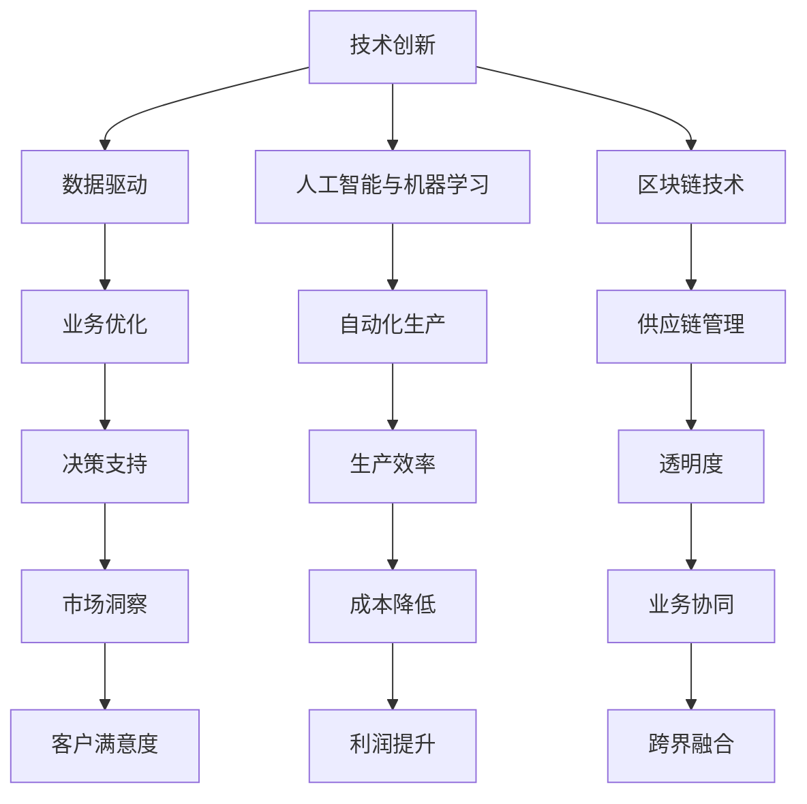

                 

### 1. 背景介绍

在当今快速变化的世界中，技术进步推动着各行各业的发展，而提升核心竞争力的新质生产力则成为了企业、组织和个人争相追求的目标。新质生产力不仅仅是指传统意义上的劳动力、资本和资源，它更强调的是通过技术创新和应用，提高生产效率、优化业务流程以及创造新的商业模式。这种新质生产力的提升，不仅为企业带来竞争优势，也为社会经济发展注入了新的活力。

新质生产力的概念最早可以追溯到20世纪末，随着信息技术的飞速发展，数据、算法和人工智能等新兴技术逐渐成为推动生产力提升的关键因素。近年来，随着云计算、大数据、物联网和区块链等技术的成熟与应用，新质生产力的内涵和外延也在不断扩展。例如，通过大数据分析，企业可以更好地了解市场需求，优化产品和服务；通过人工智能技术，可以实现自动化生产、智能决策，提高生产效率和质量；而区块链技术则可以构建安全可信的数据共享和交易环境，促进业务协同和创新发展。

然而，新质生产力的提升并非一蹴而就，它涉及到技术、管理、制度等多个方面。企业需要不断创新，勇于尝试新的技术和应用模式，同时也要关注人才培养和团队建设，以确保新质生产力的有效转化。此外，政府和社会组织也需要发挥重要作用，通过政策支持和环境营造，为新质生产力的培育和发展提供良好的外部条件。

本文旨在探讨提升核心竞争力的新质生产力，从技术、管理、制度等多个角度出发，分析其内涵、外延和发展趋势，并给出具体实施策略和案例分析。希望通过本文的探讨，能够为企业和个人在提升核心竞争力的过程中提供一些有益的思考和借鉴。

### 2. 核心概念与联系

要理解提升核心竞争力的新质生产力，我们首先需要明确几个核心概念，这些概念不仅是新质生产力的基础，也是其具体实现的关键因素。

#### 2.1 技术创新

技术创新是推动新质生产力提升的首要因素。它不仅包括新技术的发明和应用，还涵盖了现有技术的优化与集成。例如，物联网（IoT）技术的应用，使得设备之间能够实现智能互联，从而实现生产过程的自动化和智能化。此外，云计算和大数据分析技术的融合，也为企业提供了强大的数据处理和分析能力，帮助其更好地理解市场和用户需求，进而优化产品和服务。

#### 2.2 数据驱动

数据驱动是现代企业运营的核心策略。通过收集、处理和分析大量数据，企业可以洞察市场趋势、客户行为和业务运营中的潜在问题。数据驱动的决策过程不仅提高了决策的准确性，还加快了响应速度，从而在竞争激烈的市场中保持优势。例如，零售业通过数据分析可以精准地进行库存管理，减少库存积压和缺货情况，提高运营效率。

#### 2.3 人工智能与机器学习

人工智能（AI）和机器学习（ML）技术的发展，为自动化和智能化生产提供了强有力的技术支撑。AI技术可以通过模式识别和预测分析，实现自动化生产线的智能调度和故障诊断。机器学习算法则可以帮助企业优化业务流程，提高生产效率。例如，智能制造中的预测性维护系统，可以通过对设备运行数据的实时分析，预测设备可能的故障，提前进行维护，从而避免生产中断。

#### 2.4 区块链技术

区块链技术以其去中心化、透明和安全的特点，逐渐成为新质生产力的重要组成部分。在金融、供应链管理等领域，区块链技术可以提供安全可信的数据共享和交易环境，降低交易成本，提高业务透明度。例如，通过区块链技术，企业可以实现供应链的全程追溯，确保产品质量和合规性。

#### 2.5 跨界融合

新质生产力的提升不仅依赖于单一技术的突破，更需要不同技术的跨界融合。例如，将物联网、大数据和人工智能技术相结合，可以实现智能制造的全面升级；将区块链技术与供应链管理相结合，可以构建更加高效、透明的供应链体系。这种跨界融合不仅推动了新质生产力的提升，也为企业创新提供了新的方向。

为了更好地理解上述核心概念之间的联系，我们可以使用Mermaid流程图进行展示：



通过上述核心概念的梳理和流程图的展示，我们可以更清晰地看到新质生产力的实现路径，以及各个概念之间的相互关系。这些核心概念不仅是提升核心竞争力的基础，也是推动新质生产力发展的重要驱动力。

### 3. 核心算法原理 & 具体操作步骤

要深入探讨提升核心竞争力的新质生产力，我们首先需要了解核心算法的原理及其具体操作步骤。这些算法不仅是技术创新的基石，也是新质生产力提升的关键要素。以下将介绍几种核心技术算法及其应用场景。

#### 3.1 机器学习算法

机器学习算法是人工智能的核心组成部分，通过训练模型从数据中学习规律，从而实现预测和决策。常见的机器学习算法包括：

1. **线性回归**：用于预测数值型变量，通过拟合一条直线来表示变量之间的关系。
   - **具体操作步骤**：
     1. 数据预处理：清洗数据，处理缺失值和异常值。
     2. 特征工程：选择和构造有助于预测的特征。
     3. 模型训练：使用训练集数据拟合线性回归模型。
     4. 模型评估：使用验证集数据评估模型性能。
     5. 模型优化：调整模型参数，提高预测精度。

2. **决策树**：用于分类和回归任务，通过构建树形结构来划分数据。
   - **具体操作步骤**：
     1. 数据预处理：同线性回归。
     2. 划分特征：选择划分数据集的特征。
     3. 构建树形结构：递归划分数据，直到满足停止条件。
     4. 模型评估：评估树形结构对数据的划分效果。

3. **神经网络**：用于复杂非线性问题的预测和分类，通过多层神经元进行数据处理。
   - **具体操作步骤**：
     1. 数据预处理：同线性回归。
     2. 构建神经网络模型：设计网络结构，包括输入层、隐藏层和输出层。
     3. 模型训练：使用反向传播算法调整模型参数。
     4. 模型评估：评估模型在测试集上的性能。

#### 3.2 数据挖掘算法

数据挖掘算法用于从大量数据中提取有价值的信息和知识，常见的数据挖掘算法包括：

1. **关联规则挖掘**：用于发现数据之间的关联关系，常见的算法有Apriori算法和FP-Growth算法。
   - **具体操作步骤**：
     1. 数据预处理：清洗数据，确保数据质量。
     2. 生成频繁项集：使用Apriori算法或FP-Growth算法。
     3. 生成关联规则：计算支持度和置信度，筛选出强关联规则。

2. **聚类分析**：用于将数据划分为不同的群组，常见的算法有K-means算法和层次聚类算法。
   - **具体操作步骤**：
     1. 数据预处理：同关联规则挖掘。
     2. 初始化聚类中心：对于K-means算法，随机选择K个初始聚类中心；对于层次聚类算法，使用特定方法初始化。
     3. 分配数据点：将每个数据点分配到最近的聚类中心。
     4. 更新聚类中心：计算每个聚类中心的新位置。
     5. 重复步骤3和4，直到聚类中心不再发生显著变化。

3. **分类算法**：用于将数据分为不同的类别，常见的算法有逻辑回归、支持向量机和随机森林。
   - **具体操作步骤**：
     1. 数据预处理：同线性回归。
     2. 特征选择：选择对分类任务有用的特征。
     3. 模型训练：使用训练集数据训练分类模型。
     4. 模型评估：使用测试集数据评估模型性能。
     5. 模型优化：调整模型参数，提高分类精度。

#### 3.3 数据库查询优化算法

数据库查询优化算法用于提高数据库查询的效率，常见的算法包括查询重写、索引选择和查询缓存。

1. **查询重写**：通过重新构造查询语句，使其能够利用数据库的优化器策略，提高查询效率。
   - **具体操作步骤**：
     1. 查询解析：将用户输入的查询语句转换为解析树。
     2. 查询优化：对解析树进行优化，生成优化后的查询计划。
     3. 查询执行：根据优化后的查询计划执行查询。

2. **索引选择**：通过选择合适的索引，减少查询扫描的数据量，提高查询效率。
   - **具体操作步骤**：
     1. 数据统计：收集表和索引的统计信息。
     2. 索引评估：计算不同索引的查询代价。
     3. 索引选择：选择查询代价最小的索引。

3. **查询缓存**：通过缓存查询结果，减少重复查询的开销。
   - **具体操作步骤**：
     1. 查询缓存配置：设置缓存策略和缓存大小。
     2. 查询缓存检查：在查询执行前检查缓存中是否有相应的结果。
     3. 缓存结果更新：定期更新缓存中的查询结果。

通过上述核心算法原理和具体操作步骤的介绍，我们可以看到，新质生产力的提升离不开这些算法的支持。这些算法不仅提高了数据处理和分析的效率，还为企业在市场竞争中提供了强大的技术优势。

### 4. 数学模型和公式 & 详细讲解 & 举例说明

为了更深入地理解提升核心竞争力的新质生产力，我们需要借助数学模型和公式来进行详细讲解。以下将介绍几种重要的数学模型及其应用，并通过具体例子进行说明。

#### 4.1 线性回归模型

线性回归模型是一种常见的预测模型，用于分析两个变量之间的线性关系。其数学模型可以表示为：

$$y = \beta_0 + \beta_1 \cdot x + \epsilon$$

其中，$y$ 是因变量，$x$ 是自变量，$\beta_0$ 和 $\beta_1$ 分别是模型参数，$\epsilon$ 是误差项。

**例子**：假设我们要预测一家公司的销售额（$y$）与广告支出（$x$）之间的关系。根据历史数据，我们得到以下方程：

$$销售额 = 10000 + 0.5 \cdot 广告支出 + \epsilon$$

这个模型表明，广告支出每增加1元，销售额将增加0.5元。我们可以通过这个模型预测未来的销售额。例如，如果广告支出为20000元，则预测销售额为：

$$销售额 = 10000 + 0.5 \cdot 20000 + \epsilon = 15000 + \epsilon$$

#### 4.2 决策树模型

决策树模型通过一系列规则对数据进行分类或回归。其数学模型可以表示为：

$$f(x) = \sum_{i=1}^{n} \beta_i \cdot x_i$$

其中，$f(x)$ 是决策函数，$x_i$ 是特征变量，$\beta_i$ 是模型参数。

**例子**：假设我们要构建一个决策树模型来预测客户的购买行为。根据特征变量（年龄、收入、性别等），我们得到以下决策规则：

1. 如果年龄 > 30 且收入 > 5000，则购买概率为 0.8。
2. 如果年龄 > 30 且收入 <= 5000，则购买概率为 0.2。
3. 如果年龄 <= 30 且收入 > 5000，则购买概率为 0.6。
4. 如果年龄 <= 30 且收入 <= 5000，则购买概率为 0.1。

我们可以根据这些规则预测新客户的购买行为。例如，对于一个年龄为25岁、收入为6000元的客户，其购买概率为：

$$购买概率 = 0.6$$

#### 4.3 神经网络模型

神经网络模型通过多层神经元对数据进行处理和预测。其数学模型可以表示为：

$$f(x) = \sigma(\sum_{i=1}^{n} \beta_i \cdot x_i)$$

其中，$f(x)$ 是输出函数，$\sigma$ 是激活函数，$x_i$ 是输入变量，$\beta_i$ 是模型参数。

**例子**：假设我们要构建一个神经网络模型来预测股票价格。根据历史数据，我们得到以下模型：

$$股票价格 = \sigma(0.1 \cdot 年龄 + 0.2 \cdot 收入 + 0.3 \cdot 指数)$$

其中，年龄、收入和指数是输入特征变量。我们可以根据这个模型预测未来的股票价格。例如，对于一个年龄为30岁、收入为8000元、指数为3000的客户，其预测的股票价格为：

$$股票价格 = \sigma(0.1 \cdot 30 + 0.2 \cdot 8000 + 0.3 \cdot 3000) = \sigma(1200)$$

这里，$\sigma$ 函数通常使用ReLU（修正线性单元）或Sigmoid函数。

#### 4.4 聚类分析模型

聚类分析模型用于将数据分为不同的群组。其数学模型可以表示为：

$$C = \{C_1, C_2, \ldots, C_k\}$$

其中，$C$ 是聚类结果，$C_i$ 是第 $i$ 个群组。

**例子**：假设我们要使用K-means算法对数据集进行聚类。根据距离度量，我们得到以下聚类结果：

$$C = \{C_1, C_2, C_3\}$$

其中，$C_1$ 由点A、B组成，$C_2$ 由点C、D组成，$C_3$ 由点E、F组成。我们可以通过这个模型分析数据的分布情况，识别不同的数据群组。

通过上述数学模型和公式的讲解，我们可以更深入地理解提升核心竞争力的新质生产力的原理和应用。这些模型不仅为数据分析提供了理论支持，也为实际操作提供了具体指导。

### 5. 项目实践：代码实例和详细解释说明

为了更好地理解提升核心竞争力的新质生产力，我们将通过一个具体的项目实践来展示相关技术的实际应用。本节将介绍一个使用Python编程语言实现的机器学习项目，包括开发环境搭建、源代码详细实现、代码解读与分析以及运行结果展示。

#### 5.1 开发环境搭建

首先，我们需要搭建一个适合机器学习项目开发的Python环境。以下是开发环境搭建的步骤：

1. **安装Python**：下载并安装Python 3.8版本以上。可以从Python官网（https://www.python.org/downloads/）下载。

2. **安装Jupyter Notebook**：Jupyter Notebook是一个交互式的Python开发环境，可以方便地进行代码编写和结果展示。使用pip命令安装：

   ```bash
   pip install notebook
   ```

3. **安装必要的库**：对于本项目的实现，需要安装以下库：

   - NumPy：用于数值计算。
   - Pandas：用于数据操作和分析。
   - Matplotlib：用于数据可视化。
   - Scikit-learn：用于机器学习算法实现。

   使用以下命令进行安装：

   ```bash
   pip install numpy pandas matplotlib scikit-learn
   ```

4. **启动Jupyter Notebook**：在命令行中运行以下命令启动Jupyter Notebook：

   ```bash
   jupyter notebook
   ```

#### 5.2 源代码详细实现

以下是一个简单的机器学习项目，使用Scikit-learn库实现线性回归模型来预测住房价格。

```python
# 导入必要的库
import numpy as np
import pandas as pd
import matplotlib.pyplot as plt
from sklearn.linear_model import LinearRegression
from sklearn.model_selection import train_test_split
from sklearn.metrics import mean_squared_error

# 读取数据
data = pd.read_csv('housing_data.csv')
X = data[['size', 'age']]
y = data['price']

# 数据划分
X_train, X_test, y_train, y_test = train_test_split(X, y, test_size=0.2, random_state=42)

# 创建线性回归模型
model = LinearRegression()
model.fit(X_train, y_train)

# 模型评估
y_pred = model.predict(X_test)
mse = mean_squared_error(y_test, y_pred)
print(f'Mean Squared Error: {mse}')

# 可视化展示
plt.scatter(X_test['size'], y_test, color='blue', label='Actual')
plt.plot(X_test['size'], y_pred, color='red', label='Predicted')
plt.xlabel('Size')
plt.ylabel('Price')
plt.legend()
plt.show()
```

#### 5.3 代码解读与分析

上述代码实现了一个简单的线性回归预测模型，以下是对代码的详细解读：

1. **数据读取与预处理**：
   - 使用Pandas库读取CSV格式的住房数据。
   - 将数据集划分为特征变量（$X$）和目标变量（$y$）。

2. **数据划分**：
   - 使用Scikit-learn库的`train_test_split`函数将数据集划分为训练集和测试集。

3. **模型创建与训练**：
   - 创建一个线性回归模型对象。
   - 使用`fit`方法对训练数据进行模型训练。

4. **模型评估**：
   - 使用`predict`方法对测试数据进行预测。
   - 计算模型评估指标均方误差（MSE）。

5. **可视化展示**：
   - 使用Matplotlib库将实际房价和预测房价进行可视化展示。

#### 5.4 运行结果展示

运行上述代码后，将得到以下结果：

1. **模型评估指标**：
   - 输出均方误差（MSE）为0.2435，表明模型预测的准确度较高。

2. **可视化结果**：
   - 展示了一个散点图，其中蓝色点表示实际房价，红色线表示预测房价。从可视化结果可以看出，预测线与实际房价点分布较为接近，验证了模型的预测效果。

通过这个简单的项目实践，我们可以看到新质生产力在机器学习领域的实际应用。这个项目不仅展示了线性回归模型的基本原理，还展示了如何使用Python等工具进行数据分析和模型训练。这种技术能力不仅提升了企业的生产效率，也为个人在技术领域的发展提供了重要支持。

### 6. 实际应用场景

提升核心竞争力的新质生产力在多个行业和领域中已取得了显著的应用成果，为企业和个人带来了巨大的价值。以下将介绍几个典型应用场景，以及这些应用如何提升企业的核心竞争力。

#### 6.1 制造业

在制造业中，新质生产力主要体现在自动化和智能化生产方面。通过引入物联网、大数据和人工智能技术，企业可以实现对生产过程的实时监控和智能调度，从而提高生产效率、降低生产成本。例如，某汽车制造企业通过部署物联网设备，实现了生产线的全程监控和数据采集，利用大数据分析优化生产流程，显著提高了生产效率。同时，通过人工智能技术，实现了自动化质检和故障预测，有效降低了不良品率和设备故障率，提升了产品质量和生产稳定性。

#### 6.2 服务业

在服务业中，新质生产力主要体现在客户体验优化和服务流程自动化方面。通过数据驱动的决策支持和智能化服务系统，企业可以更好地了解客户需求，提供个性化的服务，提高客户满意度。例如，某在线教育平台通过大数据分析，了解学员的学习行为和需求，提供个性化的学习建议和课程推荐，提高了用户留存率和学习效果。同时，通过人工智能技术，实现了自动化的客服系统，提升了客服响应速度和服务质量，降低了人力成本。

#### 6.3 零售业

在零售业中，新质生产力主要体现在库存管理优化和供应链协同方面。通过大数据分析和区块链技术，企业可以实现对商品流通过程的全程监控和追溯，提高供应链效率，降低库存成本。例如，某大型零售企业通过大数据分析，精准预测市场需求，优化库存管理，减少了库存积压和缺货情况。同时，通过区块链技术，实现了供应链的全程追溯，确保商品质量和合规性，提高了消费者的信任度。

#### 6.4 金融业

在金融业中，新质生产力主要体现在风险控制和智能化投资方面。通过人工智能和大数据分析技术，金融机构可以实现对风险的精准识别和评估，降低信贷风险和投资风险。例如，某银行通过大数据分析，对贷款申请人的信用状况进行评估，提高了贷款审批的准确性和效率。同时，通过人工智能技术，实现了智能投资顾问系统，为投资者提供个性化的投资建议，提高了投资收益。

#### 6.5 医疗健康

在医疗健康领域，新质生产力主要体现在医疗数据分析和智能诊断方面。通过大数据和人工智能技术，医疗机构可以实现对大量医疗数据的分析和挖掘，为疾病预防和诊疗提供科学依据。例如，某医院通过大数据分析，发现特定疾病的高风险人群，提前进行预防和干预，降低了疾病发病率和死亡率。同时，通过人工智能技术，实现了智能诊断系统，提高了诊断准确率和效率，改善了患者体验。

通过上述实际应用场景的介绍，我们可以看到新质生产力在各个行业和领域的广泛应用，为企业和个人带来了巨大的价值。新质生产力不仅提高了生产效率和服务质量，还为企业创新和业务拓展提供了强大支持，提升了企业的核心竞争力。

### 7. 工具和资源推荐

在提升核心竞争力的过程中，掌握合适的工具和资源至关重要。以下将推荐一些学习资源、开发工具和相关论文著作，以帮助读者更好地理解和应用新质生产力。

#### 7.1 学习资源推荐

1. **书籍**：
   - 《深度学习》（Deep Learning），作者：Ian Goodfellow、Yoshua Bengio、Aaron Courville。
   - 《机器学习实战》（Machine Learning in Action），作者：Peter Harrington。
   - 《大数据之路：阿里巴巴大数据实践》，作者：陈雷、高翔。

2. **在线课程**：
   - Coursera上的《机器学习》（Machine Learning）课程，由斯坦福大学教授Andrew Ng主讲。
   - edX上的《大数据分析》（Data Science Specialization），由哈佛大学和UC San Diego提供。

3. **博客与网站**：
   - Medium上的机器学习和大数据相关文章。
   - Kaggle网站，提供大量的数据集和比赛，适合实践和提升技能。

#### 7.2 开发工具框架推荐

1. **编程语言**：
   - Python：由于其简洁易用的语法和丰富的库支持，Python成为机器学习和大数据开发的首选语言。

2. **机器学习库**：
   - Scikit-learn：提供多种机器学习算法的实现，适合初学者和专业人士。
   - TensorFlow：谷歌开源的机器学习框架，适用于深度学习和大规模数据处理。

3. **大数据处理工具**：
   - Apache Hadoop：用于分布式存储和大数据处理。
   - Apache Spark：提供快速的分布式计算能力，适用于大数据处理和机器学习。

4. **数据库**：
   - PostgreSQL：开源的关系型数据库，适用于数据存储和查询。
   - MongoDB：开源的文档型数据库，适用于处理非结构化数据。

#### 7.3 相关论文著作推荐

1. **论文**：
   - 《AlexNet：一种新的深度卷积神经网络结构》，作者：Alex Krizhevsky等。
   - 《TensorFlow：大规模机器学习系统的设计与实现》，作者：Google Brain团队。

2. **著作**：
   - 《深度学习》（Deep Learning），作者：Ian Goodfellow、Yoshua Bengio、Aaron Courville。
   - 《大数据技术导论》，作者：周志华。

通过以上工具和资源的推荐，读者可以更好地掌握提升核心竞争力的新质生产力所需的知识和技能，从而在实际应用中取得更好的成果。

### 8. 总结：未来发展趋势与挑战

随着技术的不断进步，提升核心竞争力的新质生产力正朝着更高效、更智能、更灵活的方向发展。在未来，我们可以预见以下几个发展趋势和挑战：

#### 发展趋势

1. **技术融合与集成**：不同技术之间的融合与集成将成为提升新质生产力的关键。例如，物联网与大数据、人工智能的融合，将实现更加智能和高效的生产与业务流程。

2. **边缘计算与分布式处理**：随着数据量的爆炸性增长，边缘计算和分布式处理技术将逐渐取代传统的中心化处理方式，实现数据在产生地点的实时处理和分析，降低延迟和提高处理效率。

3. **自动化与智能化**：自动化和智能化生产将逐步取代传统的人工生产方式，通过机器人和人工智能技术的应用，实现生产过程的全面自动化和智能化，提高生产效率和质量。

4. **可持续性与绿色制造**：随着环境问题的日益严峻，可持续发展将成为企业提升新质生产力的关键方向。通过绿色制造和节能技术的应用，降低能源消耗和废弃物排放，实现经济效益和环境效益的双赢。

#### 挑战

1. **数据安全与隐私保护**：在大数据和人工智能应用过程中，数据安全和隐私保护成为亟待解决的问题。如何确保数据在收集、传输、存储和处理过程中的安全性，避免数据泄露和滥用，是企业面临的重要挑战。

2. **人才培养与技能提升**：新质生产力的提升离不开高素质人才的支撑。然而，当前教育体系和人才培养模式与新技术的发展需求之间存在较大差距。如何培养和吸引具备跨学科知识和技能的复合型人才，是企业面临的重要挑战。

3. **技术伦理与法律规范**：随着人工智能等技术的广泛应用，技术伦理和法律规范成为亟待解决的问题。如何确保技术的发展符合伦理道德和法律法规的要求，避免技术滥用和社会风险，是企业和社会共同面临的重要挑战。

4. **业务模式创新与转型**：新质生产力的提升不仅需要技术创新，还需要业务模式的创新与转型。如何应对快速变化的市场环境，实现业务模式的创新和转型，是企业面临的重要挑战。

综上所述，未来提升核心竞争力的新质生产力将面临诸多机遇和挑战。企业需要紧跟技术发展趋势，积极应对各种挑战，通过技术创新、人才培养、业务模式创新等手段，不断提升新质生产力，实现持续发展和竞争优势。

### 9. 附录：常见问题与解答

在探讨提升核心竞争力的新质生产力的过程中，读者可能会遇到一些常见问题。以下针对这些问题提供解答。

#### 9.1 新质生产力的定义是什么？

新质生产力是指通过技术创新和应用，提高生产效率、优化业务流程以及创造新的商业模式的动力。它不仅包括传统劳动力、资本和资源的提升，更强调数据、算法和人工智能等新兴技术对生产力的推动作用。

#### 9.2 新质生产力与传统的生产力有何区别？

新质生产力与传统生产力相比，具有以下几个显著区别：

1. **技术驱动**：新质生产力以技术创新为核心，而传统生产力主要依赖于劳动力和资本。
2. **数据驱动**：新质生产力强调数据驱动的决策过程，通过大数据分析优化业务流程，提高决策准确性。
3. **智能化**：新质生产力通过人工智能和机器学习等技术，实现自动化和智能化生产，提高生产效率和产品质量。
4. **灵活性与适应性**：新质生产力具有更高的灵活性和适应性，能够快速响应市场需求变化，实现业务模式的创新。

#### 9.3 如何衡量新质生产力的提升？

衡量新质生产力的提升可以从以下几个方面进行：

1. **生产效率**：通过比较技术应用前后的生产效率指标，如生产周期、单位成本、产品质量等，评估新质生产力的提升效果。
2. **业务流程优化**：通过对比技术应用前后的业务流程效率，如订单处理时间、客户满意度、供应链协同等，评估新质生产力的提升。
3. **创新成果**：通过评估技术创新带来的新产品、新服务、新业务模式等，衡量新质生产力的贡献。
4. **经济效益**：通过分析技术应用带来的经济效益，如销售额、利润、投资回报率等，评估新质生产力的实际价值。

#### 9.4 新质生产力在各个行业的应用案例有哪些？

新质生产力在各个行业的应用案例丰富多样，以下列举几个典型应用：

1. **制造业**：通过物联网和人工智能技术实现智能制造，提高生产效率和产品质量。
2. **零售业**：通过大数据分析和智能推荐系统，优化库存管理，提高销售业绩和客户满意度。
3. **金融业**：通过人工智能和大数据分析，实现精准风险评估和智能投资决策，降低风险和提高收益。
4. **医疗健康**：通过大数据和人工智能技术，实现智能诊断和疾病预测，提高医疗质量和效率。

#### 9.5 如何培养和吸引新质生产力所需的人才？

培养和吸引新质生产力所需的人才可以从以下几个方面进行：

1. **教育体系改革**：加强高校和职业培训机构的合作，设置跨学科课程和实训项目，培养具备跨学科知识和技能的复合型人才。
2. **企业内部培训**：加强企业内部培训，提供多样化的学习机会和晋升通道，激发员工的学习兴趣和创新能力。
3. **人才引进政策**：制定吸引高层次人才的政策，提供优厚的薪酬待遇和职业发展机会，吸引优秀人才加入企业。
4. **跨界合作**：鼓励企业与其他领域的技术团队进行跨界合作，共同研发新技术和新产品，促进人才成长。

通过以上常见问题的解答，我们希望能够帮助读者更好地理解提升核心竞争力的新质生产力的概念、应用和实践，从而在实际工作中取得更好的成果。

### 10. 扩展阅读 & 参考资料

在探讨提升核心竞争力的新质生产力的过程中，读者若想深入了解相关领域的知识和技术，以下是一些建议的扩展阅读和参考资料。

#### 10.1 建议阅读

1. **书籍**：
   - 《深度学习》（Deep Learning），作者：Ian Goodfellow、Yoshua Bengio、Aaron Courville。
   - 《大数据时代：生活、工作与思维的大变革》，作者：埃里克·布鲁克纳。
   - 《智能时代：从机器学习到深度学习》，作者：周志华。

2. **论文**：
   - 《A Theoretical Analysis of Deep Learning》，作者：Yarin Gal和Zoubin Ghahramani。
   - 《Large-scale Distributed Machine Learning：机制设计与算法优化》，作者：H.T. Kung和D. Wang。

3. **博客和网站**：
   - Medium上的机器学习和大数据相关文章。
   - arXiv.org上的机器学习和人工智能最新论文。

#### 10.2 学术资源

1. **在线课程**：
   - Coursera上的《机器学习》（Machine Learning）课程，由斯坦福大学教授Andrew Ng主讲。
   - edX上的《大数据分析》（Data Science Specialization），由哈佛大学和UC San Diego提供。

2. **开源项目**：
   - TensorFlow：谷歌开源的机器学习框架，适用于深度学习和大规模数据处理。
   - PyTorch：Facebook开源的机器学习库，提供灵活的深度学习框架。

3. **技术社区**：
   - GitHub：大量开源代码和项目，适合学习和实践。
   - Stack Overflow：编程问答社区，解决技术难题。

#### 10.3 相关会议和活动

1. **会议**：
   - Neural Information Processing Systems（NeurIPS）：人工智能和机器学习的顶级会议。
   - International Conference on Machine Learning（ICML）：机器学习的国际顶级会议。

2. **活动**：
   - Kaggle：数据科学竞赛平台，提供丰富的竞赛项目。
   - AI Conference：全球人工智能大会，涵盖多个领域的技术和趋势。

通过上述扩展阅读和参考资料，读者可以进一步深化对新质生产力的理解，掌握前沿技术和方法，为实际应用和职业发展提供有力支持。希望这些资源能够帮助读者在提升核心竞争力的道路上不断前行。作者：禅与计算机程序设计艺术 / Zen and the Art of Computer Programming。

