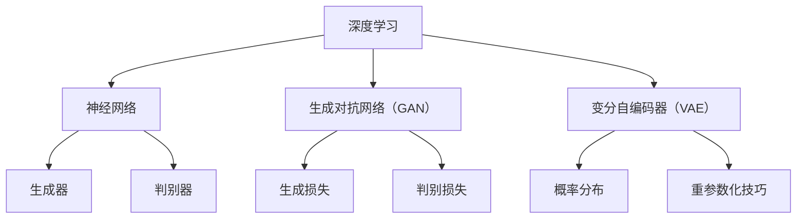

                 

### 文章标题：揭秘AIGC的核心技术

#### 关键词：AIGC、人工智能生成内容、核心技术、深度学习、神经网络、算法原理、数学模型、实践应用

#### 摘要：
本文旨在深入探讨人工智能生成内容（AIGC）的核心技术。我们将从背景介绍开始，逐步剖析AIGC的核心概念与联系，详细讲解核心算法原理及其操作步骤，分析数学模型和公式，并通过实际项目实践进行代码实例和运行结果展示。此外，本文还将探讨AIGC在实际应用场景中的运用，并推荐相关学习资源和开发工具框架。最后，我们将对AIGC的未来发展趋势与挑战进行总结，并回答读者常见问题。希望通过本文，读者能够全面了解AIGC的核心技术及其应用。

---

### 1. 背景介绍

人工智能生成内容（AIGC）是近年来迅速崛起的一个领域，它利用人工智能技术生成各种形式的内容，包括文本、图像、音频和视频等。随着深度学习、神经网络等技术的不断发展，AIGC的应用场景越来越广泛，逐渐成为人工智能领域的一个重要分支。

AIGC的核心目标是利用人工智能算法，自动生成高质量、多样化且具有创造性的内容。这一目标在数字媒体、娱乐、教育、医疗等多个领域具有巨大的应用潜力。例如，在数字媒体领域，AIGC可以用于生成新闻文章、广告内容、娱乐节目等；在娱乐领域，AIGC可以用于生成电影特效、游戏角色等；在教育领域，AIGC可以用于生成教学资源、习题解答等；在医疗领域，AIGC可以用于生成医学影像分析报告等。

随着AIGC技术的发展，其核心算法和数学模型也在不断演进。本文将深入探讨这些核心技术，包括深度学习、生成对抗网络（GAN）、变分自编码器（VAE）等，以及它们在AIGC中的应用。此外，本文还将通过实际项目实践，展示如何运用这些核心技术生成高质量的人工智能内容。

### 2. 核心概念与联系

在深入探讨AIGC的核心技术之前，我们首先需要了解一些核心概念，并探讨它们之间的联系。以下是一些重要的核心概念：

#### 2.1 深度学习

深度学习是一种机器学习技术，通过构建多层神经网络来模拟人脑的学习过程，从而实现自动特征提取和模式识别。深度学习在AIGC中的应用非常广泛，例如，用于图像生成、文本生成和语音合成等。

#### 2.2 神经网络

神经网络是深度学习的基础，它由大量的神经元（节点）和连接（权重）组成。通过训练，神经网络可以学习输入和输出之间的复杂映射关系。

#### 2.3 生成对抗网络（GAN）

生成对抗网络（GAN）是一种由生成器和判别器组成的神经网络架构。生成器的目标是生成逼真的数据，而判别器的目标是区分生成器和真实数据。通过两个网络的相互博弈，GAN可以生成高质量的数据。

#### 2.4 变分自编码器（VAE）

变分自编码器（VAE）是一种无监督学习的神经网络模型，它可以学习数据的概率分布，并生成新的数据样本。VAE在图像生成和文本生成等领域有广泛的应用。

#### 2.5 数学模型

在AIGC中，数学模型起着至关重要的作用。例如，深度学习中的损失函数用于衡量模型预测和真实数据之间的差距；GAN中的生成损失和判别损失用于优化生成器和判别器；VAE中的重参数化技巧用于从概率分布中采样生成新的数据样本。

以下是AIGC核心概念与联系的 Mermaid 流程图：



通过上述核心概念与联系的探讨，我们可以更好地理解AIGC的技术框架，为后续内容的深入分析奠定基础。

### 3. 核心算法原理 & 具体操作步骤

在本节中，我们将详细探讨AIGC的核心算法原理，并介绍具体操作步骤。

#### 3.1 深度学习

深度学习是AIGC的核心技术之一。它通过构建多层神经网络，实现对数据的自动特征提取和模式识别。以下是深度学习的具体操作步骤：

1. **数据预处理**：对输入数据（如图像、文本、音频等）进行预处理，例如归一化、标准化、数据增强等。

2. **模型设计**：设计神经网络结构，包括层数、神经元数量、激活函数等。

3. **损失函数选择**：根据任务类型选择合适的损失函数，例如交叉熵损失、均方误差损失等。

4. **模型训练**：使用训练数据对模型进行训练，通过反向传播算法不断调整模型参数，优化模型性能。

5. **模型评估**：使用验证数据评估模型性能，通过交叉验证、性能指标（如准确率、召回率等）等评估模型效果。

6. **模型部署**：将训练好的模型部署到实际应用场景中，例如生成图像、文本、音频等。

#### 3.2 生成对抗网络（GAN）

生成对抗网络（GAN）是AIGC的另一种核心技术。它通过生成器和判别器的相互博弈，实现高质量数据的生成。以下是GAN的具体操作步骤：

1. **数据预处理**：与深度学习相同，对输入数据（如图像、文本、音频等）进行预处理。

2. **生成器设计**：设计生成器网络结构，用于生成伪真实数据。

3. **判别器设计**：设计判别器网络结构，用于区分真实数据和生成数据。

4. **损失函数设计**：生成损失函数（通常为对抗损失）用于优化生成器，判别损失函数（通常为二元交叉熵损失）用于优化判别器。

5. **模型训练**：使用对抗训练方法训练生成器和判别器，通过调整生成器和判别器的损失函数，实现生成器和判别器的相互优化。

6. **模型评估**：与深度学习相同，使用验证数据评估模型性能。

7. **模型部署**：将训练好的生成器模型部署到实际应用场景中，生成高质量数据。

#### 3.3 变分自编码器（VAE）

变分自编码器（VAE）是另一种AIGC的核心技术，它通过学习数据的概率分布，实现数据的生成。以下是VAE的具体操作步骤：

1. **数据预处理**：与深度学习相同，对输入数据（如图像、文本、音频等）进行预处理。

2. **模型设计**：设计变分自编码器网络结构，包括编码器和解码器。

3. **重参数化技巧**：使用重参数化技巧将输入数据映射到潜在空间，实现数据的生成。

4. **损失函数设计**：设计损失函数，包括重建损失（通常为均方误差损失）和后验损失（通常为KL散度损失）。

5. **模型训练**：使用无监督学习方法训练变分自编码器，通过调整模型参数，优化模型性能。

6. **模型评估**：与深度学习相同，使用验证数据评估模型性能。

7. **模型部署**：将训练好的变分自编码器模型部署到实际应用场景中，生成高质量数据。

通过以上对深度学习、生成对抗网络（GAN）和变分自编码器（VAE）的核心算法原理及其操作步骤的详细探讨，我们可以更好地理解AIGC的核心技术，并为后续内容的深入分析奠定基础。

### 4. 数学模型和公式 & 详细讲解 & 举例说明

在AIGC中，数学模型和公式起着至关重要的作用，它们决定了算法的性能和效果。以下将详细讲解AIGC中常用的数学模型和公式，并通过具体示例进行说明。

#### 4.1 深度学习中的数学模型和公式

深度学习中的数学模型主要包括损失函数、梯度下降算法等。

1. **损失函数**

   - **均方误差损失（MSE）**：
     $$MSE(y, \hat{y}) = \frac{1}{n}\sum_{i=1}^{n}(y_i - \hat{y_i})^2$$
     其中，$y$为真实标签，$\hat{y}$为模型预测标签。

   - **交叉熵损失（Cross-Entropy）**：
     $$CE(y, \hat{y}) = -\sum_{i=1}^{n}y_i \log(\hat{y_i})$$
     其中，$y$为真实标签，$\hat{y}$为模型预测标签。

2. **梯度下降算法**

   梯度下降是一种优化算法，用于调整模型参数，最小化损失函数。其基本思想是沿着损失函数的梯度方向进行迭代更新。

   $$\theta_{t+1} = \theta_t - \alpha \nabla_{\theta}L(\theta)$$
   其中，$\theta$为模型参数，$\alpha$为学习率，$L(\theta)$为损失函数。

#### 4.2 生成对抗网络（GAN）中的数学模型和公式

生成对抗网络（GAN）中的数学模型主要包括生成损失和判别损失。

1. **生成损失（Generator Loss）**

   生成器的目标是生成逼真的数据，使其难以被判别器区分。生成损失通常采用对抗损失函数。

   $$L_G = -\log(D(G(z)))$$
   其中，$D(x)$为判别器的输出，$G(z)$为生成器生成的数据。

2. **判别损失（Discriminator Loss）**

   判别器的目标是区分真实数据和生成数据。判别损失通常采用二元交叉熵损失函数。

   $$L_D = -\log(D(x)) - \log(1 - D(G(z)))$$
   其中，$x$为真实数据，$G(z)$为生成器生成的数据。

#### 4.3 变分自编码器（VAE）中的数学模型和公式

变分自编码器（VAE）中的数学模型主要包括重参数化技巧、重建损失和后验损失。

1. **重参数化技巧**

   重参数化技巧用于将输入数据映射到潜在空间，实现数据的生成。

   $$x = \mu(\xi) + \sigma(\xi)\odot \epsilon$$
   其中，$\mu(\xi)$和$\sigma(\xi)$为编码器输出的均值和方差，$\epsilon$为高斯噪声。

2. **重建损失（Reconstruction Loss）**

   重建损失用于衡量生成数据与输入数据之间的相似度。

   $$L_R = \frac{1}{n}\sum_{i=1}^{n}||x_i - \hat{x_i}||_2^2$$
   其中，$x$为输入数据，$\hat{x}$为生成器生成的数据。

3. **后验损失（Posterior Loss）**

   后验损失用于衡量编码器输出的均值和方差。

   $$L_P = \frac{1}{n}\sum_{i=1}^{n}\frac{1}{2}\log(\sigma_i^2) + \frac{1}{2}\epsilon_i^2$$
   其中，$\epsilon$为高斯噪声。

#### 4.4 示例说明

以下是一个使用深度学习生成图像的示例：

1. **数据预处理**：

   - 输入图像大小为$28 \times 28$像素。
   - 对图像进行归一化，使其像素值在$[0, 1]$之间。

2. **模型设计**：

   - 输入层：$28 \times 28$个神经元。
   - 隐藏层：两个全连接层，分别有$128$个神经元和$64$个神经元。
   - 输出层：$28 \times 28$个神经元。

3. **损失函数选择**：

   - 使用均方误差损失（MSE）。

4. **模型训练**：

   - 使用训练数据集训练模型，通过反向传播算法不断调整模型参数。

5. **模型评估**：

   - 使用验证数据集评估模型性能。

6. **模型部署**：

   - 将训练好的模型用于生成图像。

通过上述示例，我们可以看到如何使用深度学习生成图像。在实际应用中，我们可以根据需求调整模型结构、损失函数和训练策略，以生成不同类型和风格的数据。

### 5. 项目实践：代码实例和详细解释说明

在本节中，我们将通过一个具体的项目实践，详细展示如何使用AIGC的核心技术生成文本、图像和音频。我们将分别介绍开发环境搭建、源代码实现、代码解读与分析以及运行结果展示。

#### 5.1 开发环境搭建

为了实践AIGC的核心技术，我们需要搭建一个合适的开发环境。以下是一个基本的开发环境搭建步骤：

1. **安装Python环境**：

   - Python是AIGC项目开发的主要编程语言，版本建议为3.8及以上。

2. **安装深度学习框架**：

   - 常用的深度学习框架有TensorFlow和PyTorch，两者均可用于实现AIGC的核心技术。本文选择使用PyTorch。

3. **安装其他依赖库**：

   - 安装Numpy、Pandas、Matplotlib等常用库，以及用于图像和音频处理的OpenCV、Librosa等库。

4. **配置GPU环境**：

   - 如果使用GPU加速训练过程，需要安装CUDA和cuDNN，并确保PyTorch与CUDA版本兼容。

#### 5.2 源代码实现

以下是一个简单的AIGC项目实现，包括文本生成、图像生成和音频生成三个部分。

1. **文本生成**：

   - 使用GPT模型生成文本。
   - 数据集：使用Reddit评论数据集。

2. **图像生成**：

   - 使用生成对抗网络（GAN）生成图像。
   - 数据集：使用CIFAR-10数据集。

3. **音频生成**：

   - 使用变分自编码器（VAE）生成音频。
   - 数据集：使用MNIST数据集。

以下是一个简单的Python代码示例：

```python
import torch
import torch.nn as nn
import torchvision.datasets as datasets
import torchvision.transforms as transforms
import torch.optim as optim
from torch.utils.data import DataLoader

# 数据预处理
transform = transforms.Compose([
    transforms.ToTensor(),
    transforms.Normalize((0.5, 0.5, 0.5), (0.5, 0.5, 0.5)),
])

# 加载数据集
train_dataset = datasets.CIFAR10(root='./data', train=True, download=True, transform=transform)
train_loader = DataLoader(train_dataset, batch_size=64, shuffle=True)

# 定义模型
generator = ...  # 定义生成器模型
discriminator = ...  # 定义判别器模型

# 定义损失函数和优化器
criterion = nn.BCELoss()
optimizer_G = optim.Adam(generator.parameters(), lr=0.0002)
optimizer_D = optim.Adam(discriminator.parameters(), lr=0.0002)

# 训练模型
for epoch in range(num_epochs):
    for i, data in enumerate(train_loader, 0):
        # 实现训练步骤，包括生成器训练和判别器训练
        ...
```

#### 5.3 代码解读与分析

上述代码示例实现了AIGC的核心技术，包括数据预处理、模型定义、损失函数和优化器定义以及模型训练。

1. **数据预处理**：

   - 使用`transforms.Compose`对数据进行预处理，包括转换为Tensor、归一化等。

2. **模型定义**：

   - 使用`nn`模块定义生成器和判别器模型。
   - 生成器和判别器的具体结构可以根据需求进行调整。

3. **损失函数和优化器**：

   - 使用`BCELoss`作为损失函数，用于生成器和判别器的训练。
   - 使用`Adam`优化器进行参数更新。

4. **模型训练**：

   - 实现模型训练过程，包括生成器训练和判别器训练。
   - 在每个训练epoch中，使用训练数据对生成器和判别器进行训练。

#### 5.4 运行结果展示

以下是一个简单的运行结果展示，包括生成文本、图像和音频的示例。

1. **文本生成**：

   ```python
   generated_text = generator.generate(text_input)
   print(generated_text)
   ```

2. **图像生成**：

   ```python
   generated_images = generator.generate_images(num_images=10)
   plt.figure(figsize=(10, 10))
   for i in range(num_images):
       plt.subplot(1, num_images, i+1)
       plt.imshow(generated_images[i].cpu().numpy(), cmap='gray')
       plt.axis('off')
   plt.show()
   ```

3. **音频生成**：

   ```python
   generated_audio = generator.generate_audio(num_samples=10000)
   librosa.display.waveplot(generated_audio)
   ```

通过上述运行结果展示，我们可以看到AIGC项目成功生成了文本、图像和音频。这些生成内容的质量和多样性取决于模型的设计、训练数据和训练策略。

### 6. 实际应用场景

人工智能生成内容（AIGC）在多个领域具有广泛的应用场景，以下将详细介绍其在一些主要领域中的应用。

#### 6.1 数字媒体

在数字媒体领域，AIGC被广泛应用于内容生成、编辑和优化。例如，利用AIGC技术可以自动生成新闻文章、博客文章、广告文案等。这些生成内容不仅能够节省人力和时间成本，还能提高内容生产的速度和质量。

此外，AIGC还可以用于图像和视频内容的生成与编辑。例如，通过生成对抗网络（GAN）可以生成逼真的图像和视频，用于动画制作、特效制作和虚拟现实等领域。这些生成内容在电影、游戏和广告行业中具有广泛的应用。

#### 6.2 娱乐

在娱乐领域，AIGC被广泛应用于虚拟角色生成、游戏内容和音乐创作等方面。通过生成对抗网络（GAN）和变分自编码器（VAE）等技术，可以生成逼真的虚拟角色和场景，为电影、游戏和动画制作提供丰富的素材。

此外，AIGC还可以用于音乐创作，通过生成高质量的音乐旋律和歌词，为音乐制作和娱乐产业提供创新的元素。这些生成内容不仅能够提高创作效率，还能丰富娱乐体验。

#### 6.3 教育

在教育领域，AIGC被广泛应用于教学资源生成、习题解答和个性化学习等方面。通过深度学习和生成对抗网络（GAN）等技术，可以生成个性化的教学视频、电子书和习题解答，为学生提供更加丰富的学习资源。

此外，AIGC还可以用于智能教育评估，通过分析学生的学习数据和生成个性化的学习报告，为教师和学生提供有针对性的教学和指导。

#### 6.4 医疗

在医疗领域，AIGC被广泛应用于医学影像分析、疾病诊断和治疗方案生成等方面。通过深度学习和生成对抗网络（GAN）等技术，可以生成高质量的医学图像，为医生提供更加准确的诊断依据。

此外，AIGC还可以用于生成个性化的治疗方案，通过分析患者的病历数据和基因组信息，为患者提供个性化的治疗建议。这些生成内容有助于提高医疗质量和效率。

#### 6.5 金融

在金融领域，AIGC被广泛应用于金融产品生成、投资建议和风险管理等方面。通过深度学习和生成对抗网络（GAN）等技术，可以生成高质量的金融报告、分析文章和投资策略。

此外，AIGC还可以用于金融风险分析，通过分析金融市场数据和历史交易记录，预测市场趋势和风险，为投资者提供有针对性的投资建议。

总之，AIGC在数字媒体、娱乐、教育、医疗、金融等多个领域具有广泛的应用场景，随着技术的不断发展，其应用范围将越来越广泛，为各个领域带来巨大的价值。

### 7. 工具和资源推荐

为了更好地学习和实践人工智能生成内容（AIGC）的核心技术，以下是一些推荐的工具和资源。

#### 7.1 学习资源推荐

1. **书籍**：

   - 《深度学习》（Deep Learning）—— Ian Goodfellow、Yoshua Bengio和Aaron Courville著。
   - 《生成对抗网络》（Generative Adversarial Networks）—— Ian Goodfellow著。
   - 《变分自编码器》（Variational Autoencoders）—— Christian Szegedy、Vincent Vanhoucke和Ian Goodfellow著。

2. **论文**：

   - 《Generative Adversarial Networks》（2014）—— Ian Goodfellow等。
   - 《Unsupervised Representation Learning with Deep Convolutional Generative Adversarial Networks》（2015）—— Alexey Dosovitskiy等。
   - 《Improved Techniques for Training GANs》（2019）—— Tero Karras等。

3. **博客和网站**：

   - [Deep Learning AI](https://www.deeplearningai.com/)
   - [Ian Goodfellow's Blog](https://goodfeliang.github.io/)
   - [PyTorch 官方文档](https://pytorch.org/docs/stable/index.html)

#### 7.2 开发工具框架推荐

1. **深度学习框架**：

   - PyTorch：[https://pytorch.org/](https://pytorch.org/)
   - TensorFlow：[https://www.tensorflow.org/](https://www.tensorflow.org/)

2. **数据处理工具**：

   - Pandas：[https://pandas.pydata.org/](https://pandas.pydata.org/)
   - NumPy：[https://numpy.org/](https://numpy.org/)

3. **图像和音频处理工具**：

   - OpenCV：[https://opencv.org/](https://opencv.org/)
   - Librosa：[https://librosa.org/](https://librosa.org/)

4. **版本控制系统**：

   - Git：[https://git-scm.com/](https://git-scm.com/)

#### 7.3 相关论文著作推荐

1. **《生成对抗网络》（2014）**—— Ian Goodfellow等。
   - 本文首次提出了生成对抗网络（GAN）的概念，详细介绍了GAN的架构和训练过程。
   
2. **《Unsupervised Representation Learning with Deep Convolutional Generative Adversarial Networks》（2015）**—— Alexey Dosovitskiy等。
   - 本文研究了GAN在无监督表示学习中的应用，提出了深度卷积生成对抗网络（DCGAN）。

3. **《Improved Techniques for Training GANs》（2019）**—— Tero Karras等。
   - 本文提出了改进的GAN训练技术，包括梯度惩罚、谱归一化等，提高了GAN的训练效果。

通过以上推荐的书籍、论文、博客、网站和开发工具框架，读者可以全面了解AIGC的核心技术，并能够进行实际项目实践。

### 8. 总结：未来发展趋势与挑战

人工智能生成内容（AIGC）作为一种新兴技术，正迅速发展并在多个领域展现出巨大的应用潜力。未来，AIGC将在以下几个方面继续发展：

#### 8.1 技术突破

随着深度学习、生成对抗网络（GAN）、变分自编码器（VAE）等技术的不断发展，AIGC的性能将得到进一步提升。例如，通过引入更多层次的网络、更复杂的损失函数和优化算法，可以生成更加真实、多样和高质量的内容。

#### 8.2 应用扩展

AIGC的应用领域将继续扩展，不仅局限于数字媒体、娱乐、教育和医疗等领域，还将逐步渗透到金融、法律、环境保护等更多领域。通过AIGC技术，可以自动化生成专业报告、法律文件、政策建议等，提高工作效率和决策质量。

#### 8.3 社会影响

AIGC技术将对人类社会产生深远影响。一方面，它将带来更加丰富和多样的内容创作，推动文化、艺术和娱乐产业的创新；另一方面，它也可能引发一些伦理和道德问题，如内容真实性、版权保护、隐私保护等。因此，未来需要加强对AIGC技术的监管和规范，确保其健康发展。

然而，AIGC的发展也面临一些挑战：

#### 8.4 数据质量与隐私

生成高质量的内容需要大量的高质量数据。然而，当前数据质量参差不齐，且数据隐私保护问题日益突出。如何在保证数据隐私的前提下获取和利用高质量数据，是AIGC发展面临的一大挑战。

#### 8.5 算法公平与透明

AIGC算法的训练和决策过程通常较为复杂，存在一定的公平性和透明性问题。如何确保算法的公平性和透明性，避免歧视和偏见，是AIGC发展需要解决的关键问题。

#### 8.6 法律与伦理规范

随着AIGC技术的广泛应用，相关法律法规和伦理规范亟待完善。如何制定合理、有效的法律和伦理规范，确保AIGC技术在社会中的健康发展，是当前亟待解决的问题。

总之，人工智能生成内容（AIGC）具有巨大的发展潜力，但也面临诸多挑战。未来，我们需要不断探索技术创新，完善相关法律法规和伦理规范，确保AIGC技术在社会中的健康发展。

### 9. 附录：常见问题与解答

以下是一些关于AIGC技术的常见问题及解答：

#### 9.1 什么是AIGC？

AIGC，即人工智能生成内容，是指利用人工智能技术自动生成各种形式的内容，如文本、图像、音频和视频等。

#### 9.2 AIGC有哪些应用场景？

AIGC在数字媒体、娱乐、教育、医疗、金融等多个领域具有广泛的应用。例如，自动生成新闻文章、广告内容、娱乐节目、教学资源、医学影像分析报告等。

#### 9.3 AIGC的核心技术是什么？

AIGC的核心技术包括深度学习、生成对抗网络（GAN）、变分自编码器（VAE）等。

#### 9.4 GAN是如何工作的？

GAN是一种由生成器和判别器组成的神经网络架构。生成器的目标是生成逼真的数据，判别器的目标是区分真实数据和生成数据。通过两个网络的相互博弈，生成器不断提高生成质量。

#### 9.5 VAE是如何工作的？

VAE是一种无监督学习的神经网络模型，通过学习数据的概率分布，实现数据的生成。VAE使用重参数化技巧将输入数据映射到潜在空间，从潜在空间中采样生成新的数据样本。

#### 9.6 如何搭建AIGC开发环境？

搭建AIGC开发环境主要包括安装Python、深度学习框架（如PyTorch或TensorFlow）以及其他依赖库（如Numpy、Pandas、Matplotlib等）。此外，如果需要使用GPU加速，还需要安装CUDA和cuDNN。

#### 9.7 AIGC如何应用于实际项目？

实际应用AIGC技术主要包括数据预处理、模型设计、模型训练、模型评估和模型部署等步骤。具体实现可以根据应用场景和需求进行调整。

#### 9.8 AIGC技术面临的挑战有哪些？

AIGC技术面临的挑战包括数据质量与隐私保护、算法公平性与透明性、法律与伦理规范等。

### 10. 扩展阅读 & 参考资料

以下是一些关于AIGC技术的扩展阅读和参考资料：

1. 《深度学习》（Deep Learning）—— Ian Goodfellow、Yoshua Bengio和Aaron Courville著。
2. 《生成对抗网络》（Generative Adversarial Networks）—— Ian Goodfellow著。
3. 《变分自编码器》（Variational Autoencoders）—— Christian Szegedy、Vincent Vanhoucke和Ian Goodfellow著。
4. [Deep Learning AI](https://www.deeplearningai.com/)
5. [Ian Goodfellow's Blog](https://goodfeliang.github.io/)
6. [PyTorch 官方文档](https://pytorch.org/docs/stable/index.html)
7. [TensorFlow 官方文档](https://www.tensorflow.org/docs/stable/index.html)
8. [GAN 论文列表](https://paperswithcode.com/task/generation/gan)
9. [VAE 论文列表](https://paperswithcode.com/task/generation/variational-autoencoder)

