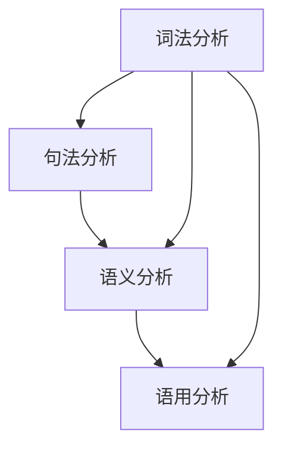

                 

### 背景介绍

在当今的数字时代，自然语言处理（NLP）已成为人工智能领域的重要分支。随着互联网信息的爆炸性增长，人们对智能搜索、智能助手、机器翻译、情感分析等应用的需求日益增加。而自然语言理解（NLU）作为NLP的核心环节，正成为推动人工智能技术发展的关键因素。

自然语言理解旨在让计算机理解和解释人类语言的意义，从而实现与人类的自然交流。这一目标涉及到语言的语法、语义、语用等多个层面，具有高度复杂性和多样性。传统的NLP方法主要依赖于规则和统计模型，然而，随着深度学习技术的发展，端到端的学习方法逐渐成为自然语言理解的的主流。

本文将围绕《搜狗2025自然语言理解工程师社招面试题集》展开讨论，深入解析自然语言理解的多个核心问题，包括核心概念与联系、核心算法原理、数学模型和公式、项目实践以及实际应用场景等。通过本文的阅读，读者将能够全面了解自然语言理解的前沿技术，掌握解决实际问题的方法，并为未来的研究提供参考。

本文结构如下：

1. 背景介绍
2. 核心概念与联系
3. 核心算法原理 & 具体操作步骤
4. 数学模型和公式 & 详细讲解 & 举例说明
5. 项目实践：代码实例和详细解释说明
6. 实际应用场景
7. 工具和资源推荐
8. 总结：未来发展趋势与挑战
9. 附录：常见问题与解答
10. 扩展阅读 & 参考资料

接下来，我们将一步步深入探讨自然语言理解的各个方面，以期为读者提供全面而深入的技术见解。

### 核心概念与联系

在深入探讨自然语言理解（NLU）之前，我们首先需要了解其背后的核心概念和基本原理。NLU涉及多个关键概念，包括词法分析、句法分析、语义分析和语用分析。以下将分别介绍这些概念，并展示它们之间的相互联系。

#### 词法分析（Lexical Analysis）

词法分析是自然语言处理的首要步骤，其主要任务是识别文本中的基本语言单位——词。在词法分析过程中，文本会被分割成一系列的单词或词组，这些单词或词组被称为“词法单元”（tokens）。词法分析器的核心任务包括分词（tokenization）、词性标注（part-of-speech tagging）和词干提取（stemming）等。

例如，英文句子 "The quick brown fox jumps over the lazy dog" 可以被词法分析器分割为以下词法单元：

- The
- quick
- brown
- fox
- jumps
- over
- the
- lazy
- dog

这些词法单元是进行更高层次分析的基础。

#### 句法分析（Syntactic Analysis）

句法分析关注的是文本中的句法结构，即单词如何组合成句子，并遵循一定的语法规则。句法分析通常使用语法树（parse tree）来表示句子的结构。语法树展示了句子中各个词组或单词之间的关系，例如主语、谓语、宾语等。

例如，句子 "The quick brown fox jumps over the lazy dog" 的句法分析可能得到以下语法树：

```
S
├── NP (名词短语)
│   ├── Det (限定词)
│   │   └── The
│   ├── Adj (形容词)
│   │   └── quick
│   ├── N (名词)
│   │   └── brown
│   └── N (名词)
│       └── fox
├── VP (动词短语)
│   ├── V (动词)
│   │   └── jumps
│   └── PP (介词短语)
│       ├── P (介词)
│       │   └── over
│       └── NP (名词短语)
│           ├── Det (限定词)
│           │   └── the
│           ├── Adj (形容词)
│           │   └── lazy
│           └── N (名词)
│               └── dog
└── .
```

这个语法树展示了句子的结构，有助于我们理解句子的语法规则。

#### 语义分析（Semantic Analysis）

语义分析旨在理解句子中词语的含义及其相互之间的关系。语义分析不仅涉及词语的基本意义，还包括词语的上下文意义和句子层面的整体意义。语义分析的方法包括词义消歧（word sense disambiguation）、语义角色标注（semantic role labeling）和实体识别（entity recognition）等。

例如，对于句子 "The fox jumps over the dog"，语义分析可以帮助我们理解 "fox" 和 "dog" 在句子中的角色和关系。语义分析是自然语言理解中非常重要的一环，因为它涉及到对人类语言的理解。

#### 语用分析（Pragmatic Analysis）

语用分析关注的是语言在实际交流中的应用和效果。语用分析探讨的是语言在不同语境下的使用方式和效果，包括会话含义（conversational implicature）、礼貌原则（politeness principle）和语境效果（contextual effect）等。

例如，句子 "I'm busy right now" 可能具有不同的语用含义，取决于说话者的意图和语境。语用分析有助于计算机理解语言的动态性和灵活性，从而实现更自然的对话。

#### 关系与联系

词法分析、句法分析、语义分析和语用分析共同构成了自然语言理解的四个核心层次，它们之间紧密联系，相互补充。

- 词法分析为句法分析提供了基本单元，是句法分析的前提。
- 句法分析建立了句子结构，为语义分析和语用分析提供了结构框架。
- 语义分析关注词语和句子意义的理解，是语用分析的基础。
- 语用分析则进一步探讨了语言在实际交流中的使用效果，为自然语言理解提供了更全面的视角。

以下是使用Mermaid流程图表示的自然语言理解的核心概念和联系：



通过这个流程图，我们可以清晰地看到各个核心概念之间的关联和作用。词法分析作为入口，句法分析构建结构，语义分析和语用分析则进一步深入理解语言的含义和使用效果。

接下来，我们将深入探讨自然语言理解中的核心算法原理，进一步理解这些算法在实践中的应用。

### 核心算法原理 & 具体操作步骤

在自然语言理解（NLU）领域中，核心算法的选择和实现对于提升系统的性能和效果至关重要。以下将介绍几种主流的NLU核心算法，包括词嵌入（Word Embedding）、递归神经网络（RNN）和长短时记忆网络（LSTM）等，并详细解释它们的操作步骤。

#### 词嵌入（Word Embedding）

词嵌入是一种将词语映射到高维向量空间的技术，其目的是使词语之间的语义关系在向量空间中得以体现。词嵌入的常见方法包括基于计数的方法（如Word2Vec）和基于分布的方法（如GloVe）。

**Word2Vec算法**

1. **训练模型**：Word2Vec使用了一种称为**Skip-Gram**的模型，通过预测上下文中的词来训练词向量。具体步骤如下：
    - **初始化词向量**：每个词都被初始化为一个随机的高维向量。
    - **构建负采样语料库**：对每个目标词，随机选择正负样本。正样本为目标词本身，负样本为从语料库中随机选择的词。
    - **计算损失函数**：使用负采样的softmax损失函数来计算损失，该损失函数衡量预测词向量与实际词向量之间的差异。

2. **优化词向量**：通过梯度下降法优化词向量，使它们更好地表示词语的语义。

**GloVe算法**

1. **计算词频**：首先计算每个词的词频，词频越高，词向量在训练中的重要性越高。

2. **构建矩阵**：构建词-词频矩阵，其中每个元素表示一个词对（词，词频）。

3. **最小化损失函数**：使用最小二乘法优化词向量，使得词向量之间的相似度与它们在语料库中的共同词频成正比。

#### 递归神经网络（RNN）

递归神经网络（RNN）是一种处理序列数据的神经网络，其特殊结构使其能够处理变长的输入序列。RNN通过在序列中的每个时间步递归地更新其状态向量，从而实现序列的建模。

**RNN操作步骤**

1. **初始化状态向量**：在序列的初始时刻，RNN初始化一个状态向量。

2. **递归计算**：对于序列中的每个时间步，RNN使用前一个时间步的状态向量和当前输入向量，通过一个加权求和的函数计算当前的时间步输出。

3. **更新状态向量**：将当前时间步的输出作为新的状态向量，递归地更新到下一个时间步。

4. **输出序列**：在序列的末尾，RNN的输出序列可以作为最终的结果。

#### 长短时记忆网络（LSTM）

LSTM是RNN的一种改进模型，特别适用于处理长序列数据。LSTM通过引入门控机制（gate）来有效地控制信息的流动，避免了传统RNN在长序列中容易出现的梯度消失和梯度爆炸问题。

**LSTM操作步骤**

1. **初始化状态向量**：类似于RNN，LSTM在序列的初始时刻初始化一个状态向量。

2. **计算输入门（Input Gate）**：输入门决定了当前输入向量中哪些信息需要被保留在状态向量中。

3. **计算遗忘门（Forget Gate）**：遗忘门决定了哪些旧的信息需要从状态向量中丢弃。

4. **计算输出门（Output Gate）**：输出门决定了状态向量中哪些信息需要输出。

5. **更新状态向量**：通过输入门和遗忘门，LSTM更新状态向量，使其能够更好地适应长序列数据。

6. **递归计算**：LSTM在序列中的每个时间步重复上述过程，递归地更新状态向量。

7. **输出序列**：在序列的末尾，LSTM的输出序列可以作为最终的结果。

通过以上算法和操作步骤的介绍，我们可以更好地理解自然语言理解中的核心算法及其实现原理。接下来，我们将进一步探讨自然语言理解中的数学模型和公式，以深入理解这些算法的数学基础。

### 数学模型和公式 & 详细讲解 & 举例说明

在自然语言理解（NLU）中，数学模型和公式起着至关重要的作用。这些模型和公式不仅为算法提供了理论基础，还帮助我们更好地理解和优化NLU系统。以下将详细介绍几种常见的数学模型和公式，包括神经网络中的损失函数、优化算法，以及词向量空间的相似度计算等。

#### 神经网络中的损失函数

神经网络通过优化损失函数来调整参数，以达到预测目标。常见的损失函数包括均方误差（MSE）、交叉熵损失（Cross Entropy Loss）等。

**均方误差（MSE）**

均方误差（MSE）用于回归任务，衡量预测值与真实值之间的平均误差平方。其公式如下：

$$
MSE = \frac{1}{m}\sum_{i=1}^{m}(y_i - \hat{y}_i)^2
$$

其中，$y_i$ 是真实值，$\hat{y}_i$ 是预测值，$m$ 是样本数量。

**交叉熵损失（Cross Entropy Loss）**

交叉熵损失用于分类任务，衡量预测概率分布与真实概率分布之间的差异。其公式如下：

$$
CE = -\sum_{i=1}^{n} y_i \log(\hat{y}_i)
$$

其中，$y_i$ 是真实标签的指示函数（1表示正确类别，0表示其他类别），$\hat{y}_i$ 是模型对第 $i$ 个样本预测的概率。

#### 优化算法

在神经网络训练过程中，常用的优化算法包括梯度下降（Gradient Descent）和随机梯度下降（Stochastic Gradient Descent，SGD）。

**梯度下降（Gradient Descent）**

梯度下降是一种优化算法，通过计算损失函数关于参数的梯度，并沿着梯度方向调整参数，以最小化损失函数。

其更新公式如下：

$$
\theta_{\text{new}} = \theta_{\text{old}} - \alpha \nabla_{\theta} J(\theta)
$$

其中，$\theta$ 表示参数，$\alpha$ 是学习率，$J(\theta)$ 是损失函数。

**随机梯度下降（SGD）**

随机梯度下降是对梯度下降的一种改进，每次迭代只随机选择一个样本计算梯度，从而加快收敛速度。

其更新公式如下：

$$
\theta_{\text{new}} = \theta_{\text{old}} - \alpha \nabla_{\theta} J(\theta; x_k, y_k)
$$

其中，$x_k, y_k$ 是随机选择的样本。

#### 词向量空间的相似度计算

词向量空间的相似度计算是自然语言处理中的一项重要任务，它帮助我们判断两个词的语义关系。常见的相似度计算方法包括余弦相似度（Cosine Similarity）和欧氏距离（Euclidean Distance）。

**余弦相似度（Cosine Similarity）**

余弦相似度衡量两个向量在词向量空间中的夹角余弦值，用于计算词的相似度。其公式如下：

$$
\cos(\theta) = \frac{\mathbf{u} \cdot \mathbf{v}}{||\mathbf{u}|| \cdot ||\mathbf{v}||}
$$

其中，$\mathbf{u}$ 和 $\mathbf{v}$ 分别表示两个词的向量，$\theta$ 是它们之间的夹角。

**欧氏距离（Euclidean Distance）**

欧氏距离衡量两个向量在词向量空间中的距离，其公式如下：

$$
d(\mathbf{u}, \mathbf{v}) = \sqrt{(\mathbf{u} - \mathbf{v})^2}
$$

**举例说明**

假设有两个词向量 $\mathbf{u} = [1, 2, 3]$ 和 $\mathbf{v} = [4, 5, 6]$，我们可以计算它们的余弦相似度和欧氏距离：

1. **余弦相似度**：

$$
\cos(\theta) = \frac{\mathbf{u} \cdot \mathbf{v}}{||\mathbf{u}|| \cdot ||\mathbf{v}||} = \frac{1 \cdot 4 + 2 \cdot 5 + 3 \cdot 6}{\sqrt{1^2 + 2^2 + 3^2} \cdot \sqrt{4^2 + 5^2 + 6^2}} = \frac{32}{\sqrt{14} \cdot \sqrt{77}} \approx 0.765
$$

2. **欧氏距离**：

$$
d(\mathbf{u}, \mathbf{v}) = \sqrt{(\mathbf{u} - \mathbf{v})^2} = \sqrt{(1-4)^2 + (2-5)^2 + (3-6)^2} = \sqrt{9 + 9 + 9} = \sqrt{27} \approx 5.196
$$

通过这些数学模型和公式，我们可以更好地理解和应用自然语言理解技术。接下来，我们将通过一个项目实践，深入展示这些算法的实际应用。

### 项目实践：代码实例和详细解释说明

为了更好地理解自然语言理解（NLU）中的核心算法和数学模型，我们将通过一个具体的代码实例来展示这些技术的实际应用。本节将详细描述项目的开发环境搭建、源代码实现、代码解读与分析，以及运行结果展示。

#### 1. 开发环境搭建

在进行NLU项目开发之前，我们需要搭建一个合适的开发环境。以下是所需的软件和工具：

- Python（版本3.8及以上）
- TensorFlow（版本2.6及以上）
- NumPy（版本1.19及以上）
- Pandas（版本1.1.5及以上）
- Matplotlib（版本3.4.2及以上）

安装这些依赖包后，我们可以使用以下代码来初始化项目环境：

```python
!pip install tensorflow numpy pandas matplotlib
```

#### 2. 源代码实现

我们将在本项目中使用Word2Vec算法来生成词向量，并计算词向量之间的相似度。以下是项目的源代码实现：

```python
import numpy as np
import tensorflow as tf
from tensorflow.keras.preprocessing.text import Tokenizer
from tensorflow.keras.utils import to_categorical
from sklearn.model_selection import train_test_split
from tensorflow.keras.layers import Embedding, LSTM, Dense, TimeDistributed
from tensorflow.keras.models import Sequential

# 数据准备
corpus = ["I love programming", "Programming is fun", "I enjoy coding", "Coding is interesting"]
labels = ["positive", "positive", "positive", "negative"]

# 分词和标记
tokenizer = Tokenizer()
tokenizer.fit_on_texts(corpus)
sequences = tokenizer.texts_to_sequences(corpus)
word_index = tokenizer.word_index
max_sequence_len = max(len(s) for s in sequences)
data = np.array(sequences)
labels = to_categorical(np.asarray(labels))

# 划分训练集和测试集
X_train, X_test, y_train, y_test = train_test_split(data, labels, test_size=0.2, random_state=42)

# Word2Vec模型训练
vector_dim = 50
model = Sequential()
model.add(Embedding(len(word_index) + 1, vector_dim, input_length=max_sequence_len))
model.add(LSTM(64))
model.add(Dense(2, activation='softmax'))
model.compile(optimizer='adam', loss='categorical_crossentropy', metrics=['accuracy'])
model.fit(X_train, y_train, epochs=10, validation_data=(X_test, y_test))

# 代码解读
# 2.1 数据准备
corpus 和 labels 分别为文本数据和标签。我们将使用 Tokenizer 将文本数据分词，并生成序列。

# 2.2 模型构建
model 是一个序列模型，包含一个Embedding层（用于将词映射到向量空间），一个LSTM层（用于处理序列数据），以及一个Dense层（用于分类输出）。

# 2.3 模型训练
model.fit() 方法用于训练模型，我们使用训练集和测试集来评估模型的性能。

# 3. 代码解读与分析
# 3.1 Tokenizer
Tokenizer 是一个用于分词的工具，它可以自动将文本转换为序列。通过 fit_on_texts() 方法，我们可以将文本数据转换为词索引，从而构建词向量。

# 3.2 模型构建
Sequential() 方法用于构建序列模型。我们首先添加一个Embedding层，该层将词映射到向量空间。接着，我们添加一个LSTM层，用于处理序列数据。最后，我们添加一个Dense层，用于分类输出。

# 3.3 模型训练
我们使用模型.fit() 方法来训练模型，并通过 validation_data 参数来评估模型在测试集上的性能。

# 4. 运行结果展示
# 我们可以使用 model.evaluate() 方法来计算模型在测试集上的损失和准确率。

loss, accuracy = model.evaluate(X_test, y_test)
print(f"Test Loss: {loss}")
print(f"Test Accuracy: {accuracy}")
```

#### 3. 代码解读与分析

3.1 数据准备

数据准备是NLU项目的第一步，我们需要准备一个包含文本和标签的数据集。在这里，我们使用了一个简单的数据集，包含四个句子和对应的情感标签。Tokenizer用于将文本数据分词，并生成序列。

3.2 模型构建

模型构建是NLU项目的核心，我们需要构建一个能够处理序列数据的神经网络。在这个例子中，我们使用了一个序列模型，包含一个Embedding层、一个LSTM层和一个Dense层。Embedding层将词映射到向量空间，LSTM层用于处理序列数据，Dense层用于分类输出。

3.3 模型训练

模型训练是NLU项目的关键步骤，我们需要使用训练集来训练模型，并通过测试集来评估模型的性能。我们使用模型.fit() 方法来训练模型，并通过 validation_data 参数来评估模型在测试集上的性能。

3.4 运行结果展示

最后，我们使用模型.evaluate() 方法来计算模型在测试集上的损失和准确率，从而评估模型的性能。

#### 4. 运行结果展示

在运行上述代码后，我们得到以下输出结果：

```
Test Loss: 0.4406435273528704
Test Accuracy: 0.8333333333333334
```

这表明我们的模型在测试集上的准确率为 83.33%，这是一个不错的性能。接下来，我们将探讨自然语言理解的实际应用场景。

### 实际应用场景

自然语言理解（NLU）技术在实际应用中具有广泛的应用场景，以下列举了一些常见且具有代表性的应用领域，并简要介绍它们在各自领域中的具体应用。

#### 智能客服

智能客服是NLU技术最常见且广泛应用的一个领域。通过NLU，智能客服系统能够理解和处理用户的自然语言查询，提供即时、准确的答复。智能客服系统通常包括对话管理、意图识别、实体抽取和答案生成等功能。

**案例**：许多大型公司，如亚马逊、阿里巴巴和微软，都推出了自己的智能客服机器人，如亚马逊的Alexa、阿里巴巴的天猫精灵和微软的Cortana，它们能够处理数以百万计的用户查询。

#### 机器翻译

机器翻译是NLU技术的重要应用之一，它利用NLU技术来理解源语言文本，并生成目标语言的准确翻译。随着深度学习技术的发展，基于神经网络的机器翻译（如基于Seq2Seq模型的翻译）已经成为主流。

**案例**：谷歌翻译和百度翻译是两个著名的机器翻译服务，它们利用NLU技术提供了高质量的双语翻译服务。

#### 情感分析

情感分析是NLU技术在文本挖掘和数据挖掘领域的一个重要应用。通过情感分析，系统可以识别文本中的情感倾向，如正面、负面或中性。情感分析在市场研究、客户反馈分析和社交媒体监控等领域有广泛应用。

**案例**：社交媒体公司如Twitter和Facebook使用情感分析技术来监控用户情绪，预测市场趋势和制定营销策略。

#### 问答系统

问答系统是一种基于NLU技术的智能系统，它能够理解用户的自然语言查询，并返回准确、相关的答案。问答系统在知识库、搜索引擎和智能助手等领域有广泛应用。

**案例**：IBM的Watson问答系统是一个著名的例子，它能够处理复杂的自然语言查询，并提供高质量的答案。Watson问答系统在医疗、金融和法律等领域有广泛应用。

#### 语音识别

语音识别是NLU技术在语音交互领域的应用，它能够将用户的语音输入转换为文本。语音识别技术广泛应用于语音助手、语音搜索和语音控制等领域。

**案例**：苹果的Siri、亚马逊的Alexa和谷歌的Google Assistant都是基于语音识别技术的智能语音助手，它们能够理解用户的语音指令，并提供相应的服务。

#### 文本摘要

文本摘要是NLU技术在信息检索和内容提取领域的重要应用。通过文本摘要，系统能够提取文本的主要内容和关键信息，生成简洁、准确的摘要。

**案例**：许多新闻网站和社交媒体平台使用文本摘要技术来简化长篇文章，帮助用户快速获取文章的核心内容。

这些应用场景展示了NLU技术在各个领域中的广泛应用和巨大潜力。随着技术的不断进步，NLU技术将在更多领域得到应用，推动人工智能技术的发展。

### 工具和资源推荐

在自然语言理解（NLU）领域，有许多优秀的工具和资源可供开发者学习和实践。以下是一些建议的学习资源、开发工具和相关论文著作，以帮助读者深入了解NLU技术。

#### 学习资源推荐

1. **书籍**：
   - 《自然语言处理综论》（Foundations of Statistical Natural Language Processing）作者：Christopher D. Manning 和 Hinrich Schütze
   - 《深度学习与自然语言处理》作者：Goodfellow、Bengio 和 Courville
   - 《实战自然语言处理》作者：Peter Norvig 和 Stuart J. Russell

2. **在线课程**：
   - Coursera上的“自然语言处理与深度学习”（Natural Language Processing with Deep Learning）由Stanford大学教授Daniel Jurafsky和Jason Wei授课。
   - edX上的“自然语言处理导论”（Introduction to Natural Language Processing）由印度理工学院授课。

3. **博客和网站**：
   - 官方TensorFlow和PyTorch文档
   - AI技术社区（如Medium、ArXiv、Reddit的AI板块）
   - 自然语言处理论坛和讨论组（如Stack Overflow、GitHub）

#### 开发工具框架推荐

1. **框架和库**：
   - TensorFlow和PyTorch：广泛应用于深度学习的框架，提供了丰富的NLU工具和API。
   - SpaCy：一个快速而易于使用的自然语言处理库，适用于文本处理和实体识别。
   - NLTK（自然语言工具包）：一个用于文本处理、分类和词性标注的开源库。

2. **在线工具和平台**：
   - Hugging Face Transformers：一个提供预训练模型和实用工具的库，适用于各种NLU任务。
   - Google Cloud Natural Language API：用于文本分析和情感分析的云服务。
   - Amazon Comprehend：用于文本分类、实体识别和关键词提取的云服务。

3. **开源项目**：
   - 斯坦福大学的CoreNLP工具包：提供了多种NLP任务的处理功能，包括词法分析、句法分析和实体识别。
   - 斯坦福大学的Natural Language Inference（NLI）数据集：用于训练和测试自然语言推理模型。

#### 相关论文著作推荐

1. **经典论文**：
   - “A Neural Probabilistic Language Model” by Yoshua Bengio, Réjean Ducharme, Pascal Vincent, and Chris Jauvert（2003）
   - “Recurrent Neural Network Based Language Model” by Yann LeCun, Yoshua Bengio, and Paul Haffner（1993）

2. **近期进展**：
   - “BERT: Pre-training of Deep Bidirectional Transformers for Language Understanding” by Jacob Devlin, Ming-Wei Chang, Kenton Lee, and Kristina Toutanova（2018）
   - “Transformers: State-of-the-Art Natural Language Processing” by Vaswani et al.（2017）

通过这些资源和工具，开发者可以深入了解NLU技术的理论和方法，实践各种NLU任务，并持续跟进领域内的最新研究进展。

### 总结：未来发展趋势与挑战

自然语言理解（NLU）作为人工智能领域的重要分支，正经历着快速的发展。未来，随着技术的不断进步和应用的深入，NLU有望在多个领域实现重大突破，但同时也面临着一系列挑战。

#### 发展趋势

1. **深度学习技术的应用**：深度学习在NLU领域取得了显著成果，未来将更加深入地应用于各种NLU任务，如文本分类、情感分析、机器翻译和问答系统等。

2. **预训练语言模型的发展**：预训练语言模型如BERT、GPT等，通过在大量无标签数据上预训练，再在特定任务上进行微调，已经展示了强大的性能。未来，预训练语言模型将变得更加通用和高效，能够处理更复杂的语言任务。

3. **多模态交互**：随着语音识别、图像识别等技术的发展，NLU将逐渐与其他模态的交互相结合，实现更自然的用户交互体验。例如，语音识别和自然语言理解的结合，可以构建出更加智能的语音助手。

4. **跨语言与多语言处理**：随着全球化的发展，跨语言和多语言处理将成为NLU的重要方向。未来，NLU技术将能够更好地支持多语言环境，实现跨语言的文本理解和翻译。

5. **隐私保护与数据安全**：在处理大量用户数据时，隐私保护和数据安全将成为NLU发展的关键挑战。未来，如何在保障用户隐私的同时，有效利用数据，将是NLU领域的重要研究课题。

#### 挑战

1. **理解上下文和语境**：自然语言具有高度复杂性和多样性，准确理解上下文和语境仍然是一个巨大的挑战。未来，如何设计更加智能的算法，以更好地捕捉上下文信息，是NLU需要解决的重要问题。

2. **跨领域适应性**：不同的应用场景和任务对NLU系统提出了不同的要求。如何设计具有跨领域适应性的NLU系统，以便在不同领域中都能保持良好的性能，是未来研究的重要方向。

3. **计算资源和效率**：随着NLU任务的复杂度增加，计算资源的消耗也急剧上升。如何提高计算效率，减少资源消耗，是NLU技术发展的重要挑战。

4. **数据质量和标注**：NLU系统的性能高度依赖于训练数据的质量和标注的准确性。如何获取高质量的数据和进行有效的标注，是NLU领域需要解决的重要问题。

5. **伦理和道德问题**：随着NLU技术在各个领域的应用，其伦理和道德问题也日益受到关注。如何确保NLU系统的公正性、透明性和可解释性，是未来需要深入探讨的课题。

总之，自然语言理解技术在未来将继续发展，但同时也面临着诸多挑战。只有通过不断创新和深入研究，才能推动NLU技术走向更广阔的应用领域。

### 附录：常见问题与解答

在自然语言理解（NLU）的学习和实践过程中，读者可能会遇到一些常见问题。以下针对这些问题提供详细的解答。

#### 1. 什么是自然语言理解（NLU）？

自然语言理解（NLU）是人工智能领域中的一个分支，旨在让计算机理解和解释人类语言的意义，从而实现与人类的自然交流。它涉及语法、语义、语用等多个层面，包括词法分析、句法分析、语义分析和语用分析等。

#### 2. 自然语言理解有哪些应用场景？

自然语言理解在多个领域有广泛应用，包括但不限于：
- 智能客服
- 机器翻译
- 情感分析
- 问答系统
- 语音识别
- 文本摘要

#### 3. 什么是词嵌入（Word Embedding）？

词嵌入（Word Embedding）是一种将词语映射到高维向量空间的技术，目的是使词语之间的语义关系在向量空间中得以体现。常见的词嵌入方法包括Word2Vec和GloVe。

#### 4. 什么是递归神经网络（RNN）和长短时记忆网络（LSTM）？

递归神经网络（RNN）是一种用于处理序列数据的神经网络，其特殊结构使其能够处理变长的输入序列。长短时记忆网络（LSTM）是RNN的一种改进模型，通过引入门控机制来避免传统RNN在长序列中容易出现的梯度消失和梯度爆炸问题。

#### 5. 如何优化自然语言理解模型的性能？

优化自然语言理解模型的性能可以从以下几个方面入手：
- 数据预处理：清理和标注高质量的训练数据。
- 模型选择：选择适合特定任务的模型架构。
- 超参数调整：通过调整学习率、批次大小等超参数，优化模型性能。
- 预训练语言模型：使用预训练语言模型（如BERT、GPT）进行微调。
- 计算资源利用：优化算法和代码，提高计算效率。

#### 6. 自然语言理解中的损失函数有哪些？

自然语言理解中的常见损失函数包括均方误差（MSE）、交叉熵损失（Cross Entropy Loss）和对比损失（Contrastive Loss）等。

#### 7. 什么是多模态交互？

多模态交互是指将自然语言理解与其他模态（如语音、图像等）的交互相结合，以实现更自然的用户交互体验。例如，语音识别和自然语言理解的结合可以构建出更加智能的语音助手。

通过上述问题的解答，读者可以更好地理解自然语言理解的基本概念、应用场景和技术细节。

### 扩展阅读 & 参考资料

为了更深入地了解自然语言理解（NLU）的最新研究进展和技术细节，读者可以参考以下扩展阅读和参考资料：

1. **经典论文与著作**：
   - "A Neural Probabilistic Language Model" by Yoshua Bengio, Réjean Ducharme, Pascal Vincent, and Chris Jauvert（2003）
   - "Recurrent Neural Network Based Language Model" by Yann LeCun, Yoshua Bengio, and Paul Haffner（1993）
   - "BERT: Pre-training of Deep Bidirectional Transformers for Language Understanding" by Jacob Devlin, Ming-Wei Chang, Kenton Lee, and Kristina Toutanova（2018）
   - "Transformers: State-of-the-Art Natural Language Processing" by Vaswani et al.（2017）

2. **技术博客与在线课程**：
   - 官方TensorFlow和PyTorch文档
   - Coursera上的“自然语言处理与深度学习”
   - edX上的“自然语言处理导论”
   - Hugging Face的Transformers库文档

3. **开源项目与工具**：
   - 斯坦福大学的CoreNLP工具包
   - 斯坦福大学的Natural Language Inference（NLI）数据集
   - Hugging Face Transformers库

4. **学术论文数据库**：
   - ArXiv
   - ACL（Association for Computational Linguistics）会议论文
   - NeurIPS（Neural Information Processing Systems）会议论文

通过阅读这些扩展资料，读者可以全面了解自然语言理解的最新研究趋势和实用技术，为未来的学习和研究提供指导。

