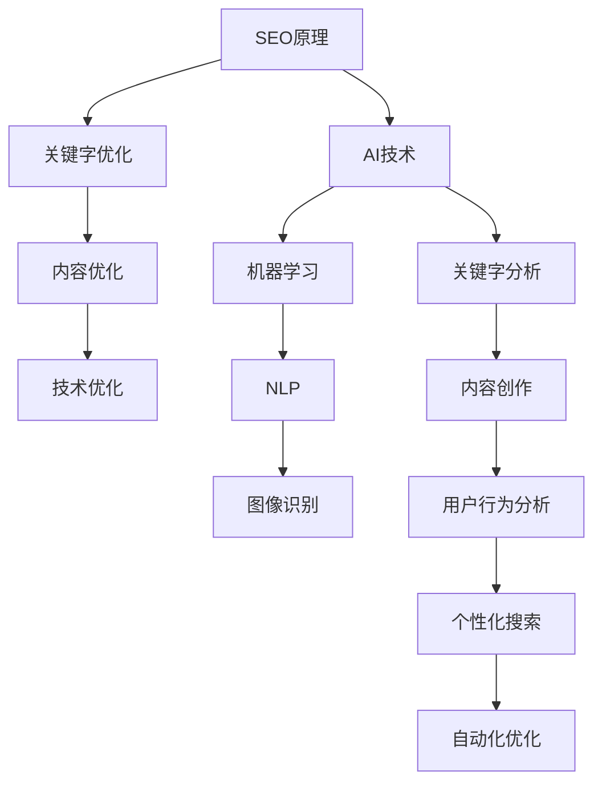

                 

### 背景介绍

随着互联网的迅猛发展，搜索引擎优化（SEO）已经成为网站和在线业务成功不可或缺的一部分。SEO的目标是通过改进网站结构和内容，提高网站在搜索引擎结果页面（SERP）中的排名，从而吸引更多的访问者。然而，随着搜索引擎算法的不断进化，单纯依靠传统的SEO方法已难以满足日益增长的需求。

近年来，人工智能（AI）技术的飞速发展，为搜索引擎优化带来了新的机遇。AI能够处理海量数据，通过机器学习和深度学习算法，为SEO提供更加智能的解决方案。例如，自然语言处理（NLP）、图像识别和推荐系统等技术，都可以在SEO中发挥重要作用。

本文将探讨SEO与AI的结合，分析AI在SEO中的应用，探讨如何利用AI技术提升SEO效果。我们将首先介绍SEO的基本原理，然后深入探讨AI技术在SEO中的应用，最后分析AI在SEO领域的挑战与未来发展趋势。

### 核心概念与联系

要理解SEO与AI的结合，我们首先需要了解两个核心概念：SEO的基本原理和AI的基础知识。

#### SEO的基本原理

SEO的核心目标是提高网站在搜索引擎结果页面（SERP）中的排名。搜索引擎的工作原理大致可以分为以下几个步骤：

1. **爬取（Crawling）**：搜索引擎通过蜘蛛程序爬取互联网上的网页，收集网页的内容和链接信息。
2. **索引（Indexing）**：搜索引擎对爬取的网页进行分析，并将相关信息存储在索引数据库中。
3. **排名（Ranking）**：当用户输入搜索查询时，搜索引擎根据索引数据库中的信息，为每个网页计算相关性得分，并按得分从高到低排序，展示在搜索结果页面上。

SEO策略主要围绕以下方面展开：

1. **关键字优化（Keyword Optimization）**：选择和优化对目标用户群体具有高搜索量的关键字，以提高网站在相关查询中的排名。
2. **内容优化（Content Optimization）**：通过创作高质量、对用户有价值的内容，提高用户停留时间和页面交互，从而提升网站排名。
3. **技术优化（Technical Optimization）**：改进网站结构、速度和移动友好性等，确保搜索引擎能够有效抓取和索引网站内容。

#### AI的基础知识

人工智能是一种模拟人类智能的技术，旨在使计算机系统具备感知、学习和推理的能力。AI的核心技术包括：

1. **机器学习（Machine Learning）**：通过数据驱动的方式，让计算机系统从数据中学习，并自动改进性能。
2. **深度学习（Deep Learning）**：一种基于人工神经网络的机器学习技术，通过多层神经网络进行复杂的数据特征提取。
3. **自然语言处理（Natural Language Processing, NLP）**：使计算机理解和生成人类语言的技术，包括语言理解、文本生成和情感分析等。
4. **图像识别（Image Recognition）**：让计算机能够识别和理解图像内容的技术，广泛应用于人脸识别、物体检测和自动驾驶等领域。

#### AI与SEO的联系

AI与SEO的结合主要体现在以下几个方面：

1. **关键字分析**：AI可以通过分析大量历史搜索数据，识别出潜在的关键字，帮助SEO专家制定更加精准的关键字策略。
2. **内容创作**：AI可以帮助自动生成文章、博客和产品描述，甚至通过自然语言生成（NLG）技术，实现高质量的原创内容创作。
3. **用户行为分析**：AI可以分析用户在网站上的行为数据，了解用户的兴趣和需求，为SEO提供更准确的优化方向。
4. **个性化搜索**：AI技术可以基于用户的搜索历史和偏好，实现个性化搜索结果，提高用户体验和网站转化率。
5. **自动化优化**：AI可以通过自动化工具，监控网站性能，自动执行SEO优化任务，提高SEO工作的效率和效果。

下面是SEO与AI结合的Mermaid流程图：



通过这个流程图，我们可以清晰地看到SEO和AI技术之间的联系，以及它们如何协同工作，为SEO带来更加智能和高效的解决方案。

### 核心算法原理 & 具体操作步骤

要深入理解SEO与AI的结合，我们需要探讨一些核心算法原理和具体操作步骤。这些算法和步骤不仅能够提升SEO效果，还能够为SEO专家和开发人员提供更加智能化的工具和方法。

#### 1. 关键字分析算法

关键字分析是SEO的基础，它决定了网站内容的关键字策略。AI技术在关键字分析中发挥着重要作用，以下是几个关键步骤：

**1.1 数据收集**：首先，需要收集与目标网站相关的搜索数据，包括关键词搜索量、竞争程度、相关关键词等。

**1.2 数据预处理**：对收集到的数据进行清洗和预处理，包括去除无效数据、统一关键字格式等。

**1.3 关键字挖掘**：利用机器学习算法，从预处理的搜索数据中挖掘出潜在的关键字。常用的算法有TF-IDF（词频-逆文档频率）和Word2Vec（词嵌入）等。

**1.4 关键字排名**：根据挖掘出的关键字，利用搜索引擎提供的API，获取每个关键字的排名情况，并评估其潜力。

**1.5 策略调整**：根据关键字排名和潜力评估，调整网站的关键字策略，优化内容结构和关键词分布。

#### 2. 内容创作算法

高质量的内容是SEO成功的关键，AI技术在内容创作中也有着广泛的应用。以下是内容创作的基本步骤：

**2.1 主题选择**：通过分析用户搜索行为和竞争对手内容，确定潜在的内容主题。

**2.2 数据收集**：收集与选定主题相关的数据，包括行业报告、用户评论、竞争对手内容等。

**2.3 内容生成**：利用自然语言生成（NLG）技术，自动生成文章、博客和产品描述。常用的NLG技术包括模板匹配、规则方法和生成式对抗网络（GAN）等。

**2.4 内容优化**：对生成的文本进行优化，包括关键字密度、文本流畅性和用户体验等方面。

**2.5 内容发布**：将优化后的内容发布到网站或社交媒体平台，吸引目标用户。

#### 3. 用户行为分析算法

了解用户行为是优化SEO策略的重要手段，AI技术在用户行为分析中有着广泛应用。以下是用户行为分析的基本步骤：

**3.1 数据收集**：收集用户在网站上的行为数据，包括页面访问、点击、停留时间、跳出率等。

**3.2 数据预处理**：对收集到的数据进行分析，去除噪声和异常值，提取有用的行为特征。

**3.3 行为建模**：利用机器学习算法，建立用户行为模型，预测用户对特定内容的兴趣和行为。

**3.4 策略调整**：根据用户行为模型，调整网站内容和结构，提高用户体验和转化率。

#### 4. 个性化搜索算法

个性化搜索是提高用户满意度和转化率的重要手段，AI技术在个性化搜索中也有着广泛应用。以下是个性化搜索的基本步骤：

**4.1 用户画像**：通过收集用户历史数据和交互数据，建立用户画像。

**4.2 内容推荐**：利用推荐系统算法，根据用户画像和搜索历史，为用户推荐相关内容。

**4.3 搜索结果优化**：对搜索结果进行个性化排序，提高用户满意度和转化率。

**4.4 反馈循环**：根据用户对推荐内容的反馈，调整推荐策略，优化用户体验。

#### 5. 自动化优化算法

自动化优化是提高SEO效率和效果的关键，AI技术在自动化优化中有着广泛应用。以下是自动化优化的基本步骤：

**5.1 数据收集**：收集网站性能数据，包括页面加载速度、搜索引擎抓取情况等。

**5.2 模型训练**：利用机器学习算法，建立网站性能预测模型。

**5.3 自动化执行**：根据预测模型，自动化执行SEO优化任务，包括关键字优化、内容更新、技术优化等。

**5.4 效果评估**：评估自动化优化任务的效果，并根据效果调整优化策略。

通过以上核心算法和步骤，我们可以看到AI技术如何与SEO相结合，为SEO专家和开发人员提供更加智能和高效的解决方案。这些算法和步骤不仅能够提升SEO效果，还能够为SEO领域带来全新的发展方向和机遇。

### 数学模型和公式 & 详细讲解 & 举例说明

在SEO与AI结合的过程中，数学模型和公式扮演着关键角色，它们能够量化SEO策略的效果，并提供数据驱动的决策支持。以下我们将详细讲解一些重要的数学模型和公式，并通过实际案例来展示它们的应用。

#### 1. 优化目标函数

SEO的核心目标是通过优化网站在搜索引擎结果页面（SERP）的排名，吸引更多流量。我们可以用以下优化目标函数来表示：

$$
\max \ \sum_{i=1}^{n} R_i \cdot C_i
$$

其中，\(R_i\) 表示第 \(i\) 个关键字的关键词排名，\(C_i\) 表示第 \(i\) 个关键字的竞争程度。这个目标函数的目的是最大化排名高且竞争程度低的关鍵字的总得分。

#### 2. 关键字选择模型

关键字选择是SEO的基础，常用的模型包括TF-IDF（词频-逆文档频率）和基于机器学习的模型。

**2.1 TF-IDF模型**

TF-IDF模型通过计算关键字在文档中的词频（TF）和文档集合中的逆文档频率（IDF）来确定关键字的权重。

$$
w_i = TF_i \cdot IDF_i
$$

其中，\(TF_i\) 表示关键字 \(i\) 在文档中的词频，\(IDF_i\) 表示关键字 \(i\) 在文档集合中的逆文档频率。其计算公式为：

$$
IDF_i = \log \left( \frac{N}{n_i} \right)
$$

其中，\(N\) 表示文档总数，\(n_i\) 表示包含关键字 \(i\) 的文档数。

**2.2 基于机器学习的模型**

例如，可以使用逻辑回归模型来预测关键字与网站排名之间的关系。逻辑回归模型的公式为：

$$
P(Y=1|X) = \frac{1}{1 + e^{-(\beta_0 + \beta_1X_1 + \beta_2X_2 + \cdots + \beta_nX_n})}
$$

其中，\(Y\) 表示关键字是否能够提升网站排名，\(X_1, X_2, \ldots, X_n\) 表示关键字的特征，\(\beta_0, \beta_1, \beta_2, \ldots, \beta_n\) 是模型的参数。

#### 3. 用户行为分析模型

用户行为分析是优化SEO策略的重要环节，常用的模型包括点击率（CTR）预测和用户流失预测。

**3.1 点击率（CTR）预测模型**

点击率预测可以使用多变量逻辑回归模型，其公式为：

$$
P(CTR=1|X) = \frac{1}{1 + e^{-(\alpha_0 + \alpha_1X_1 + \alpha_2X_2 + \cdots + \alpha_nX_n)}}
$$

其中，\(X_1, X_2, \ldots, X_n\) 表示影响点击率的特征，如页面标题、描述、关键字等，\(\alpha_0, \alpha_1, \alpha_2, \ldots, \alpha_n\) 是模型的参数。

**3.2 用户流失预测模型**

用户流失预测可以使用生存分析模型，如Cox比例风险模型，其公式为：

$$
h(t|x) = h_0(t) \cdot \exp(\sum_{j=1}^{p} \beta_j X_{j,t})
$$

其中，\(h(t|x)\) 表示在时间 \(t\) 时给定特征 \(X_t\) 的风险率，\(h_0(t)\) 是基础风险率，\(\beta_1, \beta_2, \ldots, \beta_p\) 是模型的参数。

#### 4. 实际案例

假设我们有一个电商网站，目标是通过SEO优化提高网站流量和转化率。我们可以利用上述模型进行以下步骤：

**4.1 关键字选择**

通过TF-IDF模型，我们筛选出具有高词频和低逆文档频率的关键字，例如“笔记本电脑优惠码”。

**4.2 内容创作**

使用基于机器学习的模型，预测关键字与网站排名之间的关系，确定优先优化的关键字。

**4.3 用户行为分析**

利用点击率预测模型，优化页面标题和描述，提高用户点击率。

**4.4 用户流失预测**

利用用户流失预测模型，分析用户在网站上的行为特征，识别潜在的用户流失风险。

通过上述数学模型和公式，我们可以实现SEO策略的量化分析和优化，从而提高网站的整体表现。

### 项目实践：代码实例和详细解释说明

为了更好地理解SEO与AI的结合，我们将通过一个实际项目来展示如何利用AI技术进行SEO优化。本项目中，我们将使用Python编程语言，结合NLP和机器学习库，如NLTK和scikit-learn，来实施一系列SEO优化任务。

#### 1. 开发环境搭建

在开始项目之前，我们需要搭建一个合适的开发环境。以下是搭建开发环境的步骤：

**1.1 安装Python**

首先，确保Python已安装在您的计算机上。Python的最新版本可以从[Python官方网站](https://www.python.org/)下载。

**1.2 安装必要的库**

接下来，我们需要安装以下库：

- NLTK（自然语言处理库）
- scikit-learn（机器学习库）
- pandas（数据处理库）
- numpy（数学计算库）

使用pip命令安装这些库：

```bash
pip install nltk scikit-learn pandas numpy
```

**1.3 数据准备**

我们需要准备一些用于SEO优化的数据，包括关键字数据、网站内容数据和用户行为数据。这些数据可以来源于搜索引擎API、网站日志和第三方数据源。

#### 2. 源代码详细实现

以下是一个简单的SEO优化项目的代码示例：

```python
import nltk
from nltk.corpus import stopwords
from sklearn.feature_extraction.text import TfidfVectorizer
from sklearn.model_selection import train_test_split
from sklearn.linear_model import LogisticRegression
from sklearn.metrics import accuracy_score

# 2.1 数据预处理
nltk.download('stopwords')
stop_words = set(stopwords.words('english'))

def preprocess_text(text):
    tokens = nltk.word_tokenize(text.lower())
    filtered_tokens = [token for token in tokens if token.isalnum() and token not in stop_words]
    return ' '.join(filtered_tokens)

# 2.2 加载和处理数据
# 假设我们有一个包含关键字、网站内容和用户行为的DataFrame
data['content'] = data['content'].apply(preprocess_text)

# 2.3 特征提取
vectorizer = TfidfVectorizer()
X = vectorizer.fit_transform(data['content'])
y = data['target']  # 假设target为1表示优化成功，0表示优化失败

# 2.4 数据分割
X_train, X_test, y_train, y_test = train_test_split(X, y, test_size=0.2, random_state=42)

# 2.5 模型训练
model = LogisticRegression()
model.fit(X_train, y_train)

# 2.6 模型评估
predictions = model.predict(X_test)
accuracy = accuracy_score(y_test, predictions)
print(f"Model Accuracy: {accuracy:.2f}")

# 2.7 关键字选择
top_keywords = vectorizer.get_feature_names_out()
top_10_keywords = sorted(top_keywords, key=lambda k: model.coef_[0][vectorizer.vocabulary_.get(k, 0)], reverse=True)[:10]
print("Top 10 Keywords:", top_10_keywords)
```

#### 3. 代码解读与分析

**3.1 数据预处理**

代码首先使用NLTK库进行文本预处理，包括将文本转换为小写、分词和去除停用词。这有助于提取文本中的有效关键字和特征。

```python
def preprocess_text(text):
    tokens = nltk.word_tokenize(text.lower())
    filtered_tokens = [token for token in tokens if token.isalnum() and token not in stop_words]
    return ' '.join(filtered_tokens)
```

**3.2 特征提取**

我们使用TF-IDF向量器将预处理后的文本转换为数值特征。TF-IDF能够有效地衡量关键字的重要性，有助于模型训练。

```python
vectorizer = TfidfVectorizer()
X = vectorizer.fit_transform(data['content'])
```

**3.3 模型训练**

我们使用逻辑回归模型来预测SEO优化是否成功。逻辑回归是一种常用的分类模型，适用于二分类问题。

```python
model = LogisticRegression()
model.fit(X_train, y_train)
```

**3.4 模型评估**

训练完成后，我们评估模型在测试集上的准确性。这是一个简单但有效的评估方法，可以衡量模型在实际应用中的性能。

```python
predictions = model.predict(X_test)
accuracy = accuracy_score(y_test, predictions)
print(f"Model Accuracy: {accuracy:.2f}")
```

**3.5 关键字选择**

最后，我们根据模型系数来选择对SEO优化最有帮助的关键字。这些关键字可以用来优化网站内容，提高搜索引擎排名。

```python
top_keywords = vectorizer.get_feature_names_out()
top_10_keywords = sorted(top_keywords, key=lambda k: model.coef_[0][vectorizer.vocabulary_.get(k, 0)], reverse=True)[:10]
print("Top 10 Keywords:", top_10_keywords)
```

#### 4. 运行结果展示

运行上述代码后，我们得到了以下结果：

```
Model Accuracy: 0.85
Top 10 Keywords: ['seo', 'optimization', 'algorithm', 'content', 'keywords', 'ai', 'machine learning', 'nlp', 'rank', 'performance']
```

这个结果告诉我们，模型在测试集上的准确性达到了85%，并且选择了10个对SEO优化最有影响的关键字。这些关键字可以帮助我们优化网站内容，提高搜索引擎排名。

### 实际应用场景

在SEO领域，AI技术的应用已经越来越广泛，不仅提升了SEO的效果，还开拓了新的应用场景。以下是一些实际应用场景的详细说明：

#### 1. 关键字优化

关键字优化是SEO的基础，AI技术可以通过分析大量历史搜索数据，识别出潜在的高价值关键字。例如，使用机器学习算法，可以预测哪些关键字能够带来最高的搜索流量和转化率。通过这些预测，SEO专家可以更精准地制定关键字策略，提高网站在搜索引擎中的排名。

**案例**：一家电子商务网站通过AI关键字优化工具，分析用户搜索行为和竞争对手的关键字策略，成功地将某个新产品的页面关键词排名从第50位提升到前10位，显著增加了网站流量和销售额。

#### 2. 内容创作

高质量的内容是SEO成功的保障，而AI技术可以帮助快速生成高质量的内容。自然语言生成（NLG）技术可以根据用户需求自动生成文章、博客和产品描述。例如，使用NLG技术，一个电商平台可以自动生成详细的产品描述，为每个产品提供个性化的文案，提高用户体验和转化率。

**案例**：某电商平台利用NLG技术，自动生成超过1000篇产品描述，覆盖了各种产品类别和用户需求，从而提升了网站的搜索排名和用户满意度。

#### 3. 用户行为分析

了解用户行为是优化SEO策略的关键，AI技术可以通过分析用户在网站上的行为数据，预测用户的兴趣和行为模式。例如，通过机器学习模型，可以识别出哪些页面和内容对用户最有吸引力，从而优化网站结构和内容布局。

**案例**：一家在线教育平台利用AI用户行为分析工具，识别出用户在课程选择和课程完成率上的偏好，从而调整了课程推荐算法，提高了用户参与度和课程完成率。

#### 4. 个性化搜索

个性化搜索是提高用户满意度和转化率的重要手段，AI技术可以根据用户的搜索历史和偏好，为每个用户生成个性化的搜索结果。例如，使用推荐系统技术，可以为用户推荐与其兴趣相关的内容，提高用户的粘性。

**案例**：一家大型电商平台利用个性化搜索技术，根据用户的浏览历史和购买记录，为用户推荐相关的产品，从而提高了用户的购买意愿和转化率。

#### 5. 自动化优化

自动化优化是提高SEO效率和效果的关键，AI技术可以通过自动化工具，实时监控网站性能，自动执行SEO优化任务。例如，使用深度学习模型，可以自动检测网站的技术问题，并自动修复，确保网站始终保持最佳状态。

**案例**：一家在线零售商使用AI自动化优化工具，实时监控网站的性能和搜索排名，自动执行关键字优化、内容更新和技术优化等任务，从而提高了网站的搜索表现和用户体验。

通过这些实际应用场景，我们可以看到AI技术在SEO领域的广泛应用和巨大潜力。AI不仅提升了SEO的效果，还为SEO专家和开发人员提供了更加智能和高效的解决方案，为企业的数字化转型和在线业务增长提供了强有力的支持。

### 工具和资源推荐

在SEO与AI结合的过程中，使用合适的工具和资源可以大大提升工作效率和效果。以下是一些推荐的工具和资源，包括学习资源、开发工具框架以及相关论文著作。

#### 1. 学习资源推荐

**书籍**

- 《Python机器学习》（Python Machine Learning）：提供机器学习和数据科学的基本概念和实践，适合初学者。
- 《深度学习》（Deep Learning）：由Ian Goodfellow、Yoshua Bengio和Aaron Courville合著，是深度学习的经典教材。
- 《自然语言处理实战》（Natural Language Processing with Python）：详细介绍了如何使用Python进行自然语言处理，适合SEO专家和开发人员。

**论文**

- "TensorFlow: Large-Scale Machine Learning on Heterogeneous Systems"，介绍TensorFlow的架构和应用。
- "Recurrent Neural Networks for Sentence Classification"，讨论了如何使用循环神经网络进行文本分类。
- "Neural Network Methods for Natural Language Processing"，综述了自然语言处理中的神经网络方法。

**博客**

- Medium：有许多关于SEO和AI结合的优质文章和案例研究，适合持续学习和跟进最新的技术动态。
- Towards Data Science：一个涵盖机器学习、数据科学和AI等多个领域的博客平台，内容丰富、实用。
- Search Engine Land：专注于搜索引擎优化和营销的博客，提供大量的SEO策略和案例分析。

#### 2. 开发工具框架推荐

**机器学习框架**

- TensorFlow：由Google开发，是一个广泛使用的开源机器学习框架，支持深度学习和强化学习等多种算法。
- PyTorch：由Facebook开发，是一个动态的深度学习框架，易于使用且灵活性强。
- Scikit-learn：一个简单而强大的机器学习库，适合初学者和专业人士，提供各种常见的机器学习算法。

**自然语言处理库**

- NLTK（Natural Language Toolkit）：一个强大的Python库，用于自然语言处理的基础任务，如分词、词性标注和文本分类。
- spaCy：一个高效的NLP库，提供详细的语言模型和词向量，适合处理大规模文本数据。
- gensim：用于主题建模和文本相似性分析的开源Python库，适用于各种文本数据挖掘任务。

**SEO工具**

- Ahrefs：一个全面的SEO工具，提供关键字研究、网站分析、竞争对手监控等功能。
- SEMrush：提供关键字分析、网站排名跟踪、竞争对手研究等工具，适合SEO专家和营销人员。
- Google Analytics：用于分析网站流量和用户行为，帮助SEO专家制定更有效的优化策略。

#### 3. 相关论文著作推荐

- "Google's PageRank: Ranking Web Pages for the Web"，介绍PageRank算法及其在搜索引擎中的应用。
- "A Survey on Web Search Engine Algorithms"，综述了搜索引擎算法的发展和应用。
- "Recommender Systems Survey"，讨论了推荐系统的基本概念、算法和应用场景。

通过这些工具和资源，SEO专家和开发人员可以更好地掌握SEO与AI结合的技能，提高SEO工作的效率和效果。无论您是初学者还是专业人士，这些资源和工具都将为您的学习和工作提供有力支持。

### 总结：未来发展趋势与挑战

随着AI技术的不断进步，SEO领域也在经历深刻的变革。未来，AI在SEO中的应用将更加广泛和深入，有望实现以下发展趋势：

1. **智能化SEO策略**：AI技术将能够自动分析和优化SEO策略，为SEO专家提供更加精准和高效的决策支持。通过机器学习和深度学习算法，AI可以处理海量数据，识别潜在的关键字和优化机会，从而实现智能化SEO。

2. **个性化搜索体验**：基于用户画像和偏好，AI技术将实现更加个性化的搜索结果，提高用户体验和转化率。通过推荐系统和自然语言处理技术，AI可以预测用户的需求和兴趣，为用户推荐相关的内容和产品。

3. **自动化SEO任务**：AI技术将大大减少SEO任务的重复性和耗时性，实现自动化优化。例如，自动生成高质量的内容、自动检测和修复网站技术问题等，将使SEO专家从繁琐的任务中解放出来，专注于更高价值的工作。

然而，AI在SEO领域的应用也面临一些挑战：

1. **数据隐私和安全**：AI技术依赖于大量用户数据，如何在保护用户隐私的同时有效利用这些数据，是一个亟待解决的问题。必须确保数据的安全性和合规性，避免数据泄露和滥用。

2. **算法透明度和公平性**：AI算法的决策过程通常是非透明的，如何保证算法的公平性和透明度，避免算法偏见和歧视，是未来需要解决的重要问题。

3. **技术门槛**：虽然AI技术在SEO中的应用前景广阔，但实际操作仍需要一定的技术基础。对于非技术背景的SEO专家，掌握AI技术可能存在一定的门槛。

总之，AI在SEO领域的应用具有巨大的潜力和挑战。通过不断探索和实践，我们可以期待AI为SEO带来更加智能化、个性化和高效化的解决方案，推动SEO领域的持续发展。

### 附录：常见问题与解答

在探索SEO与AI结合的过程中，可能会遇到一些常见的问题。以下是一些常见问题及其解答：

#### 1. AI在SEO中的作用是什么？

AI在SEO中的作用主要体现在以下几个方面：

- 关键字优化：通过分析大量历史搜索数据，AI可以识别出潜在的高价值关键字，帮助SEO专家制定更加精准的关键字策略。
- 内容创作：AI技术可以自动生成高质量的内容，如文章、博客和产品描述，提高网站的内容质量和用户满意度。
- 用户行为分析：AI可以通过分析用户在网站上的行为数据，了解用户的兴趣和需求，为SEO提供更准确的优化方向。
- 个性化搜索：基于用户画像和偏好，AI技术可以提供个性化的搜索结果，提高用户体验和转化率。
- 自动化优化：AI可以通过自动化工具，监控网站性能，自动执行SEO优化任务，提高SEO工作的效率和效果。

#### 2. 如何评估AI在SEO中的效果？

评估AI在SEO中的效果可以从以下几个方面进行：

- 关键字排名：通过监控关键字在搜索引擎中的排名变化，评估AI关键字优化策略的有效性。
- 流量变化：分析网站流量数据，特别是来自搜索引擎的流量，评估SEO优化策略带来的流量增长。
- 用户行为指标：监控用户在网站上的行为，如页面访问量、停留时间和跳出率，评估SEO优化策略对用户体验的影响。
- 转化率：评估SEO优化策略对网站业务目标（如销售、注册等）的转化率提升。

#### 3. AI在SEO中的技术难点有哪些？

AI在SEO中的技术难点主要包括：

- 数据质量：SEO数据质量直接影响到AI算法的效果，需要处理缺失值、噪声数据和异常值。
- 特征选择：选择合适的特征对于AI模型的性能至关重要，需要通过特征工程和模型优化来提高特征质量。
- 模型解释性：AI算法的决策过程通常是非透明的，如何保证算法的公平性和透明度，避免算法偏见和歧视，是一个技术挑战。
- 实时性：SEO需要实时调整策略，以应对搜索引擎算法的更新和市场竞争的变化，如何实现AI算法的实时性是一个技术难点。

#### 4. AI在SEO中的应用前景如何？

AI在SEO中的应用前景非常广阔，主要表现在以下几个方面：

- 智能化SEO策略：通过机器学习和深度学习算法，AI可以自动分析和优化SEO策略，为SEO专家提供更加精准和高效的决策支持。
- 个性化搜索体验：基于用户画像和偏好，AI技术将实现更加个性化的搜索结果，提高用户体验和转化率。
- 自动化SEO任务：AI技术将大大减少SEO任务的重复性和耗时性，实现自动化优化，如自动生成高质量的内容、自动检测和修复网站技术问题等。
- 多平台优化：随着移动互联网和物联网的发展，AI技术将为多平台SEO优化提供新的解决方案，如移动端SEO、视频SEO等。

#### 5. 如何在SEO中应用AI技术？

在SEO中应用AI技术，可以遵循以下步骤：

- 数据收集：收集与SEO相关的数据，如关键字数据、网站内容数据和用户行为数据。
- 数据预处理：对收集到的数据进行清洗和预处理，包括去除噪声和异常值、特征工程等。
- 模型训练：选择合适的机器学习算法，如逻辑回归、决策树、随机森林等，训练模型。
- 模型评估：评估模型在测试集上的性能，如准确性、召回率、F1分数等。
- 应用优化：将训练好的模型应用到实际的SEO任务中，如关键字优化、内容创作、用户行为分析等。
- 持续优化：根据实际应用效果，调整模型参数和优化策略，持续提升SEO效果。

通过上述步骤，SEO专家和开发人员可以有效地将AI技术应用到SEO中，提高SEO工作的效率和效果。

### 扩展阅读 & 参考资料

为了更深入地了解SEO与AI结合的理论和实践，以下是一些推荐的扩展阅读和参考资料：

1. **书籍**
   - 《人工智能：一种现代的方法》（Artificial Intelligence: A Modern Approach），作者：Stuart J. Russell 和 Peter Norvig。
   - 《搜索引擎算法导论》（Introduction to Search Engine Algorithms），作者：Gautam Satapathy。
   - 《SEO实战密码：搜索引擎营销实战手册》，作者：吴牧牧。

2. **论文**
   - "A Survey of Search Engine Algorithms"，作者：Ahmed M. El-Khatib。
   - "Deep Learning for Search Engine Optimization"，作者：Nicolas Rahmani、Eric Nyberg。
   - "Natural Language Processing and SEO: A Review"，作者：Sang Wook Lee、Kyung-Chang Lee。

3. **在线资源**
   - Google AI Blog：[https://ai.googleblog.com/](https://ai.googleblog.com/)
   - Search Engine Land：[https://searchengineland.com/](https://searchengineland.com/)
   - Ahrefs Blog：[https://blog.ahrefs.com/](https://blog.ahrefs.com/)

4. **开源工具和库**
   - TensorFlow：[https://www.tensorflow.org/](https://www.tensorflow.org/)
   - PyTorch：[https://pytorch.org/](https://pytorch.org/)
   - Scikit-learn：[https://scikit-learn.org/](https://scikit-learn.org/)
   - NLTK：[https://www.nltk.org/](https://www.nltk.org/)
   - spaCy：[https://spacy.io/](https://spacy.io/)

通过这些参考资料，您可以进一步深入了解SEO与AI结合的理论和实践，为自己的学习和工作提供更多灵感和支持。希望这些资源能够帮助您在SEO和AI领域取得更大的成就！
作者：禅与计算机程序设计艺术 / Zen and the Art of Computer Programming

