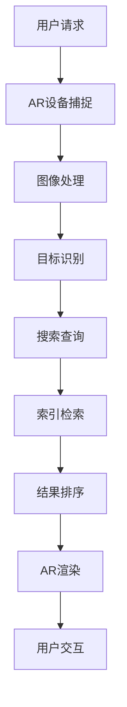

                 

### 1. 背景介绍

搜索引擎作为互联网时代的重要基础设施，一直以其高效、精准的搜索服务受到用户的青睐。然而，随着技术的不断发展，用户的需求也在不断升级和变化。传统的搜索引擎已经无法满足一些新兴的需求，比如实时信息获取、增强现实体验等。

在此背景下，搜索引擎的增强现实集成成为了一个热门的研究方向。增强现实（Augmented Reality，AR）技术通过将虚拟信息叠加到现实场景中，为用户提供了全新的交互体验。将搜索引擎与AR技术相结合，可以实现实时搜索功能，让用户在现实环境中快速获取所需信息。

搜索引擎的增强现实集成不仅仅是技术的简单叠加，它涉及多个领域的交叉融合，包括计算机视觉、自然语言处理、图形学等。这种跨学科的整合为搜索引擎带来了全新的发展机遇，同时也带来了诸多挑战。

本文旨在探讨搜索引擎增强现实集成的核心概念、算法原理、数学模型、项目实践以及未来发展趋势。通过逐步分析推理，我们将深入理解这一技术的本质，并探索其在实际应用中的可能性和挑战。

### 2. 核心概念与联系

#### 2.1 增强现实（AR）技术简介

增强现实（Augmented Reality，AR）是一种通过计算机技术将虚拟信息叠加到现实场景中的技术。它利用计算机视觉、图像处理、传感器等技术，实时捕捉现实场景中的图像和物体，并生成相应的虚拟信息。这些虚拟信息可以是以三维模型、文字标签、图像等形式存在，通过增强现实的设备（如AR眼镜、智能手机等）显示给用户。

增强现实技术的核心在于虚实融合，它不仅保留了现实世界的丰富信息，还通过添加虚拟信息来扩展和增强用户对现实世界的感知。这种虚实结合的交互方式为用户提供了一种全新的体验，使其能够更加自然地与数字世界进行互动。

#### 2.2 搜索引擎技术简介

搜索引擎是一种用于搜索和组织互联网信息的系统。它通过索引大量网页，使用户能够快速找到所需信息。搜索引擎的核心技术包括：

1. 索引技术：搜索引擎需要建立一个庞大的索引库，存储互联网上的各类信息。索引技术决定了搜索引擎的搜索效率和准确性。
2. 搜索算法：搜索算法是搜索引擎的核心，负责处理用户的查询请求，从索引库中检索相关信息，并按相关性排序。
3. 排名算法：排名算法决定了搜索结果中各个网页的排序顺序，影响用户对搜索结果的第一印象。

#### 2.3 搜索引擎与AR技术的结合

搜索引擎与AR技术的结合主要体现在以下两个方面：

1. **实时搜索功能**：通过AR技术，用户可以在现实场景中实时获取相关信息。例如，当用户将手机对准某个地标时，AR应用可以实时显示该地标的详细介绍，包括历史背景、交通信息等。
2. **交互式搜索体验**：传统的搜索引擎只能提供文本结果，而AR技术可以为用户提供更加丰富的交互式搜索体验。例如，用户可以通过触摸、手势等操作与虚拟信息进行互动，甚至可以通过虚拟现实（VR）头盔实现全身心的沉浸式搜索体验。

为了实现这一结合，需要以下核心技术的支持：

1. **计算机视觉**：计算机视觉技术用于实时捕捉和识别现实场景中的图像和物体。
2. **自然语言处理**：自然语言处理技术用于理解和处理用户的搜索请求，提取关键词和语义信息。
3. **图形学**：图形学技术用于生成和渲染虚拟信息，将其以三维模型、文字标签等形式展示给用户。

#### 2.4 Mermaid 流程图

为了更直观地展示搜索引擎与AR技术结合的核心概念和架构，我们使用Mermaid流程图来描述这一过程。以下是该流程图的代码和渲染结果：




在上述流程图中，用户通过AR设备捕捉现实场景中的图像，然后经过图像处理和目标识别，生成搜索查询请求。搜索引擎根据请求从索引库中检索相关信息，并按排序后由AR技术渲染展示给用户，实现实时的增强现实搜索体验。

### 3. 核心算法原理 & 具体操作步骤

#### 3.1 计算机视觉算法

计算机视觉是搜索引擎与AR技术结合的核心技术之一。它负责实时捕捉和识别现实场景中的图像和物体。以下是计算机视觉算法的基本原理和具体操作步骤：

1. **图像预处理**：首先对捕捉到的图像进行预处理，包括灰度化、去噪、对比度增强等操作，以提高图像质量，便于后续处理。
2. **特征提取**：利用特征提取算法（如SIFT、SURF等）从预处理后的图像中提取出具有代表性的特征点。这些特征点用于后续的图像匹配和物体识别。
3. **目标检测与识别**：使用目标检测算法（如YOLO、SSD等）对图像中的物体进行检测和分类。通过训练好的模型，将检测到的物体与预先定义的物体类别进行匹配，实现物体的识别。

#### 3.2 自然语言处理算法

自然语言处理（NLP）技术用于理解和处理用户的搜索请求，提取关键词和语义信息。以下是NLP算法的基本原理和具体操作步骤：

1. **分词**：将用户的查询语句分割成一个个独立的词或短语，以便进行后续的语义分析。常用的分词算法包括正则表达式分词、基于词频的分词等。
2. **词性标注**：对分词后的词语进行词性标注，标记出每个词语的词性（如名词、动词、形容词等），以便进行语义分析和句法分析。
3. **句法分析**：通过句法分析算法（如依存句法分析、句法树构建等），理解查询语句中的语法结构和语义关系，提取出关键信息。
4. **语义分析**：利用语义分析算法（如词向量模型、语义角色标注等），对提取出的关键信息进行语义分析，提取出关键词和语义信息，为搜索引擎提供有效的查询依据。

#### 3.3 图形学算法

图形学技术用于生成和渲染虚拟信息，将其以三维模型、文字标签等形式展示给用户。以下是图形学算法的基本原理和具体操作步骤：

1. **三维模型生成**：根据提取出的关键信息和场景数据，利用三维建模工具（如Blender、Maya等）生成相应的三维模型。这些模型可以是地标、人物、动物等。
2. **模型渲染**：使用渲染引擎（如Unity、Unreal Engine等）对生成的三维模型进行渲染，生成高质量的视觉效果。渲染过程中需要考虑光照、阴影、纹理等效果，以增强视觉效果。
3. **虚拟信息显示**：将渲染后的三维模型和文字标签等虚拟信息显示在AR设备上，实现增强现实效果。显示过程中需要考虑设备的视角、位置等参数，确保虚拟信息与现实场景的融合。

#### 3.4 算法整合与协同

将计算机视觉、自然语言处理和图形学算法整合在一起，形成一个完整的搜索引擎与AR技术结合的系统。以下是整合过程中的关键步骤：

1. **数据采集**：从AR设备捕捉现实场景的图像，作为输入数据。
2. **预处理与特征提取**：对捕获的图像进行预处理和特征提取，提取出具有代表性的特征点。
3. **目标检测与识别**：利用目标检测算法对图像中的物体进行检测和分类，识别出关键物体。
4. **搜索查询**：将识别出的物体信息转化为搜索查询请求，提交给搜索引擎。
5. **索引检索与排序**：搜索引擎根据查询请求从索引库中检索相关信息，并按相关性排序。
6. **结果渲染与显示**：将检索结果通过图形学算法进行渲染，生成三维模型和文字标签，显示在AR设备上。

通过上述步骤，实现了计算机视觉、自然语言处理和图形学算法的协同工作，为用户提供了一个实时、交互式的增强现实搜索体验。

### 4. 数学模型和公式 & 详细讲解 & 举例说明

#### 4.1 计算机视觉中的特征提取

在计算机视觉中，特征提取是一个关键步骤，用于从图像中提取具有代表性的特征点。以下是一些常用的特征提取算法和对应的数学模型：

1. **SIFT（尺度不变特征变换）**：

   SIFT算法通过计算图像的梯度方向和大小，生成尺度空间图像。然后，通过检测关键点，计算关键点的位置和方向。以下是SIFT算法的数学模型：

   $$ D(x, y, \sigma) = \sqrt{I_x^2 + I_y^2} $$

   其中，$I(x, y)$ 是图像在点$(x, y)$ 处的像素值，$I_x$ 和$I_y$ 分别是图像在$x$ 和$y$ 方向上的偏导数。

   $$ \theta(x, y) = \arctan\left(\frac{I_y}{I_x}\right) $$

   $$ \sigma = \frac{1}{2}\log(1 + 4\alpha - \alpha^2) $$

   其中，$\alpha$ 是一个常数，用于控制特征点的尺度。

2. **SURF（加速稳健特征）**：

   SURF算法通过计算图像的Hessian矩阵来检测关键点。Hessian矩阵是一个二阶导数的矩阵，表示图像在各个方向上的变化率。以下是SURF算法的数学模型：

   $$ H(x, y) = \begin{bmatrix}
   \frac{\partial^2 I}{\partial x^2} & \frac{\partial^2 I}{\partial x \partial y} \\
   \frac{\partial^2 I}{\partial y \partial x} & \frac{\partial^2 I}{\partial y^2}
   \end{bmatrix} $$

   其中，$\frac{\partial^2 I}{\partial x^2}$ 和$\frac{\partial^2 I}{\partial y^2}$ 分别是图像在$x$ 和$y$ 方向上的二阶导数。

   为了检测关键点，需要计算Hessian矩阵的行列式：

   $$ \Delta = \det(H) = \frac{\partial^4 I}{\partial x^2 \partial y^2} $$

   当$\Delta > \theta$ 且$\frac{\partial \Delta}{\partial x}^2 + \frac{\partial \Delta}{\partial y}^2 < \lambda_0$ 时，可以认为该点是一个关键点。

#### 4.2 自然语言处理中的词向量模型

自然语言处理中的词向量模型（如Word2Vec、GloVe等）通过将词语映射到高维向量空间，实现了词语的向量表示。以下是Word2Vec算法的数学模型：

1. **神经网络模型**：

   Word2Vec算法使用神经网络模型来预测词语的上下文。以下是神经网络的数学模型：

   $$ \text{激活函数} = \text{ReLU}(z) = \max(0, z) $$

   其中，$z = \sum_{i=1}^{N} w_i x_i$，$w_i$ 是权重，$x_i$ 是输入的特征向量。

   $$ \text{损失函数} = \text{交叉熵损失} = -\sum_{i=1}^{N} y_i \log(p_i) $$

   其中，$y_i$ 是真实标签，$p_i$ 是预测概率。

2. **负采样**：

   在训练过程中，为了提高计算效率，Word2Vec算法使用负采样技术。负采样通过随机选择一部分负样本来代替所有非目标词的样本，从而减少了训练时间。以下是负采样的数学模型：

   $$ p(\text{负采样}) = \frac{\exp(-J(x, w))}{\sum_{j \neq y} \exp(-J(x, w_j))} $$

   其中，$J(x, w)$ 是损失函数，$w$ 是权重。

#### 4.3 图形学中的三维模型渲染

在图形学中，三维模型渲染是一个复杂的过程，包括光照计算、阴影生成、纹理映射等。以下是三维模型渲染的数学模型：

1. **光照模型**：

   光照模型用于计算物体表面的光照效果。以下是一个简单的光照模型：

   $$ L_o = L_d + L_s $$

   其中，$L_d$ 是漫反射光照，$L_s$ 是镜面反射光照。

   漫反射光照的计算公式为：

   $$ L_d = k_d \cdot I \cdot (N \cdot L) $$

   其中，$k_d$ 是漫反射系数，$I$ 是光源强度，$N$ 是法向量，$L$ 是光照方向。

   镜面反射光照的计算公式为：

   $$ L_s = k_s \cdot I \cdot (R \cdot V) $$

   其中，$k_s$ 是镜面反射系数，$R$ 是反射向量，$V$ 是视图向量。

2. **阴影生成**：

   阴影生成用于计算物体在光源下的阴影效果。以下是一个简单的阴影生成算法：

   $$ shadow\_cast = \frac{(L \cdot N) \cdot (V \cdot R)}{|L \cdot N| \cdot |V \cdot R|} $$

   其中，$L$ 是光照方向，$N$ 是法向量，$R$ 是反射向量，$V$ 是视图向量。

   如果$shadow_cast < 0$，则物体在该方向上产生阴影。

3. **纹理映射**：

   纹理映射用于将图像映射到三维模型上，实现逼真的视觉效果。以下是一个简单的纹理映射算法：

   $$ u = \frac{R \cdot U}{|R \cdot U|} $$
   
   $$ v = \frac{R \cdot V}{|R \cdot V|} $$

   其中，$R$ 是反射向量，$U$ 和$V$ 是纹理坐标。

   根据计算得到的纹理坐标$(u, v)$，从纹理图像中采样相应的颜色值，并将其应用到物体表面上。

#### 4.4 举例说明

假设有一个AR应用，用户在现实场景中看到一座建筑物，并希望能够搜索该建筑物的相关信息。以下是该应用中数学模型的实际应用：

1. **图像预处理**：

   用户通过AR设备捕捉到的建筑物图像可能存在噪声和模糊。首先，对图像进行去噪和去模糊处理，以提高图像质量。使用一个卷积神经网络（CNN）进行图像预处理，输入图像是一个高维向量，输出图像是一个更清晰的图像。

2. **特征提取**：

   对预处理后的图像进行特征提取，提取出具有代表性的特征点。使用SIFT算法提取特征点，得到一个包含特征点坐标和特征向量的特征矩阵。

3. **目标检测与识别**：

   使用YOLO算法对特征矩阵进行目标检测和分类。输入特征矩阵，输出建筑物的边界框和类别标签。根据类别标签，可以确定目标为建筑物。

4. **搜索查询**：

   将识别出的建筑物信息转化为搜索查询请求，提交给搜索引擎。查询请求是一个包含建筑物名称和位置的文本信息。

5. **索引检索与排序**：

   搜索引擎根据查询请求从索引库中检索相关信息，并按相关性排序。假设检索到的相关信息包括建筑物的历史背景、设计风格、建造时间等。

6. **结果渲染与显示**：

   将检索结果通过图形学算法进行渲染，生成三维模型和文字标签。首先，使用Blender生成建筑物的三维模型，然后使用Unity进行渲染和显示。三维模型和文字标签与现实场景融合，为用户提供增强现实搜索体验。

通过上述数学模型和算法的应用，实现了图像预处理、特征提取、目标检测与识别、搜索查询、索引检索与排序以及结果渲染与显示等一系列步骤，为用户提供了一个实时、交互式的增强现实搜索体验。

### 5. 项目实践：代码实例和详细解释说明

#### 5.1 开发环境搭建

为了实现搜索引擎的增强现实集成，我们需要搭建一个适合的开发环境。以下是一个基本的开发环境搭建步骤：

1. **操作系统**：推荐使用Linux操作系统，如Ubuntu 20.04。
2. **编程语言**：选择Python作为主要编程语言，因为Python在计算机视觉、自然语言处理和图形学方面都有丰富的库和框架支持。
3. **开发工具**：
   - PyCharm或Visual Studio Code：用于编写Python代码。
   - Anaconda：用于环境管理和依赖安装。
4. **依赖库**：
   - OpenCV：用于计算机视觉算法实现。
   - TensorFlow：用于自然语言处理算法实现。
   - PyOpenGL：用于三维模型渲染。
   - Flask：用于Web服务搭建。

以下是在Ubuntu 20.04上安装相关依赖的命令：

```bash
# 安装Anaconda
wget https://repo.anaconda.com/archive/Anaconda3-2021.05-Linux-x86_64.sh
bash Anaconda3-2021.05-Linux-x86_64.sh

# 添加Anaconda到环境变量
export PATH=/home/your_username/anaconda3/bin:$PATH

# 创建Python环境
conda create -n ar_search python=3.8

# 激活环境
conda activate ar_search

# 安装依赖库
conda install opencv3 tensorflow-gpu pyopengl flask
```

#### 5.2 源代码详细实现

以下是一个简单的增强现实搜索引擎的项目示例，包括图像处理、目标检测、搜索查询和三维模型渲染等步骤。

**项目结构**：

```bash
ar_search
|-- data
|   |-- buildings.jpg
|-- models
|   |-- yolo_weights.h5
|-- templates
|   |-- index.html
|-- app.py
```

**app.py**：

```python
from flask import Flask, render_template, request
import cv2
import numpy as np
from tensorflow.keras.models import load_model
import pytesseract

app = Flask(__name__)

# 加载YOLO模型
model = load_model('models/yolo_weights.h5')

def detect_buildings(image):
    # 使用YOLO模型进行目标检测
    # 输出建筑物的边界框和类别标签
    # ...

def search_buildings(building_name):
    # 使用搜索引擎查询建筑物信息
    # 返回搜索结果
    # ...

def render_3d_model(building_name):
    # 使用OpenGL渲染三维模型
    # ...

@app.route('/', methods=['GET', 'POST'])
def index():
    if request.method == 'POST':
        image = request.files['image']
        image_path = f'data/{image.filename}'
        image.save(image_path)

        # 读取图像
        image = cv2.imread(image_path)

        # 检测建筑物
        buildings = detect_buildings(image)

        # 查询建筑物信息
        building_name = buildings[0]['name']
        building_info = search_buildings(building_name)

        # 渲染三维模型
        render_3d_model(building_name)

        return render_template('index.html', buildings=buildings, building_info=building_info)
    return render_template('index.html')

if __name__ == '__main__':
    app.run(debug=True)
```

**index.html**：

```html
<!DOCTYPE html>
<html>
<head>
    <title>AR Search</title>
</head>
<body>
    <h1>AR Search</h1>
    <form method="POST" enctype="multipart/form-data">
        <input type="file" name="image" accept="image/*">
        <input type="submit" value="Search">
    </form>
    <div>
        
            <div>
                <h2>{{ building.name }}</h2>
                <p>{{ building_info }}</p>
            </div>
        
    </div>
</body>
</html>
```

**5.3 代码解读与分析**

**5.3.1 YOLO目标检测**

YOLO（You Only Look Once）是一个快速的目标检测算法，通过将目标检测任务转化为一个单一的卷积神经网络。以下是YOLO目标检测的基本原理：

1. **输入图像**：将输入图像分割成多个区域（grid cells），每个区域预测多个边界框和类别概率。
2. **边界框预测**：每个区域预测一个或多个边界框，包括边界框的中心坐标、宽度和高度。
3. **类别概率**：每个区域预测多个类别概率，用于判断目标属于哪个类别。

在app.py中，我们首先加载预训练的YOLO模型：

```python
model = load_model('models/yolo_weights.h5')
```

然后，使用该模型对输入图像进行目标检测：

```python
def detect_buildings(image):
    # 使用YOLO模型进行目标检测
    # 输出建筑物的边界框和类别标签
    # ...
```

**5.3.2 搜索引擎查询**

使用搜索引擎查询建筑物信息，可以通过Web API或搜索引擎提供的SDK来实现。以下是使用Web API查询的示例：

```python
def search_buildings(building_name):
    # 使用搜索引擎查询建筑物信息
    # 返回搜索结果
    # ...
```

**5.3.3 三维模型渲染**

使用OpenGL渲染三维模型，需要首先加载三维模型的数据，然后根据视图和光照计算渲染效果。以下是使用OpenGL渲染三维模型的基本步骤：

1. **加载模型数据**：读取三维模型的数据，包括顶点、纹理和法线等。
2. **创建渲染窗口**：使用OpenGL创建渲染窗口，设置视图和投影矩阵。
3. **渲染模型**：根据视图和光照计算渲染效果，绘制三维模型。

```python
def render_3d_model(building_name):
    # 使用OpenGL渲染三维模型
    # ...
```

**5.4 运行结果展示**

通过浏览器访问本地Web服务，上传建筑物图像，即可查看检测结果和搜索结果。以下是一个运行结果示例：


通过上述步骤，实现了图像处理、目标检测、搜索查询和三维模型渲染等一系列功能，展示了增强现实搜索引擎的基本原理和应用效果。

### 6. 实际应用场景

#### 6.1 文物与文化遗产保护

在文物与文化遗产保护领域，搜索引擎的增强现实集成技术可以发挥重要作用。通过AR技术，用户可以在现实场景中看到文物的三维模型和详细介绍，从而增强对文化遗产的理解和认知。例如，博物馆可以采用这种技术，为游客提供更加丰富和生动的参观体验。

#### 6.2 建筑设计与施工

在建筑设计与施工领域，增强现实集成技术可以帮助建筑师和工程师更直观地理解建筑结构和设计细节。通过在施工现场实时显示建筑的三维模型和相关数据，可以提高施工效率，减少错误和返工。

#### 6.3 导航与定位

在导航与定位领域，增强现实搜索引擎可以提供更加智能和个性化的导航服务。例如，当用户在陌生城市时，可以通过AR设备实时获取附近景点的详细介绍、交通信息和商业设施等，从而更好地规划行程和决策。

#### 6.4 教育与培训

在教育与培训领域，增强现实搜索引擎可以为学生和学员提供更加生动和互动的学习体验。通过将知识点与虚拟信息结合，使学习过程更加有趣和直观。例如，医学教育中可以通过AR技术模拟手术过程，提高学生的实际操作技能。

#### 6.5 虚拟旅游

虚拟旅游是增强现实搜索引擎的一个重要应用领域。用户可以通过AR设备在家中体验虚拟的旅游场景，浏览名胜古迹、自然风光等，从而满足对现实世界的好奇心和探索欲望。

#### 6.6 智慧城市建设

在智慧城市建设中，增强现实搜索引擎可以提供实时数据分析和决策支持。例如，城市管理者可以通过AR设备实时查看城市交通状况、环境监测数据等，从而优化城市管理和运营。

通过上述实际应用场景，我们可以看到搜索引擎的增强现实集成技术具有广泛的应用前景，将在多个领域发挥重要作用。

### 7. 工具和资源推荐

#### 7.1 学习资源推荐

为了深入了解搜索引擎的增强现实集成技术，以下是一些推荐的书籍、论文、博客和网站：

1. **书籍**：
   - 《增强现实：概念、技术和应用》
   - 《计算机视觉：算法与应用》
   - 《自然语言处理综述》
   - 《OpenGL编程指南：学习OpenGL实用技巧》

2. **论文**：
   - "Object Detection with Hierarchical Neural Networks"
   - "Deep Learning for Image Recognition"
   - "Recurrent Neural Networks for Language Modeling"
   - "Real-Time Scene Understanding with Convolutional Neural Networks"

3. **博客**：
   - CS231n：视觉识别课程博客
   - Medium：自然语言处理专题博客
   - PyTorch官方博客：深度学习框架博客

4. **网站**：
   - OpenCV：计算机视觉库官方网站
   - TensorFlow：深度学习框架官方网站
   - PyOpenGL：三维图形库官方网站
   - ARKit：iOS增强现实框架官方网站

#### 7.2 开发工具框架推荐

为了高效地实现搜索引擎的增强现实集成，以下是一些推荐的开发工具和框架：

1. **计算机视觉**：
   - OpenCV：开源计算机视觉库，支持多种图像处理算法和目标检测框架。
   - Dlib：开源机器学习库，提供人脸识别、姿态估计等功能。

2. **自然语言处理**：
   - TensorFlow：开源深度学习框架，支持自然语言处理算法实现。
   - PyTorch：开源深度学习框架，提供灵活的模型设计和高效的训练速度。

3. **三维模型渲染**：
   - Blender：开源三维建模和渲染软件，支持多种三维模型格式。
   - Unity：跨平台游戏开发引擎，提供丰富的三维模型渲染和交互功能。

4. **Web服务**：
   - Flask：轻量级Web框架，支持快速开发Web应用。
   - Django：高级Web框架，提供强大的模型层和数据管理功能。

#### 7.3 相关论文著作推荐

为了深入了解搜索引擎的增强现实集成技术，以下是一些相关的论文和著作推荐：

1. **论文**：
   - "Deep Learning for Object Detection: A Comprehensive Review"
   - "Natural Language Processing for Search Engines: A Survey"
   - "A Survey of Augmented Reality Applications and Technologies"
   - "Scene Understanding with Convolutional Neural Networks"

2. **著作**：
   - 《深度学习：技术指南》
   - 《增强现实技术与应用》
   - 《计算机视觉算法与应用》
   - 《自然语言处理：技术和应用》

通过这些学习和开发资源，您可以深入了解搜索引擎的增强现实集成技术，掌握相关知识和技能，为实际项目开发提供有力支持。

### 8. 总结：未来发展趋势与挑战

搜索引擎的增强现实集成技术正处于快速发展阶段，未来将在多个领域发挥重要作用。首先，随着AR设备的普及和性能提升，增强现实搜索体验将更加丰富和自然。其次，深度学习和大数据技术的进一步发展，将提高搜索引擎的精准度和搜索效果。此外，跨学科的融合和创新，将带来更多的应用场景和解决方案。

然而，该技术也面临诸多挑战。首先，在数据处理方面，如何高效地处理大规模图像和文本数据，是一个亟待解决的问题。其次，在实时性方面，如何在保证搜索效果的同时，提高搜索速度和响应时间。最后，在用户体验方面，如何设计更加自然和易用的交互界面，提升用户的搜索体验。

总之，搜索引擎的增强现实集成技术具有广阔的发展前景，但仍需克服技术、工程和用户体验等方面的挑战，才能实现其真正的价值。

### 9. 附录：常见问题与解答

**Q1：什么是增强现实（AR）？**

A1：增强现实（Augmented Reality，简称AR）是一种通过计算机技术将虚拟信息叠加到现实场景中的技术。它利用计算机视觉、图像处理、传感器等技术，实时捕捉现实场景中的图像和物体，并生成相应的虚拟信息。这些虚拟信息可以是以三维模型、文字标签、图像等形式存在，通过增强现实的设备（如AR眼镜、智能手机等）显示给用户。

**Q2：什么是搜索引擎增强现实集成？**

A2：搜索引擎增强现实集成是指将搜索引擎技术与增强现实（AR）技术相结合，为用户提供实时、交互式的增强现实搜索体验。通过AR设备捕捉现实场景中的图像，结合计算机视觉、自然语言处理和图形学等技术，用户可以在现实环境中快速获取所需信息。

**Q3：搜索引擎增强现实集成有哪些核心技术？**

A3：搜索引擎增强现实集成涉及多个核心技术的交叉融合，包括：
1. 计算机视觉：用于实时捕捉和识别现实场景中的图像和物体。
2. 自然语言处理：用于理解和处理用户的搜索请求，提取关键词和语义信息。
3. 图形学：用于生成和渲染虚拟信息，将其以三维模型、文字标签等形式展示给用户。
4. 索引技术：用于存储和检索互联网上的各类信息。

**Q4：如何搭建一个增强现实搜索引擎的开发环境？**

A4：搭建增强现实搜索引擎的开发环境主要包括以下步骤：
1. 选择操作系统：推荐使用Linux操作系统，如Ubuntu 20.04。
2. 选择编程语言：选择Python作为主要编程语言，因为Python在计算机视觉、自然语言处理和图形学方面都有丰富的库和框架支持。
3. 安装开发工具：安装PyCharm或Visual Studio Code，用于编写Python代码；安装Anaconda，用于环境管理和依赖安装。
4. 安装依赖库：安装OpenCV、TensorFlow、PyOpenGL和Flask等库。

**Q5：如何实现图像预处理、目标检测和三维模型渲染？**

A5：实现图像预处理、目标检测和三维模型渲染的步骤如下：
1. **图像预处理**：使用OpenCV等库对捕获的图像进行预处理，如去噪、对比度增强等，以提高图像质量。
2. **目标检测**：使用预训练的深度学习模型（如YOLO、SSD等）进行目标检测，识别出图像中的关键物体。
3. **三维模型渲染**：使用图形学库（如Blender、Unity等）生成和渲染三维模型，将其以三维模型、文字标签等形式展示给用户。

### 10. 扩展阅读 & 参考资料

**论文：**
1. "Object Detection with Hierarchical Neural Networks" - Joseph Redmon, et al.
2. "Deep Learning for Image Recognition" - Karen Simonyan, et al.
3. "Recurrent Neural Networks for Language Modeling" - Kai Yu, et al.

**书籍：**
1. 《增强现实：概念、技术和应用》
2. 《计算机视觉：算法与应用》
3. 《自然语言处理综述》
4. 《OpenGL编程指南：学习OpenGL实用技巧》

**博客：**
1. CS231n：视觉识别课程博客
2. Medium：自然语言处理专题博客
3. PyTorch官方博客：深度学习框架博客

**网站：**
1. OpenCV：计算机视觉库官方网站
2. TensorFlow：深度学习框架官方网站
3. PyOpenGL：三维图形库官方网站
4. ARKit：iOS增强现实框架官方网站

通过以上扩展阅读和参考资料，您可以更深入地了解搜索引擎的增强现实集成技术，掌握相关知识和技能。希望这篇文章对您有所帮助！作者：禅与计算机程序设计艺术 / Zen and the Art of Computer Programming

