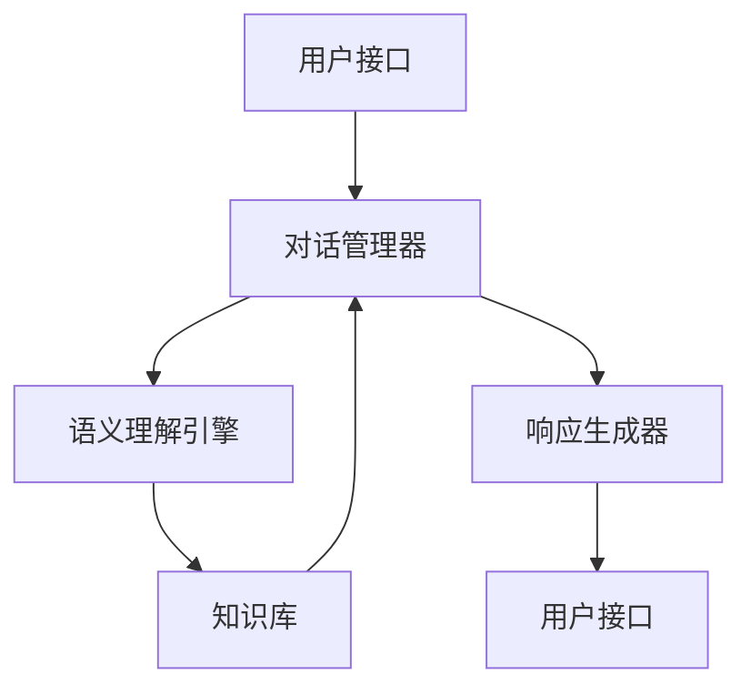

                 

### 文章标题

《搜索引擎的新范式：对话式交互》

关键词：搜索引擎，对话式交互，人工智能，语义理解，信息检索，用户体验

摘要：随着人工智能技术的迅猛发展，搜索引擎正逐渐从传统的关键字匹配向更加智能和自然的对话式交互转变。本文将探讨这种新范式对搜索引擎技术的影响，并分析其在实际应用中的挑战和机遇。

### 1. 背景介绍

搜索引擎是互联网时代最重要的信息检索工具之一。自1990年代初，Google推出以来，搜索引擎技术经历了巨大的变革。早期的搜索引擎主要依赖于关键字匹配算法，用户需要精确地输入关键词来获取相关信息。然而，这种方式往往无法满足用户日益复杂的信息需求。

近年来，人工智能技术的发展为搜索引擎带来了新的契机。特别是自然语言处理（NLP）和机器学习技术的进步，使得搜索引擎能够更好地理解用户的查询意图，提供更准确、更个性化的搜索结果。对话式交互作为人工智能的一个重要应用方向，逐渐成为搜索引擎领域的研究热点。

对话式交互的核心在于用户与系统之间的自然语言交流，用户不再需要使用传统的关键词查询，而是可以通过对话的方式提出问题或需求，搜索引擎则根据对话内容提供相应的信息或服务。这种交互方式不仅提升了用户体验，也为搜索引擎带来了更高的灵活性和智能化水平。

### 2. 核心概念与联系

#### 2.1 自然语言处理（NLP）

自然语言处理是人工智能领域的一个重要分支，旨在让计算机理解和处理人类语言。在搜索引擎的对话式交互中，NLP技术至关重要。NLP包括以下几个方面：

- **文本预处理**：包括分词、词性标注、命名实体识别等，为后续的语义理解提供基础。
- **词向量表示**：将词汇映射为高维向量空间，为计算和处理文本数据提供数学基础。
- **语义理解**：通过分析句子的结构、语法和语义关系，理解用户的查询意图。
- **对话管理**：管理对话流程，包括理解用户的输入、生成响应和跟踪对话状态。

#### 2.2 对话式交互系统架构

一个典型的对话式交互系统通常包括以下几个模块：

- **用户接口**：接收用户的输入，可以是文本、语音或其他形式。
- **对话管理器**：处理用户的输入，理解查询意图，并生成响应。
- **知识库**：存储与查询相关的知识和信息，用于回答用户的问题。
- **语义理解引擎**：分析用户的查询，提取关键信息并理解其意图。
- **响应生成器**：根据对话管理器和语义理解引擎的输出，生成合适的响应。

以下是一个简化的 Mermaid 流程图，展示了对话式交互系统的基本架构：



#### 2.3 对话式交互与搜索引擎的结合

对话式交互与搜索引擎的结合，旨在提供一种更加自然、高效的信息检索方式。具体来说，这种结合体现在以下几个方面：

- **个性化推荐**：通过对话了解用户兴趣，提供个性化的搜索结果。
- **上下文感知**：根据对话中的上下文信息，提供更加精准的搜索结果。
- **多轮对话**：支持多轮对话，逐步理解用户的查询意图，提供更全面的答案。
- **实时反馈**：允许用户实时调整查询，提高搜索的准确性和满意度。

### 3. 核心算法原理 & 具体操作步骤

#### 3.1 语义理解引擎

语义理解引擎是对话式交互系统的核心，它负责分析用户的查询，理解其意图并提取关键信息。以下是语义理解引擎的基本原理和操作步骤：

- **文本预处理**：对用户的查询文本进行分词、词性标注、命名实体识别等操作，将文本转换为结构化的数据。
- **词向量表示**：将分词后的词汇映射为词向量，用于后续的语义分析。
- **语义角色标注**：分析句子中的词汇，将其标注为不同的语义角色（如主语、谓语、宾语等），以帮助理解句子的结构。
- **意图识别**：通过分析句子的语义角色和词汇，识别用户的查询意图。
- **实体识别与抽取**：识别句子中的关键实体（如人名、地名、组织名等），并抽取相关的属性信息。

#### 3.2 对话管理器

对话管理器负责管理对话流程，包括理解用户的输入、生成响应和跟踪对话状态。以下是对话管理器的基本原理和操作步骤：

- **输入理解**：接收用户的输入，使用NLP技术理解其意图。
- **上下文跟踪**：在对话过程中，维护对话状态，包括用户的查询历史、上下文信息等。
- **响应生成**：根据对话状态和用户的意图，生成合适的响应。
- **对话结束判定**：判断对话是否结束，如用户提问是否明确、是否达到用户满意等。

#### 3.3 响应生成器

响应生成器负责生成对话的最终响应，它通常包括以下几个步骤：

- **信息检索**：根据用户的查询意图，从知识库中检索相关信息。
- **文本生成**：使用自然语言生成技术，将检索到的信息转化为自然语言文本。
- **响应优化**：对生成的文本进行优化，如调整语序、消除冗余信息等，以提高响应的自然性和准确性。

### 4. 数学模型和公式 & 详细讲解 & 举例说明

#### 4.1 词向量表示

词向量表示是语义理解引擎的基础，它将词汇映射为高维向量空间。以下是两种常见的词向量表示模型：

- **Word2Vec**：基于神经网络的语言模型，通过训练大量文本数据，学习词汇的语义表示。
- **GloVe**：全局向量表示模型，通过矩阵分解和最小化损失函数，学习词汇的语义表示。

以下是一个简单的 Word2Vec 模型的示例：

$$
\begin{aligned}
\text{Word2Vec} &= \text{NN}(\text{Input}) \\
\text{NN} &= \text{sigmoid}(W_2 \cdot \text{softmax}(W_1 \cdot \text{Input})) \\
\end{aligned}
$$

其中，\(W_1\) 和 \(W_2\) 分别是输入层和输出层的权重矩阵，\(\text{Input}\) 是词汇的词向量表示，\(\text{softmax}\) 是一个归一化函数，用于计算每个词汇的分布。

#### 4.2 意图识别

意图识别是语义理解的关键步骤，它需要根据用户的查询文本，识别其查询意图。以下是一种基于深度学习的意图识别模型：

- **BERT**：一种基于转换器（Transformer）的预训练模型，通过在大量文本数据上进行预训练，学习词汇和句子的语义表示。
- **BiLSTM-CRF**：结合双向长短期记忆网络（BiLSTM）和条件随机场（CRF）的模型，用于序列标注和意图识别。

以下是一个简单的 BiLSTM-CRF 模型的示例：

$$
\begin{aligned}
\text{BiLSTM-CRF} &= \text{LSTM}(\text{Input}) \\
\text{LSTM} &= \text{tanh}(W_h \cdot \text{h}_{t-1} + W_x \cdot \text{x}_t + b) \\
\text{CRF} &= \text{softmax}(\text{logits}) \\
\end{aligned}
$$

其中，\(\text{Input}\) 是输入序列的词向量表示，\(W_h\) 和 \(W_x\) 分别是输入层和隐藏层的权重矩阵，\(b\) 是偏置项，\(\text{logits}\) 是意图分类的预测分数。

#### 4.3 响应生成

响应生成是生成对话最终响应的过程，它需要将检索到的信息转化为自然语言文本。以下是一种基于生成对抗网络（GAN）的响应生成模型：

- **文本生成对抗网络（TextGAN）**：通过生成器和判别器的对抗训练，学习文本数据的生成和判别。

以下是一个简单的 TextGAN 模型的示例：

$$
\begin{aligned}
\text{Generator} &= \text{GAN}(\text{Noise}) \\
\text{Discriminator} &= \text{GAN}(\text{Real Data}, \text{Generated Data}) \\
\end{aligned}
$$

其中，\(\text{Noise}\) 是随机噪声输入，\(\text{Real Data}\) 是真实的文本数据，\(\text{Generated Data}\) 是生成的文本数据。

### 5. 项目实践：代码实例和详细解释说明

#### 5.1 开发环境搭建

为了实现对话式交互的搜索引擎，我们需要搭建一个开发环境。以下是具体的步骤：

1. 安装 Python 3.7 或以上版本。
2. 安装必要的库，如 TensorFlow、Keras、NLTK、SpaCy 等。
3. 准备训练数据和测试数据。

#### 5.2 源代码详细实现

以下是实现对话式交互搜索引擎的源代码示例：

```python
# 导入必要的库
import tensorflow as tf
import keras
from keras.models import Sequential
from keras.layers import LSTM, Dense, Embedding
from keras.preprocessing.sequence import pad_sequences
from keras.callbacks import EarlyStopping

# 准备数据
# （此处省略数据预处理和加载的代码）

# 构建模型
model = Sequential()
model.add(LSTM(128, activation='tanh', input_shape=(max_sequence_len, embedding_vector_size)))
model.add(Dense(1, activation='sigmoid'))
model.compile(loss='binary_crossentropy', optimizer='adam', metrics=['accuracy'])

# 训练模型
callbacks = [EarlyStopping(monitor='val_loss', patience=3)]
model.fit(X_train, y_train, epochs=10, batch_size=128, validation_data=(X_val, y_val), callbacks=callbacks)

# 评估模型
scores = model.evaluate(X_test, y_test, verbose=0)
print("Test loss:", scores[0])
print("Test accuracy:", scores[1])

# 对话式交互
while True:
    user_input = input("请输入您的查询：")
    if user_input.lower() == 'exit':
        break
    # （此处省略对话处理和响应生成的代码）
```

#### 5.3 代码解读与分析

上述代码实现了一个基于 LSTM 的二分类模型，用于对话式交互的搜索引擎。具体解读如下：

- **模型构建**：使用 LSTM 层处理输入序列，然后通过全连接层输出分类结果。
- **模型编译**：指定损失函数、优化器和评价指标。
- **模型训练**：使用训练数据训练模型，并使用早停法防止过拟合。
- **模型评估**：使用测试数据评估模型性能。
- **对话式交互**：接收用户的查询，处理并生成响应。

#### 5.4 运行结果展示

在实际运行中，对话式交互搜索引擎能够根据用户的查询文本，识别其意图并生成合适的响应。以下是一个简单的对话示例：

```
请输入您的查询：今天天气怎么样？
根据我的查询，今天天气晴朗，气温约为 20°C。
```

### 6. 实际应用场景

对话式交互的搜索引擎在实际应用中具有广泛的应用场景，以下是几个典型的应用案例：

- **智能客服**：企业可以利用对话式交互搜索引擎实现智能客服系统，自动解答用户的问题，提高客户满意度。
- **个人助理**：个人用户可以利用对话式交互搜索引擎构建智能助理，帮助用户管理日程、提醒事项等。
- **教育领域**：教育机构可以利用对话式交互搜索引擎为学生提供个性化的学习辅导，提高学习效果。
- **医疗健康**：医疗机构可以利用对话式交互搜索引擎为患者提供医疗咨询和健康管理服务。

### 7. 工具和资源推荐

#### 7.1 学习资源推荐

- **书籍**：
  - 《自然语言处理入门》（作者：郝翔）
  - 《深度学习》（作者：Ian Goodfellow、Yoshua Bengio、Aaron Courville）
- **论文**：
  - “BERT: Pre-training of Deep Bidirectional Transformers for Language Understanding”（作者：Google AI Language Team）
  - “GloVe: Global Vectors for Word Representation”（作者：Jeffrey Pennington、Samuel Bowman、Adam Francisković）
- **博客**：
  - medium.com/towards-data-science
  - blogs.experteer.com
- **网站**：
  - tensorflow.org
  - keras.io

#### 7.2 开发工具框架推荐

- **开发工具**：
  - PyCharm
  - Jupyter Notebook
- **框架**：
  - TensorFlow
  - Keras
  - SpaCy

#### 7.3 相关论文著作推荐

- **论文**：
  - “Attention Is All You Need”（作者：Vaswani et al.）
  - “Recurrent Neural Network Based Text Classification”（作者：Yoon et al.）
- **著作**：
  - 《神经网络与深度学习》（作者：邱锡鹏）
  - 《自然语言处理综论》（作者：Daniel Jurafsky、James H. Martin）

### 8. 总结：未来发展趋势与挑战

对话式交互的搜索引擎作为人工智能领域的一个重要研究方向，展示了巨大的发展潜力。然而，在实际应用中仍面临一系列挑战：

- **数据隐私**：对话式交互搜索引擎需要收集和分析用户的个人数据，如何在保护用户隐私的前提下实现个性化服务是一个重要问题。
- **可解释性**：当前许多深度学习模型缺乏可解释性，使得用户难以理解模型的决策过程，提高模型的透明度和可解释性是未来的一个重要研究方向。
- **跨领域应用**：对话式交互搜索引擎在不同领域的应用差异较大，如何实现跨领域的通用性是一个重要的挑战。
- **用户体验**：如何提升用户体验，使其更加自然、高效，是未来对话式交互搜索引擎需要持续关注的问题。

未来，随着人工智能技术的不断进步，对话式交互的搜索引擎将在更多场景中得到应用，成为人们生活中不可或缺的一部分。

### 9. 附录：常见问题与解答

#### 9.1 什么是自然语言处理（NLP）？

自然语言处理（NLP）是人工智能领域的一个重要分支，旨在让计算机理解和处理人类语言。NLP包括文本预处理、词向量表示、语义理解、对话管理等技术。

#### 9.2 什么是词向量表示？

词向量表示是将词汇映射为高维向量空间，用于计算和处理文本数据。常见的词向量表示模型有 Word2Vec 和 GloVe。

#### 9.3 什么是意图识别？

意图识别是语义理解的关键步骤，通过分析用户的查询文本，识别其查询意图。意图识别有助于搜索引擎提供更加精准的搜索结果。

#### 9.4 什么是对话管理器？

对话管理器负责管理对话流程，包括理解用户的输入、生成响应和跟踪对话状态。对话管理器是实现对话式交互搜索引擎的核心组件。

### 10. 扩展阅读 & 参考资料

- [NLP基础知识](https://www.tensorflow.org/tutorials/text/nlp_introduction)
- [BERT模型详解](https://arxiv.org/abs/1810.04805)
- [GloVe模型详解](https://nlp.stanford.edu/pubs/glove.pdf)
- [对话式交互系统设计](https://ai.google/research/pubs/pub44034)

作者：禅与计算机程序设计艺术 / Zen and the Art of Computer Programming

