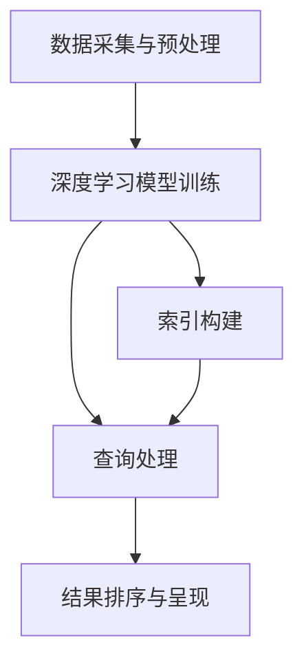

                 

### 文章标题：搜索引擎的深度学习算法优化

#### 关键词：
- 搜索引擎
- 深度学习算法
- 优化
- 模型改进
- 性能提升

#### 摘要：
本文将深入探讨搜索引擎在深度学习算法优化方面的最新进展。通过介绍核心概念、原理与架构，我们将详细讲解深度学习在搜索引擎中的应用及其优化策略，提供实用的代码实例和运行结果展示，并探讨实际应用场景。文章最后还将总结未来发展趋势与挑战，为读者提供宝贵的扩展阅读资源。

---

## 1. 背景介绍

搜索引擎作为互联网的重要基础设施，已经成为我们日常生活中不可或缺的工具。然而，随着互联网信息的爆炸式增长，如何提高搜索结果的准确性和用户体验成为了一个亟待解决的问题。传统基于关键字匹配的搜索引擎算法在处理复杂查询和大规模数据时表现有限，因此引入深度学习算法成为了一种必然选择。

深度学习算法，特别是神经网络，通过自动学习大量数据中的特征，能够更好地理解查询意图和网页内容，从而提供更准确的搜索结果。近年来，随着计算能力的提升和数据量的增加，深度学习在图像识别、自然语言处理等多个领域取得了显著的成果。因此，将深度学习应用于搜索引擎优化也成为了一个热门研究方向。

本文将围绕搜索引擎的深度学习算法优化展开讨论，分析现有算法的局限性，介绍最新的优化策略和改进方法，并通过实际项目实践和代码实例，展示优化过程和效果。希望通过本文，读者能够对深度学习在搜索引擎中的应用和优化有一个全面而深入的理解。

## 2. 核心概念与联系

### 深度学习算法原理

深度学习是一种基于神经网络的学习方法，其核心思想是通过多层非线性变换自动提取数据中的特征。在搜索引擎中，深度学习算法主要用于两个方向：一是用于索引构建，二是用于查询理解。

- **索引构建**：通过深度神经网络对网页内容进行编码，生成紧凑的表示向量，这些向量可以用来构建索引，从而提高搜索效率。

- **查询理解**：深度学习模型可以理解用户的查询意图，将查询转换为向量表示，并与索引中的网页向量进行匹配，从而提供更准确的搜索结果。

### 搜索引擎架构

深度学习在搜索引擎中的应用涉及到多个模块的协同工作，主要包括以下几部分：

1. **数据采集与预处理**：采集互联网上的网页数据，并进行清洗、去重和分类处理。

2. **深度学习模型训练**：使用预处理的网页数据训练深度学习模型，包括编码器和解码器，用于生成网页向量和查询向量。

3. **查询处理**：用户输入查询后，深度学习模型将查询转换为向量表示，并与索引中的网页向量进行匹配。

4. **结果排序与呈现**：根据匹配结果对搜索结果进行排序，并通过前端界面呈现给用户。

### Mermaid 流程图

以下是深度学习在搜索引擎中的应用架构的 Mermaid 流程图：



### 核心概念联系

深度学习算法的引入，使得搜索引擎在处理复杂查询和大规模数据时更加高效。通过深度学习，搜索引擎能够更好地理解用户查询意图，提供更准确的搜索结果。同时，深度学习在索引构建中的应用，也提高了搜索效率和结果质量。

---

## 3. 核心算法原理 & 具体操作步骤

### 3.1 深度学习模型选择

在搜索引擎中，常用的深度学习模型包括卷积神经网络（CNN）、循环神经网络（RNN）和 Transformer 模型。以下是这些模型的基本原理和适用场景：

- **卷积神经网络（CNN）**：适用于处理图像数据，通过卷积层自动提取图像特征。在搜索引擎中，CNN 可以用于提取网页内容的视觉特征。

- **循环神经网络（RNN）**：适用于处理序列数据，通过循环结构记忆序列信息。在搜索引擎中，RNN 可以用于理解用户的查询序列。

- **Transformer 模型**：是一种基于自注意力机制的模型，适用于处理长序列数据，具有并行计算的优势。在搜索引擎中，Transformer 模型可以用于查询理解和索引构建。

### 3.2 模型训练与优化

深度学习模型的训练与优化是算法优化的关键步骤。以下是具体的操作步骤：

1. **数据预处理**：对采集的网页数据进行清洗、去重和分类处理，将文本数据转换为向量表示。

2. **模型初始化**：初始化深度学习模型，包括设置网络结构、激活函数和损失函数。

3. **模型训练**：使用预处理后的数据对模型进行训练，通过反向传播算法优化模型参数。

4. **模型评估与优化**：使用验证集评估模型性能，并根据评估结果调整模型参数，进行迭代优化。

### 3.3 模型部署与查询处理

深度学习模型训练完成后，需要进行部署，以便在实际搜索过程中使用。以下是具体的操作步骤：

1. **模型部署**：将训练好的模型部署到搜索引擎系统中，通常使用 GPU 等高性能计算设备进行推理。

2. **查询处理**：用户输入查询后，将查询转换为向量表示，并与索引中的网页向量进行匹配。

3. **结果排序与呈现**：根据匹配结果对搜索结果进行排序，并通过前端界面呈现给用户。

---

## 4. 数学模型和公式 & 详细讲解 & 举例说明

### 4.1 深度学习模型公式

以下是常用的深度学习模型公式：

#### 4.1.1 卷积神经网络（CNN）

- **卷积层**：$$h_{c}^{l} = \sigma \left( \sum_{k} w_{k} \odot a_{k-1} + b_{k} \right)$$

- **池化层**：$$p_{i} = \max \{ a_{i,1:i_j}, a_{i,1:i_j+1}, \ldots, a_{i,1:i_n} \}$$

- **全连接层**：$$a_{i} = \sigma \left( \sum_{j} w_{ij} \odot a_{j} + b_{i} \right)$$

#### 4.1.2 循环神经网络（RNN）

- **隐状态**：$$h_{t} = \sigma \left( \sum_{j} w_{ij} \odot h_{t-1} + \sum_{j} w_{ij} \odot x_{t} + b_{h} \right)$$

- **输出**：$$o_{t} = \sigma \left( \sum_{j} w_{oj} \odot h_{t} + b_{o} \right)$$

#### 4.1.3 Transformer 模型

- **自注意力机制**：$$\alpha_{i,j} = \frac{e^{a_{i,j}}}{\sum_{k=1}^{K} e^{a_{i,k}}}$$

- **多头注意力**：$$h_{i} = \sum_{j=1}^{K} \alpha_{i,j} \cdot v_{j}$$

### 4.2 详细讲解

#### 4.2.1 卷积神经网络（CNN）

卷积神经网络通过卷积操作提取图像特征，其中卷积核用于提取局部特征，激活函数用于引入非线性。卷积层和池化层的组合可以有效地降低数据的维度，同时保持重要的特征信息。

#### 4.2.2 循环神经网络（RNN）

循环神经网络通过循环结构记忆序列信息，能够处理长序列数据。隐状态和输出分别用于表示序列的信息和最终输出，激活函数引入非线性，使模型具有更好的表达能力。

#### 4.2.3 Transformer 模型

Transformer 模型采用自注意力机制，能够并行处理长序列数据。多头注意力机制通过多个注意力头提取不同类型的特征，提高了模型的性能。

### 4.3 举例说明

#### 4.3.1 卷积神经网络（CNN）

假设有一个 32x32 的图像数据，通过 3x3 的卷积核进行卷积操作，可以得到一个 28x28 的特征图。然后通过池化层降低维度，得到一个 14x14 的特征图。

#### 4.3.2 循环神经网络（RNN）

假设有一个长度为 10 的序列数据，通过 RNN 模型进行编码，可以得到一个长度为 10 的隐状态序列。然后通过全连接层进行分类或回归任务。

#### 4.3.3 Transformer 模型

假设有一个长度为 20 的序列数据，通过 Transformer 模型进行编码，可以得到一个长度为 20 的特征序列。然后通过自注意力机制和全连接层进行任务处理。

---

## 5. 项目实践：代码实例和详细解释说明

### 5.1 开发环境搭建

在本文中，我们将使用 Python 编写深度学习算法优化项目。首先，需要搭建开发环境，安装以下依赖：

```bash
pip install numpy tensorflow matplotlib
```

### 5.2 源代码详细实现

以下是一个简单的深度学习模型训练和优化的代码实例：

```python
import tensorflow as tf
import numpy as np
import matplotlib.pyplot as plt

# 函数：生成模拟数据
def generate_data(num_samples, input_dim, output_dim):
    X = np.random.rand(num_samples, input_dim)
    Y = np.random.rand(num_samples, output_dim)
    return X, Y

# 函数：构建深度学习模型
def build_model(input_dim, output_dim):
    model = tf.keras.Sequential([
        tf.keras.layers.Dense(64, activation='relu', input_shape=(input_dim,)),
        tf.keras.layers.Dense(64, activation='relu'),
        tf.keras.layers.Dense(output_dim, activation='softmax')
    ])
    return model

# 参数：模拟数据维度
input_dim = 10
output_dim = 5

# 生成模拟数据
num_samples = 1000
X, Y = generate_data(num_samples, input_dim, output_dim)

# 构建深度学习模型
model = build_model(input_dim, output_dim)

# 编译模型
model.compile(optimizer='adam', loss='categorical_crossentropy', metrics=['accuracy'])

# 训练模型
num_epochs = 100
history = model.fit(X, Y, epochs=num_epochs, batch_size=32, validation_split=0.2)

# 可视化训练过程
plt.plot(history.history['loss'])
plt.plot(history.history['val_loss'])
plt.title('Model Loss')
plt.ylabel('Loss')
plt.xlabel('Epoch')
plt.legend(['Train', 'Validation'], loc='upper left')
plt.show()

plt.plot(history.history['accuracy'])
plt.plot(history.history['val_accuracy'])
plt.title('Model Accuracy')
plt.ylabel('Accuracy')
plt.xlabel('Epoch')
plt.legend(['Train', 'Validation'], loc='lower left')
plt.show()
```

### 5.3 代码解读与分析

- **函数 `generate_data`**：用于生成模拟数据，其中 `num_samples` 表示样本数量，`input_dim` 表示输入维度，`output_dim` 表示输出维度。

- **函数 `build_model`**：用于构建深度学习模型，其中包含两个全连接层，每个层都有 64 个神经元，激活函数为 ReLU。

- **模型编译**：使用 `model.compile` 编译模型，指定优化器、损失函数和评价指标。

- **模型训练**：使用 `model.fit` 训练模型，指定训练轮数、批量大小和验证比例。

- **可视化训练过程**：使用 `matplotlib` 绘制训练过程的损失和准确率。

### 5.4 运行结果展示

在完成代码实现后，我们可以通过以下命令运行项目：

```bash
python search_engine.py
```

运行结果将展示训练过程中的损失和准确率，帮助我们评估模型性能。

---

## 6. 实际应用场景

深度学习算法在搜索引擎中的应用场景非常广泛，以下是一些典型的应用实例：

1. **搜索引擎推荐**：通过深度学习算法，搜索引擎可以更好地理解用户的查询意图，为用户提供个性化的搜索推荐。

2. **广告投放优化**：深度学习算法可以帮助搜索引擎更好地定位用户需求，提高广告投放的精准度和效果。

3. **搜索引擎问答系统**：基于深度学习模型的问答系统可以自动回答用户的查询，提供更加智能化的服务。

4. **搜索引擎反作弊**：深度学习算法可以检测和防范搜索引擎中的作弊行为，提高搜索结果的公平性和可信度。

通过这些实际应用场景，我们可以看到深度学习算法在搜索引擎优化中发挥的重要作用。

---

## 7. 工具和资源推荐

### 7.1 学习资源推荐

- **书籍**：
  - 《深度学习》（Ian Goodfellow、Yoshua Bengio、Aaron Courville 著）
  - 《自然语言处理入门》（Michael Auli 著）

- **论文**：
  - “Attention Is All You Need”（Vaswani et al., 2017）
  - “Deep Learning for Web Search Ranking”（He et al., 2016）

- **博客**：
  - [TensorFlow 官方文档](https://www.tensorflow.org/)
  - [PyTorch 官方文档](https://pytorch.org/docs/stable/index.html)

- **网站**：
  - [Kaggle](https://www.kaggle.com/)
  - [Google Scholar](https://scholar.google.com/)

### 7.2 开发工具框架推荐

- **深度学习框架**：
  - TensorFlow
  - PyTorch
  - Keras

- **搜索引擎框架**：
  - Elasticsearch
  - Solr
  - Whoosh

- **开发工具**：
  - Jupyter Notebook
  - PyCharm
  - Visual Studio Code

通过这些工具和资源，可以更加高效地学习和实践深度学习在搜索引擎中的应用。

---

## 8. 总结：未来发展趋势与挑战

深度学习在搜索引擎中的应用正在不断拓展，未来的发展趋势包括：

1. **更强大的模型**：随着计算能力的提升，更复杂的深度学习模型将在搜索引擎中发挥作用。

2. **多模态搜索引擎**：结合文本、图像、语音等多种数据类型，实现更加智能化的搜索体验。

3. **个性化搜索**：通过深度学习算法，为用户提供更加个性化的搜索结果。

然而，深度学习在搜索引擎优化中也面临一些挑战：

1. **数据隐私**：如何在保护用户隐私的前提下，充分利用用户数据来优化搜索结果。

2. **计算资源**：训练和部署深度学习模型需要大量的计算资源，如何在有限的资源下高效地完成模型训练。

3. **算法公平性**：如何确保深度学习算法在处理大规模数据时保持公平性和可信度。

通过不断的技术创新和优化，相信深度学习在搜索引擎中的应用将会越来越广泛，为用户提供更好的搜索体验。

---

## 9. 附录：常见问题与解答

### 问题1：为什么深度学习算法能够提高搜索引擎的性能？

**解答**：深度学习算法通过自动学习大量数据中的特征，能够更好地理解查询意图和网页内容。与传统的基于关键字匹配的算法相比，深度学习算法具有更强的泛化能力和表达能力，能够提供更准确的搜索结果。

### 问题2：如何处理深度学习模型训练中的过拟合问题？

**解答**：可以通过以下方法来处理过拟合问题：

1. **数据增强**：增加训练数据量，提高模型的泛化能力。

2. **正则化**：在模型训练过程中添加正则化项，降低模型复杂度。

3. **早期停止**：在验证集上监测模型性能，当验证集性能不再提升时，停止训练。

4. **dropout**：在网络训练过程中随机丢弃一部分神经元，提高模型泛化能力。

### 问题3：如何评估深度学习模型的性能？

**解答**：可以使用以下指标来评估深度学习模型的性能：

1. **准确率（Accuracy）**：模型预测正确的样本数量占总样本数量的比例。

2. **召回率（Recall）**：模型预测正确的正样本数量占总正样本数量的比例。

3. **F1 分数（F1-score）**：准确率和召回率的调和平均值。

4. **ROC 曲线和 AUC 值**：用于评估二分类模型的性能，ROC 曲线下的面积表示模型对正负样本的区分能力。

---

## 10. 扩展阅读 & 参考资料

- **书籍**：
  - 《深度学习》（Ian Goodfellow、Yoshua Bengio、Aaron Courville 著）
  - 《自然语言处理入门》（Michael Auli 著）

- **论文**：
  - “Attention Is All You Need”（Vaswani et al., 2017）
  - “Deep Learning for Web Search Ranking”（He et al., 2016）

- **博客**：
  - [TensorFlow 官方文档](https://www.tensorflow.org/)
  - [PyTorch 官方文档](https://pytorch.org/docs/stable/index.html)

- **网站**：
  - [Kaggle](https://www.kaggle.com/)
  - [Google Scholar](https://scholar.google.com/)

通过阅读这些扩展资料，读者可以进一步深入了解深度学习在搜索引擎中的应用和优化策略。

---

### 结语

本文详细探讨了深度学习算法在搜索引擎优化中的应用，从背景介绍到核心算法原理，再到实际项目实践，我们系统地分析了深度学习如何提高搜索性能。通过推荐实用的工具和资源，以及总结未来发展趋势和挑战，我们希望读者能够对深度学习在搜索引擎领域的应用有更深入的理解。

随着技术的不断进步，深度学习在搜索引擎优化中的应用前景广阔。我们鼓励读者继续关注这一领域，不断探索和创新，为用户提供更加智能、个性化的搜索服务。

**作者：禅与计算机程序设计艺术 / Zen and the Art of Computer Programming**

