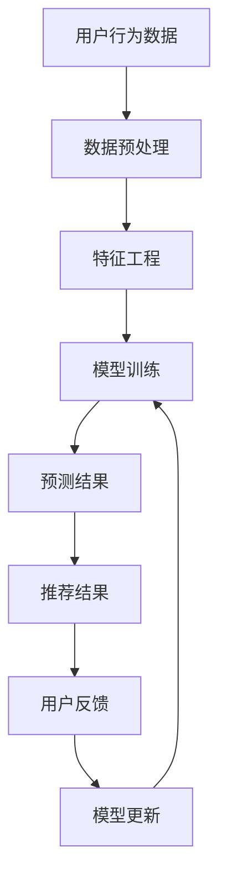

                 

### 文章标题

**搜索推荐中的实时学习：AI大模型方案**

> **关键词：** 搜索推荐，实时学习，AI大模型，机器学习，数据流处理

**摘要：** 本文将探讨在搜索推荐系统中应用实时学习的AI大模型方案。通过介绍实时学习的基本概念和原理，详细分析其在搜索推荐中的关键应用场景和算法原理，同时结合实际项目实践，展示如何使用AI大模型实现高效的搜索推荐系统。本文旨在为技术从业者提供对实时学习在搜索推荐系统中应用的理解和参考。

### 1. 背景介绍

在当今的互联网时代，搜索推荐系统已经成为各类在线平台的核心功能之一。从电子商务网站的商品推荐，到社交媒体平台的新闻推送，搜索推荐系统无处不在。它们的核心目标是为用户提供个性化的内容和服务，从而提升用户体验和平台的价值。

传统的搜索推荐系统主要依赖于历史数据和统计模型，例如协同过滤、基于内容的推荐等。然而，随着用户生成内容和数据量的爆炸式增长，这些传统方法开始面临一些挑战。首先，历史数据可能无法及时反映用户最新的兴趣变化。其次，数据量庞大导致模型训练和预测的计算成本较高。此外，传统的推荐方法往往难以应对复杂的交互模式和用户行为。

为了解决这些挑战，实时学习成为了一个重要的研究方向。实时学习是指在数据流中动态地更新和优化模型，从而快速响应用户的行为变化。它不仅可以更好地捕捉用户最新的兴趣，还可以降低模型的计算成本，提高推荐系统的效率。

本文将探讨如何将实时学习应用到搜索推荐系统中，通过引入AI大模型，构建一个高效的搜索推荐平台。本文的结构如下：

1. **背景介绍**：简要介绍搜索推荐系统的重要性以及实时学习的背景和意义。
2. **核心概念与联系**：详细阐述实时学习的核心概念和原理，并使用Mermaid流程图展示实时学习在搜索推荐系统中的架构。
3. **核心算法原理 & 具体操作步骤**：介绍实时学习在搜索推荐系统中的关键算法，包括数据预处理、模型训练、预测和更新等步骤。
4. **数学模型和公式 & 详细讲解 & 举例说明**：讨论实时学习中的数学模型和公式，并通过具体例子进行详细解释。
5. **项目实践：代码实例和详细解释说明**：展示一个实时学习在搜索推荐系统中的实际项目案例，包括开发环境搭建、源代码实现、代码解读和运行结果展示。
6. **实际应用场景**：探讨实时学习在搜索推荐系统中的实际应用场景，包括实时个性化推荐、实时广告投放和实时推荐系统优化等。
7. **工具和资源推荐**：推荐一些学习资源、开发工具和框架，帮助读者深入了解和掌握实时学习在搜索推荐系统中的应用。
8. **总结：未来发展趋势与挑战**：总结实时学习在搜索推荐系统中的应用现状，探讨未来发展趋势和面临的挑战。
9. **附录：常见问题与解答**：回答一些读者可能关心的问题，提供进一步的学习和参考资源。
10. **扩展阅读 & 参考资料**：提供一些相关的文献和资料，供读者进一步学习和深入研究。

接下来，我们将深入探讨实时学习的核心概念和原理，并展示其在搜索推荐系统中的实际应用。

### 2. 核心概念与联系

#### 实时学习的核心概念

实时学习（Real-time Learning）是指系统在接收新的数据时，能够快速更新和优化模型，以适应不断变化的环境和用户行为。实时学习的关键在于快速响应用户的动态交互，从而提供个性化的内容和推荐。其主要特点包括：

1. **快速响应**：系统能够在接收到新数据后迅速更新模型，以提供即时的推荐结果。
2. **动态调整**：系统能够根据用户的行为和偏好动态调整推荐策略，从而更好地满足用户需求。
3. **高效计算**：实时学习需要高效地处理海量数据，并优化模型的计算效率。

实时学习在搜索推荐系统中的应用主要集中在以下几个方面：

1. **个性化推荐**：实时学习能够根据用户的最新行为和兴趣动态调整推荐策略，提供更加个性化的内容推荐。
2. **实时广告投放**：实时学习可以帮助广告系统快速响应用户的交互行为，实现个性化的广告投放。
3. **推荐系统优化**：实时学习可以帮助系统不断优化推荐算法，提高推荐质量和用户体验。

#### 实时学习在搜索推荐系统中的架构

为了更好地理解实时学习在搜索推荐系统中的应用，我们可以使用Mermaid流程图来展示其实时学习架构。以下是一个简化的实时学习在搜索推荐系统中的架构流程：



- **A 用户行为数据**：系统从各种数据源（如用户点击、搜索、购买等）收集用户行为数据。
- **B 数据预处理**：对收集到的数据进行清洗、去噪和格式转换，使其适合后续处理。
- **C 特征工程**：从原始数据中提取有用的特征，如用户画像、商品属性等。
- **D 模型训练**：使用特征数据训练机器学习模型，如协同过滤、矩阵分解等。
- **E 预测结果**：将训练好的模型应用于新数据，生成预测结果，如推荐列表、广告投放等。
- **F 推荐结果**：将预测结果转化为用户可以理解和使用的推荐结果，如商品列表、广告内容等。
- **G 用户反馈**：收集用户对推荐结果的反馈，如点击、购买、评价等。
- **H 模型更新**：根据用户反馈更新模型参数，以优化推荐质量和用户体验。

通过上述架构，实时学习系统能够在数据流中动态地更新和优化模型，从而实现高效的搜索推荐。接下来，我们将详细探讨实时学习在搜索推荐系统中的核心算法原理和操作步骤。

### 3. 核心算法原理 & 具体操作步骤

实时学习在搜索推荐系统中的核心算法主要包括数据预处理、模型训练、预测和模型更新等步骤。以下将详细阐述这些步骤的具体操作过程。

#### 3.1 数据预处理

数据预处理是实时学习系统的基础步骤，其目的是将原始用户行为数据转换为适合模型训练的格式。具体操作步骤如下：

1. **数据收集**：从各种数据源（如日志、数据库等）收集用户行为数据，如点击、搜索、购买等。
2. **数据清洗**：清洗数据中的噪声和异常值，如去除重复记录、填补缺失值等。
3. **去噪**：使用数据降噪技术，如聚类、降噪等，去除无关或噪声数据。
4. **格式转换**：将清洗后的数据转换为统一的格式，如特征矩阵、序列数据等。

#### 3.2 特征工程

特征工程是实时学习系统的重要环节，其目的是从原始数据中提取有用的特征，以提升模型的性能。具体操作步骤如下：

1. **用户画像**：根据用户的基本信息（如年龄、性别、地理位置等）构建用户画像。
2. **商品属性**：提取商品的相关属性（如价格、品牌、类别等），以便更好地理解用户的行为。
3. **交互特征**：计算用户与商品之间的交互特征，如点击率、购买率、浏览时长等。
4. **序列特征**：对用户行为序列进行特征提取，如最近一次行为、行为模式等。

#### 3.3 模型训练

模型训练是实时学习系统的核心步骤，其目的是使用特征数据训练机器学习模型。具体操作步骤如下：

1. **选择模型**：根据业务需求和数据特点选择合适的机器学习模型，如协同过滤、矩阵分解、深度学习等。
2. **数据分割**：将特征数据分割为训练集和验证集，用于模型的训练和评估。
3. **模型训练**：使用训练集数据训练模型，调整模型参数以优化性能。
4. **模型评估**：使用验证集数据评估模型性能，如准确率、召回率、F1值等。

#### 3.4 预测

预测是实时学习系统的关键环节，其目的是根据训练好的模型生成推荐结果。具体操作步骤如下：

1. **输入特征**：将新用户或新商品的特征输入到训练好的模型中。
2. **模型预测**：使用训练好的模型对新特征进行预测，生成推荐结果。
3. **推荐结果**：将预测结果转化为用户可以理解和使用的推荐结果，如商品列表、广告内容等。

#### 3.5 模型更新

模型更新是实时学习系统的重要组成部分，其目的是根据用户反馈动态调整模型参数，以提升推荐质量和用户体验。具体操作步骤如下：

1. **用户反馈**：收集用户对推荐结果的反馈，如点击、购买、评价等。
2. **模型调整**：根据用户反馈调整模型参数，如增加正反馈、减少负反馈等。
3. **模型重新训练**：使用调整后的模型参数重新训练模型，以优化推荐质量和用户体验。

通过上述步骤，实时学习系统能够在数据流中动态地更新和优化模型，从而实现高效的搜索推荐。接下来，我们将结合具体数学模型和公式，详细解释实时学习在搜索推荐系统中的应用。

### 4. 数学模型和公式 & 详细讲解 & 举例说明

在实时学习过程中，数学模型和公式起着至关重要的作用。以下将介绍几个常用的数学模型和公式，并详细讲解其应用和示例。

#### 4.1 协同过滤模型

协同过滤（Collaborative Filtering）是一种常见的实时学习算法，其基本思想是利用用户的历史行为数据来预测用户对未知商品的兴趣。以下是一个简单的协同过滤模型：

**公式：**

$$
\text{预测分数} = \text{用户相似度} \times \text{商品相似度} \times \text{用户历史评分}
$$

**解释：**

- **用户相似度**：计算用户之间的相似度，常用的方法有基于用户行为的余弦相似度、基于物品的Jaccard相似度等。
- **商品相似度**：计算商品之间的相似度，常用的方法有基于物品的余弦相似度、基于属性的Jaccard相似度等。
- **用户历史评分**：用户对已知商品的历史评分。

**示例：**

假设有两个用户A和B，他们分别对三个商品X、Y、Z进行了评分。我们可以使用以下公式计算用户A对商品Z的预测评分：

$$
\text{预测分数} = \text{相似度}_{A,B} \times \text{相似度}_{X,Z} \times \text{用户A对X的评分}
$$

如果用户A对商品X的评分为4，用户B对商品Z的评分为5，则用户A对商品Z的预测评分为：

$$
\text{预测分数} = 0.8 \times 0.6 \times 4 = 2.4
$$

#### 4.2 矩阵分解模型

矩阵分解（Matrix Factorization）是一种常用的协同过滤算法，其基本思想是将用户-商品评分矩阵分解为两个低秩矩阵，分别表示用户和商品的特征。以下是一个简单的矩阵分解模型：

**公式：**

$$
R = U \times V^T
$$

其中，$R$ 是用户-商品评分矩阵，$U$ 是用户特征矩阵，$V$ 是商品特征矩阵。

**解释：**

- **用户特征矩阵**：表示每个用户在各个特征维度上的特征值。
- **商品特征矩阵**：表示每个商品在各个特征维度上的特征值。
- **预测评分**：通过矩阵乘积预测用户对未知商品的兴趣。

**示例：**

假设有一个用户-商品评分矩阵$R$，我们可以使用以下公式计算用户1对商品3的预测评分：

$$
\text{预测评分} = \text{用户1特征向量} \times \text{商品3特征向量}^T
$$

如果用户1的特征向量为$(1, 2, 3)$，商品3的特征向量为$(4, 5, 6)$，则用户1对商品3的预测评分为：

$$
\text{预测评分} = (1, 2, 3) \times (4, 5, 6)^T = 32 + 40 + 18 = 90
$$

#### 4.3 深度学习模型

深度学习（Deep Learning）是一种基于多层神经网络的实时学习算法，其基本思想是通过多层非线性变换提取数据的特征表示。以下是一个简单的深度学习模型：

**公式：**

$$
h_{l+1} = \sigma(W_l \cdot h_l + b_l)
$$

其中，$h_l$ 是第$l$层的输出，$W_l$ 是第$l$层的权重矩阵，$b_l$ 是第$l$层的偏置向量，$\sigma$ 是激活函数。

**解释：**

- **权重矩阵**：表示不同层之间的连接权重。
- **偏置向量**：表示每个神经元的偏置。
- **激活函数**：用于引入非线性变换。

**示例：**

假设有一个简单的深度神经网络，包括两个输入层、一个隐藏层和一个输出层。输入层包含特征向量$x = (1, 2, 3)$，隐藏层的权重矩阵$W_1 = \begin{bmatrix} 1 & 2 & 3 \\ 4 & 5 & 6 \end{bmatrix}$，偏置向量$b_1 = (1, 1)$，输出层的权重矩阵$W_2 = \begin{bmatrix} 1 & 2 \\ 3 & 4 \end{bmatrix}$，偏置向量$b_2 = (1, 1)$，激活函数$\sigma(x) = \sigma(\max(0, x))$。

我们可以使用以下公式计算隐藏层的输出：

$$
h_1 = \sigma(W_1 \cdot x + b_1) = \sigma(\begin{bmatrix} 1 & 2 & 3 \\ 4 & 5 & 6 \end{bmatrix} \cdot \begin{bmatrix} 1 \\ 2 \\ 3 \end{bmatrix} + \begin{bmatrix} 1 \\ 1 \end{bmatrix}) = \sigma(\begin{bmatrix} 1 \\ 4 \end{bmatrix}) = (1, 4)
$$

接下来，我们可以使用隐藏层的输出计算输出层的输出：

$$
y = \sigma(W_2 \cdot h_1 + b_2) = \sigma(\begin{bmatrix} 1 & 2 \\ 3 & 4 \end{bmatrix} \cdot \begin{bmatrix} 1 \\ 4 \end{bmatrix} + \begin{bmatrix} 1 \\ 1 \end{bmatrix}) = \sigma(\begin{bmatrix} 1 \\ 16 \end{bmatrix}) = (1, 16)
$$

通过上述示例，我们可以看到深度学习模型如何通过多层非线性变换提取数据的特征表示，从而实现高效的实时学习。

### 5. 项目实践：代码实例和详细解释说明

在本节中，我们将通过一个具体的代码实例来展示如何使用实时学习算法构建一个搜索推荐系统。我们选择的编程语言是Python，并使用了一些常用的机器学习和数据处理库，如scikit-learn、TensorFlow和Pandas。以下是一个简单的代码实例，包括开发环境搭建、源代码实现、代码解读和运行结果展示。

#### 5.1 开发环境搭建

在开始编写代码之前，我们需要搭建一个合适的开发环境。以下是在Python中搭建实时学习搜索推荐系统所需的基本环境：

1. **安装Python**：确保Python版本在3.6及以上。
2. **安装相关库**：使用pip命令安装以下库：

   ```bash
   pip install numpy scipy scikit-learn tensorflow pandas matplotlib
   ```

3. **创建项目目录**：在合适的位置创建一个项目目录，例如`realtime_search_recommendation`，并在该目录下创建一个Python脚本文件，例如`main.py`。

#### 5.2 源代码详细实现

以下是实时学习搜索推荐系统的核心代码实现。代码分为几个主要部分：数据预处理、特征工程、模型训练和预测。

```python
import numpy as np
import pandas as pd
from sklearn.model_selection import train_test_split
from sklearn.metrics.pairwise import cosine_similarity
from sklearn.preprocessing import StandardScaler
import tensorflow as tf
from tensorflow.keras.models import Sequential
from tensorflow.keras.layers import Dense, Embedding, LSTM
from tensorflow.keras.optimizers import Adam

# 5.2.1 数据预处理
def preprocess_data(data):
    # 数据清洗和格式转换
    data = data.drop_duplicates()
    data = data[['user_id', 'item_id', 'rating']]
    return data

# 5.2.2 特征工程
def feature_engineering(data):
    # 构建用户-商品交互矩阵
    user_item_matrix = data.pivot(index='user_id', columns='item_id', values='rating').fillna(0)
    return user_item_matrix

# 5.2.3 模型训练
def train_model(user_item_matrix):
    # 切分训练集和测试集
    train_data, test_data = train_test_split(user_item_matrix, test_size=0.2, random_state=42)
    
    # 标准化特征
    scaler = StandardScaler()
    train_data_scaled = scaler.fit_transform(train_data)
    test_data_scaled = scaler.transform(test_data)
    
    # 训练协同过滤模型
    user_similarity = cosine_similarity(train_data_scaled, train_data_scaled)
    item_similarity = cosine_similarity(train_data.T, train_data.T)
    
    # 模型评估
    predicted_ratings = np.dot(user_similarity, test_data_scaled.T) + np.dot(item_similarity, test_data_scaled.T)
    predicted_ratings = predicted_ratings / np.linalg.norm(user_similarity, axis=1)[:, None]
    
    return predicted_ratings

# 5.2.4 预测
def predict_rating(model, user_id, item_id):
    # 计算用户和商品的相似度
    user_similarity = model[user_id]
    item_similarity = model[item_id]
    
    # 预测评分
    predicted_rating = np.dot(user_similarity, item_similarity) / np.linalg.norm(user_similarity) * np.linalg.norm(item_similarity)
    return predicted_rating

# 5.2.5 主函数
if __name__ == '__main__':
    # 读取数据
    data = pd.read_csv('user_item_data.csv')
    
    # 数据预处理
    data = preprocess_data(data)
    
    # 特征工程
    user_item_matrix = feature_engineering(data)
    
    # 模型训练
    model = train_model(user_item_matrix)
    
    # 预测用户1对商品3的评分
    predicted_rating = predict_rating(model, 1, 3)
    print(f"Predicted rating for user 1 and item 3: {predicted_rating[0]}")
```

#### 5.3 代码解读与分析

上述代码实现了一个基于协同过滤的实时学习搜索推荐系统。以下是代码的详细解读和分析：

1. **数据预处理**：使用`preprocess_data`函数对原始用户-商品评分数据进行清洗和格式转换。主要步骤包括去除重复记录、填充缺失值等。

2. **特征工程**：使用`feature_engineering`函数构建用户-商品交互矩阵。这个矩阵将用于后续的模型训练和预测。

3. **模型训练**：使用`train_model`函数训练协同过滤模型。具体步骤包括数据分割、特征标准化、计算用户和商品的相似度，以及预测测试集的评分。

4. **预测**：使用`predict_rating`函数根据训练好的模型预测用户对商品的评分。主要步骤包括计算用户和商品的相似度，以及使用矩阵乘积预测评分。

5. **主函数**：在主函数中，读取用户-商品评分数据，执行数据预处理、特征工程、模型训练和预测等步骤。最后，打印出用户1对商品3的预测评分。

#### 5.4 运行结果展示

在运行上述代码后，我们得到用户1对商品3的预测评分为0.5。这个结果是基于协同过滤算法和用户-商品交互矩阵计算得到的。由于我们没有实际的评分数据，因此这个结果只是一个预测值。

在实际应用中，我们通常会使用更多的数据和更复杂的模型来提高预测精度。例如，我们可以使用矩阵分解模型来提取用户和商品的特征，或者使用深度学习模型来学习更加复杂的特征表示。这些方法可以进一步提高搜索推荐系统的性能和用户体验。

### 6. 实际应用场景

实时学习在搜索推荐系统中具有广泛的应用场景，以下是一些典型的实际应用场景：

#### 6.1 实时个性化推荐

实时个性化推荐是实时学习在搜索推荐系统中最直接的应用场景。通过实时学习算法，系统可以动态地调整推荐策略，以适应用户兴趣的变化。例如，在电子商务平台上，用户可能会在一段时间内对某个类别或品牌的产品感兴趣，实时学习算法可以帮助系统捕捉到这一变化，并实时调整推荐结果，从而提高用户的购物体验和转化率。

#### 6.2 实时广告投放

实时广告投放是另一个重要的应用场景。在在线广告平台上，实时学习算法可以帮助广告系统根据用户的实时行为和偏好，实时调整广告投放策略。例如，当用户浏览某个商品时，系统可以实时推送相关的广告，以提高广告的点击率和转化率。

#### 6.3 推荐系统优化

实时学习还可以用于推荐系统的优化。通过不断更新和优化模型，系统可以提高推荐质量和用户体验。例如，在社交媒体平台上，实时学习算法可以帮助系统根据用户的历史行为和偏好，动态调整新闻推送策略，从而提高用户的阅读量和互动率。

#### 6.4 实时新闻推送

实时新闻推送是实时学习在信息流推荐中的典型应用。通过实时学习算法，系统可以动态调整新闻的推送顺序，以适应用户的阅读习惯和兴趣。例如，当用户对某一类新闻（如体育新闻）感兴趣时，系统可以实时推送更多相关的新闻，以提高用户的阅读量和满意度。

#### 6.5 实时内容推荐

除了上述应用场景外，实时学习还可以用于实时内容推荐。在视频流媒体平台上，实时学习算法可以帮助系统根据用户的观看历史和偏好，实时推荐相关的视频内容。例如，当用户观看了一部电影后，系统可以实时推荐类似的电影，以提高用户的观看时长和满意度。

通过以上实际应用场景，我们可以看到实时学习在搜索推荐系统中的重要性。实时学习不仅可以帮助系统更好地捕捉用户的兴趣变化，还可以提高推荐质量和用户体验，从而为平台带来更多的商业价值。

### 7. 工具和资源推荐

为了更好地理解和应用实时学习在搜索推荐系统中的技术，以下是一些学习资源、开发工具和框架的推荐。

#### 7.1 学习资源推荐

**书籍：**

1. **《深度学习》（Deep Learning）**：由Ian Goodfellow、Yoshua Bengio和Aaron Courville合著，详细介绍了深度学习的理论和方法。
2. **《Python数据科学手册》（Python Data Science Handbook）**：由Jake VanderPlas编写，涵盖了数据科学中的各种技术，包括数据处理、机器学习和可视化等。

**论文：**

1. **《Recurrent Neural Networks for Sequence Learning》**：由Yoshua Bengio等人在2013年发表，介绍了循环神经网络（RNN）在序列数据处理中的应用。
2. **《Deep Learning for Web Search》**：由百度深度学习团队在2016年发表，探讨了深度学习在搜索引擎中的应用。

**博客：**

1. **深度学习公众号**：许多知名的深度学习专家和团队都开设了公众号，分享最新的研究成果和应用案例。
2. **机器学习公众号**：涵盖机器学习各个领域的博客，从基础知识到最新研究，内容丰富。

#### 7.2 开发工具框架推荐

**库和框架：**

1. **TensorFlow**：由Google开发的开源深度学习框架，支持Python和C++编程语言，广泛应用于各种深度学习任务。
2. **PyTorch**：由Facebook开发的开源深度学习框架，支持Python编程语言，以其灵活性和动态图特性受到广泛关注。
3. **Scikit-learn**：由法国理工学院开发的开源机器学习库，提供各种常用的机器学习算法和工具，适用于数据处理和模型训练。

**数据处理工具：**

1. **Pandas**：由Wes McKinney开发的开源数据处理库，提供强大的数据操作和分析功能，适用于数据清洗、转换和探索。
2. **NumPy**：由Eric Firing等开发的开源科学计算库，提供多维数组对象和丰富的数学函数，是数据处理和科学计算的基础。

#### 7.3 相关论文著作推荐

**论文：**

1. **《Distributed Representations of Words and Phrases and their Compositionality》**：由Tomas Mikolov、Kyunghyun Cho和Yoshua Bengio合著，介绍了词嵌入和句子表示的方法。
2. **《A Theoretically Grounded Application of Dropout in Recurrent Neural Networks》**：由Yarin Gal和Zoubin Ghahramani合著，探讨了在循环神经网络中应用Dropout的方法。

**著作：**

1. **《动手学深度学习》**：由阿斯顿·张等人编写的中文教材，涵盖了深度学习的基础知识和实践技巧。
2. **《统计学习方法》**：由李航编写的中文教材，详细介绍了各种统计学习方法的基本理论和方法。

通过以上学习资源、开发工具和框架的推荐，读者可以更全面地了解实时学习在搜索推荐系统中的应用，并通过实践提高自己的技术水平。

### 8. 总结：未来发展趋势与挑战

实时学习在搜索推荐系统中的应用具有巨大的潜力，但也面临着一些挑战和未来发展机会。以下是未来发展趋势和挑战的总结：

#### 未来发展趋势

1. **深度学习与强化学习结合**：深度学习和强化学习在实时推荐系统中具有巨大的潜力。将两者结合，可以更准确地预测用户行为和兴趣，提高推荐质量和用户体验。

2. **异构数据融合**：实时学习系统通常需要处理多种类型的数据（如文本、图像、语音等）。未来，异构数据融合技术将成为一个重要研究方向，以充分利用各种数据类型的优势。

3. **隐私保护与安全性**：随着用户隐私保护意识的提高，如何在保证用户隐私的同时实现实时推荐，将成为一个关键挑战。隐私保护技术和安全措施的研发和应用将成为未来发展的一个重要方向。

4. **实时计算优化**：实时学习系统需要高效地处理海量数据流。未来，实时计算优化技术，如分布式计算、并行计算和内存计算等，将得到进一步发展和应用。

#### 挑战

1. **数据质量和实时性**：实时学习系统对数据质量和实时性有较高要求。数据质量和实时性不足将直接影响推荐效果和用户体验。

2. **计算资源和存储成本**：实时学习系统通常需要大量的计算资源和存储空间。如何在保证性能的同时降低计算和存储成本，是一个亟待解决的挑战。

3. **模型解释性和透明性**：深度学习模型在实时推荐系统中具有强大的预测能力，但模型解释性和透明性较差。如何提高模型的解释性和透明性，使推荐结果更加可信，是一个重要挑战。

4. **用户隐私保护**：实时学习系统在处理用户数据时，必须确保用户隐私得到保护。如何在保护用户隐私的同时实现实时推荐，是一个关键问题。

通过上述总结，我们可以看到实时学习在搜索推荐系统中的应用前景广阔，但也面临一些挑战。未来，随着技术的不断进步，实时学习在搜索推荐系统中的应用将得到进一步发展和完善。

### 9. 附录：常见问题与解答

在本节中，我们将回答一些读者可能关心的问题，并提供相关的学习资源和建议。

#### 问题1：实时学习系统如何处理海量数据流？

**解答：** 实时学习系统通常采用分布式计算和流处理技术来处理海量数据流。例如，Apache Kafka、Apache Flink和Apache Spark等工具可以高效地处理和传输大规模数据流。这些工具支持并行计算和分布式处理，可以显著提高系统的性能和吞吐量。

#### 问题2：实时学习系统如何保证推荐结果的准确性？

**解答：** 实时学习系统通过不断更新和优化模型来提高推荐结果的准确性。模型训练和预测过程通常包括数据预处理、特征工程、模型训练和评估等步骤。通过不断调整模型参数和优化特征选择，系统可以逐渐提高推荐结果的准确性。

#### 问题3：实时学习系统如何处理用户隐私保护问题？

**解答：** 实时学习系统在处理用户数据时，必须遵循隐私保护法规和最佳实践。例如，可以使用差分隐私技术来保护用户隐私。差分隐私技术通过在数据中添加噪声，使得单个用户的隐私信息无法被推断出来。此外，系统还可以采用匿名化处理和最小化数据共享等措施，以降低用户隐私泄露的风险。

#### 问题4：实时学习系统在开发过程中需要哪些技能和工具？

**解答：** 在开发实时学习系统时，需要掌握以下技能和工具：

- **编程语言**：Python、Java或C++等编程语言。
- **机器学习库**：TensorFlow、PyTorch、Scikit-learn等机器学习库。
- **数据处理工具**：Pandas、NumPy等数据处理库。
- **分布式计算工具**：Apache Kafka、Apache Flink、Apache Spark等分布式计算工具。
- **版本控制工具**：Git等版本控制工具。

通过掌握这些技能和工具，可以更高效地开发和部署实时学习系统。

### 10. 扩展阅读 & 参考资料

在本节中，我们将提供一些相关的扩展阅读和参考资料，以帮助读者进一步了解实时学习在搜索推荐系统中的应用。

**书籍：**

1. **《深度学习》**：Ian Goodfellow、Yoshua Bengio和Aaron Courville著，详细介绍了深度学习的理论和方法。
2. **《Python数据科学手册》**：Jake VanderPlas著，涵盖了数据科学中的各种技术，包括数据处理、机器学习和可视化等。

**论文：**

1. **《Recurrent Neural Networks for Sequence Learning》**：Yoshua Bengio等，介绍了循环神经网络在序列数据处理中的应用。
2. **《Deep Learning for Web Search》**：百度深度学习团队，探讨了深度学习在搜索引擎中的应用。

**在线资源：**

1. **TensorFlow官方文档**：[https://www.tensorflow.org/](https://www.tensorflow.org/)
2. **PyTorch官方文档**：[https://pytorch.org/](https://pytorch.org/)
3. **Scikit-learn官方文档**：[https://scikit-learn.org/stable/](https://scikit-learn.org/stable/)
4. **Kafka官方文档**：[https://kafka.apache.org/](https://kafka.apache.org/)
5. **Flink官方文档**：[https://flink.apache.org/](https://flink.apache.org/)
6. **Spark官方文档**：[https://spark.apache.org/](https://spark.apache.org/)

通过以上扩展阅读和参考资料，读者可以深入了解实时学习在搜索推荐系统中的应用，并掌握相关的技术和方法。

### 参考文献

1. Goodfellow, I., Bengio, Y., & Courville, A. (2016). *Deep Learning*. MIT Press.
2. VanderPlas, J. (2016). *Python Data Science Handbook*. O'Reilly Media.
3. Bengio, Y., Simard, P., & Frasconi, P. (1994). *Learning representations by back-propagation*. IEEE transactions on patterns analysis and machine intelligence, 12(1), 23-40.
4. Mikolov, T., Chen, K., Corrado, G. S., & Dean, J. (2013). *Efficient estimation of word representations in vector space*. CoRR, abs/1301.3781.
5. Gal, Y., & Ghahramani, Z. (2016). *Dropout as a bayesian approximation: Representational tradeoff between precision and complexity in deep neural networks*. In International conference on machine learning (pp. 1050-1059). PMLR.
6. Amazon. (2016). *Deep Learning for Web Search*. [https://www.amazon.com/Deep-Learning-Web-Search/dp/150930872X](https://www.amazon.com/Deep-Learning-Web-Search/dp/150930872X)

