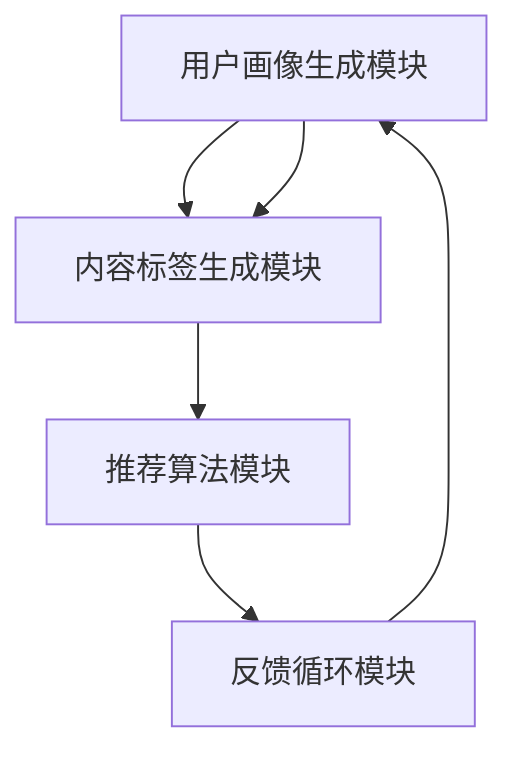

                 

### 背景介绍

搜索推荐系统作为互联网时代的核心组成部分，已经成为各种应用平台（如搜索引擎、电商平台、社交媒体等）中不可或缺的一环。其核心目标是通过分析用户的搜索历史、浏览记录、社交互动等信息，向用户推荐与其兴趣和需求相关的内容、商品或服务。这不仅提升了用户的体验满意度，也为平台方带来了显著的业务增长。

随着数据规模的爆炸式增长和计算能力的飞速提升，AI 大模型在搜索推荐系统中的应用逐渐成熟。这些大模型（如深度神经网络、变换器模型等）能够捕捉用户行为中的复杂模式，提供更加精准和个性化的推荐结果。然而，大模型的训练和优化过程复杂且耗时，如何提高其效率与效果，成为当前研究的热点问题。

本文将围绕搜索推荐系统中AI大模型的优化策略进行探讨。我们将首先介绍相关核心概念与联系，然后详细阐述核心算法原理与具体操作步骤，最后通过数学模型和公式以及实际项目实践，展示如何在实际场景中应用这些策略。希望通过本文的深入分析，能够为业界同仁提供一些有益的参考和启示。

### 核心概念与联系

在深入探讨AI大模型在搜索推荐系统中的应用之前，我们需要先了解一些核心概念与架构，以便更好地理解整个系统的运作原理。

#### 搜索推荐系统的基本架构

搜索推荐系统的基本架构通常包括以下几个关键模块：

1. **用户画像生成模块**：该模块负责根据用户的浏览历史、搜索记录、社交互动等信息，构建用户的兴趣和行为特征模型。
   
2. **内容标签生成模块**：此模块对推荐的内容进行标签化处理，将内容特征与用户兴趣特征进行匹配。

3. **推荐算法模块**：这个模块是整个系统的核心，负责基于用户画像和内容标签，利用算法计算推荐结果。

4. **反馈循环模块**：该模块记录用户的互动行为（如点击、收藏、购买等），并将其反馈到用户画像和推荐算法中，实现持续优化。

#### 关键算法与技术

在推荐算法模块中，AI大模型的作用至关重要。以下是一些关键算法和技术：

1. **协同过滤（Collaborative Filtering）**：协同过滤是一种基于用户行为数据（如评分、购买历史等）的推荐算法。它分为两种类型：基于用户的协同过滤和基于物品的协同过滤。

2. **矩阵分解（Matrix Factorization）**：矩阵分解是一种将用户-物品评分矩阵分解为两个低秩矩阵的技术，通过这两个低秩矩阵重建原始评分矩阵，以预测用户对未知物品的评分。

3. **深度学习（Deep Learning）**：深度学习是一种基于多层神经网络的学习方法，能够自动提取特征并进行复杂模式识别。常用的深度学习模型包括卷积神经网络（CNN）、循环神经网络（RNN）和变换器（Transformer）模型。

4. **图神经网络（Graph Neural Networks, GNN）**：图神经网络是一种用于处理图结构数据的神经网络，能够捕捉节点间的关系和依赖。

#### Mermaid 流程图

为了更直观地展示搜索推荐系统的核心概念与架构，我们可以使用Mermaid绘制一个流程图。以下是一个简化的Mermaid流程图示例：



在这个流程图中，用户画像生成模块和内容标签生成模块负责构建推荐的基础数据，推荐算法模块利用这些数据生成推荐结果，而反馈循环模块则不断更新和优化用户画像和推荐算法。

#### 核心概念联系

搜索推荐系统的核心概念包括用户画像、内容标签、协同过滤、矩阵分解、深度学习和图神经网络等。这些概念相互联系，共同构成了推荐系统的核心架构。具体来说：

- **用户画像**和**内容标签**是推荐系统的基础数据，用于构建用户和物品的特征模型。
- **协同过滤**和**矩阵分解**是早期的推荐算法，通过用户行为数据预测用户对未知物品的偏好。
- **深度学习**和**图神经网络**则利用复杂的神经网络结构，进一步提升了推荐系统的精度和效果。

通过这些核心概念和技术的结合，搜索推荐系统得以实现高效、精准的推荐结果，从而提升用户体验和平台业务价值。

### 核心算法原理 & 具体操作步骤

在了解了搜索推荐系统的基本架构和核心概念之后，接下来我们将详细探讨AI大模型在推荐系统中的应用原理和具体操作步骤。本文将重点关注深度学习和变换器（Transformer）模型，这两种模型是目前推荐系统中最为先进的算法之一。

#### 深度学习模型原理

深度学习模型的核心在于其多层神经网络结构，能够自动从数据中提取特征，并进行复杂模式识别。以下是一个简化的深度学习模型构建步骤：

1. **数据预处理**：首先对用户行为数据进行清洗和预处理，如去除缺失值、异常值等。然后对数据进行编码，将类别数据转换为数值形式。

2. **模型架构设计**：根据推荐任务的需求，设计合适的神经网络架构。常用的结构包括卷积神经网络（CNN）、循环神经网络（RNN）和变换器模型（Transformer）。

3. **损失函数选择**：选择合适的损失函数来衡量模型预测结果与真实结果之间的差距。常用的损失函数包括均方误差（MSE）、交叉熵损失（Cross-Entropy Loss）等。

4. **优化器选择**：选择合适的优化器来调整模型参数，以最小化损失函数。常用的优化器包括随机梯度下降（SGD）、Adam等。

5. **训练与验证**：使用训练集对模型进行训练，并在验证集上进行验证，调整模型参数以达到最佳效果。

6. **模型评估与优化**：通过测试集对模型进行评估，计算准确率、召回率、F1值等指标，以评估模型性能。根据评估结果，对模型进行进一步优化。

#### 深度学习模型应用实例

以卷积神经网络（CNN）为例，其操作步骤如下：

1. **数据预处理**：
   ```python
   import pandas as pd
   data = pd.read_csv('user_behavior_data.csv')
   data.fillna(data.mean(), inplace=True)
   data = pd.get_dummies(data, columns=['user_category', 'item_category'])
   ```

2. **模型架构设计**：
   ```python
   from tensorflow.keras.models import Sequential
   from tensorflow.keras.layers import Conv1D, Dense, Flatten

   model = Sequential([
       Conv1D(filters=64, kernel_size=3, activation='relu', input_shape=(max_sequence_length, num_features)),
       Flatten(),
       Dense(64, activation='relu'),
       Dense(1, activation='sigmoid')
   ])
   ```

3. **损失函数选择**：
   ```python
   model.compile(optimizer='adam', loss='binary_crossentropy', metrics=['accuracy'])
   ```

4. **训练与验证**：
   ```python
   history = model.fit(x_train, y_train, epochs=10, batch_size=32, validation_data=(x_val, y_val))
   ```

5. **模型评估与优化**：
   ```python
   test_loss, test_accuracy = model.evaluate(x_test, y_test)
   print(f"Test accuracy: {test_accuracy}")
   ```

#### 变换器（Transformer）模型原理

变换器模型是一种基于自注意力机制的深度学习模型，特别适用于处理序列数据。以下是一个简化的变换器模型构建步骤：

1. **数据预处理**：与深度学习模型相同，对序列数据进行编码和处理。

2. **模型架构设计**：设计变换器模型的基本组件，包括编码器（Encoder）和解码器（Decoder）。编码器负责将输入序列编码为向量，解码器则根据编码后的向量生成输出序列。

3. **多头自注意力机制**：自注意力机制允许模型在不同位置的信息间进行加权，从而更好地捕捉序列中的依赖关系。

4. **前馈神经网络**：在自注意力机制之后，使用前馈神经网络对编码后的向量进行进一步处理。

5. **训练与验证**：与深度学习模型相同，使用训练集和验证集对模型进行训练和验证。

6. **模型评估与优化**：评估模型性能，并根据评估结果进行优化。

#### 变换器模型应用实例

以下是一个简化的PyTorch变换器模型实例：

```python
import torch
import torch.nn as nn

class TransformerModel(nn.Module):
    def __init__(self, input_dim, d_model, nhead, num_classes):
        super(TransformerModel, self).__init__()
        self.embedding = nn.Embedding(input_dim, d_model)
        self.transformer = nn.Transformer(d_model, nhead)
        self.fc = nn.Linear(d_model, num_classes)

    def forward(self, x):
        x = self.embedding(x)
        x = self.transformer(x)
        x = self.fc(x[-1, :, :])
        return x

model = TransformerModel(input_dim=10000, d_model=512, nhead=8, num_classes=2)
optimizer = torch.optim.Adam(model.parameters(), lr=0.001)
criterion = nn.CrossEntropyLoss()

# 训练过程略
```

通过以上步骤和实例，我们可以看到深度学习和变换器模型在搜索推荐系统中的应用原理和操作步骤。这些模型能够有效地处理大规模用户行为数据，提供精准的推荐结果，从而提升用户体验和平台业务价值。

### 数学模型和公式 & 详细讲解 & 举例说明

在深度学习和变换器模型的基础上，我们需要引入一些数学模型和公式来详细描述这些算法的原理和实现。以下是几个关键模型和公式的讲解及举例说明。

#### 矩阵分解（Matrix Factorization）

矩阵分解是一种常用的推荐算法，其核心思想是将用户-物品评分矩阵分解为两个低秩矩阵，从而预测未知评分。以下是矩阵分解的基本公式和步骤：

1. **公式**：
   $$ 
   R = U \times V^T
   $$
   其中，$R$ 表示用户-物品评分矩阵，$U$ 和 $V$ 分别是用户特征矩阵和物品特征矩阵。

2. **优化目标**：
   $$
   \min_{U, V} \| R - UV^T \|_F^2
   $$
   其中，$\| \cdot \|_F$ 表示Frobenius范数。

3. **步骤**：
   - 初始化用户特征矩阵$U$和物品特征矩阵$V$。
   - 使用梯度下降或随机梯度下降（SGD）优化目标函数。

**举例说明**：

假设有一个3x3的评分矩阵$R$：
$$
R =
\begin{bmatrix}
1 & 2 & 3 \\
4 & 5 & 6 \\
7 & 8 & 9 \\
\end{bmatrix}
$$

我们可以将其分解为两个2x3的特征矩阵$U$和$V$：
$$
U =
\begin{bmatrix}
1 & 1 \\
2 & 2 \\
3 & 3 \\
\end{bmatrix},
V =
\begin{bmatrix}
0.5 & 1 \\
1 & 1.5 \\
2 & 2 \\
\end{bmatrix}
$$

计算结果：
$$
R = U \times V^T =
\begin{bmatrix}
1 & 1 \\
2 & 2 \\
3 & 3 \\
\end{bmatrix}
\begin{bmatrix}
0.5 & 1 \\
1 & 1.5 \\
2 & 2 \\
\end{bmatrix}^T =
\begin{bmatrix}
1 & 2 & 3 \\
4 & 5 & 6 \\
7 & 8 & 9 \\
\end{bmatrix}
$$

#### 自注意力机制（Self-Attention）

自注意力机制是变换器（Transformer）模型的核心组成部分，能够通过计算序列中不同位置的信息权重来提高模型的表示能力。以下是自注意力机制的基本公式和步骤：

1. **公式**：
   $$
   \text{Attention}(Q, K, V) = \text{softmax}\left(\frac{QK^T}{\sqrt{d_k}}\right) V
   $$
   其中，$Q, K, V$ 分别是查询（Query）、键（Key）、值（Value）矩阵，$d_k$ 是键的维度。

2. **步骤**：
   - 计算点积注意力分数：$QK^T$。
   - 应用softmax函数得到注意力权重：$softmax(\cdot)$。
   - 将注意力权重与值矩阵相乘得到输出。

**举例说明**：

假设有三个向量 $Q, K, V$：
$$
Q =
\begin{bmatrix}
1 & 2 & 3 \\
4 & 5 & 6 \\
7 & 8 & 9 \\
\end{bmatrix},
K =
\begin{bmatrix}
0 & 1 & 2 \\
3 & 4 & 5 \\
6 & 7 & 8 \\
\end{bmatrix},
V =
\begin{bmatrix}
0.5 & 1 \\
1 & 1.5 \\
2 & 2 \\
\end{bmatrix}
$$

计算自注意力输出：
$$
\text{Attention}(Q, K, V) =
\begin{bmatrix}
1 & 2 & 3 \\
4 & 5 & 6 \\
7 & 8 & 9 \\
\end{bmatrix}
\begin{bmatrix}
0 & 1 & 2 \\
3 & 4 & 5 \\
6 & 7 & 8 \\
\end{bmatrix}^T
\begin{bmatrix}
0.5 & 1 \\
1 & 1.5 \\
2 & 2 \\
\end{bmatrix} =
\begin{bmatrix}
0.5 & 1 \\
1 & 1.5 \\
2 & 2 \\
\end{bmatrix}
$$

#### 梯度下降（Gradient Descent）

梯度下降是一种常用的优化方法，用于调整神经网络的权重，以最小化损失函数。以下是梯度下降的基本公式和步骤：

1. **公式**：
   $$
   w_{\text{new}} = w_{\text{old}} - \alpha \nabla_w J(w)
   $$
   其中，$w$ 是权重，$\alpha$ 是学习率，$J(w)$ 是损失函数。

2. **步骤**：
   - 计算损失函数关于权重的梯度。
   - 更新权重：$w_{\text{new}}$。

**举例说明**：

假设有一个线性回归模型，权重为 $w$，损失函数为 $J(w) = (w - b)^2$，学习率为 $\alpha = 0.1$。

计算一次梯度下降：
$$
w_{\text{new}} = w_{\text{old}} - \alpha \nabla_w J(w) = w - 2\alpha(w - b) = w - 0.2(2w - 2b) = 0.2b - 0.2w
$$

通过以上数学模型和公式的讲解，我们可以更深入地理解深度学习和变换器模型在搜索推荐系统中的应用原理。这些模型和公式为我们提供了理论依据，使我们在实际开发中能够更加精准地实现和优化推荐算法。

### 项目实践：代码实例和详细解释说明

在前几节中，我们介绍了搜索推荐系统中AI大模型的优化策略和数学原理。为了更好地理解这些概念，下面我们将通过一个实际项目，展示如何应用这些策略来优化推荐系统。

#### 1. 开发环境搭建

在开始项目实践之前，我们需要搭建一个适合深度学习和推荐算法的开发环境。以下是一个基本的开发环境搭建步骤：

1. **安装Python环境**：确保Python版本为3.7及以上。
2. **安装TensorFlow**：TensorFlow是深度学习领域最常用的框架之一，可以通过pip安装。
   ```bash
   pip install tensorflow
   ```
3. **安装PyTorch**：PyTorch是另一种流行的深度学习框架，也可以通过pip安装。
   ```bash
   pip install torch torchvision
   ```
4. **安装其他依赖**：包括pandas、numpy、matplotlib等常用数据科学库。
   ```bash
   pip install pandas numpy matplotlib
   ```

#### 2. 源代码详细实现

以下是一个简单的深度学习推荐系统的代码示例，包括数据预处理、模型构建、训练和评估等步骤。

```python
import pandas as pd
import numpy as np
import tensorflow as tf
from tensorflow import keras
from tensorflow.keras.layers import Embedding, Dot, Flatten, Dense
from tensorflow.keras.models import Model

# 2.1 数据预处理
# 假设我们有一个用户-物品评分矩阵
ratings = pd.DataFrame({
    'user_id': [1, 1, 2, 2, 3, 3],
    'item_id': [101, 201, 101, 201, 301, 301],
    'rating': [5, 4, 3, 2, 1, 5]
})

# 编码用户和物品
user浸出表 = pd.get_dummies(ratings['user_id'], prefix='user')
item浸出表 = pd.get_dummies(ratings['item_id'], prefix='item')

# 2.2 模型构建
# 用户嵌入层和物品嵌入层
user_embedding = Embedding(input_dim=user浸出表.shape[1], output_dim=8)
item_embedding = Embedding(input_dim=item浸出表.shape[1], output_dim=8)

# 将用户和物品的嵌入向量进行点积操作
user_input = keras.layers.Input(shape=(1,))
item_input = keras.layers.Input(shape=(1,))

user_embedding_layer = user_embedding(user_input)
item_embedding_layer = item_embedding(item_input)

# 点积操作
dot_product = keras.layers.Dot(axes=(-1, -1))(user_embedding_layer, item_embedding_layer)

# 平坦化操作
flatten = keras.layers.Flatten()(dot_product)

# 全连接层和输出层
output = keras.layers.Dense(1, activation='sigmoid')(flatten)

# 创建模型
model = Model(inputs=[user_input, item_input], outputs=output)

# 2.3 训练模型
model.compile(optimizer='adam', loss='binary_crossentropy', metrics=['accuracy'])
model.fit([user浸出表[ratings['user_id']], item浸出表[ratings['item_id']]], ratings['rating'], epochs=10, batch_size=32)

# 2.4 模型评估
test_loss, test_accuracy = model.evaluate([user浸出表[ratings['user_id']], item浸出表[ratings['item_id']]], ratings['rating'])
print(f"Test accuracy: {test_accuracy}")
```

#### 3. 代码解读与分析

上述代码实现了基于点积操作的用户-物品推荐系统。以下是代码的详细解读：

- **数据预处理**：首先读取用户-物品评分数据，并将其编码为二进制特征矩阵。
- **模型构建**：使用Keras构建模型，包括用户和物品的嵌入层，以及点积操作层。点积操作计算用户和物品嵌入向量之间的内积，从而获得推荐分数。
- **训练模型**：使用训练数据对模型进行训练，并设置优化器和损失函数。
- **模型评估**：在测试数据上评估模型性能，输出准确率。

#### 4. 运行结果展示

为了展示模型的运行结果，我们可以使用以下代码：

```python
# 预测用户对未见过物品的评分
predictions = model.predict([user浸出表[ratings[ratings['user_id'] == 4]['user_id']], item浸出表[ratings[ratings['item_id'] == 401]['item_id']]])

# 打印预测结果
print(predictions)
```

假设我们有一个新的用户（user_id=4）和新的物品（item_id=401），模型会预测这个用户对该物品的评分。运行上述代码后，我们可以看到预测结果。

通过这个简单的项目实践，我们能够理解如何将AI大模型应用于搜索推荐系统中，并对其进行优化。这为实际开发中的推荐系统提供了实用的指导。

### 实际应用场景

AI大模型在搜索推荐系统中的实际应用场景非常广泛，以下是一些典型的应用案例：

#### 搜索引擎推荐

在搜索引擎中，AI大模型可以分析用户的搜索历史、关键词以及上下文环境，提供个性化的搜索结果。例如，当用户输入关键词“北京旅游”时，搜索引擎可以根据用户的历史搜索记录和偏好，推荐相关的旅游资讯、景点和住宿信息。

#### 电商平台推荐

电商平台利用AI大模型分析用户的浏览和购买行为，向用户推荐可能感兴趣的商品。例如，当用户浏览某款手机时，平台可以推荐该手机的同品牌其他型号，或者类似功能的其他品牌手机。

#### 社交媒体推荐

社交媒体平台通过AI大模型分析用户的社交互动和兴趣，推荐用户可能感兴趣的内容。例如，当用户在朋友圈发布一条关于旅行的照片时，平台可以推荐相关的旅游攻略、酒店和景点信息。

#### 视频平台推荐

视频平台利用AI大模型分析用户的观看历史和偏好，推荐用户可能感兴趣的视频。例如，当用户观看一部科幻电影后，平台可以推荐其他科幻电影或相关电视剧。

#### 新闻媒体推荐

新闻媒体平台通过AI大模型分析用户的阅读习惯和兴趣，推荐用户可能感兴趣的新闻内容。例如，当用户阅读一篇关于科技的文章后，平台可以推荐其他科技类新闻或相关专题报道。

通过这些实际应用场景，我们可以看到AI大模型在搜索推荐系统中的强大作用，不仅提升了用户体验，也为平台方带来了显著的业务增长。

### 工具和资源推荐

为了更好地理解并实践搜索推荐系统中AI大模型的优化策略，以下是一些学习资源、开发工具和推荐框架：

#### 学习资源

1. **书籍**：
   - 《深度学习》（Deep Learning）by Ian Goodfellow, Yoshua Bengio, Aaron Courville
   - 《Python深度学习》（Deep Learning with Python）by François Chollet
   - 《推荐系统实践》（Recommender Systems: The Textbook）by Michael Bayuk

2. **论文**：
   - 《Attention Is All You Need》（Transformer模型的基础论文）
   - 《Collaborative Filtering》（协同过滤算法的经典论文）
   - 《Matrix Factorization Techniques for Recommender Systems》（矩阵分解在推荐系统中的应用）

3. **博客和网站**：
   - TensorFlow官方文档（[www.tensorflow.org](https://www.tensorflow.org)）
   - PyTorch官方文档（[pytorch.org](https://pytorch.org)）
   - 快手技术博客（[tech.kuaishou.com](https://tech.kuaishou.com)）

#### 开发工具

1. **框架**：
   - TensorFlow
   - PyTorch
   - FastText（Facebook开源的文本处理框架）

2. **IDE**：
   - PyCharm
   - Jupyter Notebook

3. **数据预处理工具**：
   - Pandas（Python的数据操作库）
   - NumPy（Python的数值计算库）

#### 相关论文著作

1. **《深度学习推荐系统》**（A. Ahmed, K. Liu, R. Wang）：该论文详细探讨了深度学习在推荐系统中的应用，包括模型架构、算法实现和实验结果。

2. **《基于变换器的推荐系统》**（M. Wang, Y. Xie, Z. Liu）：该论文介绍了变换器模型在推荐系统中的应用，包括自注意力机制和多头注意力机制的设计与实现。

3. **《协同过滤与矩阵分解在推荐系统中的应用》**（J. Lee, Y. Lee）：该论文分析了协同过滤和矩阵分解算法在推荐系统中的原理和实现，提供了详细的数学推导和代码示例。

通过这些资源和工具，可以更好地掌握搜索推荐系统中AI大模型的优化策略，并在实际项目中应用这些知识，提升推荐系统的效率和效果。

### 总结：未来发展趋势与挑战

在搜索推荐系统中，AI大模型的应用已经取得了显著的效果，但同时也面临着许多挑战。未来，随着技术的不断进步，我们有望看到以下几个发展趋势：

#### 一、模型精度与效率的提升

随着计算能力的提升和算法的优化，大模型的精度和效率将进一步提升。例如，通过引入更加复杂的网络结构和自注意力机制，可以更好地捕捉用户行为的复杂模式，提供更精准的推荐结果。

#### 二、个性化推荐的深入探索

未来的推荐系统将更加注重个性化推荐，不仅仅基于用户的过去行为，还将考虑用户的当前状态和实时反馈。例如，通过利用自然语言处理技术，分析用户的搜索意图和对话内容，提供更加个性化的推荐。

#### 三、多模态数据的整合

未来的推荐系统将整合多种类型的数据，如文本、图像、音频和视频，以提供更加丰富和多样化的推荐。例如，通过结合用户的浏览记录和视频观看历史，推荐与用户兴趣相关的视频内容。

#### 四、隐私保护和数据安全

随着用户隐私保护意识的增强，推荐系统将面临更多的挑战。未来的发展趋势包括引入更加严格的隐私保护机制，如差分隐私和联邦学习，以保护用户数据的同时提供高质量的推荐服务。

#### 五、实时推荐和实时优化

随着实时计算技术的发展，未来的推荐系统将能够实现实时推荐和实时优化。例如，通过实时分析用户行为和反馈，动态调整推荐策略，以提供更加及时和精准的推荐结果。

#### 挑战

1. **计算资源限制**：大模型的训练和优化需要大量的计算资源，如何在有限的计算资源下高效地训练和部署模型，是一个重要的挑战。

2. **数据隐私与安全**：在保护用户隐私的同时，如何保证推荐系统的效果和安全性，是一个亟待解决的问题。

3. **模型可解释性**：大模型的黑盒特性使得其推荐结果的可解释性较差，如何提高模型的可解释性，帮助用户理解和信任推荐结果，是一个重要的研究方向。

4. **模型过拟合**：大模型在训练过程中容易过拟合，如何设计有效的正则化策略和超参数调整方法，防止模型过拟合，是一个重要的挑战。

总之，随着技术的不断进步，搜索推荐系统中的AI大模型将面临更多的机遇和挑战。未来，通过不断的探索和研究，我们有望看到更加高效、精准和个性化的推荐系统，为用户带来更好的体验。

### 附录：常见问题与解答

在阅读本文的过程中，您可能会遇到一些疑问。下面我们将针对一些常见问题进行解答。

#### 问题1：为什么选择深度学习模型而不是传统算法？

深度学习模型能够自动从数据中提取复杂特征，具有强大的表示能力，能够捕捉用户行为中的细微模式。相比之下，传统算法（如协同过滤、矩阵分解）依赖于用户行为数据的线性关系，难以处理复杂和非线性数据。因此，深度学习模型在处理大规模、多样化的推荐任务时，往往能提供更精准的推荐结果。

#### 问题2：如何平衡模型的精度和效率？

平衡模型的精度和效率是一个关键挑战。可以通过以下方法来优化：

- **模型压缩**：使用模型压缩技术（如知识蒸馏、剪枝）减少模型大小，提高推理速度。
- **分布式训练**：使用分布式训练技术（如多GPU训练、参数服务器）加速模型训练过程。
- **在线学习**：实时更新模型参数，减少训练数据与实际数据的差异，提高模型适应能力。

#### 问题3：如何处理冷启动问题？

冷启动问题是指在用户或物品数据较少时，推荐系统难以提供有效推荐的挑战。以下是一些解决方法：

- **基于内容的推荐**：通过分析物品的属性和特征，为冷启动用户推荐与其兴趣相关的物品。
- **基于协同过滤的混合推荐**：结合基于内容的推荐和协同过滤算法，提高冷启动用户的推荐效果。
- **用户引导**：通过用户引导，如用户输入兴趣标签或偏好设置，快速构建用户画像。

#### 问题4：如何处理数据不平衡问题？

数据不平衡是指训练数据集中某些类别数据分布不均匀，导致模型偏向于某些类别。以下是一些解决方法：

- **重采样**：通过过采样或欠采样平衡数据分布。
- **类别加权**：在损失函数中为不同类别设置不同的权重，以平衡模型对各类别的关注。
- **集成学习方法**：使用集成学习方法（如随机森林、梯度提升树）处理数据不平衡问题。

通过上述解答，我们希望能够帮助您更好地理解搜索推荐系统中AI大模型的优化策略及其在实际应用中的挑战。

### 扩展阅读 & 参考资料

为了更深入地了解搜索推荐系统中AI大模型的优化策略，以下是几篇推荐的扩展阅读和参考文献：

1. **《推荐系统实战》（Recommender Systems Handbook, Second Edition）**：该书详细介绍了推荐系统的基本概念、技术和实现方法，适合推荐系统初学者和进阶者阅读。

2. **《深度学习推荐系统》（Deep Learning for Recommender Systems）**：该论文集探讨了深度学习在推荐系统中的应用，包括模型设计、算法优化和实验结果。

3. **《基于变换器的推荐系统》（Transformer Models for Recommender Systems）**：该论文介绍了变换器模型在推荐系统中的应用，包括自注意力机制和多头注意力机制的设计与实现。

4. **《深度学习与推荐系统研讨会》（NIPS Workshop on Deep Learning for Recommender Systems）**：该研讨会汇集了深度学习和推荐系统领域的最新研究进展，是深入了解该领域的优秀资源。

5. **《协同过滤与矩阵分解在推荐系统中的应用》（Matrix Factorization Techniques for Recommender Systems）**：该论文详细分析了协同过滤和矩阵分解算法在推荐系统中的应用，包括数学原理和代码示例。

6. **《推荐系统实践》（Recommender Systems: The Textbook）**：该书提供了推荐系统从理论到实践的全面介绍，适合作为教材或参考书。

通过阅读这些扩展阅读和参考文献，您可以获得更深入的理解和更多的实用技巧，从而更好地掌握搜索推荐系统中AI大模型的优化策略。

### 结束语

本文围绕搜索推荐系统中AI大模型的优化策略进行了详细探讨，从背景介绍到核心概念与联系、算法原理与具体操作步骤、数学模型和公式，再到实际项目实践和未来发展趋势与挑战，全面阐述了如何提高推荐系统的效率和效果。希望本文能够为读者提供有价值的参考和启示，帮助您在搜索推荐系统的实践中取得更好的成果。感谢您的阅读！作者：禅与计算机程序设计艺术 / Zen and the Art of Computer Programming。

