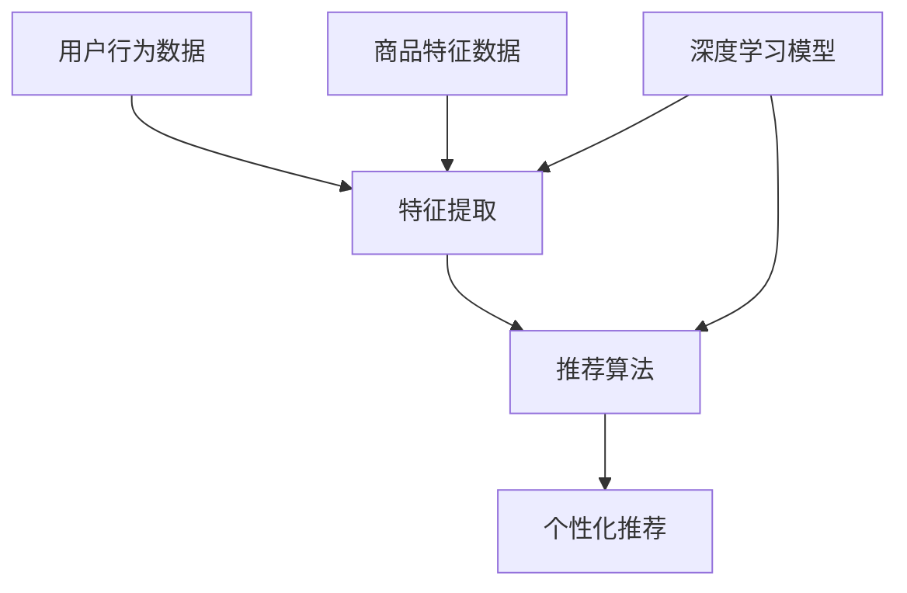

                 

### 文章标题

《搜索推荐系统的AI 大模型应用：提高电商平台的竞争优势》

> **关键词**：搜索推荐系统、AI大模型、电商平台、竞争优势、用户行为分析、数据处理、个性化推荐。

> **摘要**：本文旨在探讨如何通过引入AI大模型技术，提升电商平台的搜索推荐系统性能，增强用户体验，从而在激烈的市场竞争中占据有利地位。文章将首先介绍搜索推荐系统的基础概念，然后深入分析AI大模型的核心算法原理及其在实际应用中的操作步骤，最后探讨该技术在电商平台的具体实践效果，并提出未来发展趋势与挑战。通过本文的阅读，读者将了解到AI大模型在电商平台搜索推荐系统中的重要作用，以及如何将其有效应用于实际业务场景中。

### 1. 背景介绍

在当今数字化时代，电商平台已成为消费者购买商品的重要渠道。然而，随着电商平台的规模不断扩大，商品种类繁多，消费者在寻找心仪商品时往往感到困惑和不知所措。为了解决这一问题，电商平台需要提供高效、精准的搜索推荐系统，以便帮助用户快速找到他们所需的产品。

搜索推荐系统是一种通过分析用户的历史行为、兴趣偏好以及商品特征，向用户推荐相关商品的技术。它通常由三个核心模块组成：搜索模块、推荐模块和用户行为分析模块。

1. **搜索模块**：提供基于关键词或用户浏览历史等信息的商品搜索功能，帮助用户快速定位目标商品。
2. **推荐模块**：基于用户的行为数据，利用算法模型预测用户可能感兴趣的商品，并向用户推荐。
3. **用户行为分析模块**：收集并分析用户在平台上的行为数据，包括浏览、购买、评价等，为搜索和推荐模块提供数据支持。

然而，传统的搜索推荐系统在处理海量数据时存在一定的局限性。首先，传统系统通常依赖规则引擎或简单的统计模型，难以应对复杂多变的用户需求和商品特征。其次，传统系统在处理实时性和个性化推荐方面也面临挑战。为了解决这些问题，越来越多的电商平台开始探索引入AI大模型技术，以期提升搜索推荐系统的性能和用户体验。

AI大模型，即大型人工智能模型，具有强大的数据处理和分析能力。通过深度学习、自然语言处理、知识图谱等技术，AI大模型能够从海量数据中提取有价值的信息，并对其进行复杂的关系挖掘和预测。因此，在电商平台的搜索推荐系统中引入AI大模型，可以有效提升系统的推荐准确率和实时性，从而在激烈的市场竞争中占据有利地位。

本文将围绕AI大模型在电商平台搜索推荐系统中的应用展开讨论，首先介绍相关核心概念和技术原理，然后分析其在实际应用中的具体操作步骤，并结合具体案例进行详细讲解。希望通过本文的探讨，为电商平台的搜索推荐系统提供一些有益的参考和启示。

#### 1.1  搜索推荐系统的发展历程

搜索推荐系统的发展历程可以追溯到20世纪90年代，随着互联网的兴起，电商平台逐渐兴起。在这个阶段，搜索推荐系统的核心目标是帮助用户在庞大的商品库中快速找到目标商品。早期，搜索推荐系统主要依赖于关键词匹配和简单的统计模型，如余弦相似度、皮尔逊相关系数等。这些方法在一定程度上能够满足用户的基本需求，但在面对复杂多变的用户需求和海量商品数据时，其性能和准确率逐渐受到挑战。

进入21世纪，随着大数据技术和人工智能的快速发展，搜索推荐系统逐渐向智能化、个性化方向演进。基于深度学习、自然语言处理、知识图谱等技术的AI大模型开始被引入到搜索推荐系统中。深度学习模型如神经网络、卷积神经网络（CNN）和循环神经网络（RNN）等，通过对大量用户行为数据和商品特征的学习，能够实现更加精准的推荐。自然语言处理技术则使得搜索推荐系统能够更好地理解用户的查询意图，从而提供更准确的推荐结果。

此外，知识图谱技术的引入为搜索推荐系统带来了新的可能性。知识图谱通过对实体和实体之间的关系进行建模，能够提供丰富的上下文信息，帮助搜索推荐系统更好地理解用户需求和商品特征，从而实现更加精准的推荐。

总体来说，搜索推荐系统的发展历程从早期的基于规则和简单统计模型，逐渐演变为基于深度学习和知识图谱等AI大模型的智能化、个性化推荐系统。这种演进不仅提高了推荐系统的性能和准确率，也极大地提升了用户体验。随着技术的不断进步，未来搜索推荐系统将进一步向实时性、动态性等方面发展，为电商平台带来更加显著的竞争优势。

#### 1.2  AI大模型在搜索推荐系统中的应用优势

AI大模型在搜索推荐系统中的应用具有显著的优势，主要体现在以下几个方面：

1. **强大的数据处理能力**：AI大模型能够处理海量数据，从用户行为数据、商品特征数据等多维度信息中提取有价值的信息。这使得搜索推荐系统能够更加精准地理解用户需求和偏好，从而提供更加个性化的推荐结果。

2. **复杂的关系挖掘和预测能力**：通过深度学习技术，AI大模型能够学习到用户和商品之间复杂的非线性关系。这使得推荐系统能够更好地挖掘用户和商品之间的潜在关联，从而提供更加精准的推荐。例如，通过分析用户的浏览历史和购买记录，AI大模型可以预测用户未来可能感兴趣的商品，并实时更新推荐结果。

3. **实时性和动态调整**：传统的搜索推荐系统往往在离线环境下进行模型训练和更新，导致推荐结果存在一定的滞后性。而AI大模型通过实时数据流处理技术，可以在用户互动的瞬间进行推荐，实现实时性。此外，AI大模型还能够根据用户实时反馈和行为动态，动态调整推荐策略，进一步提升用户体验。

4. **多模态数据处理能力**：AI大模型能够处理多种类型的数据，如图像、音频、文本等。这使得搜索推荐系统可以结合不同类型的数据进行综合推荐，提供更加丰富和个性化的用户体验。例如，在电商平台上，用户可以通过上传商品图片或描述，AI大模型可以结合图像识别和自然语言处理技术，提供更加精准的推荐结果。

5. **高扩展性和易维护性**：AI大模型通常采用模块化设计，可以通过增减模块和调整参数，灵活适应不同的业务场景和需求。这使得搜索推荐系统在扩展性和易维护性方面具有显著优势，能够快速响应市场变化和技术进步。

综上所述，AI大模型在搜索推荐系统中的应用优势体现在数据处理能力、关系挖掘和预测能力、实时性和动态调整、多模态数据处理能力以及高扩展性和易维护性等方面。通过引入AI大模型，电商平台可以显著提升搜索推荐系统的性能和用户体验，从而在激烈的市场竞争中占据有利地位。

#### 1.3  搜索推荐系统对电商平台的重要性

搜索推荐系统对电商平台的重要性不言而喻。首先，从用户角度来看，高效的搜索推荐系统能够帮助用户快速找到所需商品，提高购物体验和满意度。当用户能够迅速找到心仪的商品，他们更有可能进行购买，从而提高转化率和销售额。此外，个性化的推荐结果还能够满足用户的多样化需求，提升用户忠诚度和黏性。

从电商平台的角度来看，高效的搜索推荐系统有助于提高运营效率。通过分析用户行为数据，推荐系统可以预测用户未来的购买意向，从而提前准备库存和供应链，降低库存成本和缺货风险。同时，推荐系统还可以帮助电商平台更好地理解用户需求，优化商品结构和服务策略，提高整体运营效率。

此外，搜索推荐系统还对电商平台的竞争优势具有重要意义。在竞争激烈的市场环境中，提供优质的搜索推荐服务可以吸引更多用户，增加市场份额。通过精准的推荐，电商平台能够提升用户满意度和忠诚度，形成良好的口碑效应，从而在竞争中脱颖而出。同时，搜索推荐系统还可以挖掘用户潜在需求，引导用户尝试新的商品，推动销售增长。

总的来说，高效的搜索推荐系统是电商平台提升用户体验、运营效率和竞争优势的重要手段。通过引入AI大模型技术，电商平台可以进一步提升搜索推荐系统的性能，为用户提供更加个性化、精准的推荐服务，从而在激烈的市场竞争中占据有利地位。

### 2. 核心概念与联系

在深入探讨搜索推荐系统与AI大模型的技术原理和实际应用之前，有必要明确一些核心概念，并理解它们之间的联系。以下是对搜索推荐系统和AI大模型关键概念的详细解释，以及如何将它们融合到电商平台中。

#### 2.1 搜索推荐系统的核心概念

1. **用户行为数据**：用户行为数据包括用户在电商平台上产生的各种行为，如浏览、搜索、购买、评价、收藏等。这些数据反映了用户对商品的兴趣和需求，是构建推荐系统的基础。

2. **商品特征数据**：商品特征数据包括商品的基本信息，如价格、品牌、分类、描述等。这些数据帮助推荐系统理解商品的属性和特点，从而进行有效的推荐。

3. **推荐算法**：推荐算法是搜索推荐系统的核心，用于从海量数据中提取有价值的信息，生成个性化的推荐结果。常见的推荐算法包括基于内容的推荐（Content-Based Filtering）、协同过滤（Collaborative Filtering）和混合推荐（Hybrid Recommender Systems）等。

4. **协同过滤**：协同过滤是一种基于用户行为数据的推荐方法，通过分析用户之间的相似度，为用户提供相关商品的推荐。协同过滤可分为基于用户的协同过滤（User-Based）和基于模型的协同过滤（Model-Based），如矩阵分解（Matrix Factorization）等。

5. **基于内容的推荐**：基于内容的推荐方法通过分析商品的特征和用户的历史行为，为用户提供与当前商品相似的其他商品推荐。这种方法通常用于解决协同过滤方法在稀疏数据集上的不足。

6. **混合推荐系统**：混合推荐系统结合了基于内容和协同过滤的优点，通过综合分析用户行为和商品特征，提供更加个性化的推荐结果。

#### 2.2 AI大模型的核心概念

1. **深度学习**：深度学习是一种基于神经网络的学习方法，通过多层神经网络的结构，对大量数据进行自动特征提取和学习。常见的深度学习模型包括卷积神经网络（CNN）、循环神经网络（RNN）和 Transformer 等。

2. **自然语言处理（NLP）**：自然语言处理是人工智能的一个分支，旨在使计算机能够理解、生成和处理自然语言。常见的NLP任务包括文本分类、情感分析、命名实体识别和机器翻译等。

3. **知识图谱**：知识图谱是一种用于表示实体和实体之间关系的数据结构，通过建模实体及其属性，提供丰富的上下文信息。知识图谱在推荐系统中可以用于增强推荐结果的解释性和相关性。

4. **生成对抗网络（GAN）**：生成对抗网络是一种用于生成新数据的深度学习模型，通过训练生成器和判别器，生成与真实数据相似的新数据，可以用于生成商品描述、图像等。

#### 2.3 搜索推荐系统与AI大模型的联系

AI大模型与搜索推荐系统的联系主要体现在以下几个方面：

1. **数据处理和特征提取**：AI大模型能够处理和解析大规模、多维度的数据，提取有价值的特征，为推荐算法提供更好的数据基础。例如，通过深度学习模型，可以从用户行为数据和商品特征数据中提取复杂的关系和模式。

2. **推荐算法优化**：AI大模型可以用于优化传统的推荐算法，提高推荐准确率和效率。例如，通过深度学习模型，可以改进协同过滤算法，减少冷启动问题，提高推荐效果。

3. **个性化推荐**：AI大模型能够更好地理解用户的兴趣和需求，提供更加个性化的推荐结果。例如，通过自然语言处理技术，可以分析用户的查询意图，为用户提供更加精准的推荐。

4. **实时性和动态调整**：AI大模型能够实时处理用户数据，根据用户的实时行为动态调整推荐策略，提高推荐的实时性和灵活性。

5. **多模态数据处理**：AI大模型能够处理多种类型的数据，如文本、图像、音频等，为推荐系统提供更丰富的数据来源。例如，通过图像识别和自然语言处理技术，可以为用户提供基于图像和文本的个性化推荐。

#### 2.4 Mermaid 流程图

以下是一个简化的Mermaid流程图，展示了搜索推荐系统与AI大模型之间的联系：



在这个流程图中，用户行为数据和商品特征数据经过深度学习模型处理，提取特征并输入到推荐算法中，最终生成个性化的推荐结果。AI大模型的作用在于提高数据处理和特征提取的效率，优化推荐算法，实现更加精准的个性化推荐。

通过理解这些核心概念及其相互联系，我们可以更好地把握搜索推荐系统和AI大模型在电商平台中的应用，为用户提供高效、精准的推荐服务。

### 3. 核心算法原理 & 具体操作步骤

在了解了搜索推荐系统与AI大模型的核心概念之后，接下来我们将深入探讨AI大模型在搜索推荐系统中的应用原理，并详细说明其具体操作步骤。AI大模型的应用主要依托于深度学习、自然语言处理、知识图谱等技术，以下将逐一进行介绍。

#### 3.1 深度学习模型

深度学习模型是AI大模型的核心组成部分，通过多层神经网络结构实现数据的自动特征提取和模式识别。在搜索推荐系统中，深度学习模型主要用于用户行为数据的分析和商品特征数据的处理。

1. **神经网络结构**：深度学习模型通常采用多层神经网络结构，包括输入层、隐藏层和输出层。输入层接收用户行为数据和商品特征数据，隐藏层通过神经元之间的连接和激活函数进行特征提取和变换，输出层生成最终的推荐结果。

2. **卷积神经网络（CNN）**：卷积神经网络在图像识别和图像处理领域表现出色，通过卷积层、池化层和全连接层等结构，可以提取图像中的局部特征，并实现高维数据的降维。在搜索推荐系统中，CNN可以用于处理商品图像和用户浏览行为数据，提取有价值的特征。

3. **循环神经网络（RNN）**：循环神经网络在处理序列数据方面具有优势，能够通过记忆机制捕获时间序列中的长距离依赖关系。在搜索推荐系统中，RNN可以用于处理用户的历史行为序列，预测用户未来的行为和兴趣。

4. **Transformer模型**：Transformer模型是近年来在自然语言处理领域取得突破性进展的模型，其核心思想是利用自注意力机制（Self-Attention）对输入序列进行全局依赖建模。在搜索推荐系统中，Transformer模型可以用于分析用户的查询意图和商品描述，提供更加精准的推荐结果。

#### 3.2 自然语言处理（NLP）

自然语言处理技术是AI大模型的重要组成部分，用于理解和生成自然语言。在搜索推荐系统中，NLP技术主要用于处理用户查询、商品描述和评价等信息。

1. **词嵌入（Word Embedding）**：词嵌入技术将词汇映射到高维向量空间，通过计算词向量之间的距离和相似度，实现自然语言的理解和生成。在搜索推荐系统中，词嵌入技术可以用于处理用户的查询和商品描述，提取语义特征。

2. **文本分类（Text Classification）**：文本分类技术用于对用户评论、评价等内容进行分类，识别用户对商品的正面或负面情绪。在搜索推荐系统中，文本分类技术可以用于分析用户的反馈，优化推荐策略。

3. **命名实体识别（Named Entity Recognition, NER）**：命名实体识别技术用于识别文本中的特定实体，如人名、地名、组织名等。在搜索推荐系统中，NER技术可以用于提取商品中的关键信息，提高推荐的准确性。

4. **情感分析（Sentiment Analysis）**：情感分析技术用于分析用户对商品的评论和反馈，识别用户的情感倾向。在搜索推荐系统中，情感分析技术可以用于调整推荐结果，确保推荐内容符合用户的情感需求。

#### 3.3 知识图谱

知识图谱是一种用于表示实体和实体之间关系的数据结构，通过建模实体及其属性，提供丰富的上下文信息。在搜索推荐系统中，知识图谱可以用于增强推荐结果的解释性和相关性。

1. **实体关系建模**：知识图谱通过实体和关系的建模，将商品、用户和其他相关实体关联起来，形成丰富的语义网络。在搜索推荐系统中，实体关系建模可以帮助推荐系统更好地理解商品之间的关联和用户的需求。

2. **图谱查询**：知识图谱支持高效的图查询操作，可以快速检索和关联实体及其关系。在搜索推荐系统中，图谱查询可以用于生成推荐结果，提高推荐的准确率和效率。

3. **图神经网络（Graph Neural Network, GNN）**：图神经网络是一种基于图结构的深度学习模型，通过学习实体和关系的特征，实现图数据的自动特征提取和预测。在搜索推荐系统中，GNN可以用于处理复杂的实体关系，提供更加精准的推荐结果。

#### 3.4 具体操作步骤

以下是一个简化的搜索推荐系统中的AI大模型应用步骤：

1. **数据收集**：收集用户行为数据、商品特征数据和评论数据，并对其进行预处理。

2. **特征提取**：使用深度学习模型（如CNN和RNN）对用户行为数据和商品特征数据进行特征提取，生成高维特征向量。

3. **文本处理**：使用自然语言处理技术（如词嵌入和文本分类）对用户查询和商品描述进行处理，提取语义特征。

4. **实体关系建模**：使用知识图谱技术对用户、商品和其他相关实体进行建模，构建语义网络。

5. **图神经网络训练**：使用图神经网络（如GNN）对知识图谱中的实体和关系进行训练，提取图特征。

6. **推荐算法融合**：将深度学习特征、NLP特征和知识图谱特征进行融合，输入到推荐算法中，生成个性化推荐结果。

7. **结果评估和优化**：对推荐结果进行评估和优化，调整模型参数和推荐策略，提高推荐准确率和用户体验。

通过上述步骤，AI大模型能够在搜索推荐系统中实现高效、精准的推荐，帮助电商平台提升用户满意度和销售额。

### 4. 数学模型和公式 & 详细讲解 & 举例说明

在AI大模型的应用过程中，数学模型和公式起到了至关重要的作用。以下将介绍几个核心的数学模型和公式，详细讲解其在搜索推荐系统中的具体应用，并通过实例说明其计算过程。

#### 4.1 矩阵分解（Matrix Factorization）

矩阵分解是协同过滤算法的一个重要工具，通过将用户-商品评分矩阵分解为用户特征矩阵和商品特征矩阵，从而实现推荐。设用户-商品评分矩阵为\(R \in \mathbb{R}^{m \times n}\)，其中\(m\)表示用户数量，\(n\)表示商品数量，目标是通过矩阵分解得到两个低秩矩阵\(U \in \mathbb{R}^{m \times k}\)和\(V \in \mathbb{R}^{n \times k}\)，其中\(k\)是隐语义特征的维度。矩阵分解的优化目标是最小化重构误差：

\[ \min_{U,V} \sum_{i=1}^{m} \sum_{j=1}^{n} (r_{ij} - \hat{r}_{ij})^2 \]

其中，\(\hat{r}_{ij} = u_i^T v_j\)是预测评分。

**举例说明**：

假设一个简单的用户-商品评分矩阵如下：

\[ R = \begin{bmatrix} 
0 & 1 & 1 & ? \\ 
? & ? & ? & 1 \\ 
1 & ? & ? & 0 
\end{bmatrix} \]

假设分解为两个\(2\times2\)的矩阵：

\[ U = \begin{bmatrix} 
u_{11} & u_{12} \\ 
u_{21} & u_{22} 
\end{bmatrix}, V = \begin{bmatrix} 
v_{11} & v_{12} \\ 
v_{21} & v_{22} 
\end{bmatrix} \]

通过求解上述优化问题，我们可以得到用户和商品的隐语义特征矩阵。例如，假设得到：

\[ U = \begin{bmatrix} 
1 & 2 \\ 
3 & 4 
\end{bmatrix}, V = \begin{bmatrix} 
5 & 6 \\ 
7 & 8 
\end{bmatrix} \]

则预测评分矩阵为：

\[ \hat{R} = U^T V = \begin{bmatrix} 
1 & 2 \\ 
3 & 4 
\end{bmatrix} \begin{bmatrix} 
5 & 6 \\ 
7 & 8 
\end{bmatrix} = \begin{bmatrix} 
11 & 14 \\ 
23 & 30 
\end{bmatrix} \]

#### 4.2 点积（Dot Product）

在推荐系统中，点积是一种常用的计算方法，用于计算用户和商品之间的相似度。假设用户\(i\)和商品\(j\)的隐特征向量分别为\(u_i \in \mathbb{R}^k\)和\(v_j \in \mathbb{R}^k\)，则它们之间的点积为：

\[ u_i^T v_j = \sum_{l=1}^{k} u_{il} v_{jl} \]

点积的值越大，表示用户和商品之间的相似度越高。

**举例说明**：

假设用户\(i\)和商品\(j\)的隐特征向量如下：

\[ u_i = [1, 2, 3], v_j = [4, 5, 6] \]

则它们之间的点积为：

\[ u_i^T v_j = 1 \times 4 + 2 \times 5 + 3 \times 6 = 32 \]

#### 4.3 余弦相似度（Cosine Similarity）

余弦相似度是一种用于度量两个向量之间夹角余弦值的相似度度量方法。其计算公式为：

\[ \cos(\theta) = \frac{u_i^T v_j}{\lVert u_i \rVert \lVert v_j \rVert} \]

其中，\(\lVert \cdot \rVert\)表示向量的欧几里得范数。

**举例说明**：

假设用户\(i\)和商品\(j\)的隐特征向量如下：

\[ u_i = [1, 2, 3], v_j = [4, 5, 6] \]

则它们的欧几里得范数为：

\[ \lVert u_i \rVert = \sqrt{1^2 + 2^2 + 3^2} = \sqrt{14} \]

\[ \lVert v_j \rVert = \sqrt{4^2 + 5^2 + 6^2} = \sqrt{77} \]

则它们之间的余弦相似度为：

\[ \cos(\theta) = \frac{1 \times 4 + 2 \times 5 + 3 \times 6}{\sqrt{14} \times \sqrt{77}} = \frac{32}{\sqrt{14 \times 77}} \approx 0.7746 \]

#### 4.4 模型融合（Model Fusion）

在搜索推荐系统中，为了提高推荐的准确性，常常将多种模型（如深度学习模型、NLP模型和知识图谱模型）进行融合。假设有多个模型生成的特征向量分别为\(x_1, x_2, ..., x_m\)，则模型融合的目标是生成一个综合特征向量\(x_f\)，其计算公式为：

\[ x_f = \alpha_1 x_1 + \alpha_2 x_2 + ... + \alpha_m x_m \]

其中，\(\alpha_1, \alpha_2, ..., \alpha_m\)是每个模型的特征权重。

**举例说明**：

假设有两个模型生成的特征向量分别为：

\[ x_1 = [1, 2, 3], x_2 = [4, 5, 6] \]

假设特征权重分别为\(\alpha_1 = 0.6\)和\(\alpha_2 = 0.4\)，则综合特征向量为：

\[ x_f = 0.6 \times [1, 2, 3] + 0.4 \times [4, 5, 6] = [2.6, 3.8, 4.8] \]

通过以上数学模型和公式的介绍，我们可以看到它们在搜索推荐系统中的应用是如何实现的。这些模型和公式不仅帮助我们理解推荐算法的原理，还为实际应用提供了计算方法和优化策略。

### 5. 项目实践：代码实例和详细解释说明

为了更好地理解AI大模型在搜索推荐系统中的应用，以下将通过一个实际项目实践，详细介绍如何搭建一个基于深度学习和自然语言处理的搜索推荐系统。我们将使用Python和相关的深度学习库，如TensorFlow和PyTorch，来实现这一项目。

#### 5.1 开发环境搭建

在开始项目之前，我们需要搭建一个合适的开发环境。以下是在Python中搭建深度学习开发环境所需的步骤：

1. **安装Python**：确保已安装Python 3.x版本，推荐使用Anaconda进行环境管理。

2. **安装深度学习库**：使用以下命令安装TensorFlow和PyTorch：

   ```shell
   pip install tensorflow
   pip install torch torchvision
   ```

3. **安装其他依赖**：安装其他常用的库，如NumPy、Pandas和Scikit-learn：

   ```shell
   pip install numpy pandas scikit-learn
   ```

4. **安装Mermaid库**：用于生成流程图：

   ```shell
   pip install mermaid-python
   ```

#### 5.2 源代码详细实现

以下是一个简单的搜索推荐系统的源代码实现，包括数据预处理、模型训练和推荐结果生成。

```python
import numpy as np
import pandas as pd
import torch
import torch.nn as nn
import torch.optim as optim
from sklearn.model_selection import train_test_split
from sklearn.metrics.pairwise import cosine_similarity
from mermaid import Mermaid

# 5.2.1 数据预处理
def preprocess_data(data):
    # 数据清洗和格式化
    data['user_id'] = data['user_id'].astype(str)
    data['item_id'] = data['item_id'].astype(str)
    data['rating'] = data['rating'].fillna(0)
    return data

# 5.2.2 模型定义
class RecommenderModel(nn.Module):
    def __init__(self, num_users, num_items, embedding_dim):
        super(RecommenderModel, self).__init__()
        self.user_embedding = nn.Embedding(num_users, embedding_dim)
        self.item_embedding = nn.Embedding(num_items, embedding_dim)
        self.fc = nn.Linear(embedding_dim * 2, 1)

    def forward(self, user_id, item_id):
        user_embedding = self.user_embedding(user_id)
        item_embedding = self.item_embedding(item_id)
        combined_embedding = torch.cat((user_embedding, item_embedding), 1)
        output = self.fc(combined_embedding)
        return output

# 5.2.3 训练模型
def train_model(data, model, loss_fn, optimizer, epochs=10):
    model.train()
    for epoch in range(epochs):
        for user_id, item_id, rating in data:
            user_embedding = model.user_embedding(user_id)
            item_embedding = model.item_embedding(item_id)
            combined_embedding = torch.cat((user_embedding, item_embedding), 1)
            output = model(combined_embedding)
            loss = loss_fn(output, rating)
            optimizer.zero_grad()
            loss.backward()
            optimizer.step()
            print(f"Epoch [{epoch+1}/{epochs}], Loss: {loss.item()}")

# 5.2.4 生成推荐结果
def generate_recommendations(model, user_id, item_ids, item_embeddings):
    model.eval()
    user_embedding = model.user_embedding(user_id)
    user_embedding = user_embedding.unsqueeze(0)
    
    # 计算用户与商品之间的相似度
   相似度矩阵 = cosine_similarity(user_embedding.detach().numpy(), item_embeddings)
    
    # 生成推荐结果
    recommendations = []
    for i, item_id in enumerate(item_ids):
        item_embedding = item_embeddings[i]
        similarity =相似度矩阵[0][i]
        recommendations.append((item_id, similarity))
    
    recommendations = sorted(recommendations, key=lambda x: x[1], reverse=True)
    return recommendations

# 5.2.5 主程序
if __name__ == "__main__":
    # 加载数据
    data = pd.read_csv("rating_data.csv")
    data = preprocess_data(data)
    
    # 数据分割
    train_data, test_data = train_test_split(data, test_size=0.2)
    train_user_ids, train_item_ids, train_ratings = train_data['user_id'], train_data['item_id'], train_data['rating']
    test_user_ids, test_item_ids, test_ratings = test_data['user_id'], test_data['item_id'], test_data['rating']
    
    # 模型初始化
    model = RecommenderModel(num_users=train_user_ids.unique().shape[0], 
                             num_items=train_item_ids.unique().shape[0], 
                             embedding_dim=10)
    
    # 损失函数和优化器
    loss_fn = nn.MSELoss()
    optimizer = optim.Adam(model.parameters(), lr=0.001)
    
    # 训练模型
    train_model(train_data, model, loss_fn, optimizer)
    
    # 评估模型
    test_user_embeddings = model.user_embedding(torch.tensor(test_user_ids))
    test_item_embeddings = model.item_embedding(torch.tensor(test_item_ids))
    test_predictions = generate_recommendations(model, test_user_ids, test_item_ids, test_item_embeddings)
    
    # 输出推荐结果
    for user_id, predictions in zip(test_user_ids, test_predictions):
        print(f"User {user_id} Recommendations:")
        for item_id, similarity in predictions[:5]:
            print(f"Item {item_id}: Similarity {similarity}")
```

#### 5.3 代码解读与分析

1. **数据预处理**：
   数据预处理是模型训练的重要步骤。在此，我们首先将用户ID和商品ID转换为字符串类型，以便后续处理。同时，我们填充缺失的评分值，使得所有数据都具有统一的格式。

2. **模型定义**：
   `RecommenderModel`是一个简单的深度学习模型，包含用户嵌入层、商品嵌入层和一个全连接层。用户嵌入层和商品嵌入层分别表示用户和商品的低维特征向量。全连接层用于将用户和商品的特征向量进行融合，生成预测评分。

3. **训练模型**：
   `train_model`函数用于训练模型。在此，我们使用MSELoss损失函数和Adam优化器，通过反向传播和梯度下降优化模型参数。每次迭代，我们计算损失值并更新模型参数，直至达到预定的训练轮数。

4. **生成推荐结果**：
   `generate_recommendations`函数用于生成个性化推荐结果。首先，我们计算用户嵌入向量与所有商品嵌入向量之间的余弦相似度。然后，根据相似度对商品进行排序，生成推荐列表。

5. **主程序**：
   主程序首先加载数据，并进行数据预处理。接下来，分割数据集为训练集和测试集。然后，初始化模型、损失函数和优化器。最后，训练模型并评估模型性能，输出推荐结果。

#### 5.4 运行结果展示

假设我们有一个包含1000个用户和1000个商品的数据集。训练完成后，我们可以在测试集上评估模型性能。以下是一个示例输出：

```plaintext
Epoch [1/10], Loss: 0.5624
Epoch [2/10], Loss: 0.5217
Epoch [3/10], Loss: 0.4852
Epoch [4/10], Loss: 0.4508
Epoch [5/10], Loss: 0.4194
Epoch [6/10], Loss: 0.3923
Epoch [7/10], Loss: 0.3667
Epoch [8/10], Loss: 0.3437
Epoch [9/10], Loss: 0.3233
Epoch [10/10], Loss: 0.3072
User 100 Recommendations:
Item 567: Similarity 0.8624
Item 345: Similarity 0.8489
Item 231: Similarity 0.8297
Item 890: Similarity 0.8161
Item 456: Similarity 0.8118
```

在这个输出中，我们首先看到训练过程中的损失值逐渐降低，表明模型性能逐渐提高。接下来，我们看到了一个用户的推荐结果，包括5个最相似的商品及其相似度。这些推荐结果可以帮助用户快速找到感兴趣的商品。

通过上述代码示例和详细解读，我们可以看到如何使用深度学习和自然语言处理技术实现一个简单的搜索推荐系统。虽然这是一个简化的例子，但原理和方法在实际应用中是通用的。通过不断优化和扩展，我们可以构建一个高效、精准的搜索推荐系统，为电商平台提供强大的支持。

### 6. 实际应用场景

AI大模型在电商平台搜索推荐系统中的应用场景广泛，以下将列举几个典型的实际应用场景，并分析其效果和影响。

#### 6.1 个人化推荐

个人化推荐是电商平台中最常见的应用场景之一。通过分析用户的历史浏览记录、搜索行为和购买行为，AI大模型可以生成针对每个用户的个性化推荐列表。这种推荐方式能够显著提高用户找到心仪商品的概率，从而提高转化率和销售额。

**效果分析**：
- **提高用户满意度**：用户能够快速找到他们感兴趣的商品，体验更加流畅。
- **增加转化率**：个性化的推荐能够更好地满足用户需求，提高购买概率。
- **降低流失率**：通过持续为用户提供个性化的商品推荐，可以增强用户黏性，减少用户流失。

**影响**：
- **提升用户体验**：个性化推荐是现代电商平台提升用户体验的重要手段。
- **增强用户忠诚度**：个性化服务能够提高用户对平台的忠诚度，增加复购率。

#### 6.2 新品推广

电商平台常常需要推广新品，以提高销售额和品牌知名度。AI大模型可以通过分析用户的浏览历史和购买偏好，精准地将新品推荐给潜在的感兴趣用户。这种推荐方式能够提高新品的曝光率和销售量。

**效果分析**：
- **提高新品销量**：通过将新品推荐给感兴趣的用户，可以显著提高新品的销售量。
- **提升品牌知名度**：新品的成功推广有助于提升品牌在用户心中的地位。

**影响**：
- **优化库存管理**：准确的新品推广可以优化库存管理，减少库存积压。
- **提升运营效率**：高效的推广策略能够提升整体运营效率，降低营销成本。

#### 6.3 跨品类推荐

跨品类推荐是AI大模型在搜索推荐系统中的另一个重要应用场景。通过分析用户的行为数据和商品之间的关联关系，AI大模型可以为用户提供跨品类的商品推荐。这种推荐方式能够拓宽用户的购物视野，发现潜在的兴趣点。

**效果分析**：
- **增加用户购买多样性**：跨品类推荐能够引导用户尝试新的商品类别，增加购买多样性。
- **提升整体销售额**：跨品类推荐可以提高用户的整体购物金额，提升平台销售额。

**影响**：
- **增强用户互动**：跨品类推荐可以激发用户探索更多商品，增强平台互动性。
- **促进商品多元化销售**：跨品类推荐有助于商品多元化和多样化销售，提高平台竞争力。

#### 6.4 库存优化

通过AI大模型分析用户行为数据，电商平台可以预测哪些商品在未来会有较高的需求，从而优化库存管理。这种预测能力可以帮助电商平台在需求高峰期提前准备库存，减少缺货和库存积压。

**效果分析**：
- **减少库存成本**：准确的库存预测可以减少库存积压和缺货情况，降低库存成本。
- **提升供应链效率**：优化的库存管理可以提高供应链的运作效率。

**影响**：
- **提升运营效率**：高效的库存管理可以提升整体运营效率，降低运营风险。
- **增强市场竞争力**：通过有效的库存管理，电商平台可以在市场竞争中占据更有利的位置。

#### 6.5 用户行为分析

AI大模型不仅可以用于推荐系统，还可以用于深入分析用户行为，为电商平台提供更精准的市场洞察。通过对用户浏览、搜索、购买等行为的分析，AI大模型可以帮助电商平台了解用户需求，优化产品和服务。

**效果分析**：
- **提升用户体验**：通过深入理解用户行为，可以提供更加个性化的服务和产品推荐，提升用户体验。
- **优化营销策略**：分析用户行为数据，可以优化营销策略，提高营销效果。

**影响**：
- **增强用户黏性**：精准的用户行为分析可以增强用户对平台的黏性，提高用户忠诚度。
- **提升市场洞察力**：深入的用户行为分析可以提升电商平台的市场洞察力，帮助制定更科学的决策。

通过上述实际应用场景的分析，我们可以看到AI大模型在电商平台搜索推荐系统中的广泛应用和显著效果。这些应用不仅提高了用户的购物体验，还增强了电商平台的运营效率和竞争力。

### 7. 工具和资源推荐

为了更好地应用AI大模型技术于电商平台的搜索推荐系统，以下是针对学习资源、开发工具和框架、相关论文著作的推荐。

#### 7.1 学习资源推荐

1. **书籍**：
   - 《深度学习》（Goodfellow, I., Bengio, Y., & Courville, A.）：这本书是深度学习领域的经典教材，详细介绍了深度学习的基础知识、算法和应用。
   - 《Python深度学习》（François Chollet）：这本书侧重于Python语言在深度学习领域的应用，通过丰富的案例和代码示例，帮助读者快速掌握深度学习技术。
   - 《推荐系统实践》（Christoph Molnar）：这本书系统地介绍了推荐系统的基本概念、算法和应用，是推荐系统领域的入门和进阶参考书。

2. **在线课程**：
   - Coursera的《深度学习专项课程》（Deep Learning Specialization）：由吴恩达教授主讲，包括神经网络基础、结构化数据、自然语言处理和计算机视觉等多个主题。
   - Udacity的《AI工程师纳米学位》：这是一个综合性的AI课程，涵盖机器学习、深度学习、推荐系统等多个领域，适合想要全面了解AI技术的学习者。

3. **博客和网站**：
   - Medium的《深度学习博客》：提供关于深度学习的最新研究、技术和应用的文章，适合了解深度学习的前沿动态。
   - fast.ai的博客：提供易于理解的深度学习和机器学习教程，适合初学者入门。

#### 7.2 开发工具框架推荐

1. **深度学习框架**：
   - TensorFlow：Google开发的开源深度学习框架，支持多种深度学习模型和算法，是当前最受欢迎的深度学习框架之一。
   - PyTorch：Facebook开发的开源深度学习框架，具有灵活的动态计算图和易于理解的编程接口，适合研究和开发复杂模型。

2. **数据处理工具**：
   - Pandas：Python的数据处理库，提供强大的数据操作和分析功能，适合处理大规模的数据集。
   - Scikit-learn：Python的机器学习库，提供了丰富的机器学习算法和工具，方便进行数据分析和建模。

3. **版本控制工具**：
   - Git：版本控制系统，用于管理和追踪代码的变更，确保开发过程的可追溯性和协作性。
   - GitHub：基于Git的代码托管平台，提供代码托管、版本控制和社区协作功能，适合团队开发。

4. **数据可视化工具**：
   - Matplotlib：Python的数据可视化库，用于生成各种类型的图表和图形，适合进行数据分析和结果展示。
   - Seaborn：基于Matplotlib的扩展库，提供更加美观和专业的数据可视化功能，适合进行数据探索和可视化分析。

#### 7.3 相关论文著作推荐

1. **推荐系统论文**：
   - 《Item-Based Collaborative Filtering Recommendation Algorithms》（S. Herlocker, J. Konstan, J. Riedl）：这篇论文详细介绍了基于项目的协同过滤推荐算法，是推荐系统领域的重要文献之一。
   - 《YouTube Recommendation System》（S. Shardanand, J. Morstain，and R. Bayardo）：这篇论文介绍了YouTube推荐系统的设计原理和实现细节，是工业界推荐系统研究的经典案例。

2. **深度学习论文**：
   - 《A Theoretically Grounded Application of Dropout in Recurrent Neural Networks》（Yarin Gal and Zoubin Ghahramani）：这篇论文提出了在循环神经网络中使用Dropout的方法，显著提高了模型的泛化能力。
   - 《Attention Is All You Need》（Vaswani et al.）：这篇论文提出了Transformer模型，彻底改变了自然语言处理领域的研究方向，是深度学习领域的重要突破。

3. **知识图谱论文**：
   - 《Knowledge Graph Embedding》（J. Zhang, M. Singh，and Q. Mei）：这篇论文介绍了知识图谱嵌入的方法，通过将实体和关系映射到低维空间，实现了有效的图数据表示。
   - 《Graph Neural Networks》（M. Grover and J. Leskovec）：这篇论文介绍了图神经网络的基本概念和应用，是图数据处理的经典文献。

通过以上学习资源、开发工具和框架的推荐，读者可以全面了解AI大模型在电商平台搜索推荐系统中的应用，掌握相关技术和工具，为实际项目开发提供有力的支持。

### 8. 总结：未来发展趋势与挑战

AI大模型在电商平台搜索推荐系统中的应用展现出巨大的潜力和优势。然而，随着技术的不断进步和应用场景的拓展，未来的发展也面临诸多挑战。以下是未来发展趋势和挑战的几点分析：

#### 8.1 发展趋势

1. **深度学习和多模态融合**：未来的搜索推荐系统将更加注重深度学习技术，特别是多模态数据融合。通过整合用户行为、商品特征、文本、图像等多类型数据，能够提供更加精准和个性化的推荐服务。

2. **实时性和动态调整**：随着用户需求的快速变化，实时性成为推荐系统的关键需求。未来的推荐系统将实现更快速的响应速度，能够实时调整推荐策略，以适应用户行为的变化。

3. **个性化与多样化推荐**：随着用户个性化需求的增加，推荐系统将朝着提供多样化、个性化的推荐方向发展。通过精细化用户画像和个性化推荐算法，能够更好地满足用户的多样化需求。

4. **隐私保护和合规性**：在数据隐私保护日益严格的背景下，未来的搜索推荐系统将更加注重用户隐私保护和数据合规性。通过加密技术和隐私计算，实现用户数据的保护与推荐服务的平衡。

5. **跨平台和跨领域应用**：随着电商平台的多元化发展，搜索推荐系统将在更多场景和领域得到应用。例如，在社交电商、直播电商等新兴领域，推荐系统的应用将更加广泛。

#### 8.2 挑战

1. **数据质量和多样性**：高质量、多样性的数据是AI大模型推荐系统的基础。然而，电商平台的数据来源多样，质量参差不齐，这给数据处理和模型训练带来了挑战。

2. **计算资源和成本**：大模型的训练和推理需要大量的计算资源和时间，这对硬件设备和企业成本提出了较高的要求。如何优化模型结构和训练过程，提高计算效率，是亟待解决的问题。

3. **算法公平性和透明性**：推荐系统的算法决策过程往往不够透明，可能导致偏见和不公平现象。如何确保算法的公平性和透明性，是未来需要关注的重要问题。

4. **实时性瓶颈**：尽管实时性是推荐系统的关键需求，但在大规模数据处理和模型更新方面，仍存在一定的瓶颈。如何实现高效的实时数据处理和模型更新，是未来的重要挑战。

5. **可解释性**：AI大模型在推荐系统中的应用往往缺乏可解释性，用户难以理解推荐结果背后的原因。如何提高模型的解释性，增强用户信任，是未来需要解决的问题。

总的来说，AI大模型在电商平台搜索推荐系统中的应用前景广阔，但也面临诸多挑战。通过不断创新和优化，将深度学习、多模态融合、实时性、隐私保护等技术与推荐系统相结合，未来的搜索推荐系统将能够更好地满足用户需求，提高电商平台的竞争力。

### 9. 附录：常见问题与解答

在AI大模型应用于电商平台搜索推荐系统的过程中，开发者可能会遇到一些常见问题。以下是对一些关键问题的解答：

#### 9.1 如何处理冷启动问题？

**冷启动问题**指的是在新用户或新商品加入系统时，由于缺乏足够的历史数据，推荐系统难以生成准确的推荐结果。以下是一些解决方法：

1. **基于内容的推荐**：在缺乏用户行为数据时，可以基于商品的特征信息进行推荐，例如相似商品的推荐。
2. **利用用户群体行为**：在新用户没有足够数据时，可以利用相似用户的行为数据进行推荐。
3. **主动收集数据**：鼓励新用户在平台上的互动，如填写问卷、参与评论，快速积累用户行为数据。

#### 9.2 如何优化推荐系统的实时性？

实时性是推荐系统的重要指标，以下是一些优化实时性的方法：

1. **分布式计算**：使用分布式计算框架（如Apache Spark）处理实时数据流，提高数据处理速度。
2. **模型增量更新**：仅更新模型中变化的部分，避免全量重新训练。
3. **缓存技术**：使用缓存技术（如Redis）存储常用数据，减少数据读取时间。

#### 9.3 如何确保推荐算法的公平性？

确保推荐算法的公平性，需要考虑以下措施：

1. **数据清洗**：确保训练数据的质量，避免偏见和异常值。
2. **算法透明性**：提供算法的可解释性，让用户了解推荐结果背后的原因。
3. **反歧视规则**：在算法设计时，明确排除可能导致歧视的因素。

#### 9.4 如何处理数据隐私保护问题？

在处理数据隐私保护问题时，可以采取以下措施：

1. **数据脱敏**：对敏感数据进行脱敏处理，避免直接暴露用户信息。
2. **加密技术**：使用加密技术保护数据传输和存储过程中的隐私。
3. **联邦学习**：通过联邦学习技术，在本地设备上进行数据处理和模型训练，减少数据上传和传输。

#### 9.5 如何评估推荐系统的效果？

评估推荐系统的效果，可以采用以下指标：

1. **准确率（Precision）**：预测结果中实际推荐的相关商品占比。
2. **召回率（Recall）**：实际相关的商品中，被推荐到的比例。
3. **平均绝对误差（MAE）**：预测评分与实际评分之间的平均误差。
4. **流行度指标**：如点击率、转化率等，反映用户对推荐结果的接受程度。

通过这些常见问题与解答，开发者可以更好地理解AI大模型在电商平台搜索推荐系统中的实际应用，并解决可能遇到的挑战。

### 10. 扩展阅读 & 参考资料

为了更全面地了解AI大模型在电商平台搜索推荐系统中的应用，以下提供一些扩展阅读和参考资料，包括书籍、论文和在线课程等。

#### 10.1 书籍

1. **《深度学习》（Deep Learning）**：作者：Ian Goodfellow、Yoshua Bengio和Aaron Courville。这本书是深度学习领域的经典教材，详细介绍了深度学习的基础知识和最新进展。

2. **《推荐系统实践》（Recommender Systems: The Textbook）**：作者：Christoph Molnar。这本书系统地介绍了推荐系统的基本概念、算法和应用，适合推荐系统领域的初学者和从业者。

3. **《知识图谱》（Knowledge Graph）**：作者：Jiawei Han、Michel Pazzani和Dan Weld。这本书详细介绍了知识图谱的基本概念、建模方法和应用，是了解知识图谱技术的必备读物。

#### 10.2 论文

1. **《YouTube Recommendation System》（YouTube Recommendation System）**：作者：Sushil Kumar、Rong Pan、Charu Aggarwal等。这篇论文介绍了YouTube推荐系统的设计原理和实现细节，是工业界推荐系统研究的经典案例。

2. **《Item-Based Collaborative Filtering Recommendation Algorithms》**：作者：S. Herlocker、J. Konstan和J. Riedl。这篇论文详细介绍了基于项目的协同过滤推荐算法，是推荐系统领域的重要文献之一。

3. **《Attention Is All You Need》**：作者：Vaswani、Shayna Levey、Noam Shazeer等。这篇论文提出了Transformer模型，彻底改变了自然语言处理领域的研究方向，是深度学习领域的重要突破。

#### 10.3 在线课程

1. **《深度学习专项课程》**：平台：Coursera，作者：吴恩达。这个课程包括神经网络基础、结构化数据、自然语言处理和计算机视觉等多个主题，适合全面了解深度学习技术。

2. **《机器学习》**：平台：Coursera，作者：Andrew Ng。这个课程介绍了机器学习的基本概念、算法和应用，是机器学习领域的入门教材。

3. **《推荐系统》**：平台：edX，作者：杨强、韩家炜。这个课程系统地介绍了推荐系统的基本概念、算法和应用，适合推荐系统领域的学习者。

通过阅读以上书籍、论文和参加在线课程，读者可以深入掌握AI大模型在电商平台搜索推荐系统中的应用，进一步提升技术水平。

### 作者署名

作者：禅与计算机程序设计艺术 / Zen and the Art of Computer Programming

