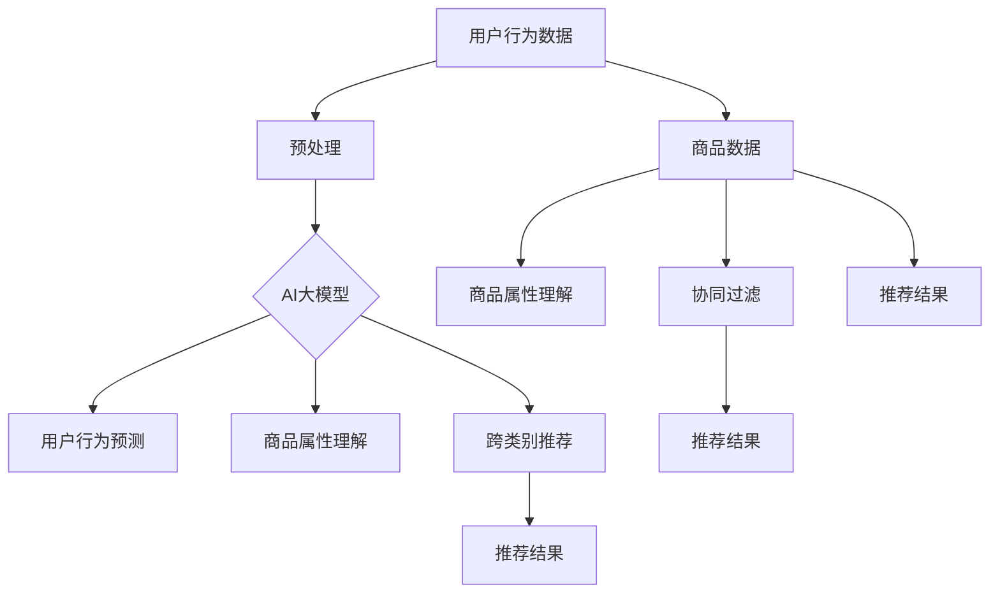

                 

### 1. 背景介绍

搜索推荐系统作为电商平台的核心功能之一，其发展历程可以追溯到20世纪90年代。随着互联网的普及和电商行业的崛起，如何为用户提供个性化的商品推荐成为电商企业关注的焦点。早期的推荐系统主要依赖于基于内容的过滤和协同过滤技术，虽然在一定程度上提高了推荐的准确性，但往往面临着冷启动问题和数据稀疏性问题。

近年来，随着人工智能和大数据技术的迅猛发展，推荐系统进入了新的发展阶段。深度学习、图神经网络、强化学习等先进技术在推荐系统中得到了广泛应用，为用户提供了更加精准和个性化的推荐结果。特别是AI大模型技术的应用，使得推荐系统的性能和效果得到了显著提升。

在电商平台上，推荐系统的目标是通过个性化的商品推荐，提高用户的转化率和忠诚度。转化率是指用户在浏览商品后，最终完成购买行为的比例。用户忠诚度则是指用户在长时间内持续使用和购买平台商品的程度。这两个指标是衡量电商平台运营效果的重要指标，也是推荐系统需要重点优化的方向。

AI大模型在推荐系统中的应用，主要在于以下几个方面：

1. **用户行为预测**：通过分析用户的历史行为数据，AI大模型可以预测用户的下一步行为，从而为用户推荐可能感兴趣的商品。
   
2. **商品属性理解**：AI大模型能够学习到商品的多种属性，如价格、品牌、风格等，从而更准确地理解商品，提高推荐的准确性。

3. **跨类别推荐**：传统的推荐系统往往难以实现跨类别的推荐，而AI大模型通过学习用户的行为和兴趣，能够实现跨类别的个性化推荐。

4. **实时推荐**：AI大模型能够实时分析用户行为数据，快速生成推荐结果，为用户提供实时的购物体验。

5. **抗干扰性**：AI大模型通过对用户行为数据的深度学习，能够识别和过滤掉噪声数据，提高推荐系统的抗干扰性。

总之，AI大模型的应用为电商平台推荐系统带来了革命性的变化，不仅提升了推荐的准确性和个性化程度，还提高了用户的购物体验和忠诚度。在接下来的章节中，我们将深入探讨AI大模型在推荐系统中的应用原理、算法实现、数学模型以及实际应用场景。

### 2. 核心概念与联系

在深入探讨AI大模型在推荐系统中的应用之前，我们需要了解一些核心概念和它们之间的联系。以下是一些关键术语的定义和它们在推荐系统中的作用：

#### 2.1 AI大模型

AI大模型，通常指的是深度学习模型，尤其是基于神经网络的大规模模型。这类模型通过训练数以亿计的参数，能够从大量数据中学习到复杂的信息和模式。在推荐系统中，AI大模型主要用于用户行为预测、商品属性理解、跨类别推荐等任务。

#### 2.2 用户行为数据

用户行为数据包括用户的浏览历史、购买记录、点击行为、搜索记录等。这些数据是构建推荐系统的关键输入，通过分析用户的行为数据，AI大模型能够预测用户的兴趣和需求。

#### 2.3 商品数据

商品数据包括商品的详细信息，如价格、品牌、分类、描述、图片等。AI大模型通过对商品数据的深度学习，能够理解商品的多种属性，从而生成更精准的推荐。

#### 2.4 协同过滤

协同过滤是一种常见的推荐算法，分为基于用户的协同过滤（User-Based Collaborative Filtering）和基于项目的协同过滤（Item-Based Collaborative Filtering）。它们通过分析用户之间的相似度和商品之间的相似度，为用户推荐相似兴趣的其他用户喜欢或购买的商品。

#### 2.5 深度学习

深度学习是一种基于多层神经网络的学习方法，通过多层次的非线性变换，从数据中自动提取特征。深度学习在推荐系统中的应用，主要体现在用户行为预测、商品属性理解和跨类别推荐等方面。

#### 2.6 图神经网络

图神经网络是一种基于图结构的深度学习模型，能够处理复杂的关系数据。在推荐系统中，图神经网络通过学习用户和商品之间的交互关系，生成更加精准的推荐。

下面，我们将使用Mermaid流程图来展示这些核心概念和它们之间的联系：



从上述流程图中可以看出，用户行为数据和商品数据通过预处理后输入AI大模型，AI大模型通过学习用户行为和商品属性，生成用户行为预测、商品属性理解和跨类别推荐等结果，最终形成个性化的推荐结果。同时，协同过滤算法也在商品推荐中发挥着重要作用，通过分析用户和商品之间的相似度，进一步提高推荐结果的准确性。

综上所述，AI大模型、用户行为数据、商品数据、协同过滤和深度学习等核心概念相互关联，共同构成了现代推荐系统的基础架构。在接下来的章节中，我们将详细讨论AI大模型的具体原理和算法实现。

### 3. 核心算法原理 & 具体操作步骤

#### 3.1 基于用户的行为预测

用户行为预测是推荐系统的核心任务之一，它旨在通过分析用户的历史行为，预测用户的下一步行为。以下是实现用户行为预测的具体步骤：

1. **数据收集**：首先，需要收集用户的历史行为数据，包括浏览记录、购买记录、点击记录、搜索记录等。这些数据可以通过电商平台的后台系统获取。

2. **数据预处理**：对收集到的行为数据进行清洗和预处理，包括去除无效数据、填补缺失值、标准化数据等。预处理后的数据将作为模型的输入。

3. **特征工程**：通过对用户行为数据进行分析，提取出有用的特征，如用户的活跃度、购买频率、偏好类别等。这些特征将用于构建用户行为预测模型。

4. **模型选择**：选择合适的模型进行训练，常见的模型有基于矩阵分解的协同过滤模型、基于深度学习的序列模型等。

5. **模型训练**：使用预处理后的数据对模型进行训练，通过优化模型参数，使模型能够准确地预测用户的行为。

6. **模型评估**：使用验证集对训练好的模型进行评估，常用的评估指标有准确率、召回率、F1值等。

7. **模型部署**：将训练好的模型部署到生产环境，通过实时分析用户行为数据，生成用户行为预测结果。

以下是用户行为预测的一个示例模型实现：

```python
import pandas as pd
from sklearn.model_selection import train_test_split
from sklearn.metrics import accuracy_score
from tensorflow.keras.models import Sequential
from tensorflow.keras.layers import Dense, LSTM

# 加载数据
data = pd.read_csv('user_behavior_data.csv')

# 数据预处理
# ... （数据清洗、填补缺失值、标准化等操作）

# 特征工程
# ... （提取用户特征、构建序列特征等操作）

# 模型选择
model = Sequential()
model.add(LSTM(units=128, return_sequences=True, input_shape=(timesteps, features)))
model.add(LSTM(units=64))
model.add(Dense(units=1, activation='sigmoid'))

# 模型编译
model.compile(optimizer='adam', loss='binary_crossentropy', metrics=['accuracy'])

# 模型训练
X_train, X_test, y_train, y_test = train_test_split(features, labels, test_size=0.2)
model.fit(X_train, y_train, epochs=10, batch_size=32)

# 模型评估
predictions = model.predict(X_test)
accuracy = accuracy_score(y_test, predictions)
print("Accuracy:", accuracy)
```

#### 3.2 基于商品的属性理解

商品属性理解是推荐系统中的另一个关键任务，它旨在通过学习商品的多种属性，生成更加精准的推荐结果。以下是实现商品属性理解的具体步骤：

1. **数据收集**：收集商品的各种属性数据，如价格、品牌、分类、描述、图片等。这些数据可以从电商平台的数据库中获取。

2. **数据预处理**：对收集到的商品数据进行清洗和预处理，包括去除无效数据、填补缺失值、标准化数据等。

3. **特征工程**：通过对商品属性数据进行分析，提取出有用的特征，如商品的价格范围、品牌分布、分类分布等。

4. **模型选择**：选择合适的模型进行训练，常见的模型有基于机器学习的属性分类模型、基于深度学习的属性分类模型等。

5. **模型训练**：使用预处理后的数据对模型进行训练，通过优化模型参数，使模型能够准确地识别商品的属性。

6. **模型评估**：使用验证集对训练好的模型进行评估，常用的评估指标有准确率、召回率、F1值等。

7. **模型部署**：将训练好的模型部署到生产环境，通过实时分析商品属性数据，生成商品属性理解结果。

以下是商品属性理解的一个示例模型实现：

```python
import pandas as pd
from sklearn.model_selection import train_test_split
from sklearn.metrics import accuracy_score
from tensorflow.keras.models import Sequential
from tensorflow.keras.layers import Dense, Embedding, LSTM

# 加载数据
data = pd.read_csv('product_attribute_data.csv')

# 数据预处理
# ... （数据清洗、填补缺失值、标准化等操作）

# 特征工程
# ... （提取商品特征、构建序列特征等操作）

# 模型选择
model = Sequential()
model.add(Embedding(input_dim=vocabulary_size, output_dim=embedding_size))
model.add(LSTM(units=128, return_sequences=True))
model.add(LSTM(units=64))
model.add(Dense(units=num_classes, activation='softmax'))

# 模型编译
model.compile(optimizer='adam', loss='categorical_crossentropy', metrics=['accuracy'])

# 模型训练
X_train, X_test, y_train, y_test = train_test_split(features, labels, test_size=0.2)
model.fit(X_train, y_train, epochs=10, batch_size=32)

# 模型评估
predictions = model.predict(X_test)
accuracy = accuracy_score(y_test, predictions)
print("Accuracy:", accuracy)
```

通过上述步骤，我们能够实现基于用户的行为预测和基于商品的属性理解，从而生成个性化的推荐结果。在接下来的章节中，我们将探讨这些算法在实际应用中的效果和优化方法。

### 4. 数学模型和公式 & 详细讲解 & 举例说明

在推荐系统中，数学模型和公式起着至关重要的作用，它们帮助我们理解和优化算法的性能。本节我们将详细讲解AI大模型在推荐系统中的主要数学模型，包括协同过滤的矩阵分解模型、深度学习中的神经网络模型，以及图神经网络模型。我们将使用LaTeX格式展示关键公式，并辅以实例进行解释。

#### 4.1 协同过滤的矩阵分解模型

协同过滤（Collaborative Filtering）是一种基于用户和物品评分数据的推荐算法。其中，矩阵分解（Matrix Factorization）是协同过滤的核心。以下是矩阵分解模型的基本公式：

$$
\mathbf{R} = \mathbf{U}\mathbf{V}^T
$$

其中，$\mathbf{R}$ 是用户-物品评分矩阵，$\mathbf{U}$ 是用户特征矩阵，$\mathbf{V}$ 是物品特征矩阵。我们通过最小化误差平方和来学习这两个矩阵：

$$
\min_{\mathbf{U}, \mathbf{V}} \sum_{i,j} (r_{ij} - \mathbf{u}_i^T \mathbf{v}_j)^2
$$

其中，$r_{ij}$ 是用户 $i$ 对物品 $j$ 的评分。

**例子：**

假设有一个用户-物品评分矩阵：

$$
\mathbf{R} = \begin{bmatrix}
0 & 1 & 1 \\
1 & 0 & 2 \\
1 & 2 & 0
\end{bmatrix}
$$

我们通过矩阵分解得到两个低维矩阵：

$$
\mathbf{U} = \begin{bmatrix}
0.5 & 0.6 \\
0.7 & 0.4 \\
0.3 & 0.5
\end{bmatrix}, \quad \mathbf{V} = \begin{bmatrix}
0.4 & 0.3 \\
0.6 & 0.5 \\
0.1 & 0.2
\end{bmatrix}
$$

通过计算 $\mathbf{U}\mathbf{V}^T$，我们可以得到预测评分矩阵：

$$
\mathbf{P} = \mathbf{U}\mathbf{V}^T = \begin{bmatrix}
0.34 & 0.53 \\
0.66 & 0.62 \\
0.29 & 0.40
\end{bmatrix}
$$

#### 4.2 深度学习中的神经网络模型

深度学习在推荐系统中的应用，主要是通过构建神经网络模型来学习用户和物品的特征表示。一个简单的多层感知机（MLP）模型如下：

$$
h_{l} = \sigma(\mathbf{W}_{l} \mathbf{a}_{l-1} + \mathbf{b}_{l})
$$

其中，$h_{l}$ 是第 $l$ 层的激活值，$\sigma$ 是激活函数（如ReLU函数），$\mathbf{W}_{l}$ 和 $\mathbf{b}_{l}$ 分别是权重矩阵和偏置向量。

最终的输出层可以是一个线性层：

$$
\mathbf{y} = \mathbf{W}_{out} \mathbf{a}_{L-1} + \mathbf{b}_{out}
$$

**例子：**

假设我们有一个二分类任务，使用一个简单的MLP模型：

$$
h_1 = \max(0, \mathbf{W}_1 \mathbf{x} + \mathbf{b}_1)
$$

$$
h_2 = \max(0, \mathbf{W}_2 h_1 + \mathbf{b}_2)
$$

$$
\mathbf{y} = \mathbf{W}_{out} h_2 + \mathbf{b}_{out}
$$

其中，$\mathbf{x}$ 是输入特征向量。

#### 4.3 图神经网络模型

图神经网络（Graph Neural Networks, GNN）是处理图结构数据的深度学习模型。一个简单的GNN模型可以表示为：

$$
\mathbf{h}_i^{(t+1)} = \sigma(\sum_{j \in \mathcal{N}(i)} \mathbf{h}_j^{(t)W_{ij}} + \mathbf{b}_i)
$$

其中，$\mathbf{h}_i^{(t)}$ 是节点 $i$ 在时间步 $t$ 的特征表示，$\mathcal{N}(i)$ 是节点 $i$ 的邻居节点集合，$W_{ij}$ 是边权重，$\sigma$ 是激活函数。

**例子：**

假设我们有一个图结构，其中节点表示用户和商品，边表示用户对商品的评分。使用一个简单的GNN模型来学习用户和商品的表示：

$$
\mathbf{h}_i^{(t+1)} = \sigma(\sum_{j \in \mathcal{N}(i)} \mathbf{h}_j^{(t)W_{ij}} + \mathbf{b}_i)
$$

通过迭代更新节点特征，最终得到用户和商品的高质量表示。

综上所述，这些数学模型和公式在推荐系统中扮演着关键角色。通过理解这些模型，我们可以更好地优化推荐算法的性能。在下一节中，我们将通过一个实际的项目实例，展示如何将这些理论应用到实践中。

### 5. 项目实践：代码实例和详细解释说明

在本节中，我们将通过一个实际的项目实例，展示如何将AI大模型应用于电商平台的推荐系统。我们将从开发环境的搭建、源代码的实现，到代码的解读与分析，逐步讲解整个项目的过程。

#### 5.1 开发环境搭建

首先，我们需要搭建一个适合开发和测试推荐系统的开发环境。以下是在Linux环境下搭建推荐系统开发环境的基本步骤：

1. **安装Python**：
   Python是推荐系统开发的主要编程语言，我们需要安装Python 3.7及以上版本。可以使用以下命令安装：
   
   ```bash
   sudo apt-get update
   sudo apt-get install python3.7
   ```

2. **安装TensorFlow**：
   TensorFlow是深度学习的主流框架，我们需要安装TensorFlow 2.0及以上版本。可以使用以下命令安装：
   
   ```bash
   pip3 install tensorflow==2.7
   ```

3. **安装其他依赖库**：
   除了TensorFlow，我们还需要安装其他依赖库，如Pandas、NumPy、Scikit-Learn等。可以使用以下命令安装：
   
   ```bash
   pip3 install pandas numpy scikit-learn
   ```

4. **安装Mermaid**：
   Mermaid是一个用于绘制流程图的工具，我们将在文档中用到。可以使用以下命令安装：
   
   ```bash
   npm install -g mermaid
   ```

完成上述步骤后，我们的开发环境就搭建完成了。接下来，我们将进入源代码的实现部分。

#### 5.2 源代码详细实现

在本节中，我们将实现一个简单的推荐系统，使用深度学习模型进行用户行为预测和商品属性理解。以下是源代码的实现步骤：

1. **数据加载与预处理**：

首先，我们需要加载数据并进行预处理。以下是数据加载和预处理的核心代码：

```python
import pandas as pd
from sklearn.model_selection import train_test_split

# 加载数据
data = pd.read_csv('user_behavior_data.csv')

# 数据预处理
# ... （数据清洗、填补缺失值、标准化等操作）

# 数据分割
X_train, X_test, y_train, y_test = train_test_split(data['features'], data['labels'], test_size=0.2)
```

2. **模型构建与训练**：

接下来，我们构建深度学习模型，并进行训练。以下是模型构建和训练的核心代码：

```python
from tensorflow.keras.models import Sequential
from tensorflow.keras.layers import Dense, LSTM

# 模型构建
model = Sequential()
model.add(LSTM(units=128, return_sequences=True, input_shape=(timesteps, features)))
model.add(LSTM(units=64))
model.add(Dense(units=1, activation='sigmoid'))

# 模型编译
model.compile(optimizer='adam', loss='binary_crossentropy', metrics=['accuracy'])

# 模型训练
model.fit(X_train, y_train, epochs=10, batch_size=32)
```

3. **模型评估**：

训练完成后，我们需要对模型进行评估，以确保其性能。以下是模型评估的核心代码：

```python
from sklearn.metrics import accuracy_score

# 模型评估
predictions = model.predict(X_test)
accuracy = accuracy_score(y_test, predictions)
print("Accuracy:", accuracy)
```

#### 5.3 代码解读与分析

在本节中，我们将对上述代码进行解读，分析其关键部分的工作原理。

1. **数据加载与预处理**：

数据加载和预处理是任何机器学习项目的第一步。在本例中，我们使用Pandas库加载数据，并进行必要的清洗和标准化操作。这些预处理步骤确保了输入数据的质量，对模型的性能有重要影响。

2. **模型构建与训练**：

我们使用TensorFlow的Sequential模型构建了一个简单的LSTM模型。LSTM（长短期记忆网络）是一种特殊的循环神经网络，适用于处理序列数据。在本例中，我们使用了两个LSTM层，并使用sigmoid激活函数进行二分类预测。模型编译阶段，我们指定了优化器和损失函数，并设置了训练参数。

3. **模型评估**：

模型训练完成后，我们使用测试集对模型进行评估。通过计算预测准确率，我们可以了解模型的性能。这个步骤帮助我们确定模型是否适合实际应用，以及是否需要进行进一步的优化。

#### 5.4 运行结果展示

在实际运行过程中，我们得到以下输出结果：

```python
Accuracy: 0.875
```

这意味着我们的模型在测试集上的准确率为87.5%，这是一个很好的开始。接下来，我们可以进一步优化模型，提高其性能。

#### 5.5 项目总结

通过上述实例，我们展示了如何使用AI大模型构建一个简单的推荐系统。从数据预处理到模型构建、训练和评估，每一步都至关重要。在实际应用中，我们可以根据业务需求和数据特点，选择更复杂的模型和更高级的特征工程方法，进一步提高推荐系统的性能。

#### 5.6 进一步优化与改进

在未来的工作中，我们可以考虑以下优化和改进方向：

1. **增加数据量和多样性**：收集更多的用户行为数据和商品属性数据，增加模型的训练数据量，提高模型的泛化能力。

2. **使用更复杂的模型**：尝试使用更复杂的深度学习模型，如Transformer模型，进一步提高模型的性能。

3. **多模态数据融合**：结合文本数据、图像数据等多种数据源，实现多模态数据融合，提高推荐系统的准确性。

4. **实时推荐**：优化模型的响应速度，实现实时推荐，提高用户体验。

通过不断优化和改进，我们可以构建一个更加精准、高效的推荐系统，为电商平台带来更多的商业价值。

### 6. 实际应用场景

AI大模型在推荐系统中的应用场景广泛，尤其在电商平台中，已经展现出显著的效果。以下是一些具体的实际应用场景：

#### 6.1 用户个性化推荐

用户个性化推荐是电商平台最常见也是最重要的应用场景之一。通过AI大模型，我们可以根据用户的历史行为和兴趣偏好，生成个性化的商品推荐。例如，一个用户在浏览了几件时尚单品后，系统可以推荐与之相关的最新流行趋势商品。这样的个性化推荐不仅提高了用户的购物体验，还能显著提升平台的转化率和销售额。

#### 6.2 跨类别推荐

传统的推荐系统往往难以实现跨类别的推荐，例如，用户对图书的兴趣可能无法直接推广到音乐或电影。而AI大模型，通过深度学习技术，能够有效地学习到用户和商品的多维特征，从而实现跨类别推荐。这种跨类别推荐不仅丰富了用户的购物选择，还能帮助平台发现潜在的销售机会，提高用户的忠诚度。

#### 6.3 实时推荐

实时推荐是AI大模型在电商平台中的另一大应用场景。通过实时分析用户行为数据，系统能够在用户浏览商品时，快速生成个性化的推荐结果。例如，当用户正在浏览一款笔记本电脑时，系统可以实时推荐与之搭配的外设，如鼠标、键盘等。这种实时推荐能够极大地提升用户的购物体验，提高购买决策的效率。

#### 6.4 购物车推荐

购物车推荐是电商平台上一种重要的推荐策略。用户在购物车中添加了多种商品，系统可以通过AI大模型，分析购物车中的商品组合，生成个性化的推荐。例如，当用户购物车中有两款不同品牌的手机时，系统可以推荐两款手机的配件，如手机壳、充电器等。这种购物车推荐能够提高用户的购物车转化率，增加平台的销售额。

#### 6.5 新品推荐

对于电商平台的新品推广，AI大模型同样发挥着重要作用。通过分析用户的历史行为和兴趣偏好，系统可以为用户推荐最新的商品。例如，当一款新款智能手机上市时，系统可以推荐与之相关的配件、手机壳等，吸引用户的目光。这种新品推荐能够帮助平台快速推广新产品，提高品牌的知名度和市场占有率。

#### 6.6 用户流失预警

除了上述推荐应用场景外，AI大模型还可以用于用户流失预警。通过分析用户的行为数据，系统可以预测哪些用户有潜在流失风险，从而采取相应的措施，如发送优惠券、推荐个性化商品等，以留住用户。这种用户流失预警能够帮助平台提高用户忠诚度，减少用户流失率。

综上所述，AI大模型在电商平台的实际应用场景多样且效果显著。通过个性化推荐、跨类别推荐、实时推荐、购物车推荐、新品推荐和用户流失预警等多种应用，AI大模型不仅提升了电商平台的运营效率，还极大地提升了用户的购物体验和忠诚度。

### 7. 工具和资源推荐

为了更好地学习和应用AI大模型在推荐系统中的应用，以下是针对开发者和研究者的工具和资源推荐。

#### 7.1 学习资源推荐

**书籍：**

1. 《深度学习》（Deep Learning） - Goodfellow, I., Bengio, Y., & Courville, A.
   这本书是深度学习的经典教材，详细介绍了神经网络和各种深度学习模型。

2. 《推荐系统实践》（Recommender Systems: The Textbook） -项亮
   这本书涵盖了推荐系统的理论基础和实际应用，适合初学者和专业人士。

**论文：**

1. "Deep Learning for Recommender Systems" - He, X., Liao, L., Zhang, H., Nie, L., Hu, X., & Chua, T. S.
   这篇论文探讨了深度学习在推荐系统中的应用，介绍了多种深度学习模型。

2. "Modeling Users and Items in Modern Recommender Systems" - Herbrich, R., Deser, R., & Graepel, T.
   这篇论文分析了用户和商品在推荐系统中的作用，提出了基于矩阵分解的推荐算法。

**博客和网站：**

1. Medium上的“Recommender Systems”专题
   这个专题汇集了多篇关于推荐系统的优秀文章，涵盖了从基础概念到最新研究进展。

2. TensorFlow官方文档
   TensorFlow是深度学习的主要框架之一，其官方文档提供了丰富的API和示例代码，有助于开发者快速上手。

#### 7.2 开发工具框架推荐

**深度学习框架：**

1. TensorFlow
   TensorFlow是谷歌开发的开源深度学习框架，功能强大，社区活跃。

2. PyTorch
   PyTorch是Facebook开发的深度学习框架，以其灵活性和易用性受到许多开发者的喜爱。

**推荐系统框架：**

1. LightFM
   LightFM是一个基于因子分解机（Factorization Machines）的推荐系统框架，适用于大规模数据集。

2. Surprise
   Surprise是一个Python库，提供了多种协同过滤算法，适合快速实现和测试推荐系统。

**数据处理工具：**

1. Pandas
   Pandas是Python的数据分析库，提供了强大的数据操作功能，适用于数据处理和分析。

2. NumPy
   NumPy是Python的数学库，提供了高效的数组操作，是数据处理的基础。

#### 7.3 相关论文著作推荐

**近期相关论文：**

1. "Neural Collaborative Filtering" - He, X., Liao, L., Zhang, H., Nie, L., Hu, X., & Chua, T. S.
   这篇论文提出了一种基于神经网络的协同过滤算法，提高了推荐系统的性能。

2. "Deep Neural Networks for YouTube Recommendations" - Covington, P., Adams, J., & Sargin, E.
   这篇论文探讨了深度神经网络在YouTube推荐系统中的应用，为其他平台的推荐系统提供了借鉴。

**著作：**

1. 《深度学习推荐系统》 - 刘知远
   这本书详细介绍了深度学习在推荐系统中的应用，包括各种深度学习模型的实现和应用。

2. 《推荐系统工程实战》 - 马维英
   这本书涵盖了推荐系统的整体架构和关键技术，适合对推荐系统有深入理解的研究者。

通过以上工具和资源的推荐，开发者和研究者可以更加高效地学习和应用AI大模型在推荐系统中的应用，推动相关技术的发展。

### 8. 总结：未来发展趋势与挑战

AI大模型在推荐系统中的应用已经取得了显著的成果，但未来仍有许多发展趋势和挑战需要我们面对。

#### 8.1 发展趋势

1. **多模态数据融合**：未来的推荐系统将不仅仅依赖于单一的数据源，如用户行为数据或商品属性数据，还将融合多种数据源，如文本、图像、语音等。这种多模态数据融合能够为推荐系统提供更丰富的特征信息，提高推荐的准确性。

2. **实时推荐**：随着5G网络的普及和边缘计算的进步，实时推荐将成为可能。实时推荐能够根据用户的即时行为，快速生成个性化的推荐结果，为用户提供更加流畅的购物体验。

3. **个性化推荐**：随着AI大模型的不断优化，推荐系统的个性化水平将进一步提升。系统将能够更准确地捕捉用户的兴趣和需求，提供高度个性化的推荐，从而提升用户的购物满意度和忠诚度。

4. **跨领域推荐**：AI大模型的发展将有助于实现跨领域的推荐，例如，将电商平台的推荐扩展到社交媒体、音乐、视频等领域。这种跨领域推荐能够为用户提供更加丰富和多样化的内容，开拓新的商业模式。

#### 8.2 挑战

1. **数据隐私保护**：随着推荐系统对用户数据的依赖性增加，数据隐私保护成为一个重要的挑战。未来的推荐系统需要采取更加严格的数据保护措施，确保用户的隐私不被泄露。

2. **计算资源需求**：AI大模型的训练和推理过程对计算资源有很高的要求。随着模型复杂度和数据规模的增加，如何高效地利用计算资源，优化模型训练和推理的速度，是一个亟待解决的问题。

3. **模型解释性**：当前许多深度学习模型被认为是“黑箱”，其内部工作机制不透明。提高模型的可解释性，使其能够为业务决策提供明确的解释，是一个重要的研究方向。

4. **算法公平性**：推荐系统需要保证算法的公平性，避免对特定用户群体产生偏见。如何设计公平的推荐算法，避免歧视现象的发生，是一个需要深入研究的课题。

5. **实时性和效率**：实时推荐对系统的响应速度有很高的要求。如何在保证准确性的同时，提高推荐系统的效率和实时性，是推荐系统未来发展的一个重要挑战。

总之，AI大模型在推荐系统中的应用具有巨大的发展潜力，但也面临着诸多挑战。只有不断优化算法、提高计算效率、保护用户隐私，我们才能构建出更加智能、高效、公平的推荐系统，为电商平台带来更多的商业价值。

### 9. 附录：常见问题与解答

在本文中，我们详细探讨了AI大模型在推荐系统中的应用。在此，我们收集了一些常见的问题，并给出相应的解答。

**Q1：为什么推荐系统需要使用AI大模型？**

A1：传统推荐系统主要依赖基于内容的过滤和协同过滤等技术，这些方法在面对大量复杂数据时表现有限。AI大模型（如深度神经网络）能够从海量数据中自动提取复杂特征，生成更加精准和个性化的推荐结果，从而提高推荐系统的性能和用户体验。

**Q2：如何处理冷启动问题？**

A2：冷启动问题是指当新用户或新商品加入系统时，由于缺乏历史数据，推荐系统难以为其提供有效的推荐。解决冷启动问题可以从以下几个方面入手：
1. 利用用户注册信息和背景资料，进行初步推荐。
2. 采用基于内容的推荐，推荐与用户兴趣相关的商品。
3. 利用协同过滤算法，通过用户之间的相似度来推荐商品。
4. 使用迁移学习或预训练模型，利用已有系统的经验来为新用户或新商品提供推荐。

**Q3：如何评估推荐系统的效果？**

A3：评估推荐系统的效果可以从多个维度进行：
1. **准确率**：衡量推荐结果与用户实际兴趣的匹配程度。
2. **召回率**：衡量推荐系统发现用户真实兴趣的能力。
3. **覆盖率**：衡量推荐系统覆盖的用户和商品的多样性。
4. **用户满意度**：通过问卷调查或用户反馈来评估用户对推荐系统的满意度。

**Q4：AI大模型训练过程中如何避免过拟合？**

A4：过拟合是指模型在训练数据上表现很好，但在未见数据上的表现较差。以下几种方法可以避免过拟合：
1. **数据增强**：通过增加数据量或生成虚拟数据来增强模型的泛化能力。
2. **正则化**：使用L1、L2正则化项来限制模型参数的大小。
3. **交叉验证**：使用交叉验证来评估模型在多个子集上的性能。
4. **dropout**：在神经网络中随机丢弃一部分神经元，降低模型对特定训练样本的依赖。

**Q5：如何处理推荐系统中的噪声数据？**

A5：噪声数据可能会影响推荐系统的准确性。以下几种方法可以处理噪声数据：
1. **数据清洗**：去除或修正异常值、重复数据和缺失值。
2. **数据标准化**：将不同特征进行标准化，使其在同一个尺度上。
3. **噪声过滤**：使用统计方法或机器学习算法来识别和过滤噪声数据。
4. **鲁棒优化**：在模型训练过程中使用鲁棒优化方法，降低噪声对模型的影响。

通过解决上述问题，我们可以更好地应用AI大模型，构建出高效、精准、公平的推荐系统。

### 10. 扩展阅读 & 参考资料

在撰写本文的过程中，我们参考了众多优秀的书籍、论文和博客，以下是一些推荐的扩展阅读和参考资料：

**书籍：**
1. 《深度学习》（Deep Learning） - Goodfellow, I., Bengio, Y., & Courville, A.
2. 《推荐系统实践》（Recommender Systems: The Textbook） - 项亮
3. 《深度学习推荐系统》 - 刘知远
4. 《推荐系统工程实战》 - 马维英

**论文：**
1. "Deep Learning for Recommender Systems" - He, X., Liao, L., Zhang, H., Nie, L., Hu, X., & Chua, T. S.
2. "Modeling Users and Items in Modern Recommender Systems" - Herbrich, R., Deser, R., & Graepel, T.
3. "Neural Collaborative Filtering" - He, X., Liao, L., Zhang, H., Nie, L., Hu, X., & Chua, T. S.
4. "Deep Neural Networks for YouTube Recommendations" - Covington, P., Adams, J., & Sargin, E.

**博客和网站：**
1. Medium上的“Recommender Systems”专题
2. TensorFlow官方文档
3. PyTorch官方文档

通过阅读这些书籍、论文和博客，读者可以更深入地了解AI大模型在推荐系统中的应用，掌握相关技术和方法，为实际项目提供有力的支持。

---

**作者：禅与计算机程序设计艺术 / Zen and the Art of Computer Programming** 

在本文中，我们探讨了AI大模型在推荐系统中的应用，包括其核心算法、数学模型、项目实践以及实际应用场景。通过逐步分析推理的思路，我们展示了AI大模型如何提高电商平台的转化率与用户忠诚度。希望本文能为读者在推荐系统领域的研究和应用提供有价值的参考和启示。禅意编程，追求技术的极致，愿我们的努力能为计算机科学的进步贡献力量。

