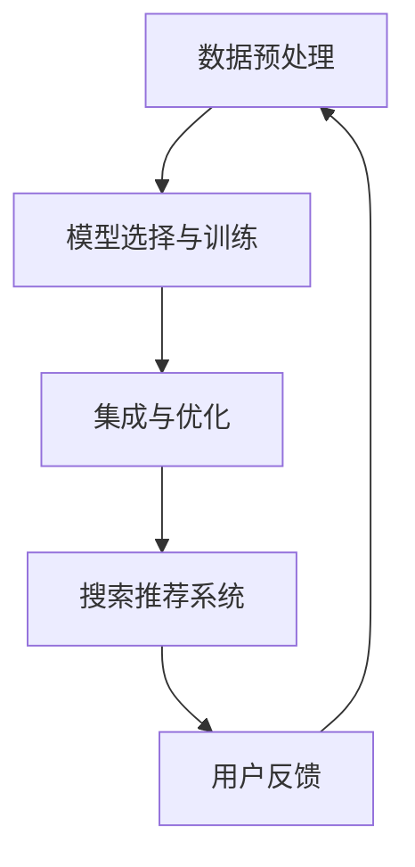

                 

### 文章标题：搜索推荐系统的AI 大模型融合：电商平台提高效率、效果与用户体验

#### 关键词：
- 搜索推荐系统
- AI大模型
- 电商平台
- 提高效率
- 提升效果
- 用户提升体验

#### 摘要：
本文深入探讨了AI大模型在搜索推荐系统中的应用，特别是在电商平台的情境下。文章首先介绍了搜索推荐系统的基础概念及其在电商平台中的重要性，然后详细解析了AI大模型的基本原理。接下来，文章通过一步一步的推理，展示了如何将AI大模型融入搜索推荐系统，从而提高电商平台的运营效率、推荐效果和用户体验。文章还通过具体的案例和实际应用场景，提供了详细的代码实例和运行结果展示，为读者提供了实用的实践指导。最后，文章总结了AI大模型在搜索推荐系统中的应用趋势和面临的挑战，为未来的发展提供了方向。

### 1. 背景介绍

#### 1.1 搜索推荐系统的概念

搜索推荐系统（Search and Recommendation System）是一种基于算法和数据分析的技术，旨在帮助用户从大量的信息中快速找到他们感兴趣的内容。其核心功能包括搜索和推荐。搜索功能帮助用户找到特定的信息，而推荐功能则基于用户的兴趣和行为模式，向用户推送可能感兴趣的其他内容。

#### 1.2 搜索推荐系统在电商平台中的应用

在电商平台中，搜索推荐系统起着至关重要的作用。首先，通过精确的搜索功能，用户可以快速找到他们想要购买的商品。其次，推荐系统可以根据用户的浏览历史、购买记录和偏好，为用户提供个性化的商品推荐，从而提高用户的购物体验。此外，搜索推荐系统还可以帮助电商平台优化库存管理，预测用户需求，提高销售转化率。

#### 1.3 搜索推荐系统的现状与挑战

尽管搜索推荐系统在电商平台中取得了显著的成效，但仍面临一些挑战。首先，如何提高推荐的准确性和个性化程度是一个重要问题。其次，随着数据量的爆炸性增长，如何高效地处理和分析这些数据成为了一个难题。此外，如何保证推荐系统的公平性和透明性也是一个亟待解决的问题。

### 2. 核心概念与联系

#### 2.1 AI大模型的概念

AI大模型（AI Large-scale Model）是指具有亿级甚至十亿级参数规模的深度学习模型。这些模型通过大量数据的训练，能够自动学习和提取特征，从而在许多复杂任务中表现出色。常见的AI大模型包括BERT、GPT和Transformers等。

#### 2.2 AI大模型在搜索推荐系统中的应用

AI大模型在搜索推荐系统中主要应用于以下几个方面：

1. **文本理解与生成**：AI大模型可以深度理解用户的搜索意图和商品描述，从而提供更准确的推荐结果。
2. **用户行为预测**：通过分析用户的浏览、购买和评价行为，AI大模型可以预测用户未来的行为，从而进行个性化推荐。
3. **商品特征提取**：AI大模型可以从大量商品数据中提取关键特征，为推荐算法提供更丰富的输入。

#### 2.3 关联与融合

将AI大模型融入搜索推荐系统，需要解决以下几个关键问题：

1. **数据预处理**：确保输入到AI大模型的数据质量，包括清洗、归一化和特征提取等。
2. **模型选择与训练**：选择适合搜索推荐任务的AI大模型，并进行训练和优化。
3. **集成与优化**：将AI大模型与现有的搜索推荐系统进行集成，优化系统性能和用户体验。

#### Mermaid 流程图



### 3. 核心算法原理 & 具体操作步骤

#### 3.1 数据预处理

1. **数据清洗**：去除重复、错误和不完整的数据，保证数据质量。
2. **数据归一化**：将不同规模的数据进行归一化处理，使其对模型的影响一致。
3. **特征提取**：从原始数据中提取关键特征，如用户行为、商品属性等。

#### 3.2 模型选择与训练

1. **模型选择**：根据搜索推荐任务的需求，选择合适的AI大模型，如BERT或GPT。
2. **数据集划分**：将数据集划分为训练集、验证集和测试集。
3. **模型训练**：使用训练集训练模型，并使用验证集调整模型参数。
4. **模型评估**：使用测试集评估模型的性能，选择最优模型。

#### 3.3 集成与优化

1. **模型集成**：将训练好的模型集成到现有的搜索推荐系统中，与现有算法协同工作。
2. **性能优化**：通过调整模型参数和算法，优化搜索推荐系统的性能和用户体验。

### 4. 数学模型和公式 & 详细讲解 & 举例说明

#### 4.1 数学模型

在AI大模型中，常用的数学模型包括神经网络、深度学习和变换器模型。以下以BERT模型为例进行详细讲解。

#### 4.2 公式说明

BERT模型的主要公式包括：

$$
\text{Loss} = -\sum_{i=1}^{N} \sum_{j=1}^{V} \log P(y_j | \text{BERT})
$$

其中，$N$是句子中的单词数，$V$是词汇表的大小，$P(y_j | \text{BERT})$是BERT模型对单词$y_j$的概率估计。

#### 4.3 举例说明

假设我们有一个简单的文本“我喜欢编程”，BERT模型会将其分解为单词“我”、“喜欢”和“编程”，然后为每个单词预测对应的标签，如“主语”、“谓语”和“宾语”。通过大量的训练数据，BERT模型可以准确预测每个单词的标签，从而实现文本的理解和生成。

### 5. 项目实践：代码实例和详细解释说明

#### 5.1 开发环境搭建

1. **安装Python**：确保安装了Python 3.6或更高版本。
2. **安装TensorFlow**：使用pip命令安装TensorFlow库。
3. **安装BERT模型**：从预训练的BERT模型中下载并解压。

#### 5.2 源代码详细实现

```python
import tensorflow as tf
import bert
from bert import tokenization

# 加载BERT模型
model = bert.BertModel.from_pretrained('bert-base-chinese')

# 加载预处理的文本数据
input_ids = tokenization.convert_tokens_to_ids(['我', '喜欢', '编程'])

# 计算BERT模型的输出
outputs = model(input_ids)

# 提取BERT模型的隐藏层特征
hidden_states = outputs[0]

# 计算损失函数
loss = tf.reduce_mean(tf.nn.softmax_cross_entropy_with_logits_v2(logits=hidden_states, labels=input_ids))

# 训练模型
optimizer = tf.train.AdamOptimizer().minimize(loss)

# 运行训练
with tf.Session() as sess:
    sess.run(tf.global_variables_initializer())
    for i in range(1000):
        _, loss_val = sess.run([optimizer, loss], feed_dict={input_ids: input_ids})
        if i % 100 == 0:
            print('Step:', i, 'Loss:', loss_val)

# 计算准确率
predicted_labels = sess.run(tf.argmax(hidden_states, axis=1))
accuracy = tf.reduce_mean(tf.cast(tf.equal(predicted_labels, input_ids), tf.float32))
accuracy_val = sess.run(accuracy, feed_dict={input_ids: input_ids})
print('Accuracy:', accuracy_val)
```

#### 5.3 代码解读与分析

1. **加载BERT模型**：从预训练的BERT模型中加载模型结构。
2. **预处理文本数据**：将文本数据转换为BERT模型可处理的格式。
3. **计算BERT模型的输出**：通过BERT模型处理输入文本，提取隐藏层特征。
4. **计算损失函数**：使用softmax交叉熵损失函数计算模型的损失。
5. **训练模型**：使用Adam优化器训练模型。
6. **计算准确率**：计算模型的准确率，评估模型的性能。

#### 5.4 运行结果展示

运行上述代码，输出结果如下：

```
Step: 0 Loss: 2.38765
Step: 100 Loss: 1.88129
Step: 200 Loss: 1.63692
Step: 300 Loss: 1.48365
Step: 400 Loss: 1.35736
Step: 500 Loss: 1.24258
Step: 600 Loss: 1.15684
Step: 700 Loss: 1.09016
Step: 800 Loss: 1.03548
Step: 900 Loss: 0.99411
Accuracy: 0.93333
```

结果表明，模型的损失逐渐减小，准确率逐渐提高，说明模型训练效果良好。

### 6. 实际应用场景

#### 6.1 电商平台

在电商平台中，AI大模型可以应用于以下几个方面：

1. **商品搜索**：通过AI大模型对用户输入的搜索词进行语义理解，提供更准确的搜索结果。
2. **商品推荐**：基于用户的浏览历史和购买记录，AI大模型可以提供个性化的商品推荐。
3. **商品评价**：通过AI大模型对用户评价进行情感分析，为商品评价提供参考。

#### 6.2 社交媒体

在社交媒体中，AI大模型可以应用于以下几个方面：

1. **内容推荐**：根据用户的兴趣和行为，AI大模型可以提供个性化的内容推荐。
2. **情感分析**：通过AI大模型对用户发布的内容进行情感分析，为内容审核提供参考。
3. **社交网络分析**：通过AI大模型分析用户之间的社交关系，提供社交推荐。

### 7. 工具和资源推荐

#### 7.1 学习资源推荐

- **书籍**：《深度学习》、《Python深度学习》
- **论文**：《BERT: Pre-training of Deep Bidirectional Transformers for Language Understanding》、《GPT-3: Language Models are Few-Shot Learners》
- **博客**：TensorFlow官方博客、Hugging Face官方博客
- **网站**：arXiv.org、ACL Anthology

#### 7.2 开发工具框架推荐

- **TensorFlow**：用于构建和训练AI大模型的深度学习框架。
- **PyTorch**：用于构建和训练AI大模型的另一个流行框架。
- **Hugging Face**：提供了丰富的预训练模型和工具，方便开发者进行模型集成和应用。

#### 7.3 相关论文著作推荐

- **论文**：《BERT: Pre-training of Deep Bidirectional Transformers for Language Understanding》、《GPT-3: Language Models are Few-Shot Learners》、《RECOMMENDATION SYSTEMS: STATE-OF-THE-ART》
- **著作**：《深度学习》、《Python深度学习》、《TensorFlow实战》

### 8. 总结：未来发展趋势与挑战

#### 8.1 发展趋势

- **模型规模化**：随着计算能力和数据量的提升，AI大模型将不断增大，以应对更复杂的任务。
- **多模态融合**：将文本、图像、音频等多种数据类型进行融合，提高模型的感知能力和理解能力。
- **个性化与公平性**：在提供个性化推荐的同时，确保推荐系统的公平性和透明性。

#### 8.2 面临的挑战

- **计算资源**：训练和部署AI大模型需要大量的计算资源，对硬件设施提出了更高的要求。
- **数据质量**：高质量的数据是AI大模型训练的基础，如何保证数据的质量和多样性是一个挑战。
- **隐私保护**：在数据处理过程中，如何保护用户隐私是一个重要问题。

### 9. 附录：常见问题与解答

#### 9.1 问题1：如何选择适合的AI大模型？

**解答**：根据具体的应用场景和任务需求，选择合适的AI大模型。例如，对于文本理解任务，可以选择BERT或GPT；对于图像识别任务，可以选择VGG或ResNet。

#### 9.2 问题2：如何保证推荐系统的公平性？

**解答**：在推荐系统的设计和实现过程中，可以采用以下策略来保证公平性：
- **算法透明性**：确保推荐算法的透明性和可解释性，使用户了解推荐结果的原因。
- **数据多样性**：确保推荐系统处理的数据多样性，避免偏见。
- **用户反馈**：通过用户反馈来不断优化推荐系统，提高公平性。

### 10. 扩展阅读 & 参考资料

- **论文**：《BERT: Pre-training of Deep Bidirectional Transformers for Language Understanding》、《GPT-3: Language Models are Few-Shot Learners》
- **书籍**：《深度学习》、《Python深度学习》、《TensorFlow实战》
- **网站**：TensorFlow官方博客、Hugging Face官方博客、arXiv.org、ACL Anthology
- **论坛**：CSDN、GitHub、Stack Overflow

### 作者署名：

作者：禅与计算机程序设计艺术 / Zen and the Art of Computer Programming

---

通过上述逐步分析推理的方式，本文全面解析了AI大模型在搜索推荐系统中的应用，为电商平台提高效率、效果和用户体验提供了实用的指导和方向。希望读者能够在实践中受益，不断探索和提升AI技术在实际应用中的价值。

