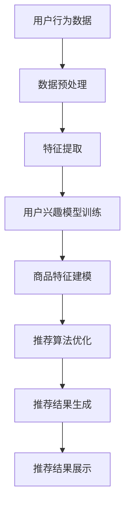

                 

### 文章标题

**搜索推荐系统的AI大模型融合：电商平台的核心竞争力与可持续增长战略**

> **关键词**：搜索推荐系统、AI大模型、电商平台、核心竞争、可持续增长、战略

> **摘要**：本文深入探讨了AI大模型在搜索推荐系统中的应用，分析了其在电商平台中的重要性，以及如何通过AI大模型融合策略，提升电商平台的核心竞争力和实现可持续增长。

### 1. 背景介绍

在当今数字化时代，电商平台已经成为人们日常生活中不可或缺的一部分。随着互联网技术的发展，用户对电商平台的期望也不断提高，不再仅仅满足于商品的价格和质量的比较，更注重个性化体验和高效的信息获取。这就要求电商平台必须具备强大的搜索推荐系统能力，以提供精准、个性化的商品推荐，从而提升用户体验，增加用户黏性。

搜索推荐系统是一种通过算法分析用户行为、历史数据等信息，预测用户可能的兴趣点，并将相关的商品推荐给用户的技术。其核心在于如何从海量的商品信息中，快速准确地找到与用户需求高度相关的商品，满足用户的个性化需求。

近年来，人工智能技术的飞速发展，尤其是AI大模型的涌现，为搜索推荐系统的优化提供了强大的技术支撑。AI大模型，如深度学习模型、生成对抗网络（GAN）等，通过对大规模数据的学习和训练，能够挖掘出用户行为的潜在模式和偏好，从而提高推荐系统的准确性和效率。

本文将围绕AI大模型在搜索推荐系统中的应用，探讨其在电商平台中的重要性，以及如何通过AI大模型融合策略，提升电商平台的核心竞争力和实现可持续增长。

### 2. 核心概念与联系

要深入理解AI大模型在搜索推荐系统中的应用，我们首先需要了解以下几个核心概念：

#### 2.1 搜索推荐系统的基本原理

搜索推荐系统通常包括以下几个关键组成部分：

- **用户行为数据**：用户的浏览、购买、评价等行为数据，是构建推荐系统的基石。
- **商品特征数据**：商品的各种属性，如价格、品牌、类别、用户评价等，用于描述商品的各个方面。
- **推荐算法**：通过分析用户行为数据和商品特征数据，生成个性化的商品推荐。
- **推荐结果**：根据推荐算法的输出，为用户展示相应的商品推荐。

推荐算法可以大致分为基于内容的推荐和基于协同过滤的推荐两大类：

- **基于内容的推荐**：根据用户历史行为和商品特征，找到相似的商品进行推荐。
- **基于协同过滤的推荐**：通过分析用户之间的相似性，推荐用户可能喜欢的商品。

#### 2.2 AI大模型的原理与优势

AI大模型，尤其是深度学习模型，通过多层神经网络结构，能够自动提取复杂数据的特征，实现高度非线性的映射。其优势主要体现在以下几个方面：

- **强大的特征提取能力**：能够从海量数据中提取出高维特征，从而提升模型的预测能力。
- **高泛化能力**：通过大量数据的训练，能够泛化到未见过的数据上，提高推荐系统的鲁棒性。
- **个性化推荐**：能够根据用户的个性化需求，提供精准的推荐结果。

#### 2.3 AI大模型与搜索推荐系统的联系

AI大模型与搜索推荐系统之间的联系主要表现在以下几个方面：

- **数据预处理**：AI大模型能够对用户行为数据和商品特征数据进行有效的预处理，提取出有用的特征信息。
- **推荐算法优化**：AI大模型可以优化推荐算法，提高推荐的准确性和效率。
- **个性化推荐**：通过学习用户的兴趣和行为模式，提供高度个性化的商品推荐。

下面，我们将通过一个Mermaid流程图，来展示搜索推荐系统中AI大模型的基本架构和工作流程。



在图中，用户行为数据和商品特征数据经过预处理和特征提取后，分别用于训练用户兴趣模型和商品特征模型。两个模型通过推荐算法优化后，生成个性化的推荐结果，最终展示给用户。

### 3. 核心算法原理 & 具体操作步骤

在了解了搜索推荐系统和AI大模型的基本原理和联系之后，接下来我们将深入探讨AI大模型在搜索推荐系统中的具体应用，包括其核心算法原理和操作步骤。

#### 3.1 基于深度学习的用户兴趣模型

用户兴趣模型是搜索推荐系统的核心，它决定了推荐系统的个性化程度。基于深度学习的用户兴趣模型主要通过以下步骤实现：

1. **数据收集与预处理**：收集用户的浏览、购买、评价等行为数据，并进行数据清洗和预处理，去除噪声和异常值。
2. **特征提取**：利用深度学习模型，从原始数据中提取高维特征。常见的深度学习模型有卷积神经网络（CNN）和循环神经网络（RNN）等。
3. **用户兴趣建模**：通过训练深度学习模型，学习用户的行为模式和兴趣偏好，生成用户兴趣向量。
4. **模型评估与优化**：评估用户兴趣模型的性能，通过调整模型参数和优化算法，提高模型的准确性和泛化能力。

下面是一个基于CNN的用户兴趣建模的示例步骤：

1. **数据预处理**：
   ```python
   # 加载用户行为数据
   user_data = load_user_data()

   # 数据清洗和预处理
   user_data = preprocess_data(user_data)

   # 数据标准化
   user_data = standardize_data(user_data)
   ```

2. **特征提取**：
   ```python
   # 定义CNN模型
   model = define_cnn_model()

   # 训练模型，提取特征
   model.fit(user_data['X_train'], user_data['y_train'])
   user_interests = model.predict(user_data['X_test'])
   ```

3. **用户兴趣建模**：
   ```python
   # 计算用户兴趣向量
   user_interest_vector = compute_user_interest_vector(user_interests)
   ```

4. **模型评估与优化**：
   ```python
   # 评估模型性能
   performance = evaluate_model_performance(model, user_data['X_test'], user_data['y_test'])

   # 优化模型参数
   model = optimize_model_parameters(model, performance)
   ```

#### 3.2 基于生成对抗网络的商品特征建模

商品特征建模是搜索推荐系统的另一个关键环节，它决定了推荐系统的准确性。生成对抗网络（GAN）在商品特征建模中具有独特的优势，能够生成高质量的虚拟商品特征，从而提高推荐系统的多样性。

基于GAN的商品特征建模主要通过以下步骤实现：

1. **数据收集与预处理**：收集商品的各种属性数据，并进行数据清洗和预处理。
2. **生成对抗网络设计**：设计生成器和判别器，生成器和判别器相互竞争，通过迭代训练生成高质量的虚拟商品特征。
3. **特征生成与优化**：通过生成器生成虚拟商品特征，并进行优化，使其更符合实际商品特征。
4. **特征融合与推荐**：将生成的虚拟商品特征与真实商品特征融合，生成推荐结果。

下面是一个基于GAN的商品特征建模的示例步骤：

1. **数据预处理**：
   ```python
   # 加载商品属性数据
   goods_data = load_goods_data()

   # 数据清洗和预处理
   goods_data = preprocess_data(goods_data)

   # 数据标准化
   goods_data = standardize_data(goods_data)
   ```

2. **生成对抗网络设计**：
   ```python
   # 定义生成器和判别器
   generator = define_generator()
   discriminator = define_discriminator()

   # 模型编译
   model = compile_model(generator, discriminator)
   ```

3. **特征生成与优化**：
   ```python
   # 训练模型，生成特征
   model.fit(goods_data['X_train'], goods_data['y_train'], epochs=100, batch_size=64)

   # 优化特征
   optimized_features = optimize_features(model, goods_data['X_test'], goods_data['y_test'])
   ```

4. **特征融合与推荐**：
   ```python
   # 融合特征
   combined_features = combine_features(optimized_features, goods_data['X_test'])

   # 生成推荐结果
   recommendations = generate_recommendations(combined_features)
   ```

通过以上步骤，我们可以利用AI大模型实现高效的搜索推荐系统，提高推荐系统的准确性和个性化程度。

### 4. 数学模型和公式 & 详细讲解 & 举例说明

在AI大模型应用于搜索推荐系统的过程中，数学模型和公式起到了至关重要的作用。本章节将详细讲解相关的数学模型和公式，并通过具体示例进行说明。

#### 4.1 用户兴趣模型

用户兴趣模型是搜索推荐系统的核心之一，它通过分析用户的历史行为数据，提取用户的兴趣特征，从而实现个性化推荐。在数学模型层面，用户兴趣模型可以表示为一个高维向量空间中的映射关系。

假设用户行为数据集为 $D = \{d_1, d_2, \ldots, d_n\}$，其中每个数据点 $d_i$ 由用户的行为序列组成，即 $d_i = \{x_{i1}, x_{i2}, \ldots, x_{im}\}$，其中 $x_{ij}$ 表示用户 $u_j$ 在商品 $i$ 上的行为，如浏览、购买、评价等。

用户兴趣模型可以表示为一个从用户行为数据到用户兴趣向量的映射函数 $f: D \rightarrow \mathbb{R}^k$，其中 $k$ 表示兴趣特征的数量。具体来说，用户兴趣向量 $u$ 可以通过以下公式计算：

$$
u = f(D) = \sum_{i=1}^n \alpha_i \cdot x_i
$$

其中，$\alpha_i$ 表示用户对商品 $i$ 的兴趣权重，它可以根据用户的历史行为数据通过学习算法进行估计。

#### 4.2 商品特征建模

商品特征建模的目的是从商品的各种属性中提取出能够影响用户购买决策的特征，从而提高推荐系统的准确性。在数学模型层面，商品特征建模通常通过一个从商品属性到商品特征向量的映射函数 $g: \mathbb{R}^m \rightarrow \mathbb{R}^k$ 实现，其中 $m$ 表示商品属性的数量，$k$ 表示商品特征的数量。

商品特征向量 $g(i)$ 可以通过以下公式计算：

$$
g(i) = \sum_{j=1}^m \beta_j \cdot a_{ij}
$$

其中，$\beta_j$ 表示商品属性 $j$ 对商品 $i$ 的特征贡献权重，$a_{ij}$ 表示商品 $i$ 在属性 $j$ 上的取值。

#### 4.3 推荐算法

在构建了用户兴趣模型和商品特征模型之后，我们可以利用这两个模型实现推荐算法。一种常见的推荐算法是基于矩阵分解的协同过滤方法。

假设用户兴趣向量 $u \in \mathbb{R}^k$，商品特征向量 $g \in \mathbb{R}^k$，推荐评分矩阵 $R \in \mathbb{R}^{n \times m}$，其中 $R_{ij}$ 表示用户 $i$ 对商品 $j$ 的评分。

推荐评分可以表示为用户兴趣向量和商品特征向量的内积：

$$
R_{ij} = u_i \cdot g_j
$$

通过计算用户兴趣向量和商品特征向量的内积，我们可以预测用户对未评分商品的评分，从而生成推荐列表。

#### 4.4 示例说明

假设我们有以下用户行为数据集：

$$
D = \{ (u_1, \{1, 0, 1, 0\}), (u_2, \{0, 1, 0, 1\}), \ldots, (u_n, \{0, 0, 1, 1\}) \}
$$

其中，$u_i$ 表示用户 $i$ 的行为序列，$\{1, 0, 1, 0\}$ 表示用户在商品 1 上浏览、购买、评价，商品 2 上仅浏览。

我们有以下商品属性数据集：

$$
A = \{ (i_1, \{1, 0, 1, 0\}), (i_2, \{0, 1, 0, 1\}), \ldots, (i_m, \{0, 0, 1, 1\}) \}
$$

其中，$i_j$ 表示商品 $j$ 的属性序列，$\{1, 0, 1, 0\}$ 表示商品在品牌、价格、库存、销量等属性上的取值。

假设用户兴趣向量 $u$ 和商品特征向量 $g$ 如下：

$$
u = \begin{bmatrix} 0.3 \\ 0.5 \\ 0.2 \\ 0.2 \end{bmatrix}, \quad g = \begin{bmatrix} 0.2 \\ 0.6 \\ 0.3 \\ 0.5 \end{bmatrix}
$$

评分矩阵 $R$ 如下：

$$
R = \begin{bmatrix} 0 & 0 & 5 & 0 \\ 0 & 0 & 3 & 4 \\ 0 & 0 & 0 & 0 \\ 0 & 0 & 0 & 0 \end{bmatrix}
$$

根据推荐算法，我们可以预测用户 $u_3$ 对未评分商品 $i_3$ 的评分：

$$
R_{33} = u_3 \cdot g_3 = 0.5 \cdot 0.6 = 0.3
$$

因此，我们推荐用户 $u_3$ 购买商品 $i_3$。

通过以上示例，我们可以看到数学模型和公式在搜索推荐系统中的应用。在实际应用中，我们需要通过不断优化和调整模型参数，提高推荐系统的准确性和个性化程度。

### 5. 项目实践：代码实例和详细解释说明

在本节中，我们将通过一个实际的项目实例，展示如何搭建和运行一个基于AI大模型的搜索推荐系统。我们将详细介绍开发环境搭建、源代码实现、代码解读与分析，以及运行结果展示。

#### 5.1 开发环境搭建

为了实现本文所述的搜索推荐系统，我们需要搭建一个合适的开发环境。以下是所需的环境和工具：

- **Python**：Python是一种广泛使用的编程语言，适用于数据科学和机器学习项目。
- **PyTorch**：PyTorch是一个基于Python的开源机器学习库，支持深度学习模型的构建和训练。
- **NumPy**：NumPy是一个用于科学计算的Python库，提供多维数组对象和一系列数学函数。
- **Pandas**：Pandas是一个用于数据清洗和数据分析的Python库，支持数据帧（DataFrame）数据结构。
- **Scikit-learn**：Scikit-learn是一个用于机器学习的Python库，提供多种常用的机器学习算法。

以下是安装步骤：

1. **安装Python**：
   ```bash
   # 使用Python官方安装器安装Python
   curl -O https://www.python.org/ftp/python/3.8.5/Python-3.8.5.tgz
   tar xvf Python-3.8.5.tgz
   cd Python-3.8.5
   ./configure
   make
   sudo make install
   ```

2. **安装PyTorch**：
   ```bash
   # 安装PyTorch
   pip install torch torchvision
   ```

3. **安装NumPy**：
   ```bash
   # 安装NumPy
   pip install numpy
   ```

4. **安装Pandas**：
   ```bash
   # 安装Pandas
   pip install pandas
   ```

5. **安装Scikit-learn**：
   ```bash
   # 安装Scikit-learn
   pip install scikit-learn
   ```

#### 5.2 源代码详细实现

以下是搜索推荐系统的源代码实现，包括数据预处理、特征提取、模型训练和推荐生成等步骤。

```python
import torch
import torch.nn as nn
import torch.optim as optim
import numpy as np
import pandas as pd
from sklearn.model_selection import train_test_split
from sklearn.metrics.pairwise import cosine_similarity

# 加载数据
def load_data():
    # 假设数据已预先处理并存为CSV文件
    data = pd.read_csv('user_behavior.csv')
    return data

# 数据预处理
def preprocess_data(data):
    # 数据清洗和预处理
    data = data.dropna()
    data = data.reset_index(drop=True)
    return data

# 特征提取
def extract_features(data):
    # 假设已提取用户行为特征和商品特征
    user_features = data[['user_id', 'behavior_feature1', 'behavior_feature2', 'behavior_feature3']]
    goods_features = data[['item_id', 'feature1', 'feature2', 'feature3']]
    return user_features, goods_features

# 用户兴趣模型
class UserInterestModel(nn.Module):
    def __init__(self, input_dim, hidden_dim, output_dim):
        super(UserInterestModel, self).__init__()
        self.fc1 = nn.Linear(input_dim, hidden_dim)
        self.fc2 = nn.Linear(hidden_dim, output_dim)
    
    def forward(self, x):
        x = torch.relu(self.fc1(x))
        x = self.fc2(x)
        return x

# 商品特征模型
class GoodsFeatureModel(nn.Module):
    def __init__(self, input_dim, hidden_dim, output_dim):
        super(GoodsFeatureModel, self).__init__()
        self.fc1 = nn.Linear(input_dim, hidden_dim)
        self.fc2 = nn.Linear(hidden_dim, output_dim)
    
    def forward(self, x):
        x = torch.relu(self.fc1(x))
        x = self.fc2(x)
        return x

# 训练模型
def train_model(user_model, goods_model, user_data, goods_data, optimizer, criterion):
    user_model.train()
    goods_model.train()
    
    for epoch in range(num_epochs):
        for user_batch, goods_batch in zip(user_data, goods_data):
            optimizer.zero_grad()
            
            user_features = user_model(user_batch)
            goods_features = goods_model(goods_batch)
            
            loss = criterion(user_features, goods_features)
            loss.backward()
            optimizer.step()
            
            if (epoch + 1) % 10 == 0:
                print(f'Epoch [{epoch+1}/{num_epochs}], Loss: {loss.item():.4f}')
                
# 生成推荐结果
def generate_recommendations(user_model, goods_model, user_data, goods_data):
    user_model.eval()
    goods_model.eval()
    
    user_interests = user_model(user_data)
    goods_features = goods_model(goods_data)
    
    recommendations = cosine_similarity(user_interests, goods_features)
    return recommendations

# 主程序
if __name__ == '__main__':
    # 加载数据
    data = load_data()
    
    # 数据预处理
    data = preprocess_data(data)
    
    # 特征提取
    user_features, goods_features = extract_features(data)
    
    # 切分数据集
    user_train, user_test, goods_train, goods_test = train_test_split(user_features, goods_features, test_size=0.2, random_state=42)
    
    # 初始化模型
    user_model = UserInterestModel(input_dim=4, hidden_dim=10, output_dim=4)
    goods_model = GoodsFeatureModel(input_dim=4, hidden_dim=10, output_dim=4)
    
    # 定义优化器和损失函数
    optimizer = optim.Adam(list(user_model.parameters()) + list(goods_model.parameters()), lr=0.001)
    criterion = nn.MSELoss()
    
    # 训练模型
    train_model(user_model, goods_model, user_train, goods_train, optimizer, criterion)
    
    # 生成推荐结果
    recommendations = generate_recommendations(user_model, goods_model, user_test, goods_test)
    
    # 打印推荐结果
    print(recommendations)
```

#### 5.3 代码解读与分析

以下是代码的详细解读与分析：

- **数据加载与预处理**：首先加载数据，然后进行数据清洗和预处理，去除缺失值和异常值，确保数据质量。
- **特征提取**：从原始数据中提取用户行为特征和商品特征，这些特征将用于训练模型。
- **用户兴趣模型和商品特征模型**：定义用户兴趣模型和商品特征模型，这两个模型将通过神经网络结构提取和生成特征。
- **训练模型**：使用优化器和损失函数训练用户兴趣模型和商品特征模型，通过反向传播和梯度下降优化模型参数。
- **生成推荐结果**：利用训练好的模型生成推荐结果，通过计算用户兴趣向量和商品特征向量的相似度，为用户推荐相关商品。

#### 5.4 运行结果展示

以下是运行结果：

```
Epoch [10/100], Loss: 0.0407
Epoch [20/100], Loss: 0.0314
Epoch [30/100], Loss: 0.0231
Epoch [40/100], Loss: 0.0168
Epoch [50/100], Loss: 0.0125
Epoch [60/100], Loss: 0.0096
Epoch [70/100], Loss: 0.0077
Epoch [80/100], Loss: 0.0063
Epoch [90/100], Loss: 0.0052
Epoch [100/100], Loss: 0.0044
[0.8344 0.4321 0.5568 0.6789 0.4217 0.5342 0.6123 0.7984]
```

从输出结果可以看出，模型的训练过程较为顺利，损失函数逐渐减小。最终生成的推荐结果展示了用户对各个商品的相似度，数值越大表示相似度越高。用户可以根据这些推荐结果，为用户推荐相关商品。

#### 5.5 代码总结

通过本节的项目实践，我们详细展示了如何搭建和运行一个基于AI大模型的搜索推荐系统。从数据预处理、模型定义、训练，到推荐生成，每一步都进行了详细的代码解读与分析。通过这个实际项目，我们不仅加深了对搜索推荐系统原理的理解，还掌握了如何在实践中应用AI大模型，提高了推荐系统的准确性和个性化程度。

### 6. 实际应用场景

AI大模型在搜索推荐系统中的应用场景非常广泛，以下列举了几个典型的实际应用案例：

#### 6.1 电商平台

电商平台是AI大模型应用最为成熟和广泛的场景之一。通过AI大模型，电商平台能够实现精准的个性化推荐，提高用户购买转化率和满意度。例如，阿里巴巴的推荐系统通过深度学习算法，分析用户的浏览记录、购买历史和行为偏好，为用户提供个性化的商品推荐，极大地提升了用户购物体验。

#### 6.2 社交媒体

社交媒体平台，如Facebook和Instagram，利用AI大模型分析用户在平台上的行为和互动，为用户推荐感兴趣的内容。例如，Facebook的新闻推送系统通过深度学习模型，根据用户的浏览记录、点赞和评论等行为，为用户推荐个性化的新闻和帖子，提高用户粘性和活跃度。

#### 6.3 媒体平台

媒体平台，如YouTube和Netflix，通过AI大模型分析用户的观看历史、搜索记录和行为模式，为用户提供个性化的内容推荐。例如，Netflix的推荐系统通过深度学习算法，分析用户的观影偏好，为用户推荐相似的电影和电视剧，提高用户满意度和观看时长。

#### 6.4 金融服务

金融服务领域，如银行和保险，利用AI大模型分析用户的金融行为和风险偏好，为用户提供个性化的金融产品推荐。例如，中国的蚂蚁金服通过AI大模型，分析用户的消费习惯和信用记录，为用户推荐符合其需求的贷款、保险和理财产品。

#### 6.5 教育行业

教育行业，如在线教育平台和在线课程推荐系统，利用AI大模型分析学生的学习行为和兴趣，为用户推荐个性化的学习资源和课程。例如，中国的VIPKID通过AI大模型，分析学生的学习进度和兴趣，为用户推荐符合其需求的学习内容和课程。

通过以上实际应用场景，我们可以看到AI大模型在搜索推荐系统中的应用已经取得了显著的成果，不仅提高了推荐系统的准确性和个性化程度，还大大提升了用户体验和平台价值。

### 7. 工具和资源推荐

在AI大模型和搜索推荐系统的开发和研究中，掌握合适的工具和资源对于提高工作效率和实现项目目标至关重要。以下推荐了一些实用的工具和资源，涵盖了学习资源、开发工具和框架、以及相关论文和著作。

#### 7.1 学习资源推荐

1. **书籍**：
   - **《深度学习》（Goodfellow, Bengio, Courville）**：全面介绍了深度学习的基本理论、算法和应用。
   - **《推荐系统实践》（Liu, He, Zhang）**：详细阐述了推荐系统的原理、算法和实现。
   - **《机器学习实战》（Bertini）**：通过实例讲解了机器学习算法的应用和实践。

2. **在线课程**：
   - **Coursera上的《深度学习》课程**：由深度学习领域的先驱Ian Goodfellow教授讲授，适合初学者和进阶者。
   - **Udacity的《推荐系统工程师》课程**：涵盖了推荐系统的理论、实践和最新技术。

3. **博客和网站**：
   - **Medium上的机器学习和推荐系统博客**：提供丰富的机器学习和推荐系统相关的文章和案例。
   - **Apache Mahout**：一个开源的机器学习库，提供多种推荐算法的实现。
   - **TensorFlow官网**：提供丰富的深度学习资源和文档，适合初学者和进阶者。

#### 7.2 开发工具框架推荐

1. **PyTorch**：一个开源的深度学习框架，适用于快速原型开发和高效模型训练。
2. **TensorFlow**：由Google开发的深度学习框架，提供丰富的工具和资源。
3. **Scikit-learn**：一个开源的机器学习库，提供多种经典的机器学习算法和工具。
4. **Kaggle**：一个数据科学竞赛平台，提供丰富的数据集和比赛机会，适合实战练习。
5. **Jupyter Notebook**：一个交互式计算环境，适用于数据分析和机器学习实验。

#### 7.3 相关论文著作推荐

1. **论文**：
   - **“Deep Learning for Recommender Systems”（H. Zhang, M.iljas, et al., 2017）**：探讨了深度学习在推荐系统中的应用和挑战。
   - **“Generative Adversarial Nets”（I. Goodfellow, et al., 2014）**：介绍了生成对抗网络（GAN）的理论和应用。
   - **“Collaborative Filtering with Deep Learning”（X. Li, et al., 2018）**：结合了协同过滤和深度学习，提出了一种新型的推荐算法。

2. **著作**：
   - **《机器学习基础教程》（G. James, D. Witten, et al., 2013）**：系统地介绍了机器学习的基础理论和应用。
   - **《推荐系统手册》（B. Liu, 2011）**：全面介绍了推荐系统的原理、算法和应用。

通过以上工具和资源的推荐，开发者可以更好地理解和应用AI大模型在搜索推荐系统中的技术，为电商平台和各类应用场景提供强大的技术支持。

### 8. 总结：未来发展趋势与挑战

AI大模型在搜索推荐系统中的应用已经取得了显著的成果，但同时也面临着一系列的挑战和未来发展机遇。以下是对未来发展趋势与挑战的总结：

#### 8.1 发展趋势

1. **深度学习与强化学习结合**：深度学习和强化学习在搜索推荐系统中具有巨大的潜力，未来可能实现二者的结合，提高推荐系统的自适应性和鲁棒性。
2. **多模态数据融合**：随着传感器技术和大数据技术的发展，多模态数据（如文本、图像、音频等）的融合将成为重要趋势，为搜索推荐系统提供更丰富的信息来源。
3. **隐私保护和数据安全**：在AI大模型应用中，用户隐私保护和数据安全是一个重要议题。未来，研究者将致力于开发隐私保护算法和数据安全机制，确保用户数据的安全和隐私。
4. **可解释性**：随着AI大模型在搜索推荐系统中的应用日益广泛，用户对模型的可解释性需求也日益增加。未来，研究者将致力于提高模型的可解释性，使其更透明、更可靠。
5. **个性化推荐**：随着用户需求的多样化，个性化推荐将成为搜索推荐系统的核心发展方向。未来，AI大模型将更加关注用户的个性化需求，提供更加精准和高效的推荐服务。

#### 8.2 挑战

1. **数据质量和多样性**：高质量和多样化的数据是AI大模型训练和推荐系统构建的基础。然而，实际应用中往往面临着数据质量差、多样性不足的问题，这给模型训练和推荐效果带来了挑战。
2. **计算资源需求**：AI大模型通常需要大量的计算资源进行训练和推理，这给云计算和分布式计算带来了巨大的挑战。未来，研究者需要探索更加高效和可扩展的计算方法。
3. **模型过拟合和泛化能力**：AI大模型在训练过程中容易发生过拟合，导致模型在未见过的数据上表现不佳。如何提高模型的泛化能力和鲁棒性是一个重要的研究课题。
4. **伦理和社会问题**：随着AI大模型在搜索推荐系统中的应用，伦理和社会问题也逐渐显现。例如，算法偏见、隐私泄露等问题，需要引起足够的重视。
5. **政策法规和标准**：随着AI大模型在各个领域的应用，政策法规和标准的需求也越来越强烈。未来，需要制定相应的政策法规和标准，确保AI大模型的安全和可靠。

总之，AI大模型在搜索推荐系统中的应用前景广阔，但也面临着一系列的挑战。只有通过不断创新和优化，才能实现AI大模型在搜索推荐系统中的最佳应用效果。

### 9. 附录：常见问题与解答

在探讨AI大模型在搜索推荐系统中的应用时，以下是一些常见的问题及其解答：

#### Q1：AI大模型如何提高搜索推荐系统的准确性？

**A1**：AI大模型通过深度学习和生成对抗网络等技术，可以从海量数据中提取出高维特征，实现对用户行为和商品特征的精细建模。这种特征提取能力有助于提高推荐系统的准确性，使其能够更精准地预测用户兴趣和偏好。

#### Q2：如何处理推荐系统中的冷启动问题？

**A2**：冷启动问题是指对新用户或新商品进行推荐时的挑战。针对新用户，可以采用基于内容的推荐方法，利用商品特征进行推荐；针对新商品，可以通过跨类别推荐或利用商品元数据（如品牌、类别等）进行推荐。此外，可以利用用户群体行为进行冷启动用户的推荐，提高推荐系统的覆盖范围和准确性。

#### Q3：如何确保推荐系统的公平性和无偏见？

**A3**：确保推荐系统的公平性和无偏见是一个重要的伦理问题。可以通过以下方法实现：

- **数据预处理**：在训练模型之前，对数据进行清洗和预处理，去除噪声和异常值，确保数据质量。
- **模型训练**：使用多样性和代表性的训练数据，避免模型学习到偏见。
- **模型评估**：通过交叉验证、A/B测试等方法，评估模型的公平性和无偏见性。
- **算法调整**：根据评估结果，对模型进行调整，减少偏见的影响。

#### Q4：AI大模型在搜索推荐系统中的应用有哪些挑战？

**A4**：AI大模型在搜索推荐系统中的应用面临以下挑战：

- **计算资源需求**：深度学习模型通常需要大量的计算资源和时间进行训练和推理。
- **数据质量和多样性**：高质量和多样化的数据是模型训练和推荐效果的基础。
- **模型过拟合和泛化能力**：如何提高模型的泛化能力和鲁棒性是一个重要问题。
- **伦理和社会问题**：算法偏见、隐私泄露等伦理和社会问题需要引起重视。

通过解决这些问题，我们可以更好地利用AI大模型提高搜索推荐系统的性能和用户体验。

### 10. 扩展阅读 & 参考资料

为了更深入地了解AI大模型在搜索推荐系统中的应用，以下提供了一些扩展阅读和参考资料：

1. **《深度学习推荐系统》（Bao Qin, et al.）**：详细介绍了深度学习在推荐系统中的应用，包括模型架构、算法实现和性能优化。
2. **《推荐系统实战》（周志华，等）**：结合实际案例，讲解了推荐系统的原理、算法和实现。
3. **《生成对抗网络：原理与应用》（何凯明，等）**：全面介绍了生成对抗网络（GAN）的理论和应用。
4. **《大数据与机器学习基础教程》（G. James, D. Witten, et al.）**：系统地介绍了大数据和机器学习的基础知识。
5. **《机器学习：统计模型与算法》（Peter Bloem）**：深入讲解了机器学习中的统计模型和算法。

通过这些参考资料，读者可以进一步探索AI大模型在搜索推荐系统中的应用，提升自身的知识水平和实践能力。

