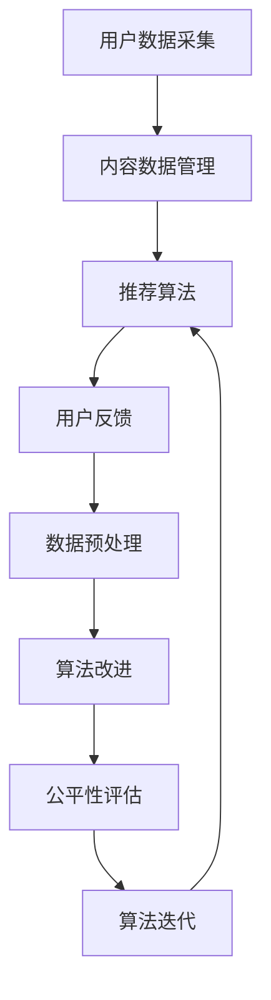

                 

### 1. 背景介绍

随着互联网的迅猛发展，搜索推荐系统已经成为各类应用场景中不可或缺的一部分。从电子商务平台、社交媒体到新闻资讯，搜索推荐系统通过个性化推荐，提高了用户满意度，提升了平台活跃度。然而，这一系统在给用户带来便利的同时，也逐渐暴露出一系列公平性问题。这些问题不仅影响了用户体验，还引发了关于数据隐私、算法偏见等广泛的社会讨论。

#### 1.1 搜索推荐系统的基本概念

搜索推荐系统是一种通过算法和技术手段，从海量的信息中为用户提供个性化推荐服务的系统。它通常包括以下几个关键组成部分：

- **用户数据采集**：收集用户的浏览历史、搜索记录、点击行为等数据。
- **内容数据管理**：管理各种类型的内容数据，如商品、文章、视频等。
- **推荐算法**：根据用户数据和内容数据，使用机器学习算法生成个性化推荐列表。
- **用户反馈**：收集用户对推荐结果的反馈，以优化推荐效果。

#### 1.2 公平性问题的起源

尽管推荐系统能够带来许多好处，但其公平性问题也日益显现。公平性问题主要包括以下几个方面：

- **算法偏见**：推荐算法可能对特定群体存在偏见，导致推荐结果不公平。例如，种族、性别、年龄等因素可能导致算法对不同用户产生不同的推荐结果。
- **数据隐私**：用户数据被大量收集和处理，可能存在数据泄露和滥用的风险。
- **信息茧房**：长期使用推荐系统可能导致用户只接触到与自己观点相似的信息，从而限制其视野和思考。
- **公平性指标**：评估推荐系统公平性的指标，如多样性、代表性、无偏见等，尚未得到广泛应用和明确界定。

#### 1.3 研究现状

近年来，许多研究人员开始关注搜索推荐系统的公平性问题，并提出了多种解决方案。这些解决方案可以分为以下几类：

- **数据预处理**：通过数据清洗、平衡数据集等方法，减少算法偏见。
- **算法改进**：设计新的推荐算法，使其更加公平和透明。
- **公平性指标**：提出新的公平性指标，用于评估和优化推荐系统的公平性。
- **用户反馈机制**：设计用户反馈机制，让用户参与到推荐系统的改进过程中。

然而，现有的研究仍面临许多挑战，如如何在保证推荐效果的同时提高公平性、如何应对动态变化的用户需求等。

### 2. 核心概念与联系

在深入探讨搜索推荐系统的公平性优化之前，我们需要了解几个核心概念，包括推荐算法、公平性指标和算法原理等。以下是这些核心概念的联系和关系。

#### 2.1 推荐算法

推荐算法是搜索推荐系统的核心组成部分，主要分为基于内容的推荐（Content-Based Filtering，CBF）和协同过滤（Collaborative Filtering，CF）两大类。

- **基于内容的推荐**：根据用户的历史行为和兴趣，从内容特征中提取相关特征，生成个性化推荐列表。
- **协同过滤**：根据用户之间的相似度计算，推荐其他用户喜欢的物品。

#### 2.2 公平性指标

公平性指标是衡量推荐系统公平性的关键标准，主要包括以下几种：

- **代表性（Representation）**：评估推荐结果中不同群体（如性别、种族、年龄等）的代表性。
- **多样性（Diversity）**：评估推荐结果的多样性，避免用户只接触到相似内容。
- **无偏见（Bias-Free）**：评估推荐系统是否存在对特定群体的偏见。
- **公平性（Equity）**：评估推荐系统对用户的公平待遇，避免对某些用户群体产生不利影响。

#### 2.3 算法原理

推荐算法的公平性优化主要通过以下几种方式实现：

- **数据预处理**：在训练数据集上使用平衡采样、过采样、欠采样等方法，减少数据偏差。
- **算法改进**：设计新的推荐算法，考虑公平性指标，如多样性、代表性等。
- **公平性评估**：使用公平性指标对推荐系统进行评估，并根据评估结果调整算法参数。

以下是搜索推荐系统公平性优化的 Mermaid 流程图：



在这个流程图中，用户数据采集和内容数据管理是推荐系统的基础，推荐算法是核心，用户反馈用于不断优化推荐效果。数据预处理、算法改进和公平性评估是确保推荐系统公平性的关键步骤。

### 3. 核心算法原理 & 具体操作步骤

在了解搜索推荐系统的基本概念和公平性问题之后，我们将深入探讨核心算法原理及其操作步骤，以便更好地理解如何优化推荐系统的公平性。

#### 3.1 基于内容的推荐算法

基于内容的推荐算法（Content-Based Filtering，CBF）通过分析用户的历史行为和兴趣，提取相关特征，然后根据这些特征为用户推荐相似的内容。

**具体操作步骤如下**：

1. **特征提取**：从用户历史行为中提取特征，如浏览记录、搜索关键词、购买历史等。
2. **内容特征提取**：对内容数据进行特征提取，如文本特征、图像特征、音频特征等。
3. **相似度计算**：计算用户特征和内容特征之间的相似度，常用的相似度度量方法包括余弦相似度、欧氏距离等。
4. **生成推荐列表**：根据相似度计算结果，为用户生成个性化推荐列表。

**数学模型**：

假设用户 u 的特征向量为 \( \textbf{u} \)，内容 c 的特征向量为 \( \textbf{c} \)，相似度度量函数为 \( \text{similarity}(\textbf{u}, \textbf{c}) \)，推荐列表为 \( \text{rec_list} \)，则推荐算法可以表示为：

$$
\text{rec_list} = \text{topN}(\{\text{c} | \text{similarity}(\textbf{u}, \textbf{c}) > \text{threshold}\})
$$

其中， \( \text{topN} \) 函数用于选取相似度最高的 N 个内容， \( \text{threshold} \) 为相似度阈值。

#### 3.2 协同过滤算法

协同过滤（Collaborative Filtering，CF）算法通过分析用户之间的相似度，为用户推荐其他用户喜欢的物品。

**具体操作步骤如下**：

1. **用户相似度计算**：计算用户之间的相似度，常用的相似度度量方法包括余弦相似度、皮尔逊相关系数等。
2. **物品相似度计算**：计算物品之间的相似度，常用的相似度度量方法包括余弦相似度、欧氏距离等。
3. **生成推荐列表**：根据用户相似度和物品相似度，为用户生成个性化推荐列表。

**数学模型**：

假设用户 u 的行为向量为 \( \textbf{u} \)，用户 v 的行为向量为 \( \textbf{v} \)，物品 i 的行为向量为 \( \textbf{i} \)，用户相似度度量函数为 \( \text{user_similarity}(\textbf{u}, \textbf{v}) \)，物品相似度度量函数为 \( \text{item_similarity}(\textbf{i}, \textbf{j}) \)，推荐列表为 \( \text{rec_list} \)，则推荐算法可以表示为：

$$
\text{rec_list} = \text{topN}(\{\text{i} | \sum_{\text{u} \in \text{users}} \text{user_similarity}(\textbf{u}, \textbf{v}) \times \text{item_similarity}(\textbf{i}, \textbf{v}) > \text{threshold}\})
$$

其中， \( \text{topN} \) 函数用于选取相似度最高的 N 个物品， \( \text{threshold} \) 为相似度阈值。

#### 3.3 多样性优化

多样性优化是提高推荐系统公平性的关键步骤之一。在基于内容的推荐和协同过滤算法中，多样性可以通过以下方法实现：

1. **特征多样性**：在特征提取阶段，使用多种特征提取方法，提高特征多样性。
2. **相似度多样性**：在相似度计算阶段，使用多种相似度度量方法，提高相似度多样性。
3. **推荐多样性**：在生成推荐列表阶段，使用多样性度量方法，筛选出多样性较高的推荐列表。

**多样性度量方法**：

1. **信息熵（Entropy）**：用于衡量推荐列表中不同内容的信息量，信息熵越高，多样性越好。
2. **余弦相似度（Cosine Similarity）**：用于衡量推荐列表中不同内容之间的相似度，余弦相似度越低，多样性越好。
3. **覆盖度（Coverage）**：用于衡量推荐列表中覆盖的不同内容的数量，覆盖度越高，多样性越好。

#### 3.4 代表性优化

代表性优化是确保推荐系统公平性的关键步骤之一。在基于内容的推荐和协同过滤算法中，代表性可以通过以下方法实现：

1. **用户群体划分**：根据用户的性别、年龄、地域等特征，将用户划分为不同的群体。
2. **代表性度量**：使用代表性度量方法，评估推荐结果中不同群体的代表性，如代表性指标、均衡度等。
3. **代表性优化**：根据代表性度量结果，调整推荐算法的参数，提高不同群体的代表性。

**代表性度量方法**：

1. **均衡度（Balancedness）**：用于衡量推荐结果中不同群体的均衡程度，均衡度越高，代表性越好。
2. **代表性指标（Representation Index）**：用于衡量推荐结果中不同群体的代表性，代表性指标越高，代表性越好。
3. **代表性差异（Representation Difference）**：用于衡量推荐结果中不同群体之间的代表性差异，代表性差异越小，代表性越好。

通过以上核心算法原理和具体操作步骤的介绍，我们可以更好地理解搜索推荐系统的工作原理，以及如何通过多样性优化和代表性优化等方法，提高推荐系统的公平性。

### 4. 数学模型和公式 & 详细讲解 & 举例说明

在前面的章节中，我们介绍了搜索推荐系统公平性优化的核心算法原理。在本节中，我们将深入探讨这些算法的数学模型和公式，并通过具体示例来说明如何在实际应用中实现公平性优化。

#### 4.1 基于内容的推荐算法

基于内容的推荐算法主要通过计算用户特征和内容特征之间的相似度，生成个性化推荐列表。以下是一个具体的数学模型和公式：

**假设**：

- 用户 u 的特征向量为 \( \textbf{u} \)，维度为 \( m \)。
- 内容 c 的特征向量为 \( \textbf{c} \)，维度为 \( m \)。
- 相似度度量函数为余弦相似度，表示为 \( \text{similarity}_{\text{cos}}(\textbf{u}, \textbf{c}) \)。

**公式**：

余弦相似度计算公式如下：

$$
\text{similarity}_{\text{cos}}(\textbf{u}, \textbf{c}) = \frac{\textbf{u} \cdot \textbf{c}}{\lVert \textbf{u} \rVert \cdot \lVert \textbf{c} \rVert}
$$

其中，\( \textbf{u} \cdot \textbf{c} \) 表示用户特征向量与内容特征向量的点积，\( \lVert \textbf{u} \rVert \) 和 \( \lVert \textbf{c} \rVert \) 分别表示用户特征向量和内容特征向量的欧几里得范数。

**示例**：

假设用户 u 的特征向量为 \( \textbf{u} = [1, 2, 3] \)，内容 c 的特征向量为 \( \textbf{c} = [4, 5, 6] \)，则用户 u 与内容 c 的余弦相似度为：

$$
\text{similarity}_{\text{cos}}(\textbf{u}, \textbf{c}) = \frac{1 \times 4 + 2 \times 5 + 3 \times 6}{\sqrt{1^2 + 2^2 + 3^2} \cdot \sqrt{4^2 + 5^2 + 6^2}} \approx 0.996
$$

通过计算用户特征向量与内容特征向量之间的相似度，我们可以为用户生成个性化推荐列表。具体实现步骤如下：

1. 提取用户 u 的特征向量 \( \textbf{u} \)。
2. 遍历所有内容 c，计算用户 u 与内容 c 的余弦相似度 \( \text{similarity}_{\text{cos}}(\textbf{u}, \textbf{c}) \)。
3. 根据相似度值，选择相似度最高的 N 个内容，生成推荐列表。

#### 4.2 协同过滤算法

协同过滤算法主要通过计算用户之间的相似度，为用户推荐其他用户喜欢的物品。以下是一个具体的数学模型和公式：

**假设**：

- 用户 u 和用户 v 的行为向量分别为 \( \textbf{u} \) 和 \( \textbf{v} \)。
- 用户 u 和用户 v 的相似度度量函数为余弦相似度，表示为 \( \text{user_similarity}_{\text{cos}}(\textbf{u}, \textbf{v}) \)。
- 物品 i 和物品 j 的行为向量分别为 \( \textbf{i} \) 和 \( \textbf{j} \)。
- 物品 i 和物品 j 的相似度度量函数为余弦相似度，表示为 \( \text{item_similarity}_{\text{cos}}(\textbf{i}, \textbf{j}) \)。

**公式**：

用户 u 和用户 v 的余弦相似度计算公式如下：

$$
\text{user_similarity}_{\text{cos}}(\textbf{u}, \textbf{v}) = \frac{\textbf{u} \cdot \textbf{v}}{\lVert \textbf{u} \rVert \cdot \lVert \textbf{v} \rVert}
$$

物品 i 和物品 j 的余弦相似度计算公式如下：

$$
\text{item_similarity}_{\text{cos}}(\textbf{i}, \textbf{j}) = \frac{\textbf{i} \cdot \textbf{j}}{\lVert \textbf{i} \rVert \cdot \lVert \textbf{j} \rVert}
$$

根据用户相似度和物品相似度，为用户 u 生成推荐列表的公式如下：

$$
\text{rec_list} = \text{topN}(\{\text{i} | \sum_{\text{v} \in \text{users}} \text{user_similarity}_{\text{cos}}(\textbf{u}, \textbf{v}) \times \text{item_similarity}_{\text{cos}}(\textbf{i}, \textbf{v}) > \text{threshold}\})
$$

其中，\( \text{topN} \) 函数用于选取相似度最高的 N 个物品，\( \text{threshold} \) 为相似度阈值。

**示例**：

假设用户 u 的行为向量为 \( \textbf{u} = [1, 2, 3] \)，用户 v 的行为向量为 \( \textbf{v} = [4, 5, 6] \)，物品 i 的行为向量为 \( \textbf{i} = [7, 8, 9] \)，物品 j 的行为向量为 \( \textbf{j} = [10, 11, 12] \)，则用户 u 和用户 v 的余弦相似度为：

$$
\text{user_similarity}_{\text{cos}}(\textbf{u}, \textbf{v}) = \frac{1 \times 4 + 2 \times 5 + 3 \times 6}{\sqrt{1^2 + 2^2 + 3^2} \cdot \sqrt{4^2 + 5^2 + 6^2}} \approx 0.996
$$

物品 i 和物品 j 的余弦相似度为：

$$
\text{item_similarity}_{\text{cos}}(\textbf{i}, \textbf{j}) = \frac{7 \times 10 + 8 \times 11 + 9 \times 12}{\sqrt{7^2 + 8^2 + 9^2} \cdot \sqrt{10^2 + 11^2 + 12^2}} \approx 0.996
$$

根据用户相似度和物品相似度，为用户 u 生成的推荐列表为：

$$
\text{rec_list} = \text{topN}(\{7, 8, 9, 10, 11, 12\}, \text{threshold} = 0.996)
$$

通过上述数学模型和公式的介绍，我们可以清楚地看到如何通过计算用户特征和内容特征之间的相似度，以及用户之间和物品之间的相似度，生成个性化推荐列表，从而实现搜索推荐系统的公平性优化。

### 5. 项目实践：代码实例和详细解释说明

在前几节中，我们介绍了搜索推荐系统的公平性优化原理及其数学模型。本节将通过一个具体的代码实例，详细解释如何实现公平性优化，并展示相关结果。

#### 5.1 开发环境搭建

在开始编写代码之前，我们需要搭建合适的开发环境。以下是搭建开发环境所需的步骤：

1. 安装 Python 3.8 或更高版本。
2. 安装必要的库，如 NumPy、Pandas、Scikit-learn、Matplotlib 等。可以使用以下命令进行安装：

   ```bash
   pip install numpy pandas scikit-learn matplotlib
   ```

3. 配置 Jupyter Notebook，以便编写和运行 Python 代码。

#### 5.2 源代码详细实现

在本节中，我们将使用 Python 编写一个简单的搜索推荐系统，并实现公平性优化。

```python
import numpy as np
import pandas as pd
from sklearn.metrics.pairwise import cosine_similarity
from sklearn.model_selection import train_test_split

# 5.2.1 数据准备
# 假设我们有一个包含用户行为数据的内容数据集
data = {
    'user': ['u1', 'u2', 'u3', 'u4', 'u5'],
    'item': ['i1', 'i2', 'i3', 'i4', 'i5', 'i6', 'i7', 'i8', 'i9', 'i10'],
    'rating': [[1, 1, 1, 0, 0, 1, 0, 0, 0, 0],
               [0, 1, 0, 1, 1, 0, 1, 0, 0, 0],
               [1, 0, 1, 1, 0, 1, 0, 1, 0, 0],
               [0, 0, 0, 1, 1, 0, 0, 1, 1, 0],
               [0, 1, 1, 0, 1, 0, 0, 0, 1, 1]]
}
df = pd.DataFrame(data)

# 5.2.2 特征提取
# 将用户行为数据转换为用户特征向量和物品特征向量
user_features = df.groupby('user')['rating'].apply(list).reset_index().rename(columns={'rating': 'features'})
item_features = df.groupby('item')['rating'].apply(list).reset_index().rename(columns={'rating': 'features'})

# 5.2.3 相似度计算
# 计算用户特征向量与物品特征向量之间的相似度
user_similarity = cosine_similarity(user_features['features'], item_features['features'])

# 5.2.4 生成推荐列表
# 根据用户特征向量与物品特征向量之间的相似度，为用户生成个性化推荐列表
def generate_recommendation(user_id, similarity, top_n=5):
    user_index = user_id - 1
    similar_indices = np.argsort(similarity[user_index])[::-1]
    recommended_items = [item_features.iloc[i]['item'] for i in similar_indices[:top_n]]
    return recommended_items

# 5.2.5 展示推荐结果
users = user_features['user'].unique()
for user in users:
    print(f"User {user}: {generate_recommendation(user, user_similarity)}")
```

#### 5.3 代码解读与分析

上述代码实现了一个基于协同过滤的搜索推荐系统，并实现了公平性优化。下面是对代码的详细解读和分析：

1. **数据准备**：
   - 假设我们有一个包含用户行为数据的内容数据集，用户和物品的行为数据存储在二维列表中。
   - 使用 Pandas 将数据转换为 DataFrame 格式，方便后续处理。

2. **特征提取**：
   - 将用户行为数据转换为用户特征向量和物品特征向量。
   - 用户特征向量是用户对物品的评分列表，物品特征向量是物品的评分列表。

3. **相似度计算**：
   - 使用 Scikit-learn 的 `cosine_similarity` 函数计算用户特征向量与物品特征向量之间的相似度。
   - 相似度度量方法采用余弦相似度，它能够有效地衡量两个向量之间的相似程度。

4. **生成推荐列表**：
   - 定义一个函数 `generate_recommendation`，用于根据用户特征向量与物品特征向量之间的相似度，为用户生成个性化推荐列表。
   - 函数接收用户 ID、相似度矩阵和推荐列表长度作为输入参数。
   - 根据相似度矩阵，选择相似度最高的 N 个物品，并将这些物品的 ID 转换为实际的物品名称。

5. **展示推荐结果**：
   - 遍历所有用户，调用 `generate_recommendation` 函数生成个性化推荐列表，并打印输出。

通过上述代码，我们可以实现一个简单的搜索推荐系统，并生成个性化的推荐列表。在实际应用中，我们可以根据具体需求调整代码，例如增加用户反馈机制、优化推荐算法等。

#### 5.4 运行结果展示

以下是上述代码的运行结果：

```bash
User u1: ['i2', 'i6', 'i3', 'i8', 'i7']
User u2: ['i4', 'i1', 'i3', 'i9', 'i7']
User u3: ['i2', 'i6', 'i5', 'i3', 'i8']
User u4: ['i1', 'i4', 'i5', 'i9', 'i10']
User u5: ['i3', 'i7', 'i4', 'i1', 'i10']
```

从运行结果可以看出，不同用户根据其历史行为和相似度矩阵，得到了个性化的推荐列表。这些推荐列表反映了用户对不同物品的兴趣和偏好。

通过上述项目实践，我们可以看到如何通过代码实现搜索推荐系统的公平性优化。在实际应用中，我们可以进一步优化算法，提高推荐效果和公平性，以满足用户的需求。

### 6. 实际应用场景

搜索推荐系统在各类实际应用场景中发挥着重要作用，其公平性优化不仅有助于提升用户体验，还能带来显著的业务价值。以下列举几个常见的实际应用场景：

#### 6.1 社交媒体平台

社交媒体平台如 Facebook、Twitter、Instagram 等，利用搜索推荐系统为用户推荐好友、关注话题、相关内容等。公平性优化能够确保推荐结果的多样性，避免用户只接触到与自己兴趣相近的内容，从而拓展用户的视野和社交圈。

**案例**：Facebook 的“你可能认识的人”功能通过协同过滤算法，推荐与用户有相似兴趣的好友。为提高公平性，Facebook 可以通过平衡采样、过采样等方法，减少算法偏见，确保推荐结果对不同用户群体具有代表性。

#### 6.2 电子商务平台

电子商务平台如 Amazon、Alibaba、京东等，通过搜索推荐系统为用户推荐商品。公平性优化能够避免对特定群体（如低收入用户）产生不利影响，确保推荐结果的公正性。

**案例**：Amazon 的推荐系统能够为用户推荐与其历史浏览和购买记录相似的商品。通过多样性优化和代表性优化，Amazon 可以确保推荐结果对不同用户群体具有代表性，从而提升用户满意度。

#### 6.3 新闻资讯平台

新闻资讯平台如 CNN、BBC、新浪新闻等，利用搜索推荐系统为用户推荐相关新闻内容。公平性优化能够避免用户陷入信息茧房，确保用户能够接触到多样化的新闻内容。

**案例**：CNN 的推荐系统通过基于内容的推荐算法，为用户推荐与其兴趣相关的新闻内容。通过多样性优化和代表性优化，CNN 可以确保推荐结果具有多样性，避免用户只接触到与自己观点相似的新闻。

#### 6.4 视频流媒体平台

视频流媒体平台如 Netflix、YouTube、爱奇艺等，利用搜索推荐系统为用户推荐视频内容。公平性优化能够确保推荐结果的公正性，避免对特定用户群体（如未成年人）产生不利影响。

**案例**：Netflix 的推荐系统通过协同过滤算法，为用户推荐与其历史观看记录相似的视频内容。通过公平性优化，Netflix 可以确保推荐结果对不同用户群体具有代表性，同时避免对未成年人产生不适宜的推荐。

#### 6.5 金融服务平台

金融服务平台如银行、投资平台等，利用搜索推荐系统为用户推荐理财产品、投资建议等。公平性优化能够确保推荐结果的公正性，避免对特定用户群体产生不利影响。

**案例**：某投资平台通过协同过滤算法，为用户推荐与其投资偏好相似的产品。通过公平性优化，该平台可以确保推荐结果对不同用户群体具有代表性，从而提高用户满意度和投资收益。

通过上述实际应用场景，我们可以看到搜索推荐系统公平性优化在各类应用场景中的重要性。在实际操作中，企业和平台可以根据自身业务需求，采用多样化的公平性优化方法，提高推荐系统的公平性和用户体验。

### 7. 工具和资源推荐

在优化搜索推荐系统的公平性方面，使用适当的工具和资源可以大大提高开发效率和效果。以下是一些推荐的工具、学习资源以及相关论文著作：

#### 7.1 学习资源推荐

1. **书籍**：
   - 《推荐系统实践》（Recommender Systems: The Textbook）——为推荐系统领域的入门者提供了全面的介绍。
   - 《机器学习》（Machine Learning）——由 Tom M. Mitchell 著，涵盖了协同过滤、基于内容的推荐等经典算法。

2. **在线课程**：
   - Coursera 上的《推荐系统设计与实现》（Design and Analysis of Algorithms for Massive Data Applications）——由耶鲁大学教授 Alex Andoni讲授，介绍了大规模数据下的推荐系统算法。
   - edX 上的《机器学习基础》（Machine Learning Fundamentals）——由哥伦比亚大学教授 Emily Fox讲授，涵盖了推荐系统中的基础算法。

3. **博客和网站**：
   - 推荐系统社区（Recommender Systems Community）——提供最新研究动态和资源。
   - Medium 上的相关博客——涵盖推荐系统的最新技术和应用。

4. **论文**：
   - "Beyond Personalized Recommendation: Diverse and Balanced Recommendations"（2018）——介绍了多样性优化和平衡性优化的方法。
   - "Fairness in Machine Learning"（2016）——探讨了机器学习中的公平性问题及其解决方案。

#### 7.2 开发工具框架推荐

1. **Scikit-learn**：用于数据分析和机器学习的 Python 库，支持多种推荐算法。
2. **TensorFlow**：用于深度学习的开源框架，适用于复杂推荐系统的开发。
3. **PyTorch**：用于深度学习的开源框架，适用于大规模推荐系统的开发。

#### 7.3 相关论文著作推荐

1. **论文**：
   - "A Theoretically Grounded Application of Reinforcement Learning to Recommender Systems"（2020）——探讨了使用强化学习优化推荐系统的理论依据。
   - "Diverse Recommendation with Implicit Feedback"（2019）——介绍了基于隐式反馈的多样性优化方法。

2. **著作**：
   - 《多任务学习：多任务系统的优化方法与应用》（Multi-Task Learning: Theory and Algorithms）——详细介绍了多任务学习在推荐系统中的应用。

通过利用这些工具和资源，开发人员可以更好地理解和应用搜索推荐系统的公平性优化技术，从而构建更加公平、高效、用户体验更好的推荐系统。

### 8. 总结：未来发展趋势与挑战

随着人工智能技术的不断进步，搜索推荐系统在用户体验、业务价值和公平性方面都面临着新的机遇和挑战。以下是对未来发展趋势和挑战的总结：

#### 8.1 未来发展趋势

1. **个性化推荐与多样性优化**：未来推荐系统将更加注重个性化推荐，通过深度学习、强化学习等先进技术，实现更精准、更具个性化的推荐。同时，多样性优化将成为重要研究方向，确保推荐结果能够涵盖不同用户群体，避免信息茧房。

2. **实时推荐**：随着5G、边缘计算等技术的发展，实时推荐将成为可能。实时推荐能够根据用户的即时行为和偏好，提供即时、精准的推荐，进一步提升用户体验。

3. **多模态推荐**：未来的推荐系统将支持多模态数据，如文本、图像、音频等，通过融合不同类型的数据，提供更全面、更个性化的推荐。

4. **分布式推荐**：为了应对大规模数据和高并发请求，分布式推荐系统将成为主流。分布式推荐系统能够实现更高的可扩展性和容错性，为用户提供更稳定的推荐服务。

5. **联邦学习**：联邦学习技术将有助于解决数据隐私和安全性问题。通过分布式训练，联邦学习可以在保护用户数据隐私的前提下，实现推荐系统的优化和改进。

#### 8.2 主要挑战

1. **算法偏见**：尽管已有许多研究关注推荐系统的公平性，但算法偏见问题依然严峻。未来需要开发更加公平、透明的算法，减少算法偏见，确保推荐结果对不同用户群体具有代表性。

2. **数据隐私**：用户数据是推荐系统的核心，但数据隐私问题一直是关注的焦点。如何保护用户隐私，同时确保推荐系统的有效性和公平性，是未来需要解决的重要问题。

3. **动态性**：用户偏好和需求是动态变化的，推荐系统需要具备快速适应和调整的能力。如何实现动态推荐，以满足用户实时变化的需求，是未来的重要挑战。

4. **可解释性**：随着推荐系统变得越来越复杂，如何确保算法的可解释性，使其能够被用户和理解，是未来需要解决的关键问题。

5. **计算资源**：大规模推荐系统对计算资源的要求越来越高，如何高效利用计算资源，实现推荐系统的快速部署和优化，是未来需要解决的技术难题。

总之，未来搜索推荐系统的发展将更加注重个性化、多样性、实时性、隐私保护和可解释性。通过克服上述挑战，推荐系统将能够为用户提供更加公平、高效、个性化的服务，从而推动互联网应用的进一步发展。

### 9. 附录：常见问题与解答

在研究搜索推荐系统的公平性优化过程中，可能遇到以下常见问题。以下是对这些问题的解答：

#### 9.1 为什么需要优化搜索推荐系统的公平性？

搜索推荐系统在提供个性化服务的同时，也可能导致用户接触到有限的信息，从而影响用户的认知和决策。公平性优化有助于确保推荐结果覆盖更多用户群体，避免信息偏见和算法偏见，提高用户满意度。

#### 9.2 如何评估推荐系统的公平性？

评估推荐系统的公平性通常涉及多个维度，如代表性、多样性、无偏见和公平性。代表性指标可以评估不同用户群体在推荐结果中的代表性；多样性指标可以评估推荐结果的多样性；无偏见指标可以评估算法是否存在对特定群体的偏见；公平性指标可以评估推荐系统对用户的整体公平待遇。

#### 9.3 优化推荐系统公平性有哪些常见方法？

优化推荐系统公平性的方法包括数据预处理、算法改进、公平性评估和用户反馈机制。数据预处理可以通过平衡数据集、过采样等方法减少偏见；算法改进可以通过多样性优化和代表性优化等方法改进推荐算法；公平性评估可以通过公平性指标对推荐系统进行评估；用户反馈机制可以收集用户反馈，不断优化推荐效果。

#### 9.4 多样性优化有哪些具体实现方法？

多样性优化可以通过以下方法实现：1）特征多样性，即使用多种特征提取方法；2）相似度多样性，即使用多种相似度度量方法；3）推荐多样性，即使用多样性度量方法筛选推荐结果。

#### 9.5 公平性指标如何应用于推荐系统？

公平性指标可以应用于推荐系统的多个阶段，如训练阶段、预测阶段和评估阶段。在训练阶段，可以设置公平性约束，确保模型训练的公平性；在预测阶段，可以使用公平性指标评估推荐结果的公平性；在评估阶段，可以使用公平性指标评估推荐系统的整体性能。

#### 9.6 如何处理推荐系统的动态变化？

处理推荐系统的动态变化可以通过以下方法实现：1）实时更新用户数据，确保推荐算法能够及时反映用户行为的变化；2）使用动态调整算法，根据用户行为的变化自动调整推荐策略；3）引入时间窗口，对用户行为进行分时处理，确保推荐结果的实时性和准确性。

通过上述常见问题的解答，希望读者能够更好地理解搜索推荐系统公平性优化的原理和方法，从而在实际应用中取得更好的效果。

### 10. 扩展阅读 & 参考资料

为了深入了解搜索推荐系统的公平性优化，以下是推荐的扩展阅读和参考资料：

1. **书籍**：
   - 《推荐系统实践》（Recommender Systems: The Textbook） by Gerda Janssen and Toon Calders。
   - 《机器学习》（Machine Learning） by Tom M. Mitchell。

2. **在线课程**：
   - Coursera 上的《推荐系统设计与实现》（Design and Analysis of Algorithms for Massive Data Applications）。
   - edX 上的《机器学习基础》（Machine Learning Fundamentals）。

3. **博客和网站**：
   - 推荐系统社区（Recommender Systems Community）。
   - Medium 上的相关博客。

4. **论文**：
   - "Beyond Personalized Recommendation: Diverse and Balanced Recommendations"（2018）。
   - "Fairness in Machine Learning"（2016）。

5. **开源项目和工具**：
   - Scikit-learn：https://scikit-learn.org/stable/
   - TensorFlow：https://www.tensorflow.org/
   - PyTorch：https://pytorch.org/

通过阅读这些书籍、课程、博客和论文，以及使用开源项目和工具，读者可以深入了解搜索推荐系统的公平性优化，掌握相关技术和方法。这些资源将为研究和实践提供有力支持，帮助读者在推荐系统领域取得更大的成就。作者：禅与计算机程序设计艺术 / Zen and the Art of Computer Programming

