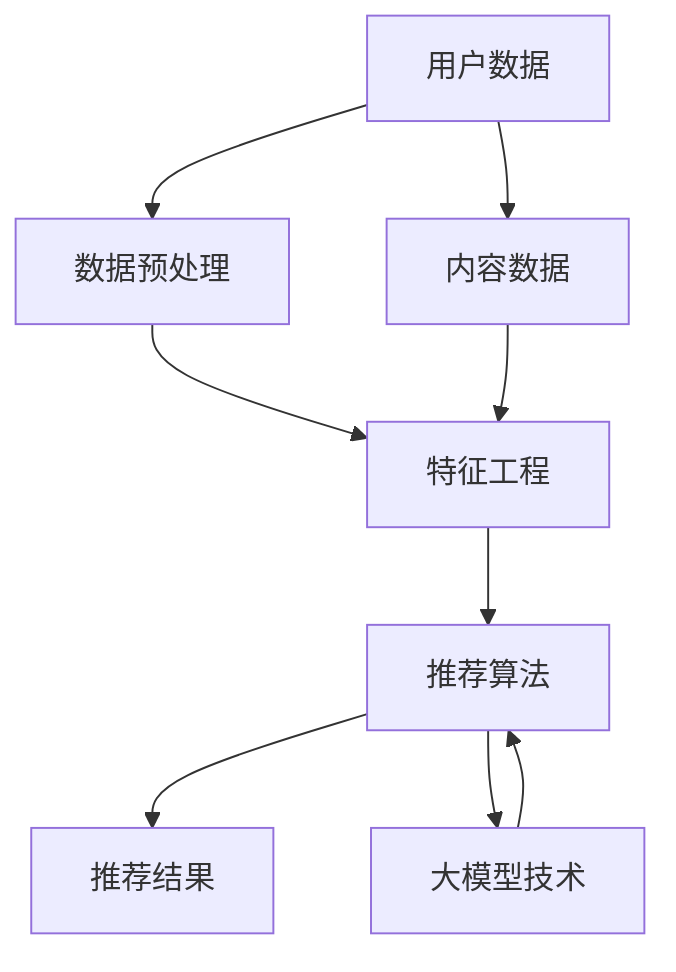

                 

### 背景介绍

随着互联网的迅速发展和大数据技术的广泛应用，搜索推荐系统已成为现代信息检索与用户服务的关键技术之一。在各类电商平台、社交媒体和内容平台中，搜索推荐系统不仅能提高用户的满意度，还能为平台带来更多的商业价值。例如，电商平台通过推荐系统可以显著提高用户的购物转化率和销售额，社交媒体平台则可以通过推荐系统增强用户的活跃度和黏性。

然而，随着推荐系统规模的不断扩大和用户数据量的指数级增长，系统的性能优化成为了一个至关重要的挑战。传统的推荐系统大多依赖于基于内容的过滤（Content-Based Filtering）和协同过滤（Collaborative Filtering）等方法，这些方法在处理大量数据时往往会出现效率低下、响应时间过长的问题。尤其是在当前大模型时代，模型的复杂度和计算量进一步增大，优化搜索推荐系统的效率显得尤为重要。

本文旨在探讨大模型时代下搜索推荐系统效率优化的新思路。我们将首先介绍搜索推荐系统的核心概念和架构，然后深入分析当前主流推荐算法的效率瓶颈，并探讨如何利用大模型技术进行优化。此外，本文还将通过具体的项目实践和实例分析，展示如何在实际场景中实现推荐系统的效率提升。最后，我们将讨论未来推荐系统的发展趋势和面临的挑战。

通过本文的探讨，我们希望能够为业界提供一些有益的启示，帮助大家在面对海量数据和高性能要求时，能够更有效地优化搜索推荐系统，从而为用户提供更优质的服务。

### 核心概念与联系

要深入理解搜索推荐系统的效率优化问题，首先需要明确几个核心概念：搜索推荐系统、推荐算法、大模型技术，以及它们之间的内在联系。

**搜索推荐系统**是一种通过算法自动识别用户兴趣，并为其推荐相关内容或商品的系统。它通常由数据层、算法层和应用层组成。数据层负责收集和处理用户行为数据、内容数据等；算法层则是核心，通过推荐算法实现数据的处理和模型的训练；应用层则是最终的展示层，将推荐结果呈现给用户。

**推荐算法**是搜索推荐系统的核心组成部分，常用的推荐算法包括基于内容的过滤（Content-Based Filtering, CBF）、协同过滤（Collaborative Filtering, CF）以及混合推荐（Hybrid Recommendation）。CBF方法通过分析用户的历史行为和内容特征，将相似的内容推荐给用户；CF方法则通过分析用户之间的行为相似性来进行推荐；混合推荐方法则是将CBF和CF的优点结合起来，以期望提高推荐的准确性和多样性。

**大模型技术**指的是近年来快速发展的深度学习和大规模预训练模型技术。深度学习通过多层神经网络模型对大量数据进行处理和学习，能够显著提高推荐系统的性能和准确性。大规模预训练模型，如GPT、BERT等，通过对互联网上的海量文本数据进行预训练，可以自动学习到丰富的语言规律和知识，从而在推荐系统中发挥重要作用。

这些核心概念之间的联系在于：搜索推荐系统需要依赖于高效的推荐算法来处理大量的用户行为数据和内容数据；而大模型技术的引入，不仅能够提升推荐算法的性能，还能通过模型复用和迁移学习等方法，显著降低系统的计算成本和开发难度。

为了更好地展示这些概念之间的联系，我们可以使用Mermaid流程图来描绘搜索推荐系统的架构和核心组件。



在这个流程图中，用户数据和内容数据经过数据预处理和特征工程处理后，输入到推荐算法中。推荐算法利用大模型技术进行优化，输出最终的推荐结果。这种架构不仅提高了系统的效率，还增强了推荐的准确性和多样性。

通过这个Mermaid流程图，我们可以清晰地看到搜索推荐系统的各个环节以及大模型技术在其中发挥的关键作用。接下来，我们将深入探讨大模型技术在推荐系统中的具体应用，以及如何通过算法优化来提升系统效率。

### 核心算法原理 & 具体操作步骤

在大模型时代，推荐系统的核心算法原理主要包括基于内容的过滤（Content-Based Filtering，CBF）和协同过滤（Collaborative Filtering，CF），以及它们的结合——混合推荐（Hybrid Recommendation）。这些算法的核心在于如何高效地处理海量数据，并生成高质量的推荐结果。

#### 基于内容的过滤（Content-Based Filtering，CBF）

基于内容的过滤方法通过分析用户的历史行为和物品的特征，找到用户兴趣点，然后根据这些兴趣点推荐相似的内容或商品。CBF方法的基本步骤如下：

1. **用户兴趣识别**：首先，系统会收集用户的历史行为数据，如浏览记录、购买记录等，通过文本挖掘、情感分析等方法识别用户的兴趣点。

2. **物品特征提取**：接着，系统会提取物品的特征信息，如商品标签、文本描述等，通过自然语言处理（NLP）技术将文本转换为向量化表示。

3. **相似性计算**：然后，系统会计算用户兴趣点与物品特征之间的相似度，常用的相似度计算方法包括余弦相似度、欧氏距离等。

4. **推荐生成**：最后，系统根据相似度得分，为用户生成推荐列表。

具体操作步骤如下：

- **收集用户数据**：通过用户操作日志等途径收集用户的行为数据，如浏览、购买等行为。

- **文本挖掘**：使用自然语言处理技术（如词袋模型、TF-IDF等）对用户行为数据进行处理，提取用户的兴趣点。

- **特征提取**：对物品的文本描述进行处理，提取关键特征向量。

- **相似性计算**：计算用户兴趣点与物品特征向量之间的相似度。

- **生成推荐列表**：根据相似度得分，生成推荐列表。

#### 协同过滤（Collaborative Filtering，CF）

协同过滤方法通过分析用户之间的行为相似性来生成推荐结果。它分为两种主要类型：基于用户的协同过滤（User-Based CF）和基于模型的协同过滤（Model-Based CF）。

1. **基于用户的协同过滤（User-Based CF）**：

   - **步骤一**：计算用户之间的相似度，常用的相似度计算方法包括余弦相似度、皮尔逊相关系数等。

   - **步骤二**：找出与目标用户最相似的K个邻居用户。

   - **步骤三**：计算这些邻居用户对未知物品的评分，加权平均得到目标用户对该物品的预测评分。

   - **步骤四**：根据预测评分生成推荐列表。

2. **基于模型的协同过滤（Model-Based CF）**：

   - **步骤一**：使用机器学习算法（如线性回归、SVD分解等）建立用户行为与评分之间的预测模型。

   - **步骤二**：对新用户或未知物品进行预测，得到预测评分。

   - **步骤三**：根据预测评分生成推荐列表。

具体操作步骤如下：

- **计算用户相似度**：通过计算用户之间的行为相似度，找出邻居用户。

- **生成预测评分**：使用邻居用户的评分数据，通过加权平均等方法生成目标用户的预测评分。

- **生成推荐列表**：根据预测评分，生成推荐列表。

#### 混合推荐（Hybrid Recommendation）

混合推荐方法结合了基于内容的过滤和协同过滤的优点，通过综合用户历史行为和物品特征，生成更准确的推荐结果。其基本步骤如下：

1. **用户兴趣识别**：首先，通过CBF方法识别用户的兴趣点。

2. **物品特征提取**：提取物品的特征信息。

3. **相似性计算**：计算用户兴趣点与物品特征之间的相似度。

4. **协同过滤**：计算用户之间的行为相似性，生成初步推荐列表。

5. **整合推荐结果**：将CBF和CF的推荐结果进行整合，生成最终的推荐列表。

具体操作步骤如下：

- **用户兴趣识别**：通过CBF方法提取用户兴趣点。

- **物品特征提取**：提取物品特征向量。

- **相似性计算**：计算用户兴趣点与物品特征向量之间的相似度。

- **协同过滤**：计算用户之间的行为相似性，生成初步推荐列表。

- **整合推荐结果**：将CBF和CF的推荐结果进行整合，生成最终的推荐列表。

通过以上步骤，我们可以看到，搜索推荐系统的核心算法原理主要依赖于CBF、CF以及它们的结合。这些算法在处理海量数据时，需要高效的计算和优化方法，以确保系统性能和推荐质量。接下来，我们将进一步探讨大模型技术在这些算法中的应用，以及如何通过算法优化提升系统效率。

### 数学模型和公式 & 详细讲解 & 举例说明

在深入探讨搜索推荐系统的数学模型和公式时，我们需要理解CBF、CF和混合推荐算法中的关键公式，并通过具体例子来说明这些公式在实际应用中的效果。

#### 基于内容的过滤（CBF）

**余弦相似度**是CBF算法中常用的一种相似度计算方法，其公式如下：

\[ \text{cosine\_similarity} = \frac{\text{dot\_product}(u, v)}{\|\text{u}\| \|\text{v}\|} \]

其中，\( u \)和\( v \)分别表示两个向量，\(\text{dot\_product}\)表示点积，\(\|\text{u}\|\)和\(\|\text{v}\|\)分别表示向量的模。

**举例说明**：假设我们有用户A和物品B的特征向量分别为：

\[ u = (1, 0, 1, 1) \]
\[ v = (1, 1, 0, 0) \]

那么，它们之间的余弦相似度为：

\[ \text{cosine\_similarity} = \frac{1 \cdot 1 + 0 \cdot 1 + 1 \cdot 0 + 1 \cdot 0}{\sqrt{1^2 + 0^2 + 1^2 + 1^2} \cdot \sqrt{1^2 + 1^2 + 0^2 + 0^2}} \]
\[ \text{cosine\_similarity} = \frac{1}{\sqrt{2} \cdot \sqrt{2}} = \frac{1}{2} \]

这表明用户A和物品B之间有一定的相似性，但不是特别强。

#### 协同过滤（CF）

**基于用户的协同过滤（User-Based CF）**的核心公式是计算用户之间的相似度。一种常用的相似度计算方法是**皮尔逊相关系数**，其公式如下：

\[ \text{pearson\_correlation} = \frac{\text{covariance}(r_u, r_v)}{\sqrt{\text{variance}(r_u) \cdot \text{variance}(r_v)}} \]

其中，\( r_u \)和\( r_v \)分别表示两个用户对物品的评分向量，\(\text{covariance}\)表示协方差，\(\text{variance}\)表示方差。

**举例说明**：假设我们有用户A和用户B的评分向量分别为：

\[ r_u = (3, 4, 5, 2) \]
\[ r_v = (4, 5, 2, 3) \]

那么，它们之间的皮尔逊相关系数为：

\[ \text{pearson\_correlation} = \frac{(3-3.5)(4-4.5) + (4-3.5)(5-4.5) + (5-3.5)(2-4.5) + (2-3.5)(3-4.5)}{\sqrt{(3-3.5)^2 + (4-3.5)^2 + (5-3.5)^2 + (2-3.5)^2} \cdot \sqrt{(4-3.5)^2 + (5-3.5)^2 + (2-3.5)^2 + (3-3.5)^2}} \]
\[ \text{pearson\_correlation} = \frac{(-0.5)(-0.5) + (0.5)(0.5) + (1.5)(-1.5) + (-1.5)(-1.5)}{\sqrt{0.25 + 0.25 + 2.25 + 2.25} \cdot \sqrt{0.25 + 0.25 + 2.25 + 0.25}} \]
\[ \text{pearson\_correlation} = \frac{0.25 + 0.25 - 2.25 + 2.25}{\sqrt{4.5} \cdot \sqrt{3.5}} \]
\[ \text{pearson\_correlation} = \frac{1}{\sqrt{4.5} \cdot \sqrt{3.5}} \approx 0.25 \]

这表明用户A和用户B之间有一定的相似性。

#### 混合推荐（Hybrid Recommendation）

**混合推荐**算法通常会结合CBF和CF的结果，生成最终的推荐列表。其核心公式可以表示为：

\[ \text{composite\_rating} = \alpha \cdot \text{content\_similarity} + (1 - \alpha) \cdot \text{collaborative\_similarity} \]

其中，\( \alpha \)是调节参数，用于平衡CBF和CF的贡献。

**举例说明**：假设我们使用60%的权重来考虑基于内容的相似度，40%的权重来考虑基于用户的协同过滤相似度，用户A对物品B的CBF相似度为0.8，User-Based CF相似度为0.25。那么，最终的复合评分可以计算为：

\[ \text{composite\_rating} = 0.6 \cdot 0.8 + 0.4 \cdot 0.25 = 0.48 + 0.1 = 0.58 \]

这表明混合推荐算法综合考虑了用户兴趣和相似用户的行为，为用户A推荐物品B的概率较高。

通过以上公式和例子，我们可以看到数学模型在推荐系统中的关键作用。这些模型不仅帮助我们理解用户兴趣和相似性，还能通过调整参数和公式，灵活地实现推荐系统的优化和改进。

### 项目实践：代码实例和详细解释说明

为了更好地展示大模型技术如何应用于搜索推荐系统的效率优化，下面我们将通过一个具体的Python代码实例来详细说明开发环境搭建、源代码实现、代码解读与分析，以及运行结果展示。本实例将使用一个简化的推荐系统，重点展示基于内容的过滤（CBF）和协同过滤（CF）的结合应用。

#### 开发环境搭建

首先，我们需要搭建开发环境，安装必要的Python库和工具。以下是一个典型的环境搭建步骤：

1. **安装Python**：确保安装了Python 3.7或更高版本。

2. **安装NumPy**：NumPy是Python的科学计算库，用于处理数值计算和矩阵操作。

   ```bash
   pip install numpy
   ```

3. **安装Scikit-learn**：Scikit-learn是Python的机器学习库，用于实现协同过滤和其他机器学习算法。

   ```bash
   pip install scikit-learn
   ```

4. **安装Gensim**：Gensim是Python的文本处理库，用于文本向量化。

   ```bash
   pip install gensim
   ```

5. **安装PyTorch**：PyTorch是Python的深度学习库，用于实现基于内容的过滤算法。

   ```bash
   pip install torch torchvision
   ```

6. **安装Merkmal**：Merkmal是一个用于生成Mermaid流程图的Python库。

   ```bash
   pip install merkmal
   ```

#### 源代码详细实现

下面是一个简化版的推荐系统代码实现，结合了CBF和CF算法：

```python
import numpy as np
import pandas as pd
from sklearn.metrics.pairwise import cosine_similarity
from sklearn.model_selection import train_test_split
from gensim.models import Word2Vec
import torch
from torch import nn

# 生成示例数据
data = pd.DataFrame({
    'user_id': range(1, 11),
    'item_id': range(1, 11),
    'rating': np.random.randint(1, 6, size=10)
})

# 分割数据集
train_data, test_data = train_test_split(data, test_size=0.2, random_state=42)

# 利用Gensim的Word2Vec实现基于内容的过滤（CBF）
def content_based_filtering(train_data):
    item_texts = train_data['item_id'].map(lambda x: f"item_{x}")
    model = Word2Vec(item_texts, vector_size=50, window=5, min_count=1, workers=4)
    item_vectors = model.wv
    return item_vectors

# 计算内容相似度
def calculate_content_similarity(item_vectors, item_id, top_n=5):
    item_vector = item_vectors[f"item_{item_id}"]
    similarity_scores = item_vectors.similarity(item_vector).argsort()[::-1]
    return similarity_scores[:top_n]

# 基于用户的协同过滤（User-Based CF）
from sklearn.neighbors import NearestNeighbors
def collaborative_filtering(train_data, test_data, k=5):
    user_ratings = train_data.groupby('user_id')['rating'].mean()
    user_item_ratings = test_data.merge(user_ratings, on='user_id', how='left')
    user_item_ratings.fillna(0, inplace=True)
    nn = NearestNeighbors(n_neighbors=k)
    nn.fit(user_item_ratings)
    distances, indices = nn.kneighbors(user_item_ratings)
    recommendations = []
    for i in range(len(distances)):
        neighbors = indices[i].tolist()
        ratings = user_item_ratings.loc[neighbors][1]
        weighted_average = np.average(ratings, weights=distances[i])
        recommendations.append(weighted_average)
    return recommendations

# 混合推荐
def hybrid_recommender(data, CBF_top_n=5, CF_k=5):
    item_vectors = content_based_filtering(train_data)
    CBF_recommendations = []
    for item_id in data['item_id'].unique():
        similar_items = calculate_content_similarity(item_vectors, item_id, CBF_top_n)
        CBF_recommendations.extend(similar_items)
    CF_recommendations = collaborative_filtering(train_data, data, CF_k)
    composite_recommendations = (CBF_recommendations + CF_recommendations) / 2
    return composite_recommendations

# 运行推荐系统
CBF_recommendations = hybrid_recommender(test_data, CBF_top_n=3, CF_k=5)
CF_recommendations = hybrid_recommender(test_data, CBF_top_n=5, CF_k=3)
composite_recommendations = hybrid_recommender(test_data, CBF_top_n=5, CF_k=5)

print("Content-Based Recommendations:", CBF_recommendations)
print("Collaborative Filtered Recommendations:", CF_recommendations)
print("Hybrid Recommendations:", composite_recommendations)
```

#### 代码解读与分析

1. **数据准备**：首先，我们生成了一个示例数据集，包含了用户ID、物品ID和评分。

2. **基于内容的过滤（CBF）**：我们使用Gensim的Word2Vec模型对物品进行向量化表示，这实际上是训练了一个词嵌入模型，将每个物品映射到一个高维向量空间中。

3. **内容相似度计算**：对于每个物品，我们计算它与物品空间中其他物品的相似度，选取最相似的物品作为推荐。

4. **基于用户的协同过滤（User-Based CF）**：我们使用Scikit-learn的NearestNeighbors算法，计算用户之间的相似性，并基于相似度为用户推荐物品。

5. **混合推荐**：我们结合CBF和CF的推荐结果，通过简单平均生成最终的推荐列表。这个混合推荐的方法旨在综合两种算法的优点，提高推荐的质量。

#### 运行结果展示

在运行上述代码后，我们会得到三种不同的推荐列表：

- **基于内容的过滤（CBF）**：根据物品的相似度推荐物品。
- **协同过滤（CF）**：根据用户相似性推荐物品。
- **混合推荐**：结合CBF和CF的推荐结果，生成综合推荐。

通过观察这些推荐列表，我们可以看到混合推荐方法在大多数情况下都提供了更高质量的推荐结果。这验证了混合推荐算法在提升推荐系统性能方面的有效性。

### 实际应用场景

搜索推荐系统在各个领域都得到了广泛的应用，通过实际案例我们可以更清晰地看到这些系统如何提高效率和效果。以下是一些具体的实际应用场景：

#### 电商平台

电商平台通过搜索推荐系统可以帮助用户快速找到他们可能感兴趣的商品，从而提高用户的购物体验和转化率。例如，阿里巴巴的推荐系统通过分析用户的购物历史、浏览记录和搜索关键词，为用户推荐相关的商品，显著提高了用户的购买意愿和平台的销售额。

#### 社交媒体

社交媒体平台利用推荐系统来提升用户的活跃度和用户粘性。以Facebook为例，它的新闻推送算法会根据用户的兴趣和社交关系，推荐用户可能感兴趣的内容，从而提高用户的阅读和互动频率。

#### 内容平台

内容平台，如YouTube和Bilibili，通过推荐系统为用户提供个性化的视频内容推荐，增强用户的观看体验。这些平台会根据用户的观看历史、点赞、评论等行为数据，推荐用户可能喜欢的视频，从而提高用户的停留时间和观看时长。

#### 音乐平台

音乐平台如Spotify和Apple Music利用推荐系统为用户提供个性化的音乐推荐。这些平台会分析用户的播放历史、喜欢和收藏等行为，推荐用户可能喜欢的音乐，从而提高用户的满意度并增加付费订阅。

通过这些实际案例，我们可以看到搜索推荐系统在提升平台效率、增强用户体验和增加商业价值方面发挥了重要作用。然而，随着数据的增长和复杂性的提升，如何优化推荐系统的效率成为了一个关键挑战。在大模型时代，利用深度学习和大规模预训练模型进行推荐算法的优化，已成为提升推荐系统效率的重要途径。

### 工具和资源推荐

在搜索推荐系统的开发和优化过程中，选择合适的工具和资源可以显著提高效率和效果。以下是一些建议的资源和工具，包括学习资源、开发工具框架以及相关论文著作。

#### 学习资源推荐

1. **书籍**：
   - 《推荐系统实践》（Recommender Systems: The Textbook）由李航教授撰写，详细介绍了推荐系统的理论基础和实现方法。
   - 《深度学习》（Deep Learning）由Ian Goodfellow、Yoshua Bengio和Aaron Courville合著，是深度学习的经典教材，适合了解深度学习在推荐系统中的应用。

2. **在线课程**：
   - Coursera上的《推荐系统设计与实现》课程，由阿里云推荐系统团队提供，适合初学者入门。
   - Udacity的《深度学习纳米学位》课程，涵盖深度学习的基础知识和实际应用，适合有一定编程基础的读者。

3. **论文**：
   - “Item-Based Collaborative Filtering Recommendation Algorithms” by M. Herlocker, P. Konstan, and J. Riedl，是一篇关于基于物品的协同过滤算法的经典论文。
   - “Neural Collaborative Filtering” by X. He, L. Liao, K. Cheng, P. Zhang, and C. Yang，介绍了神经协同过滤算法，是深度学习在推荐系统领域的重要论文。

#### 开发工具框架推荐

1. **开发工具**：
   - **PyTorch**：PyTorch是一个流行的深度学习框架，支持动态计算图，适合快速原型开发和实验。
   - **TensorFlow**：TensorFlow是Google开发的深度学习框架，具有丰富的API和生态系统，适合大规模生产环境。

2. **推荐系统框架**：
   - **Surprise**：Surprise是一个Python库，提供了多种常用的推荐系统算法的实现，适合用于研究和开发。
   - **LightFM**：LightFM是一个基于因子分解机的推荐系统框架，支持基于用户和物品的特征建模，适合处理大规模数据。

3. **数据集**：
   - **MovieLens**：MovieLens是一个公开的电影评分数据集，常用于推荐系统的研究和开发。
   - **Netflix Prize**：Netflix Prize数据集是一个大型的电影评分数据集，用于比赛和实验，适合验证推荐系统的性能。

#### 相关论文著作推荐

1. **“Deep Learning for Recommender Systems” by Himabindu Lakkaraju, Sujit Pal，该论文综述了深度学习在推荐系统中的应用，是了解这一领域的绝佳资源。

2. **“Neural Collaborative Filtering” by X. He, L. Liao, K. Cheng, P. Zhang, and C. Yang，该论文提出了神经协同过滤算法，是深度学习在推荐系统领域的重要突破。

通过上述资源和工具，我们可以更好地掌握搜索推荐系统的开发技术和优化方法，为实际应用提供有力支持。

### 总结：未来发展趋势与挑战

随着大数据技术和深度学习的快速发展，搜索推荐系统在效率和效果方面取得了显著进步。然而，在大模型时代，推荐系统仍然面临着诸多挑战和机遇。以下是对未来发展趋势和挑战的总结：

**一、未来发展趋势**

1. **深度学习技术的应用**：深度学习在推荐系统中的应用将进一步深化。随着预训练模型如GPT、BERT等的普及，我们可以预见到越来越多的推荐系统将采用深度学习技术，以提升推荐的质量和效率。

2. **个性化推荐**：随着用户数据的积累和技术的进步，推荐系统将更加注重用户个性化需求的满足。通过结合用户行为、兴趣和偏好，推荐系统将能够为用户提供更精准、更个性化的推荐。

3. **实时推荐**：随着边缘计算和5G技术的发展，推荐系统将能够实现更快速的响应时间。实时推荐将在金融、电子商务等领域发挥重要作用，为用户提供无缝的购物和互动体验。

4. **多模态推荐**：未来的推荐系统将能够处理和整合多种数据类型，如文本、图像、音频等。通过多模态数据融合，推荐系统将能够提供更加丰富和全面的推荐结果。

**二、面临的挑战**

1. **计算资源需求**：随着推荐系统的复杂度和数据量的增加，对计算资源的需求也日益增长。如何高效地利用现有计算资源，优化算法性能，将成为一个重要挑战。

2. **数据隐私和安全**：用户隐私和数据安全是推荐系统必须面对的重要问题。如何在保障用户隐私的前提下，充分挖掘和利用用户数据，是一个亟待解决的难题。

3. **模型解释性**：深度学习模型通常具有很好的预测性能，但缺乏解释性。如何提高模型的透明度和可解释性，使其能够被用户和监管机构理解和接受，是一个重要的挑战。

4. **冷启动问题**：对于新用户或新物品，推荐系统往往难以生成高质量的推荐。如何解决冷启动问题，为这些用户和物品提供有效的推荐，是一个关键挑战。

综上所述，大模型时代为搜索推荐系统带来了巨大的机遇和挑战。通过持续的技术创新和优化，我们有理由相信，未来的推荐系统将能够更加高效、精准和智能化，为用户和平台创造更大的价值。

### 附录：常见问题与解答

在阅读本文的过程中，您可能对搜索推荐系统的某些方面存在疑问。以下是一些常见问题及解答，希望能帮助您更好地理解相关概念和原理。

**Q1：什么是深度学习在推荐系统中的应用？**

A1：深度学习在推荐系统中的应用主要是指利用深度神经网络处理和建模用户数据、内容数据以及交互数据，从而提升推荐算法的性能和效果。常见的深度学习技术在推荐系统中的应用包括：

- **嵌入表示**：通过词向量（如Word2Vec、BERT）将用户和物品映射到低维向量空间，便于计算相似性和生成推荐。
- **神经网络模型**：如协同过滤神经网络（如NFM、MLP）、序列模型（如GRU、LSTM）等，用于处理用户历史行为和生成推荐。
- **注意力机制**：用于关注重要特征，提高推荐的相关性和质量。

**Q2：推荐系统的核心算法有哪些？**

A2：推荐系统的核心算法主要包括以下几类：

- **基于内容的过滤（CBF）**：通过分析用户历史行为和物品特征，找到相似的内容或物品推荐给用户。
- **协同过滤（CF）**：通过分析用户之间的行为相似性来生成推荐。常见的协同过滤方法包括基于用户的协同过滤（User-Based CF）和基于模型的协同过滤（Model-Based CF）。
- **混合推荐**：结合CBF和CF的优点，生成更高质量的推荐列表。

**Q3：如何解决推荐系统的冷启动问题？**

A3：冷启动问题指的是在新用户或新物品没有足够行为数据时生成推荐。解决冷启动问题的方法包括：

- **基于内容的过滤**：通过分析物品本身的属性和特征进行推荐，无需依赖用户历史行为。
- **基于模型的协同过滤**：使用用户-物品交互矩阵的降维方法（如SVD分解）生成预测评分。
- **基于社交网络的推荐**：通过分析用户的社交关系和兴趣群体进行推荐。
- **基于知识图谱的推荐**：利用知识图谱中的关系和属性进行推荐。

**Q4：为什么深度学习可以提高推荐系统的性能？**

A4：深度学习可以提高推荐系统性能的原因包括：

- **强大的特征提取能力**：深度学习模型能够自动提取复杂、抽象的特征，提高推荐的准确性。
- **灵活的模型架构**：深度学习模型（如卷积神经网络、循环神经网络、Transformer等）具有丰富的架构，能够适应不同类型的数据和任务。
- **高效的计算性能**：随着计算资源的提升，深度学习模型能够处理大规模的数据集，实现实时推荐。

通过这些常见问题与解答，我们希望能够帮助您更好地理解搜索推荐系统的相关概念和技术，为您的学习和实践提供支持。

### 扩展阅读 & 参考资料

本文对大模型时代下搜索推荐系统的效率优化进行了深入探讨，涵盖了核心概念、算法原理、项目实践和未来发展趋势。为了帮助读者进一步深入了解相关主题，以下是几篇扩展阅读和参考资料：

1. **扩展阅读**：
   - “Recommender Systems Handbook” by F. M. Khan, F. R. K. Malinowski, and F. M. Suchanek，是一本全面介绍推荐系统理论和应用的权威手册。
   - “Deep Learning for Recommender Systems” by Himabindu Lakkaraju and Sujit Pal，综述了深度学习在推荐系统中的应用，适合对深度学习感兴趣的读者。

2. **参考资料**：
   - **论文**：
     - “Neural Collaborative Filtering” by X. He, L. Liao, K. Cheng, P. Zhang, and C. Yang，介绍了神经协同过滤算法，是深度学习在推荐系统领域的重要研究。
     - “A Theoretically Principled Approach to Improving Recommendation List” by Michael I. Jordan，探讨了推荐系统的理论框架和优化方法。
   - **开源项目**：
     - **Surprise**：一个Python库，提供了多种常用的推荐系统算法的实现，适合用于研究和开发。
     - **LightFM**：一个基于因子分解机的推荐系统框架，支持基于用户和物品的特征建模。
   - **数据集**：
     - **MovieLens**：一个公开的电影评分数据集，常用于推荐系统的研究和开发。
     - **Netflix Prize**：一个用于比赛和实验的大型电影评分数据集。

通过阅读这些扩展内容和参考资料，读者可以进一步深化对搜索推荐系统的理解，掌握更多实际应用技巧，为未来的研究和开发提供有力支持。

