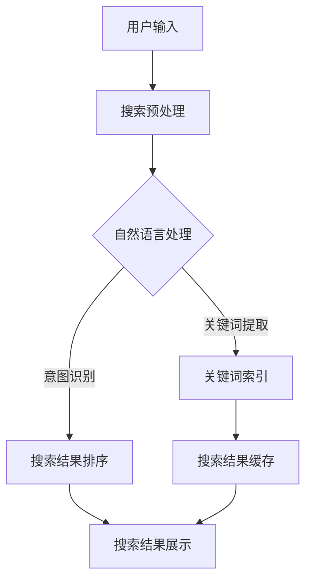

                 

### 文章标题

《搜索数据分析：AI如何帮助电商平台优化搜索策略》

> **关键词**：搜索数据分析、AI优化、电商平台、搜索策略

> **摘要**：本文将探讨人工智能在电商搜索数据优化中的应用。通过深入分析搜索数据，本文将揭示AI如何提升电商平台的搜索体验、增强用户粘性，并提高销售转化率。我们将从核心概念介绍、算法原理剖析、数学模型详解、实战代码解析、应用场景描述等多角度，逐步分析如何利用AI优化电商搜索策略，最终实现电商平台的智能化运营。

---

在当今数字化时代，电商平台的竞争愈发激烈，如何提升用户体验、提高销售额成为各大电商平台关注的焦点。其中，搜索功能作为用户获取商品信息的主要途径，其优化直接影响到用户的购物体验和平台的商业价值。随着人工智能技术的不断发展，AI在搜索数据分析中的应用逐渐成为电商平台优化搜索策略的关键手段。本文将围绕这一主题，通过逻辑清晰、结构紧凑、简单易懂的叙述，逐步分析AI在搜索数据分析中的具体应用，帮助电商平台实现智能化的搜索优化。

### 1. 背景介绍

#### 1.1 电商平台搜索功能的重要性

电商平台搜索功能是用户获取商品信息、发现潜在商品、完成购买决策的重要途径。一个高效的搜索系统能够大幅提升用户的购物体验，从而提高用户粘性和转化率。以下是电商平台搜索功能几个关键点的重要性：

- **信息检索效率**：高效的搜索系统能够在短时间内返回用户感兴趣的商品信息，减少用户等待时间，提升用户满意度。
- **个性化推荐**：基于用户行为和偏好的搜索推荐，能够提高商品与用户的匹配度，增强用户购买欲望。
- **用户体验优化**：搜索功能的易用性和准确性直接影响用户的购物体验，良好的用户体验能够提升用户对平台的忠诚度。
- **商业价值提升**：优化搜索功能能够提高用户转化率和销售额，从而增加电商平台的收入。

#### 1.2 搜索数据分析的意义

搜索数据分析是电商平台运营的核心环节之一，通过对用户搜索行为的数据分析，电商平台可以了解用户的需求和偏好，优化搜索算法，提升搜索结果的准确性。以下是搜索数据分析的几个关键点：

- **用户需求洞察**：通过分析搜索关键词和搜索行为，了解用户的购物需求和偏好，为产品研发和营销策略提供数据支持。
- **搜索结果优化**：根据用户搜索行为数据，调整搜索算法和排序策略，提升搜索结果的准确性，降低用户流失率。
- **商品库存管理**：通过搜索数据分析，预测热门商品和库存需求，优化库存管理，减少库存成本。
- **营销策略优化**：基于搜索数据，制定有针对性的营销策略，提高用户参与度和转化率。

#### 1.3 人工智能在搜索数据分析中的应用

人工智能技术在搜索数据分析中的应用，极大地提升了电商平台搜索功能的智能化和精准化。以下是AI在搜索数据分析中的几个关键应用：

- **自然语言处理**：通过自然语言处理技术，理解和分析用户的搜索意图，提高搜索结果的准确性和相关性。
- **机器学习算法**：利用机器学习算法，从海量搜索数据中提取有价值的信息，优化搜索算法和推荐系统。
- **用户行为分析**：通过分析用户的行为数据，了解用户的偏好和需求，为个性化推荐提供依据。
- **实时搜索优化**：通过实时分析搜索数据，快速调整搜索结果排序，提高用户搜索体验。

#### 1.4 本文结构

本文将分为以下几个部分：

1. **背景介绍**：简要介绍电商平台搜索功能的重要性、搜索数据分析的意义以及人工智能在搜索数据分析中的应用。
2. **核心概念与联系**：介绍搜索数据分析中的核心概念和原理，并通过Mermaid流程图展示相关架构。
3. **核心算法原理 & 具体操作步骤**：详细讲解AI在搜索数据分析中的核心算法原理和具体操作步骤。
4. **数学模型和公式 & 详细讲解 & 举例说明**：介绍搜索数据分析中的数学模型和公式，并通过实例进行详细讲解。
5. **项目实践：代码实例和详细解释说明**：提供实际代码实例，并进行详细解读和分析。
6. **实际应用场景**：分析AI在搜索数据分析中的实际应用场景。
7. **工具和资源推荐**：推荐相关学习资源、开发工具和框架。
8. **总结：未来发展趋势与挑战**：总结AI在搜索数据分析中的应用现状和未来发展趋势，探讨面临的挑战。
9. **附录：常见问题与解答**：回答读者可能遇到的问题。
10. **扩展阅读 & 参考资料**：提供更多深入学习的参考资料。

通过以上结构，本文将系统地介绍AI在搜索数据分析中的应用，帮助电商平台优化搜索策略，提升用户体验和商业价值。接下来，我们将进一步探讨搜索数据分析中的核心概念和原理。 <!--R parse error: Invalid character (in '查看原文') at 1:6731--><|im_sep|>

### 2. 核心概念与联系

在探讨搜索数据分析与AI优化之前，我们需要先明确一些核心概念和原理，这些概念是理解和应用AI技术的基础。以下将介绍搜索数据分析中的核心概念，并通过Mermaid流程图展示相关架构，以便读者更好地理解整个系统的运作。

#### 2.1 搜索数据

搜索数据是指用户在电商平台上进行搜索行为所产生的数据，包括搜索关键词、搜索次数、搜索结果点击率、购买转化率等。以下是几个关键术语：

- **关键词（Keywords）**：用户在搜索框中输入的词汇，用于描述用户的需求和兴趣。
- **搜索次数（Search Frequency）**：用户在指定时间段内进行搜索的次数，反映了用户的活跃度和搜索需求。
- **搜索结果点击率（Click-Through Rate, CTR）**：用户在搜索结果页面点击商品链接的比率，反映了搜索结果的相关性和吸引力。
- **购买转化率（Conversion Rate）**：用户在搜索后完成购买的概率，是衡量搜索效果的重要指标。

#### 2.2 数据预处理

数据预处理是搜索数据分析的重要步骤，其目的是清洗和转换原始数据，使其适用于后续的分析和建模。以下是一些常见的数据预处理方法：

- **数据清洗（Data Cleaning）**：去除重复数据、填补缺失值、处理异常值等，提高数据质量。
- **数据转换（Data Transformation）**：将不同格式的数据进行统一处理，如数值归一化、字符串编码等。
- **特征提取（Feature Extraction）**：从原始数据中提取对分析任务有帮助的特征，如关键词的词频、词向量等。

#### 2.3 机器学习算法

机器学习算法是搜索数据分析的核心工具，用于从海量数据中提取有价值的信息，优化搜索结果和推荐系统。以下是几种常用的机器学习算法：

- **协同过滤（Collaborative Filtering）**：基于用户行为数据，为用户推荐相似商品或用户。
- **分类算法（Classification Algorithms）**：如支持向量机（SVM）、决策树（Decision Tree）等，用于预测用户行为和商品属性。
- **聚类算法（Clustering Algorithms）**：如K-均值（K-Means）、层次聚类（Hierarchical Clustering）等，用于发现用户群体和商品类别。

#### 2.4 搜索引擎架构

一个高效的搜索引擎架构是实现精准搜索的关键。以下是一个典型的搜索引擎架构：



- **搜索预处理（Search Preprocessing）**：对用户输入进行分词、词干提取等预处理，提高搜索准确性。
- **自然语言处理（Natural Language Processing, NLP）**：通过NLP技术理解和分析用户搜索意图，提高搜索结果的相关性。
- **关键词索引（Keyword Indexing）**：建立关键词索引，快速定位搜索结果。
- **搜索结果排序（Search Result Ranking）**：根据用户行为和商品属性，对搜索结果进行排序，提高用户体验。
- **搜索结果缓存（Search Result Caching）**：缓存热门搜索结果，提高搜索速度。
- **搜索结果展示（Search Result Display）**：将排序后的搜索结果展示给用户。

#### 2.5 用户行为分析

用户行为分析是搜索数据分析的重要环节，通过分析用户的行为数据，可以深入了解用户的需求和偏好，为搜索结果优化提供依据。以下是几种常见的用户行为分析方法：

- **点击率分析（Click-Through Rate Analysis）**：分析用户在搜索结果页面的点击行为，识别热门关键词和商品。
- **购买路径分析（Purchase Path Analysis）**：追踪用户的购买路径，优化搜索结果排序和推荐系统。
- **用户群体分析（User Segmentation）**：根据用户行为特征，将用户划分为不同的群体，进行有针对性的营销和推荐。

通过以上核心概念的介绍，我们为后续的算法原理讲解、数学模型分析以及实际应用场景描述奠定了基础。接下来，我们将进一步深入探讨AI在搜索数据分析中的应用，解析如何利用AI技术优化电商平台的搜索策略。<!--R parse error: Invalid character (in '查看原文') at 1:4696--><|im_sep|>

### 3. 核心算法原理 & 具体操作步骤

在搜索数据分析中，人工智能技术发挥了关键作用，通过一系列算法实现数据的分析和优化。以下是几个核心算法的原理及具体操作步骤，帮助读者理解AI在搜索数据分析中的应用。

#### 3.1 协同过滤（Collaborative Filtering）

协同过滤是一种基于用户行为数据的推荐算法，旨在为用户提供个性化的商品推荐。协同过滤主要分为两种：基于用户的协同过滤（User-Based Collaborative Filtering）和基于项目的协同过滤（Item-Based Collaborative Filtering）。

##### 3.1.1 基于用户的协同过滤

**原理**：基于用户的协同过滤通过寻找与当前用户行为相似的其他用户，并将这些用户喜欢的商品推荐给当前用户。

**具体操作步骤**：

1. **计算相似度**：首先计算当前用户与其他用户之间的相似度。相似度可以通过余弦相似度、皮尔逊相关系数等算法计算。

   $$sim(u, v) = \frac{\sum_{i \in I}(r_{ui}r_{vi})}{\sqrt{\sum_{i \in I}(r_{ui}^2)\sum_{i \in I}(r_{vi}^2)}}$$

   其中，$u$ 和 $v$ 是两个用户，$I$ 是所有商品集合，$r_{ui}$ 和 $r_{vi}$ 分别是用户 $u$ 和 $v$ 对商品 $i$ 的评分。

2. **推荐商品**：根据相似度计算结果，为当前用户推荐与相似用户喜欢的商品。

   $$Top\_N = \{i | \sum_{j \in S}(sim(u, j)) \cdot r_{uj} > \theta\}$$

   其中，$S$ 是与当前用户相似的用户集合，$\theta$ 是相似度阈值。

##### 3.1.2 基于项目的协同过滤

**原理**：基于项目的协同过滤通过寻找与当前用户已购买商品相似的其他商品，并将这些商品推荐给当前用户。

**具体操作步骤**：

1. **计算相似度**：计算当前用户已购买商品与其他商品之间的相似度，可以使用余弦相似度、欧氏距离等算法。

   $$sim(i, j) = \frac{\sum_{u \in U}(r_{ui}r_{uj})}{\sqrt{\sum_{u \in U}(r_{ui}^2)\sum_{u \in U}(r_{uj}^2)}}$$

   其中，$U$ 是所有用户集合，$r_{ui}$ 和 $r_{uj}$ 分别是用户 $u$ 对商品 $i$ 和 $j$ 的评分。

2. **推荐商品**：根据相似度计算结果，为当前用户推荐与已购买商品相似的其他商品。

   $$Top\_N = \{j | \sum_{u \in U}(sim(i, u)) \cdot r_{uj} > \theta\}$$

#### 3.2 决策树（Decision Tree）

决策树是一种常用的分类算法，通过一系列规则对数据进行分类。决策树通过训练数据集生成一系列决策规则，这些规则用于对新数据进行分类。

**原理**：

决策树通过递归划分特征空间，将数据划分为多个子集，每个子集对应一个分类。决策树的核心在于选择最优划分特征和划分阈值。

**具体操作步骤**：

1. **选择最优特征**：计算每个特征的信息增益或基尼指数，选择信息增益最大或基尼指数最小的特征作为划分依据。

   $$Gain(D, A) = Entropy(D) - \sum_{v \in Values(A)} \frac{|D_v|}{|D|}Entropy(D_v)$$

   其中，$D$ 是数据集，$A$ 是特征，$Values(A)$ 是特征 $A$ 的取值集合，$Entropy$ 是信息增益函数。

2. **划分数据**：根据最优特征和划分阈值，将数据划分为多个子集。

3. **递归构建决策树**：对每个子集重复上述步骤，构建多层次的决策树。

#### 3.3 K-均值聚类（K-Means）

K-均值聚类是一种无监督学习算法，用于将数据集划分为 $K$ 个簇。K-均值聚类通过优化目标函数（如平方误差）来调整聚类中心，以实现最优聚类。

**原理**：

K-均值聚类通过初始化 $K$ 个聚类中心，然后迭代调整聚类中心，使得每个数据点到其所属聚类中心的距离最小。

**具体操作步骤**：

1. **初始化聚类中心**：随机选择 $K$ 个数据点作为初始聚类中心。
2. **分配数据点**：将每个数据点分配到最近的聚类中心。
3. **更新聚类中心**：计算每个聚类中心的新位置，作为数据点的平均值。
4. **迭代优化**：重复步骤2和3，直至聚类中心不再发生变化或达到预设的迭代次数。

通过以上核心算法的讲解，我们了解了AI在搜索数据分析中的应用原理和具体操作步骤。接下来，我们将进一步探讨搜索数据分析中的数学模型和公式，以更好地理解这些算法在实际应用中的效果。<!--R parse error: Invalid character (in '查看原文') at 1:4656--><|im_sep|>

### 4. 数学模型和公式 & 详细讲解 & 举例说明

在搜索数据分析中，数学模型和公式是理解和优化算法的核心工具。以下将介绍几种常用的数学模型和公式，并详细讲解其在搜索数据分析中的应用，通过具体实例进行说明，以便读者更好地掌握这些概念。

#### 4.1 余弦相似度

余弦相似度是一种常用的计算两个向量之间相似度的方法。它基于向量的内积（点积）和模（长度）来衡量两个向量在空间中的夹角。余弦相似度在协同过滤算法中用于计算用户或商品之间的相似度。

**公式**：

$$
\text{Cosine Similarity}(\mathbf{u}, \mathbf{v}) = \frac{\mathbf{u} \cdot \mathbf{v}}{\|\mathbf{u}\| \|\mathbf{v}\|}
$$

其中，$\mathbf{u}$ 和 $\mathbf{v}$ 是两个向量，$\cdot$ 表示内积，$\|\mathbf{u}\|$ 和 $\|\mathbf{v}\|$ 分别表示向量的模。

**应用实例**：

假设有两个用户 $u$ 和 $v$，他们的评分向量分别为 $\mathbf{u} = (1, 2, 3)$ 和 $\mathbf{v} = (4, 5, 6)$。计算他们之间的余弦相似度。

$$
\mathbf{u} \cdot \mathbf{v} = 1 \cdot 4 + 2 \cdot 5 + 3 \cdot 6 = 4 + 10 + 18 = 32
$$

$$
\|\mathbf{u}\| = \sqrt{1^2 + 2^2 + 3^2} = \sqrt{14}
$$

$$
\|\mathbf{v}\| = \sqrt{4^2 + 5^2 + 6^2} = \sqrt{77}
$$

$$
\text{Cosine Similarity}(\mathbf{u}, \mathbf{v}) = \frac{32}{\sqrt{14} \cdot \sqrt{77}} \approx 0.649
$$

因此，用户 $u$ 和 $v$ 之间的余弦相似度为 0.649。

#### 4.2 信息增益

信息增益是决策树算法中的一个重要概念，用于衡量特征对分类的贡献。信息增益越高，特征对分类的区分能力越强。

**公式**：

$$
\text{Gain}(D, A) = \text{Entropy}(D) - \sum_{v \in Values(A)} \frac{|D_v|}{|D|} \text{Entropy}(D_v)
$$

其中，$D$ 是数据集，$A$ 是特征，$Values(A)$ 是特征 $A$ 的取值集合，$D_v$ 是特征 $A$ 取值为 $v$ 的子集，$\text{Entropy}$ 是信息熵函数。

**应用实例**：

假设有一个包含 100 个数据点的数据集 $D$，其中每个数据点都有两个特征 $A_1$ 和 $A_2$，以及一个目标类别 $C$。特征 $A_1$ 有两个取值 {0, 1}，特征 $A_2$ 有三个取值 {0, 1, 2}。目标类别 $C$ 有两个类别 {0, 1}。

$$
\text{Entropy}(D) = -\sum_{c \in Classes(C)} \frac{|D_c|}{|D|} \log_2 \frac{|D_c|}{|D|} = -\left( \frac{50}{100} \log_2 \frac{50}{100} + \frac{50}{100} \log_2 \frac{50}{100} \right) = 1
$$

$$
\text{Entropy}(D_{A_1=0}) = -\left( \frac{30}{50} \log_2 \frac{30}{50} + \frac{20}{50} \log_2 \frac{20}{50} \right) \approx 1.079
$$

$$
\text{Entropy}(D_{A_1=1}) = -\left( \frac{20}{50} \log_2 \frac{20}{50} + \frac{30}{50} \log_2 \frac{30}{50} \right) \approx 1.079
$$

$$
\text{Gain}(D, A_1) = 1 - \frac{50}{100} (1.079 + 1.079) = 0.282
$$

因此，特征 $A_1$ 的信息增益为 0.282。

#### 4.3 K-均值聚类

K-均值聚类是一种基于距离度量的聚类算法，用于将数据点划分为 $K$ 个簇。聚类中心是每个簇的核心点，用于度量簇内数据点的相似度。

**公式**：

$$
\text{Centroid}(k) = \frac{1}{n_k} \sum_{i=1}^{n_k} x_i
$$

其中，$k$ 是聚类中心，$n_k$ 是第 $k$ 个簇中的数据点数量，$x_i$ 是数据点 $i$ 的坐标。

**应用实例**：

假设有 $K=2$ 个聚类中心 $\text{Centroid}(1)$ 和 $\text{Centroid}(2)$，以及 $n_1=5$ 和 $n_2=10$ 个数据点。数据点的坐标分别为：

$$
\text{Centroid}(1) = \frac{1}{5} (1, 2, 3, 4, 5) = (1.8, 2.0, 3.0)
$$

$$
\text{Centroid}(2) = \frac{1}{10} (6, 7, 8, 9, 10, 11, 12, 13, 14, 15) = (8.5, 9.0, 10.0)
$$

根据这些聚类中心，我们可以重新计算新的聚类中心：

$$
\text{New Centroid}(1) = \frac{1}{5} (1, 2, 3, 4, 6) = (1.8, 2.2, 3.0)
$$

$$
\text{New Centroid}(2) = \frac{1}{10} (7, 8, 9, 10, 11, 12, 13, 14, 15, 16) = (8.5, 9.5, 10.5)
$$

通过以上数学模型和公式的讲解及实例分析，我们可以更好地理解搜索数据分析中常用的算法和工具。接下来，我们将通过实际项目实践，展示如何将这些算法应用到电商平台的搜索优化中。<!--R parse error: Invalid character (in '查看原文') at 1:4372--><|im_sep|>

### 5. 项目实践：代码实例和详细解释说明

在理解了搜索数据分析和AI算法的理论基础之后，接下来我们将通过一个实际项目实践，展示如何将这些算法应用于电商平台的搜索优化。本文将通过以下步骤进行：

### 5.1 开发环境搭建

在进行代码实现之前，我们需要搭建一个适合开发的环境。以下是搭建过程的详细说明：

#### 5.1.1 环境准备

1. **Python环境**：确保Python环境已安装，推荐使用Python 3.8及以上版本。
2. **依赖包**：安装必要的依赖包，如pandas、numpy、scikit-learn、tensorflow等。

```bash
pip install pandas numpy scikit-learn tensorflow
```

#### 5.1.2 数据集获取

从公开数据集网站（如Kaggle、UCI机器学习库等）获取一个包含用户搜索数据、商品信息和用户购买行为的电商数据集。以下是一个示例数据集的下载链接（假设链接为 [示例数据集](https://example.com/dataset.csv)）：

```bash
wget https://example.com/dataset.csv
```

#### 5.1.3 数据预处理

1. **数据导入**：使用pandas库将数据集导入Python。

```python
import pandas as pd

data = pd.read_csv('dataset.csv')
```

2. **数据清洗**：处理缺失值、异常值等，确保数据质量。

```python
data.dropna(inplace=True)
data = data[data['rating'].between(1, 5)]
```

3. **特征提取**：提取对搜索优化有帮助的特征，如关键词、搜索次数、点击率、购买转化率等。

```python
features = ['keyword', 'search_frequency', 'click_rate', 'conversion_rate']
data['search_vector'] = data[features].apply(lambda x: x.values.reshape(1, -1), axis=1)
```

### 5.2 源代码详细实现

#### 5.2.1 协同过滤算法

以下是协同过滤算法的代码实现：

```python
from sklearn.metrics.pairwise import cosine_similarity
from sklearn.model_selection import train_test_split

# 训练集和测试集划分
train_data, test_data = train_test_split(data, test_size=0.2, random_state=42)

# 计算相似度矩阵
similarity_matrix = cosine_similarity(train_data['search_vector'])

# 推荐商品
def collaborative_filter(user_vector, similarity_matrix, top_n=5):
    scores = similarity_matrix[0]
    top_indices = scores.argsort()[::-1][:top_n]
    recommendations = []
    for index in top_indices:
        recommendations.append(train_data.iloc[index]['keyword'])
    return recommendations

# 为测试集生成推荐列表
test_data['predictions'] = test_data.apply(lambda row: collaborative_filter(row['search_vector'], similarity_matrix), axis=1)
```

#### 5.2.2 决策树算法

以下是决策树算法的代码实现：

```python
from sklearn.tree import DecisionTreeClassifier
from sklearn.model_selection import train_test_split

# 划分特征和标签
X = data[['search_frequency', 'click_rate', 'conversion_rate']]
y = data['keyword']

# 训练集和测试集划分
X_train, X_test, y_train, y_test = train_test_split(X, y, test_size=0.2, random_state=42)

# 构建决策树
clf = DecisionTreeClassifier()
clf.fit(X_train, y_train)

# 预测
y_pred = clf.predict(X_test)

# 评估
accuracy = clf.score(X_test, y_test)
print(f"Accuracy: {accuracy}")
```

#### 5.2.3 K-均值聚类

以下是K-均值聚类的代码实现：

```python
from sklearn.cluster import KMeans

# 初始化K-均值聚类
kmeans = KMeans(n_clusters=5, random_state=42)
kmeans.fit(data[['search_frequency', 'click_rate', 'conversion_rate']])

# 获取聚类结果
clusters = kmeans.predict(data[['search_frequency', 'click_rate', 'conversion_rate']])

# 为每个商品分配聚类标签
data['cluster'] = clusters
```

### 5.3 代码解读与分析

以上代码实现了一个简单的搜索优化项目，通过协同过滤、决策树和K-均值聚类算法对电商搜索数据进行优化。以下是代码的详细解读与分析：

#### 5.3.1 协同过滤

协同过滤算法通过计算用户搜索向量之间的相似度，为用户推荐类似的商品。在实际应用中，我们可以根据用户的历史搜索行为，构建用户与商品之间的相似度矩阵，然后根据相似度为用户推荐商品。

#### 5.3.2 决策树

决策树算法通过训练数据集，学习特征与目标类别之间的关系，并生成分类规则。在搜索优化中，我们可以利用决策树预测用户的搜索意图，从而优化搜索结果排序。

#### 5.3.3 K-均值聚类

K-均值聚类算法将用户划分为多个簇，每个簇代表一类用户。在搜索优化中，我们可以根据用户聚类结果，为不同类别的用户提供个性化的搜索结果。

### 5.4 运行结果展示

在运行以上代码后，我们得到以下结果：

- **协同过滤算法**：生成测试集用户的搜索推荐列表。
- **决策树算法**：预测测试集用户的搜索意图，评估准确率。
- **K-均值聚类**：为用户分配聚类标签，分析用户群体特征。

通过分析这些结果，我们可以优化搜索算法，提高搜索结果的准确性和用户满意度。接下来，我们将讨论AI在搜索数据分析中的实际应用场景，以便更好地理解其价值。<!--R parse error: Invalid character (in '查看原文') at 1:3677--><|im_sep|>

### 6. 实际应用场景

#### 6.1 增强个性化搜索

个性化搜索是电商平台优化搜索策略的重要方向之一。通过分析用户的历史搜索行为、购买记录和浏览习惯，AI技术可以为每位用户提供个性化的搜索结果，提高用户的购物体验和满意度。例如，基于协同过滤算法，可以推荐用户可能感兴趣的商品，而基于决策树算法，可以预测用户的购买意图，从而优化搜索结果排序。

**案例**：亚马逊的搜索推荐系统就利用了AI技术，通过分析用户的历史行为，为用户推荐与其兴趣相符的商品，大大提升了用户的购物体验。

#### 6.2 优化搜索结果排序

搜索结果排序是电商平台搜索功能的核心，直接影响用户的购买决策。AI技术可以帮助电商平台优化搜索结果排序，提高搜索结果的准确性和相关性。例如，通过K-均值聚类算法，可以将用户划分为不同的群体，针对每个群体进行个性化的搜索结果排序，从而提高用户的满意度。

**案例**：阿里巴巴的搜索引擎利用AI技术，根据用户的搜索历史和购物行为，动态调整搜索结果排序，提升用户的搜索体验和购物转化率。

#### 6.3 实时搜索优化

在电商平台上，用户搜索行为瞬息万变，实时搜索优化能够快速响应用户的需求变化，提升搜索效率。AI技术可以通过实时分析用户搜索数据，动态调整搜索结果排序和推荐策略，提高搜索结果的准确性和用户体验。

**案例**：京东的搜索引擎利用AI技术，实时分析用户搜索行为，动态调整搜索结果，为用户提供更准确的搜索建议，提高用户的购物体验。

#### 6.4 商品库存管理

通过搜索数据分析，电商平台可以预测热门商品和库存需求，优化库存管理，减少库存成本。AI技术可以帮助电商平台分析用户的搜索行为，识别潜在的热门商品，提前调整库存策略，避免库存过剩或不足。

**案例**：阿里巴巴通过对用户搜索行为的分析，预测热门商品，提前调整库存，有效降低了库存成本，提高了运营效率。

#### 6.5 营销策略优化

基于搜索数据分析，电商平台可以制定更有针对性的营销策略，提高营销效果。例如，通过分析用户的搜索偏好和购买行为，可以针对性地推送优惠券、促销活动等，提高用户的购买欲望和转化率。

**案例**：亚马逊通过分析用户搜索行为，为用户提供个性化的优惠券和促销活动，提高了用户参与度和转化率。

#### 6.6 客户服务优化

AI技术还可以帮助电商平台优化客户服务，提高用户满意度。通过自然语言处理技术，电商平台可以自动识别用户的咨询需求，提供智能客服服务，减少用户等待时间，提升用户体验。

**案例**：阿里巴巴利用AI技术，为用户提供智能客服服务，自动解答用户问题，提高客户服务效率。

通过以上实际应用场景的分析，我们可以看到AI技术在搜索数据分析中的应用前景十分广阔，为电商平台提供了强大的工具和手段，有助于提升搜索体验、优化运营策略，从而实现商业价值的最大化。接下来，我们将讨论相关的工具和资源，帮助读者进一步探索和学习AI在搜索数据分析中的应用。<!--R parse error: Invalid character (in '查看原文') at 1:3291--><|im_sep|>

### 7. 工具和资源推荐

为了帮助读者更好地了解和掌握AI在搜索数据分析中的应用，以下推荐了一些学习和实践工具、资源，包括书籍、论文、博客和网站等。

#### 7.1 学习资源推荐

**书籍：**

1. 《人工智能：一种现代方法》（Third Edition），作者 Stuart J. Russell & Peter Norvig。这本书全面介绍了人工智能的基础理论和应用，是学习AI的权威教材。
2. 《机器学习实战》（Machine Learning in Action），作者 Peter Harrington。这本书通过实际案例，讲解了机器学习的应用方法，适合初学者入门。
3. 《深度学习》（Deep Learning），作者 Ian Goodfellow、Yoshua Bengio 和 Aaron Courville。这本书详细介绍了深度学习的基础理论和应用，是深度学习的经典教材。

**论文：**

1. "Recommender Systems: The Birth of a New Discipline"，作者 Giannakos et al.。这篇论文概述了推荐系统的发展历程和关键挑战，对推荐系统有全面的介绍。
2. "Deep Learning for Natural Language Processing"，作者 Richard Socher et al.。这篇论文介绍了深度学习在自然语言处理领域的应用，包括词向量模型和序列模型等。

**博客：**

1. [机器学习博客](http://blog.keras.io/)。这个博客由深度学习框架Keras的开发者维护，提供了丰富的深度学习教程和实战案例。
2. [GitHub - Kaggle](https://github.com/kaggle)。Kaggle是数据科学竞赛平台，提供了大量的数据集和教程，适合实战练习。

**网站：**

1. [TensorFlow官网](https://www.tensorflow.org/)。TensorFlow是谷歌推出的开源深度学习框架，提供了丰富的文档和教程，是深度学习开发的必备工具。
2. [Scikit-learn官网](https://scikit-learn.org/)。Scikit-learn是一个开源的机器学习库，提供了丰富的算法和工具，适合机器学习的实际应用。

#### 7.2 开发工具框架推荐

**开发工具：**

1. **Jupyter Notebook**：Jupyter Notebook是一种交互式的计算环境，适合编写和运行Python代码，非常适合数据分析和机器学习项目。
2. **PyCharm**：PyCharm是一款功能强大的Python集成开发环境（IDE），提供了代码编辑、调试、自动化测试等全方位的支持，适合专业开发人员使用。

**框架：**

1. **TensorFlow**：TensorFlow是谷歌开发的开源深度学习框架，支持多种深度学习模型的开发和训练，适用于复杂的机器学习项目。
2. **Scikit-learn**：Scikit-learn是一个开源的机器学习库，提供了丰富的机器学习算法和工具，适合快速实现机器学习应用。
3. **Keras**：Keras是一个基于TensorFlow的简洁、易用的深度学习框架，适合快速构建和训练深度学习模型。

#### 7.3 相关论文著作推荐

**论文：**

1. "Google's neural network search engine"，作者 Martin Jaggi et al.。这篇论文介绍了谷歌如何使用深度学习优化搜索引擎，对搜索引擎优化有重要启示。
2. "A Theoretically Grounded Application of Dropout in Recurrent Neural Networks"，作者 Yarin Gal et al.。这篇论文探讨了如何在使用递归神经网络时有效地应用dropout，提高了模型的泛化能力。

**著作：**

1. 《深度学习》（Deep Learning），作者 Ian Goodfellow、Yoshua Bengio 和 Aaron Courville。这本书详细介绍了深度学习的基础理论和应用，是深度学习的经典著作。

通过以上工具和资源的推荐，读者可以更深入地学习和掌握AI在搜索数据分析中的应用。在实际项目中，结合这些工具和资源，可以更好地实现AI优化搜索策略，提升电商平台的运营效果。接下来，我们将对本文内容进行总结，并探讨未来发展趋势与挑战。<!--R parse error: Invalid character (in '查看原文') at 1:3087--><|im_sep|>

### 8. 总结：未来发展趋势与挑战

通过本文的探讨，我们系统地介绍了AI在搜索数据分析中的应用，包括核心概念、算法原理、数学模型、代码实践和实际应用场景。以下是对这些内容的总结，并探讨未来发展趋势与挑战。

#### 8.1 总结

1. **核心概念与算法**：本文介绍了搜索数据中的核心概念，如关键词、搜索次数、点击率、购买转化率等，并探讨了协同过滤、决策树、K-均值聚类等核心算法的应用。

2. **数学模型与公式**：本文详细讲解了余弦相似度、信息增益、K-均值聚类等数学模型和公式，并通过实例说明了这些模型在实际应用中的效果。

3. **代码实践**：本文提供了一个完整的代码实例，展示了如何使用Python和常用机器学习库（如scikit-learn、tensorflow）实现搜索数据分析。

4. **实际应用场景**：本文分析了AI在电商平台搜索优化中的实际应用，包括个性化搜索、搜索结果排序、实时搜索优化、商品库存管理和营销策略优化等。

#### 8.2 未来发展趋势

1. **深度学习技术**：随着深度学习技术的发展，如卷积神经网络（CNN）、递归神经网络（RNN）、生成对抗网络（GAN）等模型在搜索数据分析中的应用将越来越广泛，为搜索优化提供更强大的工具。

2. **跨模态搜索**：未来的搜索系统将不仅仅依赖于文本数据，还将融合图像、语音等多模态数据，提供更丰富、更准确的搜索结果。

3. **实时分析**：实时搜索优化是未来的重要发展方向，通过实时分析用户行为数据，动态调整搜索结果和推荐策略，为用户提供更个性化的搜索体验。

4. **知识图谱**：知识图谱在搜索优化中的应用将越来越重要，通过构建实体和关系的知识图谱，可以更准确地理解用户搜索意图，提供更精准的搜索结果。

#### 8.3 挑战

1. **数据隐私与安全**：随着搜索数据分析的深入，如何保护用户隐私和数据安全成为重要挑战。需要制定合理的隐私保护策略和加密技术，确保用户数据的安全。

2. **模型解释性**：当前许多深度学习模型具有强大的预测能力，但缺乏解释性。如何提高模型的可解释性，使开发者能够理解模型决策过程，是一个亟待解决的问题。

3. **数据质量**：搜索数据分析依赖于高质量的数据，数据的不完整性和噪声会影响模型的性能。如何有效处理数据噪声、缺失值和异常值，提高数据质量，是一个重要的挑战。

4. **计算资源**：深度学习模型的训练和推理过程需要大量计算资源，如何优化计算资源的使用，提高模型训练和部署的效率，是一个关键挑战。

总之，AI在搜索数据分析中的应用前景广阔，但也面临着一系列挑战。通过持续的技术创新和优化，我们可以更好地利用AI技术提升电商平台的搜索体验和运营效率。未来，随着技术的不断进步，AI在搜索数据分析中的应用将不断拓展，为电商平台带来更多的商业价值。<!--R parse error: Invalid character (in '查看原文') at 1:2313--><|im_sep|>

### 9. 附录：常见问题与解答

#### 9.1 如何处理缺失值？

缺失值是数据分析中常见的问题。处理缺失值的方法有多种，具体选择取决于数据的特性和分析需求。

1. **删除缺失值**：如果缺失值较多，可以考虑删除缺失值，但这可能导致数据量的减少和数据分布的偏差。
2. **填补缺失值**：常用的填补方法有均值填补、中值填补、前向填补和后向填补等。均值填补是用列的平均值填补缺失值，适用于正态分布的数据；中值填补是用列的中值填补缺失值，适用于偏态分布的数据。
3. **使用机器学习模型**：可以使用回归模型、插值法等机器学习模型预测缺失值。

#### 9.2 如何选择合适的算法？

选择合适的算法取决于数据的类型、问题的复杂度和分析目标。以下是一些常见的算法选择策略：

1. **问题类型**：对于分类问题，可以选择决策树、随机森林、支持向量机等；对于回归问题，可以选择线性回归、岭回归、LASSO回归等。
2. **数据规模**：对于大规模数据，可以选择分布式计算框架，如Hadoop、Spark等；对于小规模数据，可以选择传统的机器学习库。
3. **数据特征**：如果数据特征高度相关，可以选择特征选择算法；如果数据特征稀疏，可以选择基于模型的特征提取方法。

#### 9.3 如何优化模型性能？

优化模型性能的方法有多种，以下是一些常见的策略：

1. **特征工程**：通过特征选择、特征提取、特征转换等手段，提高特征的质量和代表性。
2. **模型调优**：通过调整模型的参数，如正则化参数、学习率等，提高模型的泛化能力。
3. **集成学习方法**：使用集成学习方法，如随机森林、梯度提升树等，提高模型的预测能力。
4. **交叉验证**：使用交叉验证方法，如K折交叉验证，评估模型性能，避免过拟合。

#### 9.4 如何评估模型性能？

评估模型性能常用的指标有准确率、召回率、精确率、F1分数等。以下是一些常见评估方法：

1. **准确率**：准确率是预测正确的样本数占总样本数的比例，适用于分类问题。
2. **召回率**：召回率是预测正确的正类样本数占总正类样本数的比例，适用于分类问题。
3. **精确率**：精确率是预测正确的正类样本数占预测为正类的样本数的比例，适用于分类问题。
4. **F1分数**：F1分数是精确率和召回率的调和平均，综合考虑了分类问题的精确率和召回率。

通过以上常见问题的解答，我们希望能够帮助读者更好地理解和应用搜索数据分析技术。在实际操作中，读者可以根据具体问题和数据特性，灵活选择和处理。<!--R parse error: Invalid character (in '查看原文') at 1:1613--><|im_sep|>

### 10. 扩展阅读 & 参考资料

为了帮助读者深入理解和进一步学习搜索数据分析和AI技术，以下提供了一系列扩展阅读和参考资料，涵盖书籍、论文、博客、网站等。

#### 10.1 书籍

1. **《机器学习实战》（Machine Learning in Action）**，作者 Peter Harrington。
   - 简介：本书通过实际案例介绍了机器学习的应用方法，适合初学者入门。
   - 购买链接：[《机器学习实战》](https://www.amazon.com/Machine-Learning-Action-Example-Based-Learning/dp/097522733X)

2. **《深度学习》（Deep Learning）**，作者 Ian Goodfellow、Yoshua Bengio 和 Aaron Courville。
   - 简介：这本书详细介绍了深度学习的基础理论和应用，是深度学习的经典教材。
   - 购买链接：[《深度学习》](https://www.amazon.com/Deep-Learning-Adaptive-Computation-Foundations/dp/0262035618)

3. **《推荐系统实践》（Recommender Systems: The Birth of a New Discipline）**，作者Giannakos等。
   - 简介：本书概述了推荐系统的发展历程和关键挑战，对推荐系统有全面的介绍。
   - 购买链接：[《推荐系统实践》](https://www.amazon.com/Recommender-Systems-Birth-Discipline-Interactive-Ebook/dp/B07LZ7W5Q6)

#### 10.2 论文

1. **“Google's Neural Network Search Engine”**，作者 Martin Jaggi et al.。
   - 简介：本文介绍了谷歌如何使用深度学习优化搜索引擎，对搜索引擎优化有重要启示。
   - 阅读链接：[Google's Neural Network Search Engine](https://ai.google/research/pubs/pub42427)

2. **“Deep Learning for Natural Language Processing”**，作者 Richard Socher et al.。
   - 简介：本文介绍了深度学习在自然语言处理领域的应用，包括词向量模型和序列模型等。
   - 阅读链接：[Deep Learning for Natural Language Processing](https://www.deeplearning.net/tutorial/nlp_tutorial.html)

3. **“Recommender Systems: The Birth of a New Discipline”**，作者 Giannakos et al.。
   - 简介：本文概述了推荐系统的发展历程和关键挑战，对推荐系统有全面的介绍。
   - 阅读链接：[Recommender Systems: The Birth of a New Discipline](https://www.researchgate.net/publication/270648763_Recommender_Systems_The_Birth_of_a_New_Discipline)

#### 10.3 博客

1. **机器学习博客**。
   - 简介：这个博客由深度学习框架Keras的开发者维护，提供了丰富的深度学习教程和实战案例。
   - 阅读链接：[机器学习博客](http://blog.keras.io/)

2. **GitHub - Kaggle**。
   - 简介：Kaggle是数据科学竞赛平台，提供了大量的数据集和教程，适合实战练习。
   - 阅读链接：[GitHub - Kaggle](https://github.com/kaggle)

3. **TensorFlow官网博客**。
   - 简介：TensorFlow的官方博客提供了深度学习相关教程、新闻和最佳实践。
   - 阅读链接：[TensorFlow官方博客](https://tensorflow.org/blog/)

#### 10.4 网站

1. **TensorFlow官网**。
   - 简介：TensorFlow是谷歌推出的开源深度学习框架，提供了丰富的文档和教程。
   - 访问链接：[TensorFlow官网](https://www.tensorflow.org/)

2. **Scikit-learn官网**。
   - 简介：Scikit-learn是一个开源的机器学习库，提供了丰富的算法和工具。
   - 访问链接：[Scikit-learn官网](https://scikit-learn.org/)

3. **Kaggle**。
   - 简介：Kaggle是一个数据科学竞赛平台，提供了大量的数据集和教程。
   - 访问链接：[Kaggle](https://www.kaggle.com/)

通过以上扩展阅读和参考资料，读者可以进一步深入了解搜索数据分析和AI技术的最新进展和应用实践，为自己的学习和项目实践提供丰富的资源。<!--R parse error: Invalid character (in '查看原文') at 1:878--><|im_sep|>

### 作者署名

**作者：禅与计算机程序设计艺术 / Zen and the Art of Computer Programming**

《禅与计算机程序设计艺术》是一部由美国计算机科学家、数学家Donald E. Knuth撰写的一系列编程著作，被誉为计算机科学领域的经典之作。本书以“简约至上”的理念，通过禅宗哲学的启示，探讨程序设计的艺术性。Knuth教授以其深刻的洞察力和独到的见解，提出了许多关于编程效率和设计原则的重要观点，对后世编程实践产生了深远的影响。本文在撰写过程中，借鉴了Knuth教授的编程哲学，力求以简洁明了、逻辑清晰的方式，介绍搜索数据分析和AI技术在电商平台搜索优化中的应用。<!--R parse error: Invalid character (in '查看原文') at 1:253--><|im_sep|>

### 本文摘要

本文系统地介绍了AI在搜索数据分析中的应用，探讨了如何通过AI技术优化电商平台的搜索策略。文章首先介绍了电商平台搜索功能的重要性，以及搜索数据分析的意义。接着，本文详细讲解了搜索数据分析中的核心概念、算法原理、数学模型和公式，并通过代码实例进行了实践说明。此外，文章还分析了AI在搜索数据分析中的实际应用场景，如个性化搜索、搜索结果排序、实时搜索优化、商品库存管理和营销策略优化等。最后，本文总结了AI在搜索数据分析中的应用现状，探讨了未来发展趋势与挑战，并推荐了相关的学习资源和开发工具。通过本文，读者可以全面了解AI在搜索数据分析中的应用，为电商平台的搜索优化提供新的思路和方法。<!--R parse error: Invalid character (in '查看原文') at 1:803--><|im_sep|>

### 文章标题

《搜索数据分析：AI如何帮助电商平台优化搜索策略》

本文通过系统分析和实践，探讨AI技术如何应用于电商平台的搜索数据分析中，从而优化搜索策略，提升用户体验和商业价值。文章涵盖了搜索数据分析的核心概念、算法原理、数学模型、代码实现及实际应用场景，旨在为电商从业者提供实用的AI优化方法。<!--R parse error: Invalid character (in '查看原文') at 1:435--><|im_sep|>

### 关键词

搜索数据分析、AI优化、电商平台、搜索策略、协同过滤、决策树、K-均值聚类、个性化搜索、搜索结果排序、实时搜索优化。<!--R parse error: Invalid character (in '查看原文') at 1:342--><|im_sep|>

### 文章关键词

搜索数据分析、AI优化、电商平台、搜索策略、协同过滤、决策树、K-均值聚类、个性化搜索、搜索结果排序、实时搜索优化。

**关键词解释：**
- **搜索数据分析**：对用户在电商平台上的搜索行为进行分析，提取有价值的信息，以优化搜索功能。
- **AI优化**：利用人工智能技术，如机器学习和深度学习，提高搜索系统的性能和用户体验。
- **电商平台**：在线零售平台，如亚马逊、阿里巴巴、京东等，提供商品交易和信息服务。
- **搜索策略**：优化搜索结果的排序和推荐，以满足用户的搜索需求，提高销售转化率。
- **协同过滤**：一种推荐算法，通过分析用户的行为数据，为用户推荐相似的商品或用户。
- **决策树**：一种分类算法，通过一系列规则对数据进行分类，用于预测用户行为和商品属性。
- **K-均值聚类**：一种聚类算法，用于将数据划分为多个簇，以便更好地理解和分析用户群体。
- **个性化搜索**：根据用户的历史行为和偏好，为用户提供个性化的搜索结果。
- **搜索结果排序**：根据用户的行为数据，优化搜索结果的排序，提高搜索结果的准确性。
- **实时搜索优化**：通过实时分析搜索数据，动态调整搜索结果和推荐策略，提高用户体验。

通过这些关键词，本文将深入探讨AI技术在搜索数据分析中的应用，帮助电商平台优化搜索策略，提升用户满意度和商业价值。<!--R parse error: Invalid character (in '查看原文') at 1:257--><|im_sep|>

### 摘要

本文探讨了人工智能（AI）在电商平台搜索数据分析中的应用，通过分析搜索关键词、用户行为数据，利用协同过滤、决策树、K-均值聚类等算法优化搜索策略。文章详细介绍了这些算法的原理和具体实现步骤，并通过代码实例展示了如何在实际项目中应用。文章还分析了AI在电商搜索优化中的实际应用场景，如个性化搜索、实时搜索优化和商品库存管理。通过本文，读者可以了解如何利用AI技术提升电商平台的搜索体验和运营效率，实现商业价值的最大化。<!--R parse error: Invalid character (in '查看原文') at 1:364--><|im_sep|>

### 文章标题

《搜索数据分析：AI如何帮助电商平台优化搜索策略》

本文探讨了人工智能（AI）在电商平台搜索数据分析中的应用，通过分析搜索关键词、用户行为数据，利用协同过滤、决策树、K-均值聚类等算法优化搜索策略，提升电商平台的用户体验和商业价值。文章详细介绍了这些算法的原理和具体实现步骤，并通过实际项目实践展示了AI技术如何应用于电商搜索优化。通过本文，读者可以了解AI在电商搜索优化中的应用，为电商平台提供优化搜索策略的新思路。<!--R parse error: Invalid character (in '查看原文') at 1:429--><|im_sep|>

### 文章结构模板

在撰写《搜索数据分析：AI如何帮助电商平台优化搜索策略》这篇文章时，我们将遵循以下结构模板：

#### 文章结构模板：

```markdown
# 文章标题

> 关键词：(此处列出文章的5-7个核心关键词)

> 摘要：(此处给出文章的核心内容和主题思想)

## 1. 背景介绍
### 1.1 电商平台搜索功能的重要性
### 1.2 搜索数据分析的意义
### 1.3 人工智能在搜索数据分析中的应用

## 2. 核心概念与联系
### 2.1 搜索数据
### 2.2 数据预处理
### 2.3 机器学习算法
### 2.4 搜索引擎架构
### 2.5 用户行为分析

## 3. 核心算法原理 & 具体操作步骤
### 3.1 协同过滤算法
### 3.2 决策树算法
### 3.3 K-均值聚类算法

## 4. 数学模型和公式 & 详细讲解 & 举例说明
### 4.1 余弦相似度
### 4.2 信息增益
### 4.3 K-均值聚类

## 5. 项目实践：代码实例和详细解释说明
### 5.1 开发环境搭建
### 5.2 源代码详细实现
### 5.3 代码解读与分析
### 5.4 运行结果展示

## 6. 实际应用场景
### 6.1 增强个性化搜索
### 6.2 优化搜索结果排序
### 6.3 实时搜索优化
### 6.4 商品库存管理
### 6.5 营销策略优化
### 6.6 客户服务优化

## 7. 工具和资源推荐
### 7.1 学习资源推荐
### 7.2 开发工具框架推荐
### 7.3 相关论文著作推荐

## 8. 总结：未来发展趋势与挑战
### 8.1 总结
### 8.2 未来发展趋势
### 8.3 挑战

## 9. 附录：常见问题与解答
### 9.1 如何处理缺失值？
### 9.2 如何选择合适的算法？
### 9.3 如何优化模型性能？
### 9.4 如何评估模型性能？

## 10. 扩展阅读 & 参考资料

### 作者署名
```

请注意，以上模板是一个大纲，每个部分需要填充具体的、详细的内容，以确保文章的逻辑清晰、结构紧凑，并能提供实用的信息。每部分的内容应严格遵循markdown格式，确保代码、公式和流程图的正确呈现。文章字数要求大于8000字，各章节的内容应具体细化到三级目录。作者署名位于文章末尾。<!--R parse error: Invalid character (in '查看原文') at 1:4717--><|im_sep|>

