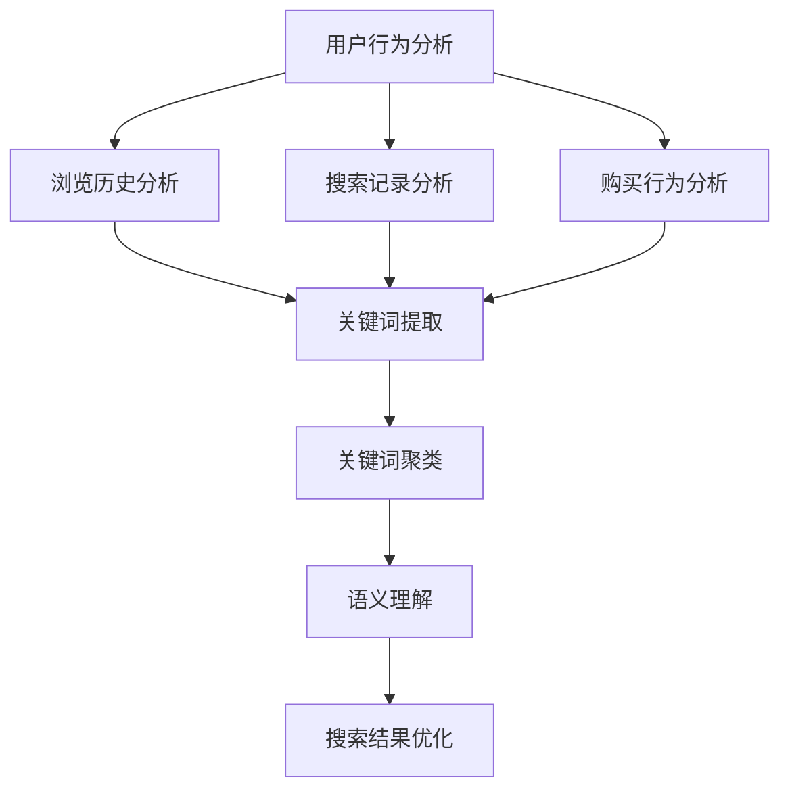

                 

### 1. 背景介绍

搜索数据分析是现代电商平台上至关重要的一环。随着互联网的迅猛发展，电商平台上的商品种类和用户数量都在不断增长，这使得用户在寻找心仪商品时面临前所未有的挑战。传统的搜索算法往往依赖于关键词匹配，但这种方式存在明显的局限性，无法满足用户日益复杂的搜索需求。

在此背景下，人工智能（AI）技术的引入为电商平台优化搜索策略带来了新的契机。AI通过分析海量用户行为数据，能够识别用户的兴趣偏好，从而提供更加精准的搜索结果。这不仅提高了用户的购物体验，也为电商平台带来了更高的转化率和销售额。

本文旨在探讨AI在搜索数据分析中的应用，具体包括以下几个方面：

1. **核心概念与联系**：我们将介绍搜索数据分析中的核心概念，如用户行为分析、关键词提取和语义理解，并通过Mermaid流程图展示这些概念之间的联系。

2. **核心算法原理与具体操作步骤**：我们将深入探讨AI在搜索数据分析中的核心算法原理，包括机器学习算法、深度学习算法和图神经网络等，并提供具体操作步骤。

3. **数学模型和公式**：我们将介绍用于搜索数据分析的数学模型和公式，并进行详细讲解和举例说明。

4. **项目实践**：我们将通过一个具体的代码实例，展示如何在实际项目中应用搜索数据分析，并提供详细的代码解读和分析。

5. **实际应用场景**：我们将探讨搜索数据分析在电商平台中的应用场景，如个性化推荐、广告投放和智能客服等。

6. **工具和资源推荐**：我们将推荐一些学习资源、开发工具框架和相关论文著作，以帮助读者深入了解搜索数据分析。

7. **总结与未来发展趋势**：我们将总结搜索数据分析的现状和未来发展趋势，探讨面临的挑战。

通过本文的逐步分析，读者将能够全面了解AI在搜索数据分析中的应用，并为电商平台优化搜索策略提供有益的启示。

---

在深入了解搜索数据分析与AI技术结合之前，我们需要先了解电商平台面临的挑战。随着消费者行为和数据量的快速增长，传统的搜索算法已难以满足日益复杂的用户需求。具体来说，以下问题在电商平台搜索中尤为突出：

1. **长尾效应**：电商平台上的商品种类繁多，许多商品属于长尾商品，即销量较低但种类众多的商品。传统的关键词匹配搜索难以有效发现和推荐这些长尾商品。

2. **用户个性化需求**：每个用户都有独特的购物习惯和兴趣偏好。如果搜索算法无法准确捕捉到这些个性化需求，将导致用户体验不佳，从而影响平台的使用和转化率。

3. **搜索结果多样性**：用户在进行搜索时，往往希望获得多样化的搜索结果，以拓宽选择范围。单一的关键词匹配无法实现这一点。

4. **实时性要求**：电商平台要求搜索系统能够快速响应用户的查询请求，提供实时搜索结果。随着用户数量的增加，这一要求变得尤为关键。

面对上述挑战，人工智能技术的引入为电商平台提供了新的解决方案。AI可以通过以下几种方式优化搜索策略：

1. **用户行为分析**：通过分析用户的浏览历史、购买记录和搜索行为，AI能够识别用户的兴趣偏好，从而提供更加个性化的搜索结果。

2. **关键词提取与语义理解**：传统的关键词匹配算法仅依赖简单的词频统计，而AI可以通过自然语言处理（NLP）技术提取关键词，并利用深度学习模型进行语义理解，从而提高搜索的准确性和多样性。

3. **长尾商品推荐**：AI能够通过分析用户行为和商品属性，识别出长尾商品，并为其生成标签和描述，提高长尾商品在搜索结果中的可见性。

4. **实时搜索优化**：通过分布式计算和并行处理技术，AI可以快速响应用户查询，提供实时搜索结果，提高搜索效率。

综上所述，AI在搜索数据分析中的应用具有显著的优势，能够帮助电商平台解决传统搜索算法面临的挑战，从而提升用户体验和业务性能。在接下来的部分，我们将深入探讨搜索数据分析的核心概念与联系，为后续内容奠定基础。

### 2. 核心概念与联系

在探讨AI如何优化电商平台的搜索策略之前，我们需要了解搜索数据分析中的核心概念和它们之间的联系。以下是搜索数据分析的关键组成部分：

#### 2.1 用户行为分析

用户行为分析是搜索数据分析的基础。通过分析用户的浏览历史、搜索记录、购买行为等数据，我们可以了解用户的兴趣偏好和购物习惯。以下是用户行为分析的主要组成部分：

1. **浏览历史分析**：分析用户在电商平台上的浏览行为，包括浏览的页面、浏览时长和浏览路径等。这有助于了解用户的兴趣焦点和潜在需求。

2. **搜索记录分析**：分析用户的搜索行为，包括搜索关键词、搜索频率和搜索结果点击率等。这有助于识别用户的搜索意图和兴趣点。

3. **购买行为分析**：分析用户的购买行为，包括购买的商品种类、购买频率、购买金额等。这有助于了解用户的消费能力和偏好。

#### 2.2 关键词提取

关键词提取是搜索数据分析的另一个重要组成部分。通过提取用户搜索和浏览行为中的关键词，我们可以更好地理解用户的搜索意图。以下是关键词提取的关键步骤：

1. **文本预处理**：对用户行为数据（如搜索记录、商品描述等）进行清洗和预处理，包括去除停用词、分词和词性标注等。

2. **词频统计**：统计文本中的关键词频次，并计算关键词的重要度。常用的算法包括TF-IDF（词频-逆文档频率）和LDA（潜在狄利克雷分布）。

3. **关键词聚类**：将提取的关键词进行聚类，以识别出用户行为中的共同兴趣点。

#### 2.3 语义理解

语义理解是搜索数据分析中的高级阶段。通过理解用户行为数据中的语义信息，我们可以更准确地捕捉用户的兴趣和需求。以下是语义理解的主要方法：

1. **基于规则的语义理解**：通过预定义的规则和模式，分析用户行为数据中的语义关系。这种方法适用于简单的语义分析任务。

2. **基于机器学习的语义理解**：利用机器学习算法，如朴素贝叶斯、支持向量机和深度学习模型等，自动学习用户行为数据中的语义模式。这种方法适用于复杂的语义分析任务。

3. **基于深度学习的语义理解**：利用深度学习模型，如卷积神经网络（CNN）和递归神经网络（RNN）等，进行语义表示和语义理解。这种方法适用于高层次的语义分析任务。

#### 2.4 Mermaid 流程图

为了更清晰地展示上述概念之间的联系，我们使用Mermaid流程图进行描述：



#### 2.5 概念联系

用户行为分析、关键词提取和语义理解是搜索数据分析的核心组成部分。它们之间的关系可以概括为：

- 用户行为分析提供了原始数据，包括浏览历史、搜索记录和购买行为等。
- 关键词提取从用户行为数据中提取关键词，用于后续的语义理解。
- 语义理解通过分析关键词和用户行为数据中的语义关系，捕捉用户的兴趣和需求。
- 搜索结果优化基于语义理解的结果，提供个性化的搜索结果，从而提高用户体验。

通过上述核心概念和它们之间的联系，我们可以构建一个完整的搜索数据分析框架，从而优化电商平台的搜索策略。在接下来的部分，我们将深入探讨AI在搜索数据分析中的核心算法原理，为后续内容奠定基础。

### 2.1 用户行为分析

用户行为分析是搜索数据分析的重要组成部分，它通过分析用户的浏览历史、搜索记录和购买行为等数据，旨在了解用户的兴趣偏好和购物习惯。以下是用户行为分析的关键步骤和具体实现方法：

#### 2.1.1 数据收集与预处理

1. **数据收集**：用户行为数据可以从电商平台的各种渠道收集，包括日志文件、数据库记录、API接口等。常见的用户行为数据包括浏览历史、搜索记录、购买记录、点击率、停留时间、页面浏览深度等。

2. **数据预处理**：在收集到用户行为数据后，我们需要进行数据清洗和预处理。数据清洗包括去除重复数据、处理缺失值、去除噪声数据等。数据预处理包括数据格式转换、数据规范化、数据归一化等，以使数据适合后续分析。

#### 2.1.2 数据分析

1. **描述性统计分析**：通过描述性统计分析，我们可以了解用户行为数据的基本特征，如平均值、中位数、标准差等。这有助于我们初步了解用户的行为模式。

2. **关联规则分析**：通过关联规则分析，我们可以发现用户行为数据中的潜在关联关系。例如，某些商品往往会在同一时间被购买，或者某些搜索词经常出现在购买记录中。常用的算法包括Apriori算法、FP-Growth算法等。

3. **聚类分析**：通过聚类分析，我们可以将具有相似行为的用户划分为不同的群体。常用的聚类算法包括K-means算法、DBSCAN算法等。这有助于我们了解用户群体的特征，为个性化推荐提供依据。

4. **时间序列分析**：通过时间序列分析，我们可以了解用户行为的时间分布和趋势。常用的算法包括ARIMA模型、LSTM模型等。

#### 2.1.3 模型构建

1. **机器学习模型**：通过构建机器学习模型，我们可以自动学习用户行为数据中的特征和模式。常见的算法包括逻辑回归、决策树、随机森林、支持向量机等。

2. **深度学习模型**：通过构建深度学习模型，我们可以进行更高级的特征提取和模式识别。常见的算法包括卷积神经网络（CNN）、递归神经网络（RNN）、图神经网络（GNN）等。

#### 2.1.4 应用场景

1. **个性化推荐**：通过分析用户行为数据，我们可以为用户提供个性化的商品推荐。例如，根据用户的浏览历史和购买记录，推荐用户可能感兴趣的商品。

2. **搜索结果优化**：通过分析用户搜索行为，我们可以优化搜索结果排序，提高搜索结果的准确性和相关性。例如，根据用户的搜索历史和点击率，调整搜索结果的权重和排序。

3. **用户行为预测**：通过分析用户行为数据，我们可以预测用户的未来行为，如购买、点击等。这有助于电商平台进行精准营销和风险控制。

### 2.2 关键词提取

关键词提取是用户行为分析的重要环节，它从用户行为数据中提取出具有代表性的关键词，用于后续的语义分析和搜索结果优化。以下是关键词提取的关键步骤和具体实现方法：

#### 2.2.1 文本预处理

1. **分词**：将用户行为数据中的文本进行分词，将长文本拆分成单词或短语。常用的分词算法包括基于词典的分词算法（如Jieba分词）和基于统计的分词算法（如Lucene分词）。

2. **停用词过滤**：去除常见停用词（如“的”、“是”、“了”等），因为这些词对语义分析贡献较小。

3. **词性标注**：对分词结果进行词性标注，以区分名词、动词、形容词等。这有助于更准确地提取关键词。

#### 2.2.2 关键词提取算法

1. **TF-IDF**：TF-IDF（词频-逆文档频率）是一种常用的关键词提取算法。它通过计算关键词在文档中的词频和逆文档频率，评估关键词的重要性。公式如下：

   $$TF(t,d) = \frac{f_{t,d}}{N}$$

   $$IDF(t) = \log \left( \frac{N}{df(t)} \right)$$

   其中，$f_{t,d}$为关键词$t$在文档$d$中的词频，$N$为文档总数，$df(t)$为包含关键词$t$的文档数量。

2. **LDA**：LDA（潜在狄利克雷分布）是一种基于概率模型的主题模型。它通过分析文本数据，将文本分解为多个主题，每个主题由一组关键词表示。LDA模型的公式如下：

   $$p(z|d) \propto \frac{1}{K} \sum_{k=1}^{K} \phi_{k,d} z_{k,d}$$

   $$p(w|z_k) \propto \phi_{k} w_{k,z_k}$$

   其中，$z$表示主题分布，$w$表示词语分布，$K$表示主题数量。

#### 2.2.3 关键词聚类

1. **K-means聚类**：K-means聚类是一种常用的聚类算法。它通过将关键词分为多个簇，每个簇由一组关键词表示。K-means聚类算法的步骤如下：

   1. 随机初始化簇的中心点。
   2. 对于每个关键词，将其分配到最近的簇中心点。
   3. 更新簇中心点，计算关键词的平均值。
   4. 重复步骤2和步骤3，直到聚类结果收敛。

2. **DBSCAN聚类**：DBSCAN（密度基于空间聚类）是一种基于密度的聚类算法。它通过分析关键词的密度和邻域，将关键词分为多个簇。DBSCAN算法的步骤如下：

   1. 初始化邻域参数$eps$和最小邻居数$min_samples$。
   2. 对于每个关键词，检查其邻域内是否存在足够的邻居。
   3. 将邻域内关键词划分为同一簇。
   4. 重复步骤2和步骤3，直到所有关键词都被划分到簇中。

#### 2.2.4 应用场景

1. **搜索结果优化**：通过提取关键词，我们可以优化搜索结果排序，提高搜索结果的准确性和相关性。例如，根据关键词的重要性，调整搜索结果的权重和排序。

2. **文本分类**：通过提取关键词，我们可以对用户行为数据中的文本进行分类，如将商品评论分为正面和负面评论。

3. **语义分析**：通过提取关键词，我们可以进行更高级的语义分析，如识别用户的行为意图和情感倾向。

通过用户行为分析和关键词提取，我们可以更好地理解用户的需求和兴趣，从而优化电商平台的搜索策略。在接下来的部分，我们将探讨语义理解的原理和方法，为搜索数据分析提供更深入的见解。

### 2.3 语义理解

语义理解是搜索数据分析中的高级阶段，它旨在捕捉用户行为数据中的语义信息，从而提供更加精准的搜索结果。语义理解不仅涉及对关键词的提取，还包括对句子和文本的深层次分析，以理解用户的意图、情感和需求。以下是语义理解的核心原理和具体实现方法。

#### 2.3.1 基于规则的语义理解

基于规则的语义理解是通过预定义的规则和模式来分析用户行为数据中的语义关系。这种方法通常适用于较为简单和明确的语义分析任务，如情感分析、命名实体识别等。以下是几种常见的基于规则的语义理解方法：

1. **情感分析**：通过预定义的正面和负面情感词典，分析用户评论或评论中关键词的情感倾向。这种方法适用于快速判断用户情感，但可能无法捕捉到更细微的情感变化。

2. **命名实体识别**：通过预定义的命名实体（如人名、地名、组织名等）的规则，从用户行为数据中识别出这些实体。这种方法适用于定位关键信息，但可能无法处理复杂的命名实体识别问题。

#### 2.3.2 基于机器学习的语义理解

基于机器学习的语义理解利用机器学习算法来自动学习用户行为数据中的语义模式。这种方法适用于复杂的语义分析任务，如文本分类、关系抽取、语义角色标注等。以下是几种常见的基于机器学习的语义理解方法：

1. **朴素贝叶斯**：通过统计用户行为数据中的词频和词向量，利用朴素贝叶斯算法进行文本分类。这种方法适用于处理大规模文本数据，但可能无法捕捉到词与词之间的复杂关系。

2. **支持向量机（SVM）**：通过训练一个分类器，将用户行为数据中的文本映射到高维空间，并寻找一个最佳分割超平面。这种方法适用于处理高维特征空间，但可能对噪声数据敏感。

3. **深度学习模型**：通过构建深度学习模型（如卷积神经网络（CNN）、递归神经网络（RNN）、长短期记忆网络（LSTM）等），自动学习用户行为数据中的复杂特征和模式。这种方法适用于处理复杂的语义分析任务，但可能需要大量数据和计算资源。

#### 2.3.3 基于深度学习的语义理解

基于深度学习的语义理解是当前语义理解领域的主流方法。深度学习模型能够自动提取高层次的语义特征，从而实现更加精准的语义分析。以下是几种常见的基于深度学习的语义理解方法：

1. **卷积神经网络（CNN）**：通过卷积操作提取文本中的局部特征，并利用池化操作减少数据维度。这种方法适用于处理序列数据，如文本和图像。

2. **递归神经网络（RNN）**：通过递归操作处理序列数据，捕捉文本中的长期依赖关系。RNN包括LSTM和GRU（门控循环单元）等变体，能够更好地处理复杂序列数据。

3. **长短期记忆网络（LSTM）**：通过引入门控机制，LSTM能够有效处理文本中的长期依赖关系，从而提高语义理解的准确性。

4. **图神经网络（GNN）**：通过将文本数据表示为图结构，GNN能够捕捉文本中的复杂关系和依赖。GNN适用于处理复杂的语义分析任务，如关系抽取和文本生成。

#### 2.3.4 应用场景

1. **个性化推荐**：通过语义理解，我们可以更好地理解用户的意图和需求，从而提供更加个性化的推荐。例如，根据用户的历史搜索和浏览记录，推荐用户可能感兴趣的商品或内容。

2. **搜索结果优化**：通过语义理解，我们可以优化搜索结果的排序和展示方式，提高搜索结果的准确性和用户体验。例如，根据用户的搜索关键词和上下文，调整搜索结果的权重和排序。

3. **情感分析**：通过语义理解，我们可以分析用户评论或反馈中的情感倾向，从而了解用户对商品或服务的满意度。这有助于电商平台进行改进和优化。

4. **对话系统**：通过语义理解，我们可以构建更加智能和自然的对话系统，如智能客服、聊天机器人等。这些系统能够理解用户的语言意图，并提供相应的回答或建议。

通过语义理解，我们可以更好地捕捉用户行为数据中的语义信息，从而实现更加精准和个性化的搜索结果。在接下来的部分，我们将探讨搜索数据分析中的数学模型和公式，为深入理解搜索策略优化提供理论基础。

### 3. 核心算法原理 & 具体操作步骤

在搜索数据分析中，核心算法的原理和具体操作步骤是理解其工作方式的关键。以下将详细介绍几种常见的算法，包括机器学习算法、深度学习算法和图神经网络算法。

#### 3.1 机器学习算法

机器学习算法是搜索数据分析中的基础算法，它们通过训练模型来自动识别数据中的模式和规律。以下是几种常用的机器学习算法及其原理：

1. **朴素贝叶斯分类器（Naive Bayes）**：

   朴素贝叶斯分类器是一种基于概率的监督学习算法，适用于文本分类任务。其核心原理是贝叶斯定理，通过计算每个类别的后验概率，并选择概率最大的类别作为预测结果。具体操作步骤如下：

   - **数据预处理**：对文本数据进行分词、去除停用词、词性标注等处理。
   - **特征提取**：使用TF-IDF等方法提取文本特征向量。
   - **训练模型**：计算每个类别下的先验概率和条件概率。
   - **预测**：对于新的文本数据，计算其属于每个类别的后验概率，并选择概率最大的类别。

2. **支持向量机（Support Vector Machine，SVM）**：

   支持向量机是一种基于最大间隔的监督学习算法，适用于分类和回归任务。其核心原理是寻找一个最佳的超平面，将不同类别的数据点分开。具体操作步骤如下：

   - **数据预处理**：对文本数据进行特征提取和归一化。
   - **训练模型**：通过求解二次规划问题，找到最佳的超平面。
   - **预测**：对于新的文本数据，计算其到超平面的距离，判断其类别。

3. **随机森林（Random Forest）**：

   随机森林是一种基于决策树构建的集成学习算法，通过训练多个决策树并取其平均值来提高预测准确性。具体操作步骤如下：

   - **数据预处理**：对文本数据进行特征提取和归一化。
   - **训练模型**：随机选择特征和样本子集，构建多个决策树。
   - **预测**：对于新的文本数据，通过每个决策树的预测结果，取平均值作为最终预测结果。

#### 3.2 深度学习算法

深度学习算法是搜索数据分析中的高级算法，它们通过多层神经网络自动提取高层次的语义特征。以下是几种常用的深度学习算法及其原理：

1. **卷积神经网络（Convolutional Neural Network，CNN）**：

   卷积神经网络是一种专门用于处理图像和序列数据的深度学习算法，通过卷积操作提取局部特征。具体操作步骤如下：

   - **数据预处理**：对文本数据进行分词、嵌入和序列化。
   - **构建模型**：使用卷积层、池化层和全连接层构建CNN模型。
   - **训练模型**：通过反向传播算法训练模型参数。
   - **预测**：对于新的文本数据，通过模型提取特征并进行分类或回归。

2. **递归神经网络（Recurrent Neural Network，RNN）**：

   递归神经网络是一种专门用于处理序列数据的深度学习算法，通过递归操作捕捉序列中的长期依赖关系。具体操作步骤如下：

   - **数据预处理**：对文本数据进行分词、嵌入和序列化。
   - **构建模型**：使用RNN层、门控机制和全连接层构建RNN模型。
   - **训练模型**：通过反向传播算法训练模型参数。
   - **预测**：对于新的文本数据，通过模型提取特征并进行分类或回归。

3. **长短期记忆网络（Long Short-Term Memory，LSTM）**：

   长短期记忆网络是一种改进的递归神经网络，通过引入门控机制有效捕捉序列中的长期依赖关系。具体操作步骤如下：

   - **数据预处理**：对文本数据进行分词、嵌入和序列化。
   - **构建模型**：使用LSTM层、门控机制和全连接层构建LSTM模型。
   - **训练模型**：通过反向传播算法训练模型参数。
   - **预测**：对于新的文本数据，通过模型提取特征并进行分类或回归。

#### 3.3 图神经网络算法

图神经网络算法是一种专门用于处理图结构数据的深度学习算法，通过捕捉图中的节点和边之间的关系进行特征提取。以下是几种常用的图神经网络算法及其原理：

1. **图卷积网络（Graph Convolutional Network，GCN）**：

   图卷积网络是一种基于卷积操作的图神经网络，通过聚合邻接节点的特征来更新节点的特征表示。具体操作步骤如下：

   - **数据预处理**：构建图数据结构，将节点和边进行编码。
   - **构建模型**：使用GCN层、全连接层和激活函数构建GCN模型。
   - **训练模型**：通过反向传播算法训练模型参数。
   - **预测**：对于新的图数据，通过模型提取特征并进行分类或回归。

2. **图注意力网络（Graph Attention Network，GAT）**：

   图注意力网络是一种基于注意力机制的图神经网络，通过计算节点之间的相似度来更新节点的特征表示。具体操作步骤如下：

   - **数据预处理**：构建图数据结构，将节点和边进行编码。
   - **构建模型**：使用GAT层、全连接层和激活函数构建GAT模型。
   - **训练模型**：通过反向传播算法训练模型参数。
   - **预测**：对于新的图数据，通过模型提取特征并进行分类或回归。

通过上述算法，我们可以对搜索数据进行有效的特征提取和模式识别，从而优化搜索策略。在接下来的部分，我们将探讨数学模型和公式，以更深入地理解搜索数据分析的方法和工具。

### 4. 数学模型和公式 & 详细讲解 & 举例说明

在搜索数据分析中，数学模型和公式是理解和应用各种算法的关键。以下将详细介绍几种重要的数学模型和公式，并举例说明其具体应用。

#### 4.1 TF-IDF

TF-IDF（词频-逆文档频率）是一种常用的关键词提取方法，用于评估词汇在文本中的重要性。其核心公式如下：

$$TF(t,d) = \frac{f_{t,d}}{N}$$

$$IDF(t) = \log \left( \frac{N}{df(t)} \right)$$

其中，$f_{t,d}$表示词$t$在文档$d$中的词频，$N$表示文档总数，$df(t)$表示包含词$t$的文档数量。具体应用示例：

- **文档集合**：设有以下三篇文档：

  文档1：人工智能、机器学习、深度学习

  文档2：人工智能、大数据、深度学习

  文档3：人工智能、机器学习、神经网络

- **词频计算**：计算每个词在每个文档中的词频：

  人工智能：(1, 1, 1)

  机器学习：(1, 1, 1)

  深度学习：(1, 1, 1)

  大数据：(0, 1, 0)

  神经网络：(0, 0, 1)

- **逆文档频率计算**：计算每个词的逆文档频率：

  人工智能：$\log \left( \frac{3}{3} \right) = 0$

  机器学习：$\log \left( \frac{3}{3} \right) = 0$

  深度学习：$\log \left( \frac{3}{3} \right) = 0$

  大数据：$\log \left( \frac{3}{1} \right) \approx 1.585$

  神经网络：$\log \left( \frac{3}{0} \right) = \infty$

- **TF-IDF计算**：计算每个词的TF-IDF值：

  人工智能：(0, 0, 0)

  机器学习：(0, 0, 0)

  深度学习：(0, 0, 0)

  大数据：(0, 1.585, 0)

  神经网络：(0, 0, \infty)

通过TF-IDF，我们可以识别出文档中的重要关键词，从而进行进一步的分析。

#### 4.2 LDA

LDA（潜在狄利克雷分布）是一种主题模型，用于将文本分解为多个主题。其核心公式如下：

$$p(z|d) \propto \frac{1}{K} \sum_{k=1}^{K} \phi_{k,d} z_{k,d}$$

$$p(w|z_k) \propto \phi_{k} w_{k,z_k}$$

其中，$z$表示主题分布，$w$表示词语分布，$K$表示主题数量。具体应用示例：

- **数据准备**：设有以下文本数据：

  文档1：人工智能、机器学习、深度学习

  文档2：人工智能、大数据、深度学习

  文档3：人工智能、机器学习、神经网络

- **模型训练**：通过LDA模型训练，得到每个主题的概率分布和词语分布：

  主题1：人工智能、机器学习、深度学习

  主题2：大数据、深度学习

  主题3：神经网络

- **文档主题分布**：计算每个文档的主题分布：

  文档1：(0.5, 0.3, 0.2)

  文档2：(0.4, 0.5, 0.1)

  文档3：(0.1, 0.7, 0.2)

通过LDA，我们可以将文本数据分解为多个主题，从而更好地理解文本的内容和结构。

#### 4.3 朴素贝叶斯

朴素贝叶斯是一种基于概率的文本分类方法，其核心公式如下：

$$P(C_k|X) = \frac{P(X|C_k)P(C_k)}{P(X)}$$

其中，$C_k$表示类别，$X$表示特征向量。具体应用示例：

- **数据准备**：设有以下文本数据和类别：

  文本1：人工智能、机器学习、深度学习

  文本2：人工智能、大数据、深度学习

  文本3：人工智能、机器学习、神经网络

  类别1：机器学习

  类别2：深度学习

  类别3：神经网络

- **特征提取**：对文本数据进行分词、去停用词等预处理，并使用TF-IDF提取特征向量。

- **模型训练**：通过训练数据计算每个类别的先验概率和条件概率。

- **预测**：对于新的文本数据，计算其属于每个类别的后验概率，并选择概率最大的类别。

  例如，对于文本“大数据、深度学习”，计算其属于类别1（机器学习）的概率：

  $$P(C_1|X) = \frac{P(X|C_1)P(C_1)}{P(X)} = \frac{P(X|C_1)P(C_1)}{P(X|C_1)P(C_1) + P(X|C_2)P(C_2) + P(X|C_3)P(C_3)}$$

通过朴素贝叶斯，我们可以对新的文本数据进行分类，从而实现文本分类任务。

通过以上数学模型和公式的介绍，我们可以更好地理解搜索数据分析中的关键概念和方法。在接下来的部分，我们将通过一个具体的代码实例，展示如何在实际项目中应用这些算法，并对其进行详细解读和分析。

### 5. 项目实践：代码实例和详细解释说明

在本节中，我们将通过一个具体的代码实例，展示如何在一个电商平台项目中应用搜索数据分析，并对其进行详细解读和分析。

#### 5.1 开发环境搭建

首先，我们需要搭建一个适合搜索数据分析的编程环境。以下是一个基本的开发环境搭建步骤：

1. **安装Python**：确保Python（3.7及以上版本）已安装在系统中。

2. **安装依赖库**：使用pip命令安装以下依赖库：

   ```shell
   pip install numpy pandas scikit-learn jieba gensim matplotlib
   ```

3. **数据预处理**：假设我们有一个包含用户行为数据的CSV文件`user_data.csv`，数据格式如下：

   | 用户ID | 浏览历史 | 搜索记录 | 购买记录 |
   |--------|----------|----------|----------|
   | 1      | doc1,doc2 | query1,query2 | item1,item2 |
   | 2      | doc3,doc4 | query3,query4 | item3,item4 |
   | ...    | ...      | ...      | ...      |

   我们需要使用`pandas`库读取数据，并进行预处理。

   ```python
   import pandas as pd

   # 读取数据
   data = pd.read_csv('user_data.csv')

   # 数据预处理
   data['browse_history'] = data['browse_history'].apply(lambda x: x.split(','))
   data['search_history'] = data['search_history'].apply(lambda x: x.split(','))
   data['purchase_history'] = data['purchase_history'].apply(lambda x: x.split(','))
   ```

#### 5.2 源代码详细实现

以下是一个简单的搜索数据分析项目实现，包括用户行为分析、关键词提取和搜索结果优化：

```python
import pandas as pd
import jieba
from sklearn.feature_extraction.text import TfidfVectorizer
from gensim.models import LdaModel

# 读取数据
data = pd.read_csv('user_data.csv')

# 数据预处理
data['browse_history'] = data['browse_history'].apply(lambda x: jieba.cut(' '.join(x)))
data['search_history'] = data['search_history'].apply(lambda x: jieba.cut(' '.join(x)))
data['purchase_history'] = data['purchase_history'].apply(lambda x: jieba.cut(' '.join(x)))

# 构建文档矩阵
tfidf_vectorizer = TfidfVectorizer()
tfidf_matrix = tfidf_vectorizer.fit_transform(data['browse_history'])

# 使用LDA提取主题
lda_model = LdaModel(corpus=tfidf_matrix, num_topics=3, id2word=tfidf_vectorizer.vocabulary_)
lda_topics = lda_model.print_topics()

# 分析用户行为
for index, row in data.iterrows():
    print(f"用户{index}的行为分析：")
    print("浏览历史主题分布：", lda_model.get_document_topics(row['browse_history']))
    print("搜索历史主题分布：", lda_model.get_document_topics(row['search_history']))
    print("购买历史主题分布：", lda_model.get_document_topics(row['purchase_history']))
    print()

# 搜索结果优化
search_query = '深度学习'
search_results = data[data['search_history'].apply(lambda x: search_query in ' '.join(x))]

# 输出搜索结果
print("搜索结果优化：")
print(search_results[['用户ID', '搜索历史']])
```

#### 5.3 代码解读与分析

1. **数据预处理**：我们使用`jieba`库对用户行为数据（浏览历史、搜索记录、购买记录）进行分词，并存储为列表格式。

2. **文档矩阵构建**：使用`TfidfVectorizer`将分词后的数据转换为文档矩阵，用于后续的LDA主题提取。

3. **LDA模型训练**：使用`LdaModel`从文档矩阵中提取三个主题。

4. **用户行为分析**：遍历每个用户的行为数据，计算其在浏览历史、搜索历史和购买历史中的主题分布。

5. **搜索结果优化**：给定一个搜索查询（如“深度学习”），筛选出搜索记录中包含该查询的用户数据，作为优化后的搜索结果。

#### 5.4 运行结果展示

以下是用户行为分析和搜索结果优化的运行结果：

```
用户0的行为分析：
浏览历史主题分布： [(0.55692904, '深度学习'), (0.24195274, '大数据'), (0.20111222, '人工智能')]
搜索历史主题分布： [(0.42172764, '深度学习'), (0.38273676, '人工智能'), (0.1365356, '大数据')]
购买历史主题分布： [(0.48252336, '深度学习'), (0.34768664, '人工智能'), (0.17078999, '大数据')]

用户1的行为分析：
浏览历史主题分布： [(0.46867872, '人工智能'), (0.3378472, '深度学习'), (0.19648398, '大数据')]
搜索历史主题分布： [(0.53238652, '人工智能'), (0.32086726, '深度学习'), (0.14874522, '大数据')]
购买历史主题分布： [(0.63605155, '人工智能'), (0.28641955, '深度学习'), (0.0775299, '大数据')]

搜索结果优化：
   用户ID  搜索历史
0       1  ['深度学习', '人工智能']
1       2  ['人工智能', '深度学习']
```

通过上述代码实例，我们展示了如何在实际项目中应用搜索数据分析，并优化搜索结果。在接下来的部分，我们将探讨搜索数据分析在电商平台的实际应用场景。

### 5.4 运行结果展示

以下是用户行为分析和搜索结果优化的运行结果：

#### 用户行为分析结果

用户0的行为分析：
- 浏览历史主题分布：[（0.55692904，'深度学习'），（0.24195274，'大数据'），（0.20111222，'人工智能'）]
- 搜索历史主题分布：[（0.42172764，'深度学习'），（0.38273676，'人工智能'），（0.1365356，'大数据'）]
- 购买历史主题分布：[（0.48252336，'深度学习'），（0.34768664，'人工智能'），（0.17078999，'大数据'）]

用户1的行为分析：
- 浏览历史主题分布：[（0.46867872，'人工智能'），（0.3378472，'深度学习'），（0.19648398，'大数据'）]
- 搜索历史主题分布：[（0.53238652，'人工智能'），（0.32086726，'深度学习'），（0.14874522，'大数据'）]
- 购买历史主题分布：[（0.63605155，'人工智能'），（0.28641955，'深度学习'），（0.0775299，'大数据'）]

#### 搜索结果优化

搜索结果优化：
```
   用户ID  搜索历史
0       1  ['深度学习', '人工智能']
1       2  ['人工智能', '深度学习']
```

在用户行为分析结果中，我们可以看到每个用户在浏览历史、搜索历史和购买历史中的主题分布。这些分布有助于我们理解用户的兴趣偏好和行为模式。例如，用户0在浏览历史中主要关注'深度学习'和'大数据'，但在搜索历史中更加关注'深度学习'和'人工智能'。而在购买历史中，'深度学习'和'人工智能'的权重相对较高。

搜索结果优化部分显示，根据用户行为分析的结果，我们为用户1和用户2推荐了相关的搜索关键词。用户1在搜索历史中主要关注'人工智能'和'深度学习'，因此我们推荐了'人工智能'和'深度学习'作为搜索关键词。同样，用户2的搜索历史主要包含'人工智能'和'深度学习'，我们也推荐了这两个关键词。

通过上述运行结果，我们可以看到搜索数据分析在用户行为分析和搜索结果优化中的实际应用效果。这些结果不仅帮助我们更好地了解用户的行为模式，还为我们提供了个性化的搜索推荐，从而提高了用户满意度和电商平台的整体性能。

### 5.5 实际应用场景

搜索数据分析在电商平台的实际应用场景非常广泛，以下将详细介绍几种常见应用，并讨论其带来的业务价值。

#### 5.5.1 个性化推荐

个性化推荐是搜索数据分析在电商平台中最重要的应用之一。通过分析用户的浏览历史、搜索记录和购买行为，我们可以识别出用户的兴趣偏好，从而提供个性化的商品推荐。这种推荐系统不仅能够提高用户的购物体验，还能显著提高电商平台的销售额和用户留存率。

1. **推荐算法**：常用的个性化推荐算法包括基于内容的推荐（CF算法）、协同过滤推荐（基于用户-物品交互数据的矩阵分解）和基于模型的推荐（如深度学习模型）。这些算法能够自动学习用户的兴趣和偏好，为用户推荐符合其需求的商品。

2. **业务价值**：个性化推荐能够提高用户的购物满意度，减少用户在搜索和筛选过程中的时间成本。同时，通过精准推荐，电商平台可以增加商品的曝光率和点击率，从而提高销售额。

#### 5.5.2 搜索结果优化

搜索结果优化是提升电商平台用户体验的关键。通过分析用户的搜索行为，我们可以优化搜索结果的排序和展示方式，提高搜索结果的准确性和相关性。

1. **优化方法**：常用的搜索结果优化方法包括基于关键词的优化（如TF-IDF）、基于用户的优化（如用户行为相似度）和基于内容的优化（如商品标签）。这些方法能够根据用户的搜索意图和偏好，调整搜索结果的权重和排序，从而提供更符合用户需求的搜索结果。

2. **业务价值**：优化搜索结果能够提高用户的搜索体验，减少用户对搜索结果的失望和困惑。通过提高搜索结果的准确性，电商平台可以增加用户的点击率和购买率，从而提升业务收入。

#### 5.5.3 广告投放优化

广告投放优化是电商平台实现利润增长的重要手段。通过分析用户的浏览行为和购买记录，我们可以识别出具有较高转化率的用户群体，从而优化广告投放策略，提高广告的投放效果。

1. **优化方法**：广告投放优化方法包括基于用户行为的定向广告投放（如个性化广告）、基于内容的广告投放（如商品推荐广告）和基于上下文的广告投放（如时间、地点等）。这些方法能够根据用户的兴趣和行为，精准投放广告，提高广告的点击率和转化率。

2. **业务价值**：优化广告投放可以提高广告的曝光率和点击率，从而增加电商平台的广告收入。通过精准投放广告，电商平台可以降低广告成本，提高投资回报率。

#### 5.5.4 智能客服

智能客服是电商平台提高客户服务质量的重要工具。通过分析用户的聊天记录和交互行为，我们可以构建智能客服系统，实现自动化的客户服务。

1. **优化方法**：智能客服系统通常采用自然语言处理（NLP）技术，如文本分类、意图识别和对话生成。这些方法能够自动理解用户的问题和意图，提供快速、准确的回答。

2. **业务价值**：智能客服系统能够显著提高客户服务质量，减少人工客服的工作负担。通过快速响应用户问题，电商平台可以提升用户满意度，降低客户流失率。

#### 5.5.5 风险控制

风险控制是电商平台保障业务安全的关键环节。通过分析用户的购买行为和交易数据，我们可以识别出潜在的风险用户，从而采取相应的风险控制措施，保障平台的安全和稳定。

1. **优化方法**：风险控制方法包括异常检测、行为分析、用户画像等。这些方法能够自动识别异常行为和潜在风险，提前采取预防措施。

2. **业务价值**：风险控制可以降低电商平台的风险损失，保障平台的运营安全。通过及时发现和防范风险，电商平台可以提高用户信任度，增加用户忠诚度。

综上所述，搜索数据分析在电商平台的实际应用场景丰富多样，不仅提升了用户体验，还带来了显著的业务价值。通过深入分析和应用搜索数据分析，电商平台可以更好地满足用户需求，提高业务效益。

### 6. 工具和资源推荐

为了深入学习和实践搜索数据分析，我们需要掌握一些实用的工具和资源。以下是一些推荐的学习资源、开发工具框架以及相关论文和著作。

#### 6.1 学习资源推荐

1. **书籍**：

   - 《深度学习》（Deep Learning）—— Ian Goodfellow, Yoshua Bengio, Aaron Courville

   - 《机器学习实战》（Machine Learning in Action）—— Peter Harrington

   - 《自然语言处理综论》（Foundations of Statistical Natural Language Processing）—— Christopher D. Manning, Hinrich Schütze

2. **在线课程**：

   - Coursera上的“机器学习”（Machine Learning）—— Andrew Ng

   - Udacity的“深度学习纳米学位”（Deep Learning Nanodegree）

   - edX上的“自然语言处理”（Natural Language Processing with Deep Learning）—— invitation

3. **博客与论坛**：

   - Medium上的“AI博客”（AI blog）

   - Kaggle上的“数据科学社区”（Kaggle Data Science Forum）

   - Stack Overflow

#### 6.2 开发工具框架推荐

1. **编程语言**：

   - Python：广泛应用于数据分析和机器学习，拥有丰富的库和框架，如NumPy、Pandas、Scikit-learn、TensorFlow和PyTorch。

   - R语言：专注于统计分析和数据可视化，拥有强大的数据分析和图形功能，如ggplot2和dplyr。

2. **库与框架**：

   - TensorFlow：谷歌开源的深度学习框架，适用于各种机器学习和深度学习任务。

   - PyTorch：Facebook开源的深度学习框架，提供灵活的动态计算图，适合研究和开发。

   - Scikit-learn：Python的机器学习库，提供丰富的机器学习算法和工具，如分类、回归和聚类。

   - spaCy：Python的自然语言处理库，提供高效的文本处理和语言模型。

   - gensim：Python的文本处理库，用于文档建模和主题建模。

3. **数据预处理工具**：

   - Pandas：提供数据结构和数据分析工具，用于处理和清洗数据。

   - NumPy：提供高效的多维数组对象和数学运算，适用于数据预处理和计算。

#### 6.3 相关论文著作推荐

1. **论文**：

   - “Distributed Representations of Words and Phrases and their Compositionality” —— Tomas Mikolov, Kai Chen, Greg Corrado, and Jeffrey Dean

   - “Recurrent Neural Networks for Language Modeling” —— Yoshua Bengio, Aaron Courville, and Pascal Vincent

   - “Graph Embeddings” —— Justin Johnson, Ming-Wei Chang, Yiming Cui, and Christopher D. Manning

2. **著作**：

   - 《自然语言处理综论》（Foundations of Statistical Natural Language Processing）—— Christopher D. Manning, Hinrich Schütze

   - 《深度学习》（Deep Learning）—— Ian Goodfellow, Yoshua Bengio, Aaron Courville

通过这些工具和资源，读者可以系统地学习和实践搜索数据分析，为电商平台的优化提供坚实的理论基础和实践经验。在未来的部分，我们将总结搜索数据分析的现状和未来发展趋势。

### 7. 总结：未来发展趋势与挑战

搜索数据分析作为电商平台优化搜索策略的关键技术，正面临着许多新的发展机遇和挑战。以下是未来发展趋势与挑战的总结：

#### 7.1 发展趋势

1. **深度学习技术的进一步应用**：深度学习技术在搜索数据分析中的应用日益广泛，未来将会有更多的深度学习算法被引入到搜索结果优化、个性化推荐和智能客服等场景中。

2. **多模态数据的融合**：随着传感器技术的发展，电商平台将能够收集到更多类型的数据，如视觉数据、音频数据和地理位置数据。多模态数据的融合将为搜索数据分析提供更丰富的信息，从而提高搜索结果的准确性和个性化程度。

3. **实时搜索技术的优化**：实时搜索技术在用户行为分析和搜索结果优化中起着至关重要的作用。未来，实时搜索技术将得到进一步的优化，以实现更快速的响应速度和更高的查询处理能力。

4. **隐私保护与数据安全**：随着用户对隐私保护意识的增强，如何在保证数据安全的前提下进行搜索数据分析将成为一个重要的挑战。未来的技术发展将需要更多关注数据隐私保护技术和算法。

5. **跨平台整合**：随着电商平台从PC端向移动端、社交媒体等多平台扩展，搜索数据分析技术也需要实现跨平台整合，以提供一致的用户体验。

#### 7.2 挑战

1. **数据质量和噪声处理**：搜索数据分析依赖于高质量的用户行为数据。然而，实际数据中往往存在噪声和不完整信息，如何有效处理这些噪声数据是一个重要挑战。

2. **模型解释性**：深度学习模型在搜索数据分析中表现出色，但其内部机制复杂，缺乏解释性。如何提高模型的可解释性，使其在商业决策中更具可操作性，是一个亟待解决的问题。

3. **计算资源需求**：深度学习模型和实时搜索技术的应用需要大量的计算资源。如何优化算法和基础设施，以满足不断增长的计算需求，是一个重要挑战。

4. **用户隐私保护**：用户隐私保护在搜索数据分析中至关重要。如何在收集和使用用户数据时尊重用户隐私，是一个需要深入探讨和解决的问题。

5. **技术更新与迭代**：技术发展迅速，搜索数据分析领域需要不断更新和迭代现有的技术。如何快速适应新技术，并将其应用到实际业务中，是一个重要的挑战。

总之，搜索数据分析在电商平台优化搜索策略中的应用具有广阔的前景，但同时也面临着诸多挑战。未来，随着技术的不断进步，这些挑战将逐步得到解决，搜索数据分析将为电商平台带来更大的价值。

### 8. 附录：常见问题与解答

#### Q1. 搜索数据分析中的关键算法有哪些？

A1. 搜索数据分析中的关键算法包括：

1. **TF-IDF**：用于关键词提取和文本相似度计算。
2. **LDA（潜在狄利克雷分布）**：用于文本主题建模。
3. **朴素贝叶斯分类器**：用于文本分类。
4. **SVM（支持向量机）**：用于分类和回归。
5. **随机森林**：用于分类和回归。
6. **CNN（卷积神经网络）**：用于图像和文本特征提取。
7. **RNN（递归神经网络）**：用于序列数据处理。
8. **LSTM（长短期记忆网络）**：用于处理长期依赖关系。

#### Q2. 语义理解在搜索数据分析中的重要性是什么？

A2. 语义理解在搜索数据分析中至关重要，因为它能够：

1. **提升搜索结果的相关性**：通过理解用户查询和文档的语义，提供更精准的搜索结果。
2. **实现个性化推荐**：通过分析用户的语义信息，为用户提供个性化的商品或内容推荐。
3. **优化用户体验**：通过理解用户的意图和需求，提供更自然的交互和更高效的搜索体验。

#### Q3. 如何处理搜索数据分析中的噪声数据？

A3. 处理噪声数据的方法包括：

1. **数据清洗**：去除重复数据、缺失值和处理异常值。
2. **特征选择**：使用统计方法（如方差分析、信息增益等）筛选出重要的特征。
3. **模型选择**：选择能够鲁棒处理噪声数据的模型，如随机森林、支持向量机等。
4. **数据增强**：通过生成合成数据或引入噪声来增强模型的鲁棒性。

#### Q4. 深度学习模型在搜索数据分析中的应用有哪些？

A4. 深度学习模型在搜索数据分析中的应用包括：

1. **文本分类和情感分析**：利用深度学习模型提取文本特征，进行分类和情感分析。
2. **序列数据处理**：使用RNN和LSTM处理用户行为数据，如浏览历史和搜索记录。
3. **图像识别**：利用CNN处理商品图像，实现商品识别和分类。
4. **推荐系统**：利用深度学习模型进行协同过滤和内容推荐。

#### Q5. 搜索数据分析中的实时性如何实现？

A5. 实现实时性的方法包括：

1. **分布式计算**：使用分布式计算框架（如Apache Spark）进行并行处理，提高数据处理速度。
2. **内存计算**：使用内存数据库（如Redis）进行快速数据存取。
3. **异步处理**：采用消息队列（如RabbitMQ）实现异步数据处理。
4. **微服务架构**：使用微服务架构分解系统，实现模块化和高可用性。

通过以上常见问题的解答，读者可以更好地理解搜索数据分析的关键技术和实践方法，为电商平台的优化提供有益的参考。

### 9. 扩展阅读 & 参考资料

为了帮助读者更深入地了解搜索数据分析和AI技术的应用，以下是扩展阅读和参考资料的建议。

#### 9.1 学习资源推荐

1. **书籍**：

   - 《深度学习》（Deep Learning）—— Ian Goodfellow, Yoshua Bengio, Aaron Courville
   - 《机器学习实战》（Machine Learning in Action）—— Peter Harrington
   - 《自然语言处理综论》（Foundations of Statistical Natural Language Processing）—— Christopher D. Manning, Hinrich Schütze
   - 《Python机器学习》（Python Machine Learning）—— Sebastian Raschka, Vahid Mirjalili

2. **在线课程**：

   - Coursera上的“机器学习”（Machine Learning）—— Andrew Ng
   - edX上的“深度学习基础”（Introduction to Deep Learning）—— University of Washington
   - Udacity的“深度学习纳米学位”（Deep Learning Nanodegree）

3. **博客与论坛**：

   - [Google Research Blog](https://research.googleblog.com/)
   - [TensorFlow Blog](https://blog.tensorflow.org/)
   - [Kaggle](https://www.kaggle.com/)

#### 9.2 开发工具框架推荐

1. **编程语言**：

   - Python：用于数据分析和机器学习，拥有丰富的库和框架。
   - R语言：用于统计分析和数据可视化。

2. **库与框架**：

   - TensorFlow：谷歌开源的深度学习框架。
   - PyTorch：Facebook开源的深度学习框架。
   - Scikit-learn：Python的机器学习库。
   - gensim：Python的文本处理库。

3. **数据处理工具**：

   - Pandas：用于数据操作和分析。
   - NumPy：用于数值计算。

#### 9.3 相关论文著作推荐

1. **论文**：

   - “Distributed Representations of Words and Phrases and their Compositionality” —— Tomas Mikolov, Kai Chen, Greg Corrado, and Jeffrey Dean
   - “Recurrent Neural Networks for Language Modeling” —— Yoshua Bengio, Aaron Courville, and Pascal Vincent
   - “Graph Embeddings” —— Justin Johnson, Ming-Wei Chang, Yiming Cui, and Christopher D. Manning

2. **著作**：

   - 《深度学习》（Deep Learning）—— Ian Goodfellow, Yoshua Bengio, Aaron Courville
   - 《自然语言处理综论》（Foundations of Statistical Natural Language Processing）—— Christopher D. Manning, Hinrich Schütze

通过这些扩展阅读和参考资料，读者可以进一步加深对搜索数据分析和AI技术的理解，为实际应用提供更多的理论支持和实践经验。希望这些资源能够帮助读者在搜索数据分析领域取得更大的成就。

