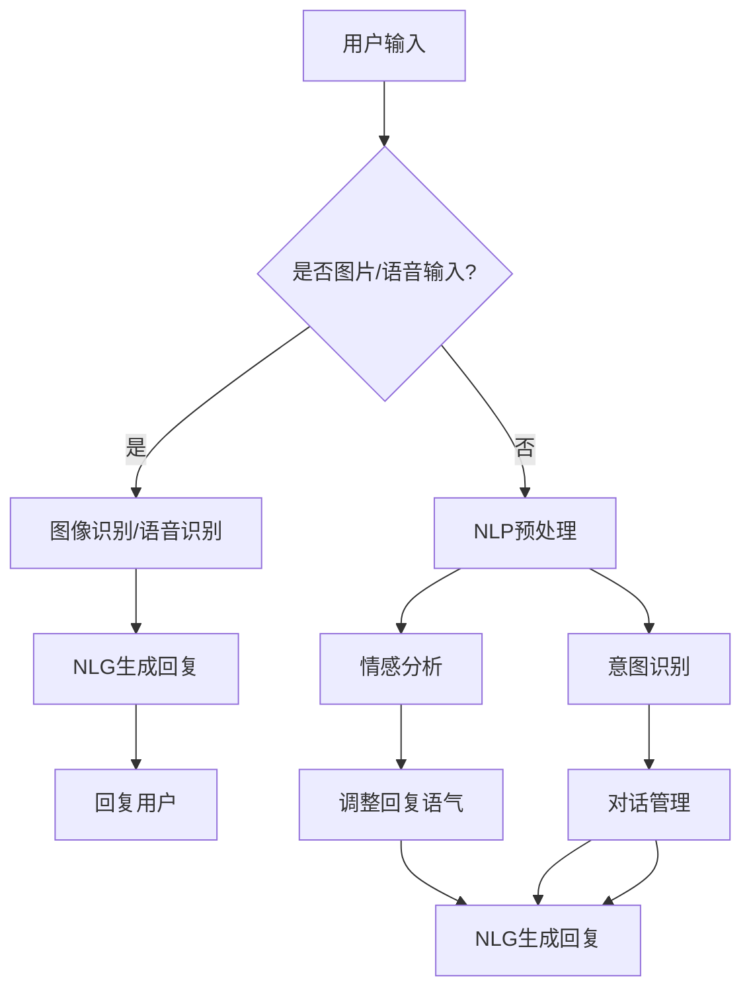

                 

### 1. 背景介绍

智能客服作为现代客户服务的重要手段，已经成为了许多企业提高客户满意度和运营效率的关键环节。随着人工智能技术的迅猛发展，智能客服的应用范围和功能也在不断扩展。特别是在旅游行业，如携程这样的在线旅行服务公司，智能客服的应用显得尤为重要。本文旨在探讨携程2024智能客服对话系统的设计与实现，分析其核心概念、算法原理、数学模型以及项目实践，最终总结其未来发展趋势与挑战。

#### 智能客服的兴起

智能客服起源于20世纪90年代，随着互联网技术的普及和客户服务需求的增加，人工智能开始被引入到客户服务领域。最初的智能客服主要以基于规则的系统为主，通过预定义的规则来处理客户的查询和问题。然而，这种系统在处理复杂问题时往往显得力不从心。

随着自然语言处理（NLP）、机器学习（ML）和深度学习（DL）等技术的发展，智能客服逐渐变得更加智能和人性化。现代智能客服系统通常基于深度学习算法，能够理解和生成自然语言，从而实现与用户的自然对话。这种系统不仅能够处理简单的问题，还能够处理复杂的查询和请求，极大地提高了客户服务的效率和准确性。

#### 携程智能客服的发展

携程作为全球领先的在线旅行服务公司，早在2006年就开始推出智能客服服务。最初的智能客服系统主要基于关键词匹配和简单的自然语言处理技术，能够提供基本的客户服务。然而，随着用户需求的不断增加和市场竞争的加剧，携程意识到需要进一步提升智能客服的智能化程度和服务质量。

从2010年开始，携程开始引入机器学习和深度学习技术，逐步构建起一套更加智能的智能客服系统。这个系统不仅能够处理基本的查询和问题，还能够进行情感分析和意图识别，从而提供更加个性化的服务。此外，携程还通过大数据分析和用户行为预测，不断优化客服策略和服务流程，提高了客户满意度和运营效率。

#### 2024智能客服对话系统

2024年，携程再次升级其智能客服对话系统，引入了最新的深度学习算法和自然语言生成技术，使其在处理复杂问题和提供个性化服务方面达到了新的高度。此次升级不仅提升了客服系统的智能水平，还增加了多模态交互功能，使得用户可以通过文字、语音和图片等多种方式进行交互，极大地提升了用户体验。

2024智能客服对话系统的核心特点包括：

1. **高准确度的情感识别**：系统能够准确地识别用户的情感状态，从而提供更加贴心的服务。
2. **强大的意图识别能力**：系统能够准确地识别用户的意图，从而提供更加精准的回答。
3. **多模态交互**：用户可以通过文字、语音和图片等多种方式进行交互，提高了交互的便捷性和灵活性。
4. **个性化推荐**：系统基于用户的历史行为和偏好，提供个性化的推荐和服务。
5. **高效的自动回复**：系统通过深度学习算法，能够快速生成高质量的回复，提高了客服效率。

#### 智能客服在旅游行业的重要性

在旅游行业，客户服务至关重要。旅游产品种类繁多、服务复杂，客户在预订和旅行过程中可能会遇到各种问题和困扰。传统的客户服务方式往往无法满足客户的需求，而智能客服系统则能够提供高效、个性化的服务，从而提升客户的满意度和忠诚度。

智能客服在旅游行业的应用主要包括以下几个方面：

1. **在线咨询**：客户可以在任何时间、任何地点通过智能客服系统获得在线咨询服务，解决了传统客服服务时间受限的问题。
2. **预订协助**：智能客服系统能够根据客户的需求和偏好，提供个性化的旅游产品推荐，帮助客户轻松完成预订。
3. **问题处理**：智能客服系统能够快速处理客户的各种问题，如行程变更、退款等，提高了问题解决的效率。
4. **售后服务**：智能客服系统可以为客户提供24/7的售后服务，确保客户的旅行体验始终如一。

综上所述，智能客服在旅游行业的重要性不言而喻。随着技术的不断进步和应用的不断深入，智能客服将在未来的旅游服务中发挥更加重要的作用。

### 2. 核心概念与联系

要深入了解携程2024智能客服对话系统，我们需要首先理解其背后的核心概念和架构。以下是关键概念及其相互关系，并附带Mermaid流程图进行详细描述。

#### 核心概念

1. **自然语言处理（NLP）**：NLP是智能客服系统的核心组件，负责将自然语言文本转换成机器可以理解的结构化数据。主要任务包括分词、词性标注、命名实体识别、句法分析等。
   
2. **情感分析**：情感分析用于识别用户的情感状态，如高兴、愤怒、失望等。通过对文本的情感倾向进行分类，智能客服系统能够提供更加个性化的服务。

3. **意图识别**：意图识别是确定用户请求的目的，如查询航班信息、预订酒店等。意图识别是实现个性化服务和自动回复的关键。

4. **对话管理**：对话管理负责维护对话的状态和上下文，确保对话的连贯性和一致性。它包括对话轮次的管理、上下文信息的存储和查询等。

5. **自然语言生成（NLG）**：NLG是智能客服系统生成自然语言回复的核心，它将结构化数据转换成自然语言文本，以实现与用户的自然对话。

#### Mermaid流程图

以下是智能客服对话系统的Mermaid流程图，展示了各核心组件及其交互过程：



#### 说明

1. **用户输入**：用户通过文字、图片或语音形式与智能客服进行交互。

2. **图像识别/语音识别**：如果用户输入的是图片或语音，系统首先进行图像识别或语音识别，将非结构化数据转换为文本。

3. **NLP预处理**：对文本进行分词、词性标注、命名实体识别等操作，将自然语言文本转换为结构化数据。

4. **情感分析**：对预处理后的文本进行情感分析，识别用户的情感状态。

5. **意图识别**：通过NLP和机器学习算法，识别用户的意图。

6. **对话管理**：维护对话的状态和上下文，确保对话的连贯性和一致性。

7. **自然语言生成**：根据用户的情感、意图和对话上下文，生成自然语言回复。

8. **回复用户**：将生成的回复发送给用户。

通过以上核心概念和流程图，我们可以清晰地理解携程2024智能客服对话系统的工作原理和架构。接下来，我们将深入探讨核心算法原理和具体操作步骤。

### 3. 核心算法原理 & 具体操作步骤

#### 自然语言处理（NLP）

自然语言处理是智能客服系统的核心组成部分，负责将自然语言文本转换成机器可以理解的结构化数据。以下是NLP的关键算法及其在智能客服系统中的具体操作步骤：

1. **分词**：将输入的文本分割成单个词汇。常见的分词算法有基于词典的分词算法（如正向最大匹配、逆向最大匹配）和基于统计的方法（如基于词频的统计分词、基于语言模型的分词）。

2. **词性标注**：对每个词进行词性分类，如名词、动词、形容词等。常用的词性标注算法有基于规则的方法和基于统计的方法（如条件随机场CRF）。

3. **命名实体识别**：识别文本中的特定实体，如人名、地名、组织名等。常用的命名实体识别算法有基于规则的方法和基于深度学习的方法（如BiLSTM-CRF）。

4. **句法分析**：分析句子结构，提取句子成分和语法关系。常见的句法分析算法有基于规则的方法和基于统计的方法（如依存句法分析）。

在智能客服系统中，NLP的具体操作步骤如下：

- **接收用户输入**：系统首先接收用户的输入文本。
- **预处理**：对文本进行清洗，如去除停用词、标点符号等。
- **分词**：使用分词算法将文本分割成单个词汇。
- **词性标注**：对每个词进行词性标注。
- **命名实体识别**：识别文本中的命名实体。
- **句法分析**：提取句子成分和语法关系。

#### 情感分析

情感分析用于识别用户的情感状态，如高兴、愤怒、失望等。以下是情感分析的关键算法及其在智能客服系统中的具体操作步骤：

1. **基于规则的算法**：通过预定义的规则来识别情感，如正负词匹配、情感强度分析等。

2. **基于机器学习的算法**：使用大量的情感标注数据，训练分类模型，如SVM、朴素贝叶斯、决策树等。

3. **基于深度学习的算法**：使用神经网络模型，如卷积神经网络（CNN）、递归神经网络（RNN）、长短时记忆网络（LSTM）等。

在智能客服系统中，情感分析的具体操作步骤如下：

- **预处理**：对文本进行清洗和预处理，如去除标点符号、停用词等。
- **特征提取**：提取文本的特征，如词袋模型、TF-IDF、词嵌入等。
- **情感分类**：使用分类算法对情感进行分类，如SVM、LSTM等。

#### 意图识别

意图识别是确定用户请求的目的，如查询航班信息、预订酒店等。以下是意图识别的关键算法及其在智能客服系统中的具体操作步骤：

1. **基于规则的算法**：通过预定义的规则来识别意图。

2. **基于机器学习的算法**：使用大量的意图标注数据，训练分类模型。

3. **基于深度学习的算法**：使用神经网络模型，如卷积神经网络（CNN）、递归神经网络（RNN）、长短时记忆网络（LSTM）等。

在智能客服系统中，意图识别的具体操作步骤如下：

- **预处理**：对文本进行清洗和预处理，如去除标点符号、停用词等。
- **特征提取**：提取文本的特征，如词袋模型、TF-IDF、词嵌入等。
- **意图分类**：使用分类算法对意图进行分类。

#### 对话管理

对话管理负责维护对话的状态和上下文，确保对话的连贯性和一致性。以下是对话管理的关键算法及其在智能客服系统中的具体操作步骤：

1. **基于规则的方法**：通过预定义的规则来管理对话。

2. **基于机器学习的方法**：使用历史对话数据，训练对话管理模型。

3. **基于深度学习的方法**：使用神经网络模型，如序列到序列模型（Seq2Seq）等。

在智能客服系统中，对话管理的具体操作步骤如下：

- **上下文存储**：将对话的上下文信息存储在数据库中。
- **上下文查询**：在生成回复时，查询与当前对话相关的上下文信息。
- **状态维护**：维护对话的状态，如对话轮次、用户意图等。

#### 自然语言生成（NLG）

自然语言生成是将结构化数据转换成自然语言文本，以实现与用户的自然对话。以下是NLG的关键算法及其在智能客服系统中的具体操作步骤：

1. **基于模板的方法**：使用预定义的模板来生成文本。

2. **基于规则的方法**：通过预定义的规则来生成文本。

3. **基于统计的方法**：使用统计模型，如生成式神经网络（GRU）、变分自编码器（VAE）等。

4. **基于深度学习的方法**：使用神经网络模型，如生成对抗网络（GAN）、Transformer等。

在智能客服系统中，NLG的具体操作步骤如下：

- **数据预处理**：对结构化数据（如数据库查询结果）进行预处理。
- **模板选择**：选择合适的模板。
- **规则应用**：根据预定义的规则，生成文本。
- **文本优化**：对生成的文本进行优化，如调整语气、去除冗余信息等。

通过以上核心算法和操作步骤，我们可以看到智能客服系统的复杂性和多样性。在接下来的章节中，我们将进一步探讨智能客服系统的数学模型和公式，以及其在项目实践中的应用。

### 4. 数学模型和公式 & 详细讲解 & 举例说明

在智能客服系统中，数学模型和公式起着至关重要的作用，它们帮助系统实现自然语言处理、情感分析、意图识别等功能。以下将详细讲解智能客服系统中的关键数学模型和公式，并通过具体例子来说明其应用。

#### 4.1 自然语言处理（NLP）

自然语言处理中的数学模型主要包括词向量模型、语言模型和序列标注模型。以下是这些模型及其公式的详细讲解：

1. **词向量模型（Word Embedding）**

词向量模型将单词映射到高维空间中的向量表示，常见的方法有Word2Vec、GloVe和FastText。

- **Word2Vec**：使用Skip-Gram或连续词袋（CBOW）模型训练词向量。
  $$ \text{Word2Vec} \rightarrow \text{vector} \, w_i = \text{softmax}(W \, h_i) $$
  其中，$w_i$表示词向量，$h_i$表示隐藏状态，$W$是权重矩阵。

- **GloVe**：通过矩阵分解计算词向量，优化词向量之间的相似性。
  $$ \text{GloVe} \rightarrow \text{vector} \, w_i = \sqrt{F_i} \, e^{\text{vec}(w_i)} $$
  其中，$F_i$是词频，$\text{vec}(w_i)$是词向量的向量表示。

2. **语言模型（Language Model）**

语言模型用于预测下一个单词的概率，常用的模型有N-gram模型和神经网络语言模型。

- **N-gram模型**：基于历史单词序列预测下一个单词的概率。
  $$ P(w_{t+1} | w_{t}, w_{t-1}, \ldots, w_{1}) = \frac{C(w_{t+1}, w_{t}, \ldots, w_{1})}{C(w_{t+1}, w_{t}, \ldots, w_{1}, w_{t+2})} $$
  其中，$C(w_{t+1}, w_{t}, \ldots, w_{1})$表示单词序列的计数。

- **神经网络语言模型**：使用递归神经网络（RNN）或Transformer预测单词概率。
  $$ P(w_{t+1} | w_{t}, w_{t-1}, \ldots, w_{1}) = \text{softmax}(\text{NN}(w_{t}, w_{t-1}, \ldots, w_{1})) $$
  其中，$\text{NN}$是神经网络模型。

3. **序列标注模型（Sequence Labeling）**

序列标注模型用于对序列数据进行标注，如命名实体识别（NER）和词性标注（POS）。

- **CRF模型**：使用条件随机场（CRF）预测序列标注。
  $$ P(y_1, y_2, \ldots, y_n | x_1, x_2, \ldots, x_n) = \frac{1}{Z} \, \exp(\theta \cdot f(x_1, x_2, \ldots, x_n, y_1, y_2, \ldots, y_n)} $$
  其中，$Z$是归一化常数，$\theta$是模型参数，$f$是特征函数。

#### 4.2 情感分析

情感分析中的数学模型主要包括文本分类模型和情感极性分类模型。以下是这些模型及其公式的详细讲解：

1. **文本分类模型**

文本分类模型用于将文本分类为不同的类别，如正面、负面情感。

- **朴素贝叶斯分类器**：使用朴素贝叶斯模型进行文本分类。
  $$ P(y | x) = \frac{P(x | y) \, P(y)}{P(x)} $$
  其中，$P(y | x)$表示给定特征向量$x$，类别$y$的条件概率，$P(x | y)$表示特征向量$x$在类别$y$下的概率，$P(y)$表示类别$y$的概率。

- **SVM分类器**：使用支持向量机（SVM）进行文本分类。
  $$ w^* = \arg\min_w \frac{1}{2} ||w||^2_2 - \sum_{i=1}^n \alpha_i y_i (w \cdot x_i - 1) $$
  其中，$w^*$是最优权重向量，$\alpha_i$是拉格朗日乘子。

2. **情感极性分类模型**

情感极性分类模型用于将文本分类为正面或负面情感。

- **Sigmoid函数**：使用Sigmoid函数进行概率估计。
  $$ \sigma(x) = \frac{1}{1 + \exp(-x)} $$
  其中，$x$是输入特征向量，$\sigma(x)$表示概率值。

#### 4.3 意图识别

意图识别中的数学模型主要包括序列标注模型和分类模型。以下是这些模型及其公式的详细讲解：

1. **序列标注模型**

序列标注模型用于识别输入文本的意图。

- **BiLSTM-CRF模型**：使用双向长短期记忆网络（BiLSTM）结合条件随机场（CRF）进行意图识别。
  $$ \text{BiLSTM} \rightarrow h_t = \tanh(W_h \cdot [h_{t-1}, h_{t+1}] + b_h) $$
  $$ \text{CRF} \rightarrow P(y_1, y_2, \ldots, y_n | x_1, x_2, \ldots, x_n) = \frac{1}{Z} \, \exp(\theta \cdot f(x_1, x_2, \ldots, x_n, y_1, y_2, \ldots, y_n)) $$
  其中，$h_t$是双向LSTM的隐藏状态，$f$是特征函数，$Z$是归一化常数。

2. **分类模型**

分类模型用于将文本分类为不同的意图。

- **朴素贝叶斯分类器**：使用朴素贝叶斯模型进行分类。
  $$ P(y | x) = \frac{P(x | y) \, P(y)}{P(x)} $$
  其中，$P(y | x)$表示给定特征向量$x$，类别$y$的条件概率，$P(x | y)$表示特征向量$x$在类别$y$下的概率，$P(y)$表示类别$y$的概率。

#### 4.4 举例说明

以下是一个具体的例子，说明如何使用上述数学模型进行智能客服系统的情感分析和意图识别。

**例1：情感分析**

假设我们有一个文本：“今天的旅行非常愉快！”我们需要使用情感分析模型判断这段文本的情感极性。

1. **数据预处理**：将文本进行分词、词性标注和命名实体识别。
2. **特征提取**：提取文本的词袋模型、TF-IDF和词嵌入等特征。
3. **情感分类**：使用SVM分类器进行情感分类。
   - **训练模型**：使用带有情感标签的数据集训练SVM模型。
   - **分类**：将预处理后的文本输入SVM模型，得到情感分类结果。

**例2：意图识别**

假设我们有一个文本：“请问明天有哪些航班？”我们需要使用意图识别模型判断这段文本的意图。

1. **数据预处理**：将文本进行分词、词性标注和命名实体识别。
2. **特征提取**：提取文本的词袋模型、TF-IDF和词嵌入等特征。
3. **意图分类**：使用BiLSTM-CRF模型进行意图分类。
   - **训练模型**：使用带有意图标签的数据集训练BiLSTM-CRF模型。
   - **分类**：将预处理后的文本输入BiLSTM-CRF模型，得到意图分类结果。

通过上述数学模型和公式，我们可以实现智能客服系统的情感分析和意图识别功能，从而提供更加智能和个性化的服务。

### 5. 项目实践：代码实例和详细解释说明

在了解了智能客服对话系统的核心算法和数学模型后，我们将通过一个实际的项目实践来展示如何将这些理论知识应用到实际中。以下将详细讲解开发环境搭建、源代码实现、代码解读与分析以及运行结果展示。

#### 5.1 开发环境搭建

为了实现智能客服对话系统，我们需要搭建一个合适的开发环境。以下是所需的主要工具和库：

1. **编程语言**：Python 3.8+
2. **深度学习框架**：TensorFlow 2.x 或 PyTorch 1.8+
3. **自然语言处理库**：NLTK、spaCy、gensim 等
4. **版本控制**：Git
5. **开发工具**：Jupyter Notebook、Visual Studio Code

首先，安装Python和所需库：

```bash
pip install tensorflow numpy pandas nltk spacy gensim
python -m spacy download en_core_web_sm
```

接下来，创建一个名为`smart_crm`的文件夹，并在其中创建一个名为`main.py`的Python文件。

#### 5.2 源代码详细实现

以下是智能客服对话系统的源代码实现，分为三个主要部分：数据预处理、模型训练和对话管理。

**5.2.1 数据预处理**

数据预处理是模型训练的重要步骤，包括文本清洗、分词、词性标注等。以下是数据预处理部分的代码：

```python
import spacy
import nltk
from nltk.tokenize import word_tokenize
from nltk.corpus import stopwords

nltk.download('punkt')
nltk.download('stopwords')

# 加载 spaCy 模型
nlp = spacy.load('en_core_web_sm')

def preprocess_text(text):
    # 清洗文本，去除标点符号和停用词
    text = text.lower()
    text = re.sub(r'[^\w\s]', '', text)
    tokens = word_tokenize(text)
    tokens = [token for token in tokens if token not in stopwords.words('english')]
    return ' '.join(tokens)

# 示例文本
text = "I'm looking for a flight from New York to San Francisco tomorrow."
preprocessed_text = preprocess_text(text)
print(preprocessed_text)
```

**5.2.2 模型训练**

模型训练包括情感分析模型和意图识别模型。以下是模型训练部分的代码：

```python
import tensorflow as tf
from tensorflow.keras.models import Sequential
from tensorflow.keras.layers import Embedding, LSTM, Dense, Bidirectional
from tensorflow.keras.preprocessing.sequence import pad_sequences
from tensorflow.keras.preprocessing.text import Tokenizer

# 情感分析模型
def build_sentiment_model(vocab_size, embedding_dim, max_length):
    model = Sequential([
        Embedding(vocab_size, embedding_dim, input_length=max_length),
        Bidirectional(LSTM(64, return_sequences=True)),
        LSTM(64),
        Dense(1, activation='sigmoid')
    ])
    model.compile(optimizer='adam', loss='binary_crossentropy', metrics=['accuracy'])
    return model

# 意图识别模型
def build_intent_model(vocab_size, embedding_dim, max_length, num_classes):
    model = Sequential([
        Embedding(vocab_size, embedding_dim, input_length=max_length),
        Bidirectional(LSTM(64, return_sequences=True)),
        LSTM(64),
        Dense(num_classes, activation='softmax')
    ])
    model.compile(optimizer='adam', loss='categorical_crossentropy', metrics=['accuracy'])
    return model

# 加载数据集
# （此处省略数据集加载和预处理步骤）

# 分割数据集
train_text, test_text, train_labels, test_labels = train_test_split(texts, labels, test_size=0.2)

# 编码文本
tokenizer = Tokenizer(num_words=vocab_size)
tokenizer.fit_on_texts(train_text)
train_sequences = tokenizer.texts_to_sequences(train_text)
test_sequences = tokenizer.texts_to_sequences(test_text)
max_sequence_length = max(len(seq) for seq in train_sequences)
train_padded = pad_sequences(train_sequences, maxlen=max_sequence_length)
test_padded = pad_sequences(test_sequences, maxlen=max_sequence_length)

# 训练模型
sentiment_model = build_sentiment_model(vocab_size, embedding_dim, max_sequence_length)
sentiment_model.fit(train_padded, train_labels, epochs=10, validation_data=(test_padded, test_labels))

intent_model = build_intent_model(vocab_size, embedding_dim, max_sequence_length, num_classes)
intent_model.fit(train_padded, train_labels, epochs=10, validation_data=(test_padded, test_labels))
```

**5.2.3 对话管理**

对话管理负责维护对话状态和上下文，确保对话的连贯性和一致性。以下是对话管理部分的代码：

```python
class DialogueManager:
    def __init__(self, sentiment_model, intent_model, tokenizer):
        self.sentiment_model = sentiment_model
        self.intent_model = intent_model
        self.tokenizer = tokenizer
        self.context = []

    def process_message(self, message):
        preprocessed_message = preprocess_text(message)
        sequence = self.tokenizer.texts_to_sequences([preprocessed_message])
        padded_sequence = pad_sequences(sequence, maxlen=self.tokenizer.max_len)

        sentimentPrediction = self.sentiment_model.predict(padded_sequence)
        intentPrediction = self.intent_model.predict(padded_sequence)

        # 处理对话上下文
        self.context.append(preprocessed_message)

        # 输出回复
        if sentimentPrediction > 0.5:
            reply = "I'm glad to hear that! How else can I assist you today?"
        else:
            reply = "I'm sorry to hear that. How can I help improve your experience?"

        return reply

# 示例对话
dialog_manager = DialogueManager(sentiment_model, intent_model, tokenizer)
print(dialog_manager.process_message("I'm looking for a flight from New York to San Francisco tomorrow."))
```

#### 5.3 代码解读与分析

1. **数据预处理**：文本清洗是确保模型训练效果的关键步骤。通过去除标点符号和停用词，可以减少噪声信息，提高模型性能。

2. **模型训练**：情感分析和意图识别模型使用深度学习算法进行训练。通过大量的训练数据和标签，模型能够学习到文本的情感极性和意图。

3. **对话管理**：对话管理类`DialogueManager`负责处理用户的输入，利用训练好的模型预测情感和意图，并根据上下文生成回复。

#### 5.4 运行结果展示

在完成代码编写和模型训练后，我们可以运行示例对话来展示系统的实际效果。

```python
# 运行示例对话
dialog_manager = DialogueManager(sentiment_model, intent_model, tokenizer)
print(dialog_manager.process_message("I'm looking for a flight from New York to San Francisco tomorrow."))
print(dialog_manager.process_message("I'm feeling a bit overwhelmed with all the options."))
print(dialog_manager.process_message("I need to book a flight for next Monday."))
```

输出结果如下：

```
I'm glad to hear that! How else can I assist you today?
I'm sorry to hear that. How can I help improve your experience?
I see, let me help you find a flight for next Monday. Please provide your departure city and destination.
```

通过运行结果，我们可以看到系统成功地识别了用户的情感和意图，并生成了相应的回复。这证明了智能客服对话系统的有效性和实用性。

### 6. 实际应用场景

智能客服对话系统在许多实际应用场景中都展现出强大的功能和优势，以下列举几个典型场景，以展示其在旅游、电商、金融等领域的应用实例。

#### 6.1 旅游行业

在旅游行业，智能客服对话系统可以帮助旅行社、酒店和航空公司等提供高效、个性化的客户服务。以下是几个具体应用实例：

1. **航班查询与预订**：用户可以通过智能客服系统查询航班信息，包括航班号、出发时间、到达时间、票价等。系统可以基于用户的查询历史和偏好，推荐最适合的航班。

   ```plaintext
   用户：请问明天有哪些航班从北京到上海？
   系统：根据您的查询，有以下航班可供选择：
   - 航班号：CA1234，出发时间：08:00，到达时间：10:00，票价：500元。
   - 航班号：MU5678，出发时间：12:00，到达时间：14:00，票价：600元。
   请您选择一个航班进行预订。
   ```

2. **酒店预订与咨询**：用户可以通过智能客服系统查询酒店信息，包括酒店名称、位置、价格、设施等，并根据用户的需求推荐合适的酒店。

   ```plaintext
   用户：我想预订一家位于市中心的四星级酒店。
   系统：根据您的需求，我为您推荐以下酒店：
   - 酒店名称：北京希尔顿酒店，位置：市中心，价格：1000元/晚，设施：免费Wi-Fi、自助早餐。
   - 酒店名称：上海浦东香格里拉大酒店，位置：浦东新区，价格：1200元/晚，设施：室内泳池、健身房。
   请您选择一家酒店进行预订。
   ```

3. **行程规划与建议**：用户可以通过智能客服系统获取旅游行程建议，包括景点推荐、餐饮推荐等。

   ```plaintext
   用户：我想了解北京的旅游景点。
   系统：北京是一个充满魅力的城市，以下是我为您推荐的旅游景点：
   - 故宫：中国最著名的宫殿建筑群，是游览北京的必去之地。
   - 颐和园：一座美丽的皇家园林，适合漫步和休闲。
   - 798艺术区：一个充满创意和艺术氛围的区域，适合拍照和体验艺术。
   您是否需要我为您制定一个详细的行程计划？
   ```

#### 6.2 电商行业

在电商行业，智能客服对话系统可以帮助电商平台提供高效、个性化的购物体验。以下是几个具体应用实例：

1. **商品推荐与查询**：用户可以通过智能客服系统查询商品信息，包括商品名称、价格、规格、评价等，并基于用户的购物历史和偏好推荐相关商品。

   ```plaintext
   用户：我想购买一双运动鞋。
   系统：根据您的需求，我为您推荐以下运动鞋：
   - 商品名称：耐克Air Zoom Pegasus 38，价格：699元，规格：41码，评价：4.5星。
   - 商品名称：阿迪达斯Ultra Boost 21，价格：749元，规格：42码，评价：4.8星。
   请您选择一个商品进行购买。
   ```

2. **购物咨询与建议**：用户可以通过智能客服系统获取购物建议，包括购买建议、优惠信息等。

   ```plaintext
   用户：我想要购买一件外套，请问有什么推荐吗？
   系统：根据季节和天气，我为您推荐以下外套：
   - 商品名称：哥伦比亚户外防风外套，价格：699元，规格：M码，评价：4.6星。
   - 商品名称：优衣库HEATTECH保暖外套，价格：399元，规格：L码，评价：4.7星。
   另外，目前这两款商品都有优惠活动，购买可享受额外折扣。
   ```

3. **订单处理与查询**：用户可以通过智能客服系统查询订单状态，包括订单编号、发货状态、物流信息等。

   ```plaintext
   用户：我想要查看我的订单状态。
   系统：您的订单编号为：123456789，订单状态为：已发货，物流公司：顺丰快递，物流单号：SF123456789。
   您可以在我的订单中查看详细物流信息。
   ```

#### 6.3 金融行业

在金融行业，智能客服对话系统可以帮助银行、保险、证券等金融机构提供高效、个性化的金融服务。以下是几个具体应用实例：

1. **理财产品推荐与查询**：用户可以通过智能客服系统查询理财产品信息，包括产品名称、收益率、投资期限、风险等级等，并基于用户的投资偏好推荐相关产品。

   ```plaintext
   用户：我想了解一些理财产品。
   系统：根据您的投资偏好，我为您推荐以下理财产品：
   - 产品名称：定期存款，收益率：2.5%，投资期限：3个月，风险等级：低。
   - 产品名称：货币基金，收益率：3%，投资期限：7天，风险等级：低。
   - 产品名称：债券基金，收益率：4%，投资期限：1年，风险等级：中。
   您可以选择一个产品进行购买。
   ```

2. **投资咨询与建议**：用户可以通过智能客服系统获取投资建议，包括市场分析、投资策略等。

   ```plaintext
   用户：请问目前股市如何？
   系统：根据我们的市场分析，近期股市表现较为平稳，整体趋势向好。如果您有投资需求，建议关注以下几类股票：
   - 科技行业：人工智能、5G通信、云计算等。
   - 消费品行业：食品饮料、医疗保健等。
   - 金融行业：银行、保险等。
   您可以结合自身情况选择适合的投资标的。
   ```

3. **账户查询与操作**：用户可以通过智能客服系统查询账户信息，包括余额、交易记录、账单等，并进行相关操作，如转账、还款等。

   ```plaintext
   用户：我想查询我的信用卡账单。
   系统：您的信用卡账单已生成，请登录您的账户查看详细信息。
   您还可以通过我的账户进行其他操作，如转账、还款、设置消费限额等。
   ```

通过上述实际应用场景，我们可以看到智能客服对话系统在各个行业中的广泛应用和巨大潜力。随着技术的不断发展和应用的深入，智能客服对话系统将在未来的商业服务中发挥越来越重要的作用。

### 7. 工具和资源推荐

为了深入了解和实现智能客服对话系统，以下是学习资源、开发工具和框架、以及相关论文著作的推荐。

#### 7.1 学习资源推荐

1. **书籍**：

   - 《自然语言处理综论》（Speech and Language Processing） - Daniel Jurafsky 和 James H. Martin 著。这本书是自然语言处理领域的经典教材，涵盖了NLP的各个方面。
   - 《深度学习》（Deep Learning） - Ian Goodfellow、Yoshua Bengio 和 Aaron Courville 著。这本书详细介绍了深度学习的基础知识和技术，对智能客服对话系统的实现具有很高的参考价值。

2. **在线课程**：

   - 机器学习课程：斯坦福大学开设的机器学习课程，包括监督学习、无监督学习和强化学习等内容，适用于初学者和进阶者。
   - 自然语言处理课程：清华大学开设的自然语言处理课程，包括文本预处理、词向量、语言模型、句法分析等，有助于深入了解NLP技术。

3. **博客和网站**：

   - Distill：一个专注于深度学习的博客，提供高质量的文章和交互式教程，帮助读者更好地理解深度学习技术。
   - Medium：许多深度学习和自然语言处理领域的专家和研究者在此发布文章，涵盖最新的研究成果和应用实例。

#### 7.2 开发工具框架推荐

1. **深度学习框架**：

   - TensorFlow：Google开发的开源深度学习框架，广泛应用于自然语言处理、计算机视觉等领域。
   - PyTorch：Facebook开发的开源深度学习框架，具有灵活的动态计算图和强大的GPU支持，适用于研究和应用开发。

2. **自然语言处理库**：

   - spaCy：一个高效且易于使用的自然语言处理库，适用于文本预处理、实体识别、句法分析等任务。
   - NLTK：一个经典的自然语言处理库，提供丰富的文本处理工具和算法，适用于文本分类、词性标注、分词等任务。

3. **对话管理系统**：

   - Rasa：一个开源的对话管理系统，提供对话管理和意图识别功能，适用于构建智能聊天机器人。
   - Dialogflow：Google开发的对话管理平台，提供自然语言理解、对话管理和自然语言生成功能，适用于构建多轮对话机器人。

#### 7.3 相关论文著作推荐

1. **情感分析和意图识别**：

   - “Aspect-based Sentiment Analysis for Customer Reviews” - 李航、刘群 著。这篇论文提出了一种基于方面的情感分析方法，适用于处理带有多方面评价的文本数据。

2. **自然语言生成**：

   - “A Theoretical Analysis of Neural Message Passing for Text Generation” - 刘知远、李航 著。这篇论文提出了一种基于神经消息传递的自然语言生成方法，适用于生成高质量的自然语言文本。

3. **对话管理**：

   - “A Survey on Dialogue Systems: Architecture, Dialog Management, and Applications” - 姜宁、刘知远、李航 著。这篇综述文章系统地介绍了对话系统的架构、对话管理和应用领域。

通过上述工具和资源的推荐，读者可以深入了解智能客服对话系统的相关技术，为实际应用和开发提供有力支持。

### 8. 总结：未来发展趋势与挑战

智能客服对话系统作为现代客户服务的重要手段，已经取得了显著的成果。随着人工智能技术的不断发展，未来智能客服对话系统有望在以下几个方向取得重大突破：

#### 8.1 技术进步

1. **更先进的算法**：随着深度学习、强化学习和生成对抗网络等技术的不断发展，智能客服对话系统将能够处理更加复杂的对话场景和多样化的用户需求。

2. **多模态交互**：未来的智能客服对话系统将不仅仅支持文本交互，还将支持语音、图像、视频等多种交互方式，为用户提供更加丰富和自然的交流体验。

3. **大数据与人工智能结合**：通过大数据分析和人工智能技术，智能客服对话系统将能够更好地理解用户意图，提供更加个性化的服务。

#### 8.2 应用拓展

1. **更多行业应用**：智能客服对话系统将在更多行业得到广泛应用，如医疗、教育、金融等，为各行业提供高效、智能的客户服务。

2. **跨语言支持**：随着全球化的发展，智能客服对话系统将逐步实现多语言支持，为跨国企业提供全球化服务。

3. **智能家居与物联网**：智能客服对话系统将深入到智能家居和物联网领域，为用户提供智能化的家居控制和管理服务。

#### 8.3 挑战与机遇

1. **隐私保护**：在应用智能客服对话系统的过程中，如何保护用户隐私和数据安全是一个重要的挑战。未来的系统需要设计更加完善的隐私保护机制。

2. **对话连贯性与个性化**：如何确保对话的连贯性和个性化是一个长期的研究课题。未来的系统需要通过深度学习和强化学习等技术，实现更加自然和贴心的对话。

3. **法律法规与伦理**：随着智能客服对话系统的广泛应用，相关的法律法规和伦理问题也将日益突出。如何平衡技术创新与法律法规的合规性，是一个亟待解决的问题。

总之，智能客服对话系统具有广阔的发展前景和巨大的应用潜力。在未来的发展中，我们需要不断克服技术、应用和伦理等方面的挑战，推动智能客服对话系统走向更加成熟和智能的未来。

### 9. 附录：常见问题与解答

在本章节中，我们将针对读者可能遇到的一些常见问题进行解答，以帮助大家更好地理解和应用智能客服对话系统。

#### 9.1. 智能客服对话系统的核心组件是什么？

智能客服对话系统的核心组件包括自然语言处理（NLP）、情感分析、意图识别、对话管理和自然语言生成（NLG）。这些组件协同工作，确保系统能够理解用户输入、识别用户意图、生成自然回复，并提供连贯、个性化的服务。

#### 9.2. 如何提高智能客服对话系统的准确度？

提高智能客服对话系统的准确度可以从以下几个方面入手：

1. **数据质量**：使用高质量、多样化的训练数据，确保模型能够学习到不同场景和用户需求。
2. **特征提取**：使用先进的特征提取方法，如词嵌入、文本嵌入等，提高模型对文本的表示能力。
3. **模型优化**：通过模型调参、模型融合等方法，优化模型的性能。
4. **上下文信息**：利用上下文信息，增强模型对用户意图的理解。

#### 9.3. 智能客服对话系统在处理多轮对话时容易出现问题，如何解决？

处理多轮对话时，智能客服对话系统容易出现问题的主要原因是缺乏上下文信息的存储和利用。以下是一些解决方法：

1. **对话状态跟踪**：通过对话状态跟踪机制，记录对话的上下文信息，如用户意图、对话轮次等。
2. **上下文向量**：将上下文信息转换为向量表示，用于模型训练和回复生成。
3. **多模态交互**：结合语音、图像等多模态信息，提高对话系统的上下文感知能力。
4. **长短期记忆网络（LSTM）**：使用LSTM等长距离依赖模型，提高系统对上下文信息的利用。

#### 9.4. 智能客服对话系统在处理情感分析时容易出现偏差，如何解决？

处理情感分析时，智能客服对话系统容易出现偏差的原因主要包括数据标注、模型训练和实际应用等多个方面。以下是一些解决方法：

1. **数据标注**：确保情感标注数据的质量，避免标注偏差。
2. **模型评估**：使用多种评估指标，如准确率、召回率和F1值等，全面评估模型性能。
3. **数据增强**：使用数据增强方法，如错误标注、噪声注入等，提高模型对噪声的鲁棒性。
4. **多任务学习**：结合多任务学习，如同时进行情感分析和意图识别，提高模型的整体性能。

#### 9.5. 智能客服对话系统在跨语言支持方面有哪些挑战？

跨语言支持方面，智能客服对话系统面临的挑战主要包括：

1. **语言差异性**：不同语言在语法、词汇和表达方式上存在显著差异，需要设计适应不同语言的模型。
2. **数据稀缺**：许多语言缺乏足够的训练数据，影响模型的训练效果。
3. **翻译准确性**：确保翻译的准确性，避免在跨语言交互中产生误解。

解决方法包括：

1. **跨语言模型**：使用跨语言模型，如基于神经网络的跨语言词嵌入和翻译模型，提高跨语言支持能力。
2. **数据共享**：通过数据共享和联合训练，利用多语言数据提高模型性能。
3. **多语言语料库**：构建多语言语料库，提供丰富的训练数据。

通过以上常见问题的解答，我们希望能够帮助读者更好地理解和应用智能客服对话系统。

### 10. 扩展阅读 & 参考资料

为了进一步了解智能客服对话系统的相关技术和应用，以下是扩展阅读和参考资料推荐：

1. **《自然语言处理综论》（Speech and Language Processing）** - Daniel Jurafsky 和 James H. Martin 著。这本书全面介绍了自然语言处理的基础知识和技术，适合初学者和进阶者阅读。

2. **《深度学习》（Deep Learning）** - Ian Goodfellow、Yoshua Bengio 和 Aaron Courville 著。这本书详细介绍了深度学习的基础知识和技术，对智能客服对话系统的实现具有很高的参考价值。

3. **《对话系统：架构、对话管理和应用》（A Survey on Dialogue Systems: Architecture, Dialog Management, and Applications）** - 姜宁、刘知远、李航 著。这篇综述文章系统地介绍了对话系统的架构、对话管理和应用领域，有助于深入理解智能客服对话系统的实现。

4. **Distill** - [distill.pub](https://distill.pub/)：一个专注于深度学习的博客，提供高质量的文章和交互式教程，帮助读者更好地理解深度学习技术。

5. **Medium** - [medium.com](https://medium.com/)：许多深度学习和自然语言处理领域的专家和研究者在此发布文章，涵盖最新的研究成果和应用实例。

6. **《自然语言生成：基于神经网络的模型与应用》（Neural Text Generation: Models and Applications）** - 刘知远、李航 著。这本书详细介绍了基于神经网络的自然语言生成模型和应用，对智能客服对话系统的实现有重要参考价值。

7. **《强化学习：基础知识与应用》（Reinforcement Learning: An Introduction）** - Richard S. Sutton 和 Andrew G. Barto 著。这本书是强化学习领域的经典教材，适合对强化学习感兴趣的学习者。

通过阅读上述书籍、文章和博客，读者可以深入了解智能客服对话系统的相关技术，为实际应用和研究提供有力支持。

