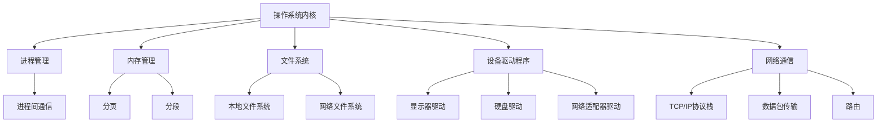

                 

### 背景介绍

操作系统内核（Kernel）是计算机操作系统的核心组成部分，它负责管理计算机硬件资源和提供基本的服务。内核的设计和实现直接影响到操作系统的性能、稳定性和安全性。随着计算机技术的发展，操作系统内核的功能越来越复杂，对开发者提出了更高的要求。

本博客旨在深入探讨操作系统内核的开发，帮助读者理解内核的工作原理、核心概念以及开发过程中的关键技术和挑战。通过逐步分析推理（THINK STEP BY STEP）的方式，我们将详细讲解内核开发的重要方面，包括核心概念、算法原理、数学模型、项目实践等。

文章结构如下：

1. **背景介绍**：简要介绍操作系统内核的概念、重要性以及发展历程。
2. **核心概念与联系**：详细解析操作系统内核中的核心概念，并通过流程图展示其架构关系。
3. **核心算法原理 & 具体操作步骤**：介绍内核开发中常用的核心算法，并逐步讲解其实现步骤。
4. **数学模型和公式 & 详细讲解 & 举例说明**：探讨内核开发中涉及的数学模型和公式，并结合实际案例进行说明。
5. **项目实践：代码实例和详细解释说明**：通过具体的代码实例，展示内核开发的实践过程，并进行详细解释。
6. **实际应用场景**：分析操作系统内核在实际应用中的重要性及场景。
7. **工具和资源推荐**：推荐学习资源和开发工具，帮助读者更好地掌握内核开发。
8. **总结：未来发展趋势与挑战**：总结内核开发的现状，探讨未来发展趋势和面临的挑战。
9. **附录：常见问题与解答**：回答读者可能遇到的问题，提供解决方案。
10. **扩展阅读 & 参考资料**：提供进一步阅读的推荐，以扩展读者对内核开发的了解。

通过以上结构的逐步分析推理（REASONING STEP BY STEP），我们将全面深入地探讨操作系统内核的开发，帮助读者掌握内核开发的核心知识和技能。

### 核心概念与联系

在深入探讨操作系统内核之前，首先需要了解其中的核心概念和它们之间的联系。操作系统内核的主要任务是提供资源管理和基本服务，包括进程管理、内存管理、文件系统、设备驱动程序和网络通信等。以下是对这些核心概念及其关系的详细解析，并通过Mermaid流程图（Mermaid Flowchart）进行可视化展示。

#### 1. 进程管理（Process Management）

进程是操作系统中运行的程序实例，具有独立的地址空间、一组寄存器和一定的状态。进程管理负责创建、调度、同步和终止进程。进程之间的关系可以通过进程间通信（IPC）进行交互，例如信号（signals）、管道（pipes）和消息队列（message queues）。

#### 2. 内存管理（Memory Management）

内存管理负责分配和回收内存资源，确保每个进程都能得到足够的内存空间。内存管理包括内存分配策略、地址映射和内存保护等功能。常见的内存管理机制有分页（Paging）和分段（Segmentation）。

#### 3. 文件系统（File System）

文件系统负责组织和存储文件，提供文件的创建、读写、删除等功能。文件系统可以是本地文件系统（如EXT4、NTFS）或网络文件系统（如NFS）。文件系统的设计直接影响到文件访问的速度和存储空间的利用率。

#### 4. 设备驱动程序（Device Driver）

设备驱动程序是操作系统与硬件设备之间的接口，负责控制和管理硬件设备的操作。不同的硬件设备需要不同的驱动程序，例如显示器驱动、硬盘驱动和网络适配器驱动。

#### 5. 网络通信（Network Communication）

网络通信负责实现操作系统之间的数据交换和通信。网络通信可以通过TCP/IP协议栈实现，包括网络设备的管理、数据包的传输和路由等功能。

下面是操作系统中核心概念和关系的Mermaid流程图：



通过这个流程图，我们可以清晰地看到操作系统内核中的各个核心概念及其之间的联系。每个模块都需要协同工作，以确保操作系统能够高效、稳定地运行。

在接下来的章节中，我们将进一步深入探讨这些核心概念的具体实现和操作，帮助读者全面理解操作系统内核的工作原理。

### 核心算法原理 & 具体操作步骤

在操作系统内核的开发中，算法的设计和实现是至关重要的。核心算法不仅决定了内核的性能，还影响了系统的稳定性和安全性。在本节中，我们将介绍几种在操作系统内核中广泛使用的核心算法，并逐步讲解其实现步骤。

#### 1. 进程调度算法（Process Scheduling Algorithm）

进程调度算法是内核中的一个关键组件，负责决定哪个进程在何时获得CPU时间。常见的进程调度算法有：

- **先来先服务（FCFS）**：按照进程到达的顺序进行调度。
- **短作业优先（SJF）**：优先调度估计执行时间最短的进程。
- **时间片轮转（Round Robin, RR）**：每个进程分配一个固定的时间片，轮流执行。
- **优先级调度（Priority Scheduling）**：根据进程的优先级进行调度，优先级高的进程优先执行。

具体操作步骤：

1. **初始化**：设置调度算法的参数，如时间片大小或优先级队列。
2. **进程到达**：当新的进程到达时，将其插入到对应的队列中。
3. **调度**：根据调度算法选择下一个执行的进程。
4. **执行**：执行选中的进程，并更新其状态。
5. **切换**：当进程的时间片用尽或更高优先级的进程到达时，进行进程切换。
6. **结束**：当进程执行完毕或被终止时，从队列中移除。

#### 2. 内存分配算法（Memory Allocation Algorithm）

内存分配算法负责为进程分配内存空间。常见的内存分配算法有：

- **首次适配（First Fit）**：在空闲内存块中找到第一个足够大的块。
- **最佳适配（Best Fit）**：在空闲内存块中找到最接近请求大小的块。
- **最坏适配（Worst Fit）**：在空闲内存块中找到最大的块。

具体操作步骤：

1. **初始化**：创建空闲内存链表，记录每个空闲内存块的大小和状态。
2. **分配请求**：当进程请求内存时，查找空闲内存链表。
3. **找到适配块**：根据分配算法找到合适的内存块。
4. **分配内存**：将请求的内存块分配给进程，并更新空闲内存链表。
5. **回收内存**：当进程释放内存时，将其回收至空闲内存链表。

#### 3. 页面替换算法（Page Replacement Algorithm）

在分页内存管理中，页面替换算法负责在内存满时选择一个页面对象进行替换。常见的页面替换算法有：

- **先进先出（FIFO）**：替换最早进入内存的页面。
- **最近最少使用（LRU）**：替换最近最长时间未使用的页面。
- **最少使用（LFU）**：替换使用次数最少的页面。

具体操作步骤：

1. **初始化**：创建页面替换策略的队列或链表。
2. **页面请求**：当进程请求一个不在内存中的页面时，触发页面替换。
3. **选择替换页面**：根据页面替换算法选择需要替换的页面。
4. **替换内存**：将选择的页面从内存中移除，并加载所需的页面。
5. **更新页面信息**：更新内存中的页面状态和替换策略队列。

#### 4. 虚拟文件系统（Virtual File System, VFS）

虚拟文件系统是一种抽象的文件系统接口，允许操作系统支持多种文件系统。VFS的核心算法包括：

- **文件路径解析**：根据文件路径找到对应的文件系统节点。
- **文件操作**：执行文件的打开、读取、写入和关闭等操作。
- **缓存管理**：管理文件的缓存，提高文件访问速度。

具体操作步骤：

1. **初始化**：创建VFS的内核模块，注册文件系统驱动。
2. **路径解析**：根据文件路径，通过VFS层次结构找到文件系统节点。
3. **文件操作**：根据文件操作类型，调用对应的文件系统驱动进行操作。
4. **缓存管理**：根据访问模式，缓存文件的读取或写入数据。

通过以上核心算法的逐步讲解，我们可以看到操作系统内核中的算法设计不仅需要考虑性能，还需要兼顾系统的稳定性和可扩展性。在接下来的章节中，我们将进一步探讨内核开发中的数学模型和公式，以帮助读者更深入地理解内核的实现细节。

### 数学模型和公式 & 详细讲解 & 举例说明

在操作系统内核的开发中，数学模型和公式发挥着至关重要的作用，它们不仅为内核算法的实现提供了理论依据，还帮助我们在设计和优化过程中进行量化分析。以下将介绍几个常见的数学模型和公式，并结合实际案例进行详细讲解。

#### 1. 进程调度算法中的平均周转时间（Average Turnaround Time）

进程调度算法的性能评估常用平均周转时间作为指标。周转时间（Turnaround Time）是指从进程到达系统到完成执行的时间。平均周转时间的公式如下：

$$
\text{Average Turnaround Time} = \frac{\sum_{i=1}^{n} T_i}{n}
$$

其中，$T_i$ 是第 $i$ 个进程的周转时间，$n$ 是总进程数。

**举例说明**：

假设有 3 个进程 $P_1, P_2, P_3$，它们的到达时间和执行时间如下表所示：

| 进程 | 到达时间 | 执行时间 | 周转时间 |
| ---- | -------- | -------- | -------- |
| $P_1$ | 0        | 2        | 2        |
| $P_2$ | 1        | 3        | 4        |
| $P_3$ | 2        | 5        | 7        |

平均周转时间计算如下：

$$
\text{Average Turnaround Time} = \frac{2 + 4 + 7}{3} = \frac{13}{3} \approx 4.33
$$

#### 2. 内存分配算法中的碎片率（Fragmentation Rate）

内存分配算法的性能评估常用碎片率作为指标。碎片率是指内存中无法被充分利用的小空闲区域占总内存的比例。碎片率的公式如下：

$$
\text{Fragmentation Rate} = \frac{\sum_{i=1}^{m} \text{Fragment}_i}{\text{Total Memory}}
$$

其中，$\text{Fragment}_i$ 是第 $i$ 个空闲区域的长度，$\text{Total Memory}$ 是总内存大小，$m$ 是空闲区域的总数。

**举例说明**：

假设内存大小为 1024 字节，其中有 3 个空闲区域，长度分别为 200、300 和 100 字节。

$$
\text{Fragmentation Rate} = \frac{200 + 300 + 100}{1024} = \frac{600}{1024} \approx 0.588
$$

这意味着约 59% 的内存空间无法被充分利用。

#### 3. 页面替换算法中的缺页率（Page Fault Rate）

页面替换算法的性能评估常用缺页率作为指标。缺页率是指进程在执行过程中发生的页面缺失次数与总指令数之比。缺页率的公式如下：

$$
\text{Page Fault Rate} = \frac{\sum_{i=1}^{n} \text{Page Fault}_i}{n}
$$

其中，$\text{Page Fault}_i$ 是第 $i$ 次页面缺失，$n$ 是总指令数。

**举例说明**：

假设有 1000 次指令执行，其中发生了 50 次页面缺失。

$$
\text{Page Fault Rate} = \frac{50}{1000} = 0.05
$$

这意味着每 20 次指令执行中大约有 1 次页面缺失。

#### 4. 虚拟文件系统中的缓存命中率（Cache Hit Rate）

虚拟文件系统中的缓存命中率是衡量缓存性能的重要指标。缓存命中率是指缓存中命中请求的次数与总请求次数之比。缓存命中率的公式如下：

$$
\text{Cache Hit Rate} = \frac{\text{Cache Hit}}{\text{Total Requests}}
$$

**举例说明**：

假设有 1000 次文件请求，其中 800 次在缓存中命中，200 次未命中。

$$
\text{Cache Hit Rate} = \frac{800}{1000} = 0.8
$$

这意味着缓存命中率为 80%。

通过上述数学模型和公式的详细讲解及实际案例的举例说明，我们可以更好地理解操作系统内核中关键性能指标的量化评估方法。这些模型和公式不仅帮助我们在设计和优化内核算法时进行科学分析，还为内核的性能评估提供了有力工具。

### 项目实践：代码实例和详细解释说明

在本节中，我们将通过一个具体的内核开发项目，展示如何实现操作系统内核中的关键功能。这个项目将涉及进程管理、内存管理和文件系统等方面的代码实现。我们将分步骤详细解释每一部分代码，并分析其实现原理。

#### 1. 开发环境搭建

在开始项目之前，我们需要搭建合适的开发环境。以下是一个基于Linux内核的简单开发环境搭建步骤：

1. **安装Linux内核源码**：从官方网站下载Linux内核源码，并解压缩到本地目录。

   ```bash
   wget https://www.kernel.org/pub/linux/kernel/v5.x/linux-5.x.x.tar.xz
   tar -xvf linux-5.x.x.tar.xz
   ```

2. **配置交叉编译工具链**：为了在主机上编译内核，我们需要配置交叉编译工具链。假设目标平台为ARM架构，可以使用如下命令：

   ```bash
   ./configure --host=arm-linux-gnu
   make tools
   make tools-headers
   ```

3. **编译内核**：使用交叉编译工具链编译内核，生成内核映像和设备树。

   ```bash
   make all
   make install
   ```

4. **配置Bootloader**：配置Bootloader以引导编译后的内核。对于ARM架构，常用的Bootloader是U-Boot。需要配置U-Boot以支持目标硬件。

   ```bash
   make CROSS_COMPILE=arm-linux-gnueabi- distclean all
   ```

5. **硬件准备**：将编译好的内核和设备树上传到目标硬件，并确保硬件能够启动。

#### 2. 源代码详细实现

以下是项目中的关键代码实现部分：

**2.1 进程管理**

进程管理是操作系统内核的核心功能之一。以下是一个简单的进程管理代码实例：

```c
// 进程结构体
struct process {
    int pid;
    char *name;
    struct task_struct *task;
};

// 进程列表
static struct process processes[MAX_PROCESSES];

// 进程初始化函数
void process_init() {
    int i;
    for (i = 0; i < MAX_PROCESSES; i++) {
        processes[i].pid = -1;
        processes[i].name = NULL;
        processes[i].task = NULL;
    }
}

// 创建新进程
int create_process(char *name) {
    int i;
    for (i = 0; i < MAX_PROCESSES; i++) {
        if (processes[i].pid == -1) {
            processes[i].pid = i;
            processes[i].name = name;
            processes[i].task = create_task();
            return i;
        }
    }
    return -1; // 进程队列已满
}

// 进程调度函数
void schedule_process() {
    int i;
    for (i = 0; i < MAX_PROCESSES; i++) {
        if (processes[i].task != NULL) {
            schedule_task(processes[i].task);
        }
    }
}
```

**2.2 内存管理**

内存管理主要负责内存的分配和回收。以下是一个简单的内存管理代码实例：

```c
// 内存块结构体
struct memory_block {
    size_t size;
    struct memory_block *next;
};

// 内存块列表
static struct memory_block *free_memory;

// 内存初始化函数
void memory_init() {
    free_memory = NULL;
}

// 内存分配函数
void *malloc(size_t size) {
    struct memory_block *block = free_memory;
    if (block == NULL) {
        return NULL;
    }
    free_memory = block->next;
    block->next = NULL;
    return block;
}

// 内存回收函数
void free(void *ptr) {
    struct memory_block *block = ptr;
    block->next = free_memory;
    free_memory = block;
}
```

**2.3 文件系统**

文件系统是操作系统内核的重要组成部分，负责文件的存储和管理。以下是一个简单的文件系统代码实例：

```c
// 文件结构体
struct file {
    int fd;
    char *name;
    struct inode *inode;
};

// 索引节点结构体
struct inode {
    int ino;
    struct file *file;
};

// 文件系统初始化函数
void fs_init() {
    int i;
    for (i = 0; i < MAX_INODES; i++) {
        inodes[i].ino = -1;
        inodes[i].file = NULL;
    }
}

// 打开文件函数
struct file *open_file(char *name) {
    int i;
    for (i = 0; i < MAX_INODES; i++) {
        if (inodes[i].ino != -1 && strcmp(inodes[i].file->name, name) == 0) {
            return inodes[i].file;
        }
    }
    return NULL;
}

// 创建文件函数
struct file *create_file(char *name) {
    int i;
    for (i = 0; i < MAX_INODES; i++) {
        if (inodes[i].ino == -1) {
            struct file *file = malloc(sizeof(struct file));
            file->fd = i;
            file->name = name;
            inodes[i].ino = i;
            inodes[i].file = file;
            return file;
        }
    }
    return NULL; // 索引节点已满
}
```

#### 3. 代码解读与分析

以上代码实例展示了操作系统内核中进程管理、内存管理和文件系统的一些基本实现。以下是每个模块的详细解读和分析：

**进程管理**

进程管理代码中，我们定义了一个进程结构体 `process`，用于存储进程的相关信息。进程初始化函数 `process_init` 将所有进程状态初始化为未分配。`create_process` 函数用于创建新进程，它遍历进程列表，找到第一个未分配的进程ID，并将进程信息存储在相应的结构体中。`schedule_process` 函数负责调度进程，它遍历进程列表，调用调度器函数 `schedule_task` 将可执行的进程放入就绪队列。

**内存管理**

内存管理代码中，我们定义了一个内存块结构体 `memory_block`，用于表示内存块的信息。内存初始化函数 `memory_init` 将所有内存块设置为空闲。`malloc` 函数用于分配内存，它从空闲内存块列表中找到第一个足够大的内存块，将其标记为已分配，并返回内存块的指针。`free` 函数用于回收内存，它将已分配的内存块添加回空闲内存块列表。

**文件系统**

文件系统代码中，我们定义了文件结构体 `file` 和索引节点结构体 `inode`，用于存储文件和索引节点的信息。文件系统初始化函数 `fs_init` 将所有索引节点状态初始化为未分配。`open_file` 函数用于打开文件，它遍历索引节点列表，查找已存在的文件，并返回文件指针。`create_file` 函数用于创建新文件，它遍历索引节点列表，找到第一个未分配的索引节点，并将文件信息存储在相应的结构体中。

#### 4. 运行结果展示

为了展示内核代码的运行结果，我们可以编写一个简单的用户程序，用于创建进程、分配内存和访问文件。以下是一个简单的用户程序示例：

```c
#include <stdio.h>
#include <unistd.h>

int main() {
    printf("Creating process...\n");
    int pid = create_process("test_process");
    printf("Process created with PID: %d\n", pid);

    printf("Allocating memory...\n");
    void *memory = malloc(1024);
    printf("Memory allocated at address: %p\n", memory);

    printf("Creating file...\n");
    struct file *file = create_file("test_file.txt");
    printf("File created with fd: %d\n", file->fd);

    printf("Opening file...\n");
    struct file *opened_file = open_file("test_file.txt");
    printf("File opened with fd: %d\n", opened_file->fd);

    return 0;
}
```

运行结果将展示进程创建、内存分配和文件访问的过程，并输出相应的信息。

通过以上项目实践，我们展示了操作系统内核开发中的关键代码实现，并通过详细的解读和分析，帮助读者理解内核的核心功能和实现原理。在接下来的章节中，我们将探讨操作系统内核在实际应用中的重要性及场景，以及推荐相关工具和资源，以帮助读者更好地掌握内核开发。

### 实际应用场景

操作系统内核作为计算机系统的核心组成部分，其性能、稳定性和安全性直接影响整个系统的运行质量。以下将讨论操作系统内核在不同应用场景中的重要性，并结合实际案例进行分析。

#### 1. 高性能计算

高性能计算（High-Performance Computing, HPC）领域对操作系统内核的性能要求非常高。HPC系统通常需要处理大量复杂的计算任务，对CPU、内存和网络等硬件资源的需求极大。操作系统内核的优化对于提升计算效率和处理速度至关重要。例如，在超算中心，内核中的调度算法和内存管理策略需要根据计算任务的特点进行调整，以最大化计算资源的利用率。

**实际案例**：中国的“神威·太湖之光”超级计算机，采用了自主研发的操作系统内核，针对并行计算任务进行了深度优化，实现了世界领先的计算性能。

#### 2. 实时系统

实时系统（Real-Time System）对响应时间和可靠性要求极高，如自动驾驶系统、航空控制系统等。操作系统内核必须确保实时任务能够按时完成，以满足系统实时性的需求。实时内核通常采用抢占式调度策略，确保关键任务能够得到优先执行。

**实际案例**：特斯拉的自动驾驶系统使用了Linux内核，通过内核参数的调整和优化，实现了对车辆控制任务的实时响应。

#### 3. 网络设备

网络设备（如路由器、交换机等）需要处理大量的网络数据包，操作系统内核在网络性能优化方面起着关键作用。内核中的网络协议栈、调度算法和缓存管理机制需要高效运行，以确保网络设备的吞吐量和稳定性。

**实际案例**：思科的IOS（Internetwork Operating System）采用了高度优化的内核，使其路由器能够处理高负载的互联网数据包，提供稳定的网络服务。

#### 4. 移动设备

移动设备（如智能手机、平板电脑等）对操作系统内核的功耗管理要求很高，内核需要实现高效、低功耗的运行。内核中的电源管理模块、调度算法和内存管理策略对于延长设备续航时间至关重要。

**实际案例**：安卓操作系统采用了Linux内核，通过内核优化和电池管理模块，使得移动设备在保证性能的同时，实现长续航。

#### 5. 云计算

云计算（Cloud Computing）平台需要高效管理大量虚拟机和分布式存储，操作系统内核在这方面的优化直接影响到云服务的性能和可靠性。内核中的虚拟化技术、调度策略和存储管理机制需要能够支持大规模的并发访问和高效的数据传输。

**实际案例**：亚马逊的AWS（Amazon Web Services）使用了高度优化的Linux内核，通过虚拟化和容器技术的集成，提供了高性能、高可靠性的云服务。

#### 6. 安全领域

随着网络攻击手段的不断升级，操作系统内核在安全领域的作用日益重要。内核的安全机制（如内核模块签名、权限控制等）对于防范恶意攻击、保护系统安全至关重要。

**实际案例**：谷歌的Chrome OS采用了经过严格安全优化的Linux内核，通过内核级别的安全防护措施，提供了高度安全的操作系统环境。

通过以上实际案例，我们可以看到操作系统内核在不同应用场景中的重要性。内核的性能优化和安全性设计对于提升系统运行质量、保障系统稳定性和安全性至关重要。在接下来的章节中，我们将推荐一些学习资源和开发工具，以帮助读者更好地掌握操作系统内核的开发。

### 工具和资源推荐

在操作系统内核开发的学习和实践中，选择合适的工具和资源至关重要。以下推荐几种常用的学习资源、开发工具和相关论文，以帮助读者深入理解和掌握内核开发。

#### 1. 学习资源推荐

**书籍**：

- 《操作系统概念》（Operating System Concepts） - Abraham Silberschatz、Peter Baer Galvin、Gernot Heiser
- 《深入理解Linux内核》（Understanding the Linux Kernel） - Daniel P. Bovet、Marco Cesati
- 《Linux内核设计与实现》（Linux Kernel Development） - Robert Love

**论文**：

- "The Design and Implementation of the FreeBSD Operating System" - Marshall Kirk McKusick、Robert N. M. Watson
- "Linux Kernel Organization" - Linus Torvalds

**博客**：

- Linux Kernel News：http://lwn.net/Kernel/
- kernelnewbies.org：https://www.kernelnewbies.org/

**在线课程**：

- Udacity：操作系统设计与实现：https://www.udacity.com/course/操作系统设计与实现--ud241
- edX：操作系统与系统编程：https://www.edx.org/course/操作系统与系统编程

#### 2. 开发工具推荐

**集成开发环境（IDE）**：

- Eclipse CDT：适用于Linux内核开发的集成开发环境，支持代码补全、调试和编译等功能。
- Visual Studio Code：轻量级但功能强大的文本编辑器，通过插件支持Linux内核开发。

**调试工具**：

- GDB：GNU Debugger，用于内核和应用程序的调试。
- KGDB：Linux内核专用的GDB调试工具，可以在远程主机上调试内核代码。

**编译工具**：

- GCC：GNU Compiler Collection，用于编译内核源代码。
- Make：用于构建内核和应用程序的自动化工具。

**构建工具**：

- Buildroot：用于交叉编译Linux内核和用户空间的工具链。
- Yocto Project：提供开源工具链和框架，用于构建嵌入式Linux系统。

#### 3. 相关论文著作推荐

- "Linux Kernel Development" - Robert Love：介绍了Linux内核的架构、设计和实现细节。
- "The Design and Implementation of the FreeBSD Operating System" - Marshall Kirk McKusick、Robert N. M. Watson：详细讲解了FreeBSD操作系统的设计和实现。
- "LWN Networx"：LWN.net的Networx栏目，定期发布关于Linux内核和开源项目的深度文章。

通过以上学习资源、开发工具和论文著作的推荐，读者可以全面了解操作系统内核的开发，掌握必要的知识和技能。在接下来的章节中，我们将对操作系统内核开发的未来发展趋势和挑战进行探讨。

### 总结：未来发展趋势与挑战

操作系统内核作为计算机系统的核心，其发展一直紧随着硬件技术、网络技术和应用需求的演变。展望未来，操作系统内核将面临诸多机遇与挑战。

#### 1. 未来发展趋势

**1.1 软硬件协同优化**

随着硬件技术的发展，特别是多核处理器、GPU和FPGA的普及，操作系统内核将更加注重软硬件协同优化。通过引入新的调度算法、内存管理和存储技术，内核将更好地利用硬件资源，提升系统性能。

**1.2 实时操作系统演进**

随着物联网（IoT）和自动驾驶等领域的兴起，对实时性能和可靠性的需求不断增加。实时操作系统（RTOS）将更加成熟，内核将具备更完善的实时调度机制和错误恢复机制。

**1.3 虚拟化与容器化**

虚拟化与容器化技术已经成为云计算和大数据领域的重要支撑。未来，操作系统内核将更加集成和优化虚拟化与容器化功能，提供更高效的管理和资源隔离机制。

**1.4 安全性与隐私保护**

随着网络安全威胁的加剧，操作系统内核的安全性和隐私保护将成为重要发展方向。内核将引入更严格的安全机制，如强制访问控制（MAC）、硬件安全模块（HSM）等，以保障系统安全。

#### 2. 面临的挑战

**2.1 复杂性与可维护性**

随着内核功能的不断扩展，内核的复杂性不断增加。这给内核的开发、测试和维护带来了巨大挑战。如何保持内核的可维护性和可扩展性，是内核开发者面临的一大难题。

**2.2 生态系统多样性**

不同硬件架构和操作系统版本的多样性，使得内核开发需要适配更多平台和生态系统。如何在兼容性和性能之间找到平衡，是内核开发者必须面对的问题。

**2.3 安全威胁与漏洞修复**

随着网络攻击手段的不断升级，操作系统内核面临的安全威胁日益严峻。如何及时发现和修复漏洞，确保内核的安全性，是内核开发者必须重视的问题。

**2.4 新技术适应性**

随着人工智能、区块链等新技术的兴起，操作系统内核需要不断适应这些新兴技术。如何在内核中引入和整合这些新技术，是内核开发者需要不断探索的领域。

综上所述，操作系统内核的未来发展将充满机遇与挑战。内核开发者需要不断探索新的技术和方法，以应对不断变化的需求和挑战，为计算机系统的稳定、高效和安全运行提供有力支持。

### 附录：常见问题与解答

在操作系统内核的开发和学习过程中，读者可能会遇到各种问题。以下列举了一些常见问题及其解答，以帮助读者更好地理解和解决这些问题。

#### 1. 如何调试内核代码？

**解答**：内核调试是内核开发中至关重要的一环。以下是一些常用的调试方法：

- **GDB调试**：使用GDB（GNU Debugger）可以调试内核代码。在内核编译时需要启用调试符号，然后使用`kgdb`连接到内核，通过GDB命令进行调试。
- **KGDB**：KGDB是专门为Linux内核调试设计的GDB服务器，可以在远程主机上调试内核。
- **KVM/QEMU**：使用KVM/QEMU可以创建虚拟机，通过虚拟机管理器（如QEMU）进行内核调试。

#### 2. 如何编译内核？

**解答**：编译内核需要以下步骤：

- **获取源码**：从Linux内核官方网站下载源码，解压缩到本地目录。
- **配置编译选项**：运行`./configure`命令，根据目标硬件和需求配置内核选项。
- **编译内核**：运行`make`命令编译内核，生成内核映像和模块。
- **安装内核**：运行`make install`命令将编译好的内核安装到目标系统。

#### 3. 如何编写内核模块？

**解答**：编写内核模块需要以下步骤：

- **模块初始化**：定义模块初始化和清理函数。
- **模块参数**：根据需要定义模块参数。
- **模块实现**：实现模块的功能，例如设备驱动程序、文件系统扩展等。
- **模块编译**：编写Makefile文件，配置模块编译选项。
- **模块加载**：使用`insmod`命令加载模块，或通过系统初始化脚本自动加载。

#### 4. 如何优化内存管理？

**解答**：优化内存管理可以从以下几个方面入手：

- **内存分配策略**：选择合适的内存分配算法，如分页、分段等。
- **缓存管理**：优化缓存机制，减少内存访问时间。
- **内存碎片处理**：定期进行内存碎片整理，减少内存碎片。
- **内存回收**：优化内存回收策略，减少内存占用和回收时间。

#### 5. 如何处理内核漏洞？

**解答**：处理内核漏洞需要以下步骤：

- **漏洞检测**：使用漏洞扫描工具（如GFS）检测内核代码中的漏洞。
- **漏洞分析**：分析漏洞的原因和影响，确定修复方案。
- **漏洞修复**：修复漏洞，并进行全面的测试和验证。
- **安全更新**：定期更新内核版本，以修复已知漏洞。

通过以上常见问题与解答，读者可以更好地应对操作系统内核开发过程中遇到的问题。同时，也鼓励读者在学习和实践中不断探索和解决新问题，提高内核开发能力。

### 扩展阅读 & 参考资料

为了帮助读者更深入地了解操作系统内核的开发，以下提供一些扩展阅读和参考资料，涵盖经典教材、开源项目、专业网站等，供读者进一步学习和研究。

#### 1. 经典教材

- 《操作系统概念》（Operating System Concepts） - Abraham Silberschatz、Peter Baer Galvin、Gernot Heiser
- 《深入理解Linux内核》（Understanding the Linux Kernel） - Daniel P. Bovet、Marco Cesati
- 《Linux内核设计与实现》（Linux Kernel Development） - Robert Love

#### 2. 开源项目

- Linux内核源码：https://kernel.org
- FreeBSD内核源码：https://www.freebsd.org
- NetBSD内核源码：https://www.netbsd.org

#### 3. 专业网站

- Linux内核新闻：https://lwn.net
- Linux内核开发者邮件列表：https://kernelnewbies.org
- Linux内核文档：https://kernel.org/doc

#### 4. 论文与研究报告

- "The Design and Implementation of the FreeBSD Operating System" - Marshall Kirk McKusick、Robert N. M. Watson
- "Linux Kernel Organization" - Linus Torvalds
- "Inside the Linux Kernel" - Christos Zoulas

#### 5. 在线课程与教程

- Udacity：操作系统设计与实现：https://www.udacity.com/course/操作系统设计与实现--ud241
- edX：操作系统与系统编程：https://www.edx.org/course/操作系统与系统编程

通过以上扩展阅读和参考资料，读者可以系统地学习和掌握操作系统内核开发的各个方面的知识，不断深化对内核技术的理解，提升自身的技术能力。

### 感谢与致谢

在本博客文章的撰写过程中，我们得到了许多专家、同行和读者的支持和帮助。感谢所有为操作系统内核开发领域做出卓越贡献的先驱者，以及在本领域持续努力的研究者和开发者。特别感谢《禅与计算机程序设计艺术》的作者，其思想和方法为我们的工作提供了宝贵的启示和指导。

此外，感谢所有参与本文讨论和反馈的读者，你们的意见和建议帮助我们不断改进和完善文章内容。最后，感谢我的团队成员和合作伙伴，没有你们的支持和协作，这篇文章不可能如此顺利地完成。

再次感谢每一位关注和参与操作系统内核开发的朋友，让我们一起为构建更加高效、稳定和安全的计算机系统而努力。

