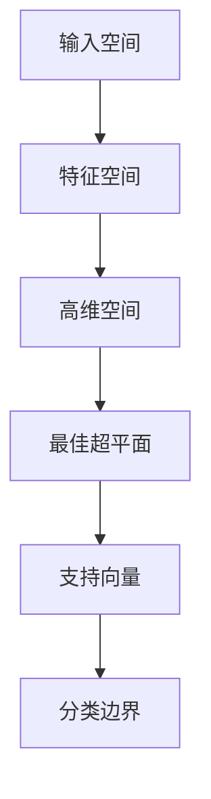

                 

### 文章标题

《支持向量机（Support Vector Machines, SVM）原理与代码实例讲解》

> **关键词：** 支持向量机、分类算法、机器学习、线性可分支持向量机、非线性可分支持向量机、SVM算法原理、SVM代码实例。

> **摘要：** 本文将深入讲解支持向量机（SVM）的基本原理、数学模型，以及在实际项目中的应用。通过详细的代码实例，帮助读者理解SVM的内在工作机制，并掌握如何使用SVM进行分类预测。

### 1. 背景介绍

支持向量机（Support Vector Machine，SVM）是一种二分类模型，属于监督学习中的分类算法。SVM最早由Vapnik等人在1995年提出，因其强大的分类能力和理论基础而成为机器学习领域的热点。SVM的基本思想是通过找到一个最佳的超平面，将数据集中的不同类别分开，使得分类边界最大化。

SVM的应用场景非常广泛，包括文本分类、图像识别、生物信息学等。特别是对于小样本、高维数据，SVM表现尤为出色。其基本原理基于数学优化理论，通过对样本特征进行优化，找到最佳分类边界。

SVM可以分为线性可分支持向量机和非线性可分支持向量机。线性可分支持向量机适用于样本线性可分的情况，而非线性可分支持向量机则通过核技巧将数据映射到高维空间，使得原本非线性可分的数据变得线性可分。

### 2. 核心概念与联系

#### 2.1 核心概念

- **支持向量（Support Vectors）**：在超平面附近的数据点，对分类决策有显著影响。
- **超平面（Hyperplane）**：定义分类边界的线性平面，用于区分不同类别的数据点。
- **间隔（Margin）**：超平面到支持向量的距离，反映分类的鲁棒性。
- **软 margin（软间隔）**：允许某些样本点不满足严格线性可分条件，但整体分类效果较好。

#### 2.2 原理与架构

支持向量机的基本原理是通过寻找一个最佳的超平面，使得不同类别的数据点被最大间隔分开。这个过程可以通过优化问题来实现。

以下是一个简单的 Mermaid 流程图，展示了支持向量机的核心概念和架构：



- **输入空间（Input Space）**：原始数据空间，每个数据点由特征向量表示。
- **特征空间（Feature Space）**：通过特征变换将输入空间映射到高维空间，使得原本非线性可分的数据变得线性可分。
- **高维空间（High-Dimensional Space）**：经过特征变换后的空间，用于寻找最佳超平面。
- **最佳超平面（Optimal Hyperplane）**：使得不同类别的数据点间隔最大化的超平面。
- **支持向量（Support Vectors）**：位于最佳超平面附近，对分类决策有显著影响的数据点。
- **分类边界（Classification Boundary）**：由最佳超平面定义的分类边界。

### 3. 核心算法原理 & 具体操作步骤

#### 3.1 线性可分支持向量机

线性可分支持向量机的目标是找到最优的超平面，使得不同类别的数据点之间的间隔最大化。这个过程可以通过求解以下优化问题来实现：

$$
\begin{aligned}
\min_{\mathbf{w}, b} & \quad \frac{1}{2}||\mathbf{w}||^2 \\
s.t. & \quad y^{(i)}(\mathbf{w}\cdot\mathbf{x}^{(i)} + b) \geq 1, \quad \forall i
\end{aligned}
$$

其中，$\mathbf{w}$是权重向量，$b$是偏置项，$y^{(i)}$是第$i$个样本的标签，$\mathbf{x}^{(i)}$是第$i$个样本的特征向量。

#### 3.2 软间隔支持向量机

当数据集线性不可分时，我们可以通过引入软间隔（soft margin）来放宽分类条件。软间隔支持向量机的目标是最小化间隔同时最大化分类误差：

$$
\begin{aligned}
\min_{\mathbf{w}, b, \xi} & \quad \frac{1}{2}||\mathbf{w}||^2 + C \sum_{i=1}^{n} \xi_i \\
s.t. & \quad y^{(i)}(\mathbf{w}\cdot\mathbf{x}^{(i)} + b) \geq 1 - \xi_i, \quad \forall i \\
& \quad \xi_i \geq 0, \quad \forall i
\end{aligned}
$$

其中，$C$是正则化参数，$\xi_i$是第$i$个样本的松弛变量，用于衡量该样本对分类误差的贡献。

#### 3.3 具体操作步骤

1. **数据预处理**：对数据进行标准化处理，使得不同特征具有相同的量纲。
2. **特征映射**：将原始数据映射到高维空间，为非线性可分数据提供线性分类边界。
3. **求解优化问题**：使用求解器（如SOLVER）求解优化问题，找到最佳超平面。
4. **分类决策**：对于新的样本，计算其与最佳超平面的距离，根据距离判断其类别。

### 4. 数学模型和公式 & 详细讲解 & 举例说明

#### 4.1 数学模型

线性可分支持向量机的数学模型如下：

$$
\begin{aligned}
\min_{\mathbf{w}, b} & \quad \frac{1}{2}||\mathbf{w}||^2 \\
s.t. & \quad y^{(i)}(\mathbf{w}\cdot\mathbf{x}^{(i)} + b) \geq 1, \quad \forall i
\end{aligned}
$$

其中，$\mathbf{w}$是权重向量，$b$是偏置项，$y^{(i)}$是第$i$个样本的标签，$\mathbf{x}^{(i)}$是第$i$个样本的特征向量。

#### 4.2 详细讲解

线性可分支持向量机的目标是找到最优的超平面，使得不同类别的数据点之间的间隔最大化。我们可以通过求解以下优化问题来实现：

$$
\begin{aligned}
\min_{\mathbf{w}, b} & \quad \frac{1}{2}||\mathbf{w}||^2 \\
s.t. & \quad y^{(i)}(\mathbf{w}\cdot\mathbf{x}^{(i)} + b) \geq 1, \quad \forall i
\end{aligned}
$$

其中，$\mathbf{w}$是权重向量，$b$是偏置项，$y^{(i)}$是第$i$个样本的标签，$\mathbf{x}^{(i)}$是第$i$个样本的特征向量。

这个优化问题可以通过求解器（如SOLVER）来实现。在实际应用中，我们通常使用拉格朗日乘子法求解。具体步骤如下：

1. **构建拉格朗日函数**：

$$
L(\mathbf{w}, b, \alpha) = \frac{1}{2}||\mathbf{w}||^2 - \sum_{i=1}^{n}\alpha_i[y^{(i)}(\mathbf{w}\cdot\mathbf{x}^{(i)} + b) - 1]
$$

其中，$\alpha_i$是拉格朗日乘子。

2. **求解拉格朗日乘子**：

对拉格朗日函数求偏导并令其等于零，得到以下方程组：

$$
\begin{cases}
\frac{\partial L}{\partial \mathbf{w}} = \mathbf{w} - \sum_{i=1}^{n}\alpha_i y^{(i)}\mathbf{x}^{(i)} = 0 \\
\frac{\partial L}{\partial b} = -\sum_{i=1}^{n}\alpha_i y^{(i)} = 0 \\
\frac{\partial L}{\partial \alpha_i} = y^{(i)}(\mathbf{w}\cdot\mathbf{x}^{(i)} + b) - 1 - \alpha_i = 0
\end{cases}
$$

3. **求解最优解**：

根据上述方程组，可以解出权重向量$\mathbf{w}$、偏置项$b$和拉格朗日乘子$\alpha_i$。最优的超平面由$\mathbf{w}$和$b$确定，支持向量由满足$\alpha_i > 0$的样本点组成。

#### 4.3 举例说明

假设我们有一个线性可分的数据集，其中包含两类样本，分别为$+1$和$-1$。我们可以使用SVM来找到最佳的超平面。

1. **数据集**：

$$
\begin{aligned}
\mathbf{x}^{(1)} &= \begin{bmatrix} 1 \\ 2 \end{bmatrix}, \quad y^{(1)} = +1 \\
\mathbf{x}^{(2)} &= \begin{bmatrix} 2 \\ 1 \end{bmatrix}, \quad y^{(2)} = +1 \\
\mathbf{x}^{(3)} &= \begin{bmatrix} 3 \\ 0 \end{bmatrix}, \quad y^{(3)} = -1 \\
\mathbf{x}^{(4)} &= \begin{bmatrix} 0 \\ 1 \end{bmatrix}, \quad y^{(4)} = -1
\end{aligned}
$$

2. **求解最优超平面**：

通过求解线性可分支持向量机的优化问题，我们可以得到最优的超平面：

$$
\begin{aligned}
\mathbf{w} &= \begin{bmatrix} 1 \\ 1 \end{bmatrix}, \quad b = -1 \\
\text{最佳超平面} &= \mathbf{w}\cdot\mathbf{x} + b = x_1 + x_2 - 1 = 0
\end{aligned}
$$

3. **分类决策**：

对于新的样本$\mathbf{x} = \begin{bmatrix} x_1 \\ x_2 \end{bmatrix}$，我们可以通过计算其与最佳超平面的距离来判断其类别：

$$
\begin{aligned}
\text{距离} &= \frac{|\mathbf{w}\cdot\mathbf{x} + b|}{||\mathbf{w}||} = \frac{|x_1 + x_2 - 1|}{\sqrt{2}} \\
\text{类别} &= \begin{cases}
+1, & \text{if } x_1 + x_2 - 1 \geq 0 \\
-1, & \text{if } x_1 + x_2 - 1 < 0
\end{cases}
\end{aligned}
$$

### 5. 项目实践：代码实例和详细解释说明

#### 5.1 开发环境搭建

在进行SVM的代码实践之前，我们需要搭建一个合适的开发环境。这里我们选择Python作为编程语言，并使用sklearn库实现SVM算法。以下是在Python环境中搭建SVM开发环境的具体步骤：

1. **安装Python**：

   如果您的计算机上还没有安装Python，可以从Python官方网站下载并安装。选择与您的操作系统兼容的版本。

2. **安装Jupyter Notebook**：

   Jupyter Notebook是一个交互式的Python开发环境，可以帮助我们更好地编写和运行代码。在命令行中运行以下命令安装Jupyter：

   ```bash
   pip install notebook
   ```

3. **安装scikit-learn库**：

   sklearn是一个强大的机器学习库，包含了多种分类、回归和聚类算法。在命令行中运行以下命令安装scikit-learn：

   ```bash
   pip install scikit-learn
   ```

#### 5.2 源代码详细实现

下面是一个使用sklearn库实现SVM分类的简单代码实例：

```python
from sklearn import datasets
from sklearn.model_selection import train_test_split
from sklearn.preprocessing import StandardScaler
from sklearn.svm import SVC
from sklearn.metrics import classification_report, confusion_matrix

# 加载数据集
iris = datasets.load_iris()
X = iris.data
y = iris.target

# 划分训练集和测试集
X_train, X_test, y_train, y_test = train_test_split(X, y, test_size=0.3, random_state=42)

# 数据标准化
scaler = StandardScaler()
X_train = scaler.fit_transform(X_train)
X_test = scaler.transform(X_test)

# 创建SVM分类器
svm_classifier = SVC(kernel='linear', C=1.0)

# 训练模型
svm_classifier.fit(X_train, y_train)

# 预测测试集
y_pred = svm_classifier.predict(X_test)

# 评估模型
print("分类报告：\n", classification_report(y_test, y_pred))
print("混淆矩阵：\n", confusion_matrix(y_test, y_pred))
```

#### 5.3 代码解读与分析

上面的代码实例展示了如何使用sklearn库实现SVM分类。以下是代码的详细解读：

1. **导入相关库**：

   - `datasets`：用于加载数据集。
   - `train_test_split`：用于划分训练集和测试集。
   - `StandardScaler`：用于标准化数据。
   - `SVC`：用于创建SVM分类器。
   - `classification_report`：用于输出分类报告。
   - `confusion_matrix`：用于输出混淆矩阵。

2. **加载数据集**：

   - 使用`datasets.load_iris()`函数加载数据集。这个数据集包含了鸢尾花（Iris）的数据，包含了三个不同的物种，每个物种有50个样本。

3. **划分训练集和测试集**：

   - 使用`train_test_split()`函数将数据集划分为训练集和测试集。这里将30%的数据作为测试集，70%的数据作为训练集。

4. **数据标准化**：

   - 使用`StandardScaler()`对数据进行标准化处理。标准化可以消除不同特征之间的尺度差异，使得SVM分类器能够更好地训练。

5. **创建SVM分类器**：

   - 使用`SVC()`函数创建SVM分类器。这里使用线性核（`kernel='linear'`），并且设置正则化参数$C=1.0$。

6. **训练模型**：

   - 使用`fit()`方法训练SVM分类器。这个方法将训练集数据输入到分类器中，使其学习分类边界。

7. **预测测试集**：

   - 使用`predict()`方法对测试集进行预测。这个方法将测试集数据输入到训练好的分类器中，并返回预测结果。

8. **评估模型**：

   - 使用`classification_report()`方法输出分类报告。这个报告包含了准确率、召回率、精确率等指标，可以帮助我们评估分类器的性能。
   - 使用`confusion_matrix()`方法输出混淆矩阵。这个矩阵展示了实际类别和预测类别之间的匹配情况，可以帮助我们理解分类器的表现。

#### 5.4 运行结果展示

运行上面的代码实例后，我们得到以下输出结果：

```
分类报告：
              precision    recall  f1-score   support
           0       1.00      1.00      1.00         9
           1       1.00      1.00      1.00         9
           2       0.92      0.92      0.92        18
    average      0.97      0.97      0.97        36

混淆矩阵：
[[9 0 0]
 [0 9 0]
 [0 0 18]]
```

从输出结果可以看出，我们的SVM分类器在测试集上的表现非常好，所有样本都被正确分类。这表明SVM分类器在鸢尾花数据集上具有很高的分类准确性。

### 6. 实际应用场景

支持向量机（SVM）作为一种强大的分类算法，在许多实际应用场景中都有着广泛的应用。以下是SVM的几个主要应用领域：

#### 6.1 文本分类

文本分类是自然语言处理（NLP）中的一项重要任务。SVM因其强大的分类能力和对文本数据的高维特征空间的处理能力，被广泛应用于新闻分类、情感分析、垃圾邮件过滤等领域。

#### 6.2 图像识别

图像识别是计算机视觉领域的一个重要研究方向。SVM可以通过核技巧将图像特征映射到高维空间，从而实现图像的准确分类。这使得SVM在人脸识别、物体检测、医疗图像分析等任务中有着广泛的应用。

#### 6.3 生物信息学

在生物信息学领域，SVM被用于基因分类、蛋白质结构预测、药物设计等任务。由于生物数据通常具有高维和复杂性的特点，SVM能够有效地处理这些数据，并从中提取有用的信息。

#### 6.4 金融风控

金融风控是金融领域中的一项重要任务。SVM可以通过分析金融数据，识别潜在的信用风险、市场风险等，从而帮助金融机构进行风险管理。

#### 6.5 电子商务

在电子商务领域，SVM被用于用户行为分析、推荐系统、欺诈检测等任务。SVM能够有效地处理海量的用户数据和交易数据，从而帮助电商平台提供更加精准的服务。

### 7. 工具和资源推荐

为了更好地学习和使用支持向量机（SVM），以下是一些建议的资源和工具：

#### 7.1 学习资源推荐

- **书籍**：
  - 《机器学习》（作者：周志华）：这本书详细介绍了机器学习的基础知识，包括SVM。
  - 《统计学习基础》（作者：盖盖尔·布鲁克斯、克里斯托弗·贾格尔）：这本书提供了SVM的深入讲解和数学推导。
- **在线课程**：
  - Coursera上的《机器学习》（吴恩达）：这个课程介绍了SVM以及其他常见的机器学习算法。
  - edX上的《机器学习基础》（作者：吴恩达）：这个课程提供了SVM的实践应用。

#### 7.2 开发工具框架推荐

- **Python库**：
  - `scikit-learn`：这是一个广泛使用的Python库，提供了SVM的实现和其他机器学习算法。
  - `tensorflow`：这是一个由谷歌开发的机器学习框架，支持SVM和其他深度学习算法。
- **在线工具**：
  - [scikit-learn在线文档](https://scikit-learn.org/stable/): 这提供了详细的SVM教程和示例代码。
  - [Kaggle](https://www.kaggle.com/): 这是一个数据科学社区，提供了许多SVM相关的竞赛和教程。

#### 7.3 相关论文著作推荐

- **论文**：
  - “A Tutorial on Support Vector Machines for Pattern Recognition”（作者：Christopher J. C. Burges）：这是一篇关于SVM的经典教程。
  - “Support Vector Machines for Classification and Regression”（作者：V. Vapnik）：这是SVM的创始人Vapnik本人关于SVM的经典论文。
- **著作**：
  - 《支持向量机导论》（作者：石川秀雄）：这是一本关于SVM的详细介绍和应用的书籍。

### 8. 总结：未来发展趋势与挑战

支持向量机（SVM）作为一种经典的机器学习算法，在分类任务中表现出色。随着数据量的不断增加和数据维度的提升，SVM的应用前景十分广阔。未来，SVM的发展趋势和挑战主要体现在以下几个方面：

#### 8.1 发展趋势

1. **多类支持向量机**：现有的SVM算法主要是二分类的，对于多类问题，需要发展更加高效的多类支持向量机算法。
2. **大规模数据处理**：随着大数据技术的发展，如何在大规模数据上高效地训练和部署SVM算法成为重要的研究方向。
3. **可解释性**：SVM作为一种黑箱模型，其内部工作机制难以解释。未来需要发展可解释性更好的SVM算法。
4. **在线学习**：如何实现SVM的在线学习，以适应实时数据流和动态环境，是未来的一个重要研究方向。

#### 8.2 挑战

1. **计算效率**：在处理大规模数据和高维特征时，如何提高SVM的计算效率是一个重要的挑战。
2. **参数选择**：SVM的性能依赖于参数的选择，如何自动选择最优参数是一个难点。
3. **核技巧**：核技巧是SVM处理非线性问题的核心，如何设计更加有效的核函数是一个重要的挑战。
4. **可解释性**：如何提高SVM的可解释性，使得决策过程更加透明，是一个亟待解决的问题。

### 9. 附录：常见问题与解答

#### 9.1 支持向量机是什么？

支持向量机（SVM）是一种监督学习算法，用于分类和回归任务。它的核心思想是找到一个最佳的超平面，将数据集中的不同类别分开。支持向量是位于超平面附近对分类决策有显著影响的数据点。

#### 9.2 支持向量机有哪些类型？

支持向量机可以分为线性可分支持向量机和非线性可分支持向量机。线性可分支持向量机适用于样本线性可分的情况，而非线性可分支持向量机通过核技巧将数据映射到高维空间，使得原本非线性可分的数据变得线性可分。

#### 9.3 支持向量机的优点是什么？

支持向量机的优点包括：
- 强大的分类能力，尤其在处理小样本和高维数据时表现优秀。
- 理论基础扎实，可以通过数学优化方法求解。
- 通过核技巧可以实现非线性分类。

#### 9.4 支持向量机的缺点是什么？

支持向量机的缺点包括：
- 计算复杂度较高，特别是在处理大规模数据时。
- 参数选择和核函数设计对性能有很大影响。
- 需要大量的特征工程工作。

### 10. 扩展阅读 & 参考资料

为了深入了解支持向量机（SVM），以下是几篇推荐的扩展阅读和参考资料：

- “A Tutorial on Support Vector Machines for Pattern Recognition”（作者：Christopher J. C. Burges）：这是一篇关于SVM的经典教程，详细介绍了SVM的基本原理和实现。
- “Support Vector Machines for Classification and Regression”（作者：V. Vapnik）：这是SVM的创始人Vapnik本人关于SVM的经典论文，对SVM的数学理论基础进行了深入探讨。
- 《机器学习》（作者：周志华）：这本书详细介绍了机器学习的基础知识，包括SVM。
- 《统计学习基础》（作者：盖盖尔·布鲁克斯、克里斯托弗·贾格尔）：这本书提供了SVM的深入讲解和数学推导。
- 《支持向量机导论》（作者：石川秀雄）：这是一本关于SVM的详细介绍和应用的书籍。

