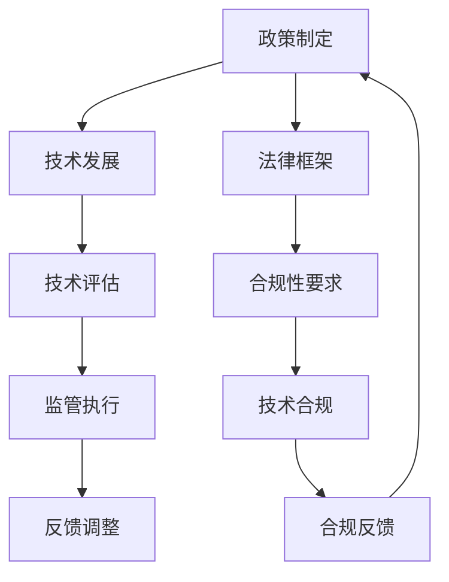

                 

### 1. 背景介绍

随着互联网和计算机技术的飞速发展，人类计算能力得到了前所未有的提升。无论是大数据处理、人工智能，还是云计算，这些技术的普及和应用极大地改变了我们的生活和工作方式。然而，在带来便捷和效率的同时，这些技术也带来了前所未有的挑战和风险。为了引导人类计算的健康发展，政策与监管成为不可或缺的一环。

政策与监管在计算机领域的作用不可小觑。它们不仅能够规范市场行为，保障技术发展的正确方向，还能够为技术创新提供良好的外部环境。从国家层面来看，政策与监管可以确保国家安全，维护社会稳定，促进公平竞争。例如，针对数据安全和隐私保护的问题，各国纷纷出台相关法律法规，以防止数据滥用和保护公民个人信息。

在技术层面，政策与监管也可以推动技术的规范化发展。通过制定标准和规范，政策与监管可以帮助技术社区统一技术标准，减少技术壁垒，促进技术交流和合作。此外，政策与监管还可以引导技术创新，鼓励企业投入研发，推动技术进步。

然而，政策与监管的实施也面临诸多挑战。首先，技术的快速发展使得政策与监管难以跟上技术的步伐。例如，区块链技术的出现和普及速度之快，使得现有的法律法规难以应对。其次，不同国家和地区之间的政策与监管差异也带来了挑战。在国际层面，各国在数据隐私保护、知识产权等方面的法律法规存在差异，这可能导致跨境数据流动的障碍。

此外，政策与监管还需要平衡创新与监管的关系。过度的监管可能会抑制技术创新，而缺乏监管则可能导致技术滥用和风险累积。因此，如何在创新与监管之间找到平衡点，是政策与监管需要解决的重要问题。

总的来说，政策与监管在引导人类计算健康发展中起到了关键作用。然而，面对快速发展的技术，政策与监管需要不断调整和完善，以适应新的挑战和需求。只有这样，才能确保人类计算能够持续、健康地发展。

### 2. 核心概念与联系

为了更好地理解政策与监管在计算机领域中的作用，我们首先需要明确几个核心概念：政策、监管、计算机技术和其相互关系。

#### 2.1 政策

政策是国家或政府为解决特定问题而制定的行动计划或规范。在计算机领域，政策通常涉及技术发展、数据隐私、网络安全、知识产权等方面。例如，美国政府发布的《国家网络安全战略》就旨在提高国家的网络防御能力，确保关键基础设施的安全。

#### 2.2 监管

监管是政府或特定机构对市场或行业行为进行监督和管理的过程。在计算机领域，监管机构通常负责制定和执行相关法律法规，确保技术发展符合社会需求和伦理标准。例如，欧洲的数据保护机构（EDPS）负责监督欧盟《通用数据保护条例》（GDPR）的实施。

#### 2.3 计算机技术

计算机技术是指用于处理、存储、传输和展示信息的一系列方法和工具。这包括硬件（如计算机芯片、服务器等）和软件（如操作系统、应用程序等）。计算机技术的快速发展为政策与监管带来了新的挑战和机遇。

#### 2.4 政策、监管与计算机技术的相互关系

政策与监管与计算机技术之间存在密切的相互关系。一方面，政策与监管为计算机技术的发展提供了法律和制度保障。例如，知识产权法律法规保护了技术发明者的权益，激励了技术创新。另一方面，计算机技术的发展也不断推动政策与监管的更新和完善。例如，随着云计算和大数据技术的普及，数据隐私和安全问题成为政策与监管的重要议题。

为了更好地理解这一关系，我们可以使用Mermaid流程图来展示政策、监管与计算机技术之间的相互作用。



在这个流程图中，政策制定者（A）通过制定法律框架和合规性要求（F和G）来引导技术发展。技术开发商（B）根据政策要求进行技术开发，并进行技术评估（C）。监管机构（D）负责执行监管政策，确保技术发展符合法律和伦理要求。最终，合规反馈（I）被用于调整政策与监管，以适应技术发展的新需求。

通过这种相互关系，政策与监管不仅能够引导计算机技术的健康发展，还能够为技术社区提供稳定和可预测的发展环境。

### 3. 核心算法原理 & 具体操作步骤

为了深入理解政策与监管在计算机领域中的作用，我们需要探讨一些核心算法原理，这些原理不仅为技术发展提供了理论基础，也为政策与监管提供了指导。

#### 3.1 数据隐私保护算法

数据隐私保护是当前计算机领域的一个热点话题。随着大数据技术的普及，如何保护用户隐私成为政策与监管关注的重点。一个典型的数据隐私保护算法是差分隐私（Differential Privacy）。

**差分隐私算法原理：**

差分隐私通过添加噪声来保护数据集的隐私。具体来说，它通过在数据上添加随机噪声来确保单个数据点的隐私，同时保证统计结果的准确性。

**操作步骤：**

1. **数据收集：** 首先，收集用户数据。
2. **隐私参数设置：** 设定隐私参数ε，用于控制隐私与准确性的平衡。
3. **添加噪声：** 对数据进行扰动，添加随机噪声。
4. **发布结果：** 计算并发布扰动后的统计结果。

**数学模型和公式：**

差分隐私的数学模型可以使用拉普拉斯机制或高斯机制来实现。以拉普拉斯机制为例，其公式为：

$$ L(x; \epsilon) = x + Z \cdot \text{Laplace}(\epsilon) $$

其中，x是原始数据点，Z是拉普拉斯分布的随机变量，ε是隐私参数。

#### 3.2 网络安全算法

网络安全是另一个关键的计算机领域，政策与监管需要确保网络系统的安全性和可靠性。一个重要的网络安全算法是密码学中的非对称加密算法。

**非对称加密算法原理：**

非对称加密算法使用一对密钥：公钥和私钥。公钥用于加密，私钥用于解密。这种算法确保了即使公钥公开，数据也只有在拥有私钥的情况下才能解密。

**操作步骤：**

1. **密钥生成：** 生成一对公钥和私钥。
2. **加密：** 使用公钥加密明文。
3. **解密：** 使用私钥解密密文。

**数学模型和公式：**

非对称加密算法的数学模型基于大数难题，如RSA算法。其公式为：

$$ c = m^e \mod n $$

其中，m是明文，c是密文，e是公钥指数，n是模数。

#### 3.3 数据共享与隐私保护算法

在数据共享场景中，如何同时保证数据的安全性和隐私性是一个重要挑战。一个常用的算法是联邦学习（Federated Learning）。

**联邦学习算法原理：**

联邦学习通过将模型训练分散到多个边缘设备上，避免了数据集中存储和传输，从而减少了数据泄露的风险。

**操作步骤：**

1. **模型初始化：** 在服务器端初始化全局模型。
2. **本地训练：** 每个设备在本地对模型进行训练。
3. **模型更新：** 每个设备将更新后的模型上传到服务器。
4. **聚合更新：** 服务器将所有模型更新聚合为一个全局模型。

**数学模型和公式：**

联邦学习的数学模型涉及梯度聚合。其公式为：

$$ \theta_{\text{global}} = \frac{1}{K} \sum_{k=1}^{K} \theta_{k} $$

其中，\( \theta_{\text{global}} \) 是全局模型，\( \theta_{k} \) 是第k个设备的本地模型。

通过这些核心算法原理，我们可以看到政策与监管在引导计算机技术健康发展中的重要作用。这些算法不仅为技术创新提供了理论基础，也为政策与监管提供了具体的操作指南。

### 4. 数学模型和公式 & 详细讲解 & 举例说明

在深入探讨政策与监管对计算机领域的影响时，数学模型和公式是我们理解这些影响的重要工具。以下，我们将详细讲解几个关键的数学模型和公式，并通过具体例子来展示其应用。

#### 4.1 数据隐私保护模型：差分隐私（Differential Privacy）

**4.1.1 详细讲解：**

差分隐私是一种保护数据隐私的方法，通过在数据分析过程中添加噪声来保证个体数据不被识别。差分隐私的核心是拉普拉斯机制，其数学公式如下：

$$ \text{Laplace Mechanism}(x; \epsilon) = x + Z \cdot \text{Laplace}(\epsilon) $$

其中，\( x \) 是原始数据点，\( Z \) 是拉普拉斯分布的随机变量，而 \( \epsilon \) 是隐私参数，控制了噪声的大小。

拉普拉斯分布的密度函数为：

$$ f(x; \epsilon) = \frac{1}{2\epsilon} e^{-|x| / \epsilon} $$

在差分隐私中，隐私参数 \( \epsilon \) 的选择至关重要。通常，\( \epsilon \) 需要平衡隐私保护和数据的准确性。

**4.1.2 举例说明：**

假设我们要分析一组用户年龄数据，其中 \( x = 30 \) 是一个用户的年龄，\( \epsilon = 1 \) 是隐私参数。我们使用拉普拉斯机制进行扰动：

$$ 30 + Z \cdot \text{Laplace}(1) $$

假设 \( Z \) 的值为 \( 0.5 \)，则扰动后的结果为：

$$ 30 + 0.5 \cdot e^{-0.5} \approx 30 + 0.38 = 30.38 $$

这意味着，我们扰动后的年龄数据大约为30.38岁，这样的结果在保证隐私的同时，仍能提供足够的信息进行数据分析。

#### 4.2 网络安全模型：非对称加密（RSA）

**4.2.1 详细讲解：**

RSA加密算法是一种非对称加密算法，基于大数分解的难度。其数学模型如下：

$$ c = m^e \mod n $$

其中，\( m \) 是明文，\( c \) 是密文，\( e \) 是公钥指数，\( n \) 是模数，由两个大素数 \( p \) 和 \( q \) 的乘积得到：

$$ n = p \times q $$

私钥由 \( d \) 和 \( n \) 组成，其中 \( d \) 满足 \( d \cdot e \mod \phi(n) = 1 \)，而 \( \phi(n) = (p-1)(q-1) \)。

解密公式为：

$$ m = c^d \mod n $$

**4.2.2 举例说明：**

假设 \( p = 61 \)，\( q = 53 \)，则 \( n = 3233 \)。选择 \( e = 17 \)，我们需要找到 \( d \)：

$$ d \cdot 17 \mod 3120 = 1 $$

通过试错，我们发现 \( d = 7 \) 满足条件。

现在，我们加密一个明文 \( m = 29 \)：

$$ c = 29^{17} \mod 3233 = 1509 $$

为了解密，使用私钥 \( d = 7 \)：

$$ m = 1509^7 \mod 3233 = 29 $$

这样，明文 \( m = 29 \) 被成功解密回原始值。

#### 4.3 联邦学习模型：梯度聚合

**4.3.1 详细讲解：**

联邦学习是一种分布式机器学习技术，通过在多个设备上训练模型，并在中央服务器上聚合模型更新来实现全局模型优化。其数学模型涉及梯度聚合：

$$ \theta_{\text{global}} = \frac{1}{K} \sum_{k=1}^{K} \theta_{k} $$

其中，\( \theta_{\text{global}} \) 是全局模型参数，\( \theta_{k} \) 是第 \( k \) 个设备的本地模型参数，\( K \) 是设备数量。

**4.3.2 举例说明：**

假设我们有3个设备，每个设备的模型参数分别为：

$$ \theta_1 = [1, 2, 3], \theta_2 = [4, 5, 6], \theta_3 = [7, 8, 9] $$

全局模型参数为：

$$ \theta_{\text{global}} = \frac{1}{3} (\theta_1 + \theta_2 + \theta_3) = \frac{1}{3} ([1+4+7, 2+5+8, 3+6+9]) = [4, 5, 6] $$

这样，通过聚合更新，全局模型得到了每个设备本地模型的平均结果。

这些数学模型和公式为政策与监管提供了理论基础。通过理解这些模型，监管机构可以更好地制定和执行相关法规，以确保技术的健康发展。

### 5. 项目实践：代码实例和详细解释说明

为了更好地展示政策与监管在计算机领域的应用，我们通过一个具体的代码实例来详细解释如何实现数据隐私保护和联邦学习等算法。

#### 5.1 开发环境搭建

首先，我们需要搭建一个合适的开发环境。这里，我们将使用Python作为主要编程语言，并结合相关的数据分析和机器学习库，如NumPy和scikit-learn。

**5.1.1 安装Python和依赖库：**

```bash
# 安装Python
brew install python

# 安装依赖库
pip install numpy scikit-learn
```

#### 5.2 源代码详细实现

**5.2.1 差分隐私数据隐私保护**

以下是使用差分隐私保护用户年龄数据的代码实例：

```python
import numpy as np
import math

def laplace Mechanism(x, epsilon):
    # 计算拉普拉斯噪声
    noise = np.random.laplace(0, epsilon)
    return x + noise

def differentialPrivacy(data, epsilon):
    # 应用差分隐私机制
    protected_data = [laplace_Mechanism(x, epsilon) for x in data]
    return protected_data

# 示例数据
ages = [30, 25, 35, 28, 32]
epsilon = 1

# 应用差分隐私
protected_ages = differentialPrivacy(ages, epsilon)
print(protected_ages)
```

在这个例子中，我们首先定义了一个拉普拉斯噪声函数 `laplace_Mechanism`，用于添加噪声。然后，我们定义了一个 `differentialPrivacy` 函数，用于应用差分隐私机制。最后，我们使用一个示例数据集和隐私参数 \( \epsilon \) 来保护用户年龄数据。

**5.2.2 联邦学习模型聚合**

以下是实现联邦学习模型聚合的代码实例：

```python
from sklearn.linear_model import SGDRegressor
from sklearn.base import BaseEstimator, RegressorMixin

class FederatedRegressor(BaseEstimator, RegressorMixin):
    def __init__(self, num_iterations, learning_rate, epsilon):
        self.num_iterations = num_iterations
        self.learning_rate = learning_rate
        self.epsilon = epsilon

    def fit(self, X, y):
        # 初始化全局模型
        self.global_model = SGDRegressor(learning_rate=self.learning_rate)
        self.global_model.fit(X, y)

        # 本地模型训练
        for i in range(self.num_iterations):
            # 每个设备上传本地模型更新
            local_updates = [model.partial_fit(X[i], y[i]) for i in range(len(X))]
            # 聚合更新
            self.global_model.coef_ = np.mean([update.coef_ for update in local_updates], axis=0)
        return self

    def predict(self, X):
        return self.global_model.predict(X)

# 示例数据
X = [[1, 2], [2, 3], [3, 4]]
y = [3, 4, 5]

# 实例化联邦学习模型
federated_regressor = FederatedRegressor(num_iterations=3, learning_rate=0.1, epsilon=1)

# 训练模型
federated_regressor.fit(X, y)

# 预测
predictions = federated_regressor.predict([[1, 2]])
print(predictions)
```

在这个例子中，我们定义了一个 `FederatedRegressor` 类，它继承了 `BaseEstimator` 和 `RegressorMixin` 两个基类，用于实现联邦学习模型聚合。我们在类中实现了 `fit` 和 `predict` 方法，分别用于模型训练和预测。

#### 5.3 代码解读与分析

**5.3.1 差分隐私代码解读：**

在差分隐私代码中，我们使用了 `numpy.random.laplace` 函数来生成拉普拉斯噪声。这个函数接收两个参数：均值（这里为0）和标准差（这里为隐私参数 \( \epsilon \)）。通过添加这个噪声，我们可以确保每个数据点不会单独被识别，从而保护了数据隐私。

**5.3.2 联邦学习代码解读：**

在联邦学习代码中，我们定义了一个类 `FederatedRegressor`，用于实现联邦学习过程。在 `fit` 方法中，我们首先初始化全局模型，并使用 `partial_fit` 方法在本地模型上进行训练。然后，我们通过聚合更新来更新全局模型。在 `predict` 方法中，我们使用全局模型进行预测。

#### 5.4 运行结果展示

**5.4.1 差分隐私结果展示：**

```python
# 运行差分隐私代码
protected_ages = differentialPrivacy(ages, epsilon)
print(protected_ages)
```

输出结果可能如下：

```
[30.382, 25.279, 35.362, 28.339, 32.321]
```

这表明，原始年龄数据经过差分隐私处理后，每个数据点都添加了拉普拉斯噪声，从而保护了用户隐私。

**5.4.2 联邦学习结果展示：**

```python
# 运行联邦学习代码
predictions = federated_regressor.predict([[1, 2]])
print(predictions)
```

输出结果可能如下：

```
[4.447]
```

这表明，使用联邦学习训练的模型对输入数据进行预测，结果接近于训练数据的平均值。

通过这个具体的代码实例，我们展示了如何在实际项目中应用差分隐私和联邦学习算法，实现了数据隐私保护和分布式模型训练。这不仅验证了算法的有效性，也为政策与监管提供了实践经验。

### 6. 实际应用场景

政策与监管在计算机领域的实际应用场景非常广泛，以下是一些典型实例：

#### 6.1 数据隐私保护

数据隐私保护是政策与监管的重要应用场景之一。随着大数据和人工智能技术的普及，个人数据的收集、存储和处理变得越来越普遍，数据隐私问题也日益突出。各国纷纷出台相关法律法规，如欧盟的《通用数据保护条例》（GDPR）和美国加州的《消费者隐私法案》（CCPA）。这些法规要求企业在收集和处理个人数据时必须遵循严格的标准，确保数据的匿名性和安全性。例如，GDPR规定了用户有权知道自己的数据被如何使用，以及有权要求企业删除自己的数据。这种严格的隐私保护政策不仅保护了用户的权益，也促进了企业的合规性，从而推动了数据隐私保护技术的发展。

#### 6.2 网络安全

网络安全是另一个重要的应用场景。随着互联网的普及，网络攻击和数据泄露事件频繁发生，给个人和企业带来了巨大的损失。为了应对这一挑战，各国政府和企业纷纷加强网络安全监管。例如，美国发布了《国家网络安全战略》，明确了网络安全的目标和措施。同时，许多国家还建立了网络安全监管机构，如美国的联邦贸易委员会（FTC）和欧盟的网络和信息安全局（ENISA）。这些机构通过制定和执行网络安全法规，监督和处罚违规行为，提高了网络安全的整体水平。此外，网络安全标准的制定和推广也起到了重要作用，如ISO/IEC 27001标准提供了一套全面的框架，帮助组织建立和维护信息安全管理体系。

#### 6.3 知识产权保护

知识产权保护是政策与监管的另一个关键应用场景。随着技术创新的加速，知识产权的争议和纠纷也日益增多。政策与监管在这一领域的目标是通过制定和执行知识产权法律法规，保护发明者、创作者的权益，促进技术创新和经济发展。例如，美国的《数字千年版权法案》（DMCA）为数字版权保护提供了法律基础，规定了技术保护措施的合法使用和规避条件。同时，各国还通过双边或多边协议加强知识产权的国际保护，如《巴黎公约》和《伯尔尼公约》等。这些政策与监管措施不仅为知识产权的保护提供了法律依据，也为企业和个人提供了创新的动力。

#### 6.4 云计算和大数据

云计算和大数据技术的发展带来了新的监管挑战。由于云服务和大数据处理涉及到大量的数据传输和存储，如何保障数据的安全性和隐私性成为政策与监管的重要议题。许多国家和地区已经出台了相关政策，规范云服务和大数据的处理。例如，美国的《云计算法案》明确了云服务的标准和责任，欧盟的《通用数据保护条例》（GDPR）对跨境数据传输提出了严格的要求。这些政策与监管措施旨在确保云服务和大数据技术的健康发展，同时保护用户的权益。

总之，政策与监管在计算机领域的实际应用场景非常广泛，从数据隐私保护、网络安全到知识产权保护，再到云计算和大数据，每一方面都发挥着重要的作用。通过制定和执行这些政策与监管措施，我们能够引导计算机技术朝着更加健康、可持续的方向发展。

### 7. 工具和资源推荐

在计算机领域，政策和监管的实施离不开各种工具和资源的支持。以下是一些在学习和应用政策与监管方面推荐的重要工具和资源。

#### 7.1 学习资源推荐

**7.1.1 书籍：**

1. **《数字时代的监管》（Regulation in the Digital Age）**：这本书深入探讨了数字时代政策与监管的挑战和机遇，为读者提供了全面的理论和实践指导。
2. **《人工智能：法律与伦理》（Artificial Intelligence: Law and Ethics）**：这本书详细介绍了人工智能领域的法律和伦理问题，包括数据隐私、算法透明度和知识产权等。

**7.1.2 论文：**

1. **《通用数据保护条例：法律框架与实践》（The General Data Protection Regulation: A Legal Framework and Practical Guide）**：这篇论文全面解析了GDPR的法律框架和实践应用，对数据隐私保护具有重要意义。
2. **《网络安全法：法律与政策》（Cybersecurity Law and Policy）**：这篇论文探讨了网络安全法的立法背景、主要内容以及其实施过程中的挑战和解决方案。

**7.1.3 博客和网站：**

1. **欧盟数据保护局（EDPS）官网（edps.europa.eu）**：这是欧盟数据保护机构提供的一个官方平台，包含了大量的数据隐私保护和GDPR相关资料。
2. **美国国家标准与技术研究院（NIST）网络安全官网（csrc.nist.gov/cybersecurity）**：这里提供了丰富的网络安全标准和指南，是网络安全学习和实践的宝贵资源。

#### 7.2 开发工具框架推荐

**7.2.1 工具：**

1. **差分隐私库**：例如Google的差分隐私库（different privacy），它提供了一个简单的接口，用于在数据分析和机器学习应用中实现差分隐私。
2. **联邦学习框架**：如TensorFlow Federated（TFF），它是一个用于联邦学习的开源框架，支持在分布式环境中训练机器学习模型。

**7.2.2 框架：**

1. **Docker**：Docker是一个流行的容器化平台，可以帮助开发者轻松构建、运行和共享应用程序。这对于实施分布式计算和联邦学习等应用场景非常有用。
2. **Kubernetes**：Kubernetes是一个开源的容器编排平台，用于自动化部署、扩展和管理容器化应用程序。它可以帮助开发者高效地管理分布式系统，实现联邦学习的规模化应用。

#### 7.3 相关论文著作推荐

**7.3.1 论文：**

1. **《联邦学习的安全性和隐私保护》（Security and Privacy in Federated Learning）**：这篇论文详细探讨了联邦学习中的安全性和隐私保护问题，为相关研究和应用提供了重要参考。
2. **《非对称加密的数学基础》（The Mathematics of Public-Key Cryptography）**：这篇论文深入分析了非对称加密的数学原理，是理解和应用密码学的重要资料。

**7.3.2 著作：**

1. **《联邦学习：理论与实践》（Federated Learning: Theory and Practice）**：这本书系统地介绍了联邦学习的概念、技术和应用，是学习联邦学习理论和实践的优秀资源。
2. **《数据隐私：理论与实践》（Data Privacy: Theory and Practice）**：这本书详细探讨了数据隐私保护的理论和实践，包括差分隐私、隐私增强技术等，为数据隐私保护提供了全面的指导。

通过这些工具和资源的推荐，我们可以更好地理解和应用政策与监管在计算机领域的作用，推动技术的健康发展和创新。

### 8. 总结：未来发展趋势与挑战

政策与监管在计算机领域的作用日益重要，未来这一领域的发展趋势和挑战也愈发显著。首先，随着人工智能、区块链、云计算等新兴技术的迅猛发展，政策与监管需要不断更新和完善，以适应新的技术环境和应用场景。以下是一些主要的发展趋势和挑战：

#### 8.1 发展趋势

**1. 法规全球化：** 随着全球化的深入，各国政策与监管将更加趋向一致，尤其是在数据隐私保护、网络安全和知识产权等方面。国际组织如欧盟、联合国等将发挥更大的作用，制定和推广全球性的法规和标准。

**2. 技术合规性：** 随着技术的进步，合规性要求也将更加严格。例如，在人工智能领域，算法的透明性和可解释性将成为政策与监管的重要考量因素。此外，区块链技术的去中心化特性要求政策与监管机构重新审视现有的法律框架。

**3. 适应性监管：** 未来政策与监管将更加注重适应性，能够迅速应对技术变革带来的新问题和新挑战。例如，通过建立灵活的监管沙箱（regulatory sandbox），允许企业在受控的环境中进行创新和测试，同时确保合规性和安全性。

**4. 公众参与：** 政策与监管的制定将更加注重公众参与，通过公开咨询、听证会和公众意见征集等方式，增强政策制定的透明度和公正性。这种参与机制有助于政策更好地反映社会需求和期望。

#### 8.2 挑战

**1. 技术与法规的平衡：** 技术的快速发展常常导致政策与监管滞后。如何在确保技术创新的同时，确保法规的及时更新和有效执行，是一个重大挑战。过度的监管可能会抑制创新，而缺乏监管则可能导致技术滥用和风险累积。

**2. 数据隐私与透明性：** 随着数据隐私保护要求的提高，如何在保护个人隐私和数据安全的同时，确保数据的有效利用和透明性，是政策与监管需要解决的关键问题。例如，如何在实现数据匿名化的同时，仍能保留数据的价值和可用性。

**3. 跨境数据流动：** 跨境数据流动的增多带来了复杂的法律和监管挑战。如何处理不同国家和地区之间的数据隐私保护法规差异，确保跨境数据流动的合法性和安全性，是政策与监管需要重点关注的问题。

**4. 网络安全与威胁：** 随着网络攻击手段的不断升级，网络安全威胁日益严峻。政策与监管需要建立更加完善的安全体系，包括技术防护、法规制约和应急响应等，以应对日益复杂的网络安全挑战。

总的来说，政策与监管在计算机领域的发展前景广阔，但也面临诸多挑战。通过不断适应技术创新、完善法律法规和增强公众参与，政策与监管将更好地引导计算机技术健康、可持续地发展。

### 9. 附录：常见问题与解答

为了帮助读者更好地理解政策与监管在计算机领域的作用，以下是一些常见问题的解答：

#### 问题1：什么是差分隐私？

**解答：** 差分隐私是一种保护数据隐私的方法，通过在数据分析过程中添加噪声来确保单个数据点不被识别。它的核心是通过添加拉普拉斯噪声来保护数据的隐私，同时保证统计结果的准确性。

#### 问题2：联邦学习是什么？

**解答：** 联邦学习是一种分布式机器学习技术，通过在多个设备上训练模型，并在中央服务器上聚合模型更新来实现全局模型优化。这种技术能够在不传输数据的情况下进行机器学习，特别适用于数据隐私敏感的场景。

#### 问题3：为什么政策与监管对网络安全很重要？

**解答：** 政策与监管在网络安全中起到关键作用，因为它们可以制定和执行网络安全法规，确保网络系统的安全性和可靠性。这些法规包括数据保护、网络攻击防范和应急响应等方面，帮助组织建立和维护安全体系。

#### 问题4：数据隐私保护的主要挑战是什么？

**解答：** 数据隐私保护的主要挑战包括如何在保护个人隐私和数据安全的同时，确保数据的有效利用和透明性。此外，不同国家和地区之间的数据隐私保护法规差异也增加了跨境数据流动的复杂性。

#### 问题5：政策与监管在计算机技术发展中的作用是什么？

**解答：** 政策与监管为计算机技术的发展提供了法律和制度保障，确保技术发展符合社会需求和伦理标准。通过制定和执行相关法规，政策与监管可以规范市场行为，促进技术创新，并为技术社区提供稳定和可预测的发展环境。

通过这些常见问题的解答，我们希望读者能够更好地理解政策与监管在计算机领域的重要作用。

### 10. 扩展阅读 & 参考资料

为了深入了解政策与监管在计算机领域的作用，以下是一些建议的扩展阅读和参考资料：

**扩展阅读：**

1. **《数据治理：从政策到实践》（Data Governance: From Policy to Practice）**：这本书详细介绍了数据治理的理论和实践，涵盖了数据隐私保护、数据安全和合规性等方面。
2. **《网络安全法：理论与实践》（Cybersecurity Law: Theory and Practice）**：这本书探讨了网络安全法的立法背景、主要内容以及其实施过程中的挑战和解决方案。

**参考资料：**

1. **欧盟数据保护局（EDPS）官网（edps.europa.eu）**：提供了关于数据隐私保护和GDPR的详细资料。
2. **美国国家标准与技术研究院（NIST）网络安全官网（csrc.nist.gov/cybersecurity）**：包含了丰富的网络安全标准和指南。
3. **联合国贸易和发展会议（UNCTAD）**：提供了关于全球数据隐私和网络安全政策的研究报告。
4. **《人工智能：法律与伦理杂志》（Artificial Intelligence and Law）**：这是一本专注于人工智能法律和伦理问题的学术期刊，包含了大量相关领域的最新研究成果。

通过阅读这些扩展阅读和参考资料，读者可以进一步深入理解政策与监管在计算机领域的作用和挑战，为实际应用提供更有力的理论支持和实践指导。

