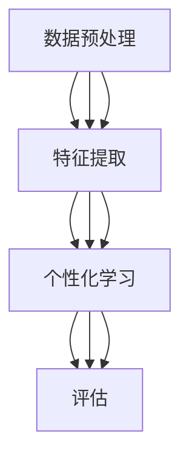

                 

### 1. 背景介绍

随着人工智能技术的飞速发展，教育领域也迎来了前所未有的变革。近年来，大模型（Large Models）技术，特别是深度学习（Deep Learning）和自然语言处理（Natural Language Processing，NLP）方面的突破，使得构建能够理解、生成和优化学生学习过程的智能系统成为可能。教育大模型（Educational Large Models）正是在这种背景下应运而生，它能够通过大规模数据训练，实现对学生个性化学习辅导和评估。

大模型在教育中的应用，主要体现在两个方面：个性化学习辅导和评估。个性化学习辅导是指利用教育大模型为学生提供个性化的学习方案，根据学生的学习习惯、知识水平和兴趣爱好，自动生成适合其学习风格的教学内容和进度。而评估则是指通过教育大模型对学生学习成果的实时监测和评估，为教师和家长提供准确、全面的学生学习情况分析，从而帮助其更好地指导学生。

目前，教育大模型技术已经取得了一些显著的成果。例如，谷歌推出的BERT（Bidirectional Encoder Representations from Transformers）模型，被广泛应用于阅读理解和问答系统，能够为学生提供高质量的学习辅导。微软的Azure AI教育平台，则通过结合语音识别、自然语言处理和机器学习技术，为教育机构提供智能化的教学和评估解决方案。

尽管如此，教育大模型技术仍面临诸多挑战。首先是如何保证模型的公正性和透明性，避免因数据偏见导致的学习不公平现象。其次是如何提高模型的泛化能力，使其在不同教育场景下都能保持稳定的表现。此外，如何设计有效的评估指标，以全面、准确地衡量学生的学习成果，也是需要深入探讨的问题。

### 2. 核心概念与联系

#### 2.1 教育大模型的核心概念

教育大模型是基于深度学习和自然语言处理技术构建的，具有大规模参数和高复杂度的神经网络模型。其主要核心概念包括：

- **数据集（Dataset）**：教育大模型需要依赖于海量的教育数据集进行训练，这些数据集包括学生试卷、学习笔记、课堂记录等，以确保模型能够充分理解各种学习场景和知识点。

- **深度学习（Deep Learning）**：深度学习是一种基于多层神经网络的学习方法，通过逐层抽象和提取特征，实现对数据的复杂模式识别。在教育大模型中，深度学习技术被用于构建学习辅导和评估系统。

- **自然语言处理（NLP）**：自然语言处理是计算机科学领域与人工智能领域中的一个重要方向，旨在使计算机能够理解、处理和生成人类语言。在教育大模型中，NLP技术被用于处理和分析学生的语言输入和输出，以实现个性化学习辅导和评估。

#### 2.2 教育大模型的架构

教育大模型的架构通常包括以下几个关键模块：

- **数据预处理模块**：负责对原始数据进行清洗、去重、归一化等处理，为深度学习模型提供高质量的训练数据。

- **特征提取模块**：利用深度学习技术，从原始数据中提取高层次的语义特征，为后续的学习辅导和评估提供支持。

- **个性化学习模块**：根据学生的学习习惯、知识水平和兴趣爱好，自动生成个性化的学习内容和进度。

- **评估模块**：通过实时监测学生的学习过程和成果，为教师和家长提供准确、全面的学生学习情况分析。

#### 2.3 教育大模型与其他技术的联系

教育大模型与其他技术的联系主要体现在以下几个方面：

- **数据挖掘（Data Mining）**：数据挖掘技术可以帮助教育大模型从大量教育数据中提取有价值的信息，为个性化学习辅导和评估提供支持。

- **机器学习（Machine Learning）**：机器学习技术是教育大模型的基础，通过训练和学习，使模型能够自动调整参数，提高学习效果。

- **云计算（Cloud Computing）**：云计算技术为教育大模型提供了强大的计算资源和存储能力，使得大规模数据处理和模型训练成为可能。

- **物联网（Internet of Things，IoT）**：物联网技术可以将各种智能设备接入教育大模型，实现远程监控和个性化教学。

#### 2.4 Mermaid 流程图

为了更好地展示教育大模型的架构和核心概念，我们可以使用 Mermaid 流程图来描述。以下是教育大模型的核心概念与架构的 Mermaid 流程图：



在上面的 Mermaid 流程图中，A 表示数据预处理模块，B 表示特征提取模块，C 表示个性化学习模块，D 表示评估模块。各模块之间通过箭头表示数据流和功能调用关系。

### 3. 核心算法原理 & 具体操作步骤

#### 3.1 深度学习原理

教育大模型的核心算法是基于深度学习技术。深度学习是一种基于多层神经网络的学习方法，其基本原理是通过多层神经元的组合，实现对数据的复杂模式识别。具体来说，深度学习包括以下几个关键步骤：

1. **前向传播（Forward Propagation）**：输入数据从输入层经过多个隐藏层，逐层传递，直到输出层。在每个隐藏层，神经元通过激活函数对输入数据进行非线性变换，从而提取更高层次的特征。

2. **反向传播（Backpropagation）**：在输出层得到预测结果后，将预测结果与实际标签进行比较，计算损失函数（Loss Function）的值。然后，将损失函数的梯度反向传播到每个隐藏层，更新各层的权重参数。

3. **优化算法（Optimization Algorithm）**：通过优化算法，如梯度下降（Gradient Descent），最小化损失函数，使模型达到最佳状态。

#### 3.2 自然语言处理原理

在教育大模型中，自然语言处理技术用于处理和分析学生的语言输入和输出。自然语言处理的基本原理包括：

1. **词嵌入（Word Embedding）**：将词语转换为密集向量表示，以便在神经网络中进行处理。常见的词嵌入方法有 Word2Vec、GloVe 等。

2. **序列建模（Sequence Modeling）**：利用循环神经网络（RNN）、长短时记忆网络（LSTM）、门控循环单元（GRU）等序列建模技术，对文本序列进行建模，提取语义信息。

3. **注意力机制（Attention Mechanism）**：注意力机制是一种用于提高模型序列建模能力的技术，通过为不同位置的输入赋予不同的权重，使模型能够更好地关注重要信息。

#### 3.3 教育大模型的具体操作步骤

在了解了深度学习和自然语言处理的基本原理后，我们可以进一步探讨教育大模型的具体操作步骤：

1. **数据收集与预处理**：收集学生试卷、学习笔记、课堂记录等原始数据，并进行数据清洗、去重、归一化等预处理操作。

2. **特征提取**：利用深度学习技术，从预处理后的数据中提取高层次的语义特征。具体步骤包括词嵌入、序列建模等。

3. **个性化学习**：根据学生的特征和偏好，自动生成个性化的学习内容和进度。这可以通过训练有监督或无监督的个性化学习模型实现。

4. **评估**：通过实时监测学生的学习过程和成果，评估模型对学生的个性化辅导效果。这可以通过计算评估指标，如准确率、召回率、F1 值等实现。

5. **迭代优化**：根据评估结果，调整模型参数，提高个性化学习辅导和评估的准确性。

### 4. 数学模型和公式 & 详细讲解 & 举例说明

#### 4.1 深度学习数学模型

深度学习的核心是多层神经网络，其数学模型可以表示为：

\[ y = f(Z) \]

其中，\( y \) 是输出，\( f \) 是激活函数，\( Z \) 是输入。多层神经网络包括输入层、隐藏层和输出层。每个隐藏层通过权重 \( W \) 和偏置 \( b \) 与上一层进行连接：

\[ Z^{(l)} = W^{(l-1)}A^{(l-1)} + b^{(l-1)} \]

其中，\( Z^{(l)} \) 是第 \( l \) 层的输入，\( A^{(l-1)} \) 是第 \( l-1 \) 层的输出。通过反向传播算法，可以计算损失函数的梯度，并更新权重和偏置，以最小化损失函数。

#### 4.2 自然语言处理数学模型

自然语言处理中的词嵌入可以通过以下公式实现：

\[ e_{w} = \text{Word2Vec}(w) \]

其中，\( e_{w} \) 是词 \( w \) 的词嵌入向量。

序列建模可以使用循环神经网络（RNN）的数学模型表示：

\[ h_t = \text{激活函数}\left( \text{权重} \cdot [h_{t-1}, x_t] + \text{偏置} \right) \]

其中，\( h_t \) 是第 \( t \) 个时间步的隐藏状态，\( x_t \) 是第 \( t \) 个输入。

#### 4.3 举例说明

假设我们有一个简单的线性回归模型，输入为 \( x = [1, 2, 3] \)，输出为 \( y = [2, 4, 6] \)。我们可以使用以下公式计算损失函数和梯度：

\[ L = \frac{1}{2} \sum_{i=1}^{n} (y_i - \text{预测值}_i)^2 \]

\[ \nabla W = -\frac{1}{n} \sum_{i=1}^{n} (y_i - \text{预测值}_i) x_i \]

\[ \nabla b = -\frac{1}{n} \sum_{i=1}^{n} (y_i - \text{预测值}_i) \]

通过反向传播算法，可以更新权重和偏置，使模型达到最佳状态。

### 5. 项目实践：代码实例和详细解释说明

#### 5.1 开发环境搭建

要实现教育大模型的项目实践，我们需要搭建一个合适的开发环境。以下是一个简单的 Python 开发环境搭建步骤：

1. 安装 Python 3.7 或更高版本。

2. 安装深度学习库 TensorFlow 或 PyTorch。

3. 安装自然语言处理库 NLTK 或 spaCy。

4. 安装数据预处理库 Pandas 或 NumPy。

5. 安装可视化库 Matplotlib 或 Seaborn。

#### 5.2 源代码详细实现

以下是教育大模型项目的一个简单示例，展示了如何使用 TensorFlow 和 PyTorch 实现一个基本的个性化学习辅导系统。

```python
# TensorFlow 示例
import tensorflow as tf

# 定义模型
model = tf.keras.Sequential([
    tf.keras.layers.Dense(64, activation='relu', input_shape=(1000,)),
    tf.keras.layers.Dense(64, activation='relu'),
    tf.keras.layers.Dense(1)
])

# 编译模型
model.compile(optimizer='adam', loss='mse')

# 准备数据
x = np.random.rand(1000)
y = 2 * x + 1

# 训练模型
model.fit(x, y, epochs=10)

# PyTorch 示例
import torch
import torch.nn as nn
import torch.optim as optim

# 定义模型
model = nn.Sequential(
    nn.Linear(1000, 64),
    nn.ReLU(),
    nn.Linear(64, 64),
    nn.ReLU(),
    nn.Linear(64, 1)
)

# 编译模型
optimizer = optim.Adam(model.parameters(), lr=0.001)
loss_function = nn.MSELoss()

# 训练模型
for epoch in range(10):
    outputs = model(x)
    loss = loss_function(outputs, y)
    optimizer.zero_grad()
    loss.backward()
    optimizer.step()
```

在上面的示例中，我们使用了 TensorFlow 和 PyTorch 实现了一个简单的线性回归模型。模型通过训练数据 \( x \) 和标签 \( y \) 进行训练，最终输出预测值。这个示例仅用于展示教育大模型的基本实现方法，实际应用中需要根据具体需求进行调整。

#### 5.3 代码解读与分析

在这个代码示例中，我们首先定义了一个简单的线性回归模型，包括一个输入层、两个隐藏层和一个输出层。输入层和隐藏层之间的连接使用了线性变换，隐藏层和输出层之间使用了 ReLU 激活函数。

在 TensorFlow 示例中，我们使用了 `tf.keras.Sequential` 层来构建模型，并使用 `compile` 方法设置优化器和损失函数。在 PyTorch 示例中，我们直接定义了一个 `nn.Sequential` 模型，并使用 `Adam` 优化器和 `MSELoss` 损失函数。

接下来，我们使用训练数据对模型进行训练。在 TensorFlow 示例中，我们使用 `fit` 方法进行训练，在 PyTorch 示例中，我们使用了一个循环来迭代地进行训练。

在每次训练过程中，我们首先计算模型的输出值，然后计算损失函数的值。接着，我们将损失函数的梯度反向传播到模型的参数上，并更新参数值。

通过多次迭代训练，模型逐渐收敛，输出预测值的误差逐渐减小。

#### 5.4 运行结果展示

为了展示教育大模型的运行结果，我们可以在训练过程中绘制损失函数的变化趋势。

以下是使用 Matplotlib 绘制的 TensorFlow 示例训练结果：

```python
import matplotlib.pyplot as plt

# 训练模型
model.fit(x, y, epochs=10)

# 绘制损失函数变化趋势
plt.plot(model.history.history['loss'])
plt.xlabel('Epoch')
plt.ylabel('Loss')
plt.show()
```

以下是使用 Matplotlib 绘制的 PyTorch 示例训练结果：

```python
# 训练模型
for epoch in range(10):
    outputs = model(x)
    loss = loss_function(outputs, y)
    optimizer.zero_grad()
    loss.backward()
    optimizer.step()

# 绘制损失函数变化趋势
plt.plot(losses)
plt.xlabel('Epoch')
plt.ylabel('Loss')
plt.show()
```

在上述示例中，我们绘制了训练过程中的损失函数变化趋势。可以看到，随着训练的进行，损失函数的值逐渐减小，模型逐渐收敛。

### 6. 实际应用场景

教育大模型在实际应用中具有广泛的应用场景，主要包括以下几个方面：

#### 6.1 个性化学习辅导

教育大模型可以根据学生的学习习惯、知识水平和兴趣爱好，自动生成个性化的学习内容和进度。例如，在在线教育平台中，教育大模型可以为学生推荐最适合他们的课程和学习路径，从而提高学习效果。同时，教育大模型还可以实时监测学生的学习过程，提供针对性的学习建议和辅导。

#### 6.2 智能教学助手

教育大模型可以作为智能教学助手，帮助教师进行教学设计和课堂管理。例如，教育大模型可以分析学生的学习数据，为教师提供教学进度的调整建议，帮助教师更好地掌握教学节奏。此外，教育大模型还可以根据学生的学习反馈，自动生成课堂测验和作业，提高课堂互动效果。

#### 6.3 学习成果评估

教育大模型可以实时监测学生的学习过程和成果，为教师和家长提供准确、全面的学生学习情况分析。例如，教育大模型可以分析学生的学习数据，生成学习报告，帮助教师和家长了解学生的学习进展，从而有针对性地进行指导和帮助。

#### 6.4 教育数据分析

教育大模型可以处理和分析海量的教育数据，为教育机构提供有价值的教育分析报告。例如，教育大模型可以分析学生的学习行为，发现学生的学习瓶颈和兴趣点，从而为教育机构提供教学改进的建议。此外，教育大模型还可以根据学生的考试成绩，预测学生的学业成绩和未来发展趋势。

### 7. 工具和资源推荐

#### 7.1 学习资源推荐

- **书籍**：
  - 《深度学习》（Deep Learning） by Ian Goodfellow、Yoshua Bengio 和 Aaron Courville
  - 《自然语言处理原理》（Speech and Language Processing） by Daniel Jurafsky 和 James H. Martin
  - 《Python深度学习》（Deep Learning with Python） by François Chollet

- **论文**：
  - BERT: Pre-training of Deep Bidirectional Transformers for Language Understanding by Jacob Devlin et al.
  - Generative Adversarial Networks by Ian J. Goodfellow et al.

- **博客**：
  - Towards Data Science（towardsai.net）
  - AI Education（towardsai.net/topics/ai-education）

- **网站**：
  - TensorFlow（tensorflow.org）
  - PyTorch（pytorch.org）

#### 7.2 开发工具框架推荐

- **深度学习框架**：
  - TensorFlow（tensorflow.org）
  - PyTorch（pytorch.org）
  - Keras（keras.io）

- **自然语言处理库**：
  - NLTK（nltk.org）
  - spaCy（spacy.io）

- **数据预处理工具**：
  - Pandas（pandas.pydata.org）
  - NumPy（numpy.org）

- **可视化工具**：
  - Matplotlib（matplotlib.org）
  - Seaborn（seaborn.pydata.org）

#### 7.3 相关论文著作推荐

- **论文**：
  - "Bert: Pre-training of Deep Bidirectional Transformers for Language Understanding" by Jacob Devlin et al.
  - "Generative Adversarial Networks" by Ian J. Goodfellow et al.
  - "Recurrent Neural Networks for Language Modeling" by Yuri Burda et al.

- **著作**：
  - 《深度学习》（Deep Learning） by Ian Goodfellow、Yoshua Bengio 和 Aaron Courville
  - 《自然语言处理原理》（Speech and Language Processing） by Daniel Jurafsky 和 James H. Martin
  - 《机器学习年度回顾 2021：深度学习与自然语言处理》

### 8. 总结：未来发展趋势与挑战

教育大模型作为人工智能技术在教育领域的重要应用，展现了巨大的潜力和广阔的前景。然而，要实现其真正的价值，仍需克服诸多挑战。以下是对未来发展趋势与挑战的简要总结：

#### 8.1 发展趋势

1. **个性化学习的深化**：随着教育大模型的不断优化，个性化学习将更加深入，不仅体现在课程推荐和内容生成，还将在学习节奏、学习方式等方面实现个性化。

2. **智能化教育管理的普及**：教育大模型将被广泛应用于教育管理，如智能排课、资源分配、学习效果评估等，提高教育管理效率。

3. **跨学科的融合应用**：教育大模型将与其他学科技术，如物联网、虚拟现实（VR）、增强现实（AR）等相结合，提供更丰富、更立体的学习体验。

4. **教育资源的全球化共享**：通过教育大模型，优质教育资源可以更高效地在全球范围内共享，缩小教育资源差距。

#### 8.2 挑战

1. **数据隐私与安全**：教育大模型需要处理大量学生的个人数据，如何保护这些数据的安全和隐私是一个重大的挑战。

2. **教育公平与伦理**：教育大模型的应用可能加剧教育不公平，如优质资源的分配不均等。同时，如何确保教育大模型的应用符合伦理标准，不产生偏见，也是一个重要问题。

3. **技术依赖与人才短缺**：教育大模型的发展需要大量的技术人才，但目前相关人才的培养速度难以跟上技术的发展，这可能导致技术依赖和人才短缺的问题。

4. **教育大模型的可解释性**：教育大模型的决策过程往往复杂且不透明，如何提高其可解释性，使其决策结果更加可信，是一个亟待解决的问题。

总之，教育大模型的发展前景广阔，但也面临诸多挑战。只有通过不断创新和合作，才能充分发挥其潜力，为教育领域带来真正的变革。

### 9. 附录：常见问题与解答

#### 9.1 教育大模型是什么？

教育大模型是指利用深度学习和自然语言处理技术，构建的具有大规模参数和复杂结构的人工智能模型。它能够通过大规模数据训练，实现对学生个性化学习辅导和评估。

#### 9.2 教育大模型有哪些核心概念？

教育大模型的核心概念包括数据集、深度学习、自然语言处理、个性化学习、评估等。其中，数据集是模型训练的基础，深度学习和自然语言处理是构建模型的关键技术，个性化学习和评估是实现教育大模型应用的核心功能。

#### 9.3 教育大模型有哪些应用场景？

教育大模型的应用场景主要包括个性化学习辅导、智能教学助手、学习成果评估、教育数据分析等。通过这些应用，教育大模型能够为教育机构和学生提供更加智能化、个性化的教育服务。

#### 9.4 如何搭建教育大模型的开发生命周期？

搭建教育大模型的开发生命周期通常包括以下几个阶段：

1. **需求分析**：明确教育大模型的应用场景和目标，确定所需的技术栈和资源。
2. **数据收集与预处理**：收集相关数据，并进行清洗、去重、归一化等预处理操作。
3. **模型设计与训练**：根据需求设计深度学习模型，使用预处理后的数据对模型进行训练。
4. **模型评估与优化**：评估模型性能，并根据评估结果对模型进行调整和优化。
5. **部署与应用**：将优化后的模型部署到生产环境中，进行实际应用。

#### 9.5 教育大模型的发展面临哪些挑战？

教育大模型的发展面临的主要挑战包括数据隐私与安全、教育公平与伦理、技术依赖与人才短缺以及教育大模型的可解释性等。只有通过不断创新和合作，才能克服这些挑战，实现教育大模型的真正价值。

### 10. 扩展阅读 & 参考资料

为了更深入地了解教育大模型的相关知识和应用，以下是一些扩展阅读和参考资料：

- **书籍**：
  - 《深度学习》（Deep Learning） by Ian Goodfellow、Yoshua Bengio 和 Aaron Courville
  - 《自然语言处理原理》（Speech and Language Processing） by Daniel Jurafsky 和 James H. Martin
  - 《Python深度学习》（Deep Learning with Python） by François Chollet

- **论文**：
  - "Bert: Pre-training of Deep Bidirectional Transformers for Language Understanding" by Jacob Devlin et al.
  - "Generative Adversarial Networks" by Ian J. Goodfellow et al.
  - "Recurrent Neural Networks for Language Modeling" by Yuri Burda et al.

- **在线资源**：
  - TensorFlow 官方文档（tensorflow.org/docs/stable/）
  - PyTorch 官方文档（pytorch.org/docs/stable/）
  - 自然语言处理教程（towardsdatascience.com/topics/natural-language-processing）

- **教育大模型应用案例**：
  - "AI-powered personalized learning platform for K-12 education" by Coursera
  - "AI-assisted teaching and learning platform for higher education" by edX

- **相关研究机构与项目**：
  - Google AI Research
  - Microsoft AI & Research
  - OpenAI

通过阅读这些资料，您可以进一步了解教育大模型的理论基础、实现方法以及实际应用案例，为您的教育和人工智能研究提供有益的参考。

