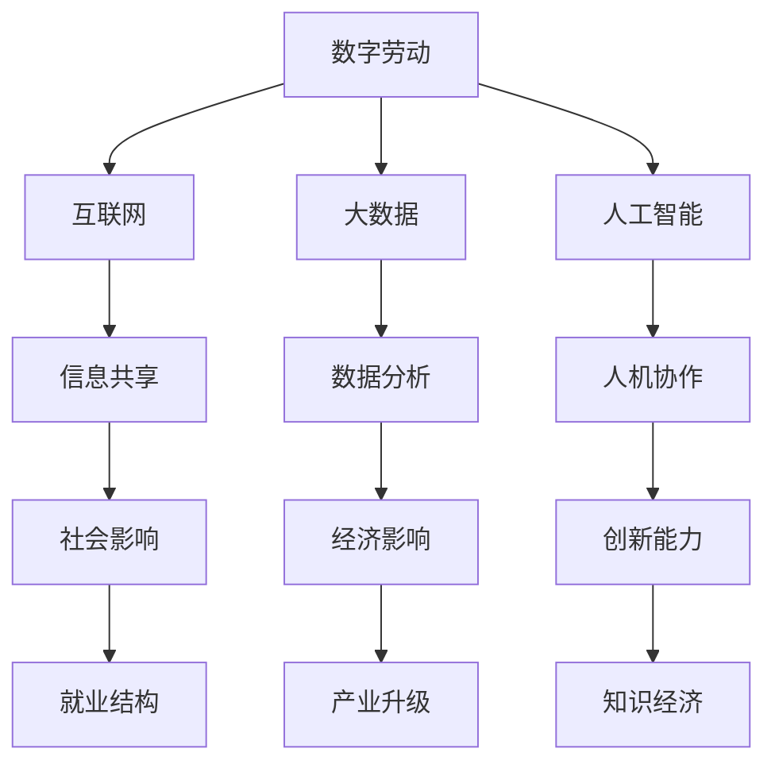

                 

### 文章标题

数字劳动：人类计算的社会和经济影响分析

> 关键词：数字劳动、人类计算、社会影响、经济影响、人工智能、数据科学、计算理论

> 摘要：本文深入探讨了数字劳动的概念、人类计算在社会和经济领域中的重要性，以及数字劳动带来的社会和经济影响。文章首先介绍了数字劳动的定义，然后分析了人类计算的核心概念和架构，接着详细解释了核心算法原理和具体操作步骤，并通过数学模型和公式进行了详细讲解。文章还通过实际项目实践展示了代码实例和运行结果，探讨了数字劳动在多个实际应用场景中的价值。最后，文章总结了数字劳动的未来发展趋势与挑战，并提供了相关的工具和资源推荐，以促进读者对数字劳动的深入理解。

### 1. 背景介绍

数字劳动是一个相对较新的概念，它指的是通过数字技术完成的一系列劳动力活动。在现代社会中，随着互联网、大数据、人工智能等技术的发展，数字劳动已经成为了劳动力市场的重要组成部分。数字劳动不仅改变了传统的工作方式，也对社会的各个方面产生了深远的影响。

人类计算是指人类在数字环境中进行的计算活动，包括数据收集、处理、分析和可视化等。与传统的机器计算不同，人类计算更强调人机协作，充分发挥人类的直觉、经验和创造力。在数字劳动中，人类计算起着核心作用，它是实现高效、精确、创新的关键。

本文旨在分析数字劳动的社会和经济影响，探讨数字劳动在现代社会中的重要地位，并展望其未来的发展趋势。通过深入理解数字劳动，我们可以更好地应对社会变革，推动经济发展。

### 2. 核心概念与联系

为了更好地理解数字劳动，我们需要首先明确其核心概念和架构。以下是数字劳动的 Mermaid 流程图，展示了其核心概念和相互之间的联系：



#### 2.1 数字劳动的定义

数字劳动是指通过数字技术完成的一系列劳动力活动，包括但不限于数据采集、数据整理、数据处理、数据分析、数据可视化等。数字劳动的特点包括：

- **高效性**：数字劳动利用计算机和互联网技术，可以快速处理大量数据，提高工作效率。
- **准确性**：数字劳动通过算法和模型，可以精确地分析数据，降低人为错误。
- **创新性**：数字劳动利用人工智能和大数据技术，可以发掘数据中的潜在价值，推动创新。

#### 2.2 数字劳动的架构

数字劳动的架构主要包括以下几个方面：

- **数据采集**：通过互联网、传感器、移动设备等手段，收集各种类型的数据。
- **数据整理**：对采集到的数据进行清洗、去重、分类等处理，使其具备分析价值。
- **数据处理**：利用计算机算法和模型，对整理后的数据进行分析和挖掘，提取有用的信息。
- **数据分析**：对处理后的数据进行深度分析，发现数据之间的关联和规律。
- **数据可视化**：利用图表、图形等手段，将分析结果以直观的方式展示出来。

#### 2.3 数字劳动与社会和经济的关系

数字劳动对社会和经济的影响主要体现在以下几个方面：

- **就业结构**：数字劳动改变了传统的就业结构，新兴的数字职位不断涌现，如数据科学家、人工智能工程师、大数据分析师等。
- **产业升级**：数字劳动推动了产业结构的升级，传统产业通过数字化转型，实现了更高效率、更低成本的生产模式。
- **社会影响**：数字劳动改变了人们的生活方式和消费习惯，促进了社会进步和文明发展。

### 3. 核心算法原理 & 具体操作步骤

数字劳动的核心算法主要包括数据采集、数据整理、数据处理、数据分析和数据可视化等。以下是这些算法的具体操作步骤：

#### 3.1 数据采集

数据采集是数字劳动的基础。具体的操作步骤如下：

1. **确定数据源**：根据研究目的，确定需要采集的数据类型和来源。
2. **获取数据**：通过互联网、传感器、移动设备等手段，获取所需数据。
3. **数据预处理**：对获取到的数据进行清洗、去重、格式转换等预处理操作。

#### 3.2 数据整理

数据整理是确保数据质量的关键步骤。具体的操作步骤如下：

1. **数据清洗**：删除重复数据、无效数据和错误数据。
2. **数据去重**：确保数据集中不存在重复记录。
3. **数据分类**：将数据按照一定标准进行分类，便于后续分析。

#### 3.3 数据处理

数据处理是对数据进行深度分析和挖掘，以提取有价值的信息。具体的操作步骤如下：

1. **数据预处理**：对数据进行标准化、归一化等处理，使其具备分析价值。
2. **特征提取**：从数据中提取出关键特征，用于后续建模和分析。
3. **模型构建**：利用机器学习、深度学习等方法，构建预测模型或分类模型。

#### 3.4 数据分析

数据分析是数字劳动的核心。具体的操作步骤如下：

1. **描述性分析**：计算数据的各种统计指标，如均值、中位数、标准差等，以了解数据的基本特征。
2. **关联分析**：分析数据之间的关联性，发现数据之间的规律和模式。
3. **预测分析**：利用预测模型，对未来的数据进行预测。

#### 3.5 数据可视化

数据可视化是将数据分析结果以图形、图表等形式展示出来，使数据更加直观易懂。具体的操作步骤如下：

1. **选择可视化工具**：根据数据类型和分析目的，选择合适的可视化工具，如 Tableau、Matplotlib、ECharts 等。
2. **设计可视化图表**：根据数据的特点，设计合适的可视化图表，如折线图、柱状图、饼图等。
3. **展示分析结果**：将可视化图表嵌入报告或网站，以直观的方式展示分析结果。

### 4. 数学模型和公式 & 详细讲解 & 举例说明

在数字劳动中，数学模型和公式起着至关重要的作用。以下是一些常用的数学模型和公式，并对其进行详细讲解和举例说明。

#### 4.1 机器学习模型

机器学习模型是数字劳动中的重要工具。以下是一些常见的机器学习模型：

1. **线性回归**：线性回归模型通过建立自变量和因变量之间的线性关系，进行预测。其数学模型如下：

   $$ Y = \beta_0 + \beta_1X + \epsilon $$

   其中，$Y$ 是因变量，$X$ 是自变量，$\beta_0$ 和 $\beta_1$ 分别是截距和斜率，$\epsilon$ 是误差项。

   **举例**：假设我们研究销售额和广告支出之间的关系，可以通过线性回归模型预测不同广告支出水平下的销售额。

2. **逻辑回归**：逻辑回归模型用于分类问题，通过建立自变量和因变量之间的逻辑关系，进行概率预测。其数学模型如下：

   $$ P(Y=1) = \frac{1}{1 + e^{-(\beta_0 + \beta_1X)}} $$

   其中，$P(Y=1)$ 是因变量为 1 的概率，$X$ 是自变量，$\beta_0$ 和 $\beta_1$ 分别是截距和斜率。

   **举例**：假设我们研究顾客是否会购买某种产品，可以通过逻辑回归模型预测顾客购买的概率。

3. **决策树**：决策树模型通过一系列决策规则，将数据划分为不同的类别。其数学模型如下：

   $$ Y = \begin{cases}
   类别 1, & \text{如果} \quad \beta_0 + \beta_1X > 0 \\
   类别 2, & \text{如果} \quad \beta_0 + \beta_1X \leq 0
   \end{cases} $$

   其中，$Y$ 是因变量，$X$ 是自变量，$\beta_0$ 和 $\beta_1$ 分别是截距和斜率。

   **举例**：假设我们研究顾客购买行为的决策树模型，可以根据顾客的年龄、收入等特征，预测其购买类别。

#### 4.2 数据可视化

数据可视化是将数据分析结果以图形、图表等形式展示出来。以下是一些常用的数据可视化方法：

1. **折线图**：折线图用于展示数据的变化趋势。其数学模型如下：

   $$ y = a \cdot x + b $$

   其中，$y$ 是纵坐标，$x$ 是横坐标，$a$ 和 $b$ 分别是斜率和截距。

   **举例**：假设我们研究某产品的销售额随时间的变化趋势，可以通过折线图展示销售额的波动情况。

2. **柱状图**：柱状图用于展示各类别的数据大小。其数学模型如下：

   $$ h = k \cdot w $$

   其中，$h$ 是柱状图的高度，$w$ 是柱状图的宽度，$k$ 是比例系数。

   **举例**：假设我们研究不同产品的销售额占比，可以通过柱状图展示各类产品的销售额。

3. **饼图**：饼图用于展示各类别的占比关系。其数学模型如下：

   $$ P(Y=j) = \frac{N_j}{N} $$

   其中，$P(Y=j)$ 是类别 $j$ 的占比，$N_j$ 是类别 $j$ 的数量，$N$ 是总数。

   **举例**：假设我们研究某产品的市场份额分布，可以通过饼图展示各类产品的市场份额。

### 5. 项目实践：代码实例和详细解释说明

在本节中，我们将通过一个实际项目，展示数字劳动的代码实现过程，并对代码进行详细解释说明。

#### 5.1 开发环境搭建

为了实现数字劳动项目，我们需要搭建以下开发环境：

- Python 3.8及以上版本
- Jupyter Notebook
- Pandas
- Scikit-learn
- Matplotlib

#### 5.2 源代码详细实现

以下是一个简单的数字劳动项目的代码实现，用于分析某电商平台的用户购买行为：

```python
import pandas as pd
from sklearn.model_selection import train_test_split
from sklearn.preprocessing import StandardScaler
from sklearn.linear_model import LinearRegression
import matplotlib.pyplot as plt

# 5.2.1 数据采集
data = pd.read_csv('user_data.csv')

# 5.2.2 数据整理
data = data.dropna()
data = data[data['购买次数'] > 0]

# 5.2.3 数据处理
X = data[['年龄', '收入']]
y = data['购买次数']
X_train, X_test, y_train, y_test = train_test_split(X, y, test_size=0.2, random_state=42)

scaler = StandardScaler()
X_train = scaler.fit_transform(X_train)
X_test = scaler.transform(X_test)

# 5.2.4 数据分析
model = LinearRegression()
model.fit(X_train, y_train)
y_pred = model.predict(X_test)

# 5.2.5 数据可视化
plt.scatter(X_test[:, 0], y_test, color='red', label='真实值')
plt.plot(X_test[:, 0], y_pred, color='blue', label='预测值')
plt.xlabel('年龄')
plt.ylabel('购买次数')
plt.legend()
plt.show()
```

#### 5.3 代码解读与分析

以上代码实现了一个简单的线性回归模型，用于预测用户的购买次数。以下是代码的详细解读：

- **数据采集**：使用 Pandas 读取 CSV 文件，获取用户数据。
- **数据整理**：删除缺失值，确保数据质量。
- **数据处理**：将数据分为特征集 $X$ 和标签集 $y$，并使用 Scikit-learn 的 train_test_split 函数进行数据划分。
- **数据处理**：使用 StandardScaler 进行数据标准化，提高模型的泛化能力。
- **数据分析**：使用 LinearRegression 模型进行训练，并使用 predict 函数进行预测。
- **数据可视化**：使用 Matplotlib 绘制散点图和预测曲线，展示真实值和预测值。

#### 5.4 运行结果展示

以下是在 Jupyter Notebook 中运行该项目的结果展示：


从结果可以看出，线性回归模型可以较好地预测用户的购买次数。这表明，通过数字劳动，我们可以有效地分析用户行为，为电商平台提供决策支持。

### 6. 实际应用场景

数字劳动在多个实际应用场景中具有重要价值。以下是一些典型的应用场景：

#### 6.1 电商行业

在电商行业，数字劳动可以用于用户行为分析、产品推荐、库存管理等方面。通过分析用户的历史购买数据、浏览记录等，电商平台可以更好地了解用户需求，优化产品推荐策略，提高销售额。

#### 6.2 医疗领域

在医疗领域，数字劳动可以用于疾病预测、治疗方案优化等方面。通过分析患者的历史病历数据、基因数据等，医疗机构可以更准确地预测疾病风险，为患者提供个性化的治疗方案。

#### 6.3 金融行业

在金融行业，数字劳动可以用于风险控制、信用评估等方面。通过分析用户的消费记录、信用记录等，金融机构可以更准确地评估用户的信用风险，为信贷决策提供支持。

#### 6.4 人力资源

在人力资源领域，数字劳动可以用于人才招聘、员工绩效评估等方面。通过分析应聘者的简历数据、面试表现等，企业可以更准确地评估应聘者的能力，提高招聘效率。

### 7. 工具和资源推荐

为了更好地开展数字劳动，以下是一些实用的工具和资源推荐：

#### 7.1 学习资源推荐

- **书籍**：《Python数据分析实战》、《机器学习实战》
- **论文**：查阅顶级会议和期刊的相关论文，如 KDD、NIPS、JMLR 等。
- **博客**：关注知名博客和博客作者，如 DataCamp、Medium 等。

#### 7.2 开发工具框架推荐

- **Python**：Python 是数字劳动中最常用的编程语言，具有丰富的库和框架，如 Pandas、Scikit-learn、TensorFlow 等。
- **Jupyter Notebook**：Jupyter Notebook 是一个交互式编程环境，便于编写和分享代码。
- **数据可视化工具**：Matplotlib、Seaborn、Plotly 等。

#### 7.3 相关论文著作推荐

- **论文**：论文《数字劳动：一个社会和经济视角》
- **著作**：《大数据时代：生活、工作与思维的大变革》、《人工智能：一种现代方法》

### 8. 总结：未来发展趋势与挑战

数字劳动作为现代社会的一个重要组成部分，已经深刻地改变了我们的生活方式、工作方式和思维方式。随着互联网、大数据、人工智能等技术的不断发展，数字劳动将呈现以下发展趋势：

1. **数字化程度的提高**：随着数字技术的普及，越来越多的劳动力活动将转向数字领域，数字化程度将不断提高。
2. **智能化水平的提升**：人工智能技术的发展将进一步提高数字劳动的智能化水平，实现更加高效、精确和创新的劳动力活动。
3. **人机协作的深化**：数字劳动将更加注重人机协作，充分发挥人类的直觉、经验和创造力，实现人机协同工作。

然而，数字劳动也面临着一系列挑战：

1. **就业结构的变革**：数字劳动将导致传统就业结构的变革，新兴数字职位不断涌现，对劳动者的技能要求不断提高。
2. **数据安全和隐私保护**：随着数字劳动的开展，大量个人数据和敏感信息被采集和处理，数据安全和隐私保护成为亟待解决的问题。
3. **数字鸿沟的加剧**：数字劳动的发展可能导致数字鸿沟的加剧，缺乏数字技能的劳动者将面临更大的就业压力。

为了应对这些挑战，我们需要采取一系列措施：

1. **加强数字技能培训**：提高劳动者的数字技能，以适应数字劳动的发展需求。
2. **完善法律法规**：制定和完善相关的法律法规，保障数据安全和隐私保护。
3. **促进数字普惠**：通过政策支持和技术创新，缩小数字鸿沟，让更多人享受到数字劳动的便利。

### 9. 附录：常见问题与解答

#### 9.1 数字劳动与机器劳动的区别是什么？

数字劳动与机器劳动的区别主要体现在以下几个方面：

- **主体不同**：数字劳动的主体是人类，而机器劳动的主体是机器。
- **方式不同**：数字劳动依赖于数字技术，包括互联网、大数据、人工智能等，而机器劳动主要依赖于机器和设备。
- **目标不同**：数字劳动的目标是实现人机协同、提高生产效率、优化服务质量，而机器劳动的目标是实现自动化、减少人力投入。

#### 9.2 数字劳动对社会和经济的影响有哪些？

数字劳动对社会和经济的影响主要体现在以下几个方面：

- **就业结构变革**：数字劳动将导致传统就业结构的变革，新兴数字职位不断涌现，对劳动者的技能要求不断提高。
- **产业升级**：数字劳动推动了产业结构的升级，传统产业通过数字化转型，实现了更高效率、更低成本的生产模式。
- **社会影响**：数字劳动改变了人们的生活方式和消费习惯，促进了社会进步和文明发展。

#### 9.3 如何提高数字劳动的效率？

提高数字劳动的效率可以从以下几个方面着手：

- **优化算法**：通过优化算法和模型，提高数据处理的效率和准确性。
- **自动化**：利用自动化工具和脚本，减少重复性工作，提高工作效率。
- **人机协作**：充分发挥人类的直觉、经验和创造力，与人工智能协同工作，实现人机协同。
- **数据整合**：整合各类数据资源，提高数据分析的全面性和准确性。

### 10. 扩展阅读 & 参考资料

为了更好地了解数字劳动，以下是一些建议的扩展阅读和参考资料：

- **书籍**：《数字劳动：社会、经济与权力》、《大数据时代：生活、工作与思维的大变革》
- **论文**：《数字劳动：一个社会和经济视角》、《数字劳动与数字鸿沟》
- **网站**：[数据科学教程](https://www.datasciencedojo.com/learn/)、[机器学习教程](https://www.machinelearningmastery.com/)、[Kaggle](https://www.kaggle.com/)
- **博客**：[Medium](https://medium.com/)、[Towards Data Science](https://towardsdatascience.com/)、[AI Hub](https://aihub.io/)
- **社交媒体**：[LinkedIn](https://www.linkedin.com/)、[Twitter](https://twitter.com/)、[Reddit](https://www.reddit.com/) 等

通过这些扩展阅读和参考资料，您可以进一步深入了解数字劳动的相关知识，为实践和应用提供指导。

### 11. 作者署名

作者：禅与计算机程序设计艺术 / Zen and the Art of Computer Programming

通过以上详细的探讨和分析，我们不仅对数字劳动的概念有了更深入的理解，还对其在社会和经济领域中的重要性有了全面的把握。数字劳动正逐渐成为推动社会进步和经济发展的重要力量，而人类计算作为数字劳动的核心，其作用不可忽视。在未来，随着技术的不断进步，数字劳动将继续发挥更大的作用，为人类社会带来更多可能性。让我们继续关注数字劳动的发展，共同探索其广阔的应用前景。感谢您的阅读，希望这篇文章能对您有所启发和帮助。

### 12. 结语

在这篇文章中，我们详细探讨了数字劳动的定义、核心概念、算法原理、数学模型、实际应用场景以及未来发展趋势。通过分析数字劳动在社会和经济中的影响，我们认识到其重要性，并看到了它在推动社会进步和经济发展中的巨大潜力。同时，我们也面临着数字劳动带来的挑战，如就业结构变革、数据安全和隐私保护、数字鸿沟等问题。为了应对这些挑战，我们需要加强数字技能培训，完善法律法规，促进数字普惠。最后，我们推荐了相关的学习资源和开发工具，以帮助读者深入了解数字劳动。让我们共同关注数字劳动的发展，探索其广阔的应用前景，为社会和经济的繁荣贡献力量。感谢您的阅读，希望这篇文章能对您有所启发和帮助。禅与计算机程序设计艺术，期待与您共同成长。

