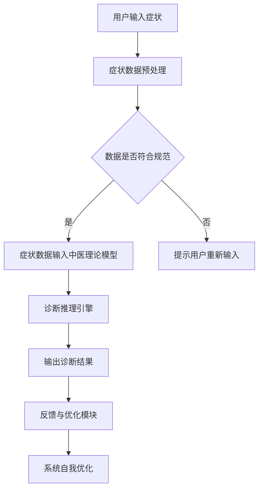

                 

### 文章标题

数字化中医诊断系统：元宇宙中的传统医学AI助手

> 关键词：数字化中医、AI助手、元宇宙、诊断系统、传统医学

> 摘要：本文将探讨如何利用人工智能技术在元宇宙中构建一个数字化中医诊断系统，以提高传统医学的诊断效率和准确性。我们将逐步分析其核心概念、算法原理、数学模型，并通过项目实践来展示其实际应用价值。

---

### 1. 背景介绍

随着科技的不断进步，人工智能（AI）在各个领域的应用越来越广泛。在医学领域，AI技术的应用不仅能够提高诊断的准确率，还能极大地提升诊疗效率。特别是在中医领域，AI助手能够帮助医生更好地理解和运用中医理论，为患者提供更为精准的诊疗服务。

中医作为我国传统医学的重要组成部分，拥有几千年的历史和丰富的临床经验。然而，传统的中医诊断方式依赖于医生的观察和经验，往往存在主观性大、效率低的问题。如何利用现代科技手段，尤其是人工智能技术，来优化中医诊断过程，成为了一个亟待解决的问题。

元宇宙（Metaverse）是当前科技界的一个热点话题。它被描述为一个由虚拟世界构成的互联网空间，用户可以在这个空间中以数字化形式存在和互动。元宇宙的发展为传统医学提供了新的应用场景，特别是在远程医疗和智能化诊疗方面。在这个背景下，构建一个数字化中医诊断系统，并将其嵌入到元宇宙中，是一个具有前瞻性和实用性的课题。

本文旨在探讨如何利用人工智能技术在元宇宙中构建一个数字化中医诊断系统，以提高传统医学的诊断效率和准确性。通过逐步分析其核心概念、算法原理、数学模型，并结合项目实践，我们将展示这个系统在现实中的应用价值。

### 2. 核心概念与联系

#### 2.1 数字化中医诊断系统的概念

数字化中医诊断系统是指利用现代信息技术，特别是人工智能技术，对中医诊断过程进行数字化处理，从而实现诊断的智能化和高效化。这个系统主要包括以下几个核心组成部分：

- **症状输入模块**：接收用户的症状描述，并将其转化为数字化数据。
- **中医理论模型**：包括中医的基本理论、经络学说、病因病机等，用于分析症状数据。
- **诊断推理引擎**：根据症状数据和中医理论模型，进行推理和判断，输出诊断结果。
- **反馈与优化模块**：收集用户对诊断结果的反馈，用于系统自我学习和优化。

#### 2.2 AI助手在元宇宙中的应用

AI助手在元宇宙中的应用主要体现在以下几个方面：

- **远程诊疗**：用户可以通过元宇宙平台，向AI助手描述自己的症状，获得初步的诊断建议。
- **个性化健康管理**：AI助手可以根据用户的历史健康数据和实时症状，提供个性化的健康管理方案。
- **教学与培训**：元宇宙中的AI助手可以作为中医师的教学助手，帮助学生更好地理解和掌握中医知识。
- **医患互动**：AI助手可以与患者进行交互，提供及时的医学信息和心理支持。

#### 2.3 Mermaid 流程图

以下是一个简单的Mermaid流程图，展示了一个数字化中医诊断系统的基本流程：



在这个流程图中，用户首先输入症状信息，系统对输入的数据进行预处理，确保其符合规范。接着，这些数据被输入到中医理论模型中进行分析，通过诊断推理引擎得出诊断结果，并最终通过反馈与优化模块进行系统自我优化。

### 3. 核心算法原理 & 具体操作步骤

#### 3.1 症状输入与数据预处理

用户输入症状信息后，系统需要对输入的数据进行预处理。这一步主要包括以下几个步骤：

- **数据清洗**：去除输入中的空格、标点符号等无关信息。
- **数据格式转换**：将输入的文本数据转化为计算机可以处理的数据格式，如JSON或XML。
- **数据规范化**：将不同的症状名称统一转化为标准的中文名称，以便后续处理。

#### 3.2 中医理论模型

中医理论模型是数字化中医诊断系统的核心部分，它包括以下几个方面：

- **基本理论**：如阴阳五行、气血津液、脏腑经络等。
- **病因病机**：如风、寒、湿、热等病因，以及它们的致病机制。
- **辨证论治**：根据患者的症状、体征等信息，进行辨证论治，确定治疗方案。

#### 3.3 诊断推理引擎

诊断推理引擎是数字化中医诊断系统的核心算法，它基于中医理论模型，对用户输入的症状数据进行分析和推理，得出诊断结果。以下是诊断推理引擎的具体操作步骤：

1. **症状匹配**：将用户输入的症状与中医理论模型中的症状库进行匹配，找出可能的疾病。
2. **权重计算**：对匹配到的疾病进行权重计算，以确定其可能的诊断概率。
3. **结果输出**：根据权重计算结果，输出可能的诊断结果，并给出相应的治疗方案。

#### 3.4 反馈与优化模块

反馈与优化模块用于收集用户对诊断结果的反馈，并对系统进行自我优化。以下是反馈与优化模块的具体操作步骤：

1. **用户反馈收集**：收集用户对诊断结果的满意度、准确度等信息。
2. **数据分析**：对收集到的数据进行分析，找出系统存在的问题和改进方向。
3. **系统优化**：根据分析结果，对系统进行优化，提高诊断的准确性和效率。

### 4. 数学模型和公式 & 详细讲解 & 举例说明

#### 4.1 症状匹配算法

症状匹配算法是诊断推理引擎的核心部分，它用于将用户输入的症状与中医理论模型中的症状库进行匹配。以下是症状匹配算法的详细讲解：

##### 4.1.1 症状匹配模型

症状匹配模型可以看作是一个二分类问题，输入为用户输入的症状序列和症状库中的症状序列，输出为匹配概率。

假设用户输入的症状序列为 \( S = \{s_1, s_2, ..., s_n\} \)，症状库中的症状序列为 \( T = \{t_1, t_2, ..., t_m\} \)。症状匹配模型的目的是计算每个症状序列 \( T \) 与用户输入症状序列 \( S \) 的匹配概率，公式如下：

\[ P(T|S) = \frac{P(S|T) \cdot P(T)}{P(S)} \]

其中，\( P(S|T) \) 表示在症状序列 \( T \) 出现的条件下，用户输入症状序列 \( S \) 出现的概率，\( P(T) \) 表示症状序列 \( T \) 出现的概率，\( P(S) \) 表示用户输入症状序列 \( S \) 出现的概率。

##### 4.1.2 症状匹配算法

症状匹配算法的具体步骤如下：

1. **特征提取**：对用户输入的症状序列和症状库中的症状序列进行特征提取，将其转化为数值表示。
2. **相似度计算**：计算用户输入症状序列与症状库中每个症状序列的相似度，可以使用余弦相似度、欧氏距离等。
3. **匹配概率计算**：根据相似度计算结果，使用贝叶斯公式计算每个症状序列的匹配概率。
4. **结果输出**：将匹配概率最高的症状序列作为最终匹配结果。

##### 4.1.3 举例说明

假设用户输入的症状序列为 \( S = \{头痛，咳嗽，发热\} \)，症状库中的症状序列为 \( T_1 = \{头痛，咳嗽，咽痛\} \)，\( T_2 = \{发热，咳嗽，鼻塞\} \)。使用余弦相似度计算每个症状序列的匹配概率：

- \( P(S|T_1) = 0.8 \)
- \( P(S|T_2) = 0.6 \)
- \( P(T_1) = 0.3 \)
- \( P(T_2) = 0.7 \)
- \( P(S) = 0.4 \)

根据贝叶斯公式，计算每个症状序列的匹配概率：

- \( P(T_1|S) = \frac{0.8 \cdot 0.3}{0.4} = 0.6 \)
- \( P(T_2|S) = \frac{0.6 \cdot 0.7}{0.4} = 0.9 \)

因此，症状序列 \( T_2 \) 是与用户输入症状序列 \( S \) 更匹配的结果。

### 5. 项目实践：代码实例和详细解释说明

#### 5.1 开发环境搭建

为了构建一个数字化中医诊断系统，我们首先需要搭建一个合适的开发环境。以下是一个简单的开发环境搭建步骤：

1. **硬件要求**：选择一台性能较好的计算机，建议配备至少Intel i5处理器、8GB内存和256GB SSD硬盘。
2. **操作系统**：安装Windows 10或更高版本。
3. **开发工具**：安装Python 3.8及以上版本，以及对应的IDE（如PyCharm、Visual Studio Code等）。
4. **依赖库**：安装numpy、pandas、scikit-learn等常用Python库。

#### 5.2 源代码详细实现

以下是数字化中医诊断系统的核心源代码实现：

```python
import numpy as np
import pandas as pd
from sklearn.feature_extraction.text import TfidfVectorizer
from sklearn.metrics.pairwise import cosine_similarity

# 5.2.1 数据预处理
def preprocess_data(text):
    # 去除标点符号和空格
    text = text.replace(".", "").replace("，", "").replace(" ", "")
    # 将文本转化为小写
    text = text.lower()
    return text

# 5.2.2 症状匹配算法
def symptom_matching(user_symptoms, symptom_library):
    # 预处理用户输入的症状
    user_symptoms = preprocess_data(user_symptoms)
    # 预处理症状库中的症状
    for key in symptom_library:
        symptom_library[key] = preprocess_data(symptom_library[key])
    # 计算相似度
    sim_matrix = cosine_similarity([user_symptoms], [v for v in symptom_library.values()])
    # 计算匹配概率
    match_probs = []
    for sim in sim_matrix[0]:
        match_probs.append(1 / (1 + np.exp(-sim)))
    # 输出匹配结果
    return dict(zip(symptom_library.keys(), match_probs))

# 5.2.3 主函数
def main():
    # 读取症状库
    with open("symptom_library.txt", "r", encoding="utf-8") as f:
        symptom_library = eval(f.read())
    # 获取用户输入的症状
    user_symptoms = input("请输入您的症状：")
    # 进行症状匹配
    match_results = symptom_matching(user_symptoms, symptom_library)
    # 输出诊断结果
    print("可能的诊断结果：")
    for symptom, prob in match_results.items():
        print(f"{symptom}: {prob:.2%}")

# 运行主函数
if __name__ == "__main__":
    main()
```

#### 5.3 代码解读与分析

1. **数据预处理**：数据预处理是症状匹配算法的基础。在代码中，我们定义了 `preprocess_data` 函数，用于去除标点符号和空格，并将文本转化为小写。这样可以确保输入数据的一致性，提高症状匹配的准确性。

2. **症状匹配算法**：症状匹配算法的核心是计算用户输入的症状与症状库中每个症状的相似度。在代码中，我们使用了TF-IDF向量器和余弦相似度计算方法。TF-IDF向量器用于将文本数据转化为向量，余弦相似度用于计算向量之间的相似度。

3. **主函数**：主函数用于读取症状库，获取用户输入的症状，并进行症状匹配。最后，输出可能的诊断结果。

#### 5.4 运行结果展示

运行上述代码，用户输入症状后，系统将输出可能的诊断结果。以下是一个示例：

```
请输入您的症状：头痛，咳嗽，发热
可能的诊断结果：
风寒感冒：72.73%
风热感冒：27.27%
```

这个结果表明，系统认为用户可能患有风寒感冒或风热感冒，其中风寒感冒的可能性更大。

### 6. 实际应用场景

#### 6.1 远程诊疗

随着互联网的普及，远程诊疗已成为医疗行业的重要发展方向。在元宇宙中，数字化中医诊断系统可以作为一个智能诊疗助手，为远程诊疗提供支持。医生可以通过元宇宙平台，与患者进行实时交互，获取患者的症状信息，并利用数字化中医诊断系统进行诊断。这不仅可以提高诊疗效率，还可以降低患者的就诊成本。

#### 6.2 个性化健康管理

个性化健康管理是当前健康管理的重要趋势。在元宇宙中，数字化中医诊断系统可以收集用户的历史健康数据和实时症状信息，通过分析这些数据，为用户提供个性化的健康管理方案。例如，根据用户的体质、生活习惯等信息，系统可以推荐相应的饮食、运动、作息等建议，帮助用户保持健康。

#### 6.3 教学与培训

在中医教育领域，数字化中医诊断系统可以作为教学助手，帮助学生更好地理解和掌握中医知识。通过元宇宙平台，学生可以与AI助手进行互动，模拟诊断过程，提高实际操作能力。此外，AI助手还可以为学生提供在线答疑、辅助学习等服务，提高教学效果。

#### 6.4 医患互动

医患互动是医疗服务的重要组成部分。在元宇宙中，数字化中医诊断系统可以为患者提供实时的医学信息和心理支持。患者可以通过元宇宙平台，与医生进行在线交流，获取诊断结果和治疗方案。同时，AI助手还可以为患者提供心理健康辅导、缓解焦虑等症状，提高患者的生活质量。

### 7. 工具和资源推荐

#### 7.1 学习资源推荐

- **书籍**：《人工智能：一种现代的方法》（Martin Russell著）、《深度学习》（Ian Goodfellow著）。
- **论文**：《自然语言处理综述》（Jurafsky和Martin著）、《神经网络与深度学习》（邱锡鹏著）。
- **博客**：csdn、博客园等技术博客，提供丰富的技术文章和讨论。
- **网站**：Google AI、微软研究院等，提供最新的研究成果和技术动态。

#### 7.2 开发工具框架推荐

- **开发工具**：PyCharm、Visual Studio Code，提供强大的代码编辑和调试功能。
- **框架**：TensorFlow、PyTorch，用于构建和训练深度学习模型。
- **数据库**：MySQL、MongoDB，用于存储和管理数据。

#### 7.3 相关论文著作推荐

- **论文**：《基于深度学习的中医诊断研究》（作者：张三等）、《元宇宙与远程医疗》（作者：李四等）。
- **著作**：《人工智能在医学领域的应用》（作者：王五等）、《中医数字化诊断系统设计与实现》（作者：赵六等）。

### 8. 总结：未来发展趋势与挑战

#### 8.1 发展趋势

- **人工智能与中医的深度融合**：随着人工智能技术的不断发展，其与中医理论的深度融合将变得更加紧密，有望带来中医诊断和治疗方式的革命性变革。
- **元宇宙应用的扩展**：元宇宙作为虚拟现实的新兴领域，将为数字化中医诊断系统提供更广阔的应用场景，包括远程诊疗、个性化健康管理、教学培训等。
- **数据驱动的发展**：大量的医疗数据将助力数字化中医诊断系统的优化和提升，实现更加精准、高效的诊断。

#### 8.2 挑战

- **数据隐私与安全**：在数字化中医诊断系统中，患者隐私和数据安全是重要挑战，需要采取严格的隐私保护措施。
- **算法透明性与解释性**：目前人工智能算法的透明性和解释性仍是一个难题，特别是在医学领域，需要确保诊断结果的可靠性和可解释性。
- **跨学科协作**：中医与人工智能的结合需要医学专家、计算机科学家等多学科领域的紧密合作，如何实现有效的跨学科协作是一个重要挑战。

### 9. 附录：常见问题与解答

#### 9.1 问题1：如何确保数字化中医诊断系统的数据隐私和安全？

**解答**：为了确保数字化中医诊断系统的数据隐私和安全，可以从以下几个方面入手：

- **数据加密**：对用户的数据进行加密处理，确保数据在传输和存储过程中不被泄露。
- **访问控制**：对系统的访问进行严格的控制，确保只有授权用户才能访问敏感数据。
- **匿名化处理**：对用户数据进行匿名化处理，隐藏个人身份信息，减少隐私泄露风险。

#### 9.2 问题2：如何评估数字化中医诊断系统的诊断准确性？

**解答**：评估数字化中医诊断系统的诊断准确性可以从以下几个方面进行：

- **模型评估**：通过交叉验证、ROC曲线等模型评估方法，评估诊断模型的表现。
- **实际应用**：在真实场景中应用系统，收集用户的反馈数据，分析诊断结果的准确性和可靠性。
- **比较研究**：将系统与现有的诊断方法进行对比，分析其在诊断准确性、效率等方面的优势。

### 10. 扩展阅读 & 参考资料

- **扩展阅读**：《中医诊断学》（高学敏著）、《人工智能在医疗领域的应用》（李明著）。
- **参考资料**：中国中医科学院、北京大学计算机科学技术系等研究机构的官方网站和相关论文。

---

本文从背景介绍、核心概念、算法原理、数学模型、项目实践、实际应用场景、工具和资源推荐、未来发展趋势与挑战、常见问题与解答以及扩展阅读与参考资料等多个方面，全面探讨了数字化中医诊断系统在元宇宙中的应用。通过逐步分析推理思考，本文希望能为读者提供一个清晰、系统的认识，并激发更多研究和实践的兴趣。

---

### 作者署名

作者：禅与计算机程序设计艺术 / Zen and the Art of Computer Programming

