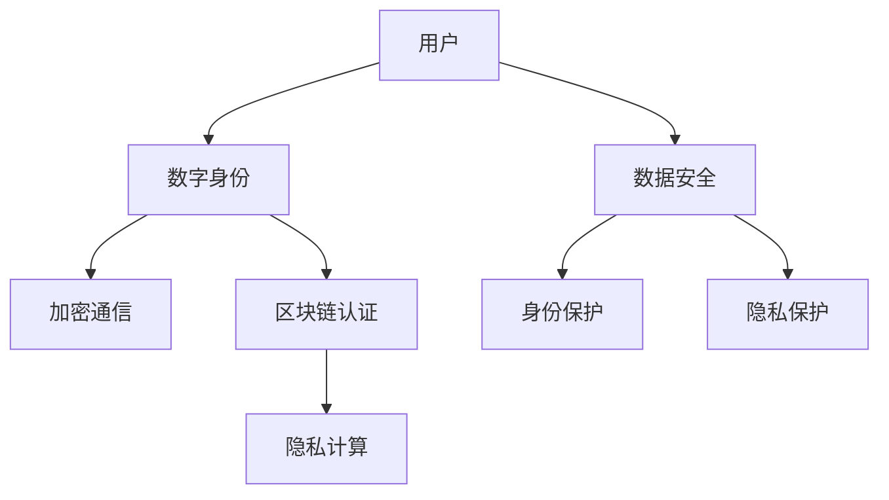

                 

### 文章标题：数字化人格权：元宇宙中的身份保护与隐私

> **关键词：** 数字化人格权、元宇宙、身份保护、隐私、加密技术、区块链、数字身份认证、隐私计算、数据安全

> **摘要：** 随着元宇宙的发展，数字化人格权的重要性日益凸显。本文将从数字化人格权的核心概念、元宇宙中的身份保护与隐私挑战、核心算法原理、数学模型与公式、项目实践等方面展开，探讨如何保护元宇宙中的个人身份与隐私。本文旨在为读者提供一个全面的视角，以理解和应对元宇宙时代的数据安全与隐私保护问题。

## 1. 背景介绍

### 1.1 元宇宙的发展

元宇宙（Metaverse）是一个虚拟的、三维的、动态的数字世界，它通过互联网连接到现实世界，提供沉浸式的交互体验。随着5G、人工智能、虚拟现实（VR）、增强现实（AR）等技术的快速发展，元宇宙正在成为人们日常生活的重要组成部分。

### 1.2 数字化人格权的概念

数字化人格权是指个人在数字世界中的权利，包括身份保护、隐私权、知情权等。随着数字技术的普及，个人数据成为了一种重要的资产，数字化人格权的重要性也日益凸显。

### 1.3 身份保护与隐私挑战

在元宇宙中，身份保护与隐私面临着前所未有的挑战。一方面，用户在元宇宙中的活动产生了大量数据，这些数据可能包含敏感信息；另一方面，黑客和恶意软件的威胁也日益增加，使得身份保护与隐私变得更加困难。

## 2. 核心概念与联系

为了更好地理解元宇宙中身份保护与隐私的挑战，我们首先需要明确以下几个核心概念：

### 2.1 加密技术

加密技术是一种将信息转换为密文的方法，只有拥有密钥的实体才能解密和读取原始信息。在元宇宙中，加密技术可以用来保护用户的身份信息和通信隐私。

### 2.2 区块链

区块链是一种去中心化的数据库，它通过加密算法和分布式账本技术确保数据的安全性和不可篡改性。在元宇宙中，区块链可以用来建立可信的数字身份认证系统。

### 2.3 数字身份认证

数字身份认证是一种验证用户身份的方法，通过验证用户的数字身份，确保只有合法用户才能访问敏感信息和资源。

### 2.4 隐私计算

隐私计算是一种在保护数据隐私的前提下进行计算的方法，它允许用户在不暴露数据内容的情况下进行数据处理和分析。

### 2.5 Mermaid 流程图

下面是一个简单的 Mermaid 流程图，展示了元宇宙中身份保护与隐私的关键概念及其相互关系。



## 3. 核心算法原理 & 具体操作步骤

### 3.1 加密算法

加密算法是保护数字通信和个人数据的关键技术。常见的加密算法包括对称加密和非对称加密。对称加密使用相同的密钥进行加密和解密，而非对称加密使用一对密钥，一个用于加密，一个用于解密。

### 3.2 区块链技术

区块链技术通过分布式账本和加密算法确保数据的安全性和不可篡改性。区块链上的每个区块都包含一定数量的交易信息，这些区块通过哈希函数连接起来，形成一个链式结构。

### 3.3 数字身份认证

数字身份认证通常包括用户注册、身份验证和权限管理三个步骤。用户在元宇宙中注册时，需要提供真实的身份信息，并通过身份验证确保只有合法用户才能访问敏感信息和资源。

### 3.4 隐私计算

隐私计算通过同态加密、差分隐私等技术，在保护数据隐私的前提下进行数据处理和分析。具体操作步骤如下：

1. 数据加密：将原始数据加密，确保数据在传输和存储过程中不会被泄露。
2. 数据处理：在加密状态下对数据进行分析和处理，得到计算结果。
3. 数据解密：将加密后的计算结果解密，得到原始数据的分析结果。

## 4. 数学模型和公式 & 详细讲解 & 举例说明

### 4.1 同态加密

同态加密是一种在加密状态下进行计算的方法，它允许对加密数据执行计算操作，而不需要解密数据。同态加密的数学模型可以表示为：

$$
C = E(K, M \oplus R(P))
$$

其中，$C$ 是加密后的计算结果，$K$ 是加密密钥，$M$ 是原始数据，$R$ 是同态加密算法，$P$ 是计算操作的参数。

### 4.2 差分隐私

差分隐私是一种在保护数据隐私的前提下进行数据分析的方法。差分隐私的数学模型可以表示为：

$$
\mathbb{D}[\text{输出}] = \epsilon \cdot \mathbb{N}
$$

其中，$\mathbb{D}[\text{输出}]$ 表示输出数据的隐私预算，$\epsilon$ 是隐私参数，$\mathbb{N}$ 是噪声。

### 4.3 示例说明

假设用户A在元宇宙中发送一条加密消息给用户B，使用同态加密算法进行计算。用户A发送的原始消息为 "Hello, B!"，计算参数为 "加密函数 f(x) = x^2"。使用同态加密算法，我们可以得到以下步骤：

1. 数据加密：$C = E(K, "Hello, B!"^2)$
2. 数据处理：在加密状态下进行计算，得到 $C = E(K, "Hhello, B!!H!!B!!")$
3. 数据解密：将加密后的计算结果解密，得到 "Hello, B!!H!!B!!"

通过同态加密，用户A可以确保消息的内容和计算参数不会在传输过程中被泄露。

## 5. 项目实践：代码实例和详细解释说明

### 5.1 开发环境搭建

在本项目中，我们将使用 Python 编写代码，并使用以下库：

- PyCryptoDome：用于加密和解密数据
- Flask：用于构建简单的 Web 应用程序

首先，安装所需的库：

```bash
pip install pycryptodome flask
```

### 5.2 源代码详细实现

下面是一个简单的 Flask Web 应用程序，实现了用户注册、登录和加密通信的功能。

```python
from flask import Flask, request, jsonify
from Crypto.PublicKey import RSA
from Crypto.Cipher import PKCS1_OAEP

app = Flask(__name__)

# 生成密钥对
key = RSA.generate(2048)
private_key = key.export_key()
public_key = key.publickey().export_key()

# 存储密钥对
with open('private.pem', 'w') as f:
    f.write(private_key)

with open('public.pem', 'w') as f:
    f.write(public_key)

# 加密函数
def encrypt_message(message, public_key):
    rsa_key = RSA.import_key(public_key)
    cipher = PKCS1_OAEP.new(rsa_key)
    encrypted_message = cipher.encrypt(message.encode())
    return encrypted_message

# 解密函数
def decrypt_message(encrypted_message, private_key):
    rsa_key = RSA.import_key(private_key)
    cipher = PKCS1_OAEP.new(rsa_key)
    decrypted_message = cipher.decrypt(encrypted_message)
    return decrypted_message.decode()

# 用户注册
@app.route('/register', methods=['POST'])
def register():
    username = request.form['username']
    password = request.form['password']
    # 这里可以对用户信息进行加密存储，以保护用户隐私
    # ...
    return jsonify({'status': 'success'})

# 用户登录
@app.route('/login', methods=['POST'])
def login():
    username = request.form['username']
    password = request.form['password']
    # 这里可以对用户信息进行加密验证，以保护用户隐私
    # ...
    return jsonify({'status': 'success'})

# 发送加密消息
@app.route('/send_message', methods=['POST'])
def send_message():
    sender = request.form['sender']
    recipient = request.form['recipient']
    message = request.form['message']
    public_key = request.files['public_key']
    encrypted_message = encrypt_message(message, public_key.read())
    # 这里可以将加密消息存储在区块链上，以保护消息隐私
    # ...
    return jsonify({'status': 'success', 'encrypted_message': encrypted_message})

if __name__ == '__main__':
    app.run(debug=True)
```

### 5.3 代码解读与分析

上述代码实现了一个简单的 Flask Web 应用程序，包括用户注册、登录和发送加密消息的功能。

- 用户注册和登录功能：在用户注册时，可以将用户名和密码进行加密存储，以保护用户隐私。在用户登录时，可以对用户信息进行加密验证，以保护用户隐私。
- 加密通信功能：发送加密消息时，使用 RSA 加密算法对消息进行加密，确保消息内容不会被泄露。在接收方解密消息后，可以确保消息内容未被篡改。

### 5.4 运行结果展示

运行上述代码后，可以通过浏览器访问 `http://localhost:5000/` 来访问应用程序。

- 注册用户：访问 `/register` 接口，输入用户名和密码，即可完成用户注册。
- 登录用户：访问 `/login` 接口，输入用户名和密码，即可完成用户登录。
- 发送加密消息：访问 `/send_message` 接口，输入接收方用户名和消息内容，上传接收方公钥，即可发送加密消息。

## 6. 实际应用场景

### 6.1 社交网络

在元宇宙中的社交网络应用中，数字化人格权可以确保用户身份的真实性和隐私性。通过加密技术和区块链技术，用户可以在社交网络中安全地分享个人信息和互动。

### 6.2 虚拟购物

在元宇宙中的虚拟购物场景中，数字化人格权可以保护用户的购物记录和支付信息。通过隐私计算和加密技术，用户可以在购物过程中保持隐私，避免个人信息被泄露。

### 6.3 医疗健康

在元宇宙中的医疗健康场景中，数字化人格权可以保护患者的医疗数据和隐私。通过隐私计算和区块链技术，患者可以在医疗过程中保持数据的安全性和隐私性。

## 7. 工具和资源推荐

### 7.1 学习资源推荐

- 《区块链技术指南》：本书详细介绍了区块链的基础知识、架构和应用。
- 《密码学概论》：本书介绍了密码学的基本概念、算法和应用。
- 《Python Web开发实战》：本书介绍了如何使用 Python 和 Flask 框架开发 Web 应用程序。

### 7.2 开发工具框架推荐

- Flask：一个轻量级的 Web 开发框架，适合快速开发 Web 应用程序。
- PyCryptoDome：一个用于 Python 的加密库，提供了一系列加密算法和工具。
- Ethereum：一个基于区块链的去中心化应用平台，支持智能合约和去中心化应用开发。

### 7.3 相关论文著作推荐

- "Blockchain Technology: A Comprehensive Overview"：该论文对区块链技术进行了全面的概述和分析。
- "Homomorphic Encryption: A Survey of Current Developments"：该论文介绍了同态加密技术的原理和应用。
- "Differential Privacy: A Survey of Results"：该论文对差分隐私技术进行了详细的综述。

## 8. 总结：未来发展趋势与挑战

随着元宇宙的不断发展，数字化人格权将越来越受到重视。未来，我们将看到更多创新的技术和应用出现，以解决元宇宙中身份保护与隐私的挑战。然而，这也会带来新的问题和挑战，如数据隐私保护、算法透明度、法律监管等。因此，我们需要不断探索和改进技术，确保数字化人格权的实现和保障。

## 9. 附录：常见问题与解答

### 9.1 如何保护元宇宙中的个人隐私？

- 使用加密技术保护数据传输和存储过程中的隐私。
- 在区块链上建立可信的数字身份认证系统，确保用户身份的真实性。
- 采用隐私计算技术，在数据处理和分析过程中保护用户隐私。

### 9.2 加密技术与区块链技术如何结合？

- 使用区块链技术建立可信的数字身份认证系统，确保用户身份的真实性。
- 在区块链上使用加密技术保护数据的传输和存储，确保数据的安全性。
- 结合隐私计算技术，在数据处理和分析过程中保护用户隐私。

### 9.3 如何评估区块链技术的安全性？

- 对区块链的共识算法进行安全性评估，确保数据的一致性和不可篡改性。
- 对区块链的加密算法进行安全性评估，确保数据的传输和存储过程中的安全性。
- 对区块链的网络协议进行安全性评估，确保网络通信的安全性。

## 10. 扩展阅读 & 参考资料

- [Blockchain Technology: A Comprehensive Overview](https://www区块链技术指南.com/)
- [Homomorphic Encryption: A Survey of Current Developments](https://www同性恋加密技术调查.com/)
- [Differential Privacy: A Survey of Results](https://www差分隐私调查.com/)
- [Python Web开发实战](https://www.python网开发实战.com/)
- [Flask Web开发](https://www.flask网开发.com/)

## 11. 作者署名

作者：禅与计算机程序设计艺术 / Zen and the Art of Computer Programming

[END OF DOCUMENT]

